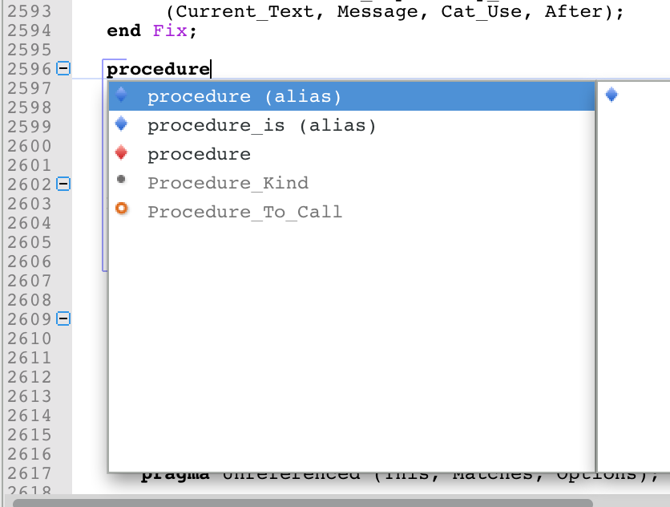
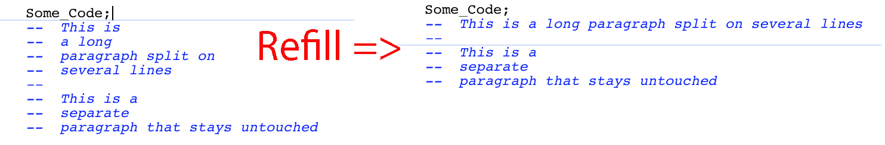

Enhancements to editors
-----------------------

Aliases expansion directly in editors
~~~~~~~~~~~~~~~~~~~~~~~~~~~~~~~~~~~~~

.. NF-60-M411-022 GPS: Aliases expansion directly in editor (2013-06-01)

The aliases expansion feature now works directly in-editor, without presenting
the user a dialog for aliases with parameters. The user progresses through the
fields directly in the editor via the :kbd:`Ctrl+Tab` shortcut. Visual feedback
is provided for the current field via highlighting.

Status bars
~~~~~~~~~~~

..  NF-60-M710-029 GPS: display size of selection in editors (2013-07-10)

When a selection exists in an editor, the status bar will display the number of
characters and lines that are selected.

..  NF-60-M806-016 GPS: reorganize editor status bars (2013-08-06)

The order of buttons and text in the status bar was modified to avoid
flickering when the location is changed or a selection is made.

Syntax highlighting
~~~~~~~~~~~~~~~~~~~

..  NF-60-M712-004 GPS: syntax highlighting of aspects (2013-07-29)

Ada 2012 and SPARK 2014 aspects are highlighted with a different color
configurable via the preferences, so that these are easily found when editing
source files.

..  NF-60-M710-010 GPS: highlighting of numeric values (2013-07-29)

GPS now supports highlighting of numeric values in the code editor and provides
a new user preference to customize it.

Smart-completion
~~~~~~~~~~~~~~~~

Smart-completion on aliases
...........................

.. NF-60-H603-006 GPS: Aliases auto completion (2013-04-11)

Aliases can now be completed and expanded by the regular smart-completion
mechanism.

   Smart completion for aliases

Visual indication of visibility
...............................

.. NF-60-H605-006 GPS: Visual indication of completions visibility (2013-04-16)

In the smart completion popup, entities that are not visible in the current
scope are now displayed in grey.

Completion for return blocks
~~~~~~~~~~~~~~~~~~~~~~~~~~~~

.. NF-60-M129-002 GPS: return block completion (2013-02-04)

Add "return ... end return;" statement support for complete block completion

Indentation
~~~~~~~~~~~

Improved indentation of conditional expressions
...............................................

..  NF-60-M424-019 Improved indentation of conditional expressions (2013-05-17)

Ada 2012 If-expressions and case-expressions are better handled by the
indentation engine and in particular extra indentation levels are used for
each case branch.

Improved indentation of parenthesized expressions
.................................................

..  NF-60-M524-041 Improved indentation of parenthesized expressions (2013-06-20)

Extra spaces following an open parenthesis is now taken into account when
indenting Ada code.

Refill automatically computes paragraphs
~~~~~~~~~~~~~~~~~~~~~~~~~~~~~~~~~~~~~~~~

..  NF-60-M111-033 GPS: Refill automatically computes paragraph (2013-01-11)

The menu :menuselection:`Edit-->Selection-->Refill` will now either apply to
the current selection if it exists (as before), or automatically compute the
extents of the current paragraph to reformat (instead of only applying to the
current line).

   Refill computes the bounds of the paragraph

..  NF-60-M814-011 GPS: Enhanced Edit/Selection/Refill behavior (2013-10-07)

When refilling a comment block with the :guilabel:`Refill` command, the cursor
will now be placed at the end of the last word of the comment, so as to enable
the user to keep editing his comment seamlessly.

Preserve location in new views
~~~~~~~~~~~~~~~~~~~~~~~~~~~~~~

When creating a new view for an editor (for instance through drag-and-drop) the
new view is now displayed at the same location as the original editor, rather
than on the first line.

Transluscent highlighting colors
~~~~~~~~~~~~~~~~~~~~~~~~~~~~~~~~

..  NF-60-M329-013 GPS: translucent highlighting colors (2013-03-29)

It is now possible to specify translucent colors for error messages,
current lines,... in the editors. This is a convenient solution so that
the current line also shows whether it has an associated error.

Safer saving of files
~~~~~~~~~~~~~~~~~~~~~

..  NF-60-M918-040 GPS: safer saving of files (2013-09-19)

Saving files is now done via a temporary file which is later renamed.
This is safer, and protects against temporary disk issues that would happen
just during the actual saving, and could result in losing work.
