Changes to the user interface
------------------------------

This release of GPS is based on a major new release of the gtk+
toolkit. We took the opportunity to make various enhancements to
the user interface itself.

..  missing    NC-60-LB29-021 remove status bar
    NF-53-M102-006 GPS: move Serialize to /Edit/Rectangle/
    NF-60-M108-041 GPS: line wrapping in Messages window

Local toolbars
~~~~~~~~~~~~~~

A number of views now have a local toolbar. They also display their
configuration settings in a local menu rather than in the :file:`Preferences`
dialog or the contextual menu.

.. figure:: locations_toolbar.png
   :class: screenshot
   :scale: 100%

   Local toolbar in the Locations window

..  this is   NF-60-LC06-024 GPS: Locations view has a toolbar (2012-12-06)

In the :file:`Locations` view, actions such as `clear locations`, or the filter
panel were moved into that toolbar to make them more accessible. The
preference `Auto Jump To First Location` was removed from the preferences menu
and moved to the toolbar as well.

Global search field in the toolbar
~~~~~~~~~~~~~~~~~~~~~~~~~~~~~~~~~~

A search field is now provided, which will look simultaneously in various
context (source file names, entities,...). You can optionally restrict the
search to specific contexts to view all possible matches in this context.

This field replaces the two dialogs `/File/Open File From Project` and
`/Navigate/Goto Entity...`. The menus are still available, but the actual
search is done via the global search field.

..  This is NF-60-M606-028 GPS: remove Open From Project dialog
..  and NF-60-M603-060 GPS: remove Goto Entity dialog (2013-06-07)

The :file:`/Tools/Views/Entity` view was also removed since its features
are now available through the global search field.

..  This is Approximate search

Various modes are available, to search full text, regular expressions or
fuzzy matches. In particular, when searching in source code, GPS is able
to do approximate search. For instance, searching for "saerch" will also
match "search" when this mode is activated.

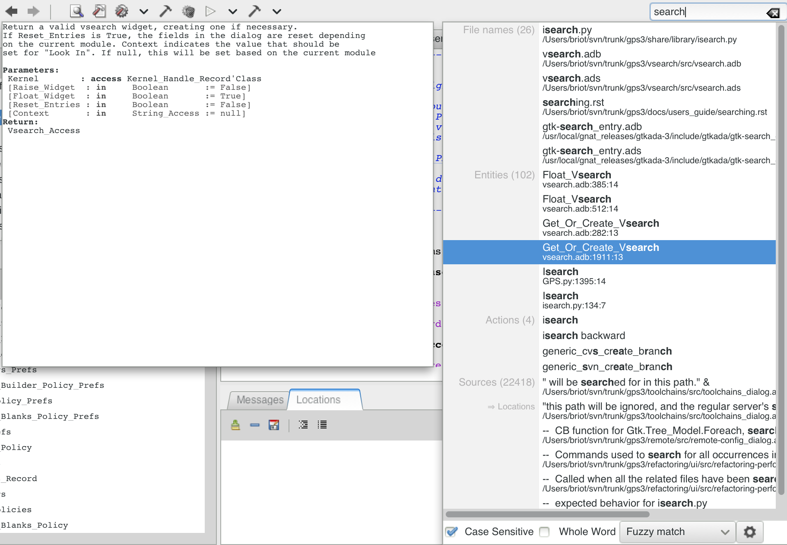

   Search in all contexts

Color schemes
~~~~~~~~~~~~~

A new preference is available to select color schemes. This effects other
preferences and can be used to set dark colors for the background of
editors and windows.

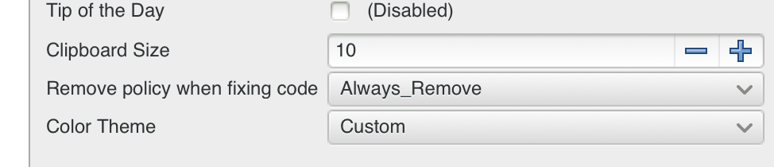

   Setting the color scheme preference

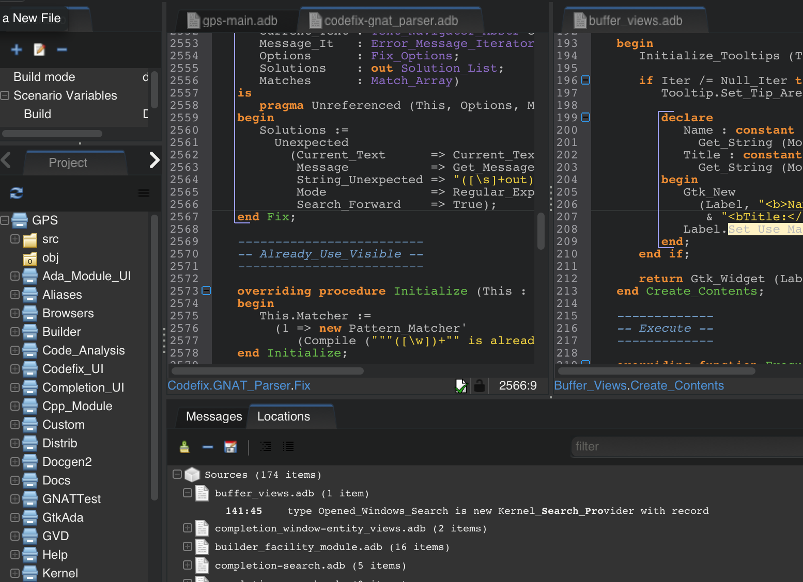

   Switching GPS to a dark theme

Tab menu allows easy selection of open tabs
~~~~~~~~~~~~~~~~~~~~~~~~~~~~~~~~~~~~~~~~~~~

The right-click menu on notebook tabs now shows the list of all windows open
in that tabs, to ease navigation.

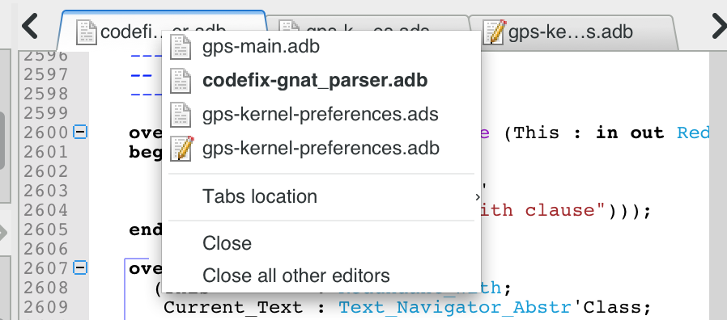

   Menu when right-clicking on tabs

Key shortcuts dialog improvements
~~~~~~~~~~~~~~~~~~~~~~~~~~~~~~~~~

The display of the key shortcuts in this dialog now matches what is
done for the toplevel menus, using symbols like up arrow for the shift
key, a caret sign for the control key, and the special symbols for
Mac keyboards.

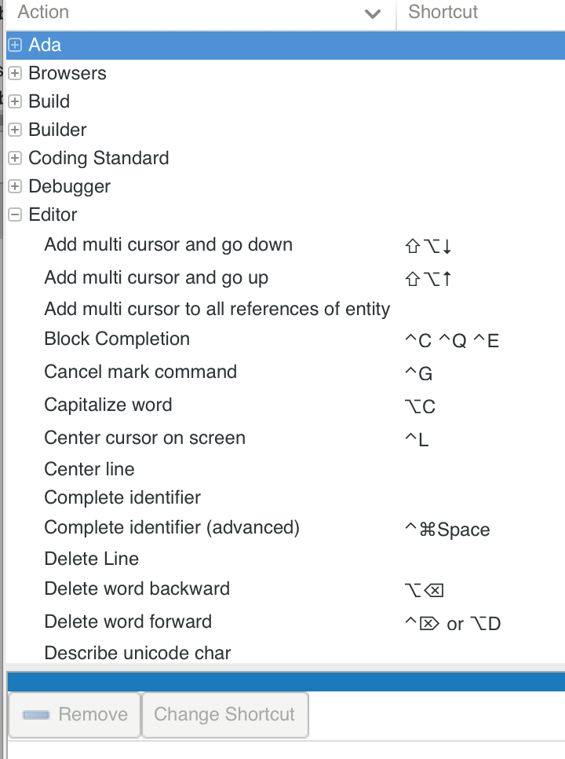

   Key shortcuts display machine-specific symbols for keys

Use ellipsis in window titles
~~~~~~~~~~~~~~~~~~~~~~~~~~~~~

The text in the title bars and in the notebook tabs will now use ellipsis
("...") when the window is too small to accomodate the whole text. The size
of notebook tabs is also limited so that we do not end up with a single tab
using most of the notebook widths, thus hidding the others. This behavior
is controlled by a new preference `Window/Homogeneous Tabs`.

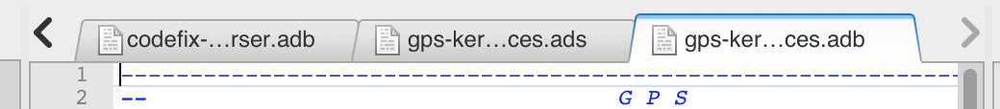

   Ellipsis in window titles

Clickable qualified name in editor status bars
~~~~~~~~~~~~~~~~~~~~~~~~~~~~~~~~~~~~~~~~~~~~~~

The name of the current subprogram, as displayed in the editors status bars,
now includes the name of the enclosing subprograms and packages. Each of
these names is clickable to easily jump to the beginning of the enclosing
block.

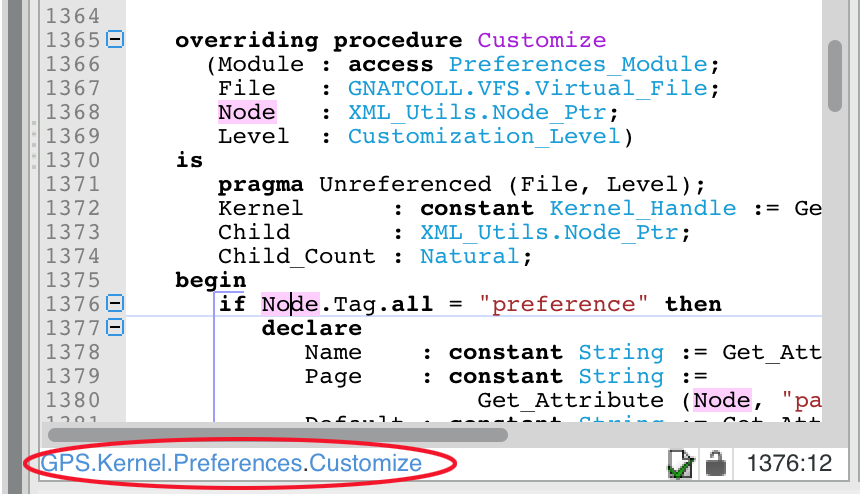

   Clickable qualified names in editor status bar

Outline view improvements
~~~~~~~~~~~~~~~~~~~~~~~~~~

Protected objects in outline view
.................................

Protected and task types/objects and their entries are now visible in
:file:`Outline View`. A new filter in `Show tasks, entries, and protected
types` is used to show/hide these items (in the local configuration menu).

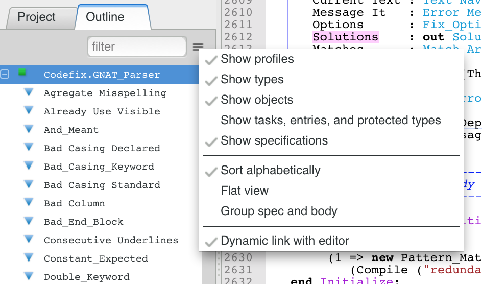

   New configuration menu for the outline view

Group spec and body in outline view
...................................

It is now possible to group the spec and body (or spec and full view) for an
entity on the same row in the Outline view, to reduce the total height of the
:file:`Outline view`. Clicking on the name of the entity will jump to its spec,
but if this is already the current location in the editor will jump to its body
instead. It is also possible to click on either of the two icons to jump
directory to the spec or the body.

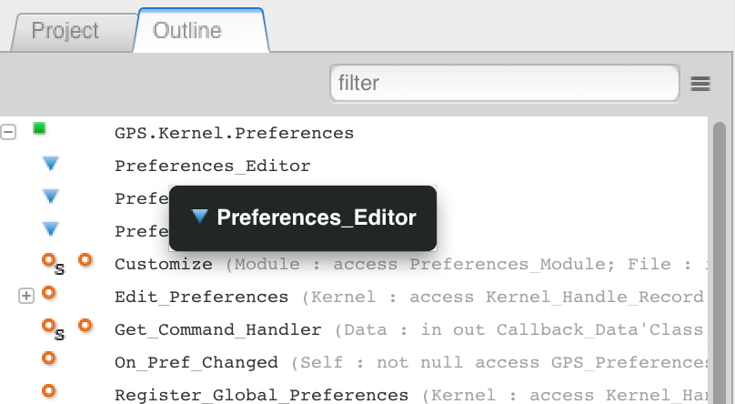

   Grouping spec and body on the same line in Outline

Filter in outline view
......................

A filter has been added to the Outline view to make it easier to find entities.

Flat view mode in outline
.........................

It is now possible to display all entities at the same level, rather than
nested hierarchically. In some cases, it makes searching for an entity easier.
It also reduces the amount of horizontal space that the :file:`Outline view`
needs.

Scenario view displays a tree
~~~~~~~~~~~~~~~~~~~~~~~~~~~~~

The :file:`Scenario view` has been updated to a more usable tree rendering.

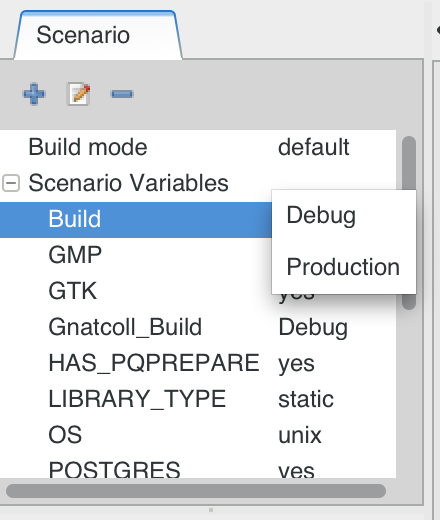

   Scenario variables are editable in-place

Apply preferences on the fly
~~~~~~~~~~~~~~~~~~~~~~~~~~~~

The Apply button was removed from the preferenes dialog.
Instead, GPS will be refreshed every time any of the settings is modified.

Tooltips in Project, Files and Windows views
~~~~~~~~~~~~~~~~~~~~~~~~~~~~~~~~~~~~~~~~~~~~

Tooltips added to views to help navigation when windows are narrow. They also provide
additional information in some cases.

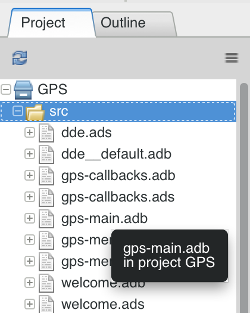

   Tooltips in the Project view

