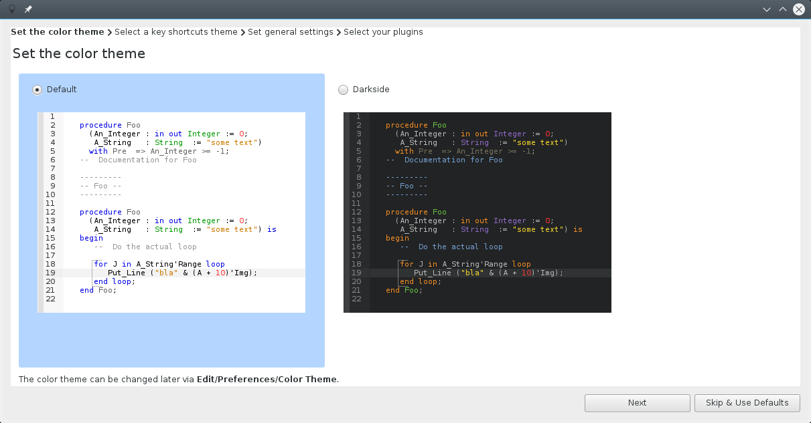
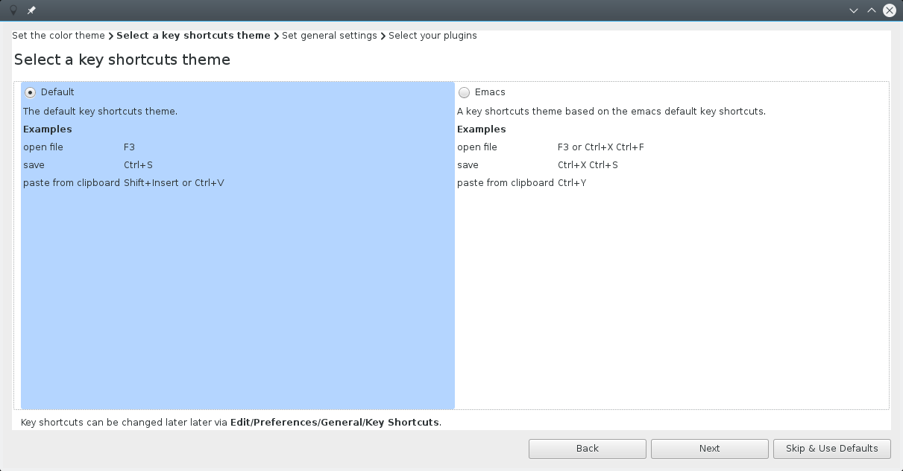
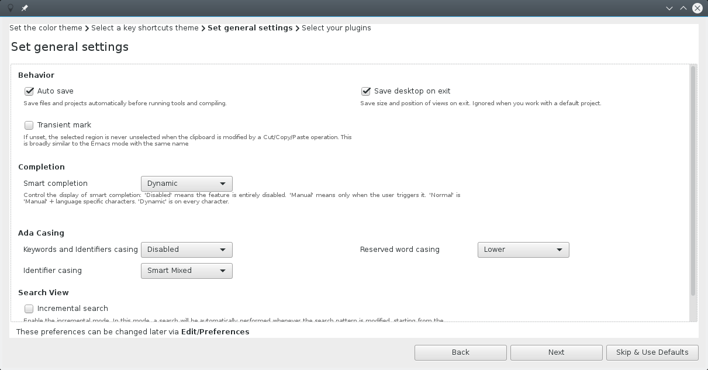
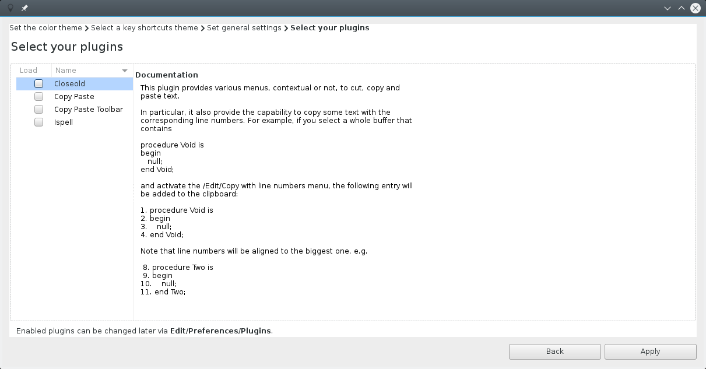
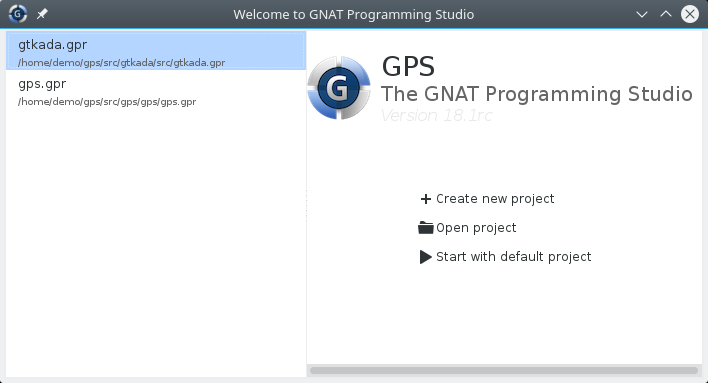
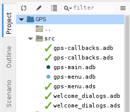
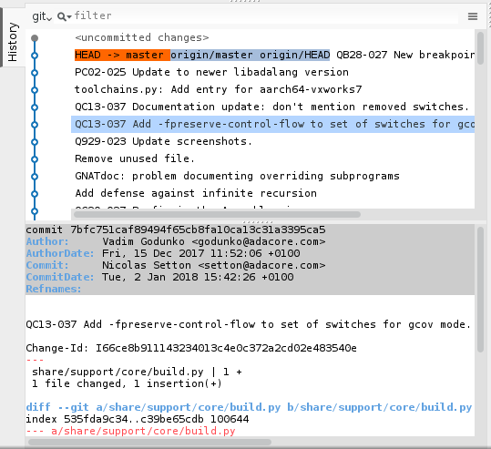
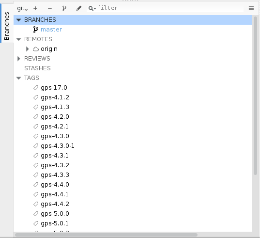
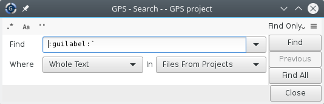

GPS |version| Release Notes
===========================

Release Date: October 2017

.. image:: gps18.png

.. toctree::
   :numbered:
   :maxdepth: 3

The main goal for the development cycle of GPS 18 was to improve
stability, and a better experience for newcomers. 
It includes a number of new features as well.

Preferences Assistant & Welcome Dialog
--------------------------------------

When starting GPS for the first time, a preferences assistant 
wizard allows you to quickly customize GPS to your preferred way
of working. You'll be able to change the following settings through
this dialog:

 - color themes
 - key shortcuts theme
 - general settings
 - plugins

The GPS welcome dialog has been reworked: a list of recently opened projects is
now displayed on the left side.

Version Control Support
-----------------------

The support of the version control system has been rewritten from scratch.
Multiple version control systems and repositories are supported within the
loaded project tree. The VCS Explorer and VCS Activities views have been
replaced with new views. The Project and Files views now show the VCS status
for files.

The History view shows the set of commits that were done in the repository
in the past, along with a graphical diagram showing how branches were
created or joined. This makes it easier to understand how the commits relate
to one another.

The Branches view lets you view and switch between existing branches, to create
new branches, and to delete branches. If you are using git, you can also use
this view to apply view stashed commits.

Support has been added to execute special VCS operations when a
file needs to be made writable (which is useful for ClearCase, 
for instance).

All VCS operations are now performed much more efficiently, and
getting the status for objects is almost instantaneous on most
working directories.

Debugger
--------

The :guilabel:`Assembler` view highlights assembler instructions, registers and
addresses. It has a local toolbar for quick access to disassembly operations.

The :guilabel:`Debugger Variables` view allows to control format (display base) of
variables via the contextual menu.

The :menuselection:`Debug --> Print` contextual menus have been reintroduced in
GPS.

The Debug section of the contextual menu provides entries to control
breakpoints (set, remove, disable, enable).

The GDB/MI protocol is supported and can be activated via the :guilabel:`Debugger`
section of the Preferences dialog.

Test View
---------

A new dedicated :guilabel:`Test` view' was added to present tests, test cases and
corresponding sources available in the project.

Outline
-------

The expanded/collapsed state of the "withs" node is now preserved when switching
between sources.

The :guilabel:`Outline View` is now able to present entities grouped by
categories. This is enabled via a new preference :guilabel:`Group by category`,
and works only in flat view mode.

Codefixes
---------

Code fixing capabilities was enchanced to handle more messages from the
compiler:

 - loop expression is replaced by Range attribute when compiler detects that
   Range attribute should be used to loop over the content of an array

 - removing of redundant "with" clauses now removes any accompanying "use" clauses

 - incorrect prefix of Result attribute replaced by the expected one

Workflows
---------

A :guilabel:`Build & Run` and a :guilabel:`Build & Debug` toobar button have
been introduced. Clicking on these buttons has for effect to build the selected
executable, and perform the second action (either :guilabel:`Run` or
:guilabel:`Debug`) if the build was successful.

Projects Support
----------------

The `Interfaces` attribute is now editable from the
:menuselection:`Library --> Standalone` page of the
:guilabel:`Project Properties` editor.

GPS no longer offers to edit project properties of a read-only project file.

A new attribute `Read_Only` can be placed in the IDE package of a project to
prevent GPS from displaying the graphical editor on this project.

When applying changes made in :guilabel:`Project Properties` to all the
possible values of a given scenario variable, no useless switch case is written
in the resulting .gpr file.

We no longer display the list of entities defined in a file, in the
:guilabel:`Project` view. This information is already available in the Outline,
whenever a file is selected in the Project view. Removing it allowed us to
speed up the display of the tree view.

Search & Replace
----------------

The GPS :guilabel:`Search` view has been completely revamped. The usability has
been improved and an interactive mode has been added.

Every Search/Replace action is now available from the keyboard.

The number of entries in the :guilabel:`Search` view combobox is now limited to
5 when the view is spawned. A separator has also been added between the
predefined regexps and the previously searched patterns.

GPS now reports in the :guilabel:`Messages` window the number of occurrences
that have been replaced when :guilabel:`Replace All` button of the
:guilabel:`Search` view is clicked.

Source Editor
-------------

A new status indicator has been placed in the bottom-right corner of source
editors, showing whether the editor has been modified.

A new action :guilabel:`insert extended character` has been added, allowing one
to enter an extended character in the editor by its unicode number.

GNATdoc
-------

GNATdoc is now able to process bodies, and extract documentation from bodies
and generate separate pages for these bodies in the resulting HTML output. This
is activated via the command-line switch '-d'.

GNATdoc now supports processing Ada 83 and Ada 95 codebases, in addition to Ada
2005 and 2012.

Detailed information is generated for task and protected objects, including
their subprograms and entries.

Miscellaneous UI improvements
-----------------------------

Key shortcuts are now displayed in GPS contextual menus.

The menu separators have been made more visible in dark themes.

Icons were added in the Window menu for editors. This allows displaying which
editors are currently modified.

The labels containing the base name and directory of a file in the
:guilabel:`Properties` dialog are now selectable, which means you can
copy/paste from them.

GNAT runtime menu items for cross platforms have been moved into a separate
submenu of :menuselection:`Help --> GNAT` runtime instead of placing them after
Help/About submenu.

GPS now includes a new button to the right of the main toolbar, to let users
easily switch perspectives.

The :guilabel:`Go declaration ...` item is no longer shown when the subprogram
does not have a declaration. Instead, the contextual menu only shows
:guilabel:`Goto body ...`.

The local configuration menu of the :guilabel:`Locations` view now contains an
item :guilabel:`Preserve message` to control whether to keep build messages for
files that are not being recompiled.

The :guilabel:`Files` view now reuses the same preference as the Project view
to hide some files (those starting with "." by default, although this can be
configured in the preferences dialog).

Creating :guilabel:`Projects` and :guilabel:`Files` views is now much faster,
in particular on large projects where a directory contains several thousands of
files.

A :menuselection:`File --> Project --> Add Complex File Naming Conventions`
menu has been added to run GNATname on project loaded by GPS.

The :guilabel:`Memory Usage View` has been improved. It is now able to display
the static memory usage for memory regions, sections and object files, even
when the link has failed.

If the :guilabel:`Metrics` view is already present, GPS will reuse it when
computing metrics of a file/project.

Deployment of examples: GPS now asks to specify a directory for deploying
GNAT examples via the HELP/GNAT/Examples menus, rather than opening examples
in the location where they are installed.

New contextual menus have been added to create new files from
templates (e.g: 'New Ada Package' contextual menu in the Project
View). These templates are derived from the aliases mechanism and
a Python API has been introduced to allow users to create their
own templates.

GPS Customization
-----------------

Python API
~~~~~~~~~~

A new method GPS.Message.create_nested_message has been added to create nested
messages.

It is now possible to create Tasks from the Python API, and to create tasks
that monitor a workflow. This can conveniently replace some uses of the
`GPS.Timeout` API, and integrates within the GPS Task Manager, allowing to
provide progress indication for background tasks.

Python API of Libadalang is available for plugins, and can be used in GPS
plugins to implement custom code checkers.

The `GPS.Debugger` provides new methods to manipulate frames - `current_frame`,
`frame_down`, `frame_up`, `frames`, `select_frame`.

The scripting API has been enhanced with an `add_debounce` method which can be
used to schedule callbacks to be called as soon as GPS is idle.

Platform Specific Improvements
------------------------------

Mac OS
~~~~~~

A Mac OS Key shortcuts theme has been introduced in GPS, using the
Command key instead of the control key in many places, and defines common Mac OS 
(e.g: 'control + a' to go to the beginning of the current line).

Windows
~~~~~~~

The colors used for selected items have been improved to make them more
readable by default.

Linux
~~~~~

Electing an item now deselects any other unless the user is pressing a modifier
key.
