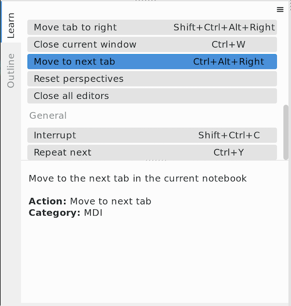
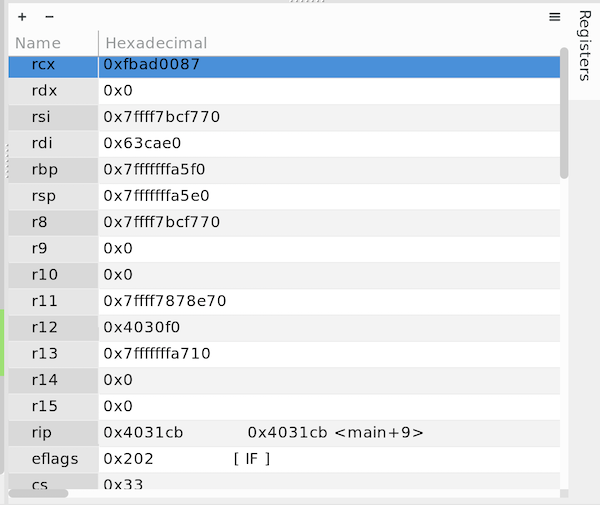
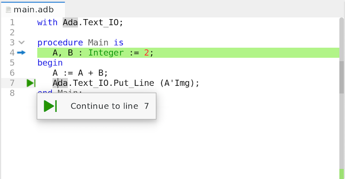
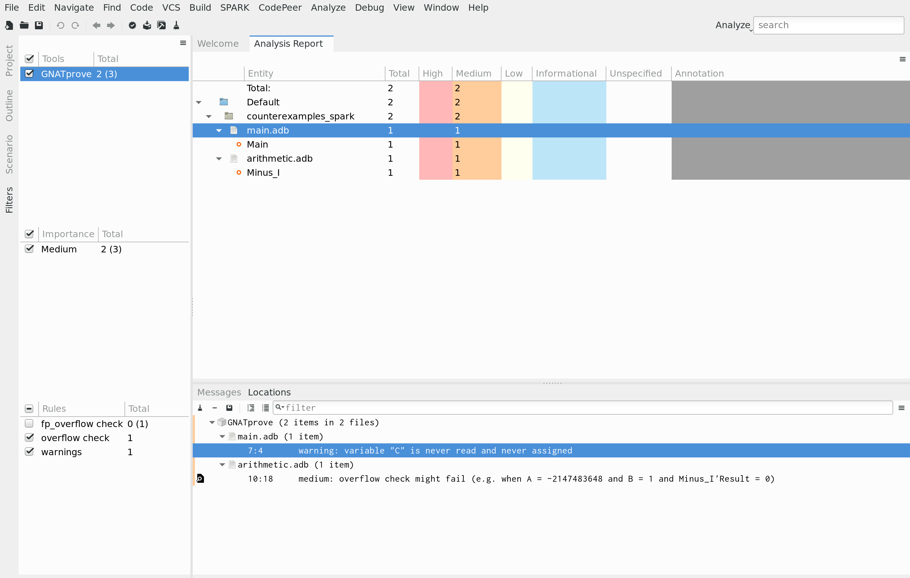

GPS |version| Release Notes
===========================

Release Date: October 2019

.. toctree::
   :numbered:
   :maxdepth: 3

The main goal for the development cycle of GPS 19 was to improve
stability, and provide a better experience to newcomers.
It includes a number of new features as well.

Learn View
--------------------------------------

 A Learn view is now available in GPS. The purpose of this view is
 to help users familiarize with GPS. The actual contents of the
 Learn view is filtered depending on the current context: only the
 actions that are available in the current context are displayed.

Debugger
--------

A new :guilabel:`Registers` view has been introduced, allowing users
to watch and modify the value of registers on the target in real-time.
The view's local menu allows selecting the display format for register values,
for instance switching between decimal and hexadecimal representations.

The :guilabel:`Variables` view now allows direct modification of the variables
being displayed, either by double-clicking on the value column or by clicking
on the :guilabel:`Edit` button of the local toolbar.
Moreover, users can now drag a variable from a source editor to the
:guilabel:`Variables` view in order to display it.

The performance of the :guilabel:`Call Stack` view has been increased: the
frames are now retrieved lazily and the number of frames retrieved attribute one
one time can be controlled via the :guilabel:`Debugger/Call Stack/Frames limit`
preference.

A new :guilabel:`Continue to line` button is now displayed in the editors'
left side area when debugging, allowing users to continue the execution
until a given line very quickly.

The toolbar buttons for debugging have been revamped: their icons have been
modernized and two new buttons have been added for stopping and interrupting
a running debugger.

The :guilabel:`Debugger Execution` view can now be cleared, closed and reopened
during a debugging session.

Projects Support
----------------

The :guilabel:`Scenario` view GUI has been revamped: when an user types an
invalid value for a scenario variable, the corresponding entry is now displayed
in red. A :guilabel:`modified` icon is also displayed for scenario variables
that need to be refreshed.
In addition, two new :guilabel:`Apply` and :guilabel:`Discard` buttons have been
added to the bottom of the view instead of the previous tiny local toolbar
buttons.

.. image:: scenario_view.png
    :width: 250pt

GPS now allows viewing and modifying variables declared in aggregated projects
and untyped variables directly from the :guilabel:`Scenario` view.

Omnisearch
----------

When searching something via the omnisearch, a progress bar is now displayed
while loading the search results and, if the search fails, :guilabel:`No
results` is displayed at the end.
Furthermore, the contents of the omnisearch popup that displays the search
results is now preserved when the focus goes out of GPS.

Source Editor
-------------

The minimal size of the editors' side area can now be controlled via
the :guilabel:`Editor/Gutter right margin` preference.

GPS now automatically makes read-only sections of code that are surrounded by
the markers "-- begin read only" and "-- end read only".

A new `auto_locate_file.py` plugin has been added: this plugin synchronizes the
:guilabel:`Project` view with the currently selected editor: when switching from
one editor to another, the file associated with the newly selected editor is
highlighted in the :guilabel:`Project` view.

SPARK Integration
-----------------

Messages reported by `GNATprove` can now be visualized and filtered
according to their importance and the selected rule (e.g. overflow
check).

A preference has been introduced to display this report
automatically after running GNATprove and a new
:menuselection:`SPARK --> Show Report` menu has been added to
display it at any time.

Key Shortcuts
-------------

Users are now able to define several key shortcuts for an action from the Key
Shortcuts editor: 'Modify' button has been changed to :guilabel:`Add` button. In
addition, they can assign the same key shortcut to several actions.
The :guilabel:`Remove` button has also been improved, allowing users to only
remove specific key shortcuts instead of all those that are assigned to an
action.

Miscellaneous UI improvements
-----------------------------

Support for multiple selection has been added to various views, including
the :guilabel:`Project Properties`, :guilabel:`Call Trees`,
:guilabel:`Locations` and :guilabel:`Bookmarks` views.

The color of the highest importance message is now displayed on the side of
file/category nodes in the :guilabel:`Locations` view, making it easier to
identify lines with messages of high importance.

A new preference has been added to hide/show the VCS status in the
:guilabel:`Windows` view.

GPS Customization
-----------------

Python API
~~~~~~~~~~

New hooks have been added to the Python API (`debugger_breakpoint_added`,
`debugger_breakpoint_changed` and `debugger_breakpoint_deleted`), allowing
scripts to react to changes in debugger breakpoints.

the `GPS.FileTemplate` Python API has been improved: it now allows
specifying an optional implementation file template when registering custom
templates.

A new `GPS.Message.cancel_subprogram` method has been added in the `GPS.Message`
python class to cancel a subprogram associated with a given message (i.e. the
subprogram that is called when clicking on the message icon).
