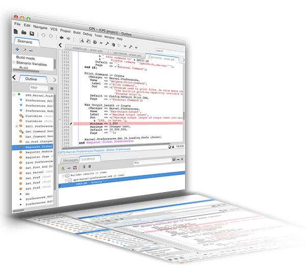
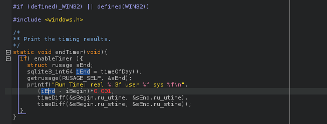
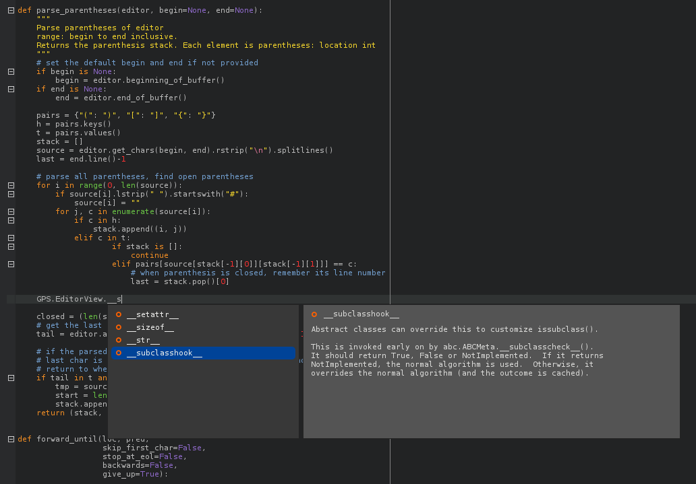
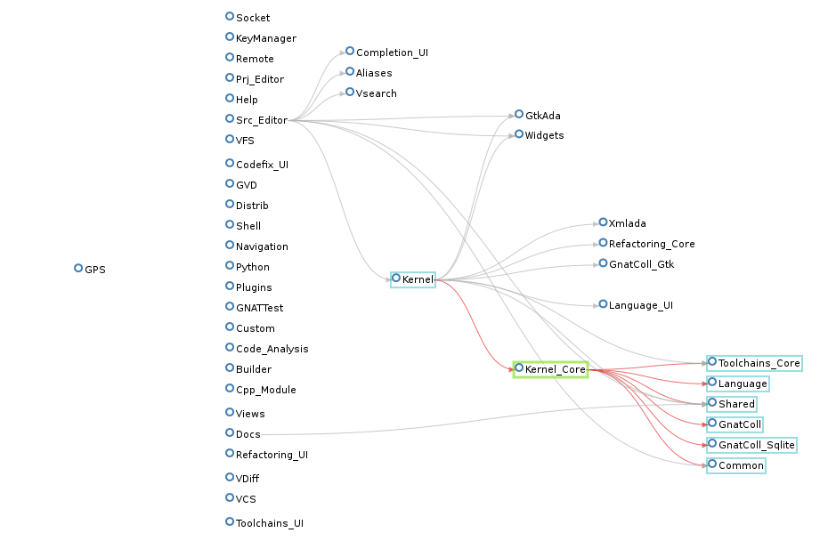
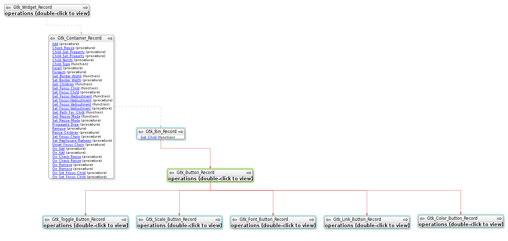
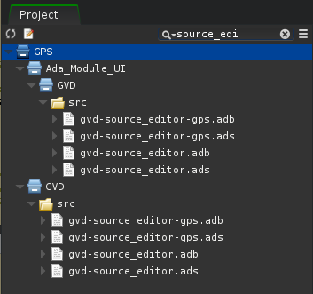
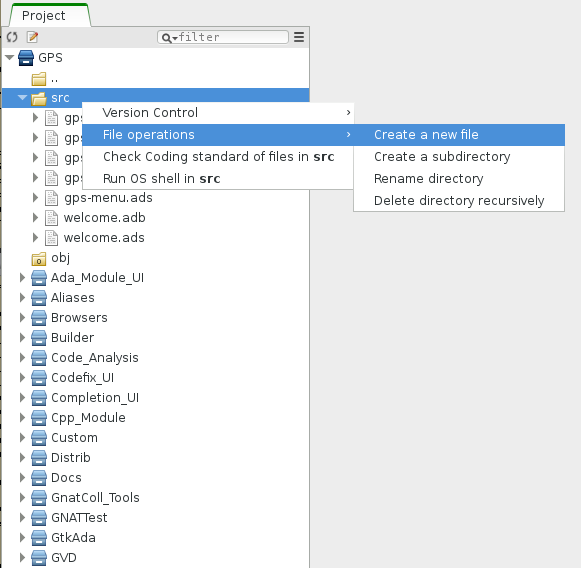
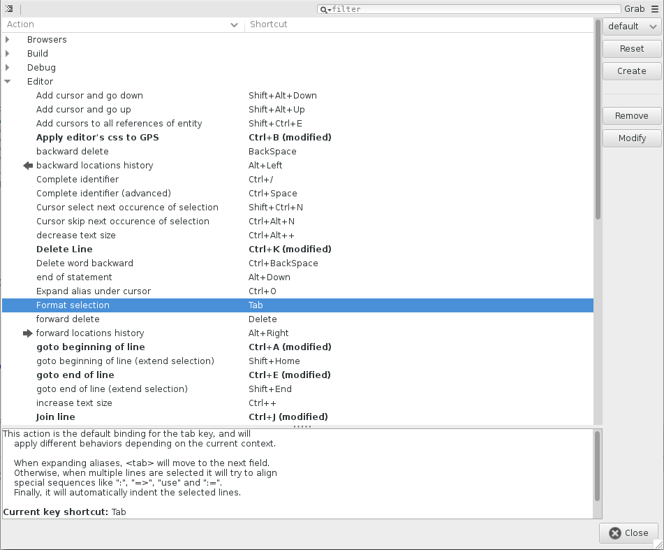
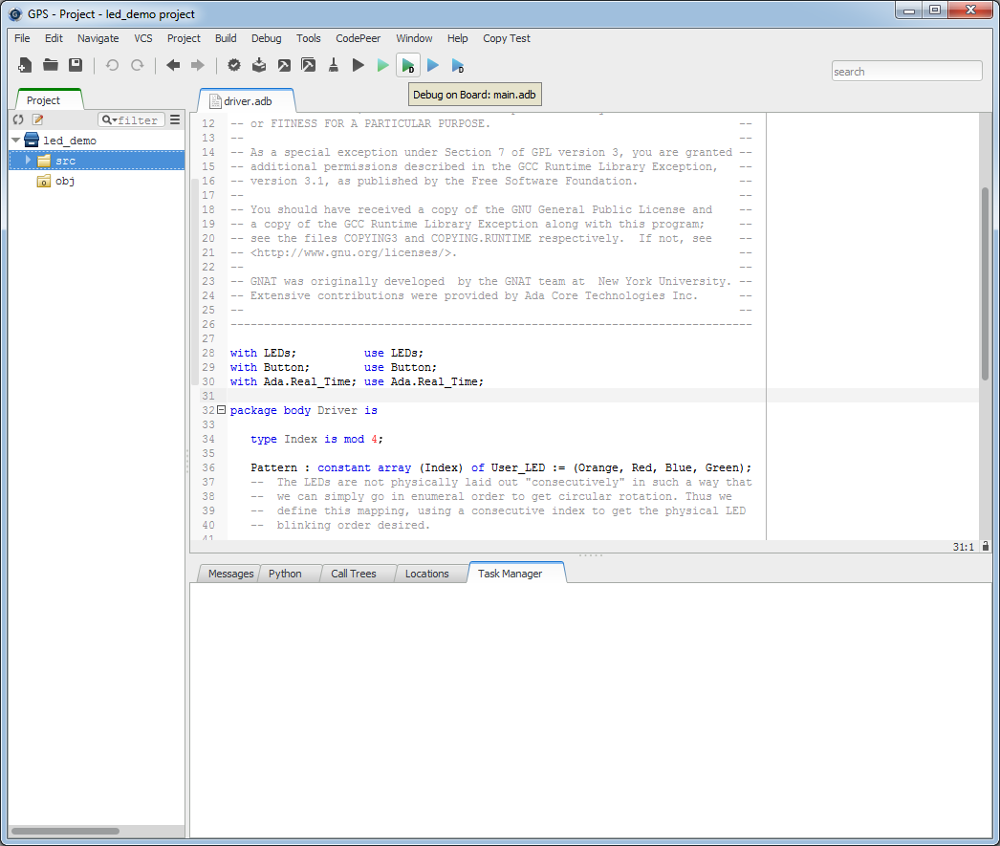

.. Release Notes documentation master file, created by
   sphinx-quickstart on Wed Jun 26 10:06:50 2013.
   You can adapt this file completely to your liking, but it should at least
   contain the root `toctree` directive.

GPS |version| Release Notes
===========================

Release date: June 2016

.. toctree::
   :numbered:
   :maxdepth: 3

GNATdoc
-------

GPS comes with a new engine for documentation generation. This comes in the
form of a command-line tool called GNATdoc.

Amongst the features of GNATdoc are:

* support of Javadoc/Doxygen style of tags in documentation comments

* support for comment placement detection

* support for separating documentation comments from code comments

* a new extensible HTML back-end

  * support for users defined image directory

  * support for package groups

Here is an example of code annotated with GNATdoc tags::

   function Set_Alarm
     (Message : String;
      --  The text to display

      Minutes : Natural
      --  The number of minutes to wait
     ) return Boolean;
   --  Display a message after the given time.
   --  @exception System.Assertions.Assert_Failure raised
   --     if Minutes = 0 or Minutes > 300 if Minutes = 0
   --  @return True iff the alarm was successfully registered

GNATdoc is available from the GPS interface, and also as a command-line
tool, so it can be easily automated.

The full documentation for GNATdoc can be found at
`http://www.adacore.com/developers/documentation/gnatdoc-users-guide/
<http://www.adacore.com/developers/documentation/gnatdoc-users-guide/>`_.

Editors
-------

.. NF-61-MB26-054 GPS: New line number display preference (2013-11-27)

We have a new preference for showing only some line numbers.
c
.. NF-61-MC02-016 GPS: Automatic indentation of pasted content (2013-12-17)

When you paste content in a source editor that supports automatic
indentation, it will be indented automatically, provided you have switched
the feature on via the preferences dialog (Editor -> Auto indent on paste)

.. NF-61-LA18-019 GPS: "file changed on disk" dialog review (2014-05-21)

The dialog that pops up when a file has been modified on the disk has been
modified. It will now list all such files in a single dialog (as opposed to
having one dialog per file when it gets the focus). There is now also an
option for automatically reloading files (which can be undone).

.. NF-61-LA18-022 GPS: Review handling of auto-saved files (2014-09-17)

The dialog is also smart enough not to pop-up if the file on disk has
the same contents as the GPS the editor.

Multicursors
~~~~~~~~~~~~

.. NF-61-MA07-049 GPS: Multi selection using multi-cursors (2013-11-29)
.. NF-61-MA07-059 GPS: Copy/Paste operations using multi-cursors (2013-11-29)

We have made a number of improvements in the handling of multicursors.

When multiple cursors are active, it is now possible to select simultaneously
with all cursors as you would with one. It is also possible to cut/copy/paste
with multicursors. If the copy buffer has been filled with the same cursors,
then the content of each individual cursor will be pasted. If the buffer
was filled with only the main cursor, or with other cursors in a precedent
operation, the content of the main buffer will be replicated
on every cursor's location. Cut and copy works as you would expect.

.. only:: html

   This shows multicursors being used with the action to associate a
   cursor to each entity reference.

   .. image:: multicursors1.gif

   This shows multicursors being used to join multiple lines in very few
   operations.

   .. image:: multicursors2.gif

There's more
~~~~~~~~~~~~

Several other improvements in the editors: the "Delete Line" actions are now
atomic, there is a new plugin vim.py to emulate a few behaviors from vim.
There is also a preference to change the background color of expanded code.

C support
---------

We have a new syntax highlighting engine for C, which has a number of nice
capabilities: for instance it can highlight escape sequences in strings.

It is also entirely written in Python and is easy to extend.

Ada support
-----------

.. - NF-61-N919-015 GPS: alignment preserves the selection (2014-09-19)
.. - NF-61-MC17-032 GPS: Improved auto-align end of line comments (2013-12-17)
.. - NF-61-MB13-072 GPS: new block completions available (2013-11-25)

Several editor enhancements for Ada in general:

* the alignment action preserves the selection

* improved auto-alignment for comments

* new block completions are available

Ada 2012 and SPARK 2014
~~~~~~~~~~~~~~~~~~~~~~~

.. - NF-61-N812-021 Improved indentation of conditional expressions (2014-08-17)
.. - NF-61-N226-002 Improved indentation of subtype predicates (2014-03-26)

We have improved the auto indentation support for conditional expressions
and subtype predicates.

Python
------

.. NF-61-N603-059 GPS: support for auto-completion in Python (2014-06-25)
.. NF-61-N619-029 GPS: on-the-fly syntax error reporting for Python (2014-09-01)
.. NF-61-N407-023 GPS: New syntax highlighting engine (2014-05-13)

This release of GPS contains a lot of improvements to the support of Python.

GPS now provides smart completion in Python files, providing
completion for modules found in the standard Python search paths
and all source directories for projects that list "Python" as their
language. This is done through an integration of the Jedi library:
`https://github.com/davidhalter/jedi <https://github.com/davidhalter/jedi>`_.

We also support auto-indentation in Python, and on-the-fly reporting of
syntax and style errors.

Browsers
--------

.. NF-61-M506-012 GPS: smarter browser layout (2014-07-16)
.. NF-61-N724-011 GPS: animations in browsers (2014-07-24)
.. NF-61-N718-017 GPS: review call graph browser (2014-07-21)
.. NF-61-N916-012 GPS: folding compartments in entity view (2014-09-16)
.. NF-61-J601-013 GPS: Save callgraph browsers across sessions (2014-08-13)
.. NF-61-N915-032 GPS: save browser contents in desktop (2014-09-16)
.. NF-61-N718-015 GPS: add filter in Project browser (2014-07-21)

We have completely rewritten the engine for rendering browsers. This gives a
brand new look and feel to the Project browser, the Entity browser and the
call graph browser.

We have smarter layout algorithms, and animations to show the transitions
when adding nodes or rebalancing the graph.

The Project browser now has a filter which allows searching for a given
pattern directly in the browser. This allowed us to remove the corresponding
scope entry in the Search dialog.

The Entity browser now has support for folding compartments.

And the contents of browsers is now saved accross GPS sessions!

Views
-----

.. NF-61-LA23-042 GPS: Show "withs" in Outline view (2014-04-08)
.. NF-61-MB15-006 GPS: move to previous and next entry in call tree (2014-07-15)
.. NF-61-M108-043 GPS: Highlight custom patterns in Messages View (2013-12-02)
.. NF-61-L810-013 GPS: Clear locations view for an individual file (2014-05-29)

Several small enhancements to views:

* The Outline view for Ada can now show the "withs".

* There are buttons to move to the previous/next entry in call trees.

* The Messages view can now highlight custom patterns.

* In the Locations view, you can now remove entries for an individual file.

We have also removed completely the GPS shell console, which has been
rendered obsolete by the Python console.

Project View
~~~~~~~~~~~~
.. NF-61-JB10-042 GPS: filter in project view (2014-06-24)
.. NF-61-N624-034 GPS: remove Search in Project view (2014-06-25)
.. NF-61-MB19-001 GPS: filter empty directories in Project view (2014-06-17)
.. NF-61-LB28-047 GPS: not grouping by directories in Project view (2014-06-25)
.. NF-61-N623-035 GPS: show runtime files in Project view (2014-06-25)
.. NF-61-N916-003 GPS: new File Operations menu in project view (2014-09-16)
.. NF-61-LC05-020 GPS: Open shell from contextual menu in Project View (2013-11-07)
.. NF-61-N415-035 GPS: change icon for root project in Project view (2014-05-05)

There are been a lot of enhancements to the Project view.

* There is now a filter directly in the Project view. This allowed us to
  remove yet another scope entry from the Search dialog.

* Several new options in the local menu:

  * you can filter out the empty directories

  * you can show files directly under the project, rather than grouped by
    directories

  * you can list the Ada runtime in the Project view

* Some other enhancements:

  * you can open an OS shell from a directory in the Project view

  * the icon for the root project now has its own color, which is useful to
    distinguish it when showing the flat view.

Due to popular demand, we have added back a menu for File operations in the
project view.

Projects
--------

.. NF-61-N305-035 GPS: support for aggregate projects (2014-03-10)
.. NF-61-N918-040 Support for Runtime & Target attributes in projects (2014-10-17)
.. NF-61-N219-023 GPS: improve gnatname integration (2014-03-22)
.. NF-61-M724-024 GPS: save scenario on exit and restore on startup (2014-09-18)

GPS now supports aggregate projects.

The new Project attributes Target and Runtime are also supported. This is
now the recommendation for handling cross projects.

The project wizard has support for gnatname, to create a project from
a hierarchy of sources that have a non-GNAT naming convention.

The settings of the scenario for a given project are saved accross GPS
sessions.

Extensibility / Customizability
-------------------------------

.. NF-61-KB22-012 GPS: project-specific plugins (2014-08-15)
.. NF-61-N711-039 GPS: new parameter on_exit to BuildTarget.execute (2014-07-11)
.. NF-61-MA18-041 GPS: Menus described in menus.xml (2013-11-13)

There is support for per-project customization: when loading a project,
GPS will load project-specific plugin named <project>.ide.py if it exists
in the same directory as the project.

The command GPS.BuildTarget.execute now accepts an extra parameter on_exit:
a function which is called when the build target terminates.

The GPS menus are now entirely described in an XML file (menus.xml) which
allows you to control the layout of menus in a given GPS install.

We have added support for defining completion resolvers entirely in Python.

There is also support for defining workflows: a sequence of asynchronous
actions described as a single Python coroutine - this eases the programming
of complex sequences.

Cross-references engine
-----------------------

.. NF-61-N515-018 gnatinspect recognizes IDE'Xref_Database (2014-05-16)
.. NF-61-N206-037 GPS: Remove xref database with default project (2014-02-11)

We have several fixes and enhancements to the engine for cross-references:
a fix for growing database files, support of Ada separates, better fallbacks
when the code is not in compiled state.

A new project attribute allows controlling the location of the databases,
so it can be placed on local drives rather than networked drives, for
instance.

GPS also automatically cleans up the databases that it creates when creating
a default project - for instance when using GPS to edit a single file.

Key shortcuts
-------------

.. NF-61-M917-006 GPS: Review key shortcuts dialog (2014-05-23)
.. NF-61-MA25-032 GPS: Use the primary modifier for shortcuts (2013-10-29)
.. NF-61-LB30-034 GPS: Faster Ways to Open and Navigate GPR files (2013-10-21)

The key shortcut dialog can now be embedded in the main GPS window, and kept
open. Changes are automatically changed (the save button was removed). A
filter has been added to make it easy to find the proper action or shortcut.
User-defined shortcuts are displayed in bold. The icons associated with actions
are displayed, for consistency with the rest of GPS. Menus are no longer
displayed in the dialog, since it is better to associate the shortcuts with
the corresponding action instead. Multiple key themes are provided and can
dynamically be switched (the emacs.py plugin was removed and replaced with
an Emacs key theme instead)

GPS uses the primary modifier key instead of the control key in several places:
this means that, under Mac OS, GPS uses the Command key for many actions, to
better match the system settings.

The new action "Edit project source file" provides fastest way to open the
source of the current project in a GPS editor.

Miscellaneous UI improvements
-----------------------------
.. NF-61-MA04-035 GPS: remove busy cursor (2013-11-22)
.. NF-61-N703-030 GPS: allow wider omni-search field (2014-07-04)
.. NF-61-N116-013 GPS: support for ClearCase "diff against working" (2014-02-20)
.. NF-61-MC02-033 GPS: Minor enhancements to the tip-of-the-day (2013-12-02)
.. NF-61-MA21-056 GPS: Autofix to current file only (2013-11-05)
.. NF-61-M722-010 GPS: Bind goto next/previous location to Alt+Arrows (2013-12-12)
.. NF-61-KA19-010 GPS: Integrate GNATcoverage detailed messages (2013-11-13)
.. NF-61-H227-033 GPS: Implement auto-refresh mode for memory view (2014-04-02)

We have removed the "busy" mouse cursor - this is replaced by the background
activity indicator in the main toolbar.

The width of the omni-search field can be controlled, which can be useful in
projects with very long file names for instance.

The ClearCase integration now supports "diff against working".

There were minor enhancements to the tip-of-the-day.

You can now apply all auto-fixes to the current file only.

There are default key shortcut (alt+arrows) bound to the next/previous location.

The GNATcoverage detailed messages can be viewed in the editor.

There is an auto-refresh mode for the debugger Memory view.

CodePeer
--------

.. NF-61-M207-022 GPS: CodePeer messages grouping in Locations view (2014-07-31)

GPS now displays the check kinds for CodePeer precondition messages - this
means you can filter out messages based on these check kinds.

The CodePeer message review dialog now prevents changing the message review
status when a message was reviewed in the source code with pragma Annotate.

All CodePeer messages (SCIL compilation errors, warnings and checks, race
conditions) are displayed under one category in the Locations view.

Bareboard support
-----------------

There is a new Project template to start a demo project for the STM32F4 board.

We have also added four workflows to execute complete sequences of actions at
the press of a single button:

* a workflow to build the program, flash it on the board, and run it

* a workflow to build the program, flash it on the board, and launch a debugger
  connected to it

* a workflow to build the program and run it in the emulator

* a workflow to build the program and debug it in the emulator

