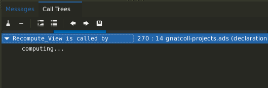
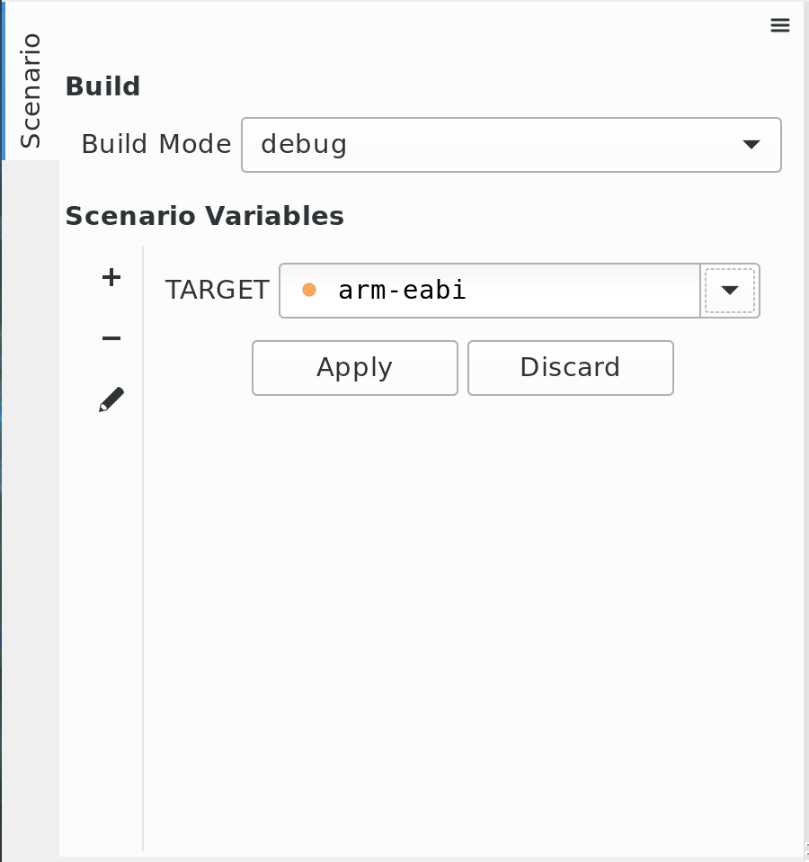
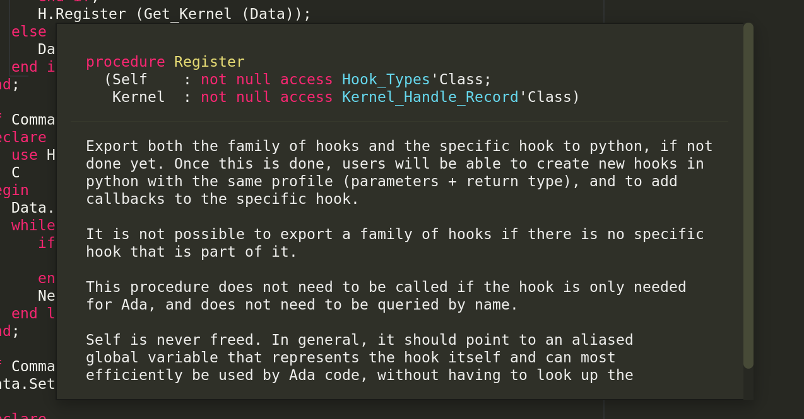
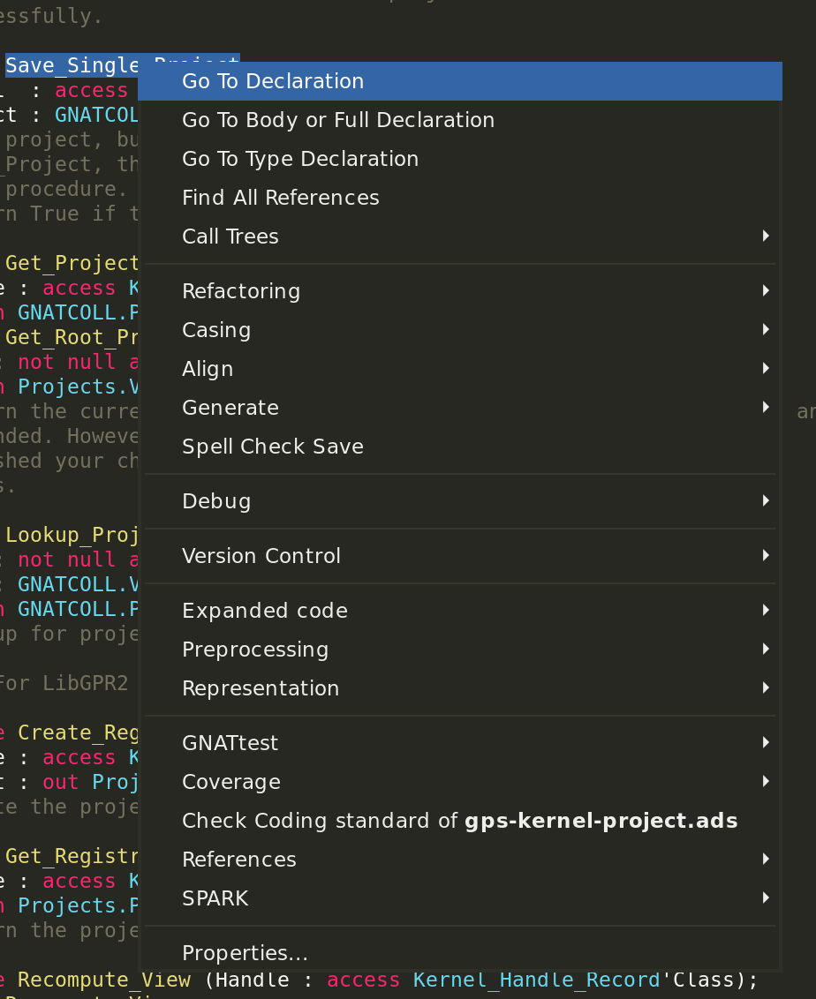

GNAT Studio |version| Release Notes
===========================

Release Date: October 2019

.. toctree::
   :numbered:
   :maxdepth: 3

The first GNAT Studio development cycle was mainly focused on improving
source navigation and stability.

Navigation
----------

The old cross-references engine based on compiler artifacts (:file:`.ali` files)
and the associated database (:file:`gnatinspect.db`) has been disabled by
default: GNAT Studio now uses the **Microsoft Language Server Protocol** to
provide source navigation for Ada, by communicating with a dedicated language
server (see https://github.com/AdaCore/ada_language_server) based on Libadalang
that is directly packaged with GNAT Studio.

This allows to have cross-references up-to-date in almost cases, without
having to recompiler your application after modifications. This also
accelerates the GNAT Studio startup, avoiding the loading of the
cross-references database.

If you encounter some stability issues with the new cross-references engine,
you can still go back to the old one by disabling the *GPS.LSP.ADA_SUPPORT*
trace in your :file:`$HOME/.gnatstudio/traces.cfg` file.

The protocol is completely asynchronous: thus, a progress bar in pulse mode
has been added to the :guilabel:`Locations` and :guilabel:`Call Trees` views
to indicate that a request is being processed by the language server on
:menuselection:`Find All References` or a
:menuselection:`Call Trees --> <entity> is called by` query.

Debugger
--------

The UI freeze that could occur when lauching a debug session on big executables
no longer exists: the UI is now perfectly responsive during GDB's "load"
command.

Breakpoints are now correctly saved across debug sessions, even when some of
them were not recognized with the loaded executable.

Projects Support
----------------

The :guilabel:`Scenario` view  :guilabel:`Apply` and :guilabel:`Discard` buttons
have been moved to the sidebar.

It's also possible to activate/deactivate the display of untyped scenario
variables. This is done via the local configuration menu (hamburger menu) of the
view.

The user experience when opening an erroneous project has been improved
too: an editor issues opened for the project file that contains errors, allowing
the user to modify it directly and reload it via the Project view after
correcting it.

Version Control
---------------

Many improvements have been made regarding the new Version Control System
engine, in particular regarding the ClearCase support. As a result, the old
Version Control System (VCS1) has been completely removed from GNAT Studio.
As a result, the GPS.INTERNAL.MODULE_VCS trace (corresponding to the old engine)
has been removed and the GPS.INTERNAL.MODULE_VCS2 trace (corresponding to the
new engine) has been renamed to GPS.MODULE.VCS.
You can disable the GPS.MODULE.VCS trace if you want to disable completely the
VCS support from GNAT Studio.

The diff viewer has also been improved, and clicking in a specific commit from
the :guilabel:`History` view will open a separate editor to view the associated
diff.

Tooltips that indicate the *Commit-Id*, *Author*, *Date* and
*Subject data* have also been added and the overall performance of the view has
been increased by loading asynchrounously the commits.

Omnisearch
----------

Annoying bugs have been resolved regarding the omni-search. In particular, the
omni-search results window now disappears as soon as the focus leaves the GNAT
Studio main window.

Moreover, the progress bar counting has been fixed when the *include
all files from source dirs* option is disabled.

The performance has also been improved when searching through file names on
networked filesystems or on slow local disks.

Source Editor
-------------

Source editor tooltips have been revamped completely and are now also
based on the **Microsoft Language Server Protocol**.

Hovering on a given Ada entity now displays the corresponding declaration
code, without any formatting. The declaration code is highlighted and the
associated comments are displayed right under. Tooltips have also been made
scrollable to avoid having giant tooltips when the associated comments
are very long.

Contextual menus have been completely revamped for GNAT Studio: proper groups
have been introduced as well as separators to clearly separate them.

Several new actions have been introduced to help developers.

A new *strip trailing blanks* action has been introduced to strip
trailing spaces in the current editor.

GNAT Studio now also offers the possibility to fold/unfold all the blocks
that are similar to the current one (e.g: fold all the "if" blocks when
the cursor is on one of them) via the *fold/unfold similar blocks* actions.

A new plugin has been added to display the to compute and display the
representation clauses in the editor. The plug-in is using the json output of
gnatR, therefore a compiler version 20+ is needed.

Miscellaneous UI/UX improvements
-----------------------------

It is now possible to open a file by double-clicking on the corresponding row in
the :guilabel:`Locations` view.

GNAT Studio now displays a confirmation dialog before executing the *generate
body* and *generate body as separate* actions.

The *Refill* action now works in project files, in the same way as
Ada source files.

New :menuselection:`Open folder` and :menuselection:`Open containing folder`
contextual menus have been added for the :guilabel:`Project` and
:guilabel:`Files` views.

GPS Customization
-----------------

Python API
~~~~~~~~~~

the :class:`GPS.Entity` class is now obsolete by default. This is due to the
fact that GNAT Studio does not use anymore the gnatinspect database to provide
cross-references.

More information on how to transition your custom plugins that use this
:class:`GPS.Entity` class to GNAT Studio can be found in the **GNAT Studio
User's Guide**, in the *20. How to transition from GPS to GNAT Studio* section.
