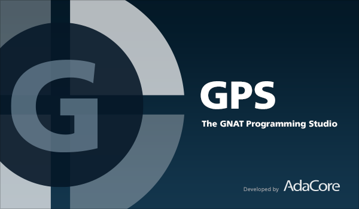
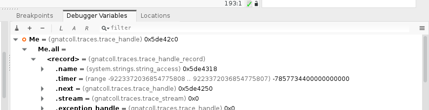
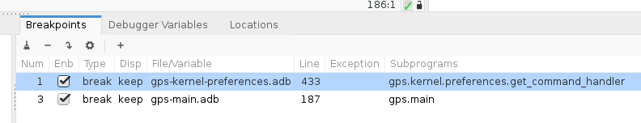
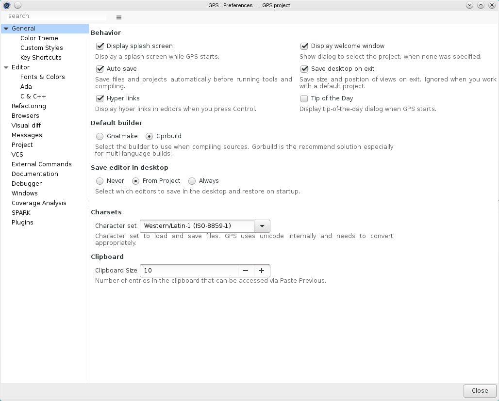

GPS |version| Release Notes
===========================

Release Date: October 2017

.. toctree::
   :numbered:
   :maxdepth: 3

Debugger
--------

A new Debugger Variables view displays the same type of information as the Data
Window (i.e. the value of variables) but in a tree, which might help keep
things organized.

It is now possible to set breakpoints before a debugger is started. This can be
done as usual via the Debug/Set Breakpoint contextual menu, or by clicking on
the side of editor lines. The line number for lines with breakpoints is now 
highlighted, and no longer display a red dot on the side of the line. The color
of this highlight is different for disabled and conditional breakpoints.

A number of improvements was done for the Breakpoints view. Its layout has been
modified so that it is now smaller and can more easily be a permanent fixture
of the desktop. Long-clicking on a breakpoint will display all its properties
(both basic and advanced), and double-clicking will open the corresponding editor.
Since it is now possible to set breakpoints even when no debugger is running,
it is also useful to edit them outside of the Debug perspective.

The contextual menu Debug->Set watchpoint on a variable while the debugger is
running allows to set a watchpoint, so that the debugger stops any time the
variable is modified.

The Call Stack view now has a local configuration menu to choose which information
should be displayed. When you choose not to show subprogram parameters, gdb is
configured so that it does not try to compute them, which, on some systems,
might significantly speed up operations with the debugger.

GPS no longer supports the debugger preference to show lines with code. This
preference had been disabled by default for a while now, and could cause slow
downs since it requires a lot of interaction with the debugger (and while the
debugger is working on getting us the info, we can't send other commands like
setting breakpoints).

See also `Debugger improvements in GPS 17
<http://blog.adacore.com/debugger-improvements-in-gps-17>`_ blog post.

Editors
-------

When using the Home key while in an editor (or any key bound to the action
"beginning of line"), GPS will first go to the first column (as it has always
done), but if you do it a second time it will then go to the first non-blank
character of the line.

A new action "select subprogram" has been added to GPS. This selects the
current subprogram, extending the selection to the englobing subprogram if a
subprogram is already selected. This can be useful, for instance, to limit a
search to the context of the current subprogram.

Lines for which a bookmark has been set will now show special highlighting in
the scrollbar of editors, as well as an icon on the left side of the line, as a
quick way to identify them.

GPS now checks the permissions on the disk before saving a file (rather than
just the read-only status of the editor). If the file is read-only on the disk,
it displays a confirmation dialog to let you choose whether to overwrite (and,
in the context of Clearcase, "hijack" the file).

The preference "Always Use External Editor" has been removed. Such editors do not
conveniently give access to cross-references, outline, and all the other
facilities provided by GPS.

MDI & Dialogs
-------------

A new action ("maximize window") is provided to make the central area of the
desktop (that contains the editor) occupy the full GPS window, hiding all other
views. Executing the action again goes back to the previous layout. You can
bind a key shortcut to this action via the Edit/Preferences/Key Bindings menu.

The GPS color theme was modified so that the view that currently has the
keyboard focus has a special color in its notebook tab. Changing the color
theme will change the colors, but will still make this tab unique.

New preference (Edit->Preferences->Windows) added to configure default tab
orientation. This allows, for example, to put tabs horizontally at right side
of a window.

The Escape key can now be used to close floating dialogs (such as the Search
dialog, or the Preferences dialog) even when the input focus is not currently
on these dialogs.

The size of simple text input dialogs (e.g: the 'Debug/Run' dialog) is now
preserved: GPS will now restore it when the dialog is displayed again in the
future (either in the current session or in a later session).

Menus
-----

The Help->GNAT Runtime menu is now computed from the runtime that is actually
being used for the current project, rather than a static image of a native
runtime.

New menu File->Reset All Perspectives restores the default window layout. This
is in particular useful to reset the Debug perspective that has changed in this
release of GPS.

The menu Project->Save All was moved to File->Save More->Projects to make its
semantics easier to understand.

When a project (and its subprojects) have a small number of main units, and the
root project is not an aggregate, we display the Build->Project, Build->Run and
Debug->Initialize menus as a flat list of mains, rather than introduce one
extra level of menu for the name of the project.

On OSX and Unity, GPS is now able to display the menubar outside of the main
window. This is disabled by default, since these menus are not able to display
tooltips or key shortcuts. They can be enabled via an advanced preference.

When an editor or a browser is made floating, its window now includes a menubar
similar to the one used in the main GPS window. This makes it more convenient
to execute actions via menus.  It also includes a copy of the global toolbar.

Search & Replace
----------------

The "search and replace all occurrences" has been sped up by a factor of seven
in some cases.

Omnisearch
~~~~~~~~~~

The Omnisearch feature has received a number of enhancements:

 - A default key shortcut (control-u) brings up the omnisearch

 - When bringing up the omnisearch through the key shortcut completions start
   appearing even before anything is typed in the entry. This allows, for
   instance, using the arrow keys to select one of the currently open windows.

 - The size of the popup window has been increased to take up to 2/3 of width
   and full height of the main window. This is useful when listing directories
   with long names, for instance. Also, local configuration setting to
   automatically resize the popup window was removed.

 - The highlighting of the fuzzy-matched characters now uses a color.

 - If the text in the global entry has been manually deleted, it no longer
   reappears next time the search is activated.

 - When you search via the omnisearch, GPS will now ensure that matches in
   runtime files appear only after matches in user code.

 - The Omnisearch can now also display project relative paths instead of
   absolute ones. This behavior can be controlled via a local configuration
   settings.

 - It is now possible to type simple mathematical expression in the omnisearch
   ("2 + 3**2") to get their result in decimal, hexadecimal and binary.

Preferences
-----------

The GPS preferences dialog was completely reworked. The color theme picker and
the key shortcuts and plugins editors are now directly accessible from the
preferences dialog.

A new look-and-feel has been introduced, gathering the preferences in groups
and with the documentation being direclty displayed under each preference.

It is possible to search among preferences using the omnisearch bar or the
preferences dialog local search bar.

GPS hidden preferences can now be displayed and edited by activating the "Show
advanced preferences" setting from the dialog's local menu.

The key shortcuts and plugins can now be configured from within the Preferences
dialog.

Views
-----

Bookmarks
~~~~~~~~~

.. figure:: bookmarks.png

Number of improvements was done for Bookmarks view:

 - Double-click on a bookmark jumps to the corresponding editor, and long-click
   starts editing (there is a button in the local toolbar for that purpose
   too).

 - Bookmarks are no longer sorted by default. Instead, you can use
   drag-and-drop to organize them in the order you want.

 - Bookmarks can be grouped: when you drag and drop a bookmark on top of
   another bookmark, a new group is created that contains both. These groups
   can be used to organize large numbers of bookmarks.

 - A filter to the Bookmarks view was added, to match what is done for other
   views.

 - Comments can be added to bookmarks, either that an explicit toolbar button
   or dragging and dropping text from a source editor.

 - A new local configuration setting "link with editor" is also available,
   which automatically selects the first bookmark associated with the current
   editor line, whenever the latter changes.

See also `Bookmarks in the GNAT Programming Studio (GPS)
<http://blog.adacore.com/bookmarks-in-the-gnat-programming-studio-gps>`_ blog post.

Files
~~~~~

A new local configuration "All files from prj dirs" has been added to the Files
view, to show all files in any of the directories of the project. In
particular, this shows the object and executable files in the object
directories.

GPS now exports a new action to find the current file in the Files view. This
action is not visible by default in the contextual menu (as opposed to Locate
in Project view) in an effort to keep the menu simple. However, it can be added
with a small python script. The menu Navigate->Locate in Files view has been
added.

Locations View
~~~~~~~~~~~~~~

It is now possible to select multiple items in the Locations view, in
particular to remove or export them all in a single operation.

When the Locations view contains build errors, and one of the files is being
recompiled, the Locations view will now only update the entries for that file
(and corresponding specification file if applicable), rather than removing all
build errors.

For messages which have an associated background color
(for instance compiler errors), the Locations view shows this
background color on the side of the row for this message.

Outline View
~~~~~~~~~~~~

A few improvements were done on the Outline view:

 - the "with Clauses" node is not dislayed if no withes

 - a new setting allows to hide the name of parameters in the profile of
   subprograms. This saves some space, and helps differentiate homonym
   subprograms

 - it is now possible to use <enter> to jump to the corresponding entity (same
   as clicking on the line)

Project View
~~~~~~~~~~~~

There are two enhancements of how long names of files and directories are
displayed, both controlled by local configuration menu: only basenames are
displayed, and ellipsis are displayed in the middle of file name if the Project
view is not wide enough to fit the entire name.

The preformance of Project view was significantly improved on project load,
which is noticeable on projects that have a large number of files.

A new button in the local toolbar of the Project view, to collapse all project
nodes was added. This is a way to quickly cleanup the display after using
"Locate in Project View" for a while.

Windows
~~~~~~~

Two new settings have been added to the Windows view: you can now choose
whether to show nodes for notebooks that have a single window (the default is
still to display the window itself, but not its notebook in this case); and you
can choose whether to sort windows alphabetically, or to preserve the order of
tabs within the notebooks.  When the notebooks are not displayed, and sorting
is disabled, the order depends on which window had the keyboard focus last,
which provides a convenient way of switching quickly between a few editors
among a lot of them.

The Windows view now also has a local filter, to help search for specific
windows.

Tools Integration
-----------------

QGen
~~~~

A convenient interface to QGen, the code generator for Simulink models, is
provided now. This includes:

 - displaying graphically the diagrams from MDL files (read-only),

 - toolbar buttons to easily generate code then build (and optionally then
   debug),

 - tight integration with the debugger so that whenever the debugger stops, GPS
   highlights the current block in the diagram, adds contextual menus to easily
   break on specific blocks, and shows the current value of signals.

CodePeer
~~~~~~~~

Improvements of Locations view to handle selection of multiple messages allows
to review multiple CodePeer messages at once.

Single message review dialog now contains information about a message in the
same way as multiple message review dialog does. Proposed value of message
review status has been changed to current status of the message.

CodePeer's messages with lifeage "removed" are displayed with different font to
help distinguish them from regular messages. Also, filter of "removed" messages
is deselected each time CodePeer report is open.

Cross-references engine
-----------------------

It is now possible to force GPS to index runtime files so that you can perform
cross-references from them (it was always possible to cross-ref from your own
sources to the runtime). This takes longer to index, so is disabled by default.
See the preference Project/Cross References in Runtime Files.

The action "find all references" on an entity now includes by default all the
entities overriding it, all entities it overrides, and all entities overriding
the entities it overrides.

The optional listvars.py plugin (which adds a contextual menu "Variables used
in ...") now also shows the type of reference for those variable (read, write,
dispatching call,...)

Build Targets
-------------

A new macro %TP is available in builder targets. It will be replaced with the
name of the project file to which the main unit belongs. It is for instance
used when you do not want to pass the root project to gprbuild, but directly
the unit's own project

The configuration file (.cgpr) set by the "--config" command-line switch is now
passed on to the builder. Also, GPS now also passes the configuration file
which was automatically generated when the "--autoconf" option was given.

Switches defined for a specific tool using XML can now be filtered by
specifying a named filter for the 'filter' attribute of a switch tag. These
filters can be either predefined in GPS or created by the user (see the
<filter> tag in the XML files).

It is now possible to rename targets directly in the Target Configuration
dialog: double-click on a target name in the tree to give it a new name.

Bareboards Support
------------------

GPS now supports OpenOCD in order to flash and/or debug an external board.  In
order to use OpenOCD, set the IDE'Connection_Tool project attribute to
'openocd' and specify a board-specific OpenOCD configuration file via the
IDE'Connection_Config_File project attribute (both attributes are editable in
the 'Embedded' Project Properties editor page).

GPS now supports the arm-sysgo-pikeos toolchain.

GNATdoc
-------

Attribute Documentation_Dir is defined in Documentation package now.  Attribute
with same name in package IDE is obsolete. Its support will be removed in
future version of GNATdoc.

Miscellaneous UI improvements
-----------------------------

The tooltips in notebook tabs, in the Project view and in the Windows view now
show both the absolute name for files as well as their location relative to the
root project. The latter path can often be much shorter, depending on your
setup.

It is now possible to bind keys to actions without unbinding the key.  This
means that the same key binding might apply to several actions, and the action
that gets executed is the first one for which the filter matches. In
particular, this allows reusing keys like <enter> or <tab> in contexts other
than the editor.

The mouse buttons 4 and 5 (available on some high-end mice) are mapped to the
locations command, and used to move in the locations history (back to the
previous position, and back). This is hard-coded, and cannot be changed.

A new preference (Windows/Window Title) has been added to configure the title
of the GPS window. Through it, you can chose whether to display any of base
names, directory names, project name,... in the title bar.

The About dialog now contains the name of the current project's toolchain if
this toolchain is not the native one.

A Gtk File Chooser dialog is used for choosing files if the system doesn't have 
its own dialog, or if this forbidden through preferences and the filesystem is
local. It is possible to use the GPS dialog by turning off the gtk_file_selector
trace.

In the Call Graph Browser, file locations are now clickable and open the
corresponding file/line.

A new action and contextual menu allow exporting the contents of the Call Trees
view to an editor.

A new button was added to the local toolbar of the Run view, to save the run
command output to a file.

The Edit Source button in project properties rewrites the project file (with user
confirmation) before opening it in an editor and closing the dialog.

The GPS code fixing capability was enhanced to handle compiler messages such as
"Elaborate_All pragma required for NAME". To fix this GPS will add pragma
Elaborate_All (NAME) after corresponding with-clause in the spec or body of
given compilation unit.

The plug-in auto_highlight_occurrences.py highlights all occurrences of the
word under the cursor in the whole file (possibly using smart cross reference
information to only highlight the specific entity and not its homonyms). This
plug-in has now learned not to highlight the language's keywords ("constant",
"begin",...) which is useless and might be slow since these keywords generally
occur often.

In the main toolbar, the button next to the summary of running tasks now brings
up an ephemeral window which contains a task manager view, which allows viewing
and interrupting tasks directly from the toolbar, without the need to have the
Task Manager view present in the MDI.

The "OS Shell" window sometimes need a "stty echo" command to properly display
the keys typed on the keyboard. GPS now has a preference to automatically emit
this command. The new shell also has a GPSSHELL environment variable set
automatically, so that you can test it in your shell's configuration files to
enable or disable specific behaviors.

Xming Compatibility
-------------------

A new trace "Views.No_Transient_Views" has been added. When activated (in
.gps/traces.cfg or via the --traceon switch), this prevents the use of
"transient" windows for floating views. This is needed mostly for compatibility
with the Xming X11 server which does not allow resizing transient windows, and
calculates their size wrongly.

Another trace "Store_Window_Positions" has been added: this is on by default,
and, when switched off, will prevent GPS from saving the size and positions of
floating windows.

GPS Customization
-----------------

GPS searches for icons used in plug-ins in any of the directories specified in
the environment variable GPS_CUSTOM_PATH.

Python API
~~~~~~~~~~

A menu no longer is necessarily a graphical object (it could be displayed
outside of the application on some systems like Ubuntu or OSX), so inheritance
of GPS.Menu from GPS.GUI has been removed. Most functions have been
reimplemented though using the action associated with the menu.

GPS exports more debugger functions to python, allowing scripts to be more
independent of which exact debugger is actually used. These are
GPS.Debugger.value_of, GPS.Debugger.set_variable,
GPS.Debugger.break_at_location and GPS.Debugger.unbreak_at_location.

GPS now exports the list of breakpoints that are currently set in the debugger
by function GPS.Debugger.breakpoints. This is both more efficient and more
reliable than having scripts parse it again, and avoids hard-coding gdb
commands in scripts.

The Python GPS.Process() now accepts the command as a list of arguments instead
of a string, which makes it easier to handle arguments with spaces (no need for
quoting).

A new GPS.BuildTarget.get_command_line() method has been added in order to be
able to retrieve the current command line of a specific Build Target.

A new python function GPS.Entity.instance_of is now available to find the
generic entity that the current one instantiates.

A new browser can now be created with a custom toolbar. It is thus possible to
add buttons via GPS.Action.button() that will only apply to this browser.

Incompatible changes
....................

This section lists changes done in the Python API that are no longer compatible
with previous versions of GPS.

 - GPS.*Context removed

   All classes related to contexts were merged into a single GPS.Context class,
   which provides the same features as all the others combined. The previous
   names have been left for backward compatibility, but users are encouraged to
   only use GPS.Context from now one. If you script was explicitly testing
   classes ("if isinstance(ctx, GPS.FileContext)"), you should instead test
   whether specific information is available ("if ctx.file()").

 - GPS.Toolbar, GPS.Combo, GPS.ToolButton and GPS.Button removed

   This class has been removed. Only buttons associated with named actions can
   now be added (See GPS.Action.button). A benefit is that buttons can now be
   added to either the main toolbar or to the local toolbars of the various
   views. GPS can also repeat the main toolbar in every floating window. Since
   actions can also be associated with menus and key shortcuts, this also
   encouraged code reuse.

 - GPS.Menu.create obsolescent

   This function is now obsolescent, and its use is discouraged (use
   GPS.Action.menu instead). A temporary version still exists, but will be
   removed in future versions.  We encourage you to change your plug-ins to use
   gps_utils.interactive instead, since the latter creates proper actions which
   can be reused for contextual menus or key shortcuts.

   The benefit is that menus are now always associated with named actions,
   which can also be bound to keyshortcuts or toolbar buttons. This encourages
   code reuse, and allows disabling all GUI items related to a given action
   more easily.

 - GPS.Menu.pywidget() is no longer available

 - GPS.Menu.rename() is no longer provided
  
   Instead, destroy the menu and create a new one associated with the same
   action.

 - the function GPS.Menu.create is now obsolescent. A simple replacement is
   provided for a few releases, but

 - debugger_breakpoints_changed hook can receive a None debugger

   Breakpoints can be set before a debugger is started, but the hook is still
   run. In this case, the debugger parameter is set to None.

 - 'source_lines_revealed' hook has been removed

   As part of the simplification of the code.

 - 'task_changed' and 'task_removed' have been removed

   Use GPS.Task.list() periodically to get the list of tasks.
