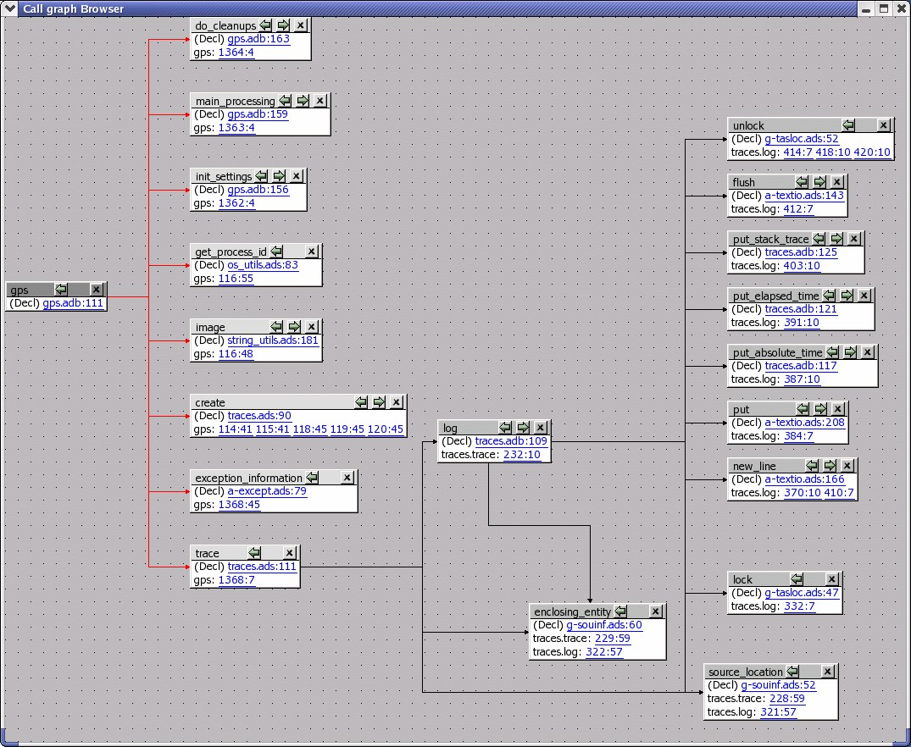
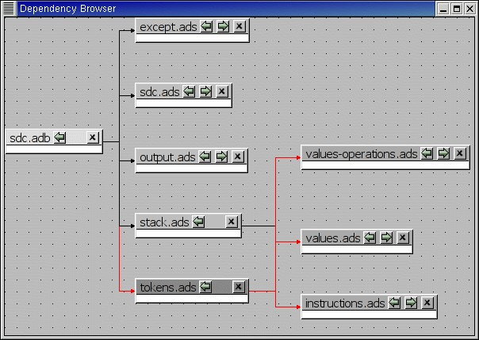

.. _Source_Browsing:

***************
Source Browsing
***************

.. index:: source browsing

.. _General_Issues:

General Issues
==============

GPS contains several kinds of browsers, that have a common set of basic
functionalities. There are currently four such browsers: the project browser
(:ref:`The_Project_Browser`), the call graph (:ref:`Call_Graph`), the
dependency browser (:ref:`Dependency_Browser`) and the entity browser
(:ref:`Entity_Browser`).

All these browsers are interactive viewers. They contain a number of items,
whose visual representation depends on the type of information displayed in the
browser (they can be projects, files, entities, ...).

In addition, the following capabilities are provided in all browsers:

*Scrolling*

  When a lot of items are displayed in the canvas, the currently visible area
  might be too small to display all of them. In this case, scrollbars will be
  added on the sides, so that you can make other items visible. Scrolling can
  also be done with the arrow keys.

*Layout*

  A basic layout algorithm is used to organize the items. This algorithm is
  layer oriented: items with no parents are put in the first layer, then their
  direct children are put in the second layer, and so on. Depending on the type
  of browser, these layers are organized either vertically or horizontally.
  This algorithm tries to preserve as much as possible the positions of the
  items that were moved interactively.

  The `Refresh layout` menu item in the background contextual menu can be used
  to recompute the layout of items at any time, even for items that were
  previously moved interactively.

*Interactive moving of items*

  Items can be moved interactively with the mouse. Click and drag the item by
  clicking on its title bar. The links will still be displayed during the move,
  so that you can check whether it overlaps any other item. If you are trying
  to move the item outside of the visible part of the browser, the latter will
  be scrolled.

*Links*

  Items can be linked together, and will remain connected when items are moved.
  Different types of links exist, see the description of the various browsers.

  By default, links are displayed as straight lines. You can choose to use
  orthogonal links instead, which are displayed only with vertical or
  horizontal lines. Select the entry `orthogonal links` in the background
  contextual menu.

*Exporting*

  .. index:: export
  .. index:: image
  .. index:: png
  .. index:: svg

  The entire contents of a browser can be exported as a `PNG` image using the
  entry `Export to PNG...` in the background contextual menu.  It can also be
  exported in `SVG` format using the `Export to SVG...` entry.

*Zooming*

  Several different zoom levels are available. The contextual menu in the
  background of the browser contains three entries: `zoom in`, `zoom out` and
  `zoom`. The latter is used to select directly the zoom level you want.

  This zooming capability is generally useful when lots of items are displayed
  in the browser, to get a more general view of the layout and the
  relationships between the items.

*Selecting items*

  Items can be selected by clicking inside them. Multiple items can be selected
  by holding the :kbd:`control` key while clicking in the item. Alternatively,
  you can click and drag the mouse inside the background of the browser. All
  the items found in the selection rectangle when the mouse is released will be
  selected.

  Selected items are drawn with a different title bar color. All items linked
  to them also use a different title bar color, as well as the links. This is
  the most convenient way to understand the relationships between items when
  lots of them are present in the browser.

*Hyper-links*

  Some of the items will contain hyper links, displayed in blue by default, and
  underlined. Clicking on these will generally display new items.

Two types of contextual menus are available in the browsers: the background
contextual menu is available by right-clicking in the background area (i.e.
outside of any item). As described above, it contains entries for the zooming,
selecting of orthogonal links, and refresh; the second kind of contextual menu
is available by right-clicking in items.

The latter menu contains various entries. Most of the entries are added by
various modules in GPS (VCS module, source editor, ...). In addition, each kind
of browser also has some specific entries, which is described in the
corresponding browser's section.

There are two common items in all item contextual menus:

*Hide Links*

  Browsers can become confusing if there are many items and many links. You can
  lighten them by selecting this menu entry. As a result, the item will remain
  in the canvas, but none of the links to or from it will be visible. Selecting
  the item will still highlight linked items, so that this information remains
  available.

*Remove unselected items*

  Selecting this menu will remove all the items that are not currently
  selected. This is a convenient method to clean up the contents of the
  browser.

*Remove selected items*

  Selecting this menu will remove all the items that are currently selected.

.. _Call_Graph:

Call Graph
==========

.. index:: call graph

The call graph shows graphically the relationship between subprogram callers
and callees. A link between two items indicate that one of them is calling the
other.

.. index:: renaming entities

A special handling is provided for renaming entities (in Ada): if a subprogram
is a renaming of another one, both items will be displayed in the browser, with
a special hashed link between the two. Since the renaming subprogram doesn't
have a proper body, you will then need to ask for the subprograms called by the
renamed to get the list.

.. index:: screen shot

In this browser, clicking on the right arrow in the title bar will display all
the entities that are called by the selected item.

Clicking on the left arrow will display all the entities that call the selected
item (i.e. its callers).

This browser is accessible through the contextual menu in the project view and
source editor, by selecting one of the items:

All boxes in this browser list several information: the location of their
declaration, and the list of all their references in the other entities
currently displayed in the browser. If you close the box for an entity that
calls them, the matching references are also hidden, to keep the contents of
the browser simpler.

*Browsers->*Entity* calls*

  Display all the entities called by the selected entity. This has the same
  effect as clicking on the right title bar arrow if the item is already
  present in the call graph.

*Browsers->*Entity* is called by*

  Display all the entities called by the selected entity. This has the same
  effect as clicking on the left title bar arrow if the item is already present
  in the call graph.

The contextual menu available by right-clicking on the entities in the browser
has the following new entries, in addition to the ones added by other modules
of GPS.

*Entity* calls
  Same as described above.

*Entity* is called by
  Same as described above.

Go To Spec
  Selecting this item will open a source editor that displays the
  declaration of the entity.

Go To Body
  Selecting this item will open a source editor that displays the
  body of the entity.

Locate in Project View
  Selecting this menu entry will move the focus to the project view,
  and select the first node representing the file in which the entity is
  declared. This makes it easier to see which other entities are
  declared in the same file.

.. _Dependency_Browser:

Dependency Browser
==================

.. index:: dependency browser

The dependency browser shows the dependencies between source files. Each item
in the browser represents one source file.

.. index:: screen shot

In this browser, clicking on the right arrow in the title bar will display the
list of files that the selected file depends on. A file depend on another one
if it explicitly imports it (`with` statement in Ada, or `#include` in C/C++).
Implicit dependencies are currently not displayed in this browser, since the
information is accessible by opening the other direct dependencies.

Clicking on the left arrow in the title bar will display the list of files that
depend on the selected file.

This browser is accessible through the contextual menu in the project view and
the source editor, by selecting one of the following items:

*Show dependencies for *file**
  .. index:: show dependencies for

  This has the same effect as clicking on the right arrow for a file already in
  the browser, and will display the direct dependencies for that file.

*Show files depending on *file**
  .. index:: show files depending on

  This has the same effect as clicking on the left arrow for a file already in
  the browser, and will display the list of files that directly depend on that
  file.

The background contextual menu in the browser adds a few entries to the
standard menu:

*Open file...*

  This menu entry will display an external dialog in which you can select the
  name of a file to analyze.

*Recompute dependencies*

  .. index:: recompute dependencies

  This menu entry will check that all links displays in the dependency browser
  are still valid. If not, they are removed. The arrows in the title bar are
  also reset if necessary, in case new dependencies were added for the files.

  The browser is not refreshed automatically, since there are lots of cases
  where the dependencies might change (editing source files, changing the
  project hierarchy or the value of the scenario variables, ...)

  It also recomputes the layout of the graph, and will change the current
  position of the boxes.

*Show system files*
  .. index:: show system files

  This menu entry indicates whether standard system files (runtime files for
  instance in the case of Ada) are displayed in the browser. By default, these
  files will only be displayed if you explicitly select them through the `Open
  file` menu, or the contextual menu in the project view.

*Show implicit dependencies*
  .. index:: show implicit dependencies

  This menu entry indicates whether implicit dependencies should also be
  displayed for the files. Implicit dependencies are files that are required to
  compile the selected file, but that are not explicitly imported through a
  `with` or `#include` statement. For instance, the body of generics in Ada is
  an implicit dependency.  Any time one of the implicit dependencies is
  modified, the selected file should be recompiled as well.

The contextual menu available by right clicking on an item also adds a
number of entries:

*Analyze other file*
  .. index:: analyze other file

  This will open a new item in the browser, displaying the complement file for
  the selected one. In Ada, this would be the body if you clicked on a spec
  file, or the opposite. In C, it depends on the naming conventions you
  specified in the project properties, but you would generally go from a
  :file:`.h` file to a :file:`.c` file and back.

*Show dependencies for *file**
  .. index:: show files depending on file

  These play the same role as in the project view contextual menu

.. _Entity_Browser:

Entity Browser
==============

.. index:: entity browser

The entity browser displays static information about any source entity.

The exact content of the items depend on the type of the item. For instance:

*Ada record / C struct*

  The list of fields, each as an hyper link, is displayed. Clicking on
  one of the fields will open a new item for the type.

*Ada tagged type / C++ class*

  The list of attributes and methods is displayed. They are also
  click-able hyper-links.

*Subprograms*

  The list of parameters is displayed

*Packages*

  The list of all the entities declared in that package is displayed

*and more...*

.. index:: screen shot
.. image:: entity-browser.jpg

This browser is accessible through the contextual menu in the project view and
source editor, when clicking on an entity:

*Browsers/Examine entity *entity**
  .. index:: examine entity

  Open a new item in the entity browser that displays information for the
  selected entity.

Most information in the items are click-able (by default, they appear as
underlined blue text). Clicking on one of these hyper links will open a new
item in the entity browser for the selected entity.

This browser can display the parent entities for an item. For instance, for a
C++ class or Ada tagged type, this would be the types it derives from. This is
accessible by clicking on the up arrow in the title bar of the item.

Likewise, children entities (for instance types that derive from the item) can
be displayed by clicking on the down arrow in the title bar.

An extra button appear in the title bar for the C++ class or Ada tagged types,
which toggles whether the inherited methods (or primitive operations in Ada)
should be displayed. By default, only the new methods, or the ones that
override an inherited one, are displayed. The parent's methods are not shown,
unless you click on this title bar button.

