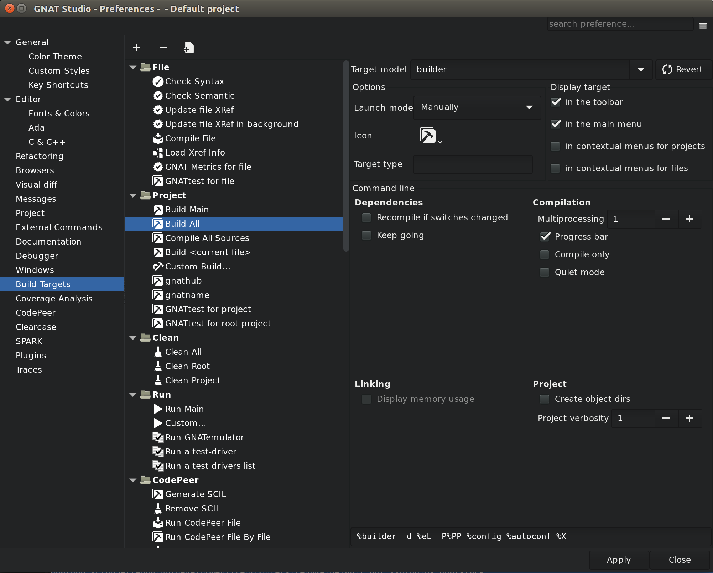
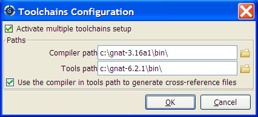

.. index:: compilation
.. index:: build
.. _Compilation/Build:

*****************
Compilation/Build
*****************

This chapter describes how to compile files, build executables, and run
them.  Most capabilities can be accessed through the :menuselection:`Build`
top-level menu or through the :menuselection:`Build` and
:menuselection:`Run` contextual menu items, as described below.

When GPS detects compiler messages, it adds entries to the
:guilabel:`Locations` view, allowing you to easily navigate through the
compiler messages (see :ref:`The_Locations_View`) and even to automatically
correct some errors or warnings (see :ref:`Code_Fixing`).

In source editors, compiler messages also appear as icons on the side of
each line that has a message. When the pointer is placed on these icons, a
tooltip appears, listing the error messages posted on the corresponding
line. When GPS can automatically correct the errors, clicking the icon
applies the fix. These icons are removed when the corresponding entries are
removed from :ref:`The_Locations_View`.

.. index:: build targets
.. _The_Target_Configuration_Editor:

The Target Configuration Editor
===============================

GPS provides an interface for launching operations such as building
projects, compiling individual files, and performing syntax or semantic
checks.  These operations all involve launching an external command and
parsing the output for error messages. In GPS, these operations are called
"Targets", and can be configured either through the Target Configuration
Editor, accessible from the :menuselection:`Edit --> Preferences...` menu,
or through XML configuration.
See :ref:`Customizing_build_Targets_and_Models`.

This editor is divided in two areas: on the left is a tree listing Targets
and in the main area is a panel for configuring the Target which is
currently selected in the tree.

The Targets tree
----------------

The Tree contains a list of targets, organized by categories.

On top of the tree are three buttons:

* The Add button creates a new target.
* The Remove button removes the currently selected target. Note that only
  user-defined targets can be removed; the default targets created by GPS
  cannot be removed.
* The Clone button creates a new user-defined target that is identical
  to the currently selected target.

The configuration panel
-----------------------

From the top of the configuration panel, you can select the Target model.
That Model determines the graphical options available in the
:guilabel:`Command line` frame.

The :guilabel:`Revert` button resets all target settings to their original
value.

The :guilabel:`Options` frame contains a number of options available for
all Targets.

* The Launch mode selects the way the target is launched:

  * Manually:

    The target is launched when you click on the corresponding icon in the
    toolbar or activate the corresponding menu item.  In the latter case, a
    dialog is displayed, allowing final modifications of the command line.

  * Manually with dialog:

    Same as Manually, but the dialog is always displayed.

  * Manually with no dialog:

    Same as Manually, but the dialog is never displayed.

  * On file save:

    The Target is launched automatically by GPS when a file is saved.  The
    dialog is never displayed.

  * In background:

    The Target is launched automatically in the background after each
    modification in the source editor. See :ref:`Background_Compilations`.

* Icon:

  The icon to use for representing this target in the menus and in the
  toolbar. To use one of your icons, register icons using the
  :samp:`<stock>` XML customization node. (See
  :ref:`Adding_stock_icons`). Then use the "custom" choice and enter the ID
  of the icon into the text field.

* Target type:

  Type of target described. If empty or set to "Normal", it represents a
  simple target. If set to another value, it represents multiple
  subtargets.  For example, if set to "main", each subtarget corresponds to
  a Main source as defined in the currently loaded project.  Other custom
  values may be defined and handled via the :samp:`compute_build_targets`
  hook.

The :guilabel:`Display` frame indicates where the launcher for this target
should be visible.

* in the toolbar:

  When active, a button is displayed in the main toolbar that can be used
  to quickly launch a Target.

* in the main menu:

  Whether to display a menu item corresponding to the Target in the main
  GPS menu. By default, Targets in the "File" category are listed directly
  in the Build menu and Targets in other categories are listed in a submenu
  corresponding to the name of the category.

* in contextual menus for projects:

  Whether to display an item in the contextual menu for projects in the
  Project View

* in contextual menus for files:

  Whether to display an item in the contextual menus for files, for example
  in file items in the Project View or directly on source file editors.

The :guilabel:`Command line` contains a graphical interface for some
configurable elements of the Target that are specific to the Model of this
Target.

The full command line is displayed at the bottom.  It may contain Macro
Arguments. For example, if the command line contains the string "%PP", GPS
will expand this to the full path to the current project. For a full list
of available Macros, see :ref:`Macro_arguments`.

.. _Background_Compilations:

Background compilations
-----------------------

GPS can launch compilation targets in the background. This means GPS
launches the compiler on the current state of the file in the editor.

.. index:: menu; tools --> consoles --> background builds

Error messages resulting from background compilations are not listed in the
:guilabel:`Locations` or :guilabel:`Messages` views. The full list of
messages are shown in the :guilabel:`Background Build` console, accessible
from the :menuselection:`View --> Background Builds` menu.
Error messages that contain a source location indication are shown as icons
on the side of lines in editors and the exact location is highlighted
directly in the editor. In both places, tooltips show the contents of the
error messages.

Messages from background compilations are removed automatically when either
a new background compilation has finished or a non-background compilation
is launched.

GPS launches background compilations for all targets that have a
:guilabel:`Launch mode` set to :guilabel:`In background` after you have made
modifications in a source editor.  Background compilation is mostly useful
for targets such as :samp:`Compile File` or :samp:`Check Syntax`. For
targets that operate on Mains, the last main used in a non-background is
considered, defaulting to the first main defined in the project hierarchy.

Background compilations are not launched while GPS is already listing
results from non-background compilations (i.e. as long as there are entries
in the :guilabel:`Locations` view showing entries in the :guilabel:`Builder
results` category).

.. index:: build modes
.. _The_Build_Mode:

The Build Mode
==============

GPS provides an easy way to build your project with different options,
through the mode selection, located in the :guilabel:`Scenario` view (see
:ref:`Scenario view <Scenario_View>`).

When the mode is set to "default", GPS performs the build using the
switches defined in the project. When the mode is set to another value,
specialized parameters are passed to the builder. For example, the
:program:`gcov` mode adds all the compilation parameters needed to
instrument the generated objects and executables to work with the
:program:`gcov` tool.

In addition to changing the build parameters, changing the mode changes the
output directory for objects and executables. For example, objects produced
under the :samp:`debug` mode will be located in the :file:`debug`
subdirectories of the object directories defined by the project.  This
allows switching from one Mode to another without having to erase the
objects pertaining to a different Mode.

You can define new modes using XML customization, see
:ref:`Customizing_build_Targets_and_Models`.

The Build Mode only affects builds done using recent versions of
:program:`gnatmake` and :program:`gprbuild`. The Mode selection has no
effect on builds done through Targets that launch other builders.

.. index:: build; toolchains
.. index:: build; multiple compilers
.. _Working_with_two_compilers:

Working with two compilers
==========================

This functionality is intended if your projects need to be compiled with a
specific (old) version of the GNAT toolchain while you still need to take
full advantage of up-to-date associated tools for non-compilation actions,
such as checking the code against a coding standard, getting better
cross-reference browsing in GPS, or computing metrics.

.. index:: menu; build --> settings --> toolchains

To configure GPS to handle two compiler toolchains, use the
:menuselection:`Build --> Settings --> Toolchains` menu.  This opens a
dialog from which you can activate the multiple-toolchains mode.

In this dialog, two paths need to be configured: the compiler path and the
tools path. The first is used to compile the code, while the second is used
to run up-to-date tools in order to get more functionality or more accurate
results.  GPS only enables the :guilabel:`OK` button when the two paths are
set to different locations, as that is the only case where it makes sense
to enable the multiple toolchains mode.

You can also activate an automated cross-reference generation from this
dialog. The cross-reference files are the :file:`.ali` files generated by
the GNAT compiler together with the compiled object files. The :file:`.ali`
files are used by GPS for several purposes, such as cross-reference
browsing and documentation generation. Having those :file:`.ali` files
produced by a recent compiler provides more accurate results for those
purposes but might cause serious problems if an old compiler were to also
read those :file:`.ali` files when compiling a project.

If you activate the automated cross-reference generation, GPS generates
those :file:`.ali` files using the compiler found in the tools path and
places them in a directory distinct from the one used by the actual
compiler. This allows GPS to take full benefit of up-to-date
cross-reference files, while the old toolchain's :file:`.ali` files
remain untouched.

.. index:: menu; tools --> consoles --> auxiliary builds

Cross-reference files generation does not output anything in the
:guilabel:`Messages` view so as not to be confused with the output of the
regular build process. If needed, you can see the output of the cross-ref
generation command with the :menuselection:`View --> Auxiliary Builds` menu.

Interaction with the remote mode
--------------------------------

The ability to work with two compilers has impacts on the remote mode
configuration: paths defined here are local paths so they have no meaning
on the server side.  To handle the case of using a specific compiler
version on the remote side while wanting up-to-date tools on the local
side, GPS does the following when both a remote compilation server is
defined and the multiple toolchains mode is in use:

* The compiler path is ignored when a remote build server is defined. All
  compilation actions are performed normally on the build server.
* The tools path is used and all related actions are performed on the local
  machine using this path.
* The cross-reference files are handled :program:`rsync` so they do not get
  overwritten during local and remote host synchronizations.  Otherwise,
  they would cause build and cross-reference generation actions to occur at
  the same time on the local machine and on remote server.
