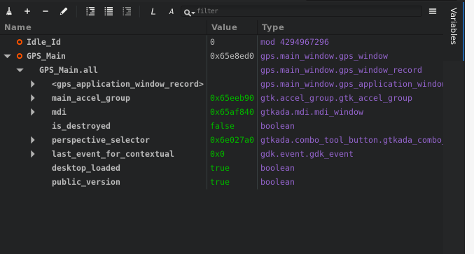
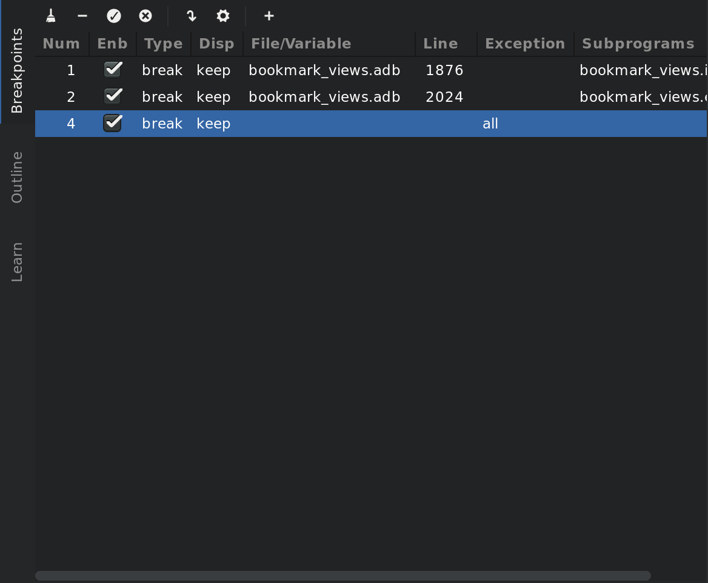
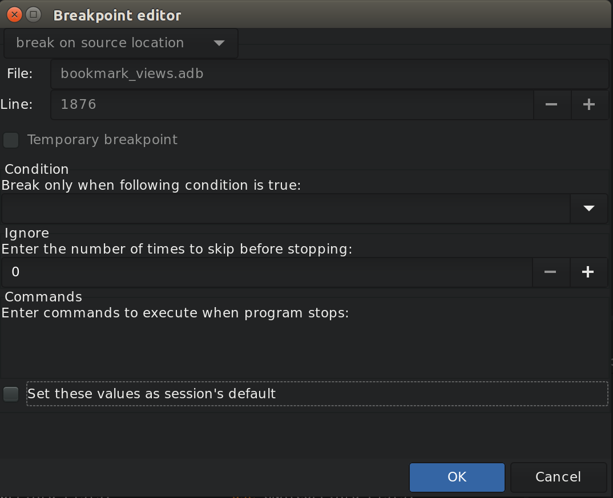
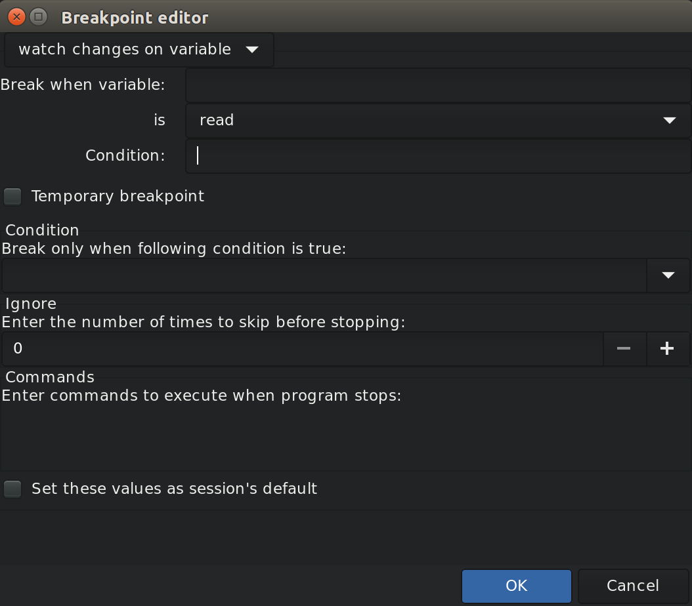
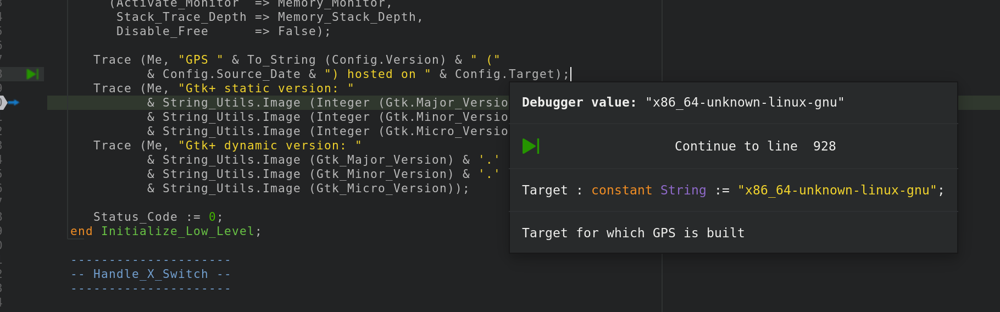
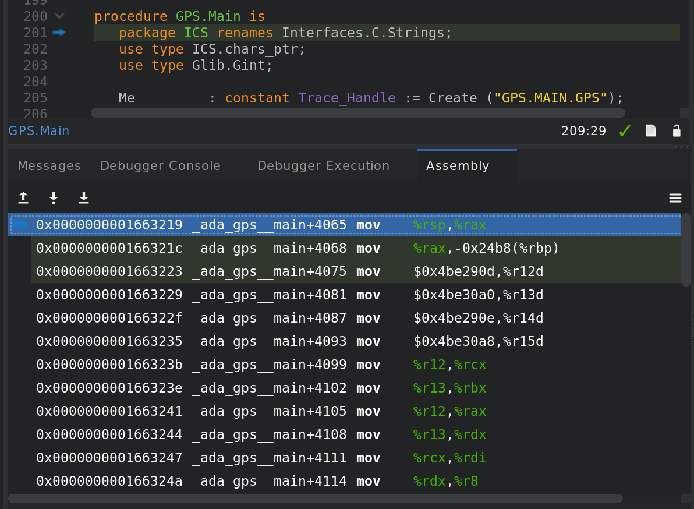

.. index:: debugging
.. _Debugging:

*********
Debugging
*********

GPS also serves as a graphical front-end for text-based debuggers such as
GDB.  If you understand the basics of the underlying debugger used by GPS,
you will better understand how GPS works and what kind of functionality it
provides.

Please refer to the debugger-specific documentation, e.g. the GNAT User's
Guide (chapter *Running and Debugging Ada Programs*), or the GDB documentation
for more details.

Debugging is tightly integrated with other components of GPS. For example,
you can edit files and navigate through your sources while debugging.

.. index:: menu; debug --> initialize
.. index:: menu; debug --> debug --> load file

To start a debug session, click on the :guilabel:`Debug` button in the main
toolbar or go to the :menuselection:`Debug --> Initialize`
menu and choose either the name of your executable, if you specified the
name of your main program(s) in the project properties, or start an empty
debug session using the :menuselection:`<no main file>` menu.  You can then
load any file to debug, by using the :menuselection:`Debug --> Debug -->
Load File...` menu.

You first need to build your executable with debug information
(:command:`-g` switch), either explicitly as part of your project
properties or via the :guilabel:`Debug` build mode (see
:ref:`The_Build_Mode` for more details).

Create multiple debuggers by using the :menuselection:`Debug --> Initialize` (or
the corresponding toolbar button) menu several times: this creates a new debugger
each time.  All debugger-related actions (e.g. stepping, running) are performed
in the current debugger, represented by the current debugger console.  To switch
to a different debugger, select its corresponding console. Setting breakpoints,
though, will be done for all debuggers, to help debug when you work on multiple
executables that share code.

After the debugger has been initialized, you have access several new views: the
debugger console (in a new page, after the :guilabel:`Messages` window), the
:guilabel:`Breakpoints` views and the :guilabel:`Variables` view.

You can now access any of the menus under :menuselection:`Debugger`, and you
also have access to additional contextual menus, in particular in the source
editor where you can easily display variables, set breakpoints, and get
automatic displays (via tooltips) of object values.

.. index:: menu; debug --> terminate
.. index:: menu; debug --> terminate current

To exit the debugger without quitting GPS, use the :menuselection:`Debug
--> Terminate Current` menu, which terminates your current debug session,
or the :menuselection:`Debug --> Terminate` menu which terminates all of
your current debug sessions.

.. index:: debugger; call stack
.. _The_Call_Stack_View:

The Call Stack View
===================

.. image:: call-stack.jpg

The call stack view lists the frames corresponding to the current execution
stack for the current thread or task.

The bottom frame corresponds to the outermost frame (where the thread is
currently stopped). This frame corresponds to the first function executed
by the current thread (e.g, :samp:`main` if the main thread is in C).
Click on any frame to switch to that caller's context; this updates the
display in the source window.  Use the up and down buttons in the tool bar
to go up and down one frame in the call stack.

The local configuration menu allows you to choose which information you want to
display in the call stack window (via check buttons):

* :menuselection:`Frame number`:

  The debugger frame number (usually starts at 0 or 1).

* :menuselection:`Program Counter`:

  The machine address corresponding to the function's entry point.

* :menuselection:`Subprogram Name`:

  The name of the subprogram.

* :menuselection:`Parameters`:

  The parameters to the subprogram.

* :menuselection:`File Location`:

  The filename and line number information.

.. index:: menu; debug --> data --> call stack

By default, only the subprogram name is displayed.  Hide the call stack
view by closing it and show it again using the menu :menuselection:`Debug
--> Data --> Call Stack` menu.

Showing extra information like the value for parameters requires more
work from the debugger, and thus will be slower.

.. index:: debugger; variables view
..  _The_Variables_View:

The Variables View
==================

The :guilabel:`Variables` view displays the value of selected variables or
debugger command every time the debugger stops. The display is done in a
tree, so that for instance the fields of a record are displayed in child
nodes (recursively).

Access types (or pointers) can also be expanded to show the value they
reference.

Values that have been modified since the debugger last stopped are highlighted
in red.

This value is very similar to :ref:`The_Data_Browser`.

The Breakpoint Editor
=====================

.. index:: menu; debug --> data --> edit breakpoints

Access the breakpoint editor from the :menuselection:`Debug --> Data -->
Breakpoints` menu.  It allows you to manipulate the various kinds of
breakpoints: those at a source location, on a subprogram, at an executable
address, on memory access (watchpoints), or on Ada exceptions.

This view lists the existing breakpoints that are currently set in the
debugger.
You can quickly and conveniently enable or disable breakpoints by
clicking on the checkboxes directly in the list.

Select a breakpoint in the list and click on the :guilabel:`View` button
in the toolbar to shows the corresponding editor at that location. You
can alternatively double-click on the breakpoint.

To view the details of a breakpoint, select it in the list and click on
the :guilabel:`Edit` button in the toolbar. You can also do a long click
on the breakpoint (keep your mouse pressed for a short while).

This opens up a separate dialog that shows the various attributes:

   - Details on where the breakpoint is set: the file and line, the
     specific address in memory, or the name of the exception which will
     stop the debugger when raised. These are not editable, so to change
     this you must create a new breakpoint instead;

   - The conditions to be met for the debugger to stop at that location.
     Such conditions can refer to variables valid at that location, and
     for instance test the value of specific variables;

   - The number of times that the breakpoint should be ignored before the
     debugger actually stops. This is useful when you know the error
     occurs after the 70th time hitting the breakpoint;

   - Debugger commands to execute when reaching the breakpoint.

   - When running :index:`VxWorks AE`, this dialog also lets you two extra
     properties:

      * The **scope** indicates which tasks will be stopped. Possible
        values are:

          - task: The breakpoint only affects the task that was active when the
            breakpoint was set. If the breakpoint is set before the program is run,
            the breakpoint affects the environment task.

          - pd: Any task in the current :index:`protection domain` is affected
            by the breakpoint.

          - any: Any task in any protection domain is affected by the breakpoint. This
            setting is only allowed for tasks in the Kernel domain.

      * The **action** indicates which tasks are stopped when the breakpoint
        is hit:

          - task: only the task that hit the breakpoint.

          - pd: all tasks in the current protection domain.

          - all: all stoppable tasks in the system.

     Both of these properties can either be configured for the specific breakpoint,
     or configured as the default for the session, so that from then on every
     breakpoint will have the specified values for scope and action.

To create new breakpoints, click on the :guilabel:`Add` button in the
toolbar. This opens up the same dialog as above, but lets you edit the
top section (file, line, exception, address,...). Select the type of
the breakpoint or watchpoint at the top.

.. index:: saving breakpoints
.. index:: breakpoints, saving
.. index:: preferences; debugger --> preserve state on exit

If you enabled the preference :menuselection:`Debugger --> Preserve state
on exit`, GPS automatically saves the currently set breakpoints and
restores them the next time you debug an executable in the same
project. This allows you
to immediately start debugging your application without having to set the
breakpoints every time. These breakpoints will be reused for all
executables in the same project.

.. index:: memory view
.. _The_Memory_View:

The Memory View
===============

.. image:: memory-view.jpg

The memory view allows you to display the contents of memory by specifying
either an address or a variable name.

.. index:: C
.. index:: hexadecimal

To display memory contents, enter either the address using the C
hexadecimal notation (0xabcd) or the name of a variable in the
:guilabel:`Location` text entry.  (If a variable is entered, the underlying
debugger computes its address.)  Then either press :kbd:`Enter` or click
the :guilabel:`View` button. GPS displays the memory with the corresponding
addresses in the bottom text area.

.. index:: ASCII

Specify the unit size (:guilabel:`Byte`, :guilabel:`Halfword` or
:guilabel:`Word`) and the format (:guilabel:`Hexadecimal`,
:guilabel:`Decimal`, :guilabel:`Octal`, or :guilabel:`ASCII`) and you can
display the corresponding ASCII value at the same time.

The :kbd:`up` and :kbd:`down` arrows as well as the :kbd:`Page up` and
:kbd:`Page down` keys in the memory text area allow you to walk through the
memory in order of ascending or descending addresses respectively.

Finally, modify a memory area by clicking on the location you want to
modify and entering the new values. Modified values appear in a different
color (red by default) and are only written to the target when you click
on the :guilabel:`Submit changes` button. Clicking on :guilabel:`Undo
changes` or going up or down in the memory also undoes your editing.

Clicking on :guilabel:`Close` closes the memory window, canceling your last
pending changes, if any.

.. _Using_the_Source_Editor_when_Debugging:

Using the Source Editor when Debugging
======================================

When debugging, the left area of each source editor provides the following
information:

*Current line executed*

  The line about to be executed by the debugger is highlighted in green (by
  default), and a green arrow is displayed on its left side.

*Lines with breakpoints*
  .. index:: breakpoint

  The line number (if present, otherwise the first few pixels) is highlighted
  with a background color for lines where breakpoints have been set. Add or
  delete breakpoints by clicking on the line number.
  These breakpoints can be set or unset even when no debugger is running.

.. index:: syntax highlighting
.. index:: tooltip

The second area in the source editor is a text window on the right that
displays the source files, with syntax highlighting.  If you hold the
pointer over a variable, GPS displays a tooltip showing the value of that
variable.  Disable these automatic tooltips using the preferences menu.

At all times, the contextual menu of the source window
contains a :menuselection:`Debug` submenu providing some or all of the entries
below. These entries are dynamic and apply to the entity under the pointer
(depending on the current language). In addition, if you have made a
selection in the editor, the text of the selection is used instead. This
allows you to easily display complex expressions (for example, you can add
comments to your code with expressions you want to display in the
debugger).

* :menuselection:`Debug --> Graph Display *selection*`

  Displays the selection (or by default the name under the pointer) in the
  data window. GPS automatically refreshes this value each time the
  process state changes (e.g after a step or a next command). To freeze the
  display, click on the corresponding icon in the browser or use the
  contextual menu for that item (see :ref:`The_Data_Browser`).

* :menuselection:`Debug --> Graph Display *selection*.all`

  Dereferences the selection (or by default the name under the pointer) and
  displays the value in the data browser.

* :menuselection:`View memory at address of *selection*`

  Brings up the memory view dialog and explores memory at the address of
  the selection.

* :menuselection:`Set Breakpoint on Line *xx*`

  Sets a breakpoint on the line under the pointer.
  This menu is always enabled, even when no debugger is started. This means
  that you can prepare breakpoints while working on the code, before you even
  start the debugger.

* :menuselection:`Set Breakpoint on *selection*`

  Sets a breakpoint at the beginning of the subprogram named *selection*.
  This menu is always enabled, even when no debugger is started. This means
  that you can prepare breakpoints while working on the code, before you even
  start the debugger.

* :menuselection:`Continue Until Line *xx*`

  Continues execution (the program must have been started previously) until
  it reaches the specified line.

* :menuselection:`Show Current Location`

  Jumps to the current line of execution. This is particularly useful after
  navigating through your source code.

.. _The_Assembly_Window:

The Assembly Window
===================

It is sometimes convenient to look at the assembly code for the subprogram
or source line you are currently debugging.

.. index:: menu; debug --> data --> assembly

Open the assembly window by using the :menuselection:`Debug --> Data -->
Assembly` menu.

The current assembler instruction is highlighted on the left with a green
arrow.  The instructions corresponding to the current source line are
highlighted (by default in red). This allows you to easily see where the
program counter will point after you press the :guilabel:`Next` button on
the tool bar.

Move to the next assembler instruction using the :guilabel:`Nexti` (next
instruction) button in the tool bar. If you choose :guilabel:`Stepi`
instead (step instruction), it steps into any subprogram being called by
that instruction.

For efficiency purposes, GPS only displays a small part of the assembly
code around the current instruction.  Specify how many instructions are
displayed in the preferences dialog.  Display
the instructions immediately preceding or following the currently displayed
instructions by pressing one of the :kbd:`Page up` or :kbd:`Page down` keys
or using the contextual menu in the assembly window.

.. index:: menu; debug --> data --> display registers

A convenient complement when debugging at the assembly level is the ability
to display the contents of machine registers.  When the debugger supports
it (as :program:`gdb` does), select the :menuselection:`Debug --> Data -->
Display Registers` menu to get an item in the data browser that shows the
current contents of each machine register and that is updated every time one
of them changes.

.. index:: menu; debug --> Data --> display any expression

You might also choose to look at a single register.  With :program:`gdb`,
select the :menuselection:`Debug --> Data --> Display Any Expression` menu,
enter something like::

  output /x $eax

in the field and select toggle button :guilabel:`Expression is a subprogram
call`. This creates a new browser item that is refreshed every time the
value of the register (in this case :command:`eax`) changes.

.. index:: debugger console
.. _The_Debugger_Console:

The Debugger Console
====================

The debugger console is the text window located at the bottom of the main
window.  It gives you direct access to the underlying debugger, to which
you can send commands (you need to refer to the underlying debugger's
documentation, but usually typing "help" will gives you an overview of the
available commands).

If the underlying debugger allows it, pressing :kbd:`Tab` in this window
provides completion for the command being typed (or its arguments).

Additional commands are defined here to provide a simple text interface to
some graphical features.  Here is the complete list of such commands (the
arguments between square brackets are optional and can be omitted):

* tree display expression

  .. index:: tree display

  This command displays the value of the expression in the
  :guilabel:`Variables` view. The :samp:`expression` should be
  the name of a variable, or any expression matching the source
  language of the current frame (for instance :samp:`A(0).Field`).

* tree display `command`

  This command executes the gdb command, and displays the result in the
  :guilabel:`Variables` view. The :samp:`command` should be an internal
  debugger command, for instance :samp:`info local`.

*graph (print|display) expression [dependent on display_num] [link_name name] [at x, y] [num num]*

  .. index:: graph print
  .. index:: graph display

  Create a new item in the browser showing the value of :samp:`Expression`,
  which is the name of a variable, or one of its fields, in the current
  scope for the debugger.  The command `graph print` creates a frozen item,
  one that is not automatically refreshed when the debugger stops, while
  :samp:`graph display` displays an item that is automatically refreshed.

  The new item is associated with a number displayed in its title bar.
  This number can be specified with the :samp:`num` keyword and can be used
  to create links between the items, using the second argument to the
  command, :samp:`dependent on`. By specifying the third argument, the link
  itself (i.e. the line) can be given a name that is also displayed.

*graph (print|display) `command`*

  Similar to the above, except you use it to display the result of a
  debugger command in the browser.  For example, using :program:`gdb`, if
  you want to display the value of a variable in hexadecimal rather than
  the default decimal, use a command like::

    graph display `print /x my_variable`

  This evaluates the command between back-quotes every time the debugger
  stops and displays the result in the browser. The lines that have changed
  are automatically highlighted (by default, in red).

*graph (enable|disable) display display_num [display_num ...]*

  .. index:: graph enable
  .. index:: graph disable

  Change the refresh status of items in the canvas. As explained above,
  items are associated with a number visible in their title bar.

  The :command:`graph enable` command forces the item to be refreshed
  automatically every time the debugger stops and :command:`graph disable`
  freezes the item, preventing its display from being changed.

*graph undisplay display_num*

  .. index:: graph undisplay

  Remove an item from the browser.

.. _Customizing_the_Debugger:

Customizing the Debugger
========================

GPS is a high-level interface to several debugger backends, in particular
:program:`gdb`.  Each backend has its own advantages, but you can enhance
the command line interface to these backends through GPS by using Python.

This section provides a short such example whose goal is to demonstrate the
notion of an "alias" in the debugger console. For example, if you type just
"foo", it executes a longer command, such as one displaying the value of a
variable with a long name. :program:`gdb` already provides this feature
through the :command:`define` keywords, but here we implement that feature
using Python in GPS.

GPS provides an extensive Python API to interface with each of the running
debuggers. In particular, it provides the function "send", used to send a
command to the debugger and get its output, and the function "set_output",
used when you implement your own functions.

It also provides, through :samp:`hook`, the capability to monitor the state
of the debugger back-end. In particular, one such hook,
:samp:`debugger_command_action_hook` is called when the user types a
command in the debugger console and before the command is executed. This
can be used to add your own commands. The example below uses this hook.

.. highlight:: python

Here is the code::

  import GPS

  aliases={}

  def set_alias(name, command):
     """Set a new debugger alias. Typing this alias in a debugger window
        will execute command"""
     global aliases
     aliases[name] = command

  def execute_alias(debugger, name):
     return debugger.send(aliases[name], output=False)

  def debugger_commands(hook, debugger, command):
     global aliases
     words = command.split()
     if words[0] == "alias":
        set_alias(words[1], " ".join (words [2:]))
        return True
     elif aliases.has_key(words [0]):
        debugger.set_output(execute_alias(debugger, words[0]))
        return True
     else:
        return False

  GPS.Hook("debugger_command_action_hook").add(debugger_commands)

The list of aliases is stored in the global variable :command:`aliases`,
which is modified by :command:`set_alias`. Whenever the user executes an
alias, the real command is sent to the debugger through
:command:`execute_alias`.

The real work is done by `debugger_commands`. If you execute the
:command:`alias` command, it defines a new alias. Otherwise, if you type
the name of an alias, we want to execute that alias.  And if not, we let the
underlying debugger handle that command.

After you copied this example in the :file:`$HOME/.gps/plug-ins` directory,
start a debugger as usual in GPS, and type the following in its console::

     (gdb) alias foo print a_long_long_name
     (gdb) foo

The first command defines the alias, the second line executes it.

This alias can also be used within the :command:`graph display` or
:command:`tree display` commands so the value of the variable is displayed in
the data window, for example::

     (gdb) graph display `foo`
     (gdb) tree display `foo`

You can also program other examples. You could write complex Python
functions, which would, for example, query the value of several variables
and pretty-print the result.  You can call any of these complex Python
functions from the debugger console or have it called automatically every
time the debugger stops via the :command:`graph display` command.

Command line interface
======================

GPS is still running the standard gdb underneath. So any command that you
might be used to run in gdb can also be executed from the :guilabel:`Debugger
Console`.

.. index:: .gdbinit

In particular, gdb has a feature where it reads initialization commands from
a `.gdbinit` configuration file. Here are some pieces of information if you
would like to use such files:

  - When :command:`gdb` starts, the current directory (which is where you
    should put your `.gdbinit` file is the environment's current directory.
    GPS doesn't override it. In general, this will also be the directory
    from which you started GPS itself. You can type::

        (gdb) pwd

    in the debugger console to find out exactly what the directory is.

  - :command:`gdb` always loads the global configuration `.gdbinit` in
    your home directory. It can also load a `.gdbinit` from the current
    directory, but this feature is disabled by default for security reasons
    to avoid malicious scripts.

    To enable the local `.gdbinit`, you will need to create the global one
    as well, with a contents similar to::

       add-auto-load-safe-path  <your directory>
       set auto-load local-gdbinit

    If you feel safe, you can replace "<your directory>" with "/" to always
    allow it on your system.
