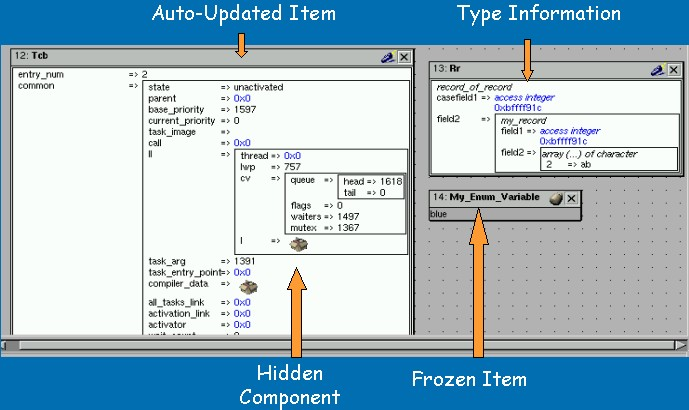
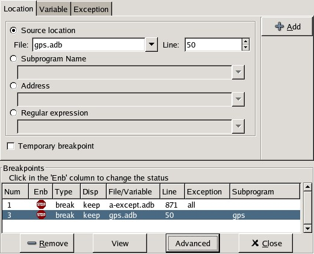
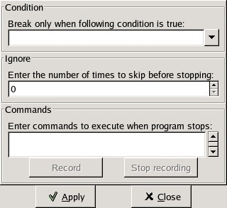
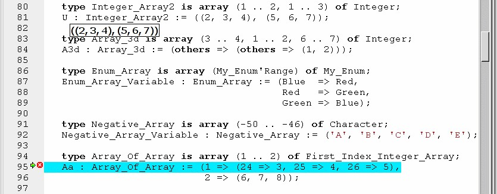
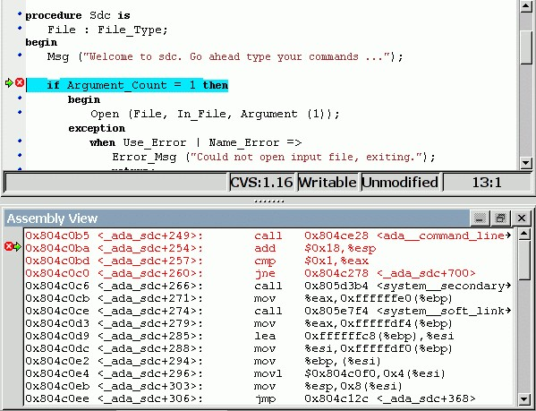

.. index:: debugging
.. _Debugging:

*********
Debugging
*********

GPS is also a graphical front-end for text-based debuggers such as GDB.
Having knowledge of the basics of the underlying debugger used by GPS will
help understanding how GPS works and what kind of functionality it
provides.

Please refer to the debugger-specific documentation, e.g. the GNAT User's
Guide (chapter *Running and Debugging Ada Programs*), or the GDB documentation
for more details.

Debugging is tightly integrated with other components of GPS. For example,
you can edit files and navigate through your sources while debugging.

.. index:: menu; debug --> initialize
.. index:: menu; debug --> debug --> load file

To start a debug session, go to the menu :menuselection:`Debug --> Initialize`,
and choose either the name of your executable, if you have specified the name
of your main program(s) in the project properties, or start an empty debug
session using the :menuselection:`<no main file>` item. It is then possible to
load any file to debug, by using the menu :menuselection:`Debug --> Debug -->
Load File...`

You first need to build your executable with debug information (`-g`
switch), either explicitly as part of your project properties or via the
`Debug` build mode (see :ref:`The_Build_Mode` for more details).

You can create multiple debuggers by using the :menuselection:`Debug -->
Initialize` menu several times: this will create a new debugger each time.
All debugger-related actions (e.g. stepping, running) are performed on the
current debugger, which is represented by the current debugger console.  To
switch between debuggers, simply select its corresponding console.

After the debugger has been initialized, you have access to two new
windows: the data window (in the top of the working area), and the debugger
console (in a new page, after the :guilabel:`Messages` and
:guilabel:`Shell` windows).  All the menus under :menuselection:`Debugger`
are now also accessible and you also have access to additional contextual
menus, in particular in the source editor where it is possible to easily
display variables, set breakpoints, and get automatic display (via
tooltips) of object values.

.. index:: menu; debug --> terminate
.. index:: menu; debug --> terminate current

When you want to exit the debugger without quitting GPS, go to the menu
:menuselection:`Debug --> Terminate Current`, which will terminate your
current debug session, or the menu :menuselection:`Debug --> Terminate`
which will terminate all your current debug sessions.

.. _The_Debug_Menu:

The Debug Menu
==============

The :menuselection:`Debug` entry in the menu bar provides operations acting
at a global level. Key shortcuts are available for the most common
operations and are displayed in the menus.  Here is a detailed list of the
menu items found in the menu bar:

.. index:: menu; debug --> run

:menuselection:`Debug --> Run...`
  Opens a dialog window allowing you to specify the arguments to pass to the
  program to be debugged and whether this program should stop at the
  beginning of the main subprogram. If you confirm by clicking on the *OK*
  button, the program will be launched with the arguments entered.

.. index:: menu; debug --> step

:menuselection:`Debug --> Step`
  Execute the program until it reaches the next source line.

.. index:: menu; debug --> step instruction

:menuselection:`Debug --> Next`
  Execute the program until it reaches the next source line, stepping over
  subroutine calls.

.. index:: menu; debug --> next instruction

:menuselection:`Debug --> Step Instruction`
  Execute the program until it reaches the next machine instruction.

.. index:: menu; debug --> next

:menuselection:`Debug --> Next Instruction`
  Execute the program until it reaches the next machine instruction, stepping
  over subroutine calls.

.. index:: menu; debug --> finish

:menuselection:`Debug --> Finish`
  Execute the program until the subprogram running in the selected stack
  frame returns.

.. index:: menu; debug --> continue

:menuselection:`Debug --> Continue`
  Continue execution of the program being debugged.

.. index:: menu; debug --> interrupt

:menuselection:`Debug --> Interrupt`
  Asynchronously interrupt the program being debugged.  Depending on the
  state of the program, you may stop it in low-level system code that does
  not have debug information or, in some cases, not even a coherent
  state. Use of breakpoints is preferable to interrupting programs.
  However, interrupting programs is nevertheless required in some
  situations, for example when the program appears to be in an infinite (or
  at least very long) loop.

.. index:: menu; debug --> terminate current
.. index:: preferences; debugger --> debugger windows

:menuselection:`Debug --> Terminate Current`
  Terminate the current debug session by terminating the underlying debugger
  (e.g `gdb`) used to handle the low level debugging. You can control what
  happens to the windows through the :menuselection:`Debugger --> Debugger
  Windows` preference.

.. index:: menu; debug --> termiante

:menuselection:`Debug --> Terminate`
  Terminate all your debug sessions. Same as :menuselection:`Debug -->
  Terminate Current` if there is only one debugger open.

Initialize
----------

This menu contains one entry per main unit defined in your project.  It
will start a debug session and load the executable associated with the main
unit selected and, if relevant, all corresponding settings: a debug session
will open the debug perspective and associated debug properties (e.g.
saved breakpoints, and data display).

.. index:: menu; debug --> initialize --> no main file

:menuselection:`Debug --> Initialize --> <No Main File>`

  Initializes the debugger with no executable. You can then use one of the
  other menu items like :menuselection:`Debug --> Debug --> Load File` or
  :menuselection:`Debug --> Debug --> Attach`.

Debug
-----

.. index:: board
.. index:: target
.. index:: cross debugger
.. index:: menu; debug --> debug --> connect to board

:menuselection:`Debug --> Debug --> Connect to board`
  Opens a simple dialog to connect to a remote board. This option is only
  relevant to cross debuggers.

.. index:: menu; debug --> debug --> load file
.. _open_program_menu:

:menuselection:`Debug --> Debug --> Load File...`
  Opens a file selection dialog that allows you to choose a program to debug.
  The program to debug is either an executable for native debugging or a
  partially linked module for cross environments (e.g VxWorks).

.. index:: menu; debug --> debug --> add symbols

:menuselection:`Debug --> Debug --> Add Symbols`
  Adds the symbols from a given file/module. This corresponds to the `gdb`
  command `add-symbol-file`. This menu is particularly useful under VxWorks
  targets, where the modules can be loaded independently of the debugger.
  For instance, if a module is independently loaded on the target
  (e.g. using `windshell`), you must use this functionality for the
  debugger to work properly.

.. index:: menu; debug --> debug --> attach

:menuselection:`Debug --> Debug --> Attach...`
  Instead of starting a program to debug, attach to an already running
  process. To do so specify the process id of the process you want to
  debug. The process might be busy in an infinite loop or waiting for
  event processing. Note that as for :ref:`Core Files <core_files>`, you
  need to specify an executable before attaching to a process.

.. index:: menu; debug --> debug --> detach

:menuselection:`Debug --> Debug --> Detach`
  Detaches the currently debugged process from the underlying debugger.  This
  means the executable will continue to run independently. You can use the
  :menuselection:`Debug --> Debug --> Attach To Process` menu later to
  re-attach to this process.

.. index:: menu; debug --> debug --> debug core file
.. index:: core file
.. _core_files:

:menuselection:`Debug --> Debug --> Debug Core File`
  Opens a file selection dialog allowing you to debug a core file
  instead of a running process.  You must first specify an
  executable to debug before loading a core file.

.. index:: menu; debug --> debug --> kill

:menuselection:`Debug --> Debug --> Kill`
  Kills the process being debugged.

Data
----

Most items in this menu need to access the underlying debugger when the
process is stopped, not when it is running, so you first need to stop the
process at a breakpoint or interrupt it before using the following
commands. Failure to do so will result in empty windows.

.. index:: menu; debug --> data --> data window

:menuselection:`Debug --> Data --> Data Window`
  Displays the Data window. If this window already exists, it is raised so that
  it becomes visible

.. index:: menu; debug --> data --> call stack

:menuselection:`Debug --> Data --> Call Stack`
  Displays the Call Stack window.
  See :ref:`The_Call_Stack_Window` for more details.

.. index:: menu; debug --> data --> threads

:menuselection:`Debug --> Data --> Threads`
  Opens a new window containing the list of threads currently present in
  the executable as reported by the underlying debugger. For each thread,
  it gives language- and debugger-dependent information such as internal
  identifier, name and status. You should refer to the underlying
  debugger's documentation for more details.  Like other similar commands, the
  process being debugged needs to be stopped before using this.  If not,
  GPS will display an empty list.

  When supported by the underlying debugger, clicking on a thread will change
  the context (variables, call stack, source file) displayed, allowing you to
  inspect the stack of the selected thread.

.. index:: menu; debug --> data --> tasks

:menuselection:`Debug --> Data --> Tasks`
  For `gdb` only, opens a new window containing the list of Ada tasks
  currently present in the executable.  Just like the thread window, you
  can switch to a selected task context by clicking on it, if supported by
  `gdb`. See the `gdb` documentation for the list of items displayed for
  each task.  Like other similar commands, the process being debugged needs
  to be stopped before using this window.

  .. image:: tasks.jpg

.. index:: protection domain
.. index:: menu; debug --> data --> protection domains

:menuselection:`Debug --> Data --> Protection Domains`
  For VxWorks AE only, opens a new window containing the list of available
  protection domains in the target. To change to a different protection
  domain, simply click on it. A @c{*} character indicates the current
  protection domain.

.. index:: menu; debug --> data --> assembly
.. index:: assembly

:menuselection:`Debug --> Data --> Assembly`
  Opens a new window displaying an assembly dump of the current code being
  executed.  See :ref:`The_Assembly_Window` for more details.

.. index:: menu; debug --> data --> edit breakpoints

:menuselection:`Debug --> Data --> Edit Breakpoints`
  Opens an advanced window to create and modify any kind of breakpoint,
  including watchpoints (see :ref:`The_Breakpoint_Editor`).  For simple
  breakpoint creation, see the description of the source window.

.. index:: menu; debug --> data --> examine memory

:menuselection:`Debug --> Data --> Examine Memory`
  Opens a memory viewer/editor. See :ref:`The_Memory_Window` for more details.

.. index:: menu; debug --> data --> command history

:menuselection:`Debug --> Data --> Command History`
  Opens a dialog with the list of commands executed in the current session.
  You can select any number of items in this list to replay the selection.

.. index:: menu; debug --> data --> display local variables

:menuselection:`Debug --> Data --> Display Local Variables`
  Opens an item in the :guilabel:`Data Window` containing all the local
  variables for the current frame.

.. index:: menu; debug --> data --> display arguments

:menuselection:`Debug --> Data --> Display Argument`
  Opens an item in the :guilabel:`Data Window` containing the arguments for the
  current frame.

.. index:: menu; debug --> data --> display registeres

:menuselection:`Debug --> Data --> Display Registers`
  Opens an item in the :guilabel:`Data Window` containing the machine registers
  for the current frame.

.. index:: menu; debug --> Data --> display any expression

:menuselection:`Debug --> Data --> Display Any Expression...`
  Opens a small dialog letting you specify an arbitrary expression in the
  :guilabel:`Data Window`. This expression can be a variable name or a more
  complex expression, following the syntax of the underlying debugger.  See the
  documentation of e.g `gdb` for more details on the syntax.  The check button
  *Expression is a subprogram call* should be enabled if the expression is
  actually a debugger command (e.g `p/x var`) or a procedure call in the
  program being debugged (e.g `call my_proc`).

.. index:: menu; debug --> data --> recompute

:menuselection:`Debug --> Data --> Recompute`
  Recomputes and refreshes all the items displayed in the
  :guilabel:`Data Window`.

.. index:: debugger; call stack
.. _The_Call_Stack_Window:

The Call Stack Window
=====================

.. image:: call-stack.jpg

The call stack window lists the frames corresponding to the current
execution stack for the current thread/task.

The bottom frame corresponds to the outermost frame (where the thread is
currently stopped). This frame corresponds to the first function executed
by the current thread (e.g `main` if the main thread is in C).  You can click
on any frame to switch to that caller's context; this will update the
display in the source window. See also the up and down buttons in the tool
bar to go up and down one frame in the call stack.

The contextual menu (right mouse button) allows you to choose which information
you want to display in the call stack window (via check buttons):

* :menuselection:`Frame number`: the debugger frame number (usually starts
  at 0 or 1)
* :menuselection:`Program Counter`: the machine address corresponding to the
  function's entry point.
* :menuselection:`Subprogram Name`: the name of the subprogram
* :menuselection:`Parameters`: the parameters of the subprogram
* :menuselection:`File Location`: the filename and line number information.

.. index:: menu; debug --> data --> call stack

By default, only the subprogram name is displayed.  You can hide the call stack
window by closing it, as for other windows, and show it again using the menu
:menuselection:`Debug --> Data --> Call Stack`.

.. index:: debugger; data window
.. _The_Data_Window:

The Data Window
===============

Description
-----------

The Data Window is the area in which various information about the process
being debugged can be displayed. This includes the value of selected
variables, the current contents of registers, and local variables.

.. index:: debugger; data window

This window is open by default when you start the debugger. You can force
it to display through the menu :menuselection:`Debug --> Data --> Data Window`.

.. index:: preferences; debugger --> preserve state on exit

By default, the contents of the data window is preserved whenever you close
it: if you reopen the data window either during the same debugger session,
or automatically when you start a debugger on the same executable, it will
display the same items as previously. This behavior is controlled by the
:menuselection:`Debugger --> Preserve State on Exit` preference.

The data window contains all the graphic boxes that can be accessed using the
:menuselection:`Debug --> Data --> Display*` menu items, the data window
:menuselection:`Display Expression...` contextual menu, the source window
:menuselection:`Display` contextual menu items, and the `graph` command
in the debugger console.

For each of these commands, a box is displayed in the data window with the
following information:

* A title bar containing:

  * The number of this expression: a positive number starting from 1 and
    incremented for each new box displayed. It represents the internal
    identifier of the box.

  * The name of the expression: this is the expression or variable
    specified when creating the box.

  * An icon representing either a flashlight, or a lock.

    This is a clickable icon that changes the state of the box from
    automatically updated (the flashlight icon) to frozen (the lock icon).
    When frozen, the value is grayed out and will not change until you
    change the state. When updated, the value of the box will be recomputed
    each time an execution command is sent to the debugger (e.g step,
    next).

  * An icon representing an 'X'.
    You can click on this icon to close/delete any box.

* A main area.

  The main area will display the data value hierarchically in a
  language-sensitive manner. The canvas knows about data structures of
  various languages (e.g `C`, `Ada`, `C++`) and organizes them accordingly.
  For example, each field of a record/struct/class or each item of an array
  will be displayed separately. For each subcomponent, a thin box is
  displayed to separate it from other components.

A contextual menu, that takes into account the current component selected by
the mouse, gives access to the following options:

:menuselection:`Close *component*`
  Closes the selected item.

:menuselection:`Hide all *component*`
  Hides all subcomponents of the selected item. To select a particular field or
  item in a record/array, move the mouse over the name of this component, not
  over the box containing the values for this item.

:menuselection:`Show all *component*`
  Shows all subcomponents of the selected item.

:menuselection:`Clone *component*`
  Clones the selected component into a new, independent item.

:menuselection:`View memory at address of *component*`
  Display the memory view dialog and explores memory at the address of the
  component.

:menuselection:`Set value of *component*`
  Sets the value of a selected component. This opens an entry box where you
  can enter the new value of a variable/component.  The underlying debugger
  does not perform any type or range checking on the value entered.

:menuselection:`Update Value`
  Refreshes the value displayed in the selected item.

:menuselection:`Show Value`
  Shows only the value of the item.

:menuselection:`Show Type`
  Shows only the type of each field for the item.

:menuselection:`Show Value+Type`
  Shows both the value and the type of the item.

:menuselection:`Auto refresh`
  Enables or disables the automatic refreshing of the item on program
  execution (e.g step, next).

The :guilabel:`Data Window` has a local menu bar which contains a number of
useful buttons:

:menuselection:`Align On Grid`
  Enables or disables alignment of items on the grid.

:menuselection:`Detect Aliases`
  Enables or disables the automatic detection of shared data structures.
  Each time you display an item or dereference a pointer, the address of
  all items already displayed on the canvas are compared with the address
  of a new item to display. If they match (for example, if you tried to
  dereference a pointer to an object already displayed), GPS will display a
  link instead of creating a new item.

:menuselection:`Zoom in`
  Redisplays the items in the data window with a bigger font.

:menuselection:`Zoom out`
  Displays the items in the data window with smaller fonts and
  pixmaps. This can be used when you have several items in the window and
  you can't see all of them at the same time (for example, a tree whose
  structure you want to see clearly).

:menuselection:`Zoom`
  Allows you to choose the zoom level directly from a menu.

:menuselection:`Clear`
  All the boxes currently displayed are removed.

Manipulating items
------------------

Moving items
^^^^^^^^^^^^

All the items on the canvas can be manipulated with the mouse.  They can be
freely moved anywhere on the canvas by clicking on them and then dragging
the mouse.  If you're trying to move an item outside of the visible area of
the data window, GPS will scroll the window to make the new position
visible.

GPS also provides automatic scrolling if you move the mouse while dragging
an item near the borders of the data window.  While the mouse remains close
to the border and the button is pressed while hovering on the item, GPS
scrolls the data window and moves the item. This provides an easy way to
move an item a long distance from its initial position.

Colors
^^^^^^

Most of the items are displayed using several colors, each conveying a special
meaning. Here is the meaning assigned to all colors (note that the exact color
can be changed through the preferences dialog; these are the default colors):

.. image:: colors.jpg

*black*

  The default color used to print the value of variables or expressions.

*blue*
  .. index:: C
  .. index:: Ada

  used for C pointers (or Ada access values), i.e. all the variables and
  fields that are memory addresses that denote some other value in memory.

  You can easily dereference these (that is to say see the value pointed to) by
  double-clicking on the blue text itself.

*red*

  Used for variables and fields whose value has changed since the data
  window was last displayed. For example, if you display an array in the
  data window and then select the *Next* button in the tool bar, the
  elements of the array whose value has just changed appear in red.

  As another example, if you choose to display the value of local variables
  in the data window (*Display->Display Local Variables*), only the
  variables whose value has changed are highlighted, the others remain
  black.

Icons
^^^^^

Several different icons can be used when displaying items. They also convey
special meanings.

*trash bin icon*

  Indicates that the debugger could not get the value of the variable or
  expression.  For example the variable is currently not in scope (and thus
  does not exist) or might have been optimized away by the compiler. In all
  cases, the display will be updated as soon as the variable becomes
  visible again.

*package icon*

  Indicates that part of a complex structure is currently hidden.
  Manipulating huge items in the data window (for example if the variable
  is an array of hundreds of complex elements) might not be very
  helpful. As a result, you can shrink part of the value to save some
  screen space and make it easier to visualize the interesting parts of
  these variables.

  Double-clicking on this icon will expand the hidden part and clicking on
  any sub-rectangle in the display of the variable will hide that part and
  replace it with this icon.

  See also the description of the contextual menu to automatically show or
  hide all the contents of an item.  One alternative to hiding
  subcomponents is to clone them in a separate item (see the contextual
  menu).

.. index:: breakpoint editor
.. index:: breakpoint
.. _The_Breakpoint_Editor:

The Breakpoint Editor
=====================

.. index:: menu; debug --> data --> edit breaakpoints

You can access the breakpoint editor from the menu :menuselection:`Debug
--> Data --> Edit Breakpoints`.  It allows manipulation of various kinds of
breakpoints: those at a source location, on a subprogram, at an executable
address, on memory access (watchpoints), and on Ada exceptions.

You can double-click on any breakpoint in the list to open the
corresponding source editor at the corresponding location. Alternatively,
you can select the breakpoint and then click on the :guilabel:`View`
button.

The top area provides an interface to create the different kinds of
breakpoints, while the bottom area lists existing breakpoints and their
characteristics.

To access advanced breakpoint characteristics for a given breakpoint, first
select the breakpoint from the list.  Then, click on the
:guilabel:`Advanced` button, which displays a new dialog window, where you
can specify commands to run automatically after a breakpoint is hit or
specify how many times a selected breakpoint will be ignored.  If running
VxWorks AE, you can also change the Scope and Action settings for
breakpoints.

.. index:: VxWorks AE

Scope/Action Settings for VxWorks AE
------------------------------------

In VxWorks AE breakpoints have two extra properties:

* Scope:
  which task(s) will be stopped at a given breakpoint. Possible 
  values are:

  * task:
    the breakpoint will only affect the task that was active when the
    breakpoint was set. If the breakpoint is set before the program is run, the
    breakpoint will affect the environment task

  * pd:
    .. index:: protection domain

    any task in the current protection domain will be affect by the breakpoint

  * any:

    any task in any protection domain will be affected by the
    breakpoint. This setting is only allowed for tasks in the Kernel
    domain.

* Action:
  when a task hits a breakpoints, which tasks are stopped:

  * task:
    stop only the task that hit the breakpoint.

  * pd:
    stop all tasks in the current protection domain

  * all:
    stop all stoppable tasks in the system

These two properties can be set/changed through the advanced breakpoints
characteristics by clicking on the *Advanced* button. There are two ways of
setting these properties:

* Per breakpoint settings:

  after setting a breakpoint (the default Scope/Action values will be
  task/task), select the :guilabel:`Scope/Action` tab in the
  :guilabel:`Advanced` settings.  To change these settings on a given
  breakpoint, select it from the breakpoints list, select the desired values of
  Scope and Action and click on the :guilabel:`Update` button.

* Default session settings:

  select the :guilabel:`Scope/Action` tab in the :guilabel:`Advanced`
  settings. Select the desired Scope and Action settings, check the
  :guilabel:`Set as session defaults` check box and click the
  :guilabel:`Close` button. From then on, every new breakpoint will have the
  specified values for Scope and Action.

.. index:: saving breakpoints
.. index:: breakpoints, saving
.. index:: preferences; debugger --> preserve state on exit

If you have enabled the preference :menuselection:`Debugger --> Preserve
state on exit`, GPS automatically saves the currently set breakpoints and
restores them the next time you debug the same executable. This allows you
to immediately start debugging your application without having to set the
breakpoints every time.

.. index:: memory view
.. _The_Memory_Window:

The Memory Window
=================

.. image:: memory-view.jpg

The memory window allows you to display the contents of memory by
specifying either an address, or a variable name.

.. index:: C
.. index:: hexadecimal

To display memory contents, enter the address using the C hexadecimal notation:
0xabcd, or the name of a variable, e.g foo, in the :guilabel:`Location` text
entry.  In the latter case, its address is computed automatically. Then either
press :kbd:`Enter` or click on the :guilabel:`View` button. This will display
the memory with the corresponding addresses in the bottom text area.

.. index:: ASCII

You can also specify the unit size (:guilabel:`Byte`, :guilabel:`Halfword` or
:guilabel:`Word`), the format (:guilabel:`Hexadecimal`, :guilabel:`Decimal`,
:guilabel:`Octal` or :guilabel:`ASCII`), and you can display the corresponding
ASCII value at the same time.

The :kbd:`up` and :kbd:`down` arrows as well as the :kbd:`Page up` and :kbd:`Page down`
keys in the memory text area allows you to walk through the memory in order of
ascending/descending addresses respectively.

Finally, you can modify a memory area by simply clicking on the location you
want to modify, and by entering the new values. Modified values will appear in
a different color (red by default) and will only be taken into account (i.e
written to the target) when you click on the :guilabel:`Submit changes`
button. Clicking on the :guilabel:`Undo changes` or going up/down in the memory
will undo your editing.

Clicking on :guilabel:`Close` will close the memory window, canceling your last
pending changes, if any.

.. _Using_the_Source_Editor_when_Debugging:

Using the Source Editor when Debugging
======================================

When debugging, the left area of each source editor provides the following
information:

*Lines with code*

  In this area, blue dots are present next to lines for which the debugger has
  debug information, in other words, lines that have been compiled with debug
  information and for which the compiler has generated some code.  Currently,
  there is no check when you try to set a breakpoint on a non dotted line: this
  will simply send the breakpoint command to the underlying debugger, and
  usually (e.g in the case of gdb) result in setting a breakpoint at the
  closest location that matches the file and line that you specified.

*Current line executed*
  This is a green arrow showing the line about to be executed.

*Lines with breakpoints*
  .. index:: breakpoint

  For lines where breakpoints have been set, a red mark is displayed on top of
  the blue dot for the line. You can add and delete breakpoints by clicking on
  this area (the first click will set a breakpoint, the second click will
  remove it).

.. index:: syntax highlighting
.. index:: tooltip

The second area in the source window is a text window on the right that
displays the source files, with syntax highlighting.  If you leave the cursor
over a variable, a tooltip will appear showing the value of this variable.
Automatic tooltips can be disabled in the preferences menu.

See :ref:`Preferences Dialog <preferences_dialog>`.

When the debugger is active, the contextual menu of the source window contains
a sub menu called :menuselection:`Debug` providing the following entries.

Note that these entries are dynamic: they will apply to the entity found under
the cursor when the menu is displayed (depending on the current language). In
addition, if a selection has been made in the source window the text of the
selection will be used instead. This allows you to display more complex
expressions easily (for example by adding some comments to your code with the
complex expressions you want to be able to display in the debugger).

:menuselection:`Debug --> Print *selection*`
  Prints the selection (or by default the name under the cursor) in the
  debugger console.

:menuselection:`Debug --> Display *selection*`
  Displays the selection (or by default the name under the cursor) in the data
  window. The value will be automatically refreshed each time the process state
  changes (e.g after a step or a next command). To freeze the display in the
  canvas, you can either click on the corresponding icon in the data window, or
  use the contextual menu for the specific item (see :ref:`The_Data_Window` for
  more information).

:menuselection:`Debug --> Print *selection*.all`
  Dereferences the selection (or by default the name under the cursor) and
  prints the value in the debugger console.

:menuselection:`Display *selection*.all`
  Dereferences the selection (or by default the name under the cursor) and
  displays the value in the data window.

:menuselection:`View memory at address of *selection*`
  Brings up the memory view dialog and explores memory at the address of the
  selection.

:menuselection:`Set Breakpoint on Line *xx*`
  Sets a breakpoint on the line under the cursor, in the current file.

:menuselection:`Set Breakpoint on *selection*`
  Sets a breakpoint at the beginning of the subprogram named *selection*

:menuselection:`Continue Until Line *xx*`
  Continues execution (the program must have been started previously) until
  it reaches the specified line.

:menuselection:`Show Current Location`
  Jumps to the current line of execution. This is particularly useful after
  navigating through your source code.

.. _The_Assembly_Window:

The Assembly Window
===================

It is sometimes convenient to look at the assembly code for the subprogram
or source line you are currently debugging.

.. index:: menu; debug --> data --> assembly

You can open the assembly window by using the menu
:menuselection:`Debug --> Data --> Assembly`.

The current assembly instruction is highlighted with a green arrow on its left.
The instructions corresponding to the current source line are highlighted in
red by default. This allows you to easily see where the program counter will
point to, once you have pressed the :guilabel:`Next` button on the tool bar.

Moving to the next assembly instruction is done through the :guilabel:`Nexti` (next
instruction) button in the tool bar. If you choose "Stepi" instead (step
instruction), this will also jump to the subprogram being called.

For efficiency reasons, only a small part of the assembly code around the
current instruction is displayed.  You can specify in the :ref:`Preferences
Dialog <preferences_dialog>` how many instructions are displayed by default.
Also, you can easily display the instructions immediately preceding or
following the currently displayed instructions by pressing one of the
:kbd:`Page up` or :kbd:`Page down` keys, or by using the contextual menu in the
assembly window.

.. index:: menu; debug --> data --> display registers

A convenient complement when debugging at the assembly level is the ability of
displaying the contents of machine registers.  When the debugger supports it
(as gdb does), you can select the :menuselection:`Debug --> Data --> Display
Registers` menu to get an item in the canvas that will show the current
contents of each machine register, and that will be updated every time one of
them changes.

.. index:: menu; debug --> Data --> display any expression

You might also choose to look at a single register.  With gdb, select the
:menuselection:`Debug --> Data --> Display Any Expression`, entering something
like::

  output /x $eax

in the field, and selecting the toggle button :guilabel:`Expression is a subprogram
call`. This will create a new canvas item that will be refreshed every time the
value of the register (in this case eax) changes.

.. index:: debugger console
.. _The_Debugger_Console:

The Debugger Console
====================

This is the text window located at the bottom of the main window.  In this
console, you have direct access to the underlying debugger, and can send
commands (you need to refer to the underlying debugger's documentation, but
usually typing *help* will give you an overview of the commands available).

If the underlying debugger allows it, pressing :kbd:`Tab` in this window will
provide completion for the command that is being typed (or for its arguments).

There are also additional commands defined to provide a simple text interface
to some graphical features.

Here is the complete list of such commands. The arguments between square
brackets are optional and can be omitted.

*graph (print|display) expression [dependent on display_num] [link_name name] [at x, y] [num num]*

  .. index:: graph print
  .. index:: graph display

  This command creates a new item in the canvas, that shows the value of
  `Expression`. `Expression` should be the name of a variable, or one of its
  fields, that is in the current scope for the debugger.

  The command `graph print` will create a frozen item, that is not
  automatically refreshed when the debugger stops, whereas `graph display`
  displays an automatically refreshed item.

  The new item is associated with a number, that is visible in its title bar.
  This number can be specified through the `num` keyword, and will be taken
  into account if no such item already exists.  These numbers can be used to
  create links between the items, using the second argument to the command,
  `dependent on`. The link itself (i.e. the line) can be given a name that is
  automatically displayed, using the third argument.

*graph (print|display) `command`*

  This command is similar to the one above, except it should be used to display
  the result of a debugger command in the canvas.

  For instance, if you want to display the value of a variable in hexadecimal
  rather than the default decimal with gdb, you should use a command like::

    graph display `print /x my_variable`

  This will evaluate the command between back-quotes every time the debugger
  stops, and display this in the canvas. The lines that have changed will be
  automatically highlighted (in red by default).

  This command is the one used by default to display the value of registers for
  instance.

*graph (enable|disable) display display_num [display_num ...]*

  .. index:: graph enable
  .. index:: graph disable

  This command will change the refresh status of items in the canvas. As
  explained above, items are associated with a number visible in their title
  bar.

  Using the `graph enable` command will force the item to be automatically
  refreshed every time the debugger stops, whereas the `graph disable` command
  will freeze the item.

*graph undisplay display_num*

  .. index:: graph undisplay

  This command will remove an item from the canvas

.. _Customizing_the_Debugger:

Customizing the Debugger
========================

GPS is a high-level interface to several debugger backends, in particular gdb.
Each back end has its own strengths, but you can enhance the command line
interface to these backends through GPS, using Python.

This section will provide a small such example. The idea is to provide the
notion of "alias" in the debugger console. For example, this can be used so
that you type "foo", and this really executes a longer command, like displaying
the value of a variable with a long name.

`gdb` already provides this feature through the `define` keywords, but we will
in fact rewrite that feature in terms of python.

GPS provides an extensive Python API to interface with each of the running
debugger. In particular, it provides the function "send", which can be used to
send a command to the debugger, and get its output, and the function
"set_output", which can be used when you implement your own functions.

It also provides, through `hook`, the capability to monitor the state of the
debugger back-end. In particular, one such hook, `debugger_command_action_hook`
is called when the user has typed a command in the debugger console, and before
the command is executed. This can be used to add your own commands. The example
below uses this hook.

.. highlight:: python

Here is the code::

  import GPS

  aliases={}

  def set_alias (name, command):
     """Set a new debugger alias. Typing this alias in a debugger window
        will then execute command"""
     global aliases
     aliases[name] = command

  def execute_alias (debugger, name):
     return debugger.send (aliases[name], output=False)

  def debugger_commands (hook, debugger, command):
     global aliases
     words = command.split()
     if words[0] == "alias":
        set_alias (words[1], " ".join (words [2:]))
        return True
     elif aliases.has_key (words [0]):
        debugger.set_output (execute_alias (debugger, words[0]))
        return True
     else:
        return False

  GPS.Hook ("debugger_command_action_hook").add (debugger_commands)

The list of aliases is stored in the global variable `aliases`, which is
modified by `set_alias`. Whenever the user executes an alias, the real command
send to the debugger is sent through `execute_alias`.

The real part of the work is done by `debugger_commands`. If the user is
executing the `alias` command, it defines a new alias. Otherwise, if he typed
the name of an alias, we really want to execute that alias. Else, we let the
debugger back-end handle that command.

After you have copied this example in the :file:`$HOME/.gps/plug-ins`
directory, you can start a debugger as usual in GPS, and type the following in
its console::

     (gdb) alias foo print a_long_long_name
     (gdb) foo

The first command defines the alias, the second line executes it.

This alias can also be used within the `graph display` command, so that the
value of the variable is in fact displayed in the data window automatically,
for instance::

     (gdb) graph display `foo`

Other examples can be programmed. You could write complex python functions,
which would for instance query the value of several variables, and pretty print
the result. This complex python function can then be called from the debugger
console, or automatically every time the debugger stops through the `graph
display` command.
