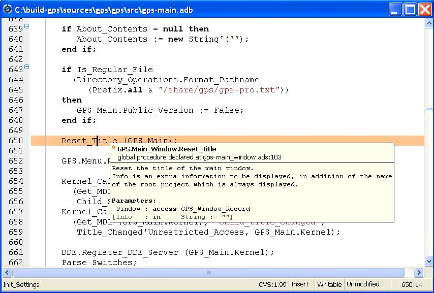

.. _Editing_Files:

*************
Editing Files
*************

.. index:: editing

.. _General_Information:

General Information
===================

Source editing is one of the central parts of GPS, giving in turn access to
many other functionalities, including extended source navigation and source
analyzing tools.

.. index:: screen shot

The integrated source editor provides all the usual capabilities found in
integrated environments, including:

*Title bar*
  Showing the full name of the file including path information.

*Line number information*
  This is the left area of the source editor. Line numbers can be disabled from
  the preferences. :ref:`The_Preferences_Dialog`.  Note that this area can also
  display additional information, such as the current line of execution when
  debugging, or cvs annotations.

*Scrollbar*
  Located on the right of the editor, it allows you to scroll through the
  source file.

*Speed column*
  This column, when visible, is located on the left of the editor. It allows
  you to view all the highlighted lines in a file, at a glance. For example,
  all the lines containing compilation errors are displayed in the Speed
  Column.  See :ref:`The_Preferences_Dialog` for information on how to
  customize the behavior of the Speed Column.

*Status bar*
  Giving information about the file. It is divided in two sections, one
  on the left and one on the right of the window.

*The left section*
  The first box on the left shows the current subprogram name for languages
  that support this capability. Currently `Ada`, `C` and `C++` have this
  ability. See :ref:`The_Preferences_Dialog` to enable or disable this feature.

*The right section*
  If the file is maintained under version control, and version control is
  supported and enabled in GPS, the first box on the left will show VCS
  information on the file: the VCS kind (e.g. *CVS*), followed by the revision
  number, and if available, the status of the file.

  The second box shows the current editing mode. This is either *Insert* or
  *Overwrite* and can be changed using the insert keyboard keys by default.

  The third box shows the writable state of the file.  You can change this
  state by clicking on the label directly: this will switch between *Writable*
  and *Read Only*.  Note that this will not change the permissions of the file
  on disk, it will only change the writable state of the source editor within
  GPS.

  When trying to save a file which is read only on the disk, GPS will ask for
  confirmation, and if possible, will force saving of the file, keeping its
  read only state.

  The fourth box shows whether the file has been modified since the last save.
  The three possible states are:

*Unmodified*
  The file has not been modified since the file has been loaded or saved.

*Modified*
  The file has been modified since last load or save. Note that if you undo all
  the editing operations until the last save operation, this label will change
  to *Unmodified*.

*Saved*
  The file has been saved and not modified since.

  The fifth box displays the position of the cursor in the file by a line and a
  column number.

*Contextual menu*
  Displayed when you right-click on any area of the source editor.  See in
  particular :ref:`Contextual_Menus_for_Source_Navigation` for more details.

*Syntax highlighting*
  Based on the programming language associated with the file, reserved words
  and languages constructs such as comments and strings are highlighted in
  different colors and fonts. See :ref:`The_Preferences_Dialog` for a list of
  settings that can be customized.

  By default, GPS knows about many languages. You can also easily add support
  for other languages through XML files. Most languages supported by GPS will
  provide syntax highlighting in the editor.

*Automatic indentation*
  .. index:: indentation

  When enabled, lines are automatically indented each time you press the
  :kbd:`Enter` key, or by pressing the indentation key.  The indentation key is
  :kbd:`Ctrl-Tab` by default, and can be changed in the key manager dialog,
  :ref:`The_Key_Manager_Dialog`.

  If a set of lines is selected when you press the indentation key, this whole
  set of lines will be indented.

*Tooltips*
  .. index:: tooltip

  When you leave the mouse over a word in the source editor, a small window
  will automatically pop up if there are relevant contextual information to
  display about the word.

  The type of information displayed depends on the current state of GPS.

  In normal mode, the entity kind and the location of declaration is displayed
  when this information is available. That is, when the cross-reference
  information about the current file has been generated. If there is no
  relevant information, no tooltip is displayed.  See
  :ref:`Support_for_Cross-References` for more information.

  .. highlight:: ada

  In addition, the documentation for the entity is displayed. This is the block
  of comments just before or just after the entity's declaration of body. There
  mustn't be any blank line between the two. For instance, the following are
  valid documentation for Ada and C::

    --  A comment for A
    A : Integer;

    B : Integer;
    --  A comment for B

    C : Integer;

    --  Not a comment for C, there is a blank linke

  In debugging mode, the value of the variable under the mouse is displayed in
  the pop up window if the variable is known to the debugger.  Otherwise, the
  normal mode information is displayed.

  You can disable the automatic pop up of tool tips in the Editor section of
  the preferences dialog. :ref:`The_Preferences_Dialog`.

*Code completion*
  .. index:: completion

  GPS provides two kinds of code completion: a :ref:`smart code completion
  <Smart_Completion>` based on semantic information, and a text completion.

  It is useful when editing a file and using often the same words to get
  automatic word completion. This is possible by typing the :kbd:`Ctrl-/` key
  combination (customizable through the key manager dialog) after a partial
  word: the next possible completion will be inserted in the editor. Typing
  this key again will cycle through the list of possible completions.

  Text completions are searched in all currently open source files, by first
  looking at the closest words and then looking further in the source as
  needed.

*Delimiter highlighting*
  .. index:: delimiter

  When the cursor is moved before an opening delimiter or after a closing
  delimiter, then both delimiters will be highlighted. The following characters
  are considered delimiters: ()[]{}.  You can disable highlighting of
  delimiters in the preferences.

  You can also jump to a corresponding delimiter by using the :kbd:`Ctrl-'`
  key, that can be configured in the preferences. Typing twice on this key will
  move the cursor back to its original position.

*Current line highlighting*
  .. index:: current line

  You can configure the editor to highlight the current line with a certain
  color. :ref:`The_Preferences_Dialog`.

*Current block highlighting*
  .. index:: block

  If this preference is enabled, the editor will highlight the current block of
  code, e.g. the current `begin...end` block, or loop statement, etc...

  The block highlighting will also take into account the changes made in your
  source code, and will recompute automatically the current block when needed.

  This capability is currently implemented for Ada, C and C++ languages.

*Block folding*
  .. index:: block

  When enabled, the editor will display `-` icons on the left side,
  corresponding to the beginning of subprograms. If you click on one of these
  icons, all the lines corresponding to this subprogram are hidden, except the
  first one. As for the block highlighting, these icons are recomputed
  automatically when you modify your sources and are always kept up to date.

  This capability is currently implemented for Ada, C and C++ languages.

*Auto save*
  .. index:: auto save

  You can configure the editor to periodically save modified files.  See
  :ref:`Autosave delay <autosave_delay>` for a full description of this
  capability.

*Automatic highlighting of entities*
  .. index:: auto highlighting

  When the cursor is positioned on an entity in the source editor, GPS will
  highlight all references to this entity in the current editor.

  When the cursor moves away from the entity, the highlighting is removed.

  This is controlled by the plugin `auto_highlight_occurrences.py`: it can be
  deactivated by deactivating the plugin (:ref:`The_Plug-ins_Editor`).

  Details such as presence of indications in the Speed Column or highlighting
  color can be customized in the `Plugins` section of
  :ref:`The_Preferences_Dialog`.

.. index:: emacs

GPS also integrates with existing third party editors such as `Emacs` or `vi`.
:ref:`Using_an_External_Editor`.

.. _Editing_Sources:

Editing Sources
===============

.. index:: editing

.. index:: source file

Key bindings
------------

.. index:: key

In addition to the standard keys used to navigate in the editor (up, down,
right, left, page up, page down), the integrated editor provides a number of
key bindings allowing easy navigation in the file.

There are also several ways to define new key bindings, see
:ref:`Defining_text_aliases` and :ref:`Binding_actions_to_keys`.

*Ctrl-Shift-u*
  .. index:: hexadecimal
  .. index:: ASCII

  Pressing these three keys and then holding Ctrl-Shift allow you to enter
  characters using their hexadecimal value. For example, pressing
  :kbd:`Ctrl-Shift-u-2-0` will insert a space character (ASCII 32, which is 20
  in hexadecimal).

*Ctrl-x / Shift-delete*
  Cut to clipboard

*Ctrl-c / Ctrl-insert*
  Copy to clipboard

*Ctrl-v / Shift-insert*
  Paste from clipboard

*Ctrl-s*
  Save file to disk

*Ctrl-z*
  Undo previous insertion/deletion

*Ctrl-r*
  Redo previous insertion/deletion

*Insert*
  Toggle overwrite mode

*Ctrl-a*
  Select the whole file

*Home / Ctrl-Pgup*
  Go to the beginning of the line

*End / Ctrl-Pgdown*
  Go to the end of the line

*Ctrl-Home*
  Go to the beginning of the file

*Ctrl-End*
  Go to the end of the file

*Ctrl-up*
  Go to the beginning of the line, or to the previous line if already at the
  beginning of the line.

*Ctrl-down*
  Go to the end of the line, or to the beginning of the next line if already at
  the end of the line.

*Ctrl-delete*
  Delete end of the current word.

*Ctrl-backspace*
  Delete beginning of the current word.

.. _The_File_Selector:

The File Selector
=================

.. index:: file selector
.. index:: Windows

The file selector is a dialog used to select a file. Under Windows, the default
is to use the standard file selection widget. Under other platforms, the file
selector is a built-in dialog:

.. index:: screen shot
.. image:: open-file.jpg

This dialog provides the following areas and capabilities:

* A tool bar on the top composed of five buttons giving access to common
  navigation features:

* :kbd:`left arrow`
  go back in the list of directories visited

* :kbd:`right arrow`
  go forward

* :kbd:`up arrow`
  go to parent directory

* :kbd:`refresh`
  refresh the contents of the directory

* :kbd:`home`
  go to home directory (value of the HOME environment variable, or `/` if
  not defined)

* A list with the current directory and the last directories explored.
  You can modify the current directory by modifying the text entry and hitting
  :kbd:`Enter`, or by clicking on the right arrow and choose a previous
  directory in the pop down list displayed.

* A directory tree. You can open or close directories by clicking on the `+`
  and `-` icons on the left of the directories, or navigate using the keyboard
  keys: :kbd:`up` and :kbd:`down` to select the previous or the next directory,
  :kbd:`+` and :kbd:`-` to expand and collapse the current directory, and
  :kbd:`backspace` to select the parent directory.

* A file list. This area lists the files contained in the selected directory.
  If a filter is selected in the filter area, only the relevant files for the
  given filter are displayed. Depending on the context, the list of files may
  include additional information about the files, e.g. the kind of a file, its
  size, etc...

* A filter area. Depending on the context, one or several filters are available
  to select only a subset of files to display. The filter *All files* which is
  always available will display all files in the directory selected.

* A file name area. This area will display the name of the current file
  selected, if any.  You can also type a file or directory name directly, and
  complete the name automatically by using the :kbd:`Tab` key.

* A button bar with the `OK` and `Cancel` buttons.  When you have selected the
  right file, clock on `OK` to confirm, or click on `Cancel` at any time to
  cancel and close the file selection.

.. _Menu_Items:

Menu Items
==========

.. index:: menu

The main menus that give access to extended functionalities related to source
editing are described in this section.

.. _The_File_Menu:

The File Menu
-------------

*New*
  .. index:: new file

  Open a new untitled source editor.  No syntax highlighting is performed until
  the file is saved, since GPS needs to know the file name in order to choose
  the programming language associated with a file.

  .. index:: Ada

  When you save a new file for the first time, GPS will ask you to enter the
  name of the file. In case you have started typing Ada code, GPS will try to
  guess based on the first main entity in the editor and on the current naming
  scheme, what should be the default name of this new file.

*New View*
  .. index:: new view
  .. index:: view

  Create a new view of the current editor. The new view shares the same
  contents: if you modify one of the source views, the other view is updated at
  the same time. This is particularly useful when you want to display two
  separate parts of the same file, for example a function spec and its body.

  A new view can also be created by keeping the :kbd:`shift` key pressed while
  drag-and-dropping the editor (see :ref:`Moving_Windows`). This second method
  is preferred, since you can then specify directly where you want to put the
  new view. The default when using the menu is that the new view is put on top
  of the editor itself.

*Open...*
  .. index:: open
  .. index:: Windows

  Open a file selection dialog where you can select a file to edit.  Under
  Windows, this is the standard file selector. Under other platforms, this is a
  built-in file selector described in :ref:`The_File_Selector`.

*Open From Project...*
  .. _Open_From_Project:

  .. index:: open
  .. index:: project

  Open a dialog where you can easily and rapidly select a source file from your
  project.

  .. index:: screen shot
  .. image:: open-from-project.jpg

  The first text area allows you to type a file name. You can start the
  beginning of a file name, and use the :kbd:`Tab` key to complete the file
  name. If there are several possible completions, the common prefix will be
  displayed, and a list of all possible completions will be displayed in the
  second text area.

  .. index:: key

  You can then either complete the name by typing it, or continue hitting the
  :kbd:`Tab` key to cycle through the possible completions, or click on one of
  the completions in the list displayed.

  If you press the down arrow key, the focus will move to the list of
  completions, so that you can select a file from this list without using the
  mouse.

  Once you have made your choice, click on the `OK` button to validate.
  Clicking on `Cancel` or hitting the :kbd:`Esc` key will cancel the operation
  and close the dialog.

  This dialog will only show each file once. If you have extended projects in
  your hierarchy, some files may be redefined in some extending project. In
  this case, only the files from the extending project are shown, and you
  cannot have access through this dialog to the overridden files of the
  extended project. Of course, you can still use the project view or the
  standard `File->Open` menu to open these files.

*Open From Host...*
  .. _Open_From_Host:

  .. index:: open

  Open a file selector dialog where you can specify a remote host, as defined
  in :ref:`The_remote_configuration_dialog`. You have access to a remote host
  file system, can specify a file which can be edited in GPS. When you hit the
  save button or menu, the file will be saved on the remote host.

  See also :ref:`Using_GPS_for_Remote_Development` for a more efficient way to
  work locally on remote files.

*Recent*
  .. index:: recent

  Open a sub menu containing a list of the ten most recent files opened in GPS,
  so that you can reopen them easily.

*Save*
  .. index:: save

  Save the current source editor if needed.

*Save As...*
  .. index:: save as

  Same current file under a different name, using the file selector dialog.
  :ref:`The_File_Selector`.

*Save More*
  .. index:: save

  Give access to extra save capabilities.

*All*
  .. index:: save all

  Save all items, including projects, etc...

*Desktop*
  .. index:: save desktop

  Save the desktop to a file. The desktop includes information about files,
  graphs, ... and their window size and position in GPS. The desktop is saved
  per top level project, so that if you reload the same project you get back to
  the same situation you were in when you left GPS. Instead, if you load a
  different project another desktop will be loaded (or the default desktop).
  Through the preference "Save Desktop On Exit", you can also automatically
  save this desktop when you quit GPS.

*Change Directory...*
  .. index:: directory

  Open a directory selection dialog that lets you change the current working
  directory.

*Messages*
  .. index:: messages

  This sub menu gives access to functionalities related to the Messages window.
  :ref:`The_Messages_Window`.

*Clear*
  .. index:: messages
  .. index:: clear

  Clear the contents of the Messages window.

*Save As...*
  .. index:: save as

  Save the contents of the Messages window to a file. A file selector is
  displayed to choose the name and location of the file.

*Load Contents...*
  .. index:: load

  Open a file selector to load the contents of a file in the Messages window.
  Source locations are identified and loaded in :ref:`The_Locations_View`.

*Export Locations to Editor*
  .. index:: export locations

  List the contents of the Locations view in a standard text editor.

*Close*
  .. index:: close

  Close the current window. This applies to all GPS windows, not only source
  editors.

*Print*
  .. index:: print

  Print the current window contents, optionally saving it interactively if it
  has been modified. The Print Command specified in the preferences is used if
  it is defined. On Unix this command is required; on Windows it is optional.

  On Windows, if no command is specified in the preferences the standard
  Windows print dialog box is displayed. This dialog box allows the user to
  specify the target printer, the properties of the printer, which pages to
  print (all, or a specific range of pages), the number of copies to print,
  and, when more than one copy is specified, whether the pages should be
  collated.  Pressing the Cancel button on the dialog box returns to GPS
  without printing the window contents; otherwise the specified pages and
  copies are printed on the selected printer. Each page is printed with a
  header containing the name of the file (if the window has ever been saved).
  The page number is printed on the bottom of each page.
 
  See also:ref:`Print Command <Print_Command>`.

*Exit*
  .. index:: exit
  .. index:: quit

  Exit GPS after confirmation and if needed, confirmation about saving modified
  windows and editors.

.. _The_Edit_Menu:

The Edit Menu
-------------

.. index:: menu
.. index:: edit

*Undo*
  .. index:: undo

  Undo previous insertion/deletion in the current editor.

*Redo*
  .. index:: redo

  Redo previous insertion/deletion in the current editor.

*Cut*
  .. index:: cut

  Cut the current selection and store it in the clipboard.

*Copy*
  .. index:: copy
  .. index:: yank

  Copy the current selection to the clipboard.

*Paste*
  .. index:: paste

  Paste the contents of the clipboard to the current cursor position.

*Paste Previous*
  .. index:: paste previous

  GPS stores a list of all the text that was previously copied into the
  clipboard through the use of Copy or Cut.

  By default, if you press Paste, the newest text will be copied at the current
  position. But if you select Paste Previous immediately after (one or more
  times) you can instead paste text that was copied previously in the
  clipboard.

  For instance, if you copy through `Edit->Copy` the text "First", then copy
  the text "Second", you can then select `Edit->Paste` to insert "Second" at
  the current location. If you then select `Edit->Paste Previous`, "Second"
  will be replaced by "First".

  Selecting this menu several times will replace the text previously pasted by
  the previous one in the list saved in the clipboard. When reaching the end of
  this list, GPS will started from the beginning, and insert again the last
  text copied into the clipboard.

  The size of this list is controlled by the `Clipboard Size` preference.

  For more information, :ref:`The_Clipboard_View`.

*Select All*
  .. index:: select all

  Select the whole contents of the current source editor.

*Rectangles...*
  See the section :ref:`Rectangles` for more information on rectangles.

*Insert File...*
  Open a file selection dialog and insert the contents of this file in the
  current source editor, at the current cursor location.

*Insert Shell Output...*
  Open an input window at the bottom of the GPS window where you can specify
  any external command. The output of the command will be inserted at the
  current editor location in case of success. If text is selected, the text is
  passed to the external command and replaced by the command's output.

*Format Selection*
  .. index:: format selection

  Indent and format the selection or the current line.
  :ref:`The_Preferences_Dialog`, for preferences related to source formatting.

*Smart Completion*

  .. _Smart_Completion:
  .. index:: completion

  Complete the identifier prefix under the cursor, and list the results in a
  pop-up list. Used with Ada sources this command can take advantage of an
  entity database as well as Ada parsers embedded in GPS which analyze the
  context, and offer completions from the entire project along with
  documentation extracted from comments surrounding declarations. To take full
  advantage of this feature, the smart completion preference must be enabled,
  which will imply the computation of the entity database at GPS startup.

  The support for C and C++ is not as powerful as the support for Ada since it
  relies completely on the xref information files generated by the compiler,
  does not have into account the C/C++ context around the cursor, and does not
  extract documentation from comments around candidate declarations. To take
  advantage of this feature, in addition to enable the smart completion
  preference, the C/C++ application must be built with `-fdump-xref`.

  In order to use this feature, open any Ada, C or C++ file, and begin to type
  an identifier. It has to be an identifier declared either in the current file
  (and accessible from the cursor location) or in one of the packages of the
  project loaded. Move the cursor right after the last character of the
  incomplete identifier and hit the completion key (which is :kbd:`ctrl+space`
  by default).  GPS will open a popup displaying all the known identifiers
  beginning with the prefix you typed. You can then browse among the various
  proposals by clicking on the  :kbd:`up` and :kbd:`down` keys, or using the
  left scrollbar. For each entity, a documentation box is filled. If the
  location of the entity is known, it's displayed as an hyperlink, and you can
  jump directly to its declaration by clicking on it.

  Typing new letters will reduce the range of proposal, as long as there remain
  solutions. Once you've selected the expected completion, you can validate by
  pressing :kbd:`Enter`.

  Typing control characters (ie, characters which cannot be used in
  identifiers) will also validate the current selection.

  GPS is also able to complete automatically subprogram parameter or dotted
  notations. For example, if you type::

    with Ada.
    

  the smart completion window will appear automatically, listing all the child
  and nested packages of Ada. You can configure the time interval after which
  the completion window appears (:ref:`The_Preferences_Dialog`).

  You can also write the beginning of the package, e.g.::

    with Ada.Text

  pressing the completion key will offer you Text_IO.

  If you are in a code section, you will be able to complete the fields of a
  record, or the contents of a package, e.g.::

     declare
       type R is record
          Field1 : Integer;
          Field2 : Integer;
       end record;

       V : R;
    begin
       V.
    
  Completing V. will propose Field1 and Field2.

  The smart completion can also give you the possible parameters of a call
  you're currently making. For example, in the following code::

       procedure Proc (A, B, C : Integer);
    begin
       Proc (1,
    
  If you hit the completion key after the comma, the smart completion engine
  will propose you to complete with the named parameters "B =>", "C =>" or
  directly to complete with all the remaining parameters, which in this case
  will be "B =>, C => )".

  .. index:: screen shot
  .. image:: smart-completion.jpg

  Limitations:

* This feature is currently only available for Ada, C and C++. Using the smart
  completion on sources of other languages behaves as the :ref:`identifier
  completion <Complete_Identifier>` does.

* Smart completion for C and C++ is based on the xref information generated by
  the compiler. Therefore, GPS has no knowledge on recently edited files. Use
  Build->Recompute Xref Info or rebuild with `-fdump-xref` to update the
  completion database.

* Smart completion for C and C++ is only triggered at the beginning of an
  expression (that is, it is not triggered on special characters such as '(',
  '->', or the C++ operator '::') and it may propose too much candidates since
  it does not have into account the C/C++ syntax context. Typing new letters
  will reduce the range of proposal, as long as there remain solutions.

* Smart completion of subprogram parameters, fields and dotted notation are not
  available yet for C and C++.

* `More Completion`
  .. index:: completion

  This submenu contains more ways to automatically complete code

  * `Expand Alias`
    Consider the current word as an alias and expand according to aliases
    defined in :ref:`Defining_text_aliases`.
  
  * `Complete Identifier`

    .. _Complete_Identifier:
  
    .. index:: complete identifier
  
    Complete the identifier prefix under the cursor. This command will cycle
    through all identifiers starting with the given prefix.
  
  * `Complete Block`
    .. index:: complete block
  
    Close the current statement (if, case, loop) or unit (procedure,
    function, package). This action works only on an Ada buffer.

*Selection*
  .. index:: selection

  *Comment Lines*
      .. index:: comment
  
      Comment the current selection or line based on the current programming
      language syntax.
  
  *Uncomment Lines*
      .. index:: uncomment
  
      Remove the comment delimiters from the current selection or line.
  
  *Refill*
      .. index:: refill
  
      Refill text on the selection or current line: rearrange line breaks in
      the paragraph so that line lengths do not exceed the maximum length, as
      set in the "Right margin" preference (:ref:`The_Preferences_Dialog`).
  
  *Sort*
      Sort the selected lines alphabetically. This is particularly useful when
      editing non source code, or for specific parts of the code, like with
      clauses in Ada.
  
  *Sort Reverse*
      Sort the selected lines in reverse alphabetical order
  
  *Pipe in external program...*
      Open an input window at the bottom of the GPS window where you can
      specify any external command, which will take the current selection as
      input. The output of the command will replace the contents of the
      selection on success.

  *Serialize*
      Increment a set of numbers found on adjacent lines.  The exact behavior
      depends on whether there is a current selection or not.
  
      If there is no selection, then the set of lines considered is from the
      current line on and includes all adjacent lines that have at least one
      digit in the original columns. In the following example, '|' marks the
      place where the cursor is at the beginning::

        AAA |10 AAA
        CCC 34567 CCC
        DDD DDD
      
      then only the first two lines will be modified, and will become::

        AAA 10 AAA
        CCC 11 CCC
        DDD DDD

      If there is a selection, all the lines in the selection are
      modified. For each line, the columns that had digits in the first
      line are modified, no matter what they actually contain. In the
      example above, if you select all three lines, the replacement becomes::

        AAA 10 AAA
        CCC 11567 CCC
        DDD 12D
      
      ie only the fifth and sixth columns are modified since only those
      columns contained digits in the first line. This feature assumes that
      you are selecting a relevant set of lines. But it allows you to
      transform blank lines more easily. For instance, if you have::

        AAA 1
        BBB
        CCC
      
      this is transformed into::

        AAA 1
        BBB 2
        CCC 3

  *Untabify*
      Replace all tabs in the current selection (or in the whole buffer if
      there is no selection) by the appropriate number of spaces

  *Move Right* and *Move Left*
      Shift the currently selected lines (or the current line if there is no
      selection) one character to the right or to the left

*Fold all blocks*
  .. index:: fold

  Collapse all the blocks in the current file.

*Unfold all blocks*
  .. index:: unfold

  Uncollapse all the blocks in the current file.

*Create Bookmark*
  Creates a new Bookmark at cursor position. For more information,
  :ref:`Bookmarks`.

*Pretty Print*
  .. index:: gnatpp
  .. index:: pretty print

  Pretty print the current source editor by calling the external tool `gnatpp`.
  It is possible to specify `gnatpp` switches in the switch editor.
  :ref:`The_Switches_Editor`.

*Generate Body*
  .. index:: gnatstub
  .. index:: generate body

  Generate Ada body stub for the current source editor by calling the external
  tool `gnatstub`.

*Edit with external editor*
  :ref:`Using_an_External_Editor`.

*Aliases*
  .. index:: alias

  Display the Aliases editor. :ref:`Defining_text_aliases`.

*Key shortcuts*
  .. index:: key shortcuts

  Give access to the key manager dialog, to associate commands with special
  keys. :ref:`The_Key_Manager_Dialog`.

*Preferences*
  .. index:: preferences

  Give access to the preferences dialog. :ref:`The_Preferences_Dialog`.

.. _Rectangles:

Rectangles
==========

.. index:: rectangle

Rectangle commands operate on a rectangular area of the text, that is all the
characters between two columns in a certain range of lines.

A rectangle is selected using the standard selection mechanism. You can
therefore use either the mouse to highlight the proper region, or :kbd:`shift`
and the cursor keys to extend the selection, or the Emacs selection (with the
mark and the current cursor location) if you have activated the
:file:`emacs.py` plugin.

Visually, a selected rectangle is exactly the same as the standard selection.
In particular, the characters after the last column, on each line, will also be
highlighted. The way the selection is interpreted (either as a full text or as
a rectangle) depends on the command you then chose to manipulate the selection.

If you chose one of the commands from the `/Edit/Rectangles` menu, the actual
rectangle will extend from the top-left corner down to the bottom-right corner.
All characters to the right of the right-most column, although they are
highlighted, are not part of the rectangle.

Consider for instance the following initial text::

  package A is
     procedure P;

     procedure Q;
  end A;
  

and assume we have selected from the character "p" in "procedure P", down to
the character "c" in "procedure Q".

The following commands can then be used (either from the menu, or you can
assign key shortcuts to them via the usual `/Edit/Key shortcuts` menu.

* `Cut` or `Delete`
  These commands will remove the selected text (and have no effect on empty
  lines within the rectangle). The former will in addition copy the rectangle
  to the clipboard, so that you can paste it later. In our example, we end up
  with::

    package A is
       edure P;

       edure Q;
    end A;

* `Copy`
  This command has no visual effect, but copies the contents of the rectangle
  into the clipboard.

* `Paste`
  Pastes the contents of the clipboard as a rectangle: each line from the
  clipboard is treated independently, and inserted on successive lines in the
  current editor. They all start in the same column (the one where the cursor
  is initially in), and existing text in the editor lines is shifted to the
  right). If for instance you now place the cursor in the second line, first
  column, and paste, we end up with::

    package A is
    proc   edure P;

    proc   edure Q;
    end A;
    
* `Clear`
  Replaces the contents of the selected rectangle with spaces. If we start
  from our initial exmaple, we end up with the following. Note the difference
  with `Delete`::

    package A is
           edure P;

           edure Q;
    end A;
    
* `Open`
  Replaces the contents of the selected rectangle with spaces, but shifts the
  lines to the right to do so. Note the difference with `Clear`::

    package A is
           procedure P;

           procedure Q;
    end A;

* `Replace With Text`
  This is similar to `Clear`, but the rectangle is replaced with user-defined
  text. The lines will be shifted left or right if the text you insert is
  shorter (resp. longer) than the width of the rectangle. If for instance we
  replace our initial rectangle with the text TMP, we end up with the
  following. Note that the character "c" has disappeared, since TMP is shorter
  than our rectangle width (4 characters). This command will impact lines that
  are empty in the initial rectangle::

    package A is
       TMPedure P;
       TMP
       TMPedure Q;
    end A;
    
* `Insert Text`
  This inserts a text to the left of the rectangle on each line. The following
  example inserts TMP. Note the difference with `Replace With Text`. This
  command will also insert the text on lines that are empty in the initial
  rectangle::

    package A is
       TMPprocedure P;
       TMP
       TMPprocedure Q;
    end A;

* `Sort`
  This sorts the selected lines according to the key which starts and ends on
  the corresponding rectangle's columns::

    aaa 15 aa
    bbb 02 bb
    ccc 09 cc

  With a selection starting from the 1 on the first line and ending on the 9 on
  the last one, sorting will result with the following content::

    bbb 02 bb
    ccc 09 cc
    aaa 15 aa

* `Sort reverse`

  As above but in the reverse order.

.. _Recording_and_replaying_macros:

Recording and replaying macros
==============================

.. index:: macros

It is often convenient to be able to repeat a given key sequence a number of
times.

GPS supports this with several different methods:

* Repeat the next action

  If there is a single key press that you wish to repeat a number of times, you
  should first use the GPS action `"Repeat Next"` (bound by default to
  :kbd:`control-u`, but this can be changed as usual through the `/Edit/Key
  Shortcuts` menu), then entering the number of times you wish to repeat, and
  finally pressing the key you want.

  For instance, the following sequence :kbd:`control-u 79 -` will insert
  79 characters '-' in the current editor. This proves often useful to insert
  separators.

  If you are using the emacs mode (see `/Tools/Plug-ins` menu), you can also
  use the sequence :kbd:`control-u 30 control-k` to delete
  30 lines.

* Recording macros

  If you wish to repeat a sequence of more than 1 key, you should record this
  sequence as a macro. All macro-related menus are found in `/Tools/Macros`,
  although it is often more convenient to use these through key bindings, which
  you can of course override.

  You must indicate to GPS that it should start recording the keys you are
  pressing. This is done through the `/Tools/Macros/Start Keyboard Macro` menu.
  As its name indicates, this only records keyboard events, not mouse events.
  Until you select `/Tools/Macros/Stop Macro`, GPS will keep recording the
  events.

  In Emacs mode, the macro actions are bound to :kbd:`control-x (`,
  :kbd:`control-x )` and :kbd:`control-x e` key shortcuts. For instance, you
  can execute the following to create a very simple macro that deletes the
  current line, wherever your cursor initially is on that line:

  *  :kbd:`control-x (`     start recording
  *  :kbd:`control-a`      go to beginning of line
  *  :kbd:`control-k`      delete line
  *  :kbd:`control-x )`     stop recording

.. _Contextual_Menus_for_Editing_Files:

Contextual Menus for Editing Files
==================================

.. index:: case exceptions

Whenever you ask for a contextual menu (using e.g. the third button on your
mouse) on a source file, you will get access to a number of entries, displayed
or not depending on the current context.

Menu entries include the following categories:

*Source Navigation*
  :ref:`Contextual_Menus_for_Source_Navigation`.

*Dependencies*
  :ref:`Dependency_Browser`.

*Entity browsing*
  :ref:`Entity_Browser`.

*Project view*
  :ref:`The_Project_View`.

*Version control*
  :ref:`The_Version_Control_Contextual_Menu`.

*Debugger*
  :ref:`Using_the_Source_Editor_when_Debugging`.

*Case exceptions*
  :ref:`Handling_of_case_exceptions`.

*Refactoring*
  :ref:`Refactoring`.

.. index:: language, editor
.. index:: character set

In addition, an entry `Properties...` is always visible in this contextual
menu. When you select it, a dialog pops up that allows you to override the
language used for the file, or the character set.

This can be used for instance if you want to open a file that does not belong
to the current project, but where you want to benefit from the syntax
highlighting that GPS knows how to.

It is not recommended to override the language for source files that belong to
the project. Instead, you should use the `Project Properties` dialog and change
the naming scheme if appropriate. This will ensure better consistency between
GPS and the compiler in the way they manipulate the file.

.. _Handling_of_case_exceptions:

Handling of case exceptions
===========================

.. index:: casing

GPS keeps a set of case exceptions that is used by all case insensitive
languages. When editing or reformatting a buffer for such a language the case
exception dictionary will be checked first. If an exception is found for this
word or a substring of the word, it will be used; otherwise the specified
casing for keywords or identifiers is used. A substring is defined as a part of
the word separated by underscores.

Note that this feature is not activated for entities (keywords or identifiers)
for which the casing is set to `Unchanged`. See :ref:`The_Preferences_Dialog`.

A contextual menu named **Casing** has the following entries:

*Lower *entity**
  Set the selected entity in lower case.

*Upper *entity**
  Set the selected entity in upper case.

*Mixed *entity**
  Set the selected entity in mixed case (set the first letter and
  letters before an underscore in upper case, all other letters are set
  to lower case).

*Smart Mixed *entity**
  Set the selected entity in smart mixed case. Idem as above except that
  upper case letters are kept unchanged.

*Add exception for *entity**
  Add the current entity into the case exception dictionary.

*Remove exception for *entity**
  Remove the current entity from the case exception dictionary.

To add or remove a substring exception into/from the dictionary you need to
first select the substring on the editor. In this case the last two contextual
menu entries will be:

*Add substring exception for *str**
  Add the selected substring into the case substring exception dictionary.

*Remove substring exception for *str**
  Remove the selected substring from the case substring exception dictionary.

.. _Refactoring:

Refactoring
===========

.. index:: refactoring

GPS includes basic facilities for refactoring your code. Refactoring is the
standard term used to describe manipulation of the source code that do not
affect the behavior of the application, but help reorganize the source code to
make it more readable, more extendable, ...

Refactoring technics are generally things that programmers are used to do by
hand, but which are faster and more secure to do automatically through a tool.

One of the basic recommendations when you refactor your code is to recompile
and test your application very regularly, to make sure that each of the small
modifications you made to it didn't break the behavior of your application.
This is particularly true with GPS, since it relies on the cross-references
information that is generated by the compiler. If some of the source files have
not been recompiled recently, GPS will print warning messages indicating that
the renaming operation might be dangerous and/or only partial.

One of the reference books that was used in the choice of refactoring methods
to implement is "Refactoring", by Martin Fowler (Addison Wesley).

.. _Rename_Entity:

Rename Entity
-------------

Clicking on an entity in a source file and selecting the `Refactoring/Rename`
menu will open a dialog asking for the new name of the entity. GPS will rename
all instances of the entity in your application.  This includes the definition
of the entity, its body, all calls to it, etc...  Of course, no comment is
updated, and you should probably check manually that the comment for the entity
still applies.

GPS will handle primitive operations by also renaming the operations it
overrides or that overrides it. This means that any dispatching call to that
operation will also be renamed, and the application should still work as
before. If you are renaming a parameter to a subprogram, GPS can also rename
parameters with similar names in overriding or overridden subprograms.

The behavior when handling read-only files can be specified: by default, GPS
will not do any refactoring in these files, and will display a dialog listing
all of them; but you can also choose to make them writable just as if you had
clicked on the "Read-Only" button in the status bar of the editor and then have
GPS perform the renaming in them as well.

.. _Name_Parameters:

Name Parameters
---------------

If you are editing Ada code and click on a call to a subprogram, GPS will
display a contextual menu `Refactoring/Name parameters`, which will replace all
unnamed parameters by named parameters, as in::

     Call (1, 2)
  =>
     Call (Param1 => 1, Param2 => 2);

.. _Extract_Subprogram:

Extract Subprogram
------------------

This refactoring is used to move some code from one place to a separate
subprogram. The goal is to simplify the original subprogram, by moving part of
its code elsewhere.

Here is an example from the "Refactoring" book. The refactoring will take place
in the body of the package :file:`pkg.adb`, but the spec is needed so that you
can compile the source code (a preliminary step mandatory before you can
refactor the code)::

  pragma Ada_05;

  with Ada.Containers.Indefinite_Doubly_Linked_Lists;
  with Ada.Strings.Unbounded;

  package Pkg is

     type Order is tagged null record;
     function Get_Amount (Self : Order) return Integer;

     package Order_Listsis new
        Ada.Containers.Indefinite_Doubly_Linked_Lists (Order);

     type Invoice is tagged record
        Orders : Order_Lists.List;
        Name   : Ada.Strings.Unbounded.Unbounded_String;
     end record;

     procedure Print_Owing (Self : Invoice);

  end Pkg;

The initial implementation for this code is given by the following code::

  pragma Ada_05;
  with Ada.Strings.Unbounded;  use Ada.Strings.Unbounded;
  with Ada.Text_IO;            use Ada.Text_IO;

  package body Pkg is
     use Order_Lists;

     ----------------
     -- Get_Amount --
     ----------------

     function Get_Amount (Self : Order) return Integer is
     begin
        return 0;
     end Get_Amount;

     -----------------
     -- Print_Owing --
     -----------------

     procedure Print_Owing (Self : Invoice) is
        E : Order_Lists.Cursor := First (Self.Orders);
        Outstanding : Natural := 0;
        Each : Order;
     begin
        --  <<< line 30
        --  Print Banner

        Put_Line ("");
        Put_Line (" Customer Owes         ");
        Put_Line ("");  --  << line 35

        --  Calculate Outstanding

        while Has_Element (E) loop
           Each := Element (E);
           Outstanding := Outstanding + Each.Get_Amount;
           Next (E);
        end loop;

        --  Print Details

        Put_Line ("Name: " & To_String (Self.Name));
        Put_Line ("Outstanding:" & Outstanding'Img);
     end Print_Owing;
  end Pkg;
  
The procedure `Print_Owing` is too long and does several independent actions.
We will perform a series of three successive refactoring steps to extract the
code and move it elsewhere.

The first is the code that prints the banner. Moving it is easy, since this
code does not depend on any context. We could just do a copy-paste, but then we
would have to create the new subprogram. Instead, we select lines 30 to 35, and
then select the contextual menu `Refactoring/Extract Subprogram`.  GPS will
then automatically change `Print_Owing` and create a new procedure
`Print_Banner` (the name is specified by the user, GPS does not try to guess
it). Also, since the chunk of code that is extracted starts with a comment, GPS
automatically uses that comment as the documentation for the new subprogram.
Here is part of the resulting file::

  package body Pkg is

     procedure Print_Banner;
     --  Print Banner

     ------------------
     -- Print_Banner --
     ------------------

     procedure Print_Banner is
     begin
        Put_Line ("");
        Put_Line (" Customer Owes         ");
        Put_Line ("");
     end Print_Banner;

     ... (code not shown)

     procedure Print_Owing (Self : Invoice) is
        E : Order_Lists.Cursor := First (Self.Orders);
        Outstanding : Natural := 0;
        Each : Order;
     begin
        Print_Banner;

        --  Calculate Outstanding

        while Has_Element (E) loop
           Each := Element (E);
           Outstanding := Outstanding + Each.Get_Amount;
           Next (E);
        end loop;

        --  Print Details   <<< line  54

        Put_Line ("Name: " & To_String (Self.Name));
        Put_Line ("Outstanding:" & Outstanding'Img);  --  line 57
     end Print_Owing;
  end Pkg;

A more interesting example is when we want to extract the code to print the
details of the invoice. This code depends on one local variable and the
parameter to Print_Owing. When we select lines 54 to 57 and extract it into a
new `Print_Details` subprogram, we get the following result. GPS automatically
decides which variables to extract, and whether they should become parameters
of the new subprogram, or local variables. In the former case, it will also
automatically decide whether to create `"in"`, `"out"` or `"in out"`
parameters. If there is a single `"out"` parameter, it will automatically
create a function rather than a procedure.

GPS will use, for the parameters, the same name that was used for the local
variable. Very often, it will make sense to recompile the new version of the
source, and then apply the `Rename Entity` refactoring to have more specific
names for the parameters, or the `Name Parameters` refactoring so that the call
to the new method uses named parameters to further clarify the code::

     ... code not shown

     procedure Print_Details
       (Self : Invoice'Class;
        Outstanding : Natural);
     --  Print Details

     -------------------
     -- Print_Details --
     -------------------

     procedure Print_Details
       (Self : Invoice'Class;
        Outstanding : Natural)
     is
     begin
        Put_Line ("Name: " & To_String (Self.Name));
        Put_Line ("Outstanding:" & Outstanding'Img);
     end Print_Details;

     procedure Print_Owing (Self : Invoice) is
        E : Order_Lists.Cursor := First (Self.Orders);
        Outstanding : Natural := 0;
        Each : Order;
     begin
        Print_Banner;

        --  Calculate Outstanding

        while Has_Element (E) loop
           Each := Element (E);
           Outstanding := Outstanding + Each.Get_Amount;
           Next (E);
        end loop;

        Print_Details (Self, Outstanding);
     end Print_Owing;

Finally, we want to extract the code that computes the outstanding amount. When
this code is moved, the variables `E` and `Each` become useless in
`Print_Owing` and are moved into the new subprogram (which we will call
`Get_Outstanding`. Here is the result of that last refactoring (the initial
selection should include the blank lines before and after the code, to keep the
resulting `Print_Owing` simpler). GPS will automatically ignore those blank
lines::

     ... code not shown

     procedure Get_Outstanding (Outstanding : in out Natural);
     --  Calculate Outstanding

     ---------------------
     -- Get_Outstanding --
     ---------------------

     procedure Get_Outstanding (Outstanding : in out Natural) is
        E : Order_Lists.Cursor := First (Self.Orders);
        Each : Order;
     begin
        while Has_Element (E) loop
           Each := Element (E);
           Outstanding := Outstanding + Each.Get_Amount;
           Next (E);
        end loop;
     end Get_Outstanding;

     procedure Print_Owing (Self : Invoice) is
        Outstanding : Natural := 0;
     begin
        Print_Banner;
        Get_Outstanding (Outstanding);
        Print_Details (Self, Outstanding);
     end Print_Owing;

Note that the final version of `Print_Owing` is not perfect. For instance,
passing the initial value 0 to `Get_Outstanding` is useless, and in fact that
should probably be a function with no parameter. But GPS already saves a lot of
time and manipulation.

Finally, a word of caution: this refactoring does not check that you are giving
a valid input. For instance, if the text you select includes a `declare` block,
you should always include the full block, not just a part of it (or select text
between `begin` and `end`). Likewise, GPS does not expect you to select any
part of the variable declarations, just the code.

.. _Using_an_External_Editor:

Using an External Editor
========================

.. index:: editor
.. index:: external editor
.. index:: emacs
.. index:: vi

GPS is integrated with a number of external editors, in particular `Emacs` and
`vi`. The choice of the default external editor is done in the preferences.
:ref:`The_Preferences_Dialog`.

.. index:: preferences

The following values are recognized:

*gnuclient*
  .. index:: gnuclient

  This is the recommended client. It is based on Emacs, but needs an extra
  package to be installed. This is the only client that provides a full
  integration in GPS, since any extended lisp command can be sent to the Emacs
  server.

  By default, gnuclient will open a new Emacs frame for every file that is
  opened. You might want to add the following code to your :file:`.emacs` file
  (create one if needed) so that the same Emacs frame is reused every time::

       (setq gnuserv-frame (car (frame-list)))

  .. index:: gnuserv url

  See `http://www.hpl.hp.com/personal/ange/gnuserv/home.html
  <http://www.hpl.hp.com/personal/ange/gnuserv/home.html>`_ for more
  information.

*emacsclient*
  .. index:: emacsclient

  This is a program that is always available if you have installed Emacs. As
  opposed to starting a new Emacs every time, it will reuse an existing Emacs
  session. It is then extremely fast to open a file.

*emacs*
  .. index:: emacs

  This client will start a new Emacs session every time a file needs to be
  opened. You should use `emacsclient` instead, since it is much faster, and
  makes it easier to copy and paste between multiple files. Basically, the only
  reason to use this external editor is if your system doesn't support
  `emacsclient`.

*vim*
  .. index:: vim

  `Vim` is a vi-like editor that provides a number of enhancements, for
  instance syntax highlighting for all the languages supported by GPS.
  Selecting this external editor will start an xterm (or command window,
  depending on your system) with a running `vim` process editing the file.

  Note that one limitation of this editor is that if GPS needs to open the same
  file a second time, it will open a new editor, instead of reusing the
  existing one.

  .. index:: Windows

  To enable this capability, the xterm executable must be found in the PATH,
  and thus is not supported on Windows systems. Under Windows systems, you can
  use the `custom` editor instead.

*vi*
  .. index:: vi

  This editor works exactly like vim, but uses the standard `vi` command
  instead of `vim`.

*custom*
  .. index:: custom editor

  You can specify any external editor by choosing this item. The full command
  line used to call the editor can be specified in the preferences (see
  :ref:`Custom Editor Command <custom_editor_command>`).

*none*
  No external editor is used, and the contextual menus simply won't
  appear.

In the cases that require an Emacs server, GPS will try several solutions if no
already running server was found. It will first try to spawn the glide
environment distributed with GNAT. If not found in the PATH, it will then start
a standard Emacs. The project file currently used in GPS will be set
appropriately the first time Emacs is spawned. This means that if you load a
new project in GPS, or modify the paths of the current project, you should kill
any running Emacs, so that a new one is spawned by GPS with the appropriate
project.

.. index:: menu

Alternatively, you can reload explicitly the project from Emacs itself by using
the menu `Project->Load`

.. index:: preferences

In the preferences, there are three settings that allow you to select the
external editor (if left to an empty string, GPS will automatically select the
first editor available on your system), to specify the custom editor command,
in case you've selector this item, and whether this editor should always be
used every time you double-click on a file, or whether you need to explicitly
select the contextual menu to open the external editor.

.. _Using_the_Clipboard:

Using the Clipboard
===================

.. index:: clipboard
.. index:: cut
.. index:: copy
.. index:: yank
.. index:: paste
.. index:: X-Window

This section concerns X-Window users who are used to cutting and pasting with
the middle mouse button. In the GPS text editor, as in many recent X
applications, the *GPS clipboard* is set by explicit cut/copy/paste actions,
either through menu items or keyboard shortcuts, and the *primary clipboard*
(i.e. the 'middle button' clipboard) is set by the current selection.

Therefore, copy/paste between GPS and other X applications using the *primary
clipboard* will still work, provided that there is some text currently
selected. The *GPS clipboard*, when set, will override the *primary clipboard*.

.. index:: url

See `http://standards.freedesktop.org/clipboards-spec/clipboards-latest.txt
<http://standards.freedesktop.org/clipboards-spec/clipboards-latest.txt>`_ for
more information.

.. _Saving_Files:

Saving Files
============

.. index:: saving

After you have finished modifying your files, you need to save them. The basic
method to do that is to select the menu `File->Save`, which saves the currently
selected file.

You can also use the menu `File->Save As...` if you want to save the file with
another name, or in another directory.

If you have multiple files to save, another possibility is to use the menu
`File->Save More->All`. This will open a dialog listing all the currently
modified editors that need saving. You can then select individually which one
should be saved, and click on `Save` to do the actual saving.

When calling external commands, such as compiling a file, if the `Auto save`
preference is disabled, this same dialog is also used, to make sure that e.g.
the compiler will take into account your local changes.  If the preference is
enabled, the saving is performed automatically.

.. index:: screen shot
.. image:: save-dialog.jpg

You can conveniently select or unselect all the files at once by clicking on
the title of the first column (labeled *Select*). This will toggle the
selection status of the first line, and have the same status for all other
editors.

If you press `Cancel` instead of `Save`, no saving will take place, and the
action that displayed this dialog is also canceled. Such actions can be for
instance starting a compilation command, a VCS operation, or quitting GPS with
unsaved files.

.. _Remote_Files:

Remote Files
============

.. index:: remote files
.. index:: ftp
.. index:: ssh
.. index:: rsh
.. index:: rsync
.. index:: telnet
.. index:: http

GPS has a basic support for working with files on remote hosts. This includes a
number of protocols, described below, which allow you to read a file from a
remote host, edit it locally, and then save it transparently to the remote
machine.

For now, the support for remote files is only available through the GPS shell
window. You start editing a remote file by typing a line similar to::

  Editor.edit protocol://user@machine/full/path
  
where "protocol" should be replaced by the name of the protocol you want to
use, "user" is the login name you wish to use on the remote "machine", and
"/full/path" is the full path on the remote machine to access the file.

The user name is optional. If it is the same as on the local machine, you can
omit the user name as well as the "@" sign.

Likewise, the machine name is optional, if you want to get a file from the
local host. This can be used to access files belonging to another user. In this
case, you need to specify the "@" sign, but do not insert a machine name right
after it.

Remote files can also be used if you want to work with GPS, but the machine on
which the files are found isn't supported by GPS.

The following protocols are supported:

*ssh*
  This protocol is based on the ssh command line tool, which must therefore be
  available in the path. It provides encrypted and secure connections to the
  remote host. Files are transfered in-line, that is the connection is
  established the first time you access the remote host, and kept open for all
  further access.

  .. index:: password

  Although ssh can be setup not to require a password, GPS will automatically
  detect if a password is asked and open a dialog to query it.

  The remote system must be a Unix-like system with support for standard Unix
  commands like `test`, `echo`, `rm` and `ls`.

  In the sample shell command above, you would replace the word "protocol" with
  "ssh" to use this protocol.

*rsh*
  This protocol behaves like ssh, except that the connections are not encrypted.
  However, this protocol is generally available on all Unix machines by default.

  It has the same requirements that the ssh protocol. To use it, substitute the
  word "rsh" to "protocol" in the example above.

*telnet*
  This protocol is based on the standard telnet protocol. It behaves much like
  the two protocols above, with an unencrypted connection.

  To use it, substitute the word "telnet" to "protocol" in the example above.

*scp*
  This protocol is also based on one of the tools of the ssh suite. It provides
  encrypted connections, and uses a mixture of ssh and scp connections.
  Various commands like querying the time stamp of a file are executed through
  a permanent ssh connection, whereas files are downloaded and uploaded through
  a one-time scp command.

  It basically has the same behavior as the ssh protocol, although it might be
  slightly slower since a new connection has to be established every time a
  file is fetched from, or written to the remote host. However, it might work
  better than ssh if the file contains 8 bit characters.

  To use it, substitute the word "scp" to "protocol" in the example above.

*rsync*
  Just like scp is based on ssh, this protocol is based on either rsh or ssh.
  It depends on the external tool rsync, and uses a mixture of a rsh/ssh
  connection for commands like querying the time stamp of a file, and one-time
  connections with rsync to transfer the files.

  Rsync is specially optimized to transfer only the parts of a file that are
  different from the one already on the remote host. Therefore, it will
  generally provide the best performance when writing the file back to the
  remote host.

  If you set up the environment variable RSYNC_RSH to ssh before starting gps,
  the connection will then be encrypted when transferring the files, and the
  connection will be performed using ssh instead of rsh.

  To use this protocol, substitute the word "rsync" to "protocol" in the
  example above.

*ftp*
  This protocol provides only limited capabilities, but can be used to retrieve
  or write a file back through an ftp connection, possibly even through an
  anonymous ftp connection.

  To use this protocol, substitute the word "ftp" to "protocol" in the example
  above.

*http*
  This is the usual http protocol to download documents from the web. It is in
  particular useful for documentation
