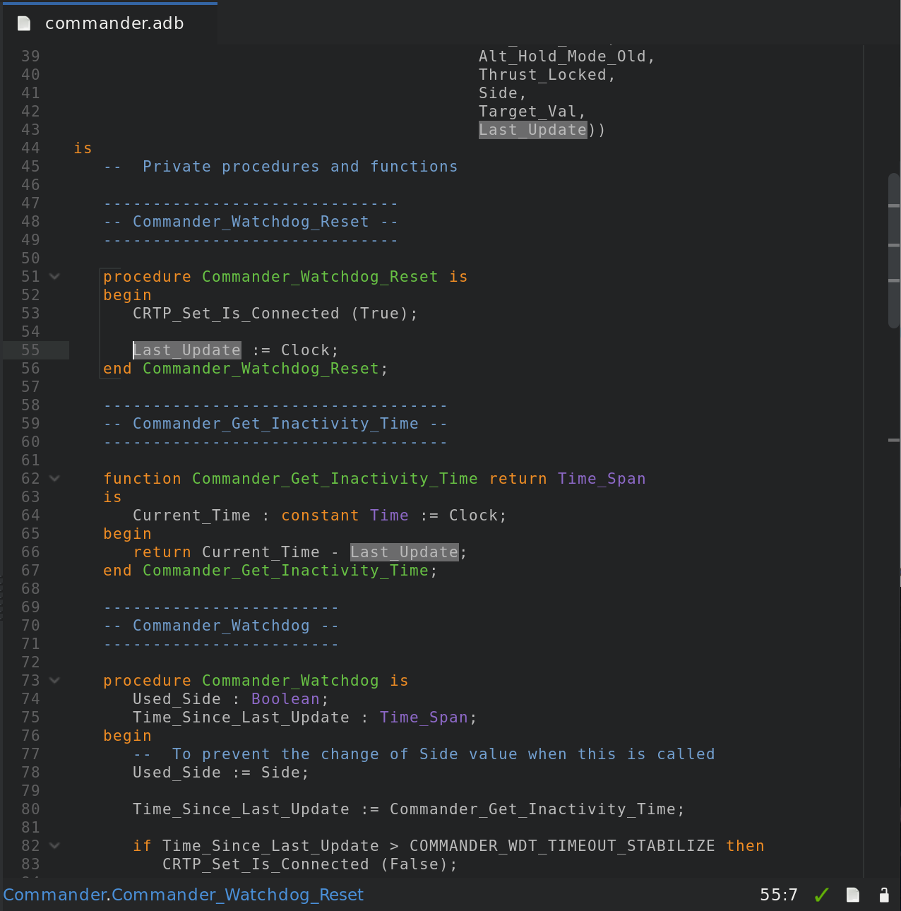
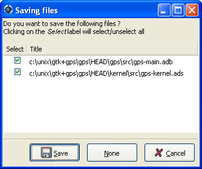

.. _Editing_Files:

*************
Editing Files
*************

.. index:: editing
.. _General_Information:

General Information
===================

Source editing is one of the central parts of GPS.  It allows access to
many other functionalities, including extended source navigation and source
analysis tools.  You can have as many editor windows as you need.  Each
editor window receives annotations from other components in GPS, such as a
debugger.

We use the term "pointer" to refer to the mouse pointer and "cursor" to
refer to the text cursor.

The source editor provides an extensive set of features, including:

*Multi cursors*

  You are not limited to edition via a single cursor in GPS. You can create
  multiple cursors that will all forward the text actions that you enter via
  your keyboard. This allows you to automate simple repetitive actions, in
  a similar way to what you would do with text macros, but in a simpler
  fashion.

  Most of the text actions described in this documentation will be handled
  transparently by multi cursors, so you can delete several words at once, or
  select several pieces of text at once, for example.

  At any time during edition with multiple cursors, you can press :kbd:`Escape`
  to remove every cursor but the main one, so that you are back to single
  cursor edition. Using the mouse to move the cursor will have the same effect.

*Title bar*

  Displays the full name of the file including path information in the
  title bar of the editor window.

*Line number information*

  Located to the left of the source editor, :index:`Line numbers <single:
  preferences; editor --> display line numbers>` can be disabled using the
  :menuselection:`Editor --> Display line numbers` preference.  This area
  also displays additional information in some cases, such as the current
  line of execution when debugging or VCS annotations.

*Scrollbar*

  Located to the right of the editor, this allows scrolling through the
  source file.  The highlighted area of the scrollbar corresponds to the
  visible portion of the file.  While you are scrolling, the editor
  displays a tooltip showing the file, line number, and subprogram
  corresponding to the center of the visible portion.

*Speed column*

  This :index:`column <single: preferences; editor --> speed column
  policy>`, when visible, is located on the left of the editor. It allows
  you to view all the highlighted lines in a file at a glance. For example,
  all the lines containing compilation errors are displayed in the
  :guilabel:`Speed Column`. Use the :menuselection:`Editor --> Speed column
  policy` preference to control the display of this area. It can sometimes
  be convenient to keep it visible at all times (to avoid resizing the
  editors when new information becomes available) or to hide it
  automatically when not needed to save space on the screen.

*Status bar*

  Gives information about the file. It is divided in two sections, one each
  on the left and right of the window.

  - The left part of the status bar shows the current :index:`subprogram
    <single: preferences; editor --> display subprogram names>` name for
    languages that support this capability. Currently Ada, C, and C++
    have this ability. The :menuselection:`Editor --> Display subprogram
    names` preference controls this display.

  - The right section contains multiple items:

    * The box displays the position of the cursor in the file as a line and
      column number. When you have made a selection in the editor, this area
      also displays the size of the selection (number of lines and
      characters).

    * Next to the box is an icon showing whether the file is writable or
      read only.  Change this state by clicking on the icon, which toggles
      between :guilabel:`Writable` and :guilabel:`Read Only`.  This does not
      change the permissions of the file on disk: it only changes the
      writability of the view in the source editor.

      When you try to save a read-only file, GPS asks for confirmation, and
      if possible, saves the file, keeping its read-only state.

    * If the file is maintained under version control and version control
      is supported and enabled in GPS, the next icon shows VCS information
      for the file: the VCS kind (e.g. CVS or subversion) followed by the
      revision number and, if available, the file's status.

*Contextual menu*

  Displayed when you right-click on any area of the source editor.  See in
  particular :ref:`Contextual_Menus_for_Source_Navigation` for more details.

*Syntax highlighting*

  Based on the programming language associated with the file, reserved
  words and languages constructs such as comments and strings are
  highlighted in different colors and fonts.

  By default, GPS knows about many languages. You can also easily add
  support for other languages through plugins. Most languages supported by
  GPS provide syntax highlighting in the editor.

*Automatic indentation*

  When enabled, lines are automatically :index:`indented <indentation>`
  each time you press the :kbd:`Enter` key or the indentation key, which,
  by default, is :kbd:`Tab`.  Change it in the key manager dialog.  See
  :ref:`The_Key_Shortcuts_Editor`.

  If you have selected a list of lines when you press the indentation key,
  GPS indents all the lines.

*Tooltips*

  When you place the pointer over a word in the source editor, GPS displays
  a small :index:`window <tooltip>` if there is relevant contextual
  information to display about that word.  The type of information
  displayed depends on the current state of GPS.

  In normal mode, the editor displays the entity kind and location of the
  declaration when this information is available, i.e., when the
  cross-reference information about the current file has been generated. If
  there is no relevant information, no tooltip is displayed.  See
  :ref:`Support_for_Cross-References` for more information.

  .. highlight:: ada

  In addition, the editor displays documentation for the entity, if
  available.  This is the block of comments immediately before or after the
  entity's declaration (without any intervening blank lines). For example,
  the editor displays the following documentation for Ada::

    --  A comment for A
    A : Integer;

    B : Integer;
    --  A comment for B

    C : Integer;

    --  Not a comment for C, there is a blank line

  When comments appear both before and after the entity, GPS chooses the one
  given by the :index:`preference <preferences; documentation --> leading
  documentation>` :menuselection:`Documentation --> Leading documentation`.
  In debugging mode, the editor shows the value of the variable under the
  pointer if the variable is known to the debugger.

  Disable the automatic pop up of tool tips via the :index:`preference
  <preferences; editor --> tooltips>` :menuselection:`Editor --> Tooltips`.

*Code completion*

  GPS provides two kinds of code :index:`completion`: a :ref:`smart code
  completion <Smart_Completion>`, based on semantic information, and a text
  completion.

  Text completion is useful when editing a file using the same words
  repeatedly where it provides automatic word completion.  When you type
  the :kbd:`Ctrl-/` key combination (customizable through the key manager
  dialog) after a partial word, GPS inserts the next potential completion.
  Typing this key again cycles through the list of potential completions.
  GPS searches for text completions in all currently open files.

*Delimiter highlighting*

  When the cursor is placed before an opening :index:`delimiter` or after a
  closing delimiter, GPS highlights both delimiters.  The following
  characters are considered delimiters: ()[]{}.  Disable highlighting of
  delimiters with the :index:`preference <preferences;editor --> highlight
  delimiters>` :menuselection:`Editor --> Highlight delimiters`.

  Jump to a corresponding delimiter by invoking the :menuselection:`jump to
  matching delimiter` action (which can be bound to a key in the key
  shortcuts editor).  Invoking this action a second time returns the cursor
  to its original position.

*Current line highlighting*

  Configure the editor to highlight the :index:`current line` with a
  specified color (see the :index:`preference <preferences; editor -->
  fonts & colors --> current line color>` :menuselection:`Editor --> Fonts
  & Colors --> Current line color`).

*Current block highlighting*

  If the :index:`preference <preferences;editor --> block highlighting>`
  :menuselection:`Editor --> Block highlighting` is enabled, GPS highlights
  the current block of code, e.g. the current :command:`begin...end` block
  or loop statement, by placing a vertical bar to its left.

  Block highlighting also takes into account the changes made in your
  source code and is recomputed to determine the current block when needed.
  This capability is currently implemented for the Ada, C, and C++
  languages.

*Block folding*

  When the :index:`preference <preferences;editor --> block folding>`
  :menuselection:`Editor --> Block folding` is enabled, GPS displays
  :samp:`-` icons on the left side corresponding to the beginning of each
  block. If you click on one of these icons, all lines corresponding to
  this block are hidden except the first.  Like block highlighting, these
  icons are recomputed automatically when you modify your sources.

  This capability is currently implemented for Ada, C, and C++ languages.

*Auto save*

  GPS will by default periodically save your work in temporary files. This
  can be configured via the :menuselection:`Edit --> Preferences...` dialog).

*Automatic highlighting of entities*

  When the pointer is positioned on an entity in the source editor, GPS
  will highlight all references to this entity in the current editor.  When
  the pointer is moved away from the entity, the highlighting is removed.

  .. index:: plugins; auto_highlight_occurrences.py

  This is controlled by the plugin :file:`auto_highlight_occurrences.py`:
  it can be deactivated by disabling the plugin.

  Details such as the presence of indications in the :guilabel:`Speed Column` or
  highlighting color can be customized in the :guilabel:`Plugins` section
  of :menuselection:`Edit --> Preferences...` dialog.

.. index:: emacs

GPS also integrates with existing third party editors such as
:program:`emacs` or :program:`vi`.  See :ref:`Using_an_External_Editor`.

.. index:: editing
.. index:: source file
.. _Editing_Sources:

Editing Sources
===============

.. index:: key

Key bindings
------------

In addition to the standard keys used to navigate in the editor (up, down,
right, left, page up, page down), the integrated editor provides a number of
key bindings allowing easy navigation in the file.

There are also several ways to define new key bindings, see
:ref:`Defining_text_aliases` and :ref:`Binding_actions_to_keys`.

.. index:: hexadecimal
.. index:: ASCII

+-------------------------+--------------------------------------------------------------------------+
| :kbd:`Ctrl-Shift-u`     | Pressing these three keys and then holding Ctrl-Shift allow you to enter |
|                         | characters using their hexadecimal value. For example, pressing          |
+-------------------------+--------------------------------------------------------------------------+
| :kbd:`Ctrl-Shift-u-2-0` | will insert a space character (ASCII 32, which is 20 in hexadecimal).    |
+-------------------------+--------------------------------------------------------------------------+
| :kbd:`Ctrl-x`           | Cut to clipboard.                                                        |
| :kbd:`Shift-delete`     |                                                                          |
+-------------------------+--------------------------------------------------------------------------+
| :kbd:`Ctrl-c`           | Copy to clipboard.                                                       |
| :kbd:`Ctrl-insert`      |                                                                          |
+-------------------------+--------------------------------------------------------------------------+
| :kbd:`Ctrl-v`           | Paste from clipboard.                                                    |
| :kbd:`Shift-insert`     |                                                                          |
+-------------------------+--------------------------------------------------------------------------+
| :kbd:`Ctrl-s`           | Save file to disk.                                                       |
+-------------------------+--------------------------------------------------------------------------+
| :kbd:`Ctrl-z`           | Undo previous insertion/deletion.                                        |
+-------------------------+--------------------------------------------------------------------------+
| :kbd:`Ctrl-r`           | Redo previous insertion/deletion.                                        |
+-------------------------+--------------------------------------------------------------------------+
| :kbd:`Insert`           | Toggle overwrite mode.                                                   |
+-------------------------+--------------------------------------------------------------------------+
| :kbd:`Ctrl-a`           | Select the whole file.                                                   |
+-------------------------+--------------------------------------------------------------------------+
| :kbd:`Home`             | Go to the beginning of the line.                                         |
| :kbd:`Ctrl-Pgup`        |                                                                          |
+-------------------------+--------------------------------------------------------------------------+
| :kbd:`End`              | Go to the end of the line.                                               |
| :kbd:`Ctrl-Pgdown`      |                                                                          |
+-------------------------+--------------------------------------------------------------------------+
| :kbd:`Ctrl-Home`        | Go to the beginning of the file.                                         |
+-------------------------+--------------------------------------------------------------------------+
| :kbd:`Ctrl-End`         | Go to the end of the file.                                               |
+-------------------------+--------------------------------------------------------------------------+
| :kbd:`Ctrl-up`          | Go to the beginning of the line or to the previous line if already at    |
|                         | the beginning of the line.                                               |
+-------------------------+--------------------------------------------------------------------------+
| :kbd:`Ctrl-down`        | Go to the end of the line or to the beginning of the next line if        |
|                         | already at the end of the line.                                          |
+-------------------------+--------------------------------------------------------------------------+
| :kbd:`Ctrl-delete`      | Delete to the end of the current word.                                   |
+-------------------------+--------------------------------------------------------------------------+
| :kbd:`Ctrl-backspace`   | Delete to the beginning of the current word.                             |
+-------------------------+--------------------------------------------------------------------------+
| :kbd:`Shift-Alt-down`   | Add a cursor to the current location and go down one line                |
+-------------------------+--------------------------------------------------------------------------+
| :kbd:`Shift-Alt-up`     | Add a cursor to the current location and go up one line                  |
+-------------------------+--------------------------------------------------------------------------+
| :kbd:`Ctrl-Alt-N`       | jump the main cursor to the next occurrence of the selection             |
+-------------------------+--------------------------------------------------------------------------+
| :kbd:`Shift-Ctrl-N`     | Add a cursor selecting the current selection and jump the main cursor to |
|                         | the next occurrence of the selection                                     |
+-------------------------+--------------------------------------------------------------------------+

.. index:: macros
.. _Recording_and_replaying_macros:

Recording and replaying macros
==============================

It is often convenient to be able to repeat a given key sequence a number of
times.

GPS supports this with several different methods:

* Repeat the next action

  .. index:: action; repeat next

  If you want to repeat the action of pressing a single key, first use the
  GPS action :guilabel:`Repeat Next` (bound by default to :kbd:`control-u`,
  but this can be changed as usual through the
  :menuselection:`Edit --> Preferences...` menu), entering the number of
  times you wish to repeat, and then pressing the key whose action you want
  to repeat.

  For example, the sequence :kbd:`control-u 79 -` inserts 79 characters of
  '-' in the current editor.  This is often useful to insert separators.

  If you are using the Emacs mode, you can also use the sequence
  :kbd:`control-u 30 control-k` to delete 30 lines.

* Recording macros

  To repeat a sequence of more than 1 key, record the sequence as a
  macro. All macro-related actions are found in the Key Shortcuts section of
  the preferences dialog.

  First, tell GPS that it should start recording the keys you are pressing via
  the :menuselection:`Macro Start Keyboard` action.  This only records
  keyboard events, not mouse events. GPS keeps recording the events until you
  select call the :menuselection:`Macro Stop` action.

  In Emacs mode, macro actions are bound to :kbd:`control-x (`,
  :kbd:`control-x )` and :kbd:`control-x e` key shortcuts. For example, you
  can execute the following to create a very simple macro that deletes the
  current line wherever your cursor initially is on that line:

  *  :kbd:`control-x (`     start recording
  *  :kbd:`control-a`      go to beginning of line
  *  :kbd:`control-k`      delete line
  *  :kbd:`control-x )`     stop recording

.. index:: automatic casing; exceptions
.. _Contextual_Menus_for_Editing_Files:

Contextual Menus for Editing Files
==================================

Whenever you ask for a contextual menu (using, for example, the right
button on your mouse) on a source file, you get access to a number of
entries, which are displayed or hidden depending on the current context.

These menu entries include the following categories:

*Source Navigation*

  See :ref:`Contextual_Menus_for_Source_Navigation`.

*Dependencies*

  See :ref:`The_Dependency_Browser`.

*Entity browsing*

  See :ref:`Entity_Browser`.

*Project view*

  See :ref:`The_Project_View`.

*Debugger*

  See :ref:`Using_the_Source_Editor_when_Debugging`.

*Case exceptions*

  See :ref:`Handling_of_case_exceptions`.

*Refactoring*

  See :ref:`Refactoring`.

.. index:: language, editor
.. index:: character set

In addition, an entry :menuselection:`Properties...` is always visible in
this contextual menu. When you select it, a dialog allows you to override
the language or the character set used for the file.  This is useful when
opening a file that does not belong to the current project but where you
want to benefit from the syntax highlighting, which depends on knowing the
file's language.

Do not override the language for source files belonging to the current
project. Instead, use the :menuselection:`Edit --> Project
Properties` menu and change the naming scheme as appropriate. This provides
better consistency between GPS and the compiler in the way they manipulate
the file.

.. index:: casing; automatic
.. _Handling_of_case_exceptions:

Handling of casing
==================

GPS maintains a dictionary of identifiers and a corresponding casing that
are used by all case-insensitive languages. When editing or reformatting a
buffer for such a language, the dictionary is checked first. If GPS finds
an entry for a word or a substring of a word, it is used; otherwise the
specified default casing for keywords or identifiers is used. A substring
is defined as a part of the word separated by underscores.

.. index:: preferences; editor --> ada --> casing policy
.. index:: preferences; editor --> ada --> reserved word casing
.. index:: preferences; editor --> ada --> identifier casing

This feature is not activated for entities (keywords or identifiers) for
which the casing is set to :guilabel:`Unchanged` in the
:menuselection:`Editor --> Ada --> Reserved word casing` or
:menuselection:`Editor --> Ada --> Identifier casing` preferences.

A contextual menu named :menuselection:`Casing` has the following entries:

* :menuselection:`Casing --> Lower *entity*`

  Set the selected entity to be in lower case.

* :menuselection:`Casing --> Upper *entity*`

  Set the selected entity to be in upper case.

* :menuselection:`Casing --> Mixed *entity*`

  Set the selected entity to be in mixed case (the first letter and letters
  before an underscore are in upper case and all other letters are in lower
  case).

* :menuselection:`Casing --> Smart Mixed *entity*`

  Set the selected entity as smart mixed case, which is the same as above
  except that upper case letters are kept unchanged.

* :menuselection:`Casing --> Add exception for *entity*`

  Add the current entity into the dictionary.

* :menuselection:`Casing --> Remove exception for *entity*`

  Remove the current entity from the dictionary.

To add or remove a substring from the dictionary, first select the
substring in the editor.  Then, the last two contextual menu entries will
be:

* :menuselection:`Casing --> Add substring exception for *str*`

  Add the selected substring into the dictionary.

* :menuselection:`Casing --> Remove substring exception for *str*`

  Remove the selected substring from the dictionary.

.. index:: refactoring
.. _Refactoring:

Refactoring
===========

GPS includes basic facilities to refactor your code.  "Refactoring" is the
term used to describe manipulation of source code that does not affect the
behavior of the code but helps reorganize it to make it more readable, more
extendable, or make other similar improvements.  Refactoring techniques are
generally things that programmers have done by hand, but which can be done
faster and more securely when done automatically by a tool.

A basic recommendation when you refactor your code is to recompile and
test your application regularly to make sure each small modification you
made did not change the behavior of your application.  This is particularly
true with GPS, since it relies on the cross-references information
generated by the compiler. If some source files have not been recompiled
recently, GPS prints warning messages indicating that the operation might
be dangerous and/or only partially performed.

One of the reference books used in the choice of refactoring methods for
GPS is "Refactoring", by Martin Fowler (Addison Wesley).

.. _Rename_Entity:

Rename Entity
-------------

Clicking on an entity in a source file and selecting the
:menuselection:`Refactoring --> Rename` contextual menu opens a dialog
asking for the new name of the entity. GPS renames all instances of the
entity in your application, including the definition of the entity, its
body, and all calls to it.  No comments are updated so you should probably
manually check that the comment for the entity still applies.

GPS handles primitive operations by also renaming the operations it
overrides or that override it, so any dispatching call to that operation
is also renamed, allowing the application to continue to work properly. If
you are renaming a parameter to a subprogram, GPS also renames parameters
with the same name in overriding or overridden subprograms.

You can specify the behavior for read-only files: by default, GPS will not do
any refactoring in these files and instead displays a dialog listing them.
However, you can choose to make them writable just as if you had clicked on
the :guilabel:`Read-Only` button in the status bar of the editor and have
GPS perform the renaming in them as well.

.. _Name_Parameters:

Name Parameters
---------------

If you are editing Ada code and click on a call to a subprogram, GPS
displays a :menuselection:`Refactoring --> Name parameters` contextual
menu, which replaces all unnamed parameters by named parameters, for
example::

     Call (1, 2)
  =>
     Call (Param1 => 1, Param2 => 2);

.. _Extract_Subprogram:

Extract Subprogram
------------------

This refactoring moves some code into a separate subprogram to simplify the
original subprogram by moving part of its code elsewhere.  Here is an
example from the "Refactoring" book. The refactoring takes place in the
body of the package :file:`pkg.adb`, but the spec is needed so you can
compile the source code (a preliminary, but mandatory, step before you can
refactor the code)::

  pragma Ada_05;

  with Ada.Containers.Indefinite_Doubly_Linked_Lists;
  with Ada.Strings.Unbounded;

  package Pkg is

     type Order is tagged null record;
     function Get_Amount (Self : Order) return Integer;

     package Order_Lists is new
        Ada.Containers.Indefinite_Doubly_Linked_Lists (Order);

     type Invoice is tagged record
        Orders : Order_Lists.List;
        Name   : Ada.Strings.Unbounded.Unbounded_String;
     end record;

     procedure Print_Owing (Self : Invoice);

  end Pkg;

An initial implementation for this is the following::

  pragma Ada_05;
  with Ada.Strings.Unbounded;  use Ada.Strings.Unbounded;
  with Ada.Text_IO;            use Ada.Text_IO;

  package body Pkg is
     use Order_Lists;

     ----------------
     -- Get_Amount --
     ----------------

     function Get_Amount (Self : Order) return Integer is
     begin
        return 0;
     end Get_Amount;

     -----------------
     -- Print_Owing --
     -----------------

     procedure Print_Owing (Self : Invoice) is
        E : Order_Lists.Cursor := First (Self.Orders);
        Outstanding : Natural := 0;
        Each : Order;
     begin
        --  <<< line 30
        --  Print Banner

        Put_Line ("");
        Put_Line (" Customer Owes         ");
        Put_Line ("");  --  << line 35

        --  Calculate Outstanding

        while Has_Element (E) loop
           Each := Element (E);
           Outstanding := Outstanding + Each.Get_Amount;
           Next (E);
        end loop;

        --  Print Details

        Put_Line ("Name: " & To_String (Self.Name));
        Put_Line ("Outstanding:" & Outstanding'Img);
     end Print_Owing;
  end Pkg;

Suppose we feel the procedure :command:`Print_Owing` is too long and does
several independent actions.  We will perform a series of three successive
refactoring steps to extract the code and move it elsewhere.

First, we move the code that prints the banner. Moving it is easy, since
this code does not depend on any context. We could just do a copy-paste,
but then we would have to create the new subprogram. Instead, we select lines
30 to 35 and then select the :menuselection:`Refactoring --> Extract
Subprogram` contextual menu.  GPS removes those lines from the subprogram
:command:`Print_Owing` and creates a new procedure :command:`Print_Banner`
(the name is specified by the user; GPS does not try to guess a name). Also,
since the chunk of code that is extracted starts with a comment, GPS
automatically uses that comment as the documentation for the new
subprogram.  Here is the relevant part of the resulting file::

  package body Pkg is

     procedure Print_Banner;
     --  Print Banner

     ------------------
     -- Print_Banner --
     ------------------

     procedure Print_Banner is
     begin
        Put_Line ("");
        Put_Line (" Customer Owes         ");
        Put_Line ("");
     end Print_Banner;

     ... (code not shown)

     procedure Print_Owing (Self : Invoice) is
        E : Order_Lists.Cursor := First (Self.Orders);
        Outstanding : Natural := 0;
        Each : Order;
     begin
        Print_Banner;

        --  Calculate Outstanding

        while Has_Element (E) loop
           Each := Element (E);
           Outstanding := Outstanding + Each.Get_Amount;
           Next (E);
        end loop;

        --  Print Details   <<< line  54

        Put_Line ("Name: " & To_String (Self.Name));
        Put_Line ("Outstanding:" & Outstanding'Img);  --  line 57
     end Print_Owing;
  end Pkg;

A more interesting example is when we want to extract the code to print the
details of the invoice. This code depends on one local variable and the
parameter to :command:`Print_Owing`.  When we select lines 54 to 57 and
extract it into a new :command:`Print_Details` subprogram, GPS
automatically decides which variables to extract and whether they should
become parameters of the new subprogram or local variables. In the former
case, it also automatically decides whether to create :samp:`in`,
:samp:`out` or :samp:`in out` parameters. If there is a single :samp:`out`
parameter, GPS automatically creates a function instead of a procedure.

GPS uses the same name for the local variable for the parameters. Often, it
makes sense to recompile the new version of the source and apply the
:menuselection:`Refactoring --> Rename Entity` refactoring to have more
specific names for the parameters, or the :menuselection:`Refactoring -->
Name Parameters` refactoring so that calls to the new method uses named
parameters to further clarify the code::

     ... code not shown

     procedure Print_Details
       (Self : Invoice'Class;
        Outstanding : Natural);
     --  Print Details

     -------------------
     -- Print_Details --
     -------------------

     procedure Print_Details
       (Self : Invoice'Class;
        Outstanding : Natural)
     is
     begin
        Put_Line ("Name: " & To_String (Self.Name));
        Put_Line ("Outstanding:" & Outstanding'Img);
     end Print_Details;

     procedure Print_Owing (Self : Invoice) is
        E : Order_Lists.Cursor := First (Self.Orders);
        Outstanding : Natural := 0;
        Each : Order;
     begin
        Print_Banner;

        --  Calculate Outstanding

        while Has_Element (E) loop
           Each := Element (E);
           Outstanding := Outstanding + Each.Get_Amount;
           Next (E);
        end loop;

        Print_Details (Self, Outstanding);
     end Print_Owing;

Finally, we want to extract the code that computes the outstanding
balance. When this code is moved, the variables :command:`E` and
:command:`Each` become dead in :command:`Print_Owing` and are moved into
the new subprogram (which we call :command:`Get_Outstanding`). The initial
selection should include the blank lines before and after the code to keep
the resulting :command:`Print_Owing` simpler. GPS automatically ignores
those blank lines.  Here is the result of that last refactoring ::

     ... code not shown

     procedure Get_Outstanding (Outstanding : in out Natural);
     --  Calculate Outstanding

     ---------------------
     -- Get_Outstanding --
     ---------------------

     procedure Get_Outstanding (Outstanding : in out Natural) is
        E : Order_Lists.Cursor := First (Self.Orders);
        Each : Order;
     begin
        while Has_Element (E) loop
           Each := Element (E);
           Outstanding := Outstanding + Each.Get_Amount;
           Next (E);
        end loop;
     end Get_Outstanding;

     procedure Print_Owing (Self : Invoice) is
        Outstanding : Natural := 0;
     begin
        Print_Banner;
        Get_Outstanding (Outstanding);
        Print_Details (Self, Outstanding);
     end Print_Owing;

The final version of :command:`Print_Owing` is not perfect. For example,
passing the initial value 0 to :command:`Get_Outstanding` is useless and,
in fact, it should probably be a function with no parameter. But GPS
already saves a lot of time and manipulation even given these
imperfections.

Finally, a word of caution: this refactoring does not check that you are
starting with valid input. For example, if the text you select includes a
:command:`declare` block, you should always include the full block, not
just a part of it (or select text between :command:`begin` and
:command:`end`). Likewise, GPS does not expect you to select any part of the
variable declarations, just the code.

.. index:: external editor
.. _Using_an_External_Editor:

Using an External Editor
========================

.. index:: preferences; editor --> external editor

GPS is integrated with a number of external editors, in particular
:program:`emacs` and :program:`vi`. The choice of the default external
editor is done in the :menuselection:`Editor --> External editor`
preference.

The following values are recognized:

.. index:: gnuclient

* :program:`gnuclient`

  This is the recommended client. It is based on Emacs, but needs an extra
  package to be installed. This is the only client providing a full
  integration in GPS, since any extended lisp command can be sent to the
  Emacs server.

  By default, :program:`gnuclient` opens a new Emacs frame for every file
  you open. You might want to add the following code to your :file:`.emacs`
  file (create one if needed) so that the same Emacs frame is reused each
  time::

       (setq gnuserv-frame (car (frame-list)))

  See `http://www.hpl.hp.com/personal/ange/gnuserv/home.html
  <http://www.hpl.hp.com/personal/ange/gnuserv/home.html>`_ for more
  information.

.. index:: emacsclient

* :program:`emacsclient`

  This is a program that is always available if you have installed Emacs. As
  opposed to starting a new Emacs every time, it reuses an existing Emacs
  sessions, so it is extremely fast to open a file.

.. index:: emacs

* :program:`emacs`

  This clients start a new Emacs session every time a file needs to be
  opened. You should use :program:`emacsclient` instead, since it is much
  faster and makes it easier to copy and paste between multiple files.  The
  only reason to use this external editor is if your system does not support
  :program:`emacsclient`.

.. index:: vi

* :program:`vim`

  `Vim` is a vi-like editor that provides a number of enhancements, for
  example, syntax highlighting for all languages supported by GPS.
  Selecting this external editor starts an :program:`xterm` (or command
  window, depending on your system) with a running :program:`vim` process
  editing the file.

  One limitation of this editor is that if GPS needs to open the same file
  a second time, it opens a new editor instead of reusing the existing one.

  To enable this capability, the :program:`xterm` executable must be found
  in the PATH and thus this is not supported on Windows systems.  On
  Windows systems, use the :command:`program` editor instead.

* :program:`vi`

  This editor works exactly like :program:`vim`, but uses the standard
  :program:`vi` command instead of :program:`vim`.

.. index:: preferences; editor --> custom editor command

* :program:`custom`

  Specify any external editor by choosing this entry.  Specify the complete
  command line used to call the editor in the :menuselection:`Editor -->
  Custom editor command` preference.

* :program:`none`

  No external editor is used and the contextual menus do not appear.

In the cases that require an Emacs server, the project file currently used
in GPS is set appropriately the first time Emacs is spawned. This means
that if you load a new project in GPS or modify the paths of the current
project, you should kill any running Emacs, so a new one is spawned by GPS
with the appropriate project.

Alternatively, explicitly reload the project from Emacs itself by using the
:menuselection:`File --> Load Project` menu in :program:`emacs` (if
:command:`ada-mode` is correctly installed).

.. index:: preferences; editor --> always use external editor

The :menuselection:`Editor --> Always use external editor` preference lets
you choose to use an external editor every time you double-click on a file,
instead of opening GPS's own editor.

.. index:: clipboard
.. index:: cut
.. index:: copy
.. index:: yank
.. index:: paste
.. _Using_the_Clipboard:

Using the Clipboard
===================

This section is of interest to X Window System users who are used to cutting
and pasting with the middle mouse button. In the GPS text editor, as in many
recent X applications, the :guilabel:`GPS clipboard` is set by explicit
cut/copy/paste actions, either through menu items or keyboard shortcuts,
and the :guilabel:`primary clipboard` (i.e. the 'middle button' clipboard)
is set to the current selection.

Therefore, copy/paste between GPS and other X applications using the
:guilabel:`primary clipboard` still work provided there is text currently
selected. The :guilabel:`GPS clipboard`, when set, overrides the
:guilabel:`primary clipboard`.

By default, GPS overrides the X mechanism. To prevent this, add the
following line::

  GPS.INTERNAL.OVERRIDE_MIDDLE_CLICK_PASTE = no

to your :file:`traces.cfg` file (typically in :file:`~/.gps/`). Note that
the X mechanism pastes all attributes of text, including coloring and
editability, which can be confusing.

See `http://standards.freedesktop.org/clipboards-spec/clipboards-latest.txt
<http://standards.freedesktop.org/clipboards-spec/clipboards-latest.txt>`_
for more information.

.. index:: saving
.. _Saving_Files:

Saving Files
============

.. index:: menu; file --> save

After you have finished editing your files, you need to save them.  Do so by
selecting the :menuselection:`File --> Save` menu, which saves the
currently selected file.

.. index:: menu; file --> save as

Use the :menuselection:`File --> Save As...` menu if you want to save the
file with another name or in another directory.

.. index:: menu; file --> save more --> all

If you have multiple files to save, use the :menuselection:`File --> Save
More --> All` menu, which opens a dialog listing all the currently modified
editors.  Select which ones should be saved and click on :guilabel:`Save`
to save those editors.

.. index:: preferences; editor --> autosave delay
.. index:: saving; automatic

When calling external commands, such as compiling a file, if the
:menuselection:`Editor --> Autosave delay` preference is set to 0, this
same dialog is also used to make sure the external command sees your
changes.  If the preference is enabled, editors are saved automatically.

Conveniently select or unselect all the files at once by clicking on the
title of the first column (labeled :guilabel:`Select`). This toggles the
selection status of all files.

If you press :guilabel:`Cancel` instead of :guilabel:`Save`, nothing is
saved and the action that displayed this dialog is also canceled. Such
actions can be, for example, starting a compilation command, a VCS
operation, or quitting GPS with unsaved files.

Printing Files
==============

GPS lets you configure how printing is performed, via its
:guilabel:`External Commands/Print command` preference.

This program is required for Unix systems, and is set to :program:`lp`
by default. Other popular choices include :program:`a2ps` which provides
pretty-printing and syntax highlighting.

On Windows, this preference is optional and the preference is empty by default
since GPS provides built-in printing.  If you specify an external tool, such as
the :program:`PrintFile` freeware utility available from
`http://www.lerup.com/printfile/descr.html
<http://www.lerup.com/printfile/descr.html>`_, GPS uses that.
