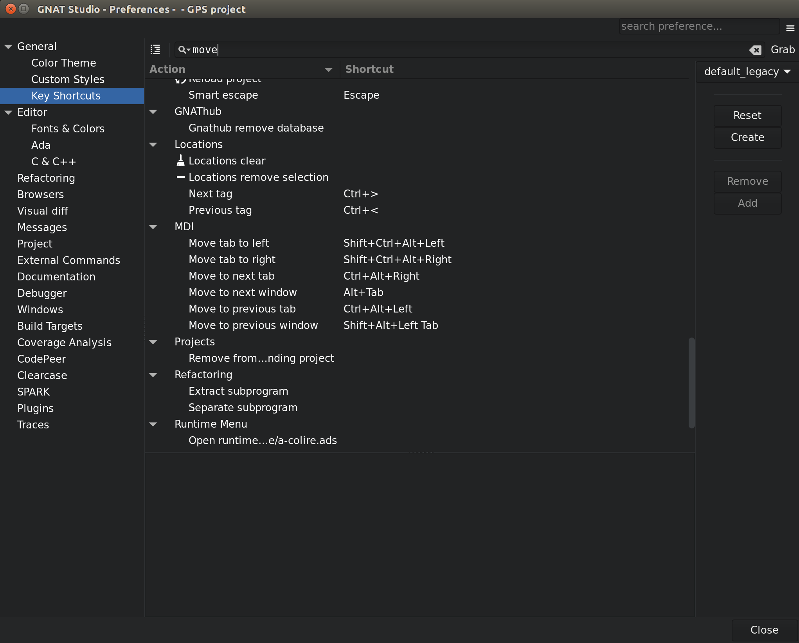
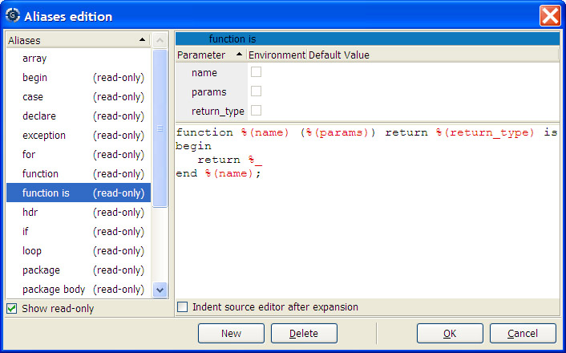

.. highlight:: ada
.. _Customizing_and_Extending_GPS:

*****************************
Customizing and Extending GPS
*****************************

.. index:: customization

GPS provides several levels of customization, from simple preference
dialogs to powerful scripting capability through the Python language.  This
chapters describes each of these capabilities.

Color Themes
============

.. index:: themes

The :guilabel:`Color Theme window` shows a list of color themes to choose
from, presented in the form of a list of screenshots. Clicking on the button
underneath a screenshot applies the given color theme to GPS.

Applying a color theme modifies the corresponding GPS preferences. It is
therefore possible to customize the colors after a theme has been applied,
through the preferences dialog.

GPS supports importing themes which use the TextMate (:file:`.tmTheme`)
format: at startup, GPS will look in the directory
:file:`GPS_HOME/.gps/themes/` and will include all the
:file:`.tmTheme` found at the first level of this subdirectory. You can
also import your themes in the :file:`INSTALL/share/gps/color_themes/themes/`
directory if you want to share themes accross your team.

Custom Fonts
============

.. index:: fonts

In addition to the system fonts, GPS will load the fonts located under
:file:`share/gps/fonts`) in the GPS installation directory. The supported
formats are :file:`.otf`, :file:`.ttf` and :file:`.ttc`.

This mechanism works only on UNIX/Linux systems; under Windows, fonts
need to be added at the system level. Fonts that are added directly in this
directory may not show up in the list of fonts in the preferences dialog,
but it is still possible to use them by entering the font name manually.

.. index:: key shortcuts; editing
.. _The_Key_Shortcuts_Editor:

The Key Shortcuts Editor
========================

This editor is started through the :menuselection:`Edit --> Preferences`
menu, then by selecting the :guilabel:`Preferences` page.
It provides a convenient way to edit the keyboard shortcuts that
are available throughout GPS.

All keyboard shortcuts are associated with actions, which are either
predefined in GPS, or defined in your customization python files,
as documented in :ref:`Customizing_through_XML_and_Python_files`.
The main part of the editor is a list showing all actions that are defined
in GPS, grouped into categories.

There are literally hundreds of such actions, and finding the one you should
use might be difficult. To simplify the search, you can use the filter field at
the top-right corner of the editor. Typing any text in this field will restrict
the list of actions to those that contain the text either in their name, their
description, their keyboard shortcut, or the menus the action is bound to.
Entering keyboard shortcut is in fact easier done via the :guilabel:`Grab`
button next to the filter field. Click on it, then type the shortcut you are
looking for.

By using the local configuration menu (click on the top-right button of the
editor), you can further restrict what is displayed in the editor:

* :guilabel:`Shortcuts only` will only display the actions that have an actual
  shortcut, and hide all the others.

* :guilabel:`Show categories` can be unset if you just want to display a flat
  list of all the actions.

* All menus in GPS are themselves bound to actions. In general, it is better
  to associate a key shortcut to the action itself, as opposed to the menu.
  For this reason, GPS by default does not list all the menus in the keyboard
  shortcuts editor. However, historically, GPS used to show all menus there
  and you can get this behavior back by enabling the
  :guilabel:`Show all menus` configuration.

When you select an action, GPS will display its documentation in the bottom
part of the editor. This documentation also includes a pointer to the python
file that defines the action (or whether it is built-in in GPS), as well as the
list of menus that will execute this action when selected.

Finally, the editor includes a set of buttons on its right side, which are
grouped into two logical sets:

* The top three buttons allow you to control `Key themes`. These are sets of
  keyboard shortcuts that are either provided as part of GPS (for instance
  GPS provides an :index:`Emacs key theme` which attempts to emulate some of
  the Emacs key bindings) or created by the user.

  The first box lists all known themes, and lets you alternate between them
  simply by selecting their name. This will unset all existing key bindings
  except the ones you have set manually, and replace them with the shortcuts
  loaded from the key theme. This also updates all the menus to reflect the
  new shortcuts.

  The :guilabel:`Reset` button will discard all the key bindings you have
  manually overridden, and revert to the theme's default key bindings.

  The :guilabel:`Create` lets you create a new key theme by copying all
  the current shortcuts (those from the theme and the ones you have set
  manually) into a new theme. In effect, this creates a new XML file
  in the directory :file:`$HOME/.gps/key_themes`. Removing a custom key
  theme is done by deleting the file from that directory, no GUI is
  provided for this at the moment.

* The second group of buttons lets you edit the shortcut for the currently
  selected action either by removing a shortcut, or by overriding the
  ones that are currently set.

  When you click on the :guilabel:`Add` button, GPS waits for you to
  press any keyboard shortcut you wish to associate with the action. This
  shortcut can include multiple keys, so for instance to get an Emacs-like
  binding you could for instance press :kbd:`Ctrl-x` and then press
  :kbd:`Ctrl-k`. After pressing the last key in the sequence, wait for a
  short delay and GPS will associate the resulting shortcut to the action
  and update the menus, when relevant, to show the new binding. Note that
  multi-key shortcuts cannot be displayed in menus due to technical
  limitations of the GUI toolkit.

Any change to the shortcuts is immediately and automatically saved, so that
they become instantly usable in GPS, and will be restored properly when GPS
is restarted.

.. _Editing_Plugins:

Editing Plugins
================

.. index:: plugins

You can extensively customize GPS through external plugins, either ones
you write (see :ref:`Customization_files_and_plugins`) or using one of the
plugins in GPS's own collection.

Some plugins are loaded by default when GPS starts (such as support for
the CVS version management system and support for highlighting in various
programming languages) and others are available but not loaded
automatically, such as Emacs emulation mode.

Some plugins provided with GPS are:

* :file:`Makefile` support

  .. index:: Makefile

  A plugin that parses a :file:`Makefile` and creates menus for each of
  its targets so you can easily start a :command:`make` command.

* Cross-references enhancements

  Some plugins take advantage of GPS's cross-references information to
  create additional menus for navigation such as jumping to the primitive
  operations of Ada tagged types and to the body of Ada separate entities.

* Text manipulation

  Several plugins provide support for advanced text manipulation in the
  editors, for example to align a set of lines based on various criteria
  or to manipulate a rectangular selection of text.

You can graphically choose which plugins are loaded on startup by
opening the preferences editor dialog (:menuselection:`Edit -->
Preferences...` menu), under the :guilabel:`Plugins` section. This section
lists all the known plugins on the left. By selecting one particular
plugin, the corresponding preferences page is opened on the right. Each
plugin page comes with the same layout:

* A :guilabel:`General` group

  This group indicates the exact location of the plugin file. Moreover,
  this group contains a toggle button (:guilabel:`Loaded at startup`)
  which allows you to decide if this plugin should be loaded or not in
  the next GPS session.

  As described in :ref:`Customization_files_and_plugins`, GPS searches for
  plugins in various directories and, based on these directories, decides
  whether to automatically load the plugin on startup.

* An optional :guilabel:`Preferences` group

  This group lists all the preferences related to the selected plugin,
  allowing you to customize the plugin behavior. Note that this group
  is displayed only if preferences have been registered for this plugin.

* A :guilabel:`Documentation` frame

  This frame displays the plugin file documentation. By convention,
  each plugin starts with a comment indicating the purpose of this
  plugin and more detailed documentation on its usage.

If you have modified the list of plugins that should be loaded at startup,
you will need to restart GPS, since it cannot unload a module due to such
an action having too many possible effects on GPS: then, a dialog is
displayed asking you whether you would like to exit GPS when closing the
preferences editor dialog.

All the changes explicitly set by the user in the list of plugins to load
at startup are saved in :file:`HOME/.gps/startup.xml`.

.. _Customizing_through_XML_and_Python_files:

Customizing through XML and Python files
========================================

.. index:: customization

.. _Customization_files_and_plugins:

Customization files and plugins
-------------------------------

You can customize many capabilities in GPS using files it loads at startup.
For example, you can add items to the menu and tool bars as well as
defining new key bindings, languages, and tools.  Using Python as a
programming language, you can also add new facilities and integrate your
own tools into the GPS platform.

GPS searches for these customization files at startup in several different
directories. Depending on where they are found, they are either
automatically loaded by GPS (and thus can immediately modify things in GPS)
or may only be made visible in the :guilabel:`Plugins` section of the
preferences editor dialog (see :ref:`Editing_Plugins`).

GPS searches these directories in the order given below. Any script loaded
later can override operations performed by previously loaded scripts. For
example, they can override a key shortcut, remove a menu, or redefine a GPS
action.

In each directory name below, :file:`INSTALL` is the name of the directory
in which you have installed GPS. :file:`HOME` is your home directory, either
by default or as overridden by the :file:`GPS_HOME` environment variable.
In each directory, only files with :file:`.xml` or :file:`.py` extensions
are used. Other files are ignored, although for compatibility with future
versions of GPS you should not have keep other files in these directories.

* Automatically-loaded, global modules

  The :file:`INSTALL/share/gps/plug-ins` directory contains the files GPS
  automatically loads by default (unless overridden by the user via the
  :guilabel:`Plugins` section of the preferences editor dialog). These
  plugins are visible to any user on the system using the same GPS
  installation.  Reserve this directory for critical plugins that almost
  everyone will use.

* Not automatically-loaded, global modules

  The :file:`INSTALL/share/gps/library` directory contain files GPS
  displays in the :guilabel:`Plugins` section of the preferences editor dialog
  but does not load automatically. Typically, these files add optional
  capabilities to GPS that many of users generally will not use.

* :file:`GPS_CUSTOM_PATH`

  Set this environment variable before launching GPS to be a list of
  directories, separated by semicolons (';') on Windows systems and colons
  (':') on Unix systems. All files in these directories with the
  appropriate extensions are automatically loaded by default by GPS, unless
  overridden by the user through the :guilabel:`Plugins` section of
  the preferences editor dialog.

  This is a convenient way to have project-specific customization
  files. You can, for example, create scripts that set the
  appropriate value for the variable and then start GPS. Depending on your
  project, this allows you to load specific aliases which do not make sense
  for other projects.

  These directories are also used to search for icons referenced in your
  plug-ins.

* Automatically loaded user directory

  The directory :file:`HOME/.gps/plug-ins` is searched last. Any script in
  it is loaded automatically unless overridden via the :guilabel:`Plugins`
  section of the preferences editor dialog.

  This is a convenient way for you to create your own plugins or test them
  before you make them available to all GPS users by copying them to one of
  the other directories.

* Automatically loaded together with the project

  When GPS loads the project file called :file:`<your_project>.gpr`, it will
  automatically look for a python file called :file:`<your_project>.ide.py`. In
  this file, you are expected to define two parameterless subprograms, called
  :guilabel:`initialize_project_plugin` and :guilabel:`finalize_project_plugin`;
  GPS will call the first one when the project is loaded, and call the second
  one if/when another project is loaded.

  This method is convenient for providing project-specific behaviors, and means
  that the GPS plugin can be checked under version control together with the
  project file.

  This feature is implemented via a the GPS plugin :file:`auto_load.py`.

Any script loaded by GPS can contain customization for various aspects of
GPS, such as aliases, new languages or menus, in a single file.

Python files
^^^^^^^^^^^^

You can format the Python plugin in any way you want (as long as it can be
executed by Python, of course), the following formatting is
suggested. These plugins are visible in the :guilabel:`Plugins` section
of the preferences editor dialog, so having a common format makes it easier
for users to understand each plugin:

* Comment

  Your script should start with a comment on its goal and usage. This
  comment should use Python's triple-quote convention, rather than the
  start-of-line hash ('#') signs.  The first line of the comment should be
  a one line explanation of the goal of the script, separated by a blank
  line from the rest of the comment.

* Implementation

  Separate the implementation from the initial comment by a form-feed
  (control-L); the startup scripts editor only displays the first page of
  the script in the first page of the editor.

  .. highlight:: python

  If possible, scripts should avoid executing code when they are
  loaded. This gives the user a chance to change the value of global
  variables or override functions before the script is actually launched.
  Instead, you should to connect to the :command:`"gps_started"` hook, as
  in::

      ^L
      ###########################################################
      ## No user customization below this line
      ###########################################################

      import GPS

      def on_gps_started (hook_name):
         ... launch the script

      GPS.Hook ("gps_started").add (on_gps_started)

XML files
^^^^^^^^^

.. highlight:: xml

XML files must be UTF8-encoded by default. In addition, you can specify any
specific encoding through the standard command:`<?xml encoding="..." ?>`
declaration, as in the following example::

  <?xml version="1.0" encoding="iso-8859-1"?>
  <!--  general description -->
  <submenu>
    <title>encoded text</title>
  </submenu>

These files must be valid XML files, i.e. must start with the `<?xml?>` tag
and contain a single root XML node, the name of which is arbitrary.  The
format is therefore::

  <?xml version="1.0" ?>
  <root_node>
     ...
  </root_node>

The first line after the `<?xml?>` tag should contain a comment describing
the purpose and usage of the script.  This comment is made visible in the
the preferences page associated with this plugin, under :guilabel:`Plugins`
section of the preferences editor dialog. The list of valid XML nodes
that you can specify under :file:`<root>` is described in later sections.
It includes:

* :ref:`\<action>\ <Defining_Actions>`

* :ref:`\<key>\ <Binding_actions_to_keys>`

* :ref:`\<submenu>\ <Adding_new_menus>`

* :ref:`\<pref>\ <Preferences_support_in_custom_files>`

* :ref:`\<preference>\ <Preferences_support_in_custom_files>`

* :ref:`\<alias>\ <Defining_text_aliases>`

* :ref:`\<language>\ <Adding_support_for_new_languages>`

* :ref:`\<button>\ <Adding_tool_bar_buttons>`

* :ref:`\<entry>\ <Adding_tool_bar_buttons>`

* :ref:`<vsearch\-pattern>\ <Defining_new_search_patterns>`

* :ref:`\<tool>\ <Adding_support_for_new_tools>`

* :ref:`\<filter>\ <Filtering_actions>`

* :ref:`\<contextual>\ <Adding_contextual_menus>`

* :ref:`<case\_exceptions>\ <Adding_casing_exceptions>`

* :ref:`<documentation\_file>\ <Adding_documentation>`

* :ref:`<doc\_path>\ <Adding_documentation>`

* :ref:`<project\_attribute>\ <Defining_project_attributes>`

* :ref:`<remote_machine\_descriptor>\ <Defining_a_remote_server>`

* :ref:`<remote_path\_config>\ <Defining_a_remote_path_translation>`

* :ref:`<remote_connection\_config>\ <Defining_a_remote_connection_tool>`

* :ref:`<rsync\_configuration>\ <Configuring_rsync_usage>`

.. _Defining_Actions:

Defining Actions
----------------

.. index:: action
.. index:: <action>
.. index:: <shell>
.. index:: <external>
.. index:: <filter>

This mechanism links actions to their associated menus or key
bindings. Actions can take several forms: external commands, shell
commands and predefined commands, each explained in more detail below.

Define new actions using the :file:`<action>` tag.  This tag accepts the
following attributes:

* :file:`name` (required)

  The name by which the action is referenced elsewhere in the customization
  files, for example when it is associated with a menu or toolbar button.
  It can contain any character, although you should avoid XML special
  characters and it cannot start with a '/'.

* :file:`output` (optional)

  Where the output of the commands are sent by default.  You can override
  this for each command using the same attribute for :file:`<shell>` and
  :file:`<external>` tags.  See :ref:`Redirecting_the_command_output`.

* :file:`show-command` (optional, default :command:`true`)

  Whether the text of the command itself should be displayed in the same
  place as its output. Neither are displayed if the output is hidden. The
  default shows the command along with its output.  You can override this
  attribute for each command.

* :file:`show-task-manager` (optional, default :command:`false`)

  Whether an entry is in the tasks view to show this command. The
  progress bar indication is associated with this entry so if you hide the
  entry, no progress bar is shown. Alternatively, several progress bars may
  displayed for your action if this is enabled, which might be an issue
  depending on the context.  You can override this attribute for each
  external command.

* :file:`category` (optional, default :command:`General`)

  The category in the key bindings editor
  (:menuselection:`Edit --> Preferences` menu) in which the action is
  displayed. If you specify an empty string, the action is considered part of
  the implementation and not displayed in the editor and the user will not be
  able to assign it a key binding through the graphical user interface
  (although this can still be done via XML commands).

If you define the same action multiple times, the last definition is used.
However, items such as menus and buttons that reference the action keep
their existing semantics: the new definition is only used for items created
after it is defined.

The :file:`<action>` tag can have one or several children, all of which
specify a command to execute. All commands are executed sequentially unless
one fails, in which case the following commands are ignored.

The valid children of :file:`<action>` are the following XML tags:

* :file:`<external>`

  .. index:: external

  Defines a system command (i.e. a standard Unix or Windows command).

  * :file:`server` (optional)

    Execute the external command on a remote server. The values are
    :command:`gps_server` (default), :command:`build_server`,
    :command:`execution_server`, :command:`debug_server`, and
    :command:`tools_server`.  See :ref:`Remote_operations` for information
    on what each of these servers are.

  * :file:`check-password` (optional)

    .. index:: password

    Tell GPS to check for and handle password prompts from the external
    command. The values are false (default) and true.

  * :file:`show-command` (optional)

  * :file:`output` (optional)

    Override the value of the attribute of the same name specified in the
    :file:`<action>` tag.

  * :file:`progress-regexp` (optional)

  * :file:`progress-current` (optional, default :command:`1`)

  * :file:`progress-final` (optional, default :command:`2`)

    :file:`progress-regexp` is a regular expression that GPS matches the
    output of the command against. When the regular expression matches, it
    must provide two subexpressions whose numeric values represent the
    current and total number of steps to perform, which are used to display
    the progress indicators at the bottom-right corner of the GPS window.
    :file:`progress-current` is the ordinal of the subexpression containing
    the current step, and :file:`progress-final` is the ordinal of the
    subexpression containing the total number of steps, which grows as
    needed. For example, :program:`gnatmake` outputs the number of the file
    it is currently compiling and the total number of files to be
    compiled. However, that last number may increase, since compiling a new
    file may cause additional files to be compiled.

    The name of the action is printed in the progress bar while the action is
    executing.  Here is an example::

      <?xml version="1.0" ?>
      <progress_action>
        <action name="progress" >
          <external
            progress-regexp="(\\d+) out of (\\d+).*$"
            progress-current="1"
            progress-final="2"
            progress-hide="true">gnatmake foo.adb
          </external>
        </action>
      </progress_action>

  * :file:`progress-hide` (optional, default :command:`true`)

    If true, all lines matching :file:`progress-regexp` and are used to
    compute the progress are not displayed in the output
    console. Otherwise, those lines are displayed with the rest of the
    output.

  * :file:`show-task-manager` (optional, default inherited from
    :file:`<action>`)

    Whether an entry is created in the tasks view to show this command.
    The progress bar indicator is associated with this entry, so if you
    hide the entry, no progress is shown. Alternatively, several progress
    bars may be displayed for your action if this is enabled, which might
    be an issue depending on the context.

    If set a value for `progress-regexp`, this attribute is automatically
    set to true so the progress bar is displayed in the tasks view.

  Note for Windows users: like Unix, scripts can be called from a custom
  menu.  To allow that, you need to write your script in a :file:`.bat` or
  :file:`.cmd` file and call this file.  So the :file:`external` tag would
  look like::

    <?xml version="1.0" ?>
    <external_example>
      <action name="my_command">
        <external>c:\\.gps\\my_scripts\\my_cmd.cmd</external>
      </action>
    </external_example>

  .. index:: on-failure

* :file:`on-failure`

  Specifies a command or group of commands to be executed if the previous
  external command fails. Typically, this is used to parse the output of the
  command and fill the :guilabel:`Locations` view appropriately
  (see :ref:`Processing_the_tool_output`).

  For example, the following action spawns an external tool and parses its
  output to the :guilabel:`Locations` view.  It calls the automatic fixing
  tool if the external tool fails.

  You can use the %... and $... macros in this group of commands
  (see :ref:`Macro_arguments`)::

    <?xml version="1.0" ?>
    <action_launch_to_location>
      <action name="launch tool to location" >
        <external>tool-path</external>
        <on-failure>
          <shell>Locations.parse "%1" category<shell>
          <external>echo the error message is "%2"</external>
        </on-failure>
        <external>echo the tool succeeded with message %1</external>
      </action>
    </action_launch_to_location>

  .. index:: shell
  .. index:: shell
  .. index:: interactive command

* :file:`shell`

  You can use custom menu items to invoke GPS commands using the
  :file:`shell` tag. These are written in one of the shell scripts
  supported by GPS.

  This tag supports the same :file:`show-command` and :file:`output`
  attributes as the :file:`<action>` tag.

  The following example shows how to create two actions to invoke the
  :command:`help` interactive command and open the file :file:`main.c`::

    <?xml version="1.0" ?>
    <help>
      <action name="help">
        <shell>help</shell>
      </action>
      <action name="edit">
        <shell>edit main.c</shell>
      </action>
    </help>

  By default, commands are written in the GPS shell language.  However, you
  can specify the language through the :file:`lang` attribute, whose
  default value is "shell". You can also specify "python".

  When programming with the GPS shell, execute multiple commands by
  separating them with semicolons. Therefore, the following example adds a
  menu that lists all the files used by the current file in a
  :guilabel:`Project` browser::

    <?xml version="1.0" ?>
    <current_file_uses>
      <action name="current file uses">
        <shell lang="shell">File %f</shell>
        <shell lang="shell">File.uses %1</shell>
      </action>
    </current_file_uses>

* :file:`<description>`

  .. index:: description

  A description of the command, which is used in the graphical editor for
  the key manager. See :ref:`The_Key_Shortcuts_Editor`.

* :file:`<filter>`, :file:`<filter_and>`, :file:`<filter_or>`

  .. index:: filter

  The context in which the action can be executed. See
  :ref:`Filtering_actions`.

You can mix both shell commands and external commands. For example, the
following command opens an :program`xterm` (on Unix systems only) in the
current directory, which depends on the context::

  <?xml version="1.0" ?>
  <xterm_directory>
    <action name="xterm in current directory">
      <shell lang="shell">cd %d</shell>
      <external>xterm</external>
    </action>
  </xterm_directory>

As you can see in some of the examples above, some special strings are
expanded by GPS just prior to executing the command, for example "%f" and
"%d".  See below for a full list.

More information on chaining commands is provided in :ref:`Chaining_commands`.

Some actions are also predefined in GPS itself. This includes, for example,
aliases expansion and manipulating MDI windows. You can display all known
actions (both predefined and the ones you defined in your own customization
files) by opening the key shortcut editor using the :menuselection:`Edit -->
Preferences...` menu.

.. _Macro_arguments:

Macro arguments
---------------

.. index:: menu
.. index:: argument
.. index:: substitution

You use macro arguments to pass parameters to shell or external commands in
any actions you define. Macro arguments are special parameters that are
transformed every time the command is executed.  The macro arguments below
are provided by GPS.  The equivalent Python code is given for some
arguments.  This code is useful when you are writing a full python script.

.. highlight:: python

* :file:`%a`

  If the user clicked inside the :guilabel:`Locations` view, name of
  the current line's category.

* :file:`%builder`

  Replaced by the default builder configured in GPS.  This can be
  :program:`gnatmake` if your project contains only Ada code, or
  :program:`gprbuild` for non-Ada or multi-language projects.  This macro
  is only available in commands defined in the :guilabel:`Build Manager`
  and :guilabel:`Build Launcher` dialogs.

* :file:`%c`

  The column number on which the user clicked.  Python equivalent::

    GPS.current_context().column()

* :file:`%d`

  Current directory.  Python equivalent::

    GPS.current_context().directory()

* :file:`%dk`

  Krunched name of the current directory.

* :file:`%e`

  Name of the entity the user clicked on.  Python equivalent::

    GPS.current_context().entity().name()

* :file:`%ef`

  Name of the entity the user clicked on, possibly followed by "(best
  guess)" if there is an ambiguity, which may, for example, be due to
  cross-reference information not being up-to-date.

* :file:`%E`

  Full path to the executable name corresponding to the target.

* :file:`%ek`

  Krunched name of the entity the user clicked on.  Like :file:`%e`, except
  long names are shorted as in :file:`%fk`.

* :file:`%eL`

  Either an empty string or :file:`-eL`, depending on whether the
  :guilabel:`Fast Project Loading` preference if set.  :file:`-eL` is used
  by GNAT tools to specify whether symbolic links should be followed when
  parsing projects.  This macro is only available in commands defined in
  the :guilabel:`Build Manager` and the :guilabel:`Build Launcher` dialogs.

* :file:`%external`

  Command line specified in the :menuselection:`External Commands -->
  Execute command` preference.

* :file:`%f`

  Base name of the currently selected file.  Python equivalent::

    import os.path
    os.path.basename (GPS.current_context().file().name())

* :file:`%F`

  Absolute name of the currently opened file.  Python equivalent::

    GPS.current_context().file().name()

* :file:`%fd`

  Absolute path for the directory that contains the current file.

* :file:`%fk`

  Krunched base name of the currently selected file.  This is the same as
  :file:`%f` except that long names are shortened with some letters
  replaced by "[...]".  Use this in menu labels to keep the menus narrow.

* :file:`%fp`

  Base name of the currently selected file. If the file is not part of
  the project tree or no file is selected, generate an error in the
  :guilabel:`Messages` view.  This macro is only available in commands
  defined in the :guilabel:`Build Manager` and :guilabel:`Build
  Launcher` dialogs.

* :file:`%gnatmake`

  The :program:`gnatmake` executable configured in your project file.

* :file:`%gprbuild`

  The :program:`gprbuild` command line configured in your project file.

* :file:`%gprclean`

  Default cleaner configured in GPS.  This can be, for example,
  :command:`gnat clean` or :command:`gprclean`.  This macro is only
  available in commands defined in the :guilabel:`Build Manager` and
  :guilabel:`Build Launcher` dialogs.

* :file:`%GPS`

  GPS's home directory (i.e., the :file:`.gps` directory in which GPS
  stores its configuration files).

* :file:`%i`

  If the user clicked inside the :guilabel:`Project` view, name of the
  parent project, i.e., the one that is importing the one clicked on.
  With this definition of parent project, a given project may have
  multiple parents, but the one here is the one from the
  :guilabel:`Project` view..

* :file:`%l`

  Number of the line in which the user clicked.  Python equivalent::

    GPS.current_context().line()

* :file:`%o`

  Object directory of the current project.

* :file:`%O`

  Object directory of the root project.

* :file:`%system_bin_dir`

  The directory containing the GPS executable.

* :file:`%p`

  Name of the current project (not the project file). The :file:`.gpr`
  extension is not included and the casing is the one in the project
  file not that of the file name itself.  If the current context is an
  editor, the name of the project to which the source file belongs.
  Python equivalent::

    GPS.current_context().project().name()

* :file:`%P`

  Name of root project.  Python equivalent::

    GPS.Project.root().name()

* :file:`%Pb`

  Basename of the root project file.

* :file:`%Pl`

  Name of the root project converted to lower case.

* :file:`%pp`

  Current project file pathname. If a file is selected, the project
  file to which the source file belongs.  Python equivalent::

    GPS.current_context().project().file().name()

* :file:`%PP`

  Root project pathname.  Python equivalent::

    GPS.Project.root().file().name()

* :file:`%pps`

  Similar to :file:`%pp`, except it returns the project name prepended
  with :command:`-P` or an empty string if there is no project file
  selected and the current source file does not belong to any
  project. This is intended mostly for use with the GNAT command line
  tools.  GPS quotes the project name if it contains spaces.  Python
  equivalent::

    if GPS.current_context().project():
       return "-P" & GPS.current_context().project().file().name()

* :file:`%PPs`

  Similar to :;file:`%PP`, except it returns the project name
  prepended with :command:`-P`, or an empty string if the root project
  is the default project.  This is intended mostly for use with the
  GNAT command line tools.

* :file:`%(p|P)[r](d|s)[f]`

  Replaced by the list of sources or directories of a project. This list is
  space-separated with all names surrounded by double quotes for proper
  handling of spaces in directories or file names.  The first letter
  specifies the project and successive letters which files are in the list
  and related options:

  * :file:`P`

     root project.

  * :file:`p`

    The selected project or the root project if project is selected.

  * :file:`r`

    Recurse through the projects, including all subprojects.

  * :file:`d`

    List source directories.  Python equivalent::

      GPS.current_context().project().source_dirs()

  * :file:`s`

    List source files.  Python equivalent::

      GPS.current_context().project().sources()

  * :file:`f`

    Write the list into a file and replace the parameter with the name of
    the file. This file is never deleted by GPS; you must do so manually in
    the plugin when you no longer need it.

  Examples:

  * :file:`%Ps`

    List of source files in the root project.

  * :file:`%prs`

    List of files in the current project and all imported sub projects,
    recursively.

  * :file:`%prdf`

    Name of a file containing a list of source directories in the current
    project and all imported sub projects, recursively.

* :file:`%s`

  Text selected by the user, if a single line was selected. If multiple
  lines are selected, returns the empty string

* :file:`%S`

  Text selected by the user or the current entity if no selection. If the
  entity is part of an expression ("A.B.C"), the whole expression is
  returned instead of the entity name.

* :file:`%switches(tool)`

  Value of :command:`IDE'Default_Switches (tool)`.  If you have a tool
  whose switches are defined via an XML file in GPS, they are stored as
  :guilabel:`Default_Switches (xxx)` in the :guilabel:`IDE` package, and you
  can retrieve them using this macro. The result is a list of switches, or
  an empty list if none.

  This macro is only available in the commands defined in the :guilabel:`Build
  Manager` and :guilabel:`Build Launcher dialogs`.

* :file:`%T`

  Subtarget being considered for building.  Depending on the context, this
  can correspond to such things as the base filename of a main source or
  :file:`makefile` targets.  This macro is only available in the commands
  defined in the :guilabel:`Build Manager` and :guilabel:`Build
  Launcher` dialogs.

* :file:`%TT`

  Like `%TT`, but the full path to main sources rather than the base
  filename.

* :file:`%TP`

  Similar to `%TT%`, but returns the name of the project to which the main
  belongs.

* :file:`%python(cmd)`

  Executes the python command `cmd`. It should return either a string
  (which is inserted as is in the command line), a list of strings (which
  are each passed as a separate argument), or a boolean. If it returns
  `False`, then the target is not executed at all.

  The cmd itself can include other macros, which will be expanded. Not
  all macros are expanded though. For instance, a `%python()` cannot
  include another `%(python)`, nor any other function-like macros, like
  `%vars()` for instance.

  The python function should have no side effect if possible, since it
  might be called more than once (for instance as part of showing what
  the command line will be when GPS display the dialog to let you edit
  that command line prior to actual execution).

  Due to the way command-line parsing works, it is recommended to
  put triple quotes around the whole argument, as in::

      -foo """%python(func("%TT", 1))""" -bar
      -foo """%python("-one" if Choice else "-two")"""

  to make sure the python argument is not split on spaces for instance.
  The closing parenthesis must be the last character before the closing
  triple quotes.

* :file:`%attr(Package'Name[,{default}])`

  Project attribute :command:`Package'Name`L: the attribute :file:`Name`
  from the package :file:`Package`. You can omit :file:`Package'` if
  :file:`Name` is a top level attribute (e.g. :file:`Object_Dir`).  If the
  attribute is not defined in the project, an optional :command:`default`
  value is returned, or an empty string if none is specified.

  This macro is only available in the commands defined in the
  :guilabel:`Build Manager` and :guilabel:`Build Launcher` dialogs and only
  supports attributes that return a single string, not those returning
  lists.

* :file:`%dirattr(Package'Name[,default])`

  Like :file:`%attr`, but the directory part of an attribute value.

* :file:`%baseattr(Package'Name[,default])`

  Like :file:`%attr`, but the base name an attribute value.

* :file:`%vars`

  List of switches of the form :file:`{variable}={value}`, where
  :command:`variable` is the name of a scenario variable and
  :command:`value` its current value, as configured in the
  :guilabel:`Scenario` view. All scenario variables defined in the current
  project tree are listed.  You can also use :file:`%vars(-D)` to generate
  a list of switches of the form :file:`-D{variable}={value}`.  This macro
  is only available in the commands defined in the :guilabel:`Build
  Manager` and :guilabel:`Build Launcher` dialogs.

* :file:`%X`

  List of switches of the form :file:`-X{variable}={value}`, where
  :command:`variable` is the name of a scenario variable and
  :command:`value` its current value, as configured in the
  :guilabel:`Scenario` view. All the scenario variables defined in the
  current project tree are listed.  This macro is only available in the
  commands defined in the :guilabel:`Build Manager` and :guilabel:`Build
  Launcher` dialogs.

* :file:`%target`

  The string :file:`--target={t}` where :command:`t` is the build target,
  as determined by the current toolchain.

* :file:`%%`

  The literal :kbd:`%` character.

* :file:`%ts`

  The short name for the current window ('Search', 'Project', 'Outline', or
  the base name for the current file).

* :file:`%tl`

  The long name for the current window ('Search', 'Project', 'Outline' or
  the absolute path name for the current file).

* :file:`%rbl`

  The name of the Remote Build server (defaults to 'localhost' when no such
  server is configured, hence the final 'l' in the name of the macro).

* :file:`%(env:VAR)`

  Value of an environment variable with name VAR.

Another type of macros are expanded before commands are executed: they start
with the :kbd:`$` character and represent parameters passed to the action
by its caller. Depending on the context, GPS passes zero, one or many
arguments to an action. You will commonly use these macros when you define
your own VCS system.  Also see the shell function :file:`execute_action`,
which executes an action and passes it arguments.

These macros are the following

* :file:`$1, $2, ... ${n}`

  Where :command:`n` is a number. These are the argument with the
  corresponding number that was passed to the action.

* :file:`$1-, $2-, ... ${n}-*`

  Likewise, but a string concatenating the specified argument and all
  subsequent arguments.

* :file:`$*`

  String concatenating all arguments passed to the action.

* :file:`$repeat`

  Number of times the action has been consecutively executed.  This is
  1 (the first execution of the action) unless the user invoked the
  :guilabel:`Repeat Next` action.

  .. highlight:: xml

  By default, when :guilabel:`Repeat Next` is invoked by the user, it
  repeats the following action the number of times the user
  specified. However, in some cases, either for efficiency reasons or for
  other technical reasons, you may want to handle the repeat yourself.  Do
  this with the following action declaration::

    <action name="my_action">
       <shell lang="python">if $repeat==1: my_function($remaining + 1)</shell>
    </action>

  .. highlight:: python

  ::

    def my_function (count):
       """Perform an action count times"""
       ...

  The idea here is to do something only the first time the action is called
  (the :command:`if` statement), but pass your shell function the number of
  times it should repeat (the :file:`$remaining` parameter).

* :file:`$remaining`

  Like $repeat, but indicates the number of times the action remains
  to be executed. This is 0 unless the user invoked the
  :guilabel:`Repeat Next` action.

.. _Filtering_actions:

Filtering actions
-----------------

.. index:: <filter>
.. index:: <filter_and>
.. index:: <filter_or>

By default, an action can execute in any context in GPS.  When the user
selects the menu or key, GPS executes the action.  You can restrict when
an action is permitted. If the current context does not permit the action,
GPS displays an error message.

You can use one of several types of restrictions:

* Using macro arguments (see :ref:`Macro_arguments`).

  If an action uses one of the macro arguments defined in the previous
  section, GPS checks that the information is available. If not, it will not
  run any of the shell commands or external commands for that action.

  For example, if you specified :file:`%F` as a parameter to a command,
  GPS checks there is a current file such as a currently selected file
  editor or a file node selected inside the :guilabel:`Project` view.
  This filtering is automatic: you do not have to do anything else.

  However, the current context may contain more information than you
  expect. For example, if a user clicks on a file name in the
  :guilabel:`Project` view, the current context contains a file (and hence
  satisfies :file:`%F`) and also a project (and hence satisfies :file:`%p`
  and similar macros).

* Defining explicit filters

  You can also specify explicit restrictions in the customization files by
  using the :file:`<filter>`, :file:`<filter_and>` and :file:`<filter_or>`
  tags.  Use these tags to further restrict when the command is valid. For
  example, you can use them to specify that the command only applies to
  Ada files, or only if a source editor is currently selected.

The filters tags
^^^^^^^^^^^^^^^^

You can define filters in one of two places in the customization files:

* At the top level.

  You can define named filters at the same level as other tags such as
  :file:`<action>`, :file:`<menu>` or :file:`<button>` tags. These are
  global filters that can be referenced elsewhere.

* As a child of the :file:`<action>` tag.

  These filters are anonymous, although they provide exactly the same
  capabilities as the ones above. These are intended for simple filters or
  filters that you use only once.

There are three different kinds of tags representing filters:

* :file:`<filter>`

  A simple filter. This tag has no child tag.

* :file:`<filter_and>`

  All the children of this tag are merged to form a compound filter.
  they are each evaluated in turn and if one of them fails, the whole
  filter fails.  Children of this tag can be of type :file:`<filter>`,
  :file:`<filter_and>` or :file: `<filter_or>`.

* :file:`<filter_or>`

  Like :file:`<filter_and>`, but as soon as one child filter succeeds, the
  whole filter succeeds.

If several filter tags are found under an :file:`<action>` tag, they act
as if they were all under a single :file:`<filter_or>` tag.

The :file:`<filter>`, :file:`<filter_and>`, and :file:`<filter_or>` tags
all accept the following common attributes:

* :file:`name` (optional)

  Used to create named filters that can be reused, via the `id` attribute,
  elsewhere in actions or compound filters.  The name can have any form.

* :file:`error` (optional)

  Error message GPS will display if the filter does not match and hence the
  action cannot be executed. If you are using the :file:`<filter_and>` or
  :file:`<filter_or>` tag, GPS will only display the error message of that
  filter.

In addition, the :file:`<filter>` tag has the following specific
attributes:

* :file:`id` (optional)

  .. highlight:: xml

  If this attribute is specified, all other attributes are ignored. Use
  this to reference a named filter previously defined. Here is how you can
  make an action depend on a named filter::

    <?xml version="1.0" ?>
    <test_filter>
      <filter name="Test filter" language="ada" />
      <action name="Test action" >
         <filter id="Test filter" />
         <shell>pwd</shell>
      </action>
    </test_filter>

  GPS contains a number of predefined filters:

  * :file:`Source editor`

    Match if the currently selected window in GPS is an editor.

  * :file:`Explorer_Project_Node`

    Match if clicking on a project node in the :guilabel:`Project` view.

  * :file:`Explorer_Directory_Node`

    Match if clicking on a directory node in the :guilabel:`Project` view.

  * :file:`Explorer_File_Node`

    Match if clicking on a file node in the :guilabel:`Project` view.

  * :file:`Explorer_Entity_Node`

    Match if clicking on an entity node in the :guilabel:`Project` view.

  * :file:`File`

    Match if the current context contains a file (for example the focus is
    on a source editor or the focus is on the :guilabel:`Project` view and
    the currently selected line contains file information).

* :file:`language` (optional)

  Name of the language that must be associated with the current file in
  order for the filter to match. For example, if you specify
  :command:`ada`, the user must have an Ada file selected for the action
  to execute. GPS determines the language for a file by using several
  methods such as looking at file extensions in conjunction with the
  naming scheme defined in the project files.

* :file:`shell_cmd` (optional)

  Shell command to execute. The output of this command is used to find if
  the filter matches: if it returns "1" or "true", the filter matches. In
  any other case, the filter fails.

  Macro arguments (such as :file:`%f` and `%p`) may be used in the text of
  the command to execute.

* :file:`shell_lang` (optional)

  Which language the command in :file:`shell_cmd` is written.  The default
  if that the command is written for the GPS shell.

* :file:`module` (optional)

  The filter only matches if the current window was created by this
  specific GPS module. For example, if you specify :file:`Source_Editor`,
  the filter only matches if the active window is a source editor.

  You can obtain the list of module names by typing :command:`lsmod` in
  the shell console at the bottom of the GPS window.

  This attribute is useful mostly when creating new contextual menus.

.. highlight:: xml

When several attributes are specified for a :file:`<filter>` node (which
cannot be combined with :file:`id`), they must all match for the action to
be executed::

  <?xml version="1.0" ?>
  <!-- The following filter only matches if the currently selected
       window is a text editor editing an Ada source file -->
  <ada_editor>
    <filter_and name="Source editor in Ada" >
      <filter language="ada" />
      <filter id="Source editor" />
    </filter_and>

    <!-- The following action is only executed for such an editor -->

    <action name="Test Ada action" >
       <filter id="Source editor in Ada" />
       <shell>pwd</shell>
    </action>

    <!--  An action with an anonymous filter. it is executed if the
          selected file is in Ada even if the file was selected through
          the project view  -->

    <action name="Test for Ada files" >
        <filter language="ada" />
        <shell>pwd</shell>
    </action>
  </ada_editor>

.. _Adding_new_menus:

Adding new menus
----------------

.. index:: menus
.. index:: <menu>
.. index:: <submenu>
.. index:: <title>

Actions can be associated with menus, tool bar buttons, and keys, all
using similar syntax.

Each menu item has an associated path, which it behaves like a UNIX path,
except it references menus, starting from the menu bar itself. The first
character of this path must be :kbd:`/`. The last part is the name of the
menu item.  For example, specifying :command:`/Parent1/Parent2/Item` as a
menu path is a reference to a :menuselection:`Parent1 --> Parent2 -> Item`
menu.  If you are creating a new menu item, GPS creates any parent menus
that do not already exist.

You bind a menu item to an action through the :file:`<menu>` and
:file:`<submenu>` tags.  The :file:`<menu>` tag can have the following
attributes:

* :file:`action` (required)

  Action to execute when the item is selected by the user. If no
  action by this name is defined, GPS does not add a new menu. If the
  action name starts with a '/', it represents the absolute path to an
  action.

  Omit this attribute only when no title is specified for the menu.  Doing
  that makes it a separator (see below).

  If you associate a filter with the action via the :file:`<filter>`
  tag, the menu is grayed out when the filter does not match.

* :file:`before` (optional)

  Name of another menu item before which the new menu should be
  inserted.  If that item has not been previously created, the new menu
  is inserted at the end.  Use this attribute to control precisely
  where the item menu is displayed.

* :file:`after` (optional)

  Like :file:`before`, but with a lower priority. If specified and
  there is no :file:`before` attribute, it specifies an item after
  which the new item should be inserted.

The :file:`<menu>` tag should have one XML child called
:file:`<title>`, which specifies the label of the menu. This label is
actually a path to a menu, so you can define submenus.

You can define the accelerator keys for your menus using underscores
in the title to designate the accelerator key. For example, if you
want an accelerator on the first letter in a menu named :file:`File`,
set its title to :file:`_File`.

The :file:`<submenu>` tag
accepts several children, such as :file:`<title>` (which can present at
most once), :file:`<submenu>` (for nested menus), and :file:`<menu>`.

:file:`<submenu>` does not accept the :file:`action` attribute.  Use
:file:`<menu>` for clickable items that result in an action and
:file:`<submenu>` to define several menus with the same path.

Specify which menu the new item is added to in one of two ways:

* Specify a path in the :file:`title` attribute of :file:`<menu>`
* Put the :file:`<menu>` as a child of a :file:`<submenu>` node.  This
  requires more typing, but allows you to specify the exact location,
  at each level, of the parent menu.

For example, this adds an item named :file:`mymenu` to the standard
:guilabel:`Edit` menu::

  <?xml version="1.0" ?>
  <test>
    <submenu>
      <title>Edit</title>
      <menu action="current file uses">
         <title>mymenu</title>
      </menu>
    </submenu>
  </test>

The following has exactly the same effect::

  <?xml version="1.0" ?>
  <test>
    <menu action="current file uses">
      <title>Edit/mymenu</title>
    </menu>
  </test>

The following adds a new item :file:`stats` to the :file:`unit
testing` submenu in :file:`my_tools`::

  <?xml version="1.0" ?>
  <test>
    <menu action="execute my stats">
       <title>/My_Tools/unit testing/stats</title>
    </menu>
  </test>

The previous method is shorter but less flexible than the following,
where we also create the :file:`My_Tools` menu, if it does not already
exist, to appear after the :guilabel:`File` menu. This cannot be done
by using only :file:`<menu>` tags. We also insert several items in
that new menu::

  <?xml version="1.0" ?>
  <test>
    <submenu>
      <title>My_Tools</title>
      <menu action="execute my stats">
         <title>unit testing/stats</title>
      </menu>
      <menu action="execute my stats2">
         <title>unit testing/stats2</title>
      </menu>
    </submenu>
  </test>

.. index:: menu separator

If you add an item with an empty title or no title at all, GPS inserts
a menu separator. For example, the following example will insert a
separator followed by a :menuselection:`File --> Custom` menu::

  <?xml version="1.0" ?>
  <menus>
    <action name="execute my stats" />
    <submenu>
       <title>File</title>
       <menu><title/></menu>
       <menu action="execute my stats">
           <title>Custom</title>
       </menu>
    </submenu>
  </menus>

.. _Adding_contextual_menus:

Adding contextual menus
-----------------------

.. index:: <contextual>

You can also add actions as new items in contextual menus anywhere in GPS.
Contextual menus are displayed when the user right clicks and only show
actions relevant to the current context.

Add an item using the :file:`<contextual>` tag, which takes the following
attributes:

* :file:`action` (required)

  Name of action to execute, which must be defined elsewhere in one of the
  customization files.

  If set to an empty string, a separator is inserted in the contextual
  menu.  If you specify an item using the :file:`before` or :file:`after`
  attribute, the separator is displayed only when the specified item is.

* :file:`before` (optional)

  Name of another contextual menu item before which the new item should
  appear.  You can find the list of names of predefined contextual menus by
  looking at the output of :command:`Contextual.list` in the GPS shell
  console. The name of your contextual menu item is the value of the
  :file:`<title>` child.

  There is no guarantee the new menu item will appear just before the
  specified item. For example, it will not if the new item is created before
  the specified menu item or if a later contextual menu item also specified
  it must be displayed before the same item.

* :file:`after` (optional)

  Like :file:`before`, except it indicates the new menu item should appear
  after the specified item.

  If you specify both :file:`after` and :file:`before`, only
  the latter is honored.

* :file:`group` (optional, default :command:`0`)

  Allows you to create groups of contextual menus that are put next to each
  other. Items with the same group number appear before all items with a
  larger group number.

The :file:`<contextual>` tag accepts one child tag, :file:`<Title>`, which
specifies the name of the menu item. If not specified, the menu item uses
the name of the action. The title is the full path to the new menu item,
like in the :file:`<menu>` tag.  You can create submenus by using a title of
the form :command:`Parent1/Parent2/Menu`.  You can use macro arguments in
the title, which are expended based on the current context. See
:ref:`Macro_arguments`.

GPS only displays the new contextual menu item if the filters associated
with the action match the current context.

For example, the following example inserts a new contextual menu item that
displays the name of the current file in the GPS console. This contextual
menu is only displayed in source editors. This contextual menu entry is
followed by a separator line, displayed when the menu item is::

  <?xml version="1.0" ?>
  <print>
    <action name="print current file name" >
      <filter module="Source_Editor" />
      <shell>echo %f</shell>
    </action>

    <contextual action="print current file name" >
      <Title>Print Current File Name</Title>
    </contextual>
    <contextual action="" after="Print Current File Name" />
  </print>

.. _Adding_tool_bar_buttons:

Adding tool bar buttons
-----------------------

.. index:: tool bar
.. index:: <button>
.. index:: <entry>

As an alternative to creating new menu items, you can create new buttons on
the tool bar, by using the :file:`<button>` tag. Like the :file:`<menu>`
tag, it requires an :file:`action` attribute, which specifies what should
be done when the button is pressed. The button is not created if the action
action does not exist.

.. index:: icons
.. index:: images

This tag accepts one optional attribute, :file:`iconname` which you can use to
override the default image registered for the action or set one if the
action no image. See :ref:`Adding_stock_icons` for more information on icons.

The following example defines a new button::

  <?xml version="1.0" ?>
  <stats>
    <button action="undo" />   <!--  use default icon -->
    <button action="execute my stats" iconname='my-image' />
  </stats>

Use the :file:`<button>` tag to create a simple button that the user can
press to start an action. GPS also supports another type of button, a combo
box, from which the user can choose among a list of choices.  Create a
combo box with the :file:`<entry>` tag, which accepts the following
attributes:

* :file:`id` (required)

  Unique id for this combo box, used later on to refer it, specifically
  from the scripting languages. It can be any string.

* :file:`label` (default)

  Text of a label to display on the left of the combo box. If not
  specified, no text is displayed

* :file:`on-changed` (default)

  Name of a GPS action to execute whenever the user selects a new value in
  the combo box. This action is called with two parameters: the unique id
  of the combo box and the newly selected text.

It also accepts any number of `<choice>` tags, each of which defines one
value the user can choose from. These tags accept one optional attribute,
:file:`on-selected`, which is the name of a GPS action to call when that
value is selected::

     <action name="animal_changed">
        <shell>echo A new animal was selected in combo $1: animal is $2</shell>
     </action>
     <action name="gnu-selected">
        <shell>echo Congratulations on choosing a Gnu</shell>
     </action>
     <entry id="foo" label="Animal" on-changed="animal_changed">
        <choice>Elephant</choice>
        <choice on-selected="gnu-selected">Gnu</choice>
     </entry>

GPS provides a more convenient interface for Python, the
:file:`GPS.Toolbar` class, which provides the same flexibility as above,
but also gives you dynamic control over the entry and allows placement of
buttons at arbitrary positions in the toolbar. See the Python
documentation.

.. _Binding_actions_to_keys:

Binding actions to keys
-----------------------

.. index:: key
.. index:: <key>

All actions can be bound to specific key shortcuts through the
:file:`<key>` tag. This tag has two different forms:

* `<key load='file.xml'/>` tells GPS to load the given key theme (either
  from the GPS predefined directory or from the user's own directory.

* `<key action='name' exclusive='true'>shortcut</key>`
  It requires one :file:`action` attribute to specify what to do when the key
  is pressed. The name of the action can start with a '/' to indicate that a
  menu should be executed instead of a user-defined action (although it is
  preferred to bind to an actual action).  If the action is specified as an
  empty string, the key is no longer bound to any action.

  This tag does not contain any child tags. Instead, its text contents
  specifies the keyboard shortcut. The name of the key can be prefixed by
  any combination of the following:

  - :command:`control-` is the control key on the keyboard;
  - :command:`alt-` is the alt key on the keyboard (left or right) or the
    option key on OSX;
  - :command:`shift-` is the shift key. It should not be necessary if you
    want to point to symbols for which shift would be necessary, so for
    instance on an US keyboard, :command:`shift-%` and :command:`%` are
    the same);
  - :command:`cmd-` is the command key on OSX, or the alt key on other
    keyboards;
  - :command:`primary-` is the command key on OSX, or the control key on
    other keyboards.

  You can also define multi-key bindings similar to Emacs' by separating
  them by a space. For example, :command:`control-x control-k` means the user
  should press :kbd:`Ctrl-x`, followed by a :kbd:`Ctrl-k` to activate
  the corresponding action. This only works if the first key is not already
  bound to an action. If it is, you must first unbind it by passing an empty
  action to :file:`<key>`.

  This XML node has one optional attribute :command:`exclusive`. When this
  is set to `true`, the shortcut will no longer be used for any action that
  might be already using it. If you set it to `false`, multiple actions will
  be bound to the same shortcut. The first one for which the filter applies
  (i.e. the current context is right for the action) will be executed.

Use an empty string as the key binding if you wish to deactivate a
preexisting binding. The second example below deactivates the standard
binding::

  <?xml version="1.0" ?>
  <keys>
    <key action="expand alias">control-o</key>
    <key action="Jump to matching delimiter" />

    <!--  Bind a key to a menu -->
    <key action="/Window/Close">control-x control-w</key>
  </key>

If you bind multiple actions to the same key binding, they are executed
sequentially, followed by any menu for which this key is an accelerator.

When GPS processes a :file:`<key>` tag, it does the following:

* Removes all actions bound to that key if `exclusive` is true.  This
  ensures that any action
  previously associated with it, either by default in GPS or in some other
  XML file, is no longer executed. This removal is not done when loading
  key themes (i.e. XML files from :file:`$HOME/.gps/key_themes` directory),
  so it is possible to bind an action to multiple key bindings as part of
  a key theme.
* Adds the new key to the list of shortcuts that can execute the
  action. Any existing shortcut for the action is preserved, allowing
  multiple shortcuts for the action.

.. _Preferences_support_in_custom_files:

Configuring preferences
-----------------------

Creating new preferences
^^^^^^^^^^^^^^^^^^^^^^^^

.. index:: <preference>

GPS contains a number of predefined preferences to configure its
behavior and appearance, which are all customizable through the
:menuselection:`Edit --> Preferences...` menu.

You can add preferences for your extension modules through the usual GPS
customization files.  Preferences are different from project attributes
(see :ref:`Defining_project_attributes`); the latter varies depending on
which project is loaded by the user, while preferences are always set to
the same value independent of what project is loaded.

You create your own preferences with the :file:`<preference>` tag, which
accepts the following attributes:

* :file:`name` (required)

  Name of the preference, used both when the preference is saved by GPS in
  the :file:`$HOME/.gps/preferences` file and to query the value of a
  preference interactively through the :file:`GPS.Preference` class in the
  GPS shell or Python. These names cannot contain spaces or underscore
  characters: use minus signs instead of the latter.

* :file:`page` (optional, default :command:`General`)

  Name of the page in the preferences editor where the preference are
  edited. If the page does not already exist, GPS automatically creates
  it. If this is the empty string, the preference is not editable
  interactively. Use this to save a value from one session of GPS to the
  next without allowing the user to change it. Subpages are referenced by
  separating pages name with slashes (:kbd:`/`).

* :file:`default` (optional, default depends on type of the preference)

  Default value of the preference. If not specified, this is 0 for integer
  preferences, the empty string for string preferences, True for boolean
  preferences, and the first possible choice for choice preferences.

* :file:`tip` (optional)

  Text of the tooltip that appears in the preferences editor dialog.

* :file:`label` (required)

  Name of the preference as it appears in the preferences editor dialog

* :file:`minimum` (optional, default :command:`0`),
  :file:`maximum` (default :command:`10`)

  Minimum and maximum values for integer preferences.

* :file:`type` (required)

  Type of the preference.  Must be one of:

  * :command:`boolean`

  * :command:`integer`

  * :command:`string`

  * :command:`font`

  * :command:`color`

    A color name, in the format of a named color such as "yellow", or a
    string like "#RRGGBB", where RR is the red component, GG is the green
    component, and BB is the blue component.

  * :command:`choices`

    The preference is a string whose value is chosen among a static list of
    possible values, each of which is defined in by a :file:`<choice>`
    child of the :file:`<preference>` node.

Here is an example that defines a few new preferences::

  <?xml version="1.0"?>
  <custom>
     <preference name="my-int"
                 page="Editor"
                 label="My Integer"
                 default="30"
                 minimum="20"
                 maximum="35"
                 page="Manu"
                 type="integer" />

     <preference name="my-enum"
                 page="Editor:Fonts &amp; Colors"
                 label="My Enum"
                 default="1"
                 type="choices" >
       <choice>Choice1</choice>
       <choice>Choice2</choice>  <!--  The default choice -->
       <choice>Choice3</choice>
     </preference>
  </custom>

.. highlight:: python

The values of the above preferences can be queried in the scripting languages:

* GPS shell::

    Preference "my-enum"
    Preference.get %1

* Python::

    val = GPS.Preference ("my-enum").get ()
    val2 = GPS.Preference ("my-int").get ()

Setting preferences values
^^^^^^^^^^^^^^^^^^^^^^^^^^

.. index:: <pref>

You can force specific default values for the preferences in the
customization files through the :file:`<pref>` tag. This is the same tag
used by GPS itself when it saves the preferences edited via the preferences
dialog.

This tag requires one attribute, :file:`name`, the name of the
preference for which you are setting a default value.  These names are
defined when the preference is registered in GPS.  You can find them by
looking at the :file:`$HOME/.gps/preferences` file for each user or by
looking at one of the predefined GPS themes.

It accepts no child tags, but the value of the :file:`<pref>` tag defines
the default value of the preference, which is used unless the user has
overridden it in his own preferences file.

Any setting you defined in the customization files is overridden by a
specification of that preference in the user's preferences file.

The :file:`<pref>` tag is mostly intended for use in themes (see
:ref:`Creating_themes`).

.. _Creating_themes:

Creating themes
---------------

.. index:: themes creation
.. index:: <theme>

You can create your own themes and share them between users and then
selectively choose which themes each user want to activate through the
preferences dialog.

You create new themes in the customization files using the
:file:`<theme>` tag.

This tag accepts the following attributes:

* :file:`name` (required)

  Name of the theme as it appears in the preferences dialog

* :file:`description` (optional)

  This text should explain what the theme does. It appears in the
  preferences dialog when the user selects that theme.

* :file:`category` (optional, default :command:`General`)

  Name of the category in which the theme should be presented in the
  preferences dialog. Categories are currently only used to organize
  themes graphically. GPS creates a category automatically if you
  choose one that has not previously been created.

This tag accepts any other customization tags including setting preferences
(:file:`<pref>`), defining key bindings (:file:`<key`), and defining menus
(:file:`<menu>`).

If you define the same theme in multiple locations (either multiple times
in the same customization file or in different files), the customizations
in each are merged. The first definition of the theme seen by GPS sets the
description and category for the theme.

.. highlight:: xml

All child tags of the theme are executed when the user activates the theme
in the preferences dialog. There is no strict ordering of the child tags.
The default order is the same as for the customization files themselves:
first the predefined themes of GPS, then the ones defined in customization
files found through the :file:`GPS_CUSTOM_PATH` directories, and finally
the ones defined in files found in the user's own GPS directory.

Here is an example of a theme::

  <?xml version="1.0" ?>
  <my-plugin>
     <theme name="my theme" description="Create a new menu">
         <menu action="my action"><title>/Edit/My Theme Menu</title></menu>
     </theme>
  </my-plugin>

.. _Defining_new_search_patterns:

Defining new search patterns
----------------------------

.. index:: <vsearch-pattern>
.. index:: predefined patterns

The search dialog contains a number of predefined search patterns for Ada,
C, and C++. These are generally complex regular expressions, presented in
the dialog with a more descriptive name. For example, :guilabel:`Ada
assignment`.

Define your own search patterns in the customization files using the
:file:`<vsearch-pattern>` tag. This tag can have the following child tags:

* :file:`<name>`

  String displayed in the search dialog to represent the new pattern. This
  is the text the user sees (instead of the often hard-to-understand
  regular expression)

* :file:`<regexp>`

  Regular expression to use when the pattern is selected by the user. Be
  careful to protect reserved XML characters such as :kbd:`<` and
  replace them by their equivalent expansion (:command:`&lt;` in that
  case).

  This tag accepts one optional attribute, :file:`case-sensitive` a
  boolean that specifies whether the search should distinguish lower
  case and upper case letters.  The default is :command:`false`.

* :file:`<string>`

  A constant string that should be searched.  Provide either
  :file:`<regexp>` or :file:`<string>`, but not both. If both are provided,
  the first :file:`<regexp>` child found is used.  The tag accepts the same
  optional attribute :file:`case-sensitive` as above.

.. highlight:: xml

Here is a short example, showing how the :guilabel:`Ada assignment` pattern is
defined::

  <?xml version="1.0" ?>
  <search>
    <vsearch-pattern>
      <name>Ada: assignment</name>
      <regexp case-sensitive="false">\\b(\\w+)\\s*:=</regexp>
    </vsearch-pattern>
  </search>

.. _Defining_custom_highlighters:

Defining custom highlighters
----------------------------

.. index:: Highlighters

.. automodule:: highlighter.interface
  :members:

.. automodule:: highlighter.common
  :members:

.. _Adding_support_for_new_languages:

Adding support for new languages
--------------------------------

.. index:: <Language>

You have two ways of defining a new language in GPS:

- Basic support from registering languages in Python is provided.
- If the support provided in Python is not enough, more extensive support is
  provided via the XML interface. With time all capabilities will be provided
  in the Python interface, and the XML facility will be deprecated.

Adding support for a new language via the Python interface
^^^^^^^^^^^^^^^^^^^^^^^^^^^^^^^^^^^^^^^^^^^^^^^^^^^^^^^^^^

You can register a new language in Python via the class :class:`GPS.Language`.
The first step is to define a new subclass of GPS.Language, the second is to
register it via a call to ``GPS.Language.register``. Here is an example

.. code:: python

    class JavaLang(GPS.Language):
        def __init__(self):
            pass

    GPS.Language.register(JavaLang(), "java", ".java", "", "", INDENTATION_SIMPLE)

The class is provided to provide the possibility of future further user
customization for a specific language.

For the moment, the support is rudimentary. This is mostly useful if you want
to then register an highlighter for the language in question via the new
highlighters API, see :ref:`Defining_custom_highlighters`.

Adding support for a new language via the XML interface
^^^^^^^^^^^^^^^^^^^^^^^^^^^^^^^^^^^^^^^^^^^^^^^^^^^^^^^^^^

Define new languages in a custom file by using the :file:`<Language>`
tag. Defining languages gives GPS the ability to perform language-specific
operations such as highlighting the syntax of a file, exploring a file
using the :guilabel:`Project` view, and finding files associated with that
language.

**NOTE**: The highlighting of syntax via the mechanisms described here are
deprecated. See :ref:`Defining_custom_highlighters` for the current way to
highlight custom languages.

The following child tags are available:

* :file:`<Name>`

  Short string giving the name of the language.

* :file:`<Parent>`

  Optional name of language that provides default values for all properties
  not explicitly set.

* :file:`<Spec_Suffix>`

  String identifying the filetype (including the '.' character) of spec
  (definition) files for this language.  If the language does not have the
  notion of spec or definition file, you should use the :file:`<Extension>`
  tag instead.  Only one such tag is permitted for each language.

* :file:`<Body_Suffix>`

  String identifying the filetype of body (implementation) files for this
  language.  Only one such tag is permitted for each language.

* :file:`<Obj_Suffix>`

  String identifying the extension for object files for this language.
  For example, it is :file:`.o` for C or Ada and :file:`.pyc` for
  Python.  The default is :command:`-`, which indicates there are no
  object files.

* :file:`<Extension>`

  String identifying one of the valid filetypes for this language.
  You can specify several such children.

* :file:`<Keywords>`

  Regular expression for recognizing and highlighting keywords.  You can
  specify multiple such tags, which will all be concatenated into a single
  regular expression. If the regular expression needs to match characters
  other than letters and underscore, you must also edit the
  :file:`<Wordchars>` tag. If you specified a parent language, you can
  append to the parent :file:`<Keywords>` by providing a :file:`mode`
  attribute set to :command:`append` (the default for :file:`mode` is
  :command:`override`, where the :file:`<Keywords>` definition replaces the
  one from the parent).

  You can find the full grammar for regular expression in the spec of the
  file :file:`g-regpat.ads` in the GNAT run time.

* :file:`<Wordchars>`

  Most languages have keywords that only contain letters, digits, and
  underscore characters.  If you want to also include other special
  characters (for example :kbd:`<` and :kbd:`>` in XML), use this tag.  The
  value of this tag is a string consisting of all the special characters
  that may be present in keywords. You need not include letters, digits or
  underscores.

* :file:`<Context>`

  Information that GPS uses to determine the syntax of a file for
  highlighting purposes.  The following child tags are defined:

  * :file:`<Comment_Start>`, :file:`<Comment End>`

    Strings that determine the start and end of a multiple-line comment.

  * :file:`<New_Line_Comment_Start>`

    A regular expression defining the beginning of a single line comment
    that ends at the next end of line. This regular expression may contain
    multiple possibilities, such as :command:`;|#` for comments starting
    after a semicolon or after the pound sign. If you specified a parent
    language, you can append to the parent's
    :file:`<New_Line_Comment_Start>` by including a :file:`mode` attribute
    with a value of :command:`append` (the default is :command:`override`,
    meaning the :file:`<New_Line_Comment_Start>` definition replaces the
    one in the parent).

  * :file:`<String_Delimiter>`

    Character defining the string delimiter.

  * :file:`<Quote_Character>`

    Character defining the quote (also called escape) character, used to
    include the string delimited inside a string (:kbd:`\\` in C).

  * :file:`<Constant_Character>`

    Character defining the beginning of a character literal, in languages
    that support such literals (e.g., C).

  * :file:`<Can_Indent>`

    Boolean indicating whether indentation is enabled. The indentation
    mechanism is the same for all languages: the number of spaces at the
    beginning of the current line is used when indenting the next line.

  * :file:`<Syntax_Highlighting>`

    Boolean indicating whether the language syntax should be highlighted
    and colorized.

  * :file:`<Case_Sensitive>`

    Boolean indicating whether the language (in particular the identifiers
    and keywords) is case sensitive.

  * :file:`<Accurate_Xref>`

    Boolean indicating whether cross reference information for this
    language is fully accurate or whether it is either an approximation or
    not present). Default is :command:`False`.

  * :file:`<Use_Semicolon>`

    Boolean indicating whether semicolons are expected in sources and can
    be used as a delimiter for syntax highlighting purposes. Default is
    :command:`False`.

* :file:`<Categories>`

  Optional tag to describe the categories supported by the
  :guilabel:`Project` view. This tag contains a list of :file:`<Category>`
  tags, each describing the characteristics of a single category, with the
  following child tags:

  * :file:`<Name>`

    Name of the category, either one of the predefined categories or a new
    name, in which case GPS will create a new category.

    The predefined categories are :command:`package`, :command:`namespace`,
    :command:`procedure`, :command:`function`, :command:`task`,
    :command:`method`, :command:`constructor`, :command:`destructor`,
    :command:`protected`, :command:`entry`, :command:`class`,
    :command:`structure`, :command:`union`, :command:`type`,
    :command:`subtype`, :command:`variable`, :command:`local_variable`,
    :command:`representation_clause`, :command:`with`, :command:`use`,
    :command:`include`, :command:`loop_statement`,
    :command:`case_statement`, :command:`if_statement`,
    :command:`select_statement`, :command:`accept_statement`,
    :command:`declare_block`, :command:`simple_block`, and
    :command:`exception_handler`.

  * :file:`<Pattern>`

    Regular expression to select a language category.  Like
    :file:`<Keywords>` tags, if you specify multiple :file:`<Pattern>`
    tags, GPS will concatenate them into a single regular expression.

  * :file:`<Index>`

    Index of the subexpression in the pattern that extracts the name of the
    entity in this category.

  * :file:`<End_Index>`

    Optional tag providing the index of the subexpression used to start the
    next search.  The default is the end of the pattern.

* :file:`<Project_Field>`

  Information about the tools used to support this language. The name of
  these tools is stored in the project files so you can specify only a
  limited number of tools.  This tag is currently only used by the project
  properties and wizard and not by other components of GPS.

  .. highlight:: ada

  This tag two attributes:

  * :file:`Name`

    Name of the attribute in the project file. Currently, you can only
    specify :command:`compiler_command`.

  * :file:`Index`

    If present, specifies the index to use for the attribute in the project
    file. The line defining this attribute looks like::

       for Name ("Index") use "value";

    e.g::

       for Compiler_Command ("my_language") use "my_compiler";

    The value of the index should be either the empty string or the
    name of the language.

  The value of this attribute is the string to use in the project
  properties editor when editing this project field.

.. highlight:: xml

here is an example of a language definition for the GPS project files::

  <?xml version="1.0"?>
  <Custom>
    <Language>
      <Name>Project File</Name>
      <Spec_Suffix>.gpr</Spec_Suffix>
      <Keywords>^(case|e(nd|xte(nds|rnal))|for|is|</Keywords>
      <Keywords>limited|null|others|</Keywords>
      <Keywords>p(ackage|roject)|renames|type|use|w(hen|ith))\\b</Keywords>

      <Context>
        <New_Line_Comment_Start>--</New_Line_Comment_Start>
        <String_Delimiter>&quot;</String_Delimiter>
        <Constant_Character>&apos;</Constant_Character>
        <Can_Indent>True</Can_Indent>
        <Syntax_Highlighting>True</Syntax_Highlighting>
        <Case_Sensitive>False</Case_Sensitive>
      </Context>

      <Categories>
        <Category>
          <Name>package</Name>
          <Pattern>^[ \\t]*package[ \\t]+((\\w|\\.)+)</Pattern>
          <Index>1</Index>
        </Category>
        <Category>
          <Name>type</Name>
          <Pattern>^[ \\t]*type[ \\t]+(\\w+)</Pattern>
          <Index>1</Index>
        </Category>
      </Categories>
    </Language>
  </Custom>

.. _Defining_text_aliases:

Defining text aliases
---------------------

.. index:: aliases
.. index:: <alias>

GPS provides a mechanism known as "aliases".  The user can define
these using the :menuselection:`Code->Aliases` menu.

Each alias has a name, generally a short string of characters.  When you
type that string in any textual entry in GPS (usually a source editor, but
also entry fields anywhere, such as in a file selector) and press the
special activation key (by default :kbd:`Ctrl-o`, but controlled by a
preference), GPS replaces the string by the text you have associated with it.

Alias names can contain any character except newline but must start with a
letter. GPS looks backward to the start of the word before the current
cursor position, and if the characters between there and the cursor
position is an alias name (using a case insensitive comparison), it expands
the alias.

.. index:: screen shot

The alias editor is divided into three main parts. The left shows the list
of currently defined aliases. Clicking on any of them displays its
replacement text. If you click a second time, GPS displays a text entry
allowing you to rename that alias. A checkbox at the bottom determines
whether the editor displays read-only aliases (i.e., system-wide aliases).

The second part displays the expansion text for the alias, at the bottom
right corner. This text can span multiple lines and contain macros, which
are displayed in a different color. You can insert these macros either by
typing their symbols (as shown below) or by right-clicking in the editor
and selecting the entity in the contextual menu.

The alias editor supports the following macros:

* :file:`%_`

  Position in the replacement text where the cursor is placed.

* :file:`%{name}`

  Name of a parameter. :command:`name` can contain any characters except
  closing parenthesis. See below for more information on parameters.

* :file:`%D`

  Current date, in ISO format. The year is displayed first, then the month
  and day.

* :file:`%H`

  Current time (hour, minutes, and seconds).

* :file:`%O`

  For recursive aliases expansion. This macro expands the text before it in
  the current replacement of the parameters and possibly other recursive
  expansions. This is similar to pressing :kbd:`Ctrl-o` in the expansion of
  the alias.

  You cannot expand an alias recursively when already expanding that
  alias. If the alias expansion for, e.g., :command:`procedure` contains
  :command:`procedure%O`, the inner procedure is not expanded.

* :file:`%%`

  A percent sign.

The remaining macros are only expanded if the alias is being expanded in a
source editor:

* :file:`%l`

  Line on which the cursor is when pressing :kbd:`Ctrl-o`.

* :file:`%c`

  Like :file:`%l`, except the current column.

* :file:`%f`

  Name of current file (its base name only, not including directory).

* :file:`%d`

  Directory containing current file.

* :file:`%p`

  Base name of the project file referencing the current file.

* :file:`%P`

  Like :file:`%p`, but the full name of the project file (directory and
  base name).

GPS preserves the indentation of the alias when it is expanded. All lines
are indented the same as the alias name. You can override this default
behavior by selecting the checkbox :guilabel:`Indent source editor after
expansion`.  In that case, GPS replaces the name of the alias by its
expansion and then recomputes the position of each line with its internal
indentation engine as if the text had been inserted manually.

The third part of the alias editor, the top right corner, lists the
parameters for the currently selected alias.  Whenever you insert a
:file:`%{name}` string in the expansion text, GPS detects new, changed, or
deleted parameter references and updates the list of parameters to show the
current list.

Each parameter has three attributes:

* :file:`name`

  The name you use in the expansion text of the alias in the :file:`%{name}`
  macro.

* :file:`Environment`

  Whether the default value of the parameter comes from the list of
  environment variables set before GPS was started.

* :file:`default value`

  Instead of getting the default value from the environment variable, you
  can also specify a fixed value.  Clicking on the initial value of the
  currently selected variable opens a text entry which you can use to edit
  this default value.

When an alias that contains parameters is expanded, GPS first displays a
dialog to ask for the value of the parameters. You can interactively enter
this value, which replaces all corresponding :file:`%{name}` entities in
the expanded text.

Alias files
-------------

Customization files can also contain alias definitions that can be used to
create project or system- wide aliases. All customization files are parsed
to look for aliases definitions.  All customization files are treated as
read-only by GPS and therefore cannot be edited through its graphical
interface.  You can override some of the aliases in your own custom files.
The system files are loaded first and aliases defined there can be
overridden by the user-defined file.  There is one specific files which must
contain only aliases definitions: :file:`$HOME/.gps/aliases`. Whenever you
edit aliases graphically or create new ones, they are stored in this file,
which is the only one GPS ever modifies automatically.

These files are standard XML customization files.  The XML tag to use is
:file:`<alias>`, one per new alias.  The following example contains a
standalone customization file, though you may wish to merge the
:file:`<alias>` tag into any other customization file.

The following child tags are supported:

* :file:`<alias>`

  Indicates the start of a new alias. It has one mandatory attribute,
  :file:`name`, the text to type before pressing :kbd:`Ctrl-o`, and
  one optional attribute, :file:`indent`, which, if set to :command:`true`
  tells GPS to recompute the indentation of the newly inserted paragraph
  after the expansion.

* :file:`<param>`

  One per alias parameter. It has one mandatory attribute, :file:`name`,
  the name in :file:`%{name)` in the alias expansion text, and two optional
  attributes: :file:`environment`, indicating whether or not the default
  value must be read from the environment variables and :file:`description`,
  a string that is displayed when asking the parameter's value while
  expanding the alias.

* :file:`<text>`

  Replacement text, possibly multiple lines.

.. highlight:: xml

Here is an example of an alias definition in a configuration file::

  <?xml version="1.0"?>
  <Aliases>
    <alias name="proc" >
      <param name="p" >Proc1</param>
      <param environment="true" name="env" />
      <text>procedure %(p) is
  %(env)%_
  end %(p);</text>
    </alias>
  </Aliases>

.. _Defining_project_attributes:

Defining project attributes
---------------------------

.. index:: project attributes
.. index:: <project_attribute>

Project files are required by GPS and store various pieces of
information related to the current set of source files, including how
to find the source files and how the files should be compile or
manipulated through various tools.

The default set of attributes used by GPS in a project file is limited to
those attributes used by tools packaged with GPS or GNAT.  If you are
delivering your own tools, you may want to store similar information in the
project files, since they are a very convenient location to associate
specific settings with a given set of source files.

GPS lets you manipulate the contents of projects through XML customization
files and script commands. You can add your own typed attributes into the
projects and have them saved automatically when the user saves the project
and reloaded automatically when GPS reloads the project.

Declaring the new attributes
^^^^^^^^^^^^^^^^^^^^^^^^^^^^

You can declare new project attributes in two ways: either using the
advanced XML tags below or the :file:`<tool>` tag (see
:ref:`Defining_tool_switches`).

The customization files support the file:`<project_attribute>` tag, used to
declare attributes GPS should support in a project file.  Attributes that
are not supported by GPS are not accessible through the GPS scripting
languages and generate warnings in the :guilabel:`Messages` window.

Each project attributes has a type typed and can either have a single value
or have a set of values (a list). Each value can be a free-form string, a
file name, a directory name, or a value extracted from a list of preset
values.

Attributes declared in these customization files are also graphically
editable through the project properties dialog or the project wizard. When
you define an attribute, you need to specify how it is presented to the GPS
user.

The :file:`<project_attribute>` tag accepts the following attributes:

* :file:`package` (string)

  Package in the project file containing the attribute.  Good practice
  suggests that one such package should be used for each tool.  These
  packages provide namespaces so that attributes with the same name but for
  different tools do not conflict with each other.

* :file:`name` (string, required)

  Name of the attribute. A string with no space that represents a valid Ada
  identifier (typically starting with a letter and be followed by a set of
  letters, digits or underscores).  This is an internal name used when
  saving the attribute in a project file.

* :file:`editor_page` (string, default :command:`General`)

  Name of the page in the :guilabel:`Project Properties` editor dialog in
  which the attribute is presented. If no such page exists, GPS creates
  one. If the page already exists, the attribute is appended to the bottom
  of those already on the page.

* :file:`editor_section` (string)

  Name of the section, if any, inside the editor page where the attribute
  is displayed. These sections are surrounded by frames, the title of which
  is given by the this attribute.  If not present, the attribute is put in
  an untitled section.

* :file:`label` (string, default: name of the attribute)

  Textual label displayed to the left of the attribute in the graphical
  editor used to identify the attribute. However, it can be set to the
  empty string if the attribute is in a named section of its own, since the
  title of the section may be good enough.

* :file:`description` (string)

  Help message describing the role of the attribute, displayed as a tooltip
  if the user hovers over the attribute.

* :file:`list` (boolean, default :command:`false`)

  If :command:`true`, the project attribute contains a list of values, as
  opposed to a single value. An example is the list of source directories
  in standard projects.

* :file:`ordered` (boolean, default :command:`false`)

  Only relevant if the project attribute contains a list of values, when it
  indicates whether the order of the values is relevant.  In most cases,
  it is not.  However, the order of source directories, for example,
  matters since it also indicates where GPS searches for the source files,
  and it stops at the first match.

* :file:`omit_if_default` (boolean, default :command:`true`)

  Whether the project attribute should be set explicitly in the project if
  the user left it with its default value.  Enable this to keep the project
  files as simple as possible if all the tools using this attribute know
  about the default value. Otherwise, set it :command:`false` to always
  emit the definition of the project attribute.

* :file:`base_name_only` (boolean, default :command:`false`)

  If the case of attributes that are a file or directory name, whether the
  base name (:command:`true`) or the full path (:command:`false`) is
  stored. In most cases, the full path is best. However, since GPS looks
  for source files in the list of directories the list of source files, for
  example, should only contain base names. This also increases the
  portability of project files.

* :file:`case_sensitive_index` (:command:`true`, :command:`false` (default),
  or :command:`file`)

  Only relevant for project attributes that are indexed on another
  attribute (see below for more information on indexed attributes). It
  indicates whether two indexes that differ only by their casing are
  considered the same. For example, if the index is the name of one of the
  languages supported by GPS, the index is case insensitive since "Ada" is
  the same as "C".

  The value :command:`file` indicates that the case sensitivity is the same
  as the filesystem of the local host. Use that value when the index is
  a filename.

* :file:`hide_in` (string)

  Context in which GPS will not allow graphical editing of this attribute.
  GPS provides three such contexts (:command:`wizard`,
  :command:`library_wizard`, and :command:`properties` corresponding to the
  project creation wizards and the project properties editor). If any of
  those contexts are specified, GPS will not display the widget to edit this
  attribute.  Use this to keep the graphical interface simple.

* :file:`disable_if_not_set` (boolean, default :command:`false`)

  If :command:`true`, the field to edit this attribute is grayed out if the
  attribute is not explicitly set in the project. In most cases, you will not
  specify this, since the default value of the attribute can populate that
  field.  However, when the value of the attribute is automatically
  computed depending on other attributes, you cannot specify the default
  value in the XML file, and it might be simpler to gray out the field. A
  checkbox is displayed next to the attribute so the user can choose to
  enable the field and add the attribute to the project.

* :file:`disable` (space-separated list of attribute names)

  List of attribute whose fields should be grayed out if this attribute is
  specified. This only works if both the current attribute and the
  referenced attributes all have their :file:`disable_if_not_set` attribute
  set :command:`true`.  Use this to create mutually exclusive attributes.

Declaring the type of the new attributes
^^^^^^^^^^^^^^^^^^^^^^^^^^^^^^^^^^^^^^^^

The type of the project attribute is specified by child tags of
:file:`<project_attribute>`. The following tags are recognized:

.. index:: <string>

* :file:`<string>`

  Attribute is composed of a single string or a list of strings. This tag
  accepts the following XML attributes:

  * :file:`default` (string)

    Default value of the attribute. If the attribute's type is a file or
    directory, the default value is normalized: an absolute path is
    generated based on the project's location, with :command:`"."`
    representing the project's directory.  As a special case, if
    :file:`default` is surrounded by parenthesis, no normalization is done
    so you can on test whether the user is still using the default value.

    Another special case is when you specify :command:`project source
    files`, which is replaced by the known list of source files for the
    project.  However, this does not work from the project wizard, since the
    list of source files has not been computed yet.

  * :file:`type` (empty string (default), :command:`file`,
    :command:`directory`, or :command:`unit`)

    What the string represents. In the default case, any value is valid.
    For :command:`file`, it should be a file name, although no check is
    done to ensure the file actually exists.  Similarly,
    :command:`directory` tells GPS to expect a directory. For
    :command:`units`, GPS should expect the name of one of the project's
    units.

  * :file:`filter` (:command:`none`, :command:`project`,
    :command:`extending_project`, :command:`all_projects`)

    Ignored for all types except :command:`file`, where it further
    specifies what type of files should be specified by this attribute. If
    :command:`none`, any file is valid. If :command:`all_projects`, files from
    all projects in the project tree are valid. If :command:`project`, only
    files from the selected project are valid. If :command:`extended_project`,
    only the files from the project extended by the current project can be
    specified. This attribute is not shown if the current project is not an
    extension project.

  * :file:`allow_empty` (boolean, default :command:`True`)

    Whether the value for this attribute can be an empty string. If not and
    the user does not specify a value, GPS will display an error message in
    the project properties editor and project wizard.

  .. index:: <choice>

* :file:`<choice>`

  One of the valid values for the attribute.  Use multiple occurrences of
  this tag to provide a static list of such values.  If combined with a
  :file:`<string>` tag, indicates that the attribute can be any string,
  although a set of possible values is provided to the user.  This tag
  accepts one optional XML attribute, :file:`default`, a boolean which
  indicates whether this value is the default.  If several :file:`details`
  attributes are present the default value of the attribute is a list, as
  opposed to a single value.

  .. index:: <shell>

* :file:`<shell>`

  GPS scripting command to execute to get a list of valid values for the
  attribute.  Like the :file:`<choice>` tag, this can be combined with a
  :file:`<string>` tag to indicate that the list of values returned by the
  scripting command is only a set of possible values, but that any valid
  is valid.

  The :file:`<shell>` tag accepts two attributes:

  * :file:`lang` (string, default :command:`shell`)

    Scripting language in which the command is written. The only other
    possible value is :command:`python`.

  * :file:`default` (string)

    Default value of the attribute if the user has not specified one.

.. index:: indexed project attributes
.. index:: project attributes, indexed
.. index:: <index>
.. index:: <specialized_index>

Sometimes either the type of the project attribute or its default value
depends on what the attribute applies to. The project file supports this in
the form of indexed project attributes. This, for example, is used to
specify the name of the executable generated when compiling each of the
main files in the project (e.g., the executable for :file:`gps.adb` is
:file:`gps.exe` and the one for :file:`main.c` is :file:`myapp.exe`).

You can also declare such attributes in XML files. In such cases, the
:file:`<project_attribute>` tag should have one :file:`<index>` child, and
zero or more :file:`<specialized_index>` children.  Each of these two tags
in turn accepts one of the already mentioned :file:`<string>`,
:file:`<choice>`, or :file:`<shell>` tags as children.

The :file:`<index>` tag specifies what other project attribute is used to
index the current one. In the example given above for the executable names,
the index is the attribute containing the list of main files for the
project.

It accepts the following XML attributes:

* :file:`attribute` (string, required)

  Name of the other attribute, which must be declared elsewhere in the
  customization files and whose type must be a list of values.

* :file:`package` (string)

  Package in which the index project attribute is defined. This is used to
  uniquely identify attributes with the same name.

Use the :file:`<specialized_index>` tag to override the default type of the
attribute for specific values of the index. For example, project files
contain an attribute specifying the name of the compiler for each language,
which is indexed on the project attribute specifying the language used for
each source file. Its default value depends on the language
(:program:`gnatmake` for Ada, :program:`gcc` for C, etc.). This attribute
requires one XML attribute, :file:`value`, which is the value of the
attribute for which the type is overridden.

Almost all the standard project attributes are defined through an XML file,
:file:`projects.xml`, which is part of the GPS installation. Examine this
file for advanced examples on declaring project attributes.

Examples
^^^^^^^^

.. highlight:: xml

The following declares three attributes, each with a single string as their
value. This string represents a file in the first case and a directory in
the last two::

  <?xml version="1.0"?>
  <custom>
    <project_attribute

        name="Single1"
        package="Test"
        editor_page="Tests single"
        editor_section="Single"
        description="Any string">

       <string default="Default value" />
    </project_attribute>

    <project_attribute
        name="File1"
        package="Test"
        editor_page="Tests single"
        editor_section="Single"
        description="Any file" >

        <string type="file" default="/my/file" />
    </project_attribute>

    <project_attribute
        name="Directory1"
        package="Test"
        editor_page="Tests single"
        editor_section="Single"
        description="Any directory" >

        <string type="directory" default="/my/directory/" />
    </project_attribute>
  </custom>

The following declares an attribute whose value is a string. However, it
provides list of predefined possible values as an help for the user. If the
:file:`<string>` tag was not specified, the attribute's value could only be
one of the three possible choices::

  <?xml version="1.0" ?>
  <custom>
    <project_attribute
        name="Static2"
        package="Test"
        editor_page="Tests single"
        editor_section="Single"
        description="Choice from static list (or any string)" >

        <choice>Choice1</choice>
        <choice default="true" >Choice2</choice>
        <choice>Choice3</choice>
        <string />
    </project_attribute>
  </custom>

The following declares an attribute whose value is one of the languages
currently supported by GPS. Since this list of languages is only known when
GPS is executed, the example uses a script command to query this list::

  <?xml version="1.0" ?>
  <custom>
   <project_attribute
        name="Dynamic1"
        package="Test"
        editor_page="Tests single"
        editor_section="Single"
        description="Choice from dynamic list" >

        <shell default="C" >supported_languages</shell>
    </project_attribute>
  </custom>

The following declares an attribute whose value is a set of file names. The
order of files in this list matters to the tools using this attribute::

  <?xml version="1.0" ?>
  <custom>
   <project_attribute
        name="File_List1"
        package="Test"
        editor_page="Tests list"
        editor_section="Lists"
        list="true"
        ordered="true"
        description="List of any file" >

        <string type="file" default="Default file" />
    </project_attribute>
  </custom>

The following declares an attribute whose value is a set of predefined
values. By default, two such values are selected, unless the user overrides
the default::

  <?xml version="1.0" ?>
  <custom>
    <project_attribute
        name="Static_List1"
        package="Test"
        editor_page="Tests list"
        editor_section="Lists"
        list="true"
        description="Any set of values from a static list" >

        <choice>Choice1</choice>
        <choice default="true">Choice2</choice>
        <choice default="true">Choice3</choice>
    </project_attribute>
  </custom>

The following declares an attribute whose value is a string. However, the
value is specific to each language (it could, for example, be the name of a
compiler to use for that language). This is an indexed attribute, with two
default values, one for Ada and one for C. All other languages have no
default value::

  <?xml version="1.0" ?>
  <custom>
    <project_attribute
        name="Compiler_Name"
        package="Test"
        editor_page="Tests indexed"
        editor_section="Single">

        <index attribute="languages" package="">
           <string default="" />
        </index>
        <specialized_index value="Ada" >
           <string default="gnatmake" />
        </specialized_index>
        <specialized_index value="C" >
           <string default="gcc" />
        </specialized_index>
    </project_attribute>
  </custom>

Accessing project attributes
^^^^^^^^^^^^^^^^^^^^^^^^^^^^

Attributes you define are accessible from the GPS scripting languages like
all the standard attributes, see :ref:`Querying_project_switches`.

.. highlight:: python

For example, you can access the :command:`Compiler_Name` attribute we
created above with a python command similar to::

  GPS.Project.root().get_attribute_as_string ("Compiler_Name", "Test", "Ada")

You can also access the list of main files for the project, for
example, by calling::

  GPS.Project.root().get_attribute_as_list ("main")

.. _Adding_casing_exceptions:

Adding casing exceptions
------------------------

.. index:: case_exceptions
.. index:: <case_exceptions>

.. highlight:: xml

You can use the customization files to declare a set of case exceptions by
using the :file:`<case_exceptions>` tag.  Put each exception in child tag
of :file:`<word>` or :file:`<substring>`.  GPS uses these exceptions to
determine the case of identifiers and keywords when editing case
insensitive languages (except if corresponding case is set to
:command:`Unchanged`). Here is an example::

  <?xml version="1.0" ?>
  <exceptions>
    <case_exceptions>
       <word>GNAT</word>
       <word>OS_Lib</word>
       <substring>IO</substring>
    </case_exceptions>
  </exceptions>

.. _Adding_documentation:

Adding documentation
--------------------

.. index:: <documentation_file>

You can add new documentation to GPS in various ways.  You can create
a new menu, through a :file:`<menu>` tag in a configuration file,
associated with an action that either spawns an external web browser
or calls the function :func:`GPS.Help.browse`.  However, this will not
show the documentation in the :menuselection:`Help --> Contents` menu,
which is where people expect to find it.  To do both, use the
:file:`<documentation_file>` tag. These tags are usually found in a
:file:`gps_index.xml` file, but are permitted in any customization
file.

Your documentation files can contain the usual HTML links.  In addition,
GPS treats links starting with '%' specially and considers them as script
commands to execute instead of files to display. The following examples show
how to insert a link that, which clicked by the user, opens a file in GPS::

  <a href="%shell:Editor.editor g-os_lib.ads">Open runtime file</a>

The first token after '%' is the name of the language; the command to
execute is after the ':' character.

The :file:`<documentation_file>` tag accepts the following child tags:

* :file:`<name>`

  Name of the file, either an absolute filename or a filename relative to
  one of the directories in :file:`GPS_DOC_PATH`.  If this child is
  omitted, you must specify a :file:`<shell>` child.  The name can contain
  a reference to a specific anchor in the HTML file, using the standard
  HTML syntax::

      <name>file#anchor</name>

* :file:`<shell>`

  Name of a shell command to execute to get the name of the HTML file. This
  command could create the HTML file dynamically or download it locally
  using some special mechanism.  This child accepts one attribute,
  :file:`lang`, the name of the language in which the command is written

* :file:`<descr>`

  Description for this help file, which appears as a tool tip for the menu
  item.

* :file:`<category>`

  Used in the :menuselection:`Help --> Contents` menu to organize all
  documentation files.

* :file:`<menu>`

  Full path to the menu. See :ref:`Adding_new_menus`.  If not set, GPS
  does not display a menu item for this file, although it still appears
  in the :menuselection:`Help->Contents` menu

  This tag accepts two attributes, :file:`before` and :file:`after`, that
  control the position of the menu item.  If the new menu is inserted in a
  submenu, the attribute controls the deeper nesting.  Parent menus are
  created as needed, but if you wish to control their display order, create
  them first with a :file:`<submenu>` tag.

The following example creates a new entry :guilabel:`item` in the
:guilabel:`Help` menu, that displays :file:`file.html` (searched for in the
:file:`GPS_DOC_PATH` path)::

  <?xml version="1.0"?>
  <index>
     <documentation_file>
        <name>file.html</name>
        <descr>Tooltip text</descr>
        <category>name</category>
        <menu>/Help/item</menu>
     </documentation_file>
  </index>

.. index:: <doc_path>

The directories given by the :file:`GPS_DOC_PATH` environment variable are
searched for the HTML documentation files. However, you can also use the
:file:`<doc_path>` XML node to define additional directories to search.
Such a directory is relative to the installation directory of GPS.  For
example::

  <?xml version="1.0"?>
  <GPS>
     <doc_path>doc/application/</doc_path>
  </GPS>

adds the directory :file:`<prefix>/doc/application` to the search path
for documentation.

.. highlight:: python

You can also add such a directory via Python, as in::

  GPS.HTML.add_doc_directory ('doc/application')

.. _Adding_stock_icons:

Adding custom icons
-------------------

You can also provide custom icons to be used throughout GPS in places such as
buttons, menus and toolbars.

Images must be either in the PNG or SVG format. The latter (scalable vector
graphic) is preferred, since the image will always display sharply whatever
size is used on the screen. GPS itself always uses SVG icons.

.. index:: GPS_CUSTOM_PATH

The images are searched in multiple base directories:

   * Any directory mentioned in the environment variable GPS_CUSTOM_PATH.
   * :file:`HOME/.gps/icons`
   * :file:`<gps_install>/share/gps/icons`

In all these cases, icons can be in either the directory itself, or in
subdirectories named :file:`hicolor/48x48/apps`, with the following
conventions:

   * :file:`hicolor` is the name of the icon theme. The default is
     'hicolor', and that cannot be changed from GPS itself.
   * :file:`48x48` is the size of the icon.
     This is only relevant to PNG images, in case you want to provide
     multiple sizes for the image. The directory name should match the
     size of the icon, and GPS will automatically select the most
     appropriate format when it needs to display the image. For SVG
     images, can you instead choose a subdirectory named
     :file:`hicolor/scalable/16x16`, where the final size does not
     matter since these images can always be resized to any size.

Icons are referenced with the basename of the file (no directory info)
with no extension. gtk+ will automatically try a number of variants
like :file:`name.svg`, :file:`name.png`, :file:`name-rtl.svg`,
:file:`name-symbolic.svg`, ...

If you name your icon :file:`name-symbolic.svg`, GPS will automatically
change the foreground and background colors to match the selected color
theme by the user (dark or light). But these icons are only displayed
in grayscale.

As shown in the example above, you should prefix the icon with a unique
name, here :file:`my-vcs-`, to make sure predefined icons do not
get overridden by your icons.

So for instance, if you have put a file :file:`mylogo.png` in
:file:`/dir/plug-ins/`, then you should do the following:

   * set `GPS_CUSTOM_PATH` to include '/dir/plug-ins/'
   * use `iconname="mylogo"` in your plug-in

Further information about icons could be found in a separate document -
`Icon Theme Specification
<http://www.freedesktop.org/wiki/Specifications/icon-theme-spec/>`_.

.. _Remote_programming_customization:

Customizing Remote Programming
------------------------------

.. index:: remote

There are two parts to specifying the configuration of remote programming
functionality: the configuration of the tools (remote connection tools,
shells, and rsync parameters) and the servers.

The first part (see :ref:`Defining_a_remote_connection_tool`,
:ref:`Defining_a_shell`, and :ref:`Configuring_rsync_usage`) is performed by
a pre-installed file in the plugins directory called
:file:`protocols.xml`.

The second part (see :ref:`Defining_a_remote_server` and
:ref:`Defining_a_remote_path_translation`) creates a :file:`remote.xml`
file in the user's :file:`gps` directory when the user has configured them
(see :ref:`Setup_the_remote_servers`). System-wide servers can be also
installed.

.. _Defining_a_remote_connection_tool:

Defining a remote connection tool
^^^^^^^^^^^^^^^^^^^^^^^^^^^^^^^^^

.. index:: remote

A remote connection tool is responsible for making a connection to a remote
machine.  GPS already defines several remote access tools: :program:`ssh`,
:program:`rsh`, :program:`telnet`, and :program:`plink`. You can add support
other tools using the tag :file:`<remote_connection_config>`, which
requires a :file:`name` attribute giving the name of the tool. This name
need not necessarily correspond to the command used to launch the tool.

The following child tags are defined:

* :file:`<start_command>` (required)

  The command used to launch the tool.  This tag supports the
  :file:`use_pipes` attribute, which selects on Windows the manner in which
  GPS launches the remote tools and accepts the following values:

  * :command:`true`

    Use pipes to launch the tool.

  * :command:`false` (default)

    Use a tty emulation, a bit slower but allows password prompt
    retrieval with some tools.

* :file:`<start_command_common_arg>`

  Arguments provided to the tool. This string can contain the
  following macros, which are replaced by the following strings:

  * :command:`%C`: Command executed on the remote host (normally the shell
    command).

  * :command:`%h`: Remote host name.

  * :command:`%U`: Value of :file:`<fstart_command_user_args>`, if specified.

  * :command:`%u`: User name.

  If you have not included either :command:`%u` or :command:`%U` in the
  string and the user specifies a username in the remote connection
  configuration, GPS places the value of :file:`<start_command_user_args>`
  at the beginning of the arguments.

* :file:`<start_command_user_args>`

  Arguments used to define a specific user during connection. :command:`%u`
  is replaced by the user name.

* :file:`<send_interrupt>`

  Character sequence to send to the connection tool to interrupt the remote
  application. If not specified, an Interrupt signal is sent directly to the
  tool.

* :file:`<user_prompt_ptrn>`, :file:`<password_prompt_ptrn>`,
  :file:`<passphrase_prompt_ptrn>`

  Regular expressions to detect username, password, and passphrase prompts,
  respectively, sent by the connection tool. If not specified,
  appropriate defaults are used.

* :file:`<extra_ptrn>`

  Used to handle prompts from the connection tool other than for username,
  password or passphrase.  The :file:`auto_answer` attribute selects
  whether GPS provides an answer to this prompt or asks the user. If
  :command:`true`, a :file:`<answer>` child is required.  Its value is the
  answer to be supplied by GPS. If :command:`false`, a :file:`<question>`
  child is required.  Its value is used by GPS to ask the user a question.
  Provide this child once for every prompt that must be handled.

.. _Defining_a_shell:

Defining a shell
^^^^^^^^^^^^^^^^

.. index:: shell

GPS already defines several shells: :program:`sh`, :program:`bash`,
:program:`csh`, :program:`tcsh`, and, on Windows, :file:`cmd.exe`). You can
add other shells by using the :file:`<remote_shell_config>` tag which has
one required attribute, :file:`name`, denoting the name of the shell. This
name need not be same as the command used to launch the shell.

The following child tags are defined:

* :file:`<start_command>` (require)

  Command used to launch the shell.  Put any required arguments here,
  separated by spaces.

* :file:`<generic_prompt>` (optional)

  Regular expression used to identify a prompt after the initial
  connection. If not set, a default value is used.

* :file:`<gps_prompt>` (required)

  Regular expression used to identify a prompt after the initial setup is
  performed. If not set, a default value is used.

* :file:`<filesystem>` (required)

  Either :command:`unix` or :command:`windows`, representing the filesystem
  used by the shell.

* :file:`<init_commands>` (optional)

  Contains :file:`<cmd>` children, each containing a command to initialize
  a new session.

* :file:`<exit_commands>` (optional)

  Like :file:`<init_commands>`, but each :file:`<cmd>` child contains a
  command to exit a session.

* :file:`<no_echo_command>` (optional)

  Command used to tell the remote shell to suppress echo.

* :file:`<cd_command>` (require)

  Command to change directories. :command:`%d` is replaced by the
  directory's full name.

* :file:`<get_status_command>` (required)

  Command used to retrieve the status of the last command launched.

* :file:`<get_status_ptrn>` (mandatory)

  Regular expression used to retrieve the status returned by
  :file:`<get_status_command>`. You must include a single pair of
  parentheses; that subexpression identifies the status.

.. _Configuring_rsync_usage:

Configuring :command:`rsync` usage
^^^^^^^^^^^^^^^^^^^^^^^^^^^^^^^^^^

.. index:: rsync

GPS includes native support for the :command:`rsync` tool to synchronize
paths during remote programming operations.

By default, GPS uses the :command:`--rsh=ssh` option if :program:`ssh` is
the connection tool used for the server. It also uses the :command:`-L`
switch when transferring files to a Windows local host.

You can define additional arguments to rsync by using the
:file:`<rsync_configuration>` tag, which accepts :file:`<arguments>` tags
as children, each containing additional arguments to pass to
:program:`rsync`.

.. _Defining_a_remote_server:

Defining a remote server
^^^^^^^^^^^^^^^^^^^^^^^^

.. index:: server
.. index:: remote

Users can define remote servers, as described in
:ref:`Setup_the_remote_servers`.  Doing this creates a :file:`remote.xml`
file in the user's :file:`gps` directory, which can be installed in any
plugins directory to set the values system-wide.  The tag used in this file
is :file:`<remote_machine_descriptor>` for each remote server.  You can
also write this tag manually.  Its attributes are:

* :file:`nickname` (required)

  Uniquely identifies the server.

* :file:`network_name` (required)

  Server's network name or IP address.

* :file:`remote_access` (required)

  Name of the remote access tool used to access the server.  These tools
  are defined in :ref:`Defining_a_remote_connection_tool`.

* :file:`remote_shell` (required)

  Name of the shell used to access the server. See :ref:`Defining_a_shell`.

* :file:`remote_sync` (required)

  Remote file synchronization tool used to synchronize files between the
  local host and the server. Must be :command:`rsync`.

* :file:`debug_console` (optional)

  Boolean that indicates whether GPS displays a debug console during the
  connection with a remote host. Default is :command:`false`.

The optionally child tags for this tag are:

* :file:`<extra_init_commands>`

  Contains :file:`<cmd>` children whose values are used to set
  server-specific initialization commands.

* :file:`max_nb_connections`

  Positive number representing the maximum number of simultaneous
  connections GPS is permitted to launch.

* :file:`timeout`

  Positive number representing a timeout value (in ms) for every action
  performed on the remote host.

.. _Defining_a_remote_path_translation:

Defining a remote path translation
^^^^^^^^^^^^^^^^^^^^^^^^^^^^^^^^^^

.. index:: server
.. index:: path
.. index:: remote

The user can also define a remote path translation, as described in
:ref:`Setup_the_remote_servers`.  Each remote paths translations
corresponds to one :file:`<remote_path_config>` tag, which has one required
attribute, :file:`server_name`, the server name that uses this path
translation, and contains child :file:`<remote_path_config>` tags, that have
the following required attributes:

* :file:`local_path`

  Absolute local path, written using local filesystem syntax.

* :file:`remote_path`

  Absolute remote path, written using remote filesystem syntax.

* :file:`sync`

  Synchronization mechanism used for the paths (see
  :ref:`Path_settings`). Must be one of :command:`NEVER`,
  :command:`ONCE_TO_LOCAL`, :command:`ONCE_TO_REMOTE`, or :command:`ALWAYS`.

.. _Customizing_build_Targets_and_Models:

Customizing Build Targets and Models
------------------------------------

You can customize the information displayed in
:ref:`The_Target_Configuration_Editor` and in the :guilabel:`Mode
selection` via the XML configuration files.

.. _Defining_new_Target_Models:

Defining new Target Models
^^^^^^^^^^^^^^^^^^^^^^^^^^

.. index:: Model

Define a model with a :file:`target-model` tag, which has one attribute,
:file:`name`, containing the name of the model, and which supports the
following child tags:

* :file:`<iconname>` (required)

  Name of the icon associated by default with targets of this model.
  See :ref:`Adding_stock_icons`.

* :file:`<description>` (required)

  One-line description of what the model supports.

* :file:`<server>` (default :command:`Build Server`)

  Server used for launching targets of this model. See
  :ref:`Remote_operations`.

* :file:`<is-run>` (default :command:`False`)

  Whether targets of this model correspond to the launching of an
  executable instead of performing a build. GPS launches such targets
  using an interactive console and does not parse their output for errors.

* :file:`<uses-shell>` (default :command:`False`)

  Whether GPS should launch targets of this model with the shell pointed to
  by the :file:`SHELL` environment variable.

* :file:`<uses-python>` (default :command:`False`)

  .. highlight:: xml

  When this is set to :command`True`, launch a Python command rather than an
  external process. In this case, the arguments in the command line
  are first process using the macro replacement mechanism, and then
  concatenated to form the string which is interpreted. For instance the
  following::

       <command-line>
          <arg>GPS.Console("Messages").write("</arg>
          <arg>%PP</arg>
          <arg>")</arg>
       </command-line>

  .. highlight:: python

  Is interpreted as::

       GPS.Console("Messages").write("<full path to the project>")

* :file:`<command-line>` (required)

  Contains :file:`<arg>` child tags, each containing an argument of the
  default command line for this model, beginning with the executable name.

* :file:`<persistent-history>` (default :command:`True`)

  Whether GPS should keep command line history over GPS sessions. If set to
  False, GPS provide history of command lines during current session only and
  will reset command line to default value after restart.

.. highlight:: xml

* :file:`<switches>`

  Description of the switches.  (See :ref:`Defining_tool_switches`)::

    <?xml version="1.0" ?>
       <my_model>
       <target-model name="gprclean" category="">
          <description>Clean compilation artifacts with gprclean</description>
          <command-line>
             <arg>gprclean</arg>
             <arg>-P%PP</arg>
             <arg>%X</arg>
          </command-line>
          <icon>gps-clean</icon>
          <switches command="%(tool_name)s" columns="1">
             <check label="Clean recursively" switch="-r"
                    tip="Clean all projects recursively" />
          </switches>
       </target-model>
    </my_model>

  Additionally, switches defined for target models accept a :file:`filter`
  attribute, allowing you to define when a switch is relevant or
  not (e.g: switch only defined for newer versions of the executable to
  launch).

  The  :file:`filter` attribute accepts any named filter: predefined ones
  or custom filters defined in XML via the
  :ref:`\<filter>\ <Filtering_actions>` tag.

  .. highlight:: xml

  Here is a simple example showing how to define filters for target model
  switches::

    <GPS>
       <!-- filter checking that the tool's version supports the switch
            by calling a python function that actually verifies it -->
       <filter name="Is_My_Tool_Version_Supported" shell_lang="python"
           shell_cmd="check_my_tool_version(GPS.current_context())"/>

       <my_model>
          <target-model name="my_tool" category="">
             <description>Model for targets based on 'my_tool'</description>
             <command-line>
                <arg>my_tool</arg>
             </command-line>
             <switches command="%(tool_name)s" columns="1">
                <check label="version specific switch"
                       switch="--version-specific-switch"
                       tip="This switch is only supported by newer versions"
                       filter="Is_My_Tool_Version_Supported"/>
             </switches>
          </target-model>
       </my_model>
    </GPS>

.. _Defining_new_Targets:

Defining new Targets
^^^^^^^^^^^^^^^^^^^^

.. index:: Target

Define targets with a :file:`<target>` tag, which has three attributes:

* :file:`name`

  Name of the target. It must be a unique name.  Underscores are
  interpreted as menu mnemonics. If you want an actual underscore, use a
  double underscore.

* :file:`category`

  Category containing the target for purposes of ordering the tree in the
  :guilabel:`Target Configuration Dialog` and :guilabel:`Build` menus.
  Underscores are interpreted as menu mnemonics. If you want an actual
  underscore, use a double underscore.  If the string begins and ends with
  an underscore, GPS places the menu for the target in the top level
  :guilabel:`Build` menu.

* :file:`messages_category`

  Name of category to organize messages in the :guilabel:`Locations` view.

* :file:`model`

  Name of the initial model that this target inherits.

This tag accepts the following child tags:

* :file:`<iconname>`

  Name of the icon associated by default with targets of this model.
  See :ref:`Adding_stock_icons`.

* :file:`<in-toolbar>` (default :command:`False`)

  Whether the target has an associated icon in the toolbar.

* file:`<in-menu>` (default :command:`True`)

  Whether the target has an associated entry in the :guilabel:`Build` menu.

* :file:`<in-contextual-menus-for-projects>` (default :command:`False`)

  Whether the target has an associated entry in the contextual menu for
  projects.

* :file:`<in-contextual-menus-for-files>`

  Likewise, but for files.

* :file:`<visible>` (default :command:`True`)

  Whether the target is initially visible in GPS.

* :file:`<read-only>` (default :command:`False`)

  Whether the user can remove the target.

* :file:`<target-type>`

  If present, a string indicating whether the target represents a simple
  target (empty) or a family of targets. The name is a parameter passed to
  the :command:`compute_build_targets` hook. If set to :command:`main`, a
  new subtarget is created for each main source defined in the project.

* :file:`<launch-mode>` (default :command:`MANUALLY`)

  How GPS should launch the target. Possible values are
  :command:`MANUALLY`, :command:`MANUALLY_WITH_DIALOG`,
  :command:`MANUALLY_WITH_NO_DIALOG`, and :command:`ON_FILE_SAVE`.

* :file:`<server>` (default :command:`Build_Server`)

  Server used for launching Target. See :ref:`Remote_operations`.

* :file:`<command-line>`

  Contains a number of `<arg>` nodes, each with an argument of the default
  command line for this target, beginning with the name of the executable::

    <?xml version="1.0" ?>
    <my_target>
       <target model="gprclean" category="C_lean" name="Clean _All">
           <in-toolbar>TRUE</in-toolbar>
           <icon>gps-clean</icon>
           <launch-mode>MANUALLY_WITH_DIALOG</launch-mode>
           <read-only>TRUE</read-only>
           <command-line>
              <arg>%gprclean</arg>
              <arg>-r</arg>
              <arg>%eL</arg>
              <arg>-P%PP</arg>
              <arg>%X</arg>
           </command-line>
      </target>
    </my_target>

* :file:`<output-parsers>`

  Optional list of output filters. See :ref:`Processing_Targets_Output`
  for details.

.. _Processing_Targets_Output:

Processing Target's Output
^^^^^^^^^^^^^^^^^^^^^^^^^^

You can filter output produced by a target's run by using custom code.  The
list of filters already provided by GPS is shown below.  By default, each
is executed during each run of a target.

* :file:`output_chopper`

  Breaks output stream to pieces. Each of the piece contains one or more
  line of output and an end of line.

* :file:`utf_converter`

  Converts the stream to UTF-8 encoding if output is not in UTF-8.

* :file:`progress_parser`

  Drives GPS's progress bar by looking for progress messages in the output
  stream.  It excludes such messages from the stream.

* :file:`console_writer`

  Populates the GPS console with output from the stream.

* :file:`location_parser`

  Looks for special patterns in output to extract messages associated with
  processed files and locations and sends such messages to
  :guilabel:`Location` view (see :ref:`The_Locations_View`).

* :file:`text_splitter`

  Splits output into separate lines to simplify further processing.

* :file:`output_collector`

  .. highlight:: python

  Aggregates output and associates it with the build target.  As result,
  the output is available for scripting (see :func:`GPS.get_build_output`)
  after the build completes::

    text = GPS.get_build_output(<name of your target>)

* :file:`elaboration_cycles`

  Detects the :program:`gnatbind` report about circles in elaboration
  dependencies and draws them in the :guilabel:`Elaboration Circularities`
  browser (see :ref:`Elaboration_Cycles_Browser`).

* :file:`end_of_build`

  Cleans up internal data after a build run.

See :class:`GPS.OutputParserWrapper` for examples of writing custom filter.

.. _Defining_new_Modes:

Defining new Modes
^^^^^^^^^^^^^^^^^^

.. index:: Mode

Define modes with a :file:`<builder-mode>` tag which has one attribute,
:file:`name`, containing the name of the model.  It supports the following
child tags:

* :file:`<description>`

  One-line description of what the mode does

* :file:`<subdir>`

  Optional base name of the subdirectory to create for this mode.  GPS will
  substitute the macro arguments :file:`%subdir` in the :file:`<extra-args>`
  tags with this value.

* :file:`<supported-model>`

  Name of a model supported by this mode.  You can provide multiple tags,
  each corresponding to a supported model and optionally specify a
  :file:`filter` attribute corresponding to the switches used for this
  mode. By default, all switches are considered.  GPS passes the
  :file:`<extra-args>` of the mode matching :file:`filter`
  to commands of the supported models.

* :file:`<extra-args>`

* :file:`sections`

  Optional attribute :file:`sections` contains space-separated list of
  switches delimiting a section of a command line (such as
  :command:`-bargs -cargs -largs`).  See more details in
  :ref:`Defining_tool_switches`.

  List of :file:`<arg>` tags, each containing one extra argument to append
  to the command line when launching targets while this mode is active.
  Optional attribute :file:`section` sets section of given argument.
  Macros are supported in the `<arg>` nodes::

     <my_mode>
      <builder-mode name="optimization">
       <description>Build with code optimization activated</description>
       <subdir>optimized_objects</subdir>
       <supported-model>builder</supported-model>
       <supported-model>gnatmake</supported-model>
       <supported-model filter="--subdirs=">gprclean</supported-model>
       <extra-args sections="-cargs">
          <arg>--subdirs=%subdir</arg>
          <arg section="-cargs">-O2</arg>
       </extra-args>
      </builder-mode>
     </my_mode>

.. _Toolchains_customization:

Customizing Toolchains
----------------------

You can customize the list of toolchains and their values presented in the
project editor (see :ref:`The_Project_Wizard`) with the XML configuration
files.  GPS's default list is contained in :file:`toolchains.xml`. You can
add your own toolchain by providing an XML description with the
following tags:

* :file:`<toolchain_default>`

  Default names for the different tools used by all toolchains.
  The final name used is :file:`toolchain_name-default_name`.

* :file:`<toolchain>`

  Defines a toolchain, with an attribute, :file:`name`, giving the name of
  the toolchain, which overrides the default values defined in
  :file:`<toolchain_default>`.

Each of the above tags can have the following child tags:

* :file:`<gnat_driver>`

  GNAT driver to use.

* :file:`<gnat_list>`

  GNAT list tool to use.

* :file:`<debugger>`

  Debugger to use.

* :file:`<cpp_filt>`

  Reserved.

* :file:`<compiler>`

  Requires a :file:`lang` attribute naming an language and defines the
  compiler to use to compile that language.

You can override (including by setting the value to null) any value in the
:file:`<toolchain_default>` tag by providing the same tag withing a
:file:`toolchain` tag.

.. _Adding_support_for_new_tools:

Adding support for new tools
============================

.. index:: external tool
.. index:: <tool>

GPS has built-in support for many external tools.  This list of tools is
frequently enhanced, so if you are planning to use the external tool support
in GPS, check the latest GPS version available.

You can use this feature to support additional tools (in particular,
different compilers). You need to do following to successfully use a tool:

* Specify its command line switches.
* Pass it the appropriate arguments depending on the current context and
  on user input.
* Spawn the tool.
* Optionally parse its result and act accordingly.

Each of these is discussed below. In all cases most of the work can be done
statically through XML customization files.  These files have the same
format as other XML customization files
(:ref:`Customizing_through_XML_and_Python_files`). Tool descriptions are
found in :file:`<tool>` tags, which accept the following attributes:

* :file:`name` (required)

  Name of the tool. This is purely descriptive and appears throughout the
  GPS interface whenever this tool is referenced, for example the tabs of
  the switch editor.

* :file:`package` (default :command:`ide`)

  Which package is used in the project to store information about this
  tool, including its switches. You should use the default value unless
  you are using one of the predefined packages.

  See also :ref:`Defining_project_attributes` for more information on
  defining your own project attributes. Using the XML :file:`package`,
  :file:`attribute`, or :file:`index` attributes of :file:`<tool>`
  implicitly creates new project attributes as needed.

  If :command:`ide` is specified, switches cannot be set for a specific
  file, but only at the project level. Support for file-specific switches
  currently requires modification of the GPS sources themselves.

* :file:`attribute` (default :command:`default_switches`)

  Name of the attribute in the project used to store the switches for the
  tool.

* :file:`index` (default is the tool name)

  What index is used in the project. This is mostly for internal use by GPS
  and indicates which index of the project attribute GPS uses to store the
  switches for the tool.

* :file:`override` (default :command:`False`)*

  Whether the tool definition can be redefined.  If the tool is defined
  several times GPS will display a warning.

This tag supports the following child tags, each described in a separate
section:

* :ref:`\<switches\> <Defining_tool_switches>`

* :ref:`\<language\> <Defining_supported_languages>`

* :ref:`\<initial-cmd-line\> <Defining_default_command_line>`

.. _Defining_supported_languages:

Defining supported languages
----------------------------

.. index:: <language>

A tool supports one or more languages.  If you do not specify any language,
the tool applies to all languages and the switches editor page is displayed
for all languages.  If at least one language is specified, the switches
editor page will only be displayed if that language is supported by the
project.

.. highlight:: xml

Specify the languages that the tool supports using the :file:`<tool>` tag::

  <my_tool>
    <tool name="My Tool" >
      <language>Ada</language>
      <language>C</language>
    </tool>
  </my_tool>

.. _Defining_default_command_line:

Defining the default command line
---------------------------------

.. index:: <initial-cmd-line>

You can define the command line to be used for a tool when the user is
using the default project and has not overridden the command line in the
project.  Do this with the :file:`<initial-cmd-line>` tag, as a child of
the :file:`<tool>` tag. Its value is the command line to be passed to the
tool.  This command line is parsed in the usual manner and quotes are used
to avoid splitting switches each time a space is encountered::

  <?xml version="1.0" ?>
  <my_tool>
    <tool name="My tool" >
       <initial-cmd-line>-a -b -c</initial-cmd-line>
    </tool>
  </my_tool>

.. _Defining_tool_switches:

Defining tool switches
----------------------

.. index:: <switches>

The user must be able to specify which switches are passed to the tool.  If
the tool is only called through custom menus, you can hard-code some or all
of the switches. However, it is usually better to use the project properties
editor so the user can specify project-specific switches.

This is what GPS does by default for Ada, C, and C++. Look at the GPS
installation directory to see how the switches for these languages are
defined in an XML file. These provide extended examples of the use of
customization files.

The switches editor in the project properties editor provides a powerful
interface to the command line, allowing the user to edit the command line
both as text and through GUI widgets.

In customization files, the switches are declared with the
:file:`<switches>` tag, which must be a child of a :file:`<tool>` tag
as described above.  Use this tag to produce the needed GUI widgets to
allow a user to specify the desired switch value.

This tag accepts the following attributes:

* :file:`separator`

  Default character placed between a switch and its value, for example,
  :command:`=` produces :command:`-a=1`. Can override this separately
  for each switch. If you want the separator to be a space, you must use
  the value :command:`&#32;` instead of a blank since XML parser will
  normalize the latter to the empty string when reading the XML file.

* :file:`use_scrolled_window` (default :command:`False`)

  Whether boxes of the project editor are placed into scrolled window. This
  is particularly useful if the number of displayed switches is large.

* :file:`show_command_line` (default :command:`True`)

  If :command:`False`, the command line is not displayed in the project
  properties editor.  Use this, for example, if you only want users to edit
  the command line through the buttons and other widgets but not directly
  as text.

* :file:`switch_char` (Default :command:`-`)

  Leading character of command line arguments that are considered to be
  switches. Arguments not starting with this character remain unmodified
  and do not have graphical widgets associated with them.

* :file:`sections`

  Space-separated list of switches delimiting a section (such as
  :command:`-bargs -cargs -largs`). A section of switches is a set of
  switches that are grouped together and preceded by a particular
  switch. Sections are always placed at the end of the command line, after
  regular switches.

The :file:`<switches>` tag can have any number of child tags, listed below.
Repeat them multiple times if you need several check boxes.  For
consistency, most of these child tags accept the following attributes:

* :file:`line` (default :command:`1`), :file:`column` (default :command:`1`)

  This indicates the row or column (respectively) of the frame to contain
  the switch.  See the attributes of the same name above.

* :file:`label` (required)

  Label displayed in the graphical interface.

* :file:`switch` (required)

  Text put in the command line if the switch is selected. This text might
  be modified, see the description of :file:`<combo>` and :file:`<spin>`
  below.  The value must not contain any spaces.

* :file:`switch-off`

  Defined in `<check>` tags, where it specified the switch used for
  deactivating the relevant feature. Use this for features that are enabled
  by default but can be disabled.

* :file:`section`

  Switch section delimiter (such as :command:`-cargs`). See the
  :file:`sections` attribute of the :file:`<switches>` tag for more
  information.

* :file:`tip`

  Tooltip describing the switch more extensively. Tags accepting this
  attribute also accept a single child :file:`<tip>` whose value contains
  the text to be displayed. The advantage of the latter is that text
  formatting is retained.

* :file:`before` (default :command:`false`)

  Whether the switch must always be inserted at the beginning of the command
  line.

* :file:`min` (default :command:`1`), :file:`max` (default :command:`1`)

  Only supported for :file:`<spin>` tags.  Specifies the minimum or
  maximum (respectively) value allowed for the switch.

* :file:`default` (default :command:`1`)

  Used for :file:`<check>` and :file:`<spin>` tags. See the
  description below.

* :file:`noswitch`, :file:`nodigit`

  Only valid for :file:`<combo>` tags and documented there.

* :file:`value` (required)

  Only valid for `<combo-entry>` tags and documented there.

* :file:`separator`

  Overrides the separator to use between the switch and its value.  See the
  description of this attribute for :file:`<switches>`.

Here are the valid children for :file:`<switches>`:

* :file:`<title>`

  .. index:: <title>

  Accepts the :file:`line` and :file:`column` attributes and used to give a
  name to a specific frame.  The value of the tag is the title. You need
  not specify a name.

  Use the :file:`line-span` or :file:`column-span` attribute to specify how
  many rows or columns (respectively) the frame should span. The default
  for both is :command:`1`.  If is set to :command:`0`, the frame is hidden
  from the user. See, for example, the usage in the Ada or C switches
  editor.

* :file:`<check>`

  .. index:: <check>

  Creates a toggle button. When active, the text defined in the switch
  attribute is added to the command line. The switch can also be activated
  by default (the :file:`default` attribute is :command:`on` or
  :command:`true`), in which case, deactivating the switch adds the value
  of :file:`switch-off` to the command line.

  Accepts the :file:`line`, :file:`column`, :file:`label`, :file:`switch`,
  :file:`switch-off`, :file:`section`, :file:`default`, :file:`before`, and
  :file:`tip` attributes, and you can specify an optional :file:`<tip>`
  child.

* :file:`<spin>`

  .. index:: <spin>

  Adds the contents of the :file:`switch` attribute followed by the current
  numeric value of the widget to the command line. One usage is to indicate
  indentation length.  If the current value of the widget is equal to the
  :file:`default` attribute, nothing is added to the command line.

  This tag accepts the :file:`line`, :file:`column`, :file:`label`,
  :file:`switch`, :file:`section`, :file:`tip`, :file:`min`, :file:`max`,
  :file:`separator`, and :file:`default` attributes and you can specify an
  optional :file:`<tip>` child.

* :file:`<radio>`

  .. index:: <radio>

  Groups together any number of children, each of which is associated with
  its own switch, allowing only one of the children can be selected at any
  given time.

  This tag accepts the :file:`line`, :file:`column` , :file:`label`,
  :file:`switch`, :file:`section`, :file:`before`, and :file:`tip`
  attributes.  Specify an empty value for the :file:`switch` attribute to
  indicate the default switch to use in this group of radio buttons.  Each
  child must have the tag :file:`radio-entry` or :file:`<tip>`.

* :file:`<field>`

  .. index:: <field>

  Creates a text field, which can contain any text the user types and be
  editable by the user. This text is prefixed by the value of the
  :file:`switch` attribute and the separator character. If the user does not
  enter any text in the field, nothing is added to the command line.

  You can specify an optional :file:`<tip>` child tag.  This tag accepts
  the :file:`line`, :file:`column`, :file:`label`, :file:`switch`,
  :file:`section`, :file:`separator`, :file:`before`, and :file:`tip`
  attributes, and the following additional attributes:

  * :file:`as-directory`

    .. index:: as-directory

    If :command:`true`, an extra :guilabel:`Browse` button is displayed,
    allowing the user to easily select a directory.

  * :file:`as-file`

    .. index:: as-file

    Like :file:`as-directory`, but opens a dialog to select a file instead
    of a directory. If both attributes are :command:`true`, GPS displays
    a file selector.

* :file:`<combo>`

  .. index:: <combo>
  .. index:: <combo-entry>

  GPS inserts the text from the :file:`switch` attribute, concatenated
  with the text of the :file:`value` attribute for the currently
  selected entry, into the command line.  If the value of the current
  entry is the same as that of the :file:`nodigit` attribute, only the
  text of the :file:`switch` attribute is inserted into the command
  line. (This is used, for example, to interpret the gcc switch
  :command:`-O` as :command:`-O1`.)  If the value of the current entry
  is the same as that of the :file:`noswitch` attribute, nothing is
  added to the command line.

  This tag accepts the :file:`line`, :file:`column`, :file:`label`,
  :file:`switch`, :file:`section`, :file:`before`, :file:`tip`,
  :file:`noswitch`, :file:`separator`, and :file:`nodigit` attributes
  and any number of :file:`combo-entry` child tags, each of which
  accepts the :file:`label` and :file:`value` attribute.  You can also
  include an optional :file:`<tip>` child.

* :file:`<popup>`

  .. index:: <popup>

  Displays a button that, when clicked, displays a dialog with some
  additional switches. This dialog, like the switches editor itself,
  is organized into lines and columns of frames, the number of which
  is provided by the :file:`lines` and :file:`columns` attributes.

  This tag accepts those attributes as well as the :file:`label` attribute and
  any number of child :file:`<switch>` tags.

* :file:`<dependency>`

  .. index:: <dependency>

  Describes a relationship between two switches.  For example, when
  the :guilabel:`Debug Information` switch is selected for
  :guilabel:`Make`, we need to force it for the compiler as well.

  This tag supports the following additional attributes:

  * :file:`master-page`, :file:`master-switch`, :file:`master-section`

    Define the switch that can force a specific setting for a slave
    switch. In our example, they have the values :command:`Make` and
    :command:`-g`.  The switch referenced by these attributes must be
    of type :file:`<check>` or :file:`<field>`. If it is part of a
    section, you must also specify the :file:`master-section`
    attribute. If the user selects the check button of the this
    switch, GPS forces the selection of the check button for the slave
    switch. Likewise, if user sets the field to any value, GPS sets
    the slave switch to that same value.

  * :file:`slave-page`, :file:`slave-switch`, :file:` slave-section`

    Likewise, but designates the slave switch.  In our example, they
    have the values :command:`Ada` and :command:`-g`.  The switch
    referenced by these attributes must be of type :file:`<check>`
    or :file:`<field>`.

  * :file:`master-status`, :file:`slave-status`

    Which state of the master switch forces which state of the slave
    switch. In our example, they both have the value :command:`on`:
    when the user enables debug information for :program:`make`, GPS
    also enables compiler debug information. However, if the user
    does not enable debug information for :program:`make`, nothing is
    changed for the compiler debug information.  If you specify
    :command:`off` for :file:`master-status` and the master switch is
    a field, GPS changes the status of the slave when the user does not
    specify any value in the master switch's field.

* :file:`<default-value-dependency>`

  .. index:: <default-value-dependency>

  Describes a relationship between two switches, which is slightly
  different from the :file:`<dependency>` tag.  This relationship only
  affects the default values. For example, when the :command:`-gnatwa`
  switch is selected for the Ada compiler, other switches, such as
  :command:`-gnatwc` and :command:`-gnatwd`, are enabled by default. But
  the user can disable them by specifying, e,g., :command:`-gnatwC` and
  :command:`-gnatwD`.

  It supports the following additional attributes:

  * :file:`master-switch`

    Switch that triggers the dependency. If that switch is present in the
    command line, GPS changes the default status of :file:`slave-switch`.

  * :file:`slave-switch`

    Switch whose default value depends on :file:`master-switch`. This must
    be a switch already defined in a :file:`<switch>` tag.  The switch can
    match the :file:`switch` or :file:`switch-off` attributes. In the
    latter case, the slave-switch default value is disabled if the user
    specifies the :file:`master-switch`.

* :file:`<expansion>`

  .. index:: <expansion>
  .. index:: <entry>

  Describe how switches are grouped together on the command line to keep it
  shorter. It also defines aliases between switches.

  It is easier to explain the functioning of this tag with an
  example. Specifying the GNAT switch :command:`-gnatyy` is equivalent to
  specifying :command:`-gnaty3abcefhiklmnprst`. This is a style check
  switch with a number of default values.  But it can also be decomposed it
  into several switches, such as :command:`-gnatya` and :command:`-gnatyb`.
  Knowing this, GPS can keep the command line length as short as possible,
  making it more readable.

  Specify the above details in the :file:`<expansion>` tag, which supports
  two attributes: :file:`switch` is mandatory and :file:`alias` is
  optional. In our example, :file:`alias` contains the text
  :command:`-gnatyabcefhiklmnprst`.

  This tag works in two ways:

  * If you do not specify the :file:`alias` attribute, the :file:`switch`
    attribute requests GPS to group all switches starting with that prefix.
    For example, if you specify :command:`-gnatw` as the value of the
    :file:`switch` attribute, if the user selects both the :command:`-gnatwa`
    and :command:`-gnatw.b` switches, GPS merges them on the command line as
    :command:`-gnatwa.b`.

  * If you specify the :file:`alias`, GPS views the :file:`switch`
    attribute as a shorter way of writing the switch. For example, if
    :file:`switch` is :command:`-gnatyy` and :file:`alias` is
    ":command:`-gnaty3abcefhiklmnprst`, then if the user types
    :command:`-gnatyy`, it means the whole set of options.

  You can specify the same :file:`switch` attribute can be used in multiple
  :file:`<expansion>` tags nodes if you want to combine their behavior.

  For historical reasons, this tag supports :file:`<entry>` child tags, but
  these are no longer used.

.. _Executing_external_tools:

Executing external tools
------------------------

Once the user specified the switches to use for the external tool, it can
be spawned from a menu item or by pressing a key.  Both cases are described
in an XML customization file, as described previously, and both execute
what GPS calls an action, a set of commands defined by an :file:`<action>`
tag.

.. _Chaining_commands:

Chaining commands
^^^^^^^^^^^^^^^^^

The :file:`<action>` tag (see :ref:`Defining_Actions`) executes one or more
commands, either internal GPS commands (written in any of the scripting
language supported by GPS) or external commands provided by executables
found on the :file:`PATH`.

You can hard-code the command line for each of these commands in the
customization file or it can be the result of previous commands executed as
part of the same action. As GPS executes each command from the action, it
saves its output on a stack. If a command line contains the construct
:command:`%1`, :command:`%2`, etc., these constructs are replaced
respectively by the result the last command executed, the previous command,
and so on. The replacement is done with the value returned by the command,
not by any output it might have made to some of the consoles in GPS.  Each
time GPS executes a new command, it pushes the previous result on the
stack, so that, for example, the value of :command:`%1` becomes the value
of :command:`%2`.

.. highlight:: xml

The result of the previous commands is substituted exactly as is.  However,
if the output is surrounded by quotes, GPS ignores them when a substitution
is done, so you must put them back if needed. This is done because many
scripting languages systematically protect their output with quotes (simple
or double) and these quotes are often undesired when calling further
external commands::

  <?xml version="1.0" ?>
  <quotes>
    <action name="test quotes">
      <shell lang="python">'-a -b -c'</shell>
      <external> echo with quotes: "%1"</external>
      <external> echo without quotes: %2</external>
    </action>
  </quotes>

.. _Saving_open_windows:

Saving open windows
^^^^^^^^^^^^^^^^^^^

.. index:: MDI.save_all

Before launching the external tool, you may want to force GPS to save all
open files. Do this using the same command GPS uses before starting a
compilation, :command:`MDI.save_all`, which takes one optional boolean
argument specifying whether GPS displays an interactive dialog for the
user.

This command fails when the user presses cancel, so you can put it in its
own :file:`<shell>` command, as in::

  <?xml version="1.0" ?>
  <save_children>
    <action name="test save children">
      <shell>MDI.save_all 0</shell>
      <external>echo Run unless Cancel was pressed</external>
    </action>
  </save_children>

.. _Querying_project_switches:

Querying project switches
^^^^^^^^^^^^^^^^^^^^^^^^^

.. index:: get_tool_switches_as_string
.. index:: get_tool_switches_as_list
.. index:: get_attribute_as_string
.. index:: get_attribute_as_list

You can use GPS shell commands to query the default switches set by the
user in the project file. These are :func:`get_tool_switches_as_string`,
:func:`get_tool_switches_as_list`, or, more generally,
:func:`get_attribute_as_string` and :func:`get_attribute_as_list`. The
first two require a unique parameter, the name of the tool as specified in
the :file:`<tool>` tag. This name is case-sensitive.  The last two commands
are more general and can be used to query the status of any attribute in
the project. See their description by typing the following in the GPS shell
console window::

  help Project.get_attribute_as_string
  help Project.get_attribute_as_list

The following is a short example on how to query the switches for the tool
:guilabel:`Find` from the project shown as :ref:`Tool_example`. It first
creates an object representing the current project, then passes this object
as the first argument of the :func:`get_tool_switches_as_string`
command. The last external command outputs these switches::

  <?xml version="1.0" ?>
  <find_switches>
    <action name="Get switches for Find">
      <shell>Project %p</shell>
      <shell>Project.get_tool_switches_as_string %1 Find </shell>
      <external>echo %1</external>
    </action>
  </find_switches>

The following example shows how something similar can be done from Python,
in a simpler manner.  This function queries the Ada compiler switches for
the current project and prints them in the :guilabel:`Messages` view::

  <?xml version="1.0" ?>
  <query_switches>
    <action name="Query compiler switches">
      <shell lang="python">GPS.Project("%p").get_attribute_as_list
        (package="compiler",
         attribute="default_switches",
         index="ada")</shell>
      <external>echo compiler switches= %1</external>
    </action>
  </query_switches>

.. _Querying_switches_interactively:

Querying switches interactively
^^^^^^^^^^^^^^^^^^^^^^^^^^^^^^^

.. index:: input_dialog
.. index:: yes_no_dialog

You can also query the arguments for the tool by asking the user
interactively.  The scripting languages provides a number of solutions for
these, which generally have their own native way to read input, possibly by
creating a dialog.  The simplest solution is to often use the predefined
GPS commands:

* :file:`yes_no_dialog`

  This takes a single argument, a question to display, and presents two
  buttons to the user, :guilabel:`Yes` and :guilabel:`No`. The result of
  this function is the button the user selected, as a boolean value.

* :file:`input_dialog`

  This function is more general. It takes a minimum of two arguments. The
  first argument is a message describing what input is expected from the
  user. The second, third, and following arguments each correspond to an
  entry line in the dialog, each querying one specific value (as a
  string). The result of this function is a list of strings, each
  corresponding to these arguments.

  From the GPS shell, it is only convenient to query one value at a time,
  since it does not have support for lists and would return a concatenation
  of the values. However, this function is especially useful in other
  scripting languages.

The following is a short example that queries the name of a directory and a
file name and displays each in the :guilabel:`Messages` view::

  <?xml version="1.0" ?>
  <query_file>
    <action name="query file and dir">
      <shell lang="python">list=GPS.MDI.input_dialog \\
        ("Please enter directory and file name", "Directory", "File")</shell>
      <shell lang="python">print ("Dir=" + list[0], "File=" + list[1])</shell>
      </shell>
    </action>
  </query_file>

.. _Redirecting_the_command_output:

Redirecting the command output
^^^^^^^^^^^^^^^^^^^^^^^^^^^^^^

.. index:: output

By default, GPS sends the output of external commands to the
:guilabel:`Messages` view.  However, you can exercise finer control using
the :file:`output` attribute of the :file:`<external>` and :file:`<shell>`
tags.  You can also specify this attribute in the :file:`<action>` tag,
where it defines the default value for all :file:`<shell>` and
:file:`<external>` tags.

This attribute is a string.  Specifying an empty string (to override a
specification in the :file:`<action>` tag)` produces the default behavior.
A value of :command:`none` tells GPS to hide the output of the command as
well as the text of the command itself and not show it to the user.  If you
specify any other value, GPS creates a new window with the title given by
the attribute. If such a window already exists, it is cleared before any
command in the chain is executed. The output of the command, as well as the
text of the command itself, are sent to this new window::

  <?xml version="1.0" ?>
  <ls>
    <action name="ls current directory" output="default output" >
       <shell output="Current directory" >pwd</shell>
       <external output="Current directory contents" >/bin/ls</external>
    </action>
  </ls>

.. _Processing_the_tool_output:

Processing the tool output
^^^^^^^^^^^^^^^^^^^^^^^^^^

Once the output of the tool has either been hidden or made visible to the
user in one or more windows, you can do several additional things with this
output, for further integration of the tool in GPS.

* Parsing error messages

  .. index:: Locations.parse

  External tools usually display error messages for the user that are
  associated with specific locations in specific files. For example, the
  GPS builder itself analyzes the output of :program:`make` using this
  information.

  You can do this done for your own tools using the shell command
  :file:`Locations.parse`, which takes several arguments so that you can
  specify your own regular expression to find the file name, line number
  and so on in the error message. By default, it is configured to work with
  error message of the forms::

    file:line: message
    file:line:column: message

  Please refer to the online help for this command to get more information (by
  typing `help Locations.parse` in the GPS Shell).

  Here is a short example showing how to run a make command and send the
  errors to the :guilabel:`Locations` view.

  For languages that support it, it is recommended that you quote the
  argument with triple quotes (see :ref:`The_GPS_Shell`), so that any
  special character such as newlines and quotes in the output of the tool
  are not specially interpreted by GPS.  You should also leave a space at
  the end, in case the output itself ends with a quote::

    <?xml version="1.0" ?>
    <make>
      <action name="make example" >
         <external>make</external>
         <on-failure>
            <shell>Locations.parse """%1 """ make_example</shell>
         </on-failure>
      </action>
    </make>

* Auto-correcting errors

  .. index:: Codefix.parse

  GPS supports automatically correcting errors for some of languages.  You
  can get access to this auto-fixing feature through the
  :func:`Codefix.parse` shell command, which takes the same arguments as
  :func:`Locations.parse`.  This automatically adds pixmaps to the relevant
  entries in the :guilabel:`Locations` view, so you should call
  :func:`Locations.parse` before calling this command.

  Errors can also be fixed automatically by calling the methods of the
  :class:`Codefix` class. Several codefix sessions can be active at the same
  time, each of which is associated with a specific category. The list of
  currently active sessions can be retrieved through the
  :func:`Codefix.sessions` command.

  .. index:: Codefix.errors
  .. index:: CodefixError.fix
  .. index:: CodefixError.possible_fixes

  If support for Python is enabled, you can also manipulate those errors
  that can be fixed for a given session.  To do so, first get a handle for
  that section, as shown in the example below.  Then get the list of
  fixable errors through the :func:`errors` command.

  .. highlight:: python

  Each error is of the class :class:`CodefixError`, which has one important
  method, :func:`fix`, allowing you to perform an automatic correction of
  that error. The list of possible fixes is retrieved through
  :func:`possible_fixes`::

    print GPS.Codefix.sessions ()
    session = GPS.Codefix ("category")
    errors  = session.errors ()
    print errors [0].possible_fixes ()
    errors [0].fix ()

.. _Customization_examples:

Customization examples
======================

.. _Menu_example:

Menu example
------------

.. highlight:: xml

This section provides a full example of a customization file.  It creates a
top-level menu named :guilabel:`custom menu`, that contains a menu item
named :guilabel:`item 1`, associated with the external command
:file:`external-command 1` and a sub menu named :guilabel:`other menu`::

  <?xml version="1.0"?>
  <menu-example>
    <action name="action1">
      <external>external-command 1</external>
    </action>

    <action name="action2">
      <shell>edit %f</shell>
    </action>

    <submenu>
      <title>custom menu</title>
      <menu action="action1">
        <title>item 1</title>
      </menu>

      <submenu>
        <title>other menu</title>
        <menu action="action2">
          <title>item 2</title>
        </menu>
      </submenu>
    </submenu>
  </menu-example>

.. _Tool_example:

Tool example
------------

This section provides an example of how you can define a new tool. This is
only a short example, since Ada, C, and C++ support themselves are provided
through such a file, available in the GPS installation.

This example adds support for the :program:`find` Unix utility, with a few
switches. All the switches are editable through the project properties
editor.  It also adds a new action and menu. The action associated with
this menu gets the default switches from the currently selected project,
and asks the user interactively for the name of the file to search::

  <?xml version="1.0" ?>
  <toolexample>
    <tool name="Find" >
      <switches columns="2" >
        <title column="1" >Filters</title>
        <title column="2" >Actions</title>

        <spin label="Modified less than n days ago" switch="-mtime-"
              min="0" max="365" default="0" />
        <check label="Follow symbolic links" switch="-follow" />

        <check label="Print matching files" switch="-print" column="2" />
      </switches>
    </tool>

    <action name="action find">
      <shell>Project %p</shell>
      <shell>Project.get_tool_switches_as_string %1 Find </shell>
      <shell>MDI.input_dialog "Name of file to search" Filename</shell>
      <external>find . -name %1 %2</external>
    </action>

    <Submenu>
      <Title>External</Title>
       <menu action="action find">
         <Title>Launch find</Title>
      </menu>
    </Submenu>
  </toolexample>

.. _Scripting_GPS:

Scripting GPS
=============

.. index:: scripts

.. _Scripts:

Scripts
-------

Scripts are small programs that interact with GPS and allow you to perform
complex tasks repetitively and easily. GPS currently includes support for
two scripting languages, although additional languages may be added in the
future. These two languages are described in the following section.

Support for scripting is currently a "work in progress" in GPS. As a
result, not many commands are currently exported by GPS, although their
number is increasing daily. These commands are similar to what is available
to those who extend GPS directly in Ada, but with major advantages: they
do not require recompilation of the GPS core and can be tested and executed
interactively.  The goal of such scripts is to help automate processes such
as builds and generation of graphs.

These languages all have a separate console associated with them, which you
can open from the :guilabel:`Tools` menu. In each of these console, GPS
displays a prompt, at which you can type interactive commands. These
consoles provide completion of the command names through the :kbd:`tab`
key.

For example, in the GPS shell console you can start typing::

  GPS> File

then press the :kbd:`tab` key, which lists all functions whose name starts
with :file:`File`.

A similar feature is available in the Python console, also providing
completion for all the standard Python commands and modules.

All the scripting languages share the same set of commands exported by GPS,
because of an abstract interface defined in the GPS core. As a result, GPS
modules do not have to be modified when new scripting languages are added.

.. index:: --load

You can execute scripts immediately upon startup of GPS by using the
command line switch :command:`--load`. Specifying the following command
line::

  gps --load=shell:mytest.gps

forces the GPS script :file:`mytest.gps` to be executed immediately, before
GPS starts responding to user's requests. Do this if you want to preform
some initializations of the environment. It can also be used as a command
line interface to GPS, if your script's last command is to exit GPS.

The name of the language is optional, and defaults to python::

   gps --load=script.py

.. index:: --eval

You can also specify in-line commands directly on the command line through
:command:`--eval` command line switch.

For example, if you want to analyze an entity in the entity browser from
the command line, you would pass the following command switches::

  gps --eval=shell:'Entity entity_name file_name; Entity.show %1'

The language defaults to python, as for :command:`--load`.

See the section :ref:`Customizing_through_XML_and_Python_files` on how to
bind key shortcuts to shell commands.

.. _Scripts_and_GPS_actions:

Scripts and GPS actions
-----------------------

.. index:: execute_action

There is a strong relationship between GPS actions, as defined in the
customization files (:ref:`Defining_Actions`), and scripting languages.
You can bind actions to menus and keys through the customization files or
the :menuselection:`Edit --> Preferences...` dialog.  These actions can
execute any script command (see :ref:`Defining_Actions`) using the
`<shell>` XML tag.

But the opposite is also true. From a script, you can execute any action
registered in GPS.  For example, you can split windows or highlight lines
in the editor when no equivalent shell function exists. You can use this to
execute external commands if the scripting language does not support this
easily.  Such calls are made through a call to :file:`execute_action`, as
in the following example::

  execute_action "Split horizontally"

  GPS.execute_action (action="Split horizontally")

The list of actions known to GPS can be found through the
:menuselection:`Edit --> preferences...` dialog. Action names are case
sensitive.

Some shell commands take subprograms as parameters. If you are using the GPS
shell, you to pass the name of a GPS action. If you are using Python, you
pass a subprogram.  See :ref:`Subprogram_parameters`.

.. _The_GPS_Shell:

The GPS Shell
-------------

.. warning::

    The GPS Shell is deprecated, and only accessible through XML commands now, for
    backward compatibility. Don't try to use it for any new development, and use
    the Python Shell instead.

.. index:: gps shell

The GPS shell is a very simple-minded, line-oriented language. It is
not interactively accessible in GPS anymore.

.. _The_Python_Interpreter:

The Python Interpreter
----------------------

.. index:: python

Python is an interpreted object-oriented language, created by Guido Van
Rossum.  It is similar in its capabilities to languages such as Perl, Tcl
or Lisp. This section is not a tutorial on python programming. See
`http://docs.python.org/ <http://docs.python.org/>`_ for documentation on
the current version of python.

If Python support has been enabled, the Python shell is accessible through
the :guilabel:`Python` window at the bottom of the GPS window. You can also
display it by using the :menuselection:`View --> Python` menu.
The full documentation on what GPS makes visible through Python is available
from the :menuselection:`Help --> GPS --> Python extensions` menu.

The same example as shown for the GPS shell follows, now using Python.  As
you notice, the name of the commands is similar, although they are not run
exactly in the same way. Specifically, GPS uses the object-oriented aspects
of Python to create classes and instances of these classes.

.. highlight:: python

In the first line, a new instance of the class Entity is created through
the :func:`create_entity` function. Various methods can then be applied to
that instance, including :func:`find_all_refs`, which lists all references
to that entity in the :guilabel:`Locations` view::

  >>> e=GPS.Entity ("entity_name", GPS.File ("file_name.adb"))
  >>> e.find_all_refs()

The screen representation of the classes exported by GPS to Python has been
modified, so most GPS functions return an instance of a class but still
display their output in a user-readable manner.

Python has extensive introspection capabilities. Continuing the
previous example, you can find what class :class:`e` is an instance of
with the following command::

  >>> help(e)
  Help on instance of Entity:

  <GPS.Entity instance>

You can also to find all attributes and methods that can be applied to
:class:`e`, as in the following example::

  >>> dir (e)
  ['__doc__', '__gps_data__', '__module__', 'called_by', 'calls',
  'find_all_refs']

The list of methods may vary depending on what modules were loaded in GPS,
since each module can add its own methods to any class.  In addition, the
list of all existing modules and objects currently known in the interpreter
can be found with the following command::

  >>> dir ()
  ['GPS', 'GPSStdout', '__builtins__', '__doc__', '__name__', 'e', 'sys']

You can also load and execute python scripts with the :func:`execfile`
command, as in the following example::

  >>> execfile ("test.py")

Python supports named parameters. Most functions exported by GPS define
names for their parameters, so you can use this Python feature to make your
scripts more readable. (A notable exception are functions that allow a
variable number of parameters.)  Using named parameters, you can specify
the parameters in any order you wish, e.g::

  >>> e=GPS.Entity (name="foo", file=GPS.File("file.adb"))

Python modules
--------------

GPS automatically imports (with Python's :command:`import` command) all
files with the extension :file:`.py` found in the directory
:file:`$HOME/.gps/plug-ins`, the directory
:file:`$prefix/share/gps/plugins` or in the directories pointed to by
:file:`GPS_CUSTOM_PATH` on startup. These files are loaded only after all
standard GPS modules have been loaded, as well as the custom files, and
before the script file or batch commands specified on the command lines
with the :command:`--eval` or :command:`--load` switches.

As a result, you can use the usual GPS functions exported to Python in
these startup scripts. Likewise, the script run from the command line can
use functions defined in the startup files.

Because GPS uses the :func:`import` command, functions defined in this
modules are only accessible by prefixing their name by the name of the file
in which they are defined. For example, if a file :file:`mystartup.py` is
copied to the startup directory and defines the function :func:`func`, the
latter is accessible in GPS as :func:`mystartup.func`.

Python's own mechanism for loading files at startup (using environment
variable :file:`PYTHONSTARTUP`) is not suitable for use within the context
of GPS. When Python is loaded by GPS, the GPS module itself is not yet
available and thus any script that depends on that module will fail to load
correctly. Instead, copy your script to one of the plugin directories, as
documented above.

If you are writing a set of Python scripts for other people to use, you need
to provide the Python files themselves. This is a set of :file:`.py` files,
which the user should install in the :file:`plugins` directory.

To make the Python functions accessible through GPS, you can:

* Export the APIs directly through Python, under the form of Actions (the
  :class:`Action` class), Menus (the :class:`Contextual` and :class:`Menu`
  classes) or toolbar buttons (the :class:`ToolButton` and :class:`Toolbar`
  classes).

* Write an XML that creates a set of actions using the
  :file:`<action>` tag (see :ref:`Defining_Actions` and which is
  exported to the user. This allows him to either create menus to
  execute these commands or to bind them to special key shortcuts. The
  menus can be created directly in Python, with the :class:`GPS.Menu`
  class. The same XML can be directly embedded in the Python file
  itself and executed through :file:`GPS.parse_xml`.

The following example defines a Python command that inserts a line full of
dashes ('-') at the current cursor location. This command is associated with
the key binding :kbd:`Ctrl-c n` and can be distributed as a single Python
file::

  # This code can be stored in a file test.py in $HOME/.gps/plug-ins
  from GPS import *

  def add_dashes_line():
     Editor.replace_text (current_context().file().name(),
                          current_context().location().line(),
                          current_context().location().column(),
                          "--------------------------------", 0, 0)
  GPS.parse_xml ("""
     <action name="dashes line">
        <shell lang="python">test.add_dashes_line()</shell>
        <context>Source editor</context>
     </action>
     <key action="dashes line">control-c n</key>
  """)

Several complex examples are provided in the GPS distribution, in the
directory :file:`examples/python`. These are modules you might want to use,
but more importantly that show how GPS can be extended from Python.

If your script does not do what you expect it to do, there are several ways
to debug it.  The easiest is probably to add some :command:`print`
statements.  Since some output of the scripts is sometimes hidden by GPS
(for example, for interactive commands), you might not see this output.  In
that case, you can reuse the tracing facility embedded in GPS itself.
Modify the file :file:`$HOME/.gps/traces.cfg`, and add the following line::

  PYTHON.OUT=yes

This include the Python traces as part of the general traces available in
the file :file:`$HOME/.gps/log`. Note that this may slow down GPS if there is
a lot of output to process.

.. _Subprogram_parameters:

Subprogram parameters
---------------------

.. index:: subprogram parameters

Some functions exported by GPS in the GPS shell or in Python expect a
subprogram as a parameter.

This is handled in different ways depending on what language you are using:

* GPS shell

  You cannot define new functions in the GPS shell. However, this concept is
  similar to the GPS actions (see :ref:`Defining_Actions`), which allow you
  to execute a set of commands and launch external processes.  A subprogram
  parameter in the GPS shell is a string, the name of the action to
  execute.

  For examle, the following code defines the action :file:`on_editing`,
  which is called each time a new file is edited. The action is defined in
  the shell itself, although this could be more conveniently done in a
  separate customization file::

    parse_xml """<action name="on_editing">
                 <shell>echo "File edited"</shell></action>"""
    Hook "file_edited"
    Hook.add %1 "on_editing"

* Python

  Python, of course, has its own notion of subprogram, and GPS is fully
  compatible with it. As a result, the syntax is much more natural than in
  the GPS shell.  The following example has the same result as above::

    import GPS
    def on_editing(self, *arg):
        print "File edited"
    GPS.Hook("file_edited").add(on_editing)

  The situation is slightly more complex if you want to pass methods as
  arguments. Python has three notions of callable subprograms, detailed
  below. The following examples all create a combo box in the toolbar that
  calls a subprogram whenever its value is changed. The documentation for
  the combo box indicates that the callback in this case takes two
  parameters:

  * The instance of the combo
  * The current selection in the combo box

  The first parameter is the instance of the combo box associated with the
  toolbar widget and, as always in Python, you can store your own data in
  the instance, as shown in the examples below.

  here is the description of the various subprograms:

  * Global subprograms

    These are standard subprograms, found outside class
    definitions. there is no implicit parameter in this case. However, if
    you need to pass data to such a subprogram, you need to use global
    variables::

      import GPS

      my_var = "global data"

      def on_changed(combo, choice):
         global my_var
         print ("on_changed called: " +
             my_var + " " + combo.data + " " + choice)

      combo = GPS.Combo(
         "name", label="name", on_changed=on_changed)
      GPS.Toolbar().append (combo)
      combo.data = "My own data"

  * Unbound methods

    These are methods of a class. You do not specify, when you pass the
    method in parameter to the combo box, what instance should be passed as
    its first parameter. Therefore, there is also no extra parameter.

    However, whatever class the method is defined in, the first parameter
    is always an instance of the class documented in the GPS documentation
    (in this case a :class:`GPS.Combo` instance), not an instance of the
    current class.

    In this first example, since we do not have access to the instance of
    :class:`MyClass`, we also need to store the global data as a class
    component. This is a problem if multiple instances of the class can be
    created::

      import GPS
      class MyClass:
         my_var = "global data"
         def __init__(self):
            self.combo = GPS.Combo(
               "name", label="name", on_changed=MyClass.on_changed)
            GPS.Toolbar().append (self.combo)
            self.combo.data = "My own data"

         def on_changed(combo, choice):
            ## No direct access to the instance of MyClass.
            print ("on_changed called: " +
               MyClass.my_var + " " + combo.data + " " + choice)

      MyClass()

    As the example above illustrates, there is no direct access to
    :class:`MyClass` when executing :func:`on_changed`. An easy workaround
    is the following, in which the global data is stored in the instance of
    :class:`MyClass` and therefore be different for each instance of
    :class:`MyClass`::

      import GPS
      class MyClass:
         def __init__(self):
            self.combo = GPS.Combo(
                "name", label="name", on_changed=MyClass.on_changed)
            GPS.Toolbar().append (self.combo)
            self.combo.data = "My own data"
            self.combo.myclass = self   ## Save the instance
            self.my_var = "global data"

         def on_changed(combo, choice):
            print ("on_changed called: " +
               combo.myclass.my_var + " " + combo.data + " " + choice)

      MyClass()

  * Bound methods

    The last example works as expected, but is not convenient to use. You can
    make it more convenient by using a bound method, which is a method for
    a specific instance of a class. Such a method always has an extra first
    parameter, set implicitly by Python or GPS, which is the instance of
    the class the method is defined in.

    Note the way we pass the method in parameter to :func:`append`, and the
    extra third argument to :func:`on_changed` in the example below::

      import GPS
      class MyClass:
         def __init__(self):
            self.combo = GPS.Combo(
               "name", label="name", on_changed=self.on_changed)
            GPS.Toolbar().append (self.combo)
            self.combo.data = "My own data"
            self.my_var = "global data"

         def on_changed(self, combo, choice):
            # self is the instance of MyClass specified in call to append()
            print ("on_changed called: " +
               self.my_var + " " + combo.data + " " + choice)

      MyClass()

    You may find it convenient to use the object-oriented approach when
    writing Python scripts. If, for example, you want to spawn an external
    process, GPS provides the :class:`GPS.Process` class. When you create an
    instance, you specify a callback to be called when some input is made
    available by the process.  Matching the above example, the code looks
    something like::

      class MyClass:
        def __init__(self):
           self.process = GPS.Process(
              "command_line", on_match=self.on_match)

        def on_match (self, process, matched, unmatched):
           print ("Process output: " + unmatched + matched + "\n")

    A more natural approach, rather than having a class with a
    :func:`process` field, is to directly extend the :class:`GPS.Process`
    class, as in::

      class MyClass(GPS.Process):
        def __init__(self):
           GPS.Process.__init__(
              self, "command_line", on_match=self.on_match)

        def on_match (self, matched, unmatched):
           print ("Process output: " + unmatched + matched + "\n")

    Any command that can be used on a process (such as :func:`send`) can
    then directly be used on instances of :class:`MyClass`.

    There is one non-obvious improvement possible in the code above: the
    :func:`on_match` callback has one less parameter. What happens is the
    following: as per the documentation of :func:`GPS.Process.__init__`,
    GPS gives three arguments to its :func:`on_match` callback: the
    instance of the process (:func:`process` in the first example above),
    the string that matched the regular expression, and the string before
    that match.

    In the first example above, we are passing :func:`self.on_match`, a
    bound method, as a callback. That tells Python it should automatically
    and transparently add an extra first parameter, :func:`self`, when
    calling :func:`MyClass.on_match`. This is why the first example has
    four parameters for :func:`on_match`.

    However, the second example only has three parameters, because GPS
    detected that :func:`self` (the instance of :class:`MyClass`) and the
    instance of :func:`GPS.Process` are the same in this case. So it need
    not ada an extra parameter (:func:`self` and :func:`process` would have
    been the same).

.. _Python_FAQ:

Python FAQ
----------

.. index:: python

This section lists some problems that have been encountered while using
Python inside GPS. This is not a general Python discussion.

.. _Hello_World!_in_python:

Hello World! in python
^^^^^^^^^^^^^^^^^^^^^^

Writing a Python script to interact with GPS is very simple. Here we show how
to create a new menu in GPS that when clicked, displays a dialog saying the
famous 'Hello World!'.

Here is the code that you need to put in :file:`hello_world.py`::

  import GPS
  import gps_utils

  @gps_utils.interactive(menu='/Help/Hello World!')
  def hello_world():
     GPS.MDI.dialog("Hello World!")

.. highlight:: shell

To use this plugin, launch GPS with the following command line::

  $ gps --load=python:hello_world.py

If want the plugin to be loaded every time you launch GPS without having
to specify it on the command line, copy :file:`hello_world.py` to your
:file:`$HOME/.gps/plug-ins/` directory (:file:`%USERPROFILE%\\.gps\\` on
Windows). Alternatively, you can add the directory containing your plugin
to your :file:`GPS_CUSTOM_PATH` environment variable.  For a description of
the various environment variables used by GPS, see
:ref:`Environment_Variables`.

.. _Spawning_external_processes:

Spawning external processes
^^^^^^^^^^^^^^^^^^^^^^^^^^^

There are various mechanisms to spawn external processes from a script:

* Use the functionalities provided by the :class:`GPS.Process` class.

* Execute a GPS action through :func:`GPS.execute_action`.

  The action should have an :file:`<external>` XML node indicating how to
  launch the process.

* Create a pipe and execute the process with :func:`os.popen()` calls.

  This solution does not provide a full interaction with the process.

* Use a standard :program:`expect` library in Python

  The use of an :program:`expect` library may be a good solution. There are
  various Python :program:`expect` libraries that already exist.

  These libraries generally try to copy the parameters of the standard
  :class:`file` class. They may fail doing so, since GPS's consoles do not
  fully emulate all the primitive functions of that class (there is no file
  descriptor, for example).

  When possible, we recommend using one of the methods above instead.

.. _Redirecting_the_output_of_spawned_processes:

Redirecting the output of spawned processes
^^^^^^^^^^^^^^^^^^^^^^^^^^^^^^^^^^^^^^^^^^^

In general, you can redirect the output of any Python script to any GPS
window (either an already existing one or one GPS creates automatically)
using the :file:`output` attribute of XML configuration files.

However, there is a limitation in Python that the output of processes
spawned through :func:`os.exec` or :func:`os.spawn` is redirected to the
standard output instead of the usual Python output that GPS has overridden.

There are two solutions for this:

* Execute the external process in through a pipe

  The output of the pipe is then redirected to Python's output, as in::

    import os, sys
    def my_external():
       f = os.popen ('ls')
       console = GPS.Console ("ls")
       for l in f.readlines():
          console.write ('   ' + l)

  This solution allows you, at the same time, to modify the output, for
  example to indent it as in the example above.

* Execute the process through GPS

  You can go through the process of defining an XML customization string for
  GPS and execute your process that way, like::

    GPS.parse_xml ("""
       <action name="ls">
         <external output="output of ls">ls</external>
       </action>""")

    def my_external():
       GPS.execute_action ("ls")

  This solution also allows you to send the output to a different window
  than the rest of your script. But you cannot filter or modify the output
  as you can using the first solution.

.. _Contextual_menus_on_object_directories_only:

Contextual menus on object directories only
^^^^^^^^^^^^^^^^^^^^^^^^^^^^^^^^^^^^^^^^^^^

.. highlight:: xml

The following filter can be used for actions that can only execute in the
:guilabel:`Project` view and only when the user clicks on an object
directory. The contextual menu entry is not visible in other contexts::

  <?xml version="1.0" ?>
  <root>
     <filter name="object directory"
             shell_cmd="import os.path; os.path.samefile (GPS.current_context().project().object_dirs()[0],GPS.current_context().directory())"
             shell_lang="python"
             module="Explorer" />

     <action name="Test on object directory">
        <filter id="object directory" />
        <shell>echo "Success"</shell>
     </action>

     <contextual action="Test on object directory" >
        <Title>Test on object directory</Title>
     </contextual>
  </root>

Another example is a filter so that the contextual menu only appears when
on a project node in the :guilabel:`Project` view. Using :command:`%P` in
your command is not enough since the current context when you click on a
file or directory also contains information about the project the file or
directory belongs to.  Thus this implicit filter is not sufficient to hide
your contextual menu.

As a result, you need to do a slightly more complex test, where you check
that the current context does not contains information on directories (which
will disable the contextual menu for directories, files and
entities). Since the command uses :command:`%P`, GPS guarantees that a
project is available.

.. highlight:: python

We will implement this contextual menu in a Python file, called
:file:`filters.py`::

  import GPS
  def on_project():
     try:
        GPS.current_context().directory()
        return False
     except:
        return True

  GPS.parse_xml ("""
  <action name="test_filter">
  <filter module="Explorer"
       shell_lang="python"
       shell_cmd="filters.on_project()" />
  <shell>echo current project is %P</shell>
  </action>
  <contextual action="test_filter">
  <title>Print current project</title>
  </contextual>""")

.. highlight:: xml

The example above shows the flexibility of filters since you can pretty
much do anything you wish through the shell commands. However, it is complex
to write the above for such a simple filter. GPS provides a predefined
filter for just that purpose, so you can write instead, in an XML file::

  <action name="test_filter" >
  <filter id="Explorer_Project_Node" />
  <shell>echo current project is %P</shell>
  </action>

.. _Redirecting_the_output_to_specific_windows:

Redirecting the output to specific windows
^^^^^^^^^^^^^^^^^^^^^^^^^^^^^^^^^^^^^^^^^^

By default, GPS displays the output of all Python commands in the Python
console. However, you might, in some cases, want to create other windows in
GPS for this output. This can be done in one of two ways:

* Define a new action

  If the entire output of your script should be redirected to the same
  window or if the script is used interactively through a menu or a key
  binding, the easiest way is to create a new XML action and redirect its
  output, as in::

    <?xml version="1.0" ?>
    <root>
      <action name="redirect output" output="New Window">
         <shell lang="python">print "a"</shell>
      </action>
    </root>

  All the shell commands in your action can be output in a different window
  and this also applies for the output of external commands.

* Explicit redirection

  .. highlight:: python

  If, however, you want to control within your script where the output
  should be sent (for example if you cannot know that statically when you
  write your commands), you can use the following code::

    sys.stdin = sys.stdout = GPS.Console ("New window")
    print "foo"
    print (sys.stdin.read ())
    sys.stdin = sys.stdout = GPS.Console ("Python")

  The first line redirects all input and output to a new window, which is
  created if it does not yet exist. Note however that the output of
  :func:`stderr` is not redirected: you need to explicitly do it for
  :func:`sys.stderr`.

  The last line restore the default Python console. You must do this at the
  end of your script or all scripts will continue to use the new console.

  You can alternatively create separate objects for the output and use them
  explicitly::

    my_out  = GPS.Console ("New Window")
    my_out2 = GPS.Console ("New Window2")

    sys.stdout=my_out
    print "a"
    sys.stdout=my_out2
    print "b"
    sys.stdout=GPS.Console ("Python")

  The parameter to the constructor :func:`GPS.Console` indicates whether
  any output sent to that console should be saved by GPS and reused for the
  :command:`%N` parameters if the command is executed in a GPS action. It
  should normally be 1, except for :func:`stderr` when it should be 0.

.. _Reloading_a_python_file_in_GPS:

Reloading a Python file in GPS
^^^^^^^^^^^^^^^^^^^^^^^^^^^^^^

After you have made modification to a Python file, you may want to reload
it. This requires careful use of Python commands.  Let's assume you have a
Python file (:file:`"mymod.py"`) containing the following::

  GPS.parse_xml ("""
     <action name="my_action">
        <shell lang="python">mymod.myfunc()</shell>
     </action>""")

  def myfunc():
     print "In myfunc\\n"

This file defines an action :file:`my_action`, that you can, for example,
associate with a key binding through the
:menuselection:`Edit --> Preferences...` menu.

If you copy this file into one of the :file:`plugins` directories, GPS
automatically loads it at startup.  The function :func:`myfunc` is in a
separate namespace, with the name :file:`mymod`, like the file.  If you
decide, during your GPS session, to edit this file, for example to have the
function print "In myfunc2" instead, you then to reload the file by typing
the following command in the Python console::

  > execfile ("HOME/.gps/plug-ins/mymod.py", mymod.__dict__)

The first parameter is the full path to the file that you want to reload.
The second argument is less obvious, but indicates the file should be
reloaded in the namespace :file:`mymod`.

If you omit the optional second parameter, Python loads the file, but the
function :func:`myfunc` is defined in the global namespace, so the new
definition is accessible through::

  > myfunc()

Therefore, the key shortcut you previously set, which still execute
:func:`mymod.myfunc`, will keep executing the old definition.

GPS provides a contextual menu, :menuselection:`Python --> Reload module`
when you are editing a Python file to deal with all the above details.

.. _Printing_the_GPS_Python_documentation:

Printing the GPS Python documentation
^^^^^^^^^^^^^^^^^^^^^^^^^^^^^^^^^^^^^

The Python extension provided by GPS is fully documented in this manual
and in a separate manual accessible through the :guilabel:`Help` menu in
GPS.  However, this documentation is provided in HTML, and might not be the
best format suitable for printing.  To generate your own documentation for
any Python module, including GPS, and print the result::

  import pydoc
  pydoc.writedoc (GPS)

In the last command, "GPS" is the name of the module whose documentation
you want to print.

These commands generate a :file:`.html` file in the current directory.

Alternatively, you can generate a simple text file with::

  e=file("./python_doc", "w")
  e.write (pydoc.text.document (GPS))
  e.flush()

This text file includes bold characters by default. Such bold characters
are correctly interpreted by tools such as :program:`a2ps` which you can
can use to convert the text file into a Postscript document.

.. _Automatically_loading_python_files_at_startup:

Automatically loading python files at startup
^^^^^^^^^^^^^^^^^^^^^^^^^^^^^^^^^^^^^^^^^^^^^

At startup, GPS automatically loads all Python files found in the
:file:`share/gps/plugins` and :file:`$HOME/.gps/plug-ins` directories.  In
addition, Python files located under :file:`<prefix>/share/gps/python` can
be imported (using the `import` command) by any Python script.  You can
also set the :file:`PYTHONPATH` environment variable to add other
directories to the Python search path.

.. _Hiding_contextual_menus:

Hiding contextual menus
^^^^^^^^^^^^^^^^^^^^^^^

.. index:: contextual menus

GPS provides access to most of its functionality through contextual menus,
accessed by right clicking in various parts of GPS. Due to the number of
tools provided by GPS, these contextual menus can be large and you might
want to control what is displayed in them. There are several ways to do that:

* Define appropriate filters for your actions.

  If you are creating your own contextual menus through customization files
  and XML, they are are usually associated with actions (:ref:`\<action>\
  <Defining_Actions>`) you have created. In that case, you need to define
  filters appropriately, through the :ref:`\<filter>\ <Filtering_actions>`
  tag to decide when the action is relevant and hence when the contextual
  menu is displayed.

* Use shell commands to hide the menus

  If you want to control the visibility of predefined contextual menus or
  for menus where you cannot easily modify the associated filter, you can
  use shell and Python commands to hide the menu entry.  To do this, you
  need to find the name of the menu, which can be done by consulting the
  list returned by :func:`GPS.Contextual.list`. This name is also the
  value of the :file:`<title>` tag for contextual menus you have
  created. Using this name, you can disable the contextual menu by
  executing::

     GPS.Contextual ("name").hide()

  in the Python console.

.. _Creating_custom_graphical_interfaces:

Creating custom graphical interfaces
^^^^^^^^^^^^^^^^^^^^^^^^^^^^^^^^^^^^

.. index:: pygobject

GPS is based on the Gtk+ graphical toolkit, which is available under many
platforms and for many programming languages.

In particular, GPS comes with pygobject, a Python binding to Gtk+.  Using
pygobject, you can create your own dialogs and graphical windows using the
Python capabilities provided by GPS.

See the :menuselection:`Help --> GPS --> Python Extensions` menu, specifically
the documentation for :class:`GPS.MDI`, for a sample of code on how to create
your own graphical interfaces and integrate them with GPS.

.. _Hooks:

Hooks
-----

.. index:: hooks

A **hook** is a named set of commands to be executed on particular
occasions as a result of user actions in GPS.

GPS and its various modules define a number of standard hooks, called, for
example, when a new project is loaded, or when a file is edited.  You can
define your own commands to be executed in such cases.

.. index:: hooks, Hook.list
.. index:: hooks, Hook.describe

You can find the list of hooks that GPS currently supports by calling the
:func:`Hook.list` function, which takes no argument and returns a list of
the names of all hooks.  You can get more advanced description for each
hook using the :menuselection:`Help --> GPS --> Python Extensions` menu::

  GPS> Hook.list
  project_changed
  open_file_action_hook
  preferences_changed
  [...]

  Python> GPS.Hook.list()

.. index:: hooks, type

The description of each hook includes a pointer to the type of the hook,
which is what parameters the subprograms in this hook receive.

.. index:: hooks, Hook.list_types

You can find the list of all known hook types can be found using the
:func:`Hook.list_types` function, which takes no argument and returns a
list of all known types of hooks.  You can find more information for
each of these type by calling :func:`Hook.describe_type`.

Adding commands to hooks
^^^^^^^^^^^^^^^^^^^^^^^^

Add your own command to existing hooks by calling the :func:`Hook.add`
function. Whenever the hook is executed by GPS or another script, your
command is also executed and is passed the parameters that were specified
when the hook is run. The first parameter is always the name of the hook
being executed.

This function applies to an instance of the hook class and takes one
parameter, the command to be executed. This is a subprogram parameter
(see :ref:`Subprogram_parameters`).

* GPS shell

  The command can be any GPS action (see :ref:`Defining_Actions`). The
  arguments for the hook will be passed to the action, and are available as
  :command:`%N`. In the following example, the message "Just executed the
  hook: project_changed" is printed in the :guilabel:`Shell` console.
  We are defining the action to be executed inline, but it could be defined
  in a separate XML customization file::

    GPS> parse_xml """<action name="my_action"><shell>echo "Just executed the hook"</shell></action_name>"""
    GPS> Hook project_changed
    GPS> Hook.add %1 "my_action"

* Python

  The command must be a subprogram to execute. The arguments for the hook
  are passed to this subprogram. In the following example, the message "The
  hook project_changed was executed by GPS" is displayed in the Python
  console whenever the project changes::

    def my_callback (name):
        print "The hook " + name + " was executed by GPS"
    GPS.Hook ("project_changed").add (my_callback)

The example above illustrates the simplest type of hook, which does not have
any arguments. However, most hooks receive several parameters. For example,
the :func:`file_edited` hook receives the file name as a parameter.

* GPS shell

  The following code prints the name of the hook ("file_edited") and the
  name of the file in the shell console each time a file is opened in GPS::

    GPS> parse_xml """<action name="my_action"><shell>echo name=$1 file=$2</shell></action>"""
    GPS> Hook "file_edited"
    GPS> Hook.add %1 "my_action"

* Python

  The following code prints the name of the file being edited by GPS in the
  Python console whenever a new file is opened. The second argument is of
  type :class:`GPS.File`::

    def my_file_callback (name, file):
        print "Editing " + file.name()
    GPS.Hook ("file_edited").add (my_file_callback)

Action hooks
^^^^^^^^^^^^

.. index:: hooks, action_hooks
.. index:: hooks, open_file_action_hook

Hooks whose name ends with :command:`_action_hook` are handled specially by
GPS.  As opposed to the standard hooks described in the previous section,
the execution of the action hooks stops if one of the subprograms returns a
True value (:command:`1` or :command:`true`). The subprograms associated
with that hook are executed sequentially. If any such subprogram knows how
to do the action for that hook, it should do so and return "1".

Other action hooks expect a string as a return value instead of a
boolean. Execution stops when a subprogram returns a non-empty string.

This mechanism is used extensively by GPS internally. For example, whenever
a file needs to be opened in an editor, GPS executes the
:func:`open_file_action_hook`. Several modules are connected to that hook.

One of the first modules to be executed is the external editor module. If
the user has chosen to use an external editor, this module spawn the editor
and returns 1. This immediately stops the execution of the
:func:`open_file_action_hook`.

However, if user is not using an external editor, this module returns 0,
which keep executing the hook, and in particular executes the source editor
module, which always takes an actions and open an editor internally in GPS.

This is a very flexible mechanism. In your own script, you could choose to
have some special handling for files with a :file:`.foo` extension, for
example. If the user wants to open such a file, you could, for example,
spawn an external command (say, :program:`my_editor`) to edit this file,
instead of opening it in GPS.

.. highlight:: python

You can do this with code similar to the following::

  from os.path import *
  import os
  def my_foo_handler(name, file, line, column,
                     column_end, enable_nav, new_file, reload):
      if splitext(file.name())[1] == ".foo":
          os.spawnv(
             os.P_NOWAIT, "/usr/bin/emacs", ("emacs", file.name()))
          return 1   ## Prevent further execution of the hook
      return 0  ## Let other subprograms in the hook do their job

  GPS.Hook("open_file_action_hook").add(my_foo_handler)

Running hooks
^^^^^^^^^^^^^

.. index:: hooks, Hook.run

Each module in GPS is responsible for running hooks when appropriate.  Most
of the time the subprograms exported by GPS to the scripting languages
properly run the hook. But you might also need to run them in your own
scripts.

As usual, this results in the execution of all the functions bound to that
hook, whether they are defined in Ada or in any of the scripting languages.

This is done by the :func:`Hook.run` function. It applies to an instance of
the :class:`Hook` class and has a variable number of arguments, which must
be in the right order and of the right type for that specific type of hook.
If you are running an action hook, the execution stops as usual as soon as
one of the subprograms return a :command:`True` value.

The following example shows how to run a simple hook with no parameter and
a more complex hook with several parameters. The latter requests the
opening of an editor for the file in GPS and has an immediately visible
effect on the interface. The file is opened at line 100. See the
description of the hook for more information on the other parameters::

  GPS.Hook ("project_changed").run()
  GPS.Hook ("open_file_action_hook").run(
     GPS.File ("test.adb"), 100, 1, 0, 1, 1, 1)

Creating new hooks
^^^^^^^^^^^^^^^^^^

.. index:: hooks, creating
.. index:: hooks, Hook.register

The list of hooks known to GPS is fully dynamic. GPS itself declares a
number of hooks, mostly for its internal use, though you can also connect
to them. But you can also create your own hooks to report events happening
in your own modules and programs. In this way, any other script or GPS
module can react to these events.

Such hooks can either be of a type exported by GPS, which constraints the
list of parameters for the callbacks, but make such hooks more portable and
secure, or they can be of a general type, which allows almost any kind of
parameters. In the latter case, GPS checks at runtime to ensure that the
subprogram called as a result of running the hook has the right number of
parameters. If this is not the case, GPS complains and displays error
messages. Such general hooks do not pass their parameters to other scripting
languages.

You create a new hook by calling :func:`Hook.register`. This function takes
two arguments: the name of the hook you are creating and , optionally,
the type of the hook.
The name of the hook is left to you. Any character is allowed in that name,
although using only alphanumerical characters is recommended.

When the hook type is omitted, it indicates that the hook is of the general
type that allows any number of parameter, of any type.
Other scripts are able to connect to it but will not be executed when the hook
is run if they do not expect the same number of parameters passed to
:func:`Hook.run`. Other scripts in other languages only receive the hook name
as a parameter, not the full list of parameters.

When specified, the type of the hook must be one of the values returned by
:func:`Hook.list_types`: it indicates that the hook is of one of the types
exported by GPS itself.
The advantage of using such explicit types instead of :command:`general`
is that GPS is able to do more testing of the validity of the
parameters. Such hooks can also be connected to from other scripting
languages.

A small trick worth noting: if the command bound to a hook does not have the
correct number of parameters that this hook provides, the command will not be
executed and GPS reports an error. You can make sure that your command is
always executed by either giving default values for its parameter or by
using Python's syntax to indicate a variable number of arguments.

This is especially useful if you are connecting to a :command:`general`
hook, since you do not know in advance how many parameters the call of
:func:`Hook.run` provides::

  ## This callback can be connected to any type of hook
  def trace (name, *args):
     print "hook=" + name

  ## This callback can be connected to hooks with one or two parameters
  def trace2 (name, arg1, arg2=100):
     print "hook=" + str (arg1) + str (arg2)

  Hook.register ("my_custom_hook", "general")
  Hook ("my_custom_hook").add (trace2)
  Hook ("my_custom_hook").run (1, 2) ## Prints 1 2
  Hook ("my_custom_hook").run (1)    ## Prints 1 100

.. _The_Server_Mode:

The Server Mode
===============

.. index:: server

To give access to the GPS capabilities from external processes
(e.g. :program:`emacs`), you can launch GPS in **server mode**.

The relevant command line switches are :command:`--server` and
:command:`--hide`.  :command:`--server` opens a socket on the specified
port, allowing multiple clients to connect to a running GPS and send GPS
shell or Python commands.  :command:`--hide` tells GPS not to display its
main window when starting.  On Unix systems, you still need to have access
to the current screen (as determined by the :file:`DISPLAY` environment
variable) in this mode.  Using both switches provides a way to launch GPS
as a background process with no initial user interface.

Clients connecting through a standard socket have access to a simple shell
using `GPS>>` as the prompt between each command. This is needed in order
to determine when the output (result) of a command is completed.  All GPS
shell commands (as defined in :ref:`The_GPS_Shell`) are available from this
shell, but their use is discouraged, in favor of the use of Python commands.
Those are available through the use of the :command:`python` prefix before a
Python command.

For example, sending :command:`pwd` through the socket sends the
:command:`pwd` command through the GPS shell and sends the result to the
socket; similarly, sending :command:`python GPS.pwd()` will send the
:command:`GPS.help()` command through the python interpreter (see
:ref:`The_Python_Interpreter` for more details).

The socket shell provides also additional commands:

* :command:`logout`

  Inform the GPS server that the connection should be closed.

* :command:`id <string>`

  Register the current session with a given string.  This string can then
  be used within GPS itself (for example via a :file:`.xml` or Python
  plugin) to display extra information to the client via the socket, using
  the function :func:`GPS.Socket().send`.

For example, suppose we start GPS with the :command:`--server=1234`
command: this brings up GPS as usual.  Now, on a separate terminal, create
a simple client by typing the following::

  telnet localhost 1234
  Trying 127.0.0.1...
  Connected to localhost.
  Escape character is '^]'.
  GPS>> id test-1
  id set to 'test-1'
  GPS>> pwd
  c:\\working-dir\\
  GPS>>

Then in the GPS Python Console::

  >>> GPS.Socket ("test-1").send ("hello, it is time to logout\\n");

At this point, the following is received on the client (telnet) side::

  GPS>> hello, it is time to logout

We can then close the client::

  logout
  Connection closed by foreign host.

.. _Adding_project_templates:

Adding project templates
========================

.. index:: project templates

The :guilabel:`Project` template wizard lists a selection of templates.
GPS locates the default set in the :file:`share/gps/templates` directory of
your GPS installation.

You can register new directories in which GPS looks for templates by using
the Python function :func:`GPS.ProjectTemplate.add_templates_{dir}`.

To create a new project template, first create a subdirectory in the
:file:`share/gps/templates/` directory or in one of the directories you have
registered with :func:`GPS.ProjectTemplate.add`. Then, in this directory,
create one template description file, which is a text file with the
:file:`.gpt` extension and the following syntax::

  Name: <name>
  Category: <category>
  Project: <project file>
  <optional_hook_line>

  <variable_1>: <variable_1_default_value>: <variable_1_description>[:<optional_variable_1_choices>]
  <variable_2>: <variable_2_default_value>: <variable_3_description>[:<optional_variable_3_choices>]
  <etc>

  [Description]
  <the description>

Where the following are specified:

* :file:`<name>`

  Name of the template as it appears in the template tree in the
  :guilabel:`Project` template wizard.

* :file:`<category>`

  Category in which the template is inserted in the template tree. There
  can be multiple levels of categories, separated with :kbd:`/`.

* :file:`<variable_1>`

  Name substituted in the template files when deploying the template; see
  below.

* :file:`<variable_1_default_value>`

  Default value for variable 1, which appears in the project template
  wizard.

* :file:`<variable_1_description>`

  Description of variable 1.

* :file:`<optional_variable_1_choices>`

  An optional semicolon-separated list of possible choices for the given
  variable. The different choices will then be displayed in a combo box.
  Example::

     :my_var:choice_1: A simple variable:choice_1;choice_2.

* :file:`<optional_hook_line>`

  Optional line of the form :command:`post_hook: <python_file>` where
  :file:`<python_file>` is the name of a Python file present in the same
  directory as the template description file. This Python file is run by
  GPS once, immediately after it deploys the project template.

* :file:`<description>`

  Short paragraph describing the project template. This paragraph is
  displayed in the :guilabel:`Project` template wizard when the user
  selects the template in the tree.

When deploying templates, GPS copies all files and directories present in
the directory containing the template description file (except the Python
file indicated as :func:`post_hook` and the template description file
itself) into the destination directory chosen by the user.

As it deploys templates, GPS replaces strings of the form
:command:`<variable_name>` with the value of the variable.  If
:command:`<variable_name>` is all lower case, the substitution is converted
to lower-case. If :command:`<variable_name>` is in mixed case, the
substitution is converted into mixed case as well. If it is in upper case, the
substitution contains the original value specified by the user.
