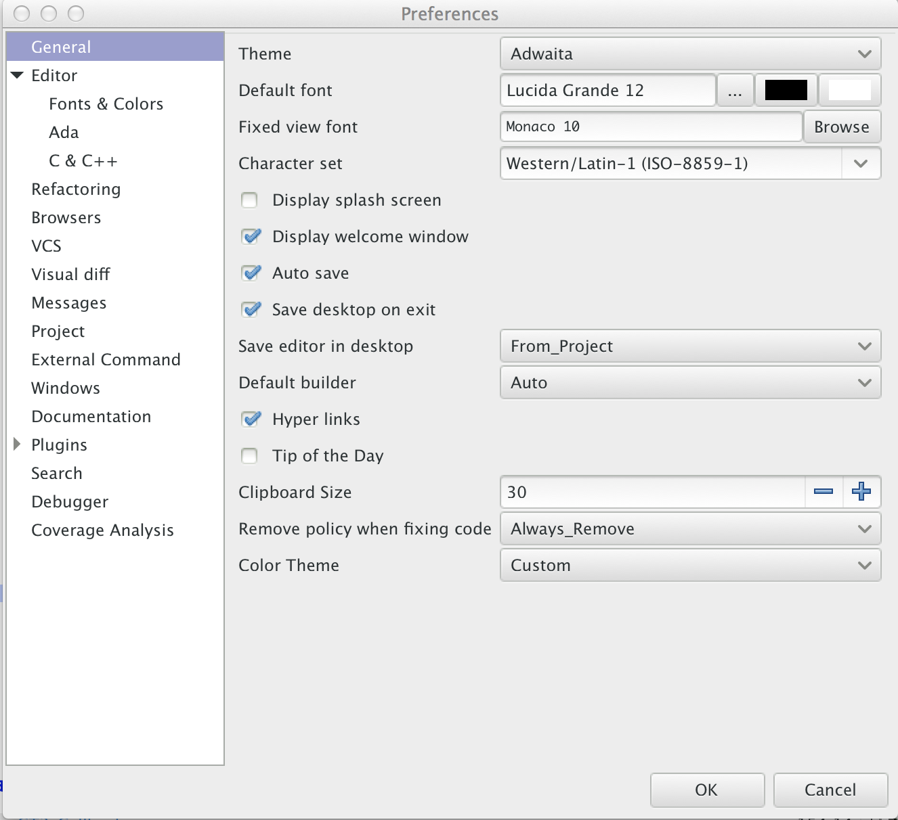

.. highlight:: ada
.. _Customizing_and_Extending_GPS:

*****************************
Customizing and Extending GPS
*****************************

.. index:: customization

GPS provides several levels of customization, from simple preference
dialogs to powerful scripting capability through the Python language.  This
chapters describes each of these capabilities.

.. index:: preferences
.. _preferences_dialog:
.. _The_Preferences_Dialog:

The Preferences Dialog
======================

This dialog, available through the :menuselection:`Edit-->Preferences...`
menu, allows you to modify GPS's global preferences GPS.  Changes are
applied as soon as you modify a setting.  Confirm your changes by pressing
the :guilabel:`OK` button or press the :guilabel:`Cancel` button to undo
them.

A label displays the name of each preference and an editing area to modify
its value. If hover over the label, a tool tip is displayed giving on-line
help for the preference.

The preferences dialog is composed of several areas, accessible through the
tabs at the left.  Each page contains a set of preferences.  Some pages are
nested (for example, to access the color configuration for editors, you
must expand the :guilabel:`Editor` row on the left by clicking on its
arrow, as seen in the screenshot above).

* :guilabel:`Themes`

  Allows you to quickly change the current settings for GPS, including
  preferences, key bindings, and menus.  See :ref:`GPS_Themes` for more
  information on themes. It's only displayed when there are themes
  registered.

* :guilabel:`General`

  * :guilabel:`Default font`

    .. index:: font
    .. index:: background color

    The default font used in GPS. The background color you select for this
    preference sets the background color for all consoles and most views
    that display their data as trees. To change the background color of
    editors, see the :menuselection:`Edit --> Fonts&Colors --> Default`
    preference.

  * :guilabel:`Fixed view font`

    .. index:: font

    The fixed (monospace) font used in views like such as outline view and
    the bookmark view.  If possible, you should should use a font with
    fixed width for characters for better rendering.

  * :guilabel:`Character set`

    .. index:: character set
    .. index:: ISO-8859-1

    Name of the character set to use when reading or writting text files.
    GPS uses UTF-8 and Unicode internally, which handles any character in
    any language. However, your system generally won't support Unicode
    natively, so the contents of the files need to be translated from the
    file system encoding to Unicode.

    This preference indicates the file system encoding in use. It defaults
    to ISO-8859-1, which corresponds to western european characters.

  * :guilabel:`Display splash screen`

    .. index:: splash screen

    Whether a splash screen is displayed when starting GPS.

  * :guilabel:`Display welcome window`

    .. index:: welcome dialog

    Whether GPS displays the welcome window to select the project to use.

  * :guilabel:`Show text in tool bar`

    .. index:: tool bar

    Whether the tool bar shows both text and icons or only icons.

  * :guilabel:`Auto save`

    .. index:: auto save

    Whether unsaved files and projects are saved automatically before
    calling external tools (such as a build).

  * :guilabel:`Save desktop on exit`

    .. index:: desktop

    Whether the desktop (size and positions of all windows) is saved when
    exiting.  If you're working with a project created automatically by
    GPS, the desktop is never saved.

  * :guilabel:`Save editor in desktop`

    .. index:: desktop

    Determines when source editors are saved in the desktop: :samp:`Never`,
    :samp:`Always`, or when a source file is associated with the current
    project (:samp:`From_Project`).

  * :guilabel:`Default builder`

    The default builder used by GPS.

    * :samp:`Auto` to use :program:`gnatmake` for Ada-only projects and
      :program:`gprbuild` otherwise (for multi-language and non Ada
      projects).

    * :samp:`Gnatmake` to always use :program:`gnatmake` for builds, even
      for projects containing sources in other languages. This disables
      support for building non-Ada projects.

    * :samp:`Gprbuild` to always use :program:`gprbuild` for builds, even
      for Ada-only projects.

  * :guilabel:`Hyper links`

    .. index:: hyper mode

    Whether to display hyper links in the editors when the :kbd:`Control`
    key is pressed.  See :ref:`Navigating_with_hyperlinks`.

  * :guilabel:`Clipboard size`

    .. index:: clipboard

    Controls the size of the list where all the entries copied into the
    clipboard through the :menuselection:`Edit --> Copy` and
    :menuselection:`Edit --> Cut` menus are saved.  Navigate this list
    using the :menuselection:`Edit --> Paste` and :menuselection:`Edit -->
    Paste Previous` menus, as described earlier in this manual.

  * :guilabel:`Show status bar`

    .. index:: status bar

    Whether the status bar at the bottom of the GPS window is displayed.
    The status bar contains one or more progress bars while GPS is
    executing long actions like a build or a search.  You can use these
    progress bars to monitor the progress of those actions.

    You can hide this status bar to save vertical screen space. The
    progress bars will no longer be visible. Instead, you can display the
    :guilabel:`Task Manager` through the :menuselection:`Tools --> Views
    --> Tasks` menu, to get similar information.  You can put the manager
    on the right or left side of the GPS window, for example just below
    the :guilabel:`Project` view.

  * :guilabel:`Remove policy when fixing code`

    .. index:: code fix

    The prefered way to fix code when parts have to be removed.
    :samp:`Always_Remove` requsts GPS to remove the code.
    :samp:`Always_Comment` requests GPS to comment out the code.
    :samp:`Propose_Both_Choices` proposes a menu with both choices.

  * :guilabel:`Tip of the Day`

    .. index:: tip of the day

    Whether GPS displays a :guilabel:`Tip of the Day` at start up.

* :guilabel:`Windows`

  .. index:: MDI
  .. index:: Multiple Document Interface

  This section selects preferences for the multiple document interface
  described in :ref:`Multiple_Document_Interface`.

  * :guilabel:`Opaque`

    .. index:: opaque

    Items are resized or moved opaquely when not maximized.

  * :guilabel:`Destroy floats`

    .. index:: float

    If false, closing the window associated with a floating item puts the
    item back in the main GPS window, but doesn't destroy it. If True, the
    window is destroyed.

  * :guilabel:`All floating`

    .. index:: float

    All windows are floating by default, i.e. be under the control of your
    system (on Windows) or window manager (on Unix machines). This replaces
    the MDI.

  * :guilabel:`Short titles for floats`

    .. index:: float

    All floating windows have a short title. In particular, base file names
    are used for editors instead of full names.

  * :guilabel:`Background color`

    .. index:: color

    Color to use for the background of the MDI.

  * :guilabel:`Title bar color`

    .. index:: color

    Color to use for the title bar of unselected items.

  * :guilabel:`Selected title bar color`

    .. index:: color

    Color to use for the title bar of selected items.

  * :guilabel:`Show title bars`

    If :samp:`Always`, each window in GPS has its own title, displaying
    information such as the name of the file and buttons to iconify,
    maximize or close the window. The title bar is highlighted when the
    window is currently selected.

    If :samp:`Never`, the title bar isn't displayed to save space on the
    screen.  Instead, the tabs of notebooks are highlighted.

    If :samp:`Central Only`, only the windows in the central area (i.e.,
    the part that gets preserved when switching perspective, which are
    mostly editors) have a title bar.  This is often a good way to save
    space on the screen: the title bar is useful for editors since it gives
    the full name of the file as well as provide an easy handle for drag
    operations, but the other views do not change position often much and
    it may be better to save space on the screen by not displaying their
    title bars.

  * :guilabel:`Notebook tabs policy`

    When notebook tabs are displayed. If :samp:`Never`, you must select the
    window in the :menuselection:`Window` menu or through the keyboard.  If
    :samp:`Automatic`, tabs are shown when two or more windows are
    contained in the notebook.

  * :guilabel:`Notebook tabs position`

    Where the notebook tabs are displayed by default.  Select the position
    of tabs for each notebook individually by right-clicking in any of
    their tabs and chosing a new position in the contextual menu. This
    position is saved as part of the desktop and restored the next time you
    restart GPS. However, if you change the value of this preference, the
    position of tabs in all notebooks resets to match the new value of the
    preference.

* :guilabel:`Editor`

  .. index:: editor

  * :guilabel:`General`

    * :guilabel:`Strip blanks`

      .. index:: strip blanks

      Whether editors remove trailing blanks when saving a file.

    * :guilabel:`Line terminator`

      .. index:: line terminator

      The style of line terminators used when saving files.
      :guilabel:`Unchanged` uses the original line terminator,
      :guilabel:`Unix` uses LF line terminators, and :guilabel:`Windows`
      uses CRLF line terminators.

    * :guilabel:`Display line numbers`

      .. index:: display line numbers

      Whether editors display line numbers.

    * :guilabel:`Display subprogram names`

      .. index:: Display subprogram names

      Whether the editor's status bar displays the subprogram name.

    * :guilabel:`Tooltips`

      .. index:: tooltip

      Whether tool tips are displayed automatically.

    * :guilabel:`Tooltips timeout`

      .. index:: tooltip timeout

      Time (in milliseconds) before displaying tooltips.

    * :guilabel:`Highlight delimiters`

      .. index:: highlight delimiter

      Whether the delimiter matching the character following the cursor is
      highlighted. The list of delimiters includes: `{}`

    .. _autosave_delay:

    * :guilabel:`Autosave delay`

      .. index:: autosave delay

      The period (in seconds) after which an editor is automatically saved,
      0 if never automatically saves.

      Each modified file is saved under a file called `.#filename#`, which is
      removed on the next explicit save operation.

    * :guilabel:`Right margin`

      .. index:: right margin

      The right margin to highlight, 0 if none.  This value is also used to
      implement the :menuselection:`Edit --> Refill` menu.

    * :guilabel:`Block highlighting`

      .. index:: block highlighting

      Whether the editor highlights the current block.  The current block
      depends on the programming language, and includes procedures, loops,
      if statements, and other similar structure.

    * :guilabel:`Block folding`

      .. index:: block folding

      Whether the editor provides the ability to fold and unfold blocks.

    * :guilabel:`Speed Column Policy`

      .. index:: speed column policy

      When the :guilabel:`Speed Column` is shown on the side of the
      editors:

      * :samp:`Never`

      * :samp`Always`

      * :samp:`Automatic`

        Shown whenever lines are highlighted in the editor, for example to
        show the current execution point or lines containing compilation
        errors. It disappears when no lines are highlighted.

    * :guilabel`Use Windows ACL`

      A Windows-specific preference, disabled by default. When enabled, GPS
      uses the ACL to change the file's write permission. Note that ACL's
      can't be used on network drives.

    * :guilabel:`External editor`

      .. index:: external editor

      The default external editor to use.

    .. _custom_editor_command:

    * :guilabel:`Custom editor command`

      The command line used to launch a custom editor.  GPS assumes the
      command creates a new window or terminal as needed.  If the editor
      itself does not provide this capability (such as :program:`vi` or
      :program:`pico` on Unix systems), you can use an external terminal
      command, e.g::

        xterm -geo 80x50 -exe vi +%l %f

      GPS performs the following substitutions:

      * :command:`%l`
        line to display

      * :command:`%c`
        column to display

      * :command:`%f`
        full pathname of file to edit

      * :command:`%e`
        extended lisp inline command

      * :command:`%p`
        top level project file name

      * :command:`%%`
        a literal percent sign ('%')

    * :guilabel:`Always use external editor`

      True if all editing is done with the external editor, which
      completely deactivates the internal editor. False if the external
      editor needs is only explicitly called by the user.

    * :guilabel:`Smart completion`

      .. index:: smart completion

      When enabled, GPS loads all the information needed for the Smart
      completion to work on startup.

    * :guilabel:`Smart completion timeout`

      The timeout, milliseconds, after which the :guilabel:`Smart
      Completion` window appears automatically after entering a triggering
      character, such as '.'

  * :guilabel:`Fonts & Colors`

    .. index:: font
    .. index:: color

    * :guilabel:`Default`

      The default font, default foreground and default background colors
      used in the source editor.

    * :guilabel:`Blocks`

      Font variant and colors used to highlight blocks (such as
      subprograms, task, and entries) in declarations.

    * :guilabel:`Types`

      Font variant and colors used to highlight types in declarations.

    * :guilabel:`Keywords`

      Font variant and colors used to highlight keywords.

    * :guilabel:`Comments`

      Font variant and colors used to highlight comments.  Setting the
      color to white sets the color as transparent.

    * :guilabel:`SPARK Annotations`

      Font variant and colors used to highlight SPARK annotations within
      Ada comments (Starting with `--#`).  Setting the
      color to white sets the color as transparent.

    * :guilabel:`Ada/SPARK Aspects`

      Font variant and colors used to highlight Ada 2012 and SPARK 2014
      aspects.  Setting the color to white sets the color as transparent.

    * :guilabel:`Strings`

      Font variant and colors used to highlight strings.
      Setting the color to white sets the color as transparent.

    * :guilabel:`Numbers`

      Font variant and colors used to highlight numbers.
      Setting the color to white sets the color as transparent.

    * :guilabel:`Current line color`

      Color for highlighting the current line. Leave it blank for no
      highlighting.  Setting the color to white sets the color as
      transparent.

    * :guilabel:`Draw current line as a thin line`

      Whether to use a thin line rather than full background highlighting
      on the current line.

    * :guilabel:`Current block color`

      Color for highlighting the current source block.

    * :guilabel:`Delimiter highlighting color`

      Color for highlighting delimiters.

    * :guilabel:`Search results highlighting`

      Color for highlighting the search results within the text of editors.

  * :guilabel:`Ada`

    .. index:: Ada

    * :guilabel:`Auto indentation`

      .. index:: indentation

      How the editor should indent Ada sources.  :guilabel:`None` means no
      indentation; :guilabel:`Simple` means use indentation from the
      previous line; :guilabel:`Extended` means use a language specific
      parser.

    * :guilabel:`Use tabulations`

      .. index:: tabs

      Use tab characters when indenting.  This preference doesn't modify
      the :kbd:`Tab` key, which still inserts tab characters. You can also
      map the :menuselection:`Edit --> Insert Tab With Spaces` key shortcut
      to, e.g., :kbd:`Tab` via :ref:`The_Key_Manager_Dialog`. You can also
      reconfigure the default key binding for the automatic indentation
      action: by default, it's mapped to :kbd:`Tab`, but you can change it
      to :kbd:`Tab` by modifying the :menuselection:`Edit --> Format
      Selection` action from :ref:`The_Key_Manager_Dialog`.

    * :guilabel:`Default indentation`

      .. index:: indentation level

      Number of spaces for the default Ada indentation.

    * :guilabel:`Continuation lines`

      .. index:: continuation line

      Number of extra spaces for continuation lines.

    * :guilabel:`Declaration lines`

      .. index:: declaration line

      Number of extra spaces for multiple line declarations.  For example,
      if you specify a value of 4, here's how the following code would be
      indented::

        variable1,
            variable2,
            variable3 : Integer;

    * :guilabel:`Conditional continuation lines`

      .. index:: conditional line

      Number of extra spaces used to indent multiple-line conditionals
      within parentheses.

      For example, when set to 1 (the default), continuation lines are
      indented from the previous parenthesis by one space::

        if (Condition1
            and then Condition2)
        then

      When this preference is set to 3, you get::

        if (Condition1
              and then Condition2)
        then

    * :guilabel:`Record indentation`

      .. index:: record indentation

      Number of extra spaces for record definitions, when the
      :command:`record` keyword is on its own line.

      For example, when set to 3 (the default), the following sample will
      be indented as::

        type T is
           record
              F : Integer;
           end record;

      When set to 1, you get::

        type T is
         record
            F : Integer;
         end record;

    * :guilabel:`Case indentation`

      .. index:: case indentation

      Whether GPS should indent case statements an extra level, as done in
      the Ada Reference Manual, e.g::

        case Value is
           when others =>
              null;
        end case;

      If set to :guilabel:`Non_Rm_Style`, this is indented as::

        case Value is
        when others =>
           null;
        end case;

      By default (:guilabel:`Automatic`), GPS decides whether indent an
      extra level based on the first :command:`when` construct: if that
      construct is indented an extra level, the whole case statement is
      indented following the RM style.

    * :guilabel:`Casing policy`

      The way the editor handles auto-casing:

      * :guilabel:`Disabled`

        No auto-casing is done.

      * :guilabel:`End_Of_Line`

        Auto-casing done when pressing the :kbd:`Enter` key.

      * :guilabel:`End_Of_Word`

        Auto-casing is done word-by-word while typing.

      * :guilabel:`On_The_Fly`

        Auto-casing is done character-by-character while typing.

      For the :guilabel:`End_Of_Line`, :guilabel:`End_Of_Word` and
      :guilabel:`On_The_Fly` policies you can force auto-casing of the
      current line by pressing the indentation key (by default,
      :kbd:`Tab`).

      You can also disable auto-casing for a single character (action
      :guilabel:`No Casing/indentation on Next Key`, by default
      :kbd:`Ctrl-Q`) or temporarily (action :guilabel:`Toggle Auto
      Casing/indentation`, by default :kbd:`Alt-Q`).

    * :guilabel:`Reserved word casing`

      How the editor handles the casing of reserved words.

      * :guilabel:`Unchanged`

        Keeps casing as-is.

      * :guilabel:`Upper`

        Changes the casing of all reserved words to upper case.

      * :guilabel:`Lower`

        Changes to lower case.

      * :guilabel:`Mixed`

        Changes to mixed case (all characters to lower case except first
        character and characters after an underscore which are made upper
        case).

      * :guilabel:`Smart_Mixed`

        Like :guilabel:`Mixed`, but don't force upper case characters to
        lower case.

    * :guilabel:`Identifier casing`

      How the editor handles the casing of identifiers.  The values are the
      same as for the :guilabel:`Reserved word casing` preference.

    * :guilabel:`Format operators/delimiters`

      Whether the editor adds extra spaces around operators and delimiters,
      if needed.  If enabled, an extra space is added in the following
      cases: before an opening parenthesis; after a closing parenthesis,
      comma, semicolon and around all Ada operators (e.g.  `<=`, `:=`,
      `=>`).

    * :guilabel:`Align colons in declarations`

      Whether the editor automatically aligns colons in declarations and
      parameter lists.  The alignment is computed by looking at the editor
      up to the current line (or end of the current selection), so if
      declarations continue beyond that point, you must select the
      declarations lines and hit the reformat key.

    * :guilabel:`Align associations on arrows`

      Whether the editor automatically aligns arrows in associations
      (e.g. aggregates or function calls). See also the previous preference.

   * :guilabel:`Align declarations after colon`

      Whether the editor aligns continuation lines in variable declarations
      based on the colon character.

      Consider the following code::

        Variable : constant String :=
          "a string";

      If enabled, the code is indented as follows::

        Variable : constant String :=
                     "a string";

    * :guilabel:`Indent comments`

      Whether to indent lines containing only comments and blanks or to
      keep these lines unchanged.

    * :guilabel:`Align comments on keywords`

      Whether to align comment lines following :command:`record` and
      :command:`is` keywords with no extra space.

      When enabled, the following code is indented as::

        package P is
        --  Comment

           [...]
        end P;

      When disabled, it's indented as::

        package P is
           --  Comment

           [...]
        end P;

  * :guilabel:`C & C++`

    .. index:: C
    .. index:: C++

    * :guilabel:`Auto indentation`

      .. index:: indentation

      How the editor should indent C/C++ sources.  :guilabel:`None` is no
      indentation, :guilabel:`Simple` uses indentation from the previous
      line for the next line, and :guilabel:`Extended` uses a language
      specific parser to indent sources.

    * :guilabel:`Use tabulations`

      .. index:: tabs

      Use tab characters when indenting. If :guilabel:`True`, the editor
      replaces each occurrence of eight characters by a tab character.

    * :guilabel:`Default indentation`

      .. index:: indentation

      Number of spaces for the default indentation.

    * :guilabel:`Extra indentation`

      .. index:: indentation

      Whether to indent loops, :command:`if` and :command:`switch`
      statements an extra level.  If enabled, the following layout is
      generated::

        if (condition)
          {
            int x;
          }

      If disabled, the same code is indented as::

        if (condition)
        {
          int x;
        }

    * :guilabel:`Indent comments`

      Whether to indent lines containing only comments and blanks or keep
      these lines unchanged.

* :guilabel:`Debugger`

  .. index:: debugger

  * :guilabel:`Preserve State on Exit`

    .. index:: breakpoint

    If enabled, the debugger automatically saves breakpoints when it exits
    and restores them the next time the it debugs the same executable.
    This is a convenient way to work when the typical usage alternates
    between compile and debug operations.

    When enabled, the debugger also preserves the contents of the data
    window whenever it's closed.  Reopening the window, either during the
    same debugger session or automatically when you start a new debugger on
    the same executable, recreates the same boxes within the data window.

  * :guilabel:`Debugger Windows`

    .. index:: debugger windows

    Controls what happens to debugger-related windows, such the call stack,
    data window, and tasks view when the debugger terminates. There are
    three possibilities.

    * :guilabel:`Close Windows`

      All those windows are closed. This saves memory and space on your
      screen, but you must explicitly reopen them and put them in the
      desired location on the desktop the next time you start a debugger
      session.

   * :guilabel:`Keep Windows`

      The windows are cleared, but kept on the desktop. When you start a
      new debugger session, the windows are automatically reused.  This
      ensures you won't have to reopen and reposition them, but takes up
      space on your screen.

   * :guilabel:`Hide Windows`

      The windows are cleared and hidden. When you start a new debugger
      session, they're automatically reused and made visible again. This
      option also ensures you won't have to reopen and reposition them, but
      requires some memory.  Note that if you move other windows around
      while these are hidden, they might reappear in unexpected locations.

  * :guilabel:`Break on exceptions`

    .. index:: breakpoint
    .. index:: exception

    Specifies whether a breakpoint on all exceptions should be set by default
    when loading a program. This setup is only taken into account when a new
    debugger is initialized, and will not modify a running debugger (use the
    breakpoint editor for running debuggers).

  * :guilabel:`Execution window`

    .. index:: execution
    .. index:: tty

    Whether the debugger should create a separate execution window for the
    program being debugged.  This preference doesn't apply to the current
    debug session; to change the current debug session, you need to
    terminate it and start a new one.

    If enabled, a separate console is created.  On Unix systems, this
    console is another window in the bottom part of the main window and on
    Windows, it's a separate window created by the underlying
    :program:`gdb`, since Windows does not have the notion of separate
    terminals (ttys).

    If using this mode under Windows, the :menuselection:`Debug -->
    Interrupt` menu is only able to interrupt the debugged program with
    recent versions of :program:`gdb`.  If you are using older versions,
    you need to hit :kbd:`Ctrl-C` in the separate execution window to
    interrupt it.  This separate execution window uses the default
    system-wide console properties (such as the size of the window and its
    color).  You can change those properties using the default console menu
    (top-left of the console).

    If this preference is disabled, GPS doesn't created an execution
    window. The debugger assumes the program being debugged either doesn't
    require input or that input is handled outside GPS. For example, when
    you attach to a running process, this process already has an associated
    terminal.

  * :guilabel:`Show lines with code`

    Whether the source editor displays blue dots for lines containing
    code. If disabled, gray dots are instead displayed on each line,
    permitting breakpoint on any line, which is faster since GPS doesn't
    need to ask the debugger which lines contain code.

  * :guilabel:`Detect aliases`

    .. index:: aliases

    If enabled, don't create new items when an item with the same address
    is already present on the canvas.

  * :guilabel:`Assembly range size`

    .. index:: range size

    Number of assember lines to display in the initial display of the
    assembler window. If 0, the whole subprogram is displayed, which can
    take a long time on slow machines.

  * :guilabel:`Current assembly line`

    Color used to highlight the assembly code for the current line.

  * :guilabel:`Color highlighting`

    .. index:: color

    Color used for highlighting in the debugger console.

  * :guilabel:`Clickable item`

    Color used for clickable items (e.g pointers).

  * :guilabel:`Changed data`

    Color used to highlight fields in the data window that have changed
    since the last update.

  * :guilabel:`Memory color`

    Default color for the memory view window.

  * :guilabel:`Memory highlighting`

    Color used for highlighted items in the memory view.

  * :guilabel:`Memory selection`

    Color used for selected items in the memory view.

  * :guilabel:`Item name`

    Font used for the name of each item in the data window.

  * :guilabel:`Item type`

    Font used to display the type of each item in the data window.

  * :guilabel:`Max item width`

    Maximum width of an item.

  * :guilabel:`Max item height`

    Maximum height of an item.

* :guilabel:`External Commands`

  .. index:: helper
  .. index:: external commands

  These preferences specify the names of the commands that GPS uses to
  perform various operations.

  * :guilabel:`List processes`

    List processes running on the machine.

  * :guilabel:`Remote shell`

    .. index:: remote shell

    Run a process on a remote machine. You can specify arguments, for
    example, :command:`rsh -l user`.

  * :guilabel:`Remote copy`

    .. index:: remote copy

    Copy a file from a remote machine. You can specify arguments, for
    example :command:`rcp -l user`.

  * :guilabel:`Execute command`

    .. index:: execution

    Execute commands externally.

  * :guilabel:`HTML Browser`

    .. index:: html

    View HTML files, for example the documentation.  Not relevant under
    Windows, where the default HTML browser is used.  Not specified by
    default, which means GPS tries to find a suitable HTML browser.  Only
    change this value if GPS cannot find a HTML browser, or if the browser
    found isn't the one you prefer.

  .. _Print_Command:

  * :guilabel:`Print command`

    .. index:: print
    .. index:: a2ps
    .. index:: PrintFile

    Print files.  This program is required under Unix systems to print, and
    is set to :program:`a2ps` by default.  If :program:`a2ps` is not
    installed on your system, download it from
    `ftp://ftp.enst.fr/pub/unix/a2ps/ <ftp://ftp.enst.fr/pub/unix/a2ps/>`_.
    You can also specify other programs such as :program:`lp`.

    On Windows, this program is optional and the preference is empty by
    default since GPS provides built-in printing.  If you specify an
    external tool, such as the :program:`PrintFile` freeware utility
    available from `http://www.lerup.com/printfile/descr.html
    <http://www.lerup.com/printfile/descr.html>`_, GPS uses that.

* :guilabel:`Search`

  .. index:: search

  * :guilabel:`Confirmation for "Replace all"`

    .. index:: replace

    Enable or disable the confirmation popup for the replace all action.

  * :guilabel:`Close on Match`

    .. index:: search

    If enabled, GPS closes the search window when a match is found.

  * :guilabel:`Select on Match`

    .. index:: search

    If enabled, the focus is be given to the editor when a match is found.

  * :guilabel:`Preserve Search Context`

    .. index:: search

    If enabled, the contents of the :guilabel:`Look in:` field is preserved
    between consecutive file searches.

* :guilabel:`Browsers`

  .. index:: browsers

  * :guilabel:`General`

    * :guilabel:`Selected item color`

      .. index:: color

      Color of selected items.

    * :guilabel:`Background color`

      .. index:: color

      Color of browser background.

    * :guilabel:`Hyper link color`

      .. index:: color

      Color of hyperlinks between items.

    * :guilabel:`Selected link color`

      .. index:: color

      Color of links between selected items.

    * :guilabel:`Default link color`

      .. index:: color

      Color of links between non-selected items.

    * :guilabel:`Ancestor items color`

      .. index:: color

      Color of background of items linked to selected items.

    * :guilabel:`Offspring items color`

      .. index:: color

      Color of background of items linked from selected items.

    * :guilabel:`Vertical layout`

      .. index:: vertical layout

      Whether the layout of the graph should be vertical or
      horizontal.  This setting applies to most browsers (such as the
      call graph), but doesn't apply to the entity browsers.

    * :guilabel:`Show elaboration cycles`

      .. index:: show elaboration cycles

      Display a elaboration graph after each compilation showing an
      elaboration cycle.

* :guilabel:`VCS`

  .. index:: vcs

  * :guilabel:`Implicit status`

    .. index:: Implicit status

    Whether GPS is allowed to launch a status action (such as getting
    revision numbers) as part of another action (such as an update
    command).  If the network connection with the repository is slow,
    disabling this preference can speed up the VCS actions.

  * :guilabel:`Default VCS`

    .. index:: Default VCS

    The default VCS.

* :guilabel:`Visual diff`

  .. index:: visual diff
  .. index:: file comparison

  In order to perform visual comparison between files, GPS needs to
  call external tools that aren't distributed with GPS such as
  :program:`diff` or :program:`patch`.  These tools are usually found
  on most Unix systems but may not be available by default on other
  OSes. Under Windows, you can download them from one of the available
  Unix toolsets, such as :program:`msys` (`http://www.mingw.org
  <http://www.mingw.org>`_) and :program:`cygwin`
  (`http://www.cygwin.com <http://www.cygwin.com>`_).

  * :guilabel:`mode`

    .. index:: diff

    How GPS visually displays the difference between two files:

    * :guilabel:`Side_By_Side`

      Editors are displayed side-by-side; new editors are created as needed.

    * :guilabel:`Unified`

      No new editor is created; changes are displayed directly in the
      existing editor.

  * :guilabel:`Diff command`

    .. index:: -u
    .. index:: -c

    Command used to compute differences between two files.  You can
    also specify arguments. The visual diff support expects a standard
    :program:`diff` output with no context (that is, no :command:`-c`
    or :command:`-u` switches).  You may wish to include some of the
    following switches depending on the version of :program:`diff` you
    specify:

    * :command:`-b`

      Ignore changes in the amount of white space.

    * :command:`-B`

      Ignore changes that only insert or delete blank lines.

    * :command:`-i`

      Ignore changes in case; consider upper and lower case letters equivalent.

    * :command:`-w`

      Ignore all white space when comparing lines.

  * :guilabel:`Patch command`

    .. index:: patch

    Command used to apply a patch.  You can also specify arguments.
    GPS used this command internally to perform the visual comparison
    on files in a VCS.  This command should be compatible with the GNU
    :program:`patch` command.

  * :guilabel:`Use old diff`

    .. index:: old diff

    Use the old version of the visual comparison.  The remianing preferences
    aren't displayed if this preference is enabled.

  * :guilabel:`Diff3 command`

    .. index:: diff3

    Command used to query a 3-way diff.  See :guilabel:`Diff command`
    for a description of the parameters.

  * :guilabel:`Default color`
    
    Color in the reference editor indicating lines on which there is a
    difference.

  * :guilabel:`Old color`

    Color for space used by lines not present in one of the editors in
    a 3-way diff.

  * :guilabel:`Append color`

    Color indicating lines present in an editor but not in the reference
    editor.

  * :guilabel:`Remove color`

    Color indicating lines present in the reference editor but not in
    other editors.

  * :guilabel:`Change color`

    Color indicating lines changed between the reference editor and other
    editors.

  * :guilabel:`Fine change color`

    Color indicating detailed differences within a modified line.

  * :guilabel:`Context length`

    .. index:: context length

    Number of lines displayed before and after each chunk of differences.
    Specifying -1 displays the whole file.

* :guilabel:`Messages`

  .. index:: messages

  * :guilabel:`Color highlighting`

    .. index:: color

    Color of highlighted text in the :guilabel:`Messages` view.

  * :guilabel:`Errors highlighting`

    .. index:: errors

    Color used in a source editor for lines that cause compilation errors.
    If white, the errors aren't highlighted. (See :ref:`Compilation/Build`)

  * :guilabel:`Warnings highlighting`

    .. index:: errors

    Color used in a source editor for lines that cause compilation
    warnings.  If white, the warnings aren't highlighted. (See
    :ref:`Compilation/Build`)

  * :guilabel:`Style errors highlighting`

    .. index:: style

    Color used in a source editor for lines that cause style errors.  If
    white, the style errors aren't highlighted. (See
    :ref:`Compilation/Build`)

  * :guilabel:`Compiler info highlighting`

    .. index:: style

    Color used in a source editor to highlight lines containing compiler
    information. If white, the information isn't highlighted.

  * :guilabel:`File pattern`

    .. index:: file pattern
    .. index:: location

    Pattern used to parse file locations and message type from lines output
    to the :guilabel:`Messages` view.  This is particularly useful when
    using an external tool such as a compiler or a search tool so GPS
    highlights and allows navigation through source locations.  The pattern
    is a standard System V regular expression containing from two to five
    parenthesized subexpressions corresponding to the file, line, column,
    warnings or style error patterns.

  * :guilabel:`File index`

    .. index:: file index

    Index of the filename in the expressions in the :guilabel:`File pattern`.

  * :guilabel:`Line index`

    .. index:: line index

    Index of the line number in the expressions in the :guilabel:`File
    pattern`.

  * :guilabel:`Column index`

    .. index:: column index

    Index of the column number in the expressions in the :guilabel:`File
    pattern`.

  * :guilabel:`Warning index`

    .. index:: warning index

    Index of the warning identifier in the expressions in the
    :guilabel:`File pattern`.

  * :guilabel:`Style index`

    .. index:: style index

    Index of the style error identifier in the expressions in the
    :guilabel:`File pattern`.
  * :guilabel:`Info index`

  * :guilabel:`Info index`

    .. index:: info index

    Index of the compiler info identifier in the expressions in the
    :guilabel:`File pattern`.

  * :guilabel:`Secondary File pattern`

    .. index:: file pattern
    .. index:: location

    Pattern used to parse additional file locations from lines in the
    :guilabel:`Messages` view.  This is a standard System V regular
    expression containing two or three parenthesized subexpressions
    corresponding to the file, line, and column patterns.

  * :guilabel:`Secondary File index`

    .. index:: file index

    Index of the filename in the expressions in the :guilabel:`Secondary File
    pattern`.

  * :guilabel:`Secondary Line index`

    .. index:: line index

    Index of the line number in the expressions in the :guilabel:`Secondary
    File pattern`.

  * :guilabel:`Secondary Column index`

    .. index:: column index

    Index of the column number in the expressions in the
    :guilabel:`Secondary File pattern`.  Index of the column number in the
    file pattern.

  * :guilabel:`Alternate Secondary File pattern`

    .. index:: location

    Pattern used to parse additional file locations in alternate form from
    lines in the :guilabel:`Messages` view.  This is a standard System V
    regular expression containing one parenthesized subexpression.

  * :guilabel:`Alternate Secondary Line index`

    .. index:: line index

    Index of the line number in the expressions in the :guilabel:`Alternate
    Secondary File pattern`.

* :guilabel:`Project`

  * :guilabel:`Relative project paths`

    .. index:: relative project path

    Whether paths should be absolute or relative when GPS modifies a
    project file.

  * :guilabel:`Fast Project Loading`

    .. index:: fast project loading

    If the project contains a number of restrictions, this preference
    provides major speed up when GPS parses the project. This is especially
    noticeable if the source files are on a network drive.

    GPS assumes the following restrictions are true when this preference is
    enabled. If any are false, no error is reported and there be only minor
    effects in GPS.  For example, if won't be able to detect that two files
    are the same if one of them is a symbolic link, although GPS stills
    warns if you're trying to overwrite a file modified on the disk.

    The restrictions are the following:

    * Symbolic links shouldn't be used in the project.

      More precisely, you can only have symbolic links that point to files
      outside of the project, but not to another file in the project

    * Directories can't have source names.

      No directory name should match the naming scheme defined in the
      project. For example, if you're using the default GNAT naming scheme,
      you can't have directories with names ending in :file:`.ads` or
      :file:`.adb`.

  * :guilabel:`Hidden directories pattern`

    .. index:: hidden directories pattern

    A regular expression used to match hidden directories which aren't
    displayed by default in the project view, nor taken into account by VCS
    operations on directories.

.. _Documention_Preferences:

* :guilabel:`Documentation`

  This section specifies preferences that apply to the documentation
  generator. See :ref:`Documentation_Generation` for more information.

  * :guilabel:`Process body files`

    Body (implementation) files are processed.  Otherwise, only the
    specification files are processed.

  * :guilabel:`Show private entities`

    By default, no documentation is generated for private entities.
    Enabling this preference produces that documentation.

  * :guilabel:`Call graph`

    The documentation computes and take advantages of source references to
    generate call graph information.  Activating this option slows down the
    documentation generation process.

  * :guilabel:`Up-to-date files only`

    Only files having up-to-date cross references information are
    documented.

  * :guilabel:`Comments filter regexp`

    A regular expression used to filter to comments found in the source
    code before using them for documentation. For example "^!.*" ignores
    all comments starting with '!'.

  * :guilabel:`Spawn a browser`

    A browser is spawned after documentation is generated to view the
    generated files.

  * :guilabel:`Find xrefs in comments`

    Try to find references to entities in comments and generate links to
    them when generating the documentation.

.. _Coverage_Analysis_Preferences:

* :guilabel:`Coverage Analysis`

  * :guilabel:`Coverage toolchain`

    Select which coverage toolchain (:program:`gcov` or :program:`xcov`) to
    use from the :menuselection:`Tools --> Coverage` menu.

.. _GPS_Themes:

GPS Themes
==========

.. index:: themes

GPS include extensive support for themes, which are predefined sets of
values for preferences, key bindings, and other configurable aspects of
GPS.

For example, color themes are a convenient way to change all colors in GPS
simultaneously to predefined choices such as strongly contrasted colors or
monochrome.  You can also have key themes, defining a set of key bindings,
for example to emulate other editors.

You can activate any number of themes simultaneously via the preferences
dialog (:menuselection:`Edit --> Preferences`), which contains a list of
all themes supported by GPS, organized into categories.  Click on the
buttons on the left of each theme name to activate that theme.  This
immediately changes the current preferences settings. For example, if the
theme you selected changes the colors in the editor, these are changed
immediately in the :menuselection:`Editor --> Fonts & Colors` menu.  Press
:guilabel:`Cancel` to return to your previous settings

If multiple themes are active and try to set the same preference, the last
theme loaded by GPS overrides all previously loaded themes. However, there
is no predefined order in which the themes are loaded, so you shouldn't
depend on this behavior.

.. _The_Key_Manager_Dialog:

The Key Manager Dialog
======================

Access the key manager dialog through the :menuselection:`Edit --> Key
Shortcuts` menu.  This dialog provides an easy way to associate key
shortcuts with actions.  Actions are either predefined in GPS or defined in
your own customization files, as documented in
:ref:`Customizing_through_XML_and_Python_files`.  It also provides an easy
way to redefine menu shortcuts.

.. index:: screen shot
.. image:: key-shortcuts.jpg

Actions are referenced by their name and grouped into categories indicating
when the action applies. For example, the indentation command applies only
in source editors while the command to change the current window applies
anywhere in GPS.  Specify the category when you create your own actions
through XML files (see :ref:`Defining_Actions`).

As an example, you can use the key manager to define key bindings similar
to what Emacs uses (such as :kbd:`Ctrl-x` followed by
:kbd:`Ctrl-k`). To register such key bindings, press the
:guilabel:`Grab` button and type the shortcut.  Recording of the key
binding stops shortly after you pressed the last key.

If you define complex shortcuts for menus, they won't appear next to the
menu name when you select it with the mouse due to technical limitations in
the graphical toolkit that GPS uses.

Assigning a new shortcut to an action causes the following:

* All actions and menus currently associated with key aree no longer be
  executed when the key is pressed.

* All key shortcuts defined for this action are replaced by the new one;
  the action is only executable through this new shortcut.

.. _The_Plug-ins_Editor:

The Plug-ins Editor
===================

.. index:: plug-ins

You can extensively customize GPS through external plug-ins, either ones
you write (see :ref:`Customization_files_and_plugins`) or using one of the
plug-ins in GPS's own collection.

Some plug-ins are loaded by default when GPS starts (such as support for
the CVS version management system and support for highlighting in various
programming languages) and others are available but not loaded
automatically, such as Emacs emulation mode.

Some plug-ins provided with GPS are:

* :program:`Emacs` emulation

  .. index:: Emacs

  Several plug-ins emulate many functions provided by :program:`Emacs`,
  such as the interactive search, manipulation of rectangles, navigation,
  and the usual :program:`Emacs` key shortcuts.  Activate it by loading the
  :file:`emacs.xml` plug-in.

* :file:`Makefile` support

  .. index:: Makefile

  A plug-in that parses a :file:`Makefile` and creates menus for each of
  its targets so you can easily start a :command:`make` command.

* Cross-references enhancements

  Some plug-ins take advantage of GPS's cross-references information to
  create additional menus for navigation such as jumping to the primitive
  operations of Ada tagged types and to the body of Ada separate entities.

* Text manipulation

  Several plug-ins provide support for advanced text manipulation in the
  editors, for example to align a set of lines based on various criteria
  or to manipulate a rectangular selection of text.

To graphically choose which plug-ins are loaded on startup, select the
:menuselection:`Tools --> Plug-ins` menu.  This brings up a new window,
containing two parts:

* A list of all known plug-ins on the left.

  This list indicates the name of the plug-in, and whether it's loaded in
  this GPS session (when the toggle button is checked).

  As described in :ref:`Customization_files_and_plugins`, GPS searches for
  plug-ins in various directories and, based on these directories, decides
  whether to automatically load the plug-in on startup.

* Details for the selected plug-in on the right.

  This window is a notebook with two pages: the first contains the exact
  location of the plug-in, the reason it was either loaded or not loaded,
  and the source of the plug-in.  By convention, each plug-in starts with
  a comment indicating the purpose of this plug-in and more detailed
  documentation on its usage.  This also contains the plug-in itself, so it
  can act as an example you can use to create your own customization
  script.  The list of plug-ins to load are stored in the file
  :file:`HOME/.gps/startup.xml`.

  If you've modified anything through this dialog (such as the list of
  plug-ins to load or unload), you need to restart GPS, since it can't
  unload a module due to such an action having too many possible effects on
  GPS, so a dialog is displayed asking you whether you would like to exit
  GPS. Doing so saves your files.

.. _Customizing_through_XML_and_Python_files:

Customizing through XML and Python files
========================================

.. index:: customization

.. _Customization_files_and_plugins:

Customization files and plugins
-------------------------------

You can customize many capabilities in GPS using files it loads at startup.
For example, you can add items to the menu and tool bars as well as
defining new key bindings, languages, and tools.  Using Python as a
programming language, you can also add new facilities and integrate your
own tools into the GPS platform.

GPS searches for these customization files at startup in several different
directories. Depending on where they're found, they are either
automatically loaded by GPS (and thus can immediately modify things in
GPS), or only be made visible in the Plug-ins Editor (see
:ref:`The_Plug-ins_Editor`).

These directories are searched in the order given below. Any script loaded
latter can override operations performed by previously loaded scripts. For
example, they can override a key shortcut, remove a menu, or redefine a GPS
action.

In each directory name below, :file:`INSTALL` is the name of the directory
in which you've installed GPS. :file:`HOME` is your home directory, either
by default or as overriden by the :file:`GPS_HOME` environment variable.
In each directory, only files with :file:`.xml` or :file:`.py` extensions
are used. Other files are ignored, although for compatibility with future
versions of GPS you should not have keep other files in these directories.

* Automatically-loaded, global modules

  The :file:`INSTALL/share/gps/plug-ins` directory contains the files GPS
  automatically loads by default (unless overriden by the user via the
  Plug-ins Editor). These plug-ins are visible to any user on the system
  using the same GPS installation.  Reserve this directory for critical
  plug-ins that almost everyone will use.

* Not automatically-loaded, global modules

  The :file:`INSTALL/share/gps/library` directory contain files GPS
  displays in the Plug-ins Editor, but doesn't load automatically.
  Typically, these files add optional capabilities to GPS, for example an
  :program:`emacs` emulation mode or additional editor capabilities that
  many of users generally won't use.

* :file:`GPS_CUSTOM_PATH`

  Set this environment variable before launching GPS to contain a list of
  directories, separated by semicolons (';') on Windows systems and colons
  (':') on Unix systems. All files in these directories with the
  appropriate extensions are automatically loaded by default by GPS, unless
  overriden by the user through the Plug-ins Editor.

  This is a convenient way to have project-specific customization files. You
  can for instance create scripts, or icons, that set the appropriate value for
  the variable and then start GPS. Depending on your project, this allows you
  to load specific aliases which do not make sense for other projects.

* Automatically loaded user directory

  The directory :file:`HOME/.gps/plug-ins` is searched last. Any script in
  it is loaded automatically unless overriden in the Plug-ins Editor.

  This is a convenient way for you to create your own plug-ins or test them
  before you make them available to all GPS users by copying them to one of
  the other directories.

Any script loaded by GPS can contain customization for various aspects of
GPS, such as aliases, new languages or menus, in a single file. 

Python files
^^^^^^^^^^^^

You can format the Python plug-in in any way you want (as long as it can be
executed by Python, of course), the following formatting is
suggested. These plug-ins are visible in the Plug-ins Editor, so having a
common format makes it easier for users to understand each plug-in:

* Comment

  Your script should start with a comment on its goal and usage. This
  comment should use Python's triple-quote convention, rather than the
  start-of-line hash ('#') signs.  The first line of the comment should be
  a one line explanation of the goal of the script, separated by a blank
  line from the rest of the comment.

* Customization variables

  If a user can configure your script by changing some global variables,
  they should be listed next and fully documented.  The user can use the
  :menuselection:`Tools --> Plug-ins` menu to change the value of those
  variables.

* Implementation

  Separate the implementation from the initial comment by a form-feed
  (control-L); the startup scripts editor only displays the first page of
  the script in the first page of the editor.

  If possible, scripts should avoid executing code when they're
  loaded. This gives the user a chance to change the value of global
  variables or override functions before the script is actually launched.
  Instead, you should to connect to the :command:`"gps_started"` hook, as
  in::

      ^L
      ###########################################################
      ## No user customization below this line
      ###########################################################

      import GPS

      def on_gps_started (hook_name):
         ... launch the script

      GPS.Hook ("gps_started").add (on_gps_started)

XML files
^^^^^^^^^

.. highlight:: xml

XML files must be UTF8-encoded by default. In addition, you can specify any
specific encoding through the standard command:`<?xml encoding="..." ?>`
declaration, as in the following example::

  <?xml version="1.0" encoding="iso-8859-1"?>
  <!--  general description -->
  <submenu>
    <title>encoded text</title>
  </submenu>

These files must be valid XML files, i.e. must start with the `<?xml?>` tag
and contain a single root XML node, the name of which is arbitrary.  The
format is therefore::

  <?xml version="1.0" ?>
  <root_node>
     ...
  </root_node>

The first line after the `<?xml?>` tag should contain a comment describing
the purpose and usage of the script.  This comment is made visible in the
Plug-ins editor.  The list of valid XML nodes that you can specify under
:file:`<root>` is described in later sections. It includes:

* :ref:`\<action>\ <Defining_Actions>`

* :ref:`\<key>\ <Binding_actions_to_keys>`

* :ref:`\<submenu>\ <Adding_new_menus>`

* :ref:`\<pref>\ <Preferences_support_in_custom_files>`

* :ref:`\<preference>\ <Preferences_support_in_custom_files>`

* :ref:`\<alias>\ <Defining_text_aliases>`

* :ref:`\<language>\ <Adding_support_for_new_languages>`

* :ref:`\<button>\ <Adding_tool_bar_buttons>`

* :ref:`\<entry>\ <Adding_tool_bar_buttons>`

* :ref:`<vsearch\-pattern>\ <Defining_new_search_patterns>`

* :ref:`\<tool>\ <Adding_support_for_new_tools>`

* :ref:`\<filter>\ <Filtering_actions>`

* :ref:`\<contextual>\ <Adding_contextual_menus>`

* :ref:`<case\_exceptions>\ <Adding_casing_exceptions>`

* :ref:`<documentation\_file>\ <Adding_documentation>`

* :ref:`<doc\_path>\ <Adding_documentation>`

* :ref:`\<stock>\ <Adding_stock_icons>`

* :ref:`<project\_attribute>\ <Defining_project_attributes>`

* :ref:`<remote_machine\_descriptor>\ <Defining_a_remote_server>`

* :ref:`<remote_path\_config>\ <Defining_a_remote_path_translation>`

* :ref:`<remote_connection\_config>\ <Defining_a_remote_connection_tool>`

* :ref:`<rsync\_configuration>\ <Configuring_rsync_usage>`

.. _Defining_Actions:

Defining Actions
----------------

.. index:: action
.. index:: <action>
.. index:: <shell>
.. index:: <external>
.. index:: <filter>

This mechanism links actions to their associated menus or key
bindings. Actions can take several forms: external commands, shell
commands and predefined commands, each explained in more detail below.

Define new actions using the :file:`<action>` tag.  This tag accepts the
following attributes:

* :file:`name` (required)

  The name by which the action is referenced elsewhere in the customization
  files, for example when it's associated with a menu or toolbar button.
  It can contain any character, although you should avoid XML special
  characters and it can't start with a '/'.

* :file:`output` (optional)

  Where the output of the commands are sent by default.  You can override
  this for each command using the same attribute for :file:`<shell>` and
  :file:`<external>` tags.  See :ref:`Redirecting_the_command_output`.

* :file:`show-command` (optional, default :command:`true`)

  Whether the text of the command itself should be displayed in the same
  place as its output. Neither are displayed if the output is hidden. The
  default shows the command along with its output.  You can override this
  attribute for each command.

* :file:`show-task-manager` (optional, default :command:`false`)

  Whether an entry is in the task manager to show this command. The
  progress bar indicaton is associated with this entry so if you hide the
  entry, no progress bar is shown. Alternatively, several progress bars may
  displayed for your action if this is enabled, which might be an issue
  depending on the context.  You can override this attribute for each
  external command.

* :file:`category` (optional, default :command:`General`)

  The category in the keybindings editor (:menuselection:`Edit --> Key
  bindings` menu) in which the action is displayed. If you specify an empty
  string, the action is considered part of the implementation and not
  displayed in the editor and the user won't be able to assign it a
  keybinding through the graphical user interface (although this can still
  be done via XML commands).

If you define the same action multiple times, the last definition is used.
However, items such as menus and buttons that reference the action keep
their existing semantics: the new definition is only used for items created
after it's defined.

The :file:`<action>` tag can have one or several children, all of which
specify a command to execute. All commands are executed sequentially unless
one fails, in which case the following commands are ignored.

The valid children of :file:`<action>` are the following XML tags:

* :file:`<external>`

  .. index:: external

  Defines a system command (i.e. a standard Unix or Windows command).

  * :file:`server` (optional)

    Execute the external command on a remote server. The values are
    "gps_server" (default), "build_server", "execution_server",
    "debug_server" and "tools_server".  See :ref:`Remote_operations` for
    information on what each of these servers are.

  * :file:`check-password` (optional)

    .. index:: password

    Tell GPS to check for and handle password prompts from the external
    command. The values are false (default) and true.

  * :file:`show-command` (optional)

  * :file:`output` (optional)

    Override the value of the attribute of the same name specified in the
    :file:`<action>` tag.

  * :file:`progress-regexp` (optional)

  * :file:`progress-current` (optional, default :command:`1`)

  * :file:`progress-final` (optional, default :command:`2`)

    :file:`progress-regexp` is a regular expression that GPS matches the
    output of the command against. When the regular expression matches, it
    must provide two subexpressions whose numeric values represent the
    current and total number of steps to perform, which are used to display
    the progress indicators at the bottom-right corner of the GPS window.
    :file:`progress-current` is the ordinal of the subexpression containing
    the current step and :file:`progress-final` is the ordinal of the
    subexpression containing the total number of steps, which grows as
    needed. For example, :program:`gnatmake` outputs the number of the file
    it's currently compiling and the total number of files to be
    compiled. However, that last number may increase, since compiling a new
    file may cause additional files to be compiled.

    The name of the action is printed in the progress bar while the action is
    executing.  Here's an example::

      <?xml version="1.0" ?>
      <progress_action>
        <action name="progress" >
          <external
            progress-regexp="(\\d+) out of (\\d+).*$"
            progress-current="1"
            progress-final="2"
            progress-hide="true">gnatmake foo.adb
          </external>
        </action>
      </progress_action>

  * :file:`progress-hide` (optional, default :command:`true`)

    If true, all lines matching :file:`progress-regexp` and are used to
    compute the progress are not displayed in the output
    console. Otherwise, those lines are displayed with the rest of the
    output.

  * :file:`show-task-manager` (optional, default inherited from
    :file:`<action>`)

    Whether an entry is created in the task manager to show this command.
    The progress bar indicator is associated with this entry, so if you
    hide the entry, no progress is shown. Alternatively, several progress
    bars may be displayed for your action if this is enabled, which might
    be an issue depending on the context.

    If set a value for `progress-regexp`, this attribute is automatically
    set to true so the progress bar is displayed in the task manager.

  Note for Windows users: like Unix, scripts can be called from a custom
  menu.  To allow that, you need to write your script in a :file:`.bat` or
  :file:`.cmd` file and call this file.  So the :file:`external` tag would
  look like::

    <?xml version="1.0" ?>
    <external_example>
      <action name="my_command">
        <external>c:\\.gps\\my_scripts\\my_cmd.cmd</external>
      </action>
    </external_example>

  .. index:: on-failure

* :file:`on-failure`

  Specifies a group of command to be executed if the previous external
  command fails. Typically, this is used to parse the output of the command
  and fill the :guilabel:`Locations` view appropriately
  (see :ref:`Processing_the_tool_output`).

  For example, the following action spawns an external tool and parses its
  output to the :guilabel:`Locations` view.  It calls the automatic fixing
  tool if the external tool fails.

  You can use the %... and $... macros in this group of commands
  (see :ref:`Macro_arguments`)::

    <?xml version="1.0" ?>
    <action_launch_to_location>
      <action name="launch tool to location" >
        <external>tool-path</external>
        <on-failure>
          <shell>Locations.parse "%1" category<shell>
          <external>echo the error message is "%2"</external>
        </on-failure>
        <external>echo the tool succeeded with message %1</external>
      </action>
    </action_launch_to_location>

  .. index:: shell
  .. index:: shell
  .. index:: interactive command

* :file:`shell`

  You can use custom menu items to invoke GPS commands using the
  :file:`shell` tag. These are written in one of the shell scripts
  supported by GPS.

  This tag supports the same :file:`show-command` and :file:`output`
  attributes as the :file:`<action>` tag.

  The following example shows how to create two actions to invoke the
  :command:`help` interactive command and open the file :file:`main.c`::

    <?xml version="1.0" ?>
    <help>
      <action name="help">
        <shell>help</shell>
      </action>
      <action name="edit">
        <shell>edit main.c</shell>
      </action>
    </help>

  By default, commands are written in the GPS shell language.  However, you
  can specify the language through the :file:`lang` attribute, whose
  default value is "shell". You can also specify "python".

  When programming with the GPS shell, execute multiple commands by
  separating them with semicolons. Therefore, the following example adds a
  menu that lists all the files used by the current file in a
  :guilabel:`Project` browser::

    <?xml version="1.0" ?>
    <current_file_uses>
      <action name="current file uses">
        <shell lang="shell">File %f</shell>
        <shell lang="shell">File.uses %1</shell>
      </action>
    </current_file_uses>

* :file:`<description>`

  .. index:: description

  A description of the command, which is used in the graphical editor for
  the key manager. See :ref:`The_Key_Manager_Dialog`.

* :file:`<filter>`, :file:`<filter_and>`, :file:`<filter_or>`

  .. index:: filter

  The context in which the action can be executed. See
  :ref:`Filtering_actions`.

.. highlight:: xml

You can mix both shell commands and external commands. For example, the
following command opens an :program`xterm` (on Unix systems only) in the
current directory, which depends on the context::

  <?xml version="1.0" ?>
  <xterm_directory>
    <action "xterm in current directory">
      <shell lang="shell">cd %d</shell>
      <external>xterm</external>
    </action>
  </xterm_directory>

As you can see in some of the examples above, some special strings are
expanded by GPS just prior to executing the command, for example "%f" and
"%d".  See below for a full list.

More information on chaining commands is provided in :ref:`Chaining_commands`.

Some actions are also predefined in GPS itself. This include, for example,
aliases expansion and manipulating MDI windows. You can display all known
actions (both predefined and the ones you defined in your own customization
files) opening the key shortcut editor using the :menuselection:`Edit -->
Key shortcuts` menu.

.. _Macro_arguments:

Macro arguments
---------------

.. index:: menu
.. index:: argument
.. index:: substitution

You use macro arguments to pass parameters to shell or external commands in
a actions you define. Macro arguments are special parameters that are
transformed every time the command is executed.  The macro arguments below
are provided by GPS.  The equivalent Python code is given for some
arguments.  This code is useful when you're writing a full python script.

.. highlight:: python

* :file:`%a`

  If the user clicked inside the :guilabel:`Locations` view, name of
  the current line's category.

* :file:`%builder`

  Replaced by the default builder configured in GPS.  This can be
  :program:`gnatmake` if your project contains only Ada code or
  :program:`gprbuild` for non-Ada or multi-language projects.  This macro
  is only available in commands defined in the :guilabel:`Build Manager`
  and :guilabel:`Build Launcher` dialogs.

* :file:`%c`

  The column number on which the user clicked.  Python equivalent::

    GPS.current_context().column()

* :file:`%d`

  Current directory.  Python equivalent::

    GPS.current_context().directory()

* :file:`%dk`

  Krunched name of the current directory.

* :file:`%e`

  Name of the entity the user clicked on.  Python equivalent::

    GPS.current_context().entity().name()

* :file:`%ef`

  Name of the entity the user clicked on, possibly followed by "(best
  guess)" if there's an ambiguity, for example because cross-reference
  information is not up-to-date.

* :file:`%E`

  Full path to the executable name corresponding to the target.

* :file:`%ek`

  Krunched name of the entity the user clicked on.  Like :file:`%e`, except
  long names are shorted as in :file:`%fk`.

* :file:`%eL`

  Either an empty string or :file:`-eL`, depending on whether the
  :guilabel:`Fast Project Loading` preference if set.  :file:`-eL` is used
  by GNAT tools to specify whether symbolink links should be followed when
  parsing projects.  This macro is only available in commands defined in
  the :guilabel:`Build Manager` and the :guilabel:`Build Launcher` dialogs.

* :file:`%external`

  Command line specified in the :menuselection:`External Commands -->
  Execute command` preference.

* :file:`%f`

  Base name of the currently selected file.  Python equivalent::

    import os.path
    os.path.basename (GPS.current_context().file().name())

* :file:`%F`

  Absolute name of the currently opened file.  Python equivalent::

    GPS.current_context().file().name()

* :file:`%fk`

  Krunched base name of the currently selected file.  This is the same as
  :file:`%f` except that long names are shortened with some letters
  replaced by "[...]".  Use this in menu labels to keep the menus narrow.

* :file:`%fp`

  Base name of the currently selected file. If the file is not part of the
  project tree or no file is selected, generate an error in the
  :file:`Messages` view.  This macro is only available in commands defined
  in the :guilabel:`Build Manager` and the :guilabel:`Build Launcher`
  dialogs.

* :file:`%gnatmake`

  The :program:`gnatmake` executable configured in your project file.

* :file:`%gprbuild`

  The :program:`gprbuild` command line configured in your project file.

* :file:`%gprclean`

  Default cleaner configured in GPS.  This can be, for example,
  :command:`gnat clean`, or :command:`gprclean`.  This macro is only
  available in commands defined in the :guilabel:`Build Manager` and
  the :guilabel:`Build Launcher` dialogs.

* :file:`%GPS`

  GPS's home directory (i.e., the :file:`.gps` directory in which GPS
  stores its configuration files).

* :file:`%i`

  If the user clicked inside the :guilabel:`Project` view, name of the
  parent project, i.e., the one that's importing the one clicked on.
  With this definition of parent project, a given project may have
  multiple parents, but the one here is the one from the
  :guilabel:`Project` view..

* :file:`%l`

  Number of the line in which the user clicked.  Python equivalent::

    GPS.current_context().line()

* :file:`%o`

  Object directory of the current project.

* :file:`%O`

  Object directory of the root project.

* :file:`%p`

  Name of the current projec (not the project file). The :file:`.gpr`
  extension is not included and the casing is the one in the project
  file not that of the file name itself.  If the current context is an
  editor, the name of the project to which the source file belongs.
  Python equivalent::

    GPS.current_context().project().name()

* :file:`%P`

  Name of root project.  Python equivalent::

    GPS.Project.root().name()

* :file:`%Pb`

  Basename of the root project file.

* :file:`%Pl`

  Name of the root project converted to lower case.

* :file:`%pp`

  Current project file pathname. If a file is selected, the project
  file to which the source file belongs.  Python equivalent::

    GPS.current_context().project().file().name()

* :file:`%PP`

  Root project pathname.  Python equivalent::

    GPS.Project.root().file().name()

* :file:`%pps`

  Similar to :file:`%pp`, except it returns the project name prepended
  with :command:`-P` or an empty string if there's no project file
  selected and the current source file doesn't belong to any
  project. This is intended mostly for use with the GNAT command line
  tools.  GPS quotes the project name if it contains spaces.  Python
  equivalent::

    if GPS.current_context().project():
       return "-P" & GPS.current_context().project().file().name()

* :file:`%PPs`

  Similar to :;file:`%PP`, except it returns the project name
  prepended with :command:`-P` or an empty string if the root project
  is the default project.  This is intended mostly for use with the
  GNAT command line tools.

* :file:`%(p|P)[r](d|s)[f]`

  Replaced by the list of sources or directories of a project. This list is
  space-separated with all names surrounded by double quotes for proper
  handling of spaces in directories or file names.  The first letter
  specifies the project and successive letters which files are in the list
  and related options:

  * :file:`P`

     root project.

  * :file:`p`

    The selected project or the root project if project is selected.

  * :file:`r`

    Recurse through the projects, including all subprojects.

  * :file:`d`

    List source directories.  Python equivalent::

      GPS.current_context().project().source_dirs()

  * :file:`s`

    List source files.  Python equivalent::

      GPS.current_context().project().sources()

  * :file:`f`

    Write the list into a file and replace the parameter with the name of
    the file. This file is never deleted by GPS; you must do so manually in
    the plugin when you no longer need it.

  Examples:

  * :file:`%Ps`

    List of source files in the root project.

  * :file:`%prs`

    List of files in the current project, and all imported sub projects,
    recursively.

  * :file:`%prdf`

    Name of a file containing a list of source directories in the current
    project and all imported sub projects, recursively.

* :file:`%s`

  Text selected by the user, if a single line was selected. If multiple
  lines are selected, returns the empty string

* :file:`%S`

  Text selected by the user or the current entity if no selection. If the
  entity is part of an expression ("A.B.C"), the whole expression is
  returned instead of the entity name.

* :file:`%switches(tool)`

  Value of :command:`IDE'Default_Switches (tool)`.  If you have a tool
  whose switches are defined via an xml file in GPS, they're stored as
  :guilabel:`Default_Switches (xxx)` in the :guilabel:`IDE` package and you
  can retrieve them using this macro. The result is a list of switches, or
  an empty list if none.

  This macro is only available in the commands defined in the :guilabel:`Build
  Manager` and :guilabel:`Build Launcher dialogs`.

* :file:`%T`

  Subtarget being considered for building.  Depending on the context, this
  can correspond to such things as the base filename of a main source or
  :file:`makefile` targets.  This macro is only available in the commands
  defined in the :guilabel:`Build Manager` and the :guilabel:`Build
  Launcher` dialogs.

* :file:`%TT`

  Like `%TT`, but the full path to main sources rather than the base
  filename.

* :file:`%attr(Package'Name[,{default}])`

  Project attribute :command:`Package'Name`L: the attribute :file:`Name`
  from the package :file:`Package`. You can omit :file:`Package'` if
  :file:`Name` is a top level attribute (e.g. :file:`Object_Dir`).  If the
  attribute is not defined in the project, an optional :command:`default`
  value is returned, or an empty string if none is specified.

  This macro is only available in the commands defined in the
  :guilabel:`Build Manager` and :guilabel:`Build Launcher` dialogs and only
  supports attributes that return a single string, not those returning
  lists.

* :file:`%dirattr(Package'Name[,default])`

  Like :file:`%attr`, but the directory part of an attribute value. 

* :file:`%baseattr(Package'Name[,default])`

  Like :file:`%attr`, but the base name an attribute value. 

* :file:`%vars`

  List of switches of the form :file:`{variable}={value}`, where
  :command:`variable` is the name of a scenario variable and
  :command:`value` its current value, as configured in the
  :guilabel:`Scenario` view. All scenario variables defined in the current
  project tree are listed.  You can also use :file:`%vars(-D)` to generate
  a list of switches of the form :file:`-D{variable}={value}`.  This macro
  is only available in the commands defined in the :guilabel:`Build
  Manager` and the :guilabel:`Build Launcher` dialogs.

* :file:`%X`

  List of switches of the form :file:`-X{variable}={value}`, where
  :command:`variable` is the name of a scenario variable and
  :command:`value` its current value, as configured in the
  :guilabel:`Scenario` view. All the scenario variables defined in the
  current project tree are listed.  This macro is only available in the
  commands defined in the :guilabel:`Build Manager` and the
  :guilabel:`Build Launcher` dialogs.

* :file:`%target`

  The string :file:`--target={t}` where :command:`t` is the build target,
  as determinted by the current toolchain.

* :file:`%%`

  The literal :kbd:`%` character.

Another type of macros is expanded before commands are executed: They start
with the :kbd:`$` character and represent parameters passed to the action
by its caller. Depending on the context, GPS passes zero, one, or many
arguments to a action. You'll commonly use these macros when you define
your own VCS system.  Also see the shell function :file:`execute_action`,
which executes an action and passes it arguments.

These macros are the following

* :file:`$1, $2, ... ${n}`

  Where :command:`n` is a number. These are the argument with the
  corresponding number that was passed to the action.

* :file:`$1-, $2-, ... ${n}-*`

  Likewise, but a string concatenating the specified argument and all
  subsequent arguments.

* :file:`$*`

  String concatenating all arguments passed to the action.

* :file:`$repeat`

  Number of times the action has been consequtively executed.  This is
  1 (the first execution of the action) unless the user invoked the
  :guilabel:`Repeat Next` action.

  .. highlight:: python

  By default, when :guilabel:`Repeat Next` is invoked by the user, it
  repeats the following action the number of times the user
  specified. However, in some cases, either for efficiency reasons or for
  other technical reasons, you may want to handle the repeat yourself.  Do
  this with the following action declaration::

    <action name="my_action">
       <shell lang="python">if $repeat==1: my_function($remaining + 1)</shell>
    </action>

    def my_function (count):
       """Perform an action count times"""
       ...

  The idea here is to do something only the first time the action is called
  (the :command:`if` statement), but pass your shell function the number of
  times it should repeat (the :file:`$remaining` parameter).

* :file:`$remaining`

  Like $repeat, but indicates the number of times the action remains
  to be executed. This is 0 unless the user invoked the
  :guilabel:`Repeat Next` action.

.. _Filtering_actions:

Filtering actions
-----------------

.. index:: <filter>
.. index:: <filter_and>
.. index:: <filter_or>

By default, an action can execute in any context in GPS.  When the user
selects the menu or key, GPS executes the action.  You can restrict when
an action is permitted. If the current context doesn't permit the action,
GPS displays an error message.

You can use one of several types of restrictions:

* Using macro arguments (see :ref:`Macro_arguments`).

  If an action uses one of the macro arguments defined in the previous
  section, GPS checks that the information is available. If not, it won't
  run any of the shell commands or external commands for that action.

  For example, if you specified :file:`%F` as a parameter to a command,
  GPS checks there's a current file such as a currently selected file
  editor or a file node selected inside the :guilabel:`Project` view.
  This filtering is automatic: you don't have to do anything else.

  However, the current context may contain more information than you
  expect. For example, if a user clicks on a file name in the
  :guilabel:`Project` view, the current context contains a file (and hence
  satisfies :file:`%F`) and also a project (and hence satisfies :file:`%p`
  and similar macros).

* Defining explicit filters

  You can also specify explicit restrictions in the customization files by
  using the :file:`<filter>`, :file:`<filter_and>` and :file:`<filter_or>`
  tags.  Use these tags to further restrict when the command is valid. For
  example, you can use them to specify that the command only applies to
  Ada files or only if a source editor is currently selected.

The filters tags
^^^^^^^^^^^^^^^^

You can define filters in one of two places in the customization files:

* At the toplevel.

  You can define named filters at the same level as other tags such as
  :file:`<action>`, :file:`<menu>` or :file:`<button>` tags. These are
  global filters that can be referenced elsewhere.

* As a child of the :file:`<action>` tag.

  These filters are anonymous, although they provide exactly the same
  capabilities as the ones above. These are intended for simple filters or
  filters that you use only once.

There are three different kinds of tags representing filters:

* :file:`<filter>`

  A simple filter. This tag has no child tag.

* :file:`<filter_and>`

  All the children of this tag are merged to form a compound filter.
  They're each evaluated in turn and if one of them fails, the whole
  filter fails.  Children of this tag can be of type :file:`<filter>`,
  :file:`<filter_and>` or :file: `<filter_or>`.

* :file:`<filter_or>`

  Like :file:`<filter_and>`, but as soon as one child filter succeeds, the
  whole filter succeeds.

If several filter tags are found under an :file:`<action>` tag, they act
as if they were all under a single :file:`<filter_or>` tag.

The :file:`<filter>`, :file:`<filter_and>` and :file:`<filter_or>` tags
all accept the following common attributes:

* :file:`name` (optional)

  Used to create named filters that can be reused, via the `id` attribute,
  elsewhere in actions or compound filters.  The name can have any form.

* :file:`error` (optional)

  Error message GPS will display if the filter doesn't match and hence the
  action can't be executed. If you are using the :file:`<filter_and>` or
  :file:`<filter_or>` tag, GPS will only display the error message of that
  filter.

In addition, the :file:`<filter>` tag has the following specific
attributes:

* :file:`id` (optional)

  .. highlight:: xml

  If this attribute is specified, all other attributes are ignored. Use
  this to reference a named filter previously defined. Here's how you can
  make an action depend on a named filter::

    <?xml version="1.0" ?>
    <test_filter>
      <filter name="Test filter" language="ada" />
      <action name="Test action" >
         <filter id="Test filter" />
         <shell>pwd</shell>
      </action>
    </test_filter>

  GPS contains a number of predefined filters:

  * :file:`Source editor`

    Match if the currently selected window in GPS is an editor.

  * :file:`Explorer_Project_Node`

    Match if clicking on a project node in the :guilabel:`Project` view.

  * :file:`Explorer_Directory_Node`

    Match if clicking on a directory node in the :guilabel:`Project` view.

  * :file:`Explorer_File_Node`

    Match if clicking on a file node in the :guilabel:`Project` view.

  * :file:`Explorer_Entity_Node`

    Match if clicking on an entity node in the :guilabel:`Project` view.

  * :file:`File`

    Match if the current context contains a file (for example the focus is
    on a source editor or the focus is on the :guilabel:`Project` view and
    the currently selected line contains file information).

* :file:`language` (optional)

  Name of the language that must be associated with the current file in
  order for the filter to match. For example, if you specify
  :command:`ada`, the user must have an Ada file selected for the action
  to execute. GPS determines the language for a file by using several
  methods such as looking at file extensions in conjunction with the
  naming scheme defined in the project files.

* :file:`shell_cmd` (optional)

  Shell command to execute. The output of this command is used to find if
  the filter matches: if it returns "1" or "true", the filter matches. In
  any other case, the filter fails.

  Macro arguments (such as :file:`%f` and `%p`) may be used in the text of
  the command to execute.

* :file:`shell_lang` (optional)

  Which language the command in :file:`shell_cmd` is written.  The default
  if that the command is written for the GPS shell.

* :file:`module` (optional)

  The filter only matches if the current window was created by this
  specific GPS module. For example, if you specify :file:`Source_Editor`,
  the filter only matches if the active window is a source editor.

  You can obtain the list of module names by typing :command:`lsmod` in
  the shell console at the bottom of the GPS window.

  This attribute is useful mostly when creating new contextual menus.

.. highlight:: xml

When several attributes are specified for a :file:`<filter>` node (which
can't be combined with :file:`id`), they must all match for the action to
be executed::

  <?xml version="1.0" ?>
  <!-- The following filter only matches if the currently selected
       window is a text editor editing an Ada source file -->
  <ada_editor>
    <filter_and name="Source editor in Ada" >
      <filter language="ada" />
      <filter id="Source editor" />
    </filter_and>

    <!-- The following action is only executed for such an editor -->

    <action name="Test Ada action" >
       <filter id="Source editor in Ada" />
       <shell>pwd</shell>
    </action>

    <!--  An action with an anonymous filter. It's executed if the
          selected file is in Ada even if the file was selected through
          the project view  -->

    <action name="Test for Ada files" >
        <filter language="ada" />
        <shell>pwd</shell>
    </action>
  </ada_editor>

.. _Adding_new_menus:

Adding new menus
----------------

.. index:: menus
.. index:: <menu>
.. index:: <submenu>
.. index:: <title>

Actions can be associated with menus, tool bar buttons and keys, all
using similar syntax.

Each menu item has an associated path, which it behaves like a UNIX path,
except it references menus, starting from the menu bar itself. The first
character of this path must be :kbd:`/`. The last part is the name of the
menu item.  For example, specifying :command:`/Parent1/Parent2/Item` as a
menu path is a reference to a :menuselection:`Parent1 --> Parent2 -> Item`
menu.  If you're creating a new menu item, GPS creates any parent menus
that don't already exist.

You bind a menu item to an action through the :file:`<menu>` and
:file:`<submenu>` tags.  The :file:`<menu>` tag can have the following
attributes:

* :file:`action` (required)

  Action to execute when the item is selected by the user. If no
  action by this name is defined, GPS doesn't add a new menu. If the
  action name starts with a '/', it represents the absolute path to an
  action.

  Omit this attribute only when no title is specified for the menu.  Doing
  that makes it a separator (see below).

  If you associate a filter with the action via the :file:`<filter>`
  tag, the menu is greyed out when the filter doesn't match.

* :file:`before` (optional)

  Name of another menu item before which the new menu should be
  inserted.  If that item hasn't been previously created, the new menu
  is inserted at the end.  Use this attribute to control precisely
  where the item menu is displayed.

* :file:`after` (optional)

  Like :file:`before`, but with a lower priority. If specified and
  there's no :file:`before` attribute, it specifies an item after
  which the new item should be inserted.

The :file:`<menu>` tag should have one XML child called
:file:`<title>`, which specifies the label of the menu. This label is
actually a path to a menu, so you can define submenus. 

You can define the accelerator keys for your menus using underscores
in the title to designate the accelerator key. For example, if you
want an accelerator on the first letter in a menu named :file:`File`,
set its title to :file:`_File`.

The :file:`<submenu>` tag accepts the :file:`before` and :file:`after`
attributes, which operate the same way as for the :file:`<menu>` tag.  It
accepts several children, such as :file:`<title>` (which can present at
most once), :file:`<submenu>` (for nested menus), and :file:`<menu>`.

:file:`<submenu>` doesn't accept the :file:`action` attribute.  Use
:file:`<menu>` for clickable items that result in an action and
:file:`<submenu>` to define several menus with the same path.

Specify which menu the new item is added to in one of two ways:

* Specify a path in the :file:`title` attribute of :file:`<menu>`
* Put the :file:`<menu>` as a child of a :file:`<submenu>` node.  This
  requires more typing, but allows you to specify the exact location,
  at each level, of the parent menu.

For example, this adds an item named :file:`mymenu` to the standard
:guilabel:`Edit` menu::

  <?xml version="1.0" ?>
  <test>
    <submenu>
      <title>Edit</title>
      <menu action="current file uses">
         <title>mymenu</title>
      </menu>
    </submenu>
  </test>

The following has exactly the same effect::

  <?xml version="1.0" ?>
  <test>
    <menu action="current file uses">
      <title>Edit/mymenu</title>
    </menu>
  </test>

The following adds a new item :file:`stats` to the :file:`unit
testing` submenu in :file:`my_tools`::

  <?xml version="1.0" ?>
  <test>
    <menu action="execute my stats">
       <title>/My_Tools/unit testing/stats</title>
    </menu>
  </test>

The previous method is shorter but less flexible than the following,
where we also create the :file:`My_Tools` menu, if it doesn't already
exist, to appear after the :guilabel:`File` menu. This can't be done
by using only :file:`<menu>` tags. We also insert several items in
that new menu::

  <?xml version="1.0" ?>
  <test>
    <submenu after="File">
      <title>My_Tools</title>
      <menu action="execute my stats">
         <title>unit testing/stats</title>
      </menu>
      <menu action="execute my stats2">
         <title>unit testing/stats2</title>
      </menu>
    </submenu>
  </test>

.. index:: menu separator

If you add an item with an empty title or no title at all, GPS inserts
a menu separator. For example, the following example will insert a
separator followed by a :menuselection:`File --> Custom` menu::

  <?xml version="1.0" ?>
  <menus>
    <action name="execute my stats" />
    <submenu>
       <title>File</title>
       <menu><title/></menu>
       <menu action="execute my stats">
           <title>Custom</title>
       </menu>
    </submenu>
  </menus>

.. _Adding_contextual_menus:

Adding contextual menus
-----------------------

.. index:: <contextual>

You can also add actions as new items in contextual menus anywhere in GPS.
Contextual menus are displayed when the user right clicks and only show
actions relevant to the current context.

Add an item using the :file:`<contextual>` tag, which takes the following
attributes:

* :file:`action` (required)

  Name of action to execute, which must be defined elsewhere in one of the
  customization files.

  If set to an empty string, a separator is inserted in the contextual
  menu.  If you specify an item using the :file:`before` or :file:`after`
  attribute, the separator is displayed only when the specified item is.

* :file:`before` (optional)

  Name of another contextual menu item before which the new item should
  appear.  You can find the list of names of predefined contextual menus by
  looking at the output of :command:`Contextual.list` in the GPS shell
  console. The name of your contextual menu item is the value of the
  :file:`<title>` child.

  There's no guarantee the new menu item will appear just before the
  specified item. For example, it won't if the new item is created before
  the specified menu item or if a later contextual menu item also specified
  it must be displayed before the same item.

* :file:`after` (optional)

  Like :file:`before`, except it indicates the new menu item should appear
  after the specified item.

  If you specify both :file:`after` and :file:`before`, only
  the latter is honored.

* :file:`group` (optional, default :command:`0`)

  Allows you to create groups of contextual menus that are put next to each
  other. Items with the same group number appear before all items with a
  larger group number.

The :file:`<contextual>` tag accepts one child tag, :file:`<Title>` which
specifies the name of the menu item. If not specified, the menu item uses
the name of the action. The title is the full path to the new menu item,
like in the :file:`<menu>` tag.  Can create submenus by using a title of
the form :command:`Parent1/Parent2/Menu`.  You can use macro arguments in
the title, which are expended based on the current context. See
:ref:`Macro_arguments`.

GPS only displays the new contextual menu item if the filters associated
with the action match the current context.

For example, the following example inserts a new contextual menu item that
displays the name of the current file in the GPS console. This contextual
menu is only displayed in source editors. This contextual menu entry is
followed by a separator line, displayed when the menu item is::

  <?xml version="1.0" ?>
  <print>
    <action name="print current file name" >
      <filter module="Source_Editor" />
      <shell>echo %f</shell>
    </action>

    <contextual action="print current file name" >
      <Title>Print Current File Name</Title>
    </contextual>
    <contextual action="" after="Print Current File Name" />
  </print>

.. _Adding_tool_bar_buttons:

Adding tool bar buttons
-----------------------

.. index:: tool bar
.. index:: <button>
.. index:: <entry>

As an alternative to creating new menu items, you can create new buttons on
the tool bar, by using the :file:`<button>` tag. Like the :file:`<menu>`
tag, it requires an :file:`action` attribute, which specifies what should
be done when the button is pressed. The button is not created if the action
action doesn't exist.

This tag accepts one optional attribute, :file:`stock` which you can use to
override the default image registered for the action or set one if the
action no image. The value for this attribute is an icon specified by a
:file:`<stock>` node (which you can use to provide a label for the button
or several sizes of the images for better rendering).  (The :file:`stock`
attribute replaces the old :file:`<pixmap>` child, which is no longer
supported.)

The following example defines a new button::

  <?xml version="1.0" ?>
  <stats>
    <button action="undo" />   <!--  use default icon -->
    <button action="execute my stats" stock='my-image' />
  </stats>

Use the :file:`<button>` tag to create a simple button that the user can
press to start an action. GPS also supports another type of button, a combo
box, from which the user can choose among a list of choices.  Create a
combo box with the :file:`<entry>` tag, which accepts the following
attributes:

* :file:`id` (required)

  Unique id for this combo box, used later on to refer it, specifically
  from the scripting languages. It can be any string.

* :file:`label` (default)

  Text of a label to display on the left of the combo box. If not
  specified, no text is displayed

* :file:`on-changed` (default)

  Name of a GPS action to execute whenever the user selects a new value in
  the combo box. This action is called with two parameters, the unique id
  of the combo box and the newly selected text.

It also accepts any number of `<choice>` tags, each of which defines one
values the user can choose from. These tags accepts one optional attribute,
:file:`on-selected`, which is the name of a GPS action to call when that
value is selected::

     <action name="animal_changed">
        <shell>echo A new animal was selected in combo $1: animal is $2</shell>
     </action>
     <action name="gnu-selected">
        <shell>echo Congratulations on choosing a Gnu</shell>
     </action>
     <entry id="foo" label="Animal" on-changed="animal_changed">
        <choice>Elephant</choice>
        <choice on-selected="gnu-selected">Gnu</choice>
     </entry>

GPS provides a more convenient interface exists for Python, the
:file:`GPS.Toolbar` class, which provides the same flexibility as above,
but also gives you dynamic control over the entry and allows placement of
buttons at arbitrary positions in the toolbar. See the python
documentation.

.. _Binding_actions_to_keys:

Binding actions to keys
-----------------------

.. index:: key
.. index:: <key>

All actions can be bound to specific key shortcuts through the
:file:`<key>` tag.  It requires one :file:`action` attribute to specify
what to do when the key is pressed. The name of the action can start with a
'/' to indicate that a menu should be executed instead of a user-defined
action.  If the action is the empty string, then instead the key is no
longer bound to any action.

This tag doesn't contain any child tags. Instead, its text contents
specifies the keyboard shortcut. The name of the key can be prefixed by
:command:`control-`, :command:`alt-`, :command:`shift-` or any combination
of these to specify the key modifiers to apply.

You can also define multiple key bindings similar to Emacs's by separating
them by a space. For example, :command:`control-x control-k` means the user
should press :kbd:`Ctrl-x`, followed by a :kbd:`Ctrl-k` to activate
the corresponding action. This only works if the first key is not already
bound to an action. If it is, you first unbind it by passing an empty
action to :file:`<key>`.

Use an empty string as the key binding if you wish to deactivate a
preexisting binding. The second example below deactivates the standard
binding::

  <?xml version="1.0" ?>
  <keys>
    <key action="expand alias">control-o</key>
    <key action="Jump to matching delimiter" />

    <!--  Bind a key to a menu -->
    <key action="/Window/Close">control-x control-w</key>
  </key>

If you bind multiple actions to the same key binding, they are executed
sequentually, followed by any menu for which this key is an accelerator.

When GPS processes a :file:`<key>` tag, it does the following:

* Removes all actions bound to that key.  This ensures that any action
  previously associated with it, either by default in GPS or in some other
  XML file, is no longer be executed.
* Adds the new key to the list of shortcuts that can execute the
  action. Any existing shortcut for the action is preserved, allowing
  multiple shortcuts for the action.

.. _Preferences_support_in_custom_files:

Configuring preferences
-----------------------

Creating new preferences
^^^^^^^^^^^^^^^^^^^^^^^^

.. index:: <preference>

GPS contains a number of predefined preferences to configure its
behavior and appearance, which are all customizable through the
:menuselection:`Edit --> Preferences` menu.

You can add of preferences for your extension modules through the usual GPS
customization files.  Preferences are different from project attributes
(see :ref:`Defining_project_attributes`); the latter varies depending on
which project is loaded by the user, while preferences are always set to
the same value independent of what project is loaded.

You create your own preferences with the :file:`<preference>` tag, which
accepts the following attributes:

* :file:`name` (required)

  Name of the preference, used both when the preference is saved by GPS in
  the :file:`$HOME/.gps/preferences` file and to query the value of a
  preference interactively through the :file:`GPS.Preference` class in the
  GPS shell or Python. These names can't contain spaces or underscore
  characters: use minus signs instead of the latter.

* :file:`page` (optional, default :command:`General`)

  Name of the page in the preferences editor where the preference are
  edited. If the page doesn't already exist, GPS automatically creates
  it. If this is the empty string, the preference is not editable
  interactively. Use this to save a value from one session of GPS to the
  next without allowing the user to change it.  Subpages are reference by
  separating pages name with colons (:kbd:`:`).

* :file:`default` (optional, default depends on type of the preference)

  Default value of the preference. If not specified, this is 0 for integer
  preferences, the empty string for string preferences, True for boolean
  preferences, and the first possible choice for choice preferences.

* :file:`tip` (optional)

  Text of the tooltip that appears in the preferences editor dialog.

* :file:`label` (required)

  Name of the preference as it appears in the preferences editor dialog

* :file:`minimum` (optional, default :command:`0`),
  :file:`maximum` (default :command:`10`)

  Minimum and maximum values for integer preferences.

* :file:`type` (required)

  Type of the preference.  Must be one of:

  * :command:`boolean`

  * :command:`integer`

  * :command:`string`

  * :command:`font`

  * :command:`color`

    A color name, in the format of a named color such as "yellow", or a
    string like "#RRGGBB", where RR is the red component, GG is the green
    component, and BB is the blue component.

  * :command:`choices`

    The preference is a string whose value is chosen among a static list of
    possible values, each of which is defined in by a :file:`<choice>`
    child of the :file:`<preference>` node.

Here's an example that defines a few new preferences::

  <?xml version="1.0"?>
  <custom>
     <preference name="my-int"
                 page="Editor"
                 label="My Integer"
                 default="30"
                 minimum="20"
                 maximum="35"
                 page="Manu"
                 type="integer" />

     <preference name="my-enum"
                 page="Editor:Fonts &amp; Colors"
                 label="My Enum"
                 default="1"
                 type="choices" >
       <choice>Choice1</choice>
       <choice>Choice2</choice>  <!--  The default choice -->
       <choice>Choice3</choice>
     </preference>
  </custom>

.. highlight:: python

The values of the above preferences can be queried in the scripting languages:

* GPS shell::

    Preference "my-enum"
    Preference.get %1

* Python::

    val = GPS.Preference ("my-enum").get ()
    val2 = GPS.Preference ("my-int").get ()

Setting preferences values
^^^^^^^^^^^^^^^^^^^^^^^^^^

.. index:: <pref>

You can force specific default values for the preferences in the
customization files through the :file:`<pref>` tag. This is the same tag
used by GPS itself when it saves the preferences edited via the preferences
dialog.

This tag requires one attribute, :file:`name`, which is the name of the
preference of which you are setting a default value.  These names are
defined when the preference is registered in GPS.  You can find them by
looking at the :file:`$HOME/.gps/preferences` file for each user or by
looking at one of the predefined GPS themes.

It accepts no child tags, but the value of the :file:`<pref>` tag defines
the default value of the preference, which is used unless the user has
overridden it in his own preferences file.

Any setting you defined in the customization files is overridden by a
specification of that preference in the user's preferences file

The :file:`<pref>` tag is mostly intended for use in themes (see
:ref:`Creating_themes`).

.. _Creating_themes:

Creating themes
---------------

.. index:: themes creation
.. index:: <theme>

You can create your own themes and share them between users and then
selectively chose which themes each user want to activate through the
preferences dialog (see :ref:`GPS_Themes`).

You create new themes in the customization files using the
:file:`<theme>` tag.

This tag accepts the following attributes:

* :file:`name` (required)

  Name of the theme as it appears in the preferences dialog

* :file:`description` (optional)

  This text should explain what the theme does. It appears in the
  preferences dialog when the user selects that theme.

* :file:`category` (optional, default :command:`General`)

  Name of the category in which the theme should be presented in the
  preferences dialog. Categories are currently only used to organize
  themes graphically. GPS creates a categories automatically if you
  choose one that hasn't previously been created.

This tag accepts any other customization tags including setting preferences
(:file:`<pref>`), defining key bindings (:file:`<key`), and defining menus
(:file:`<menu>`).

If you define the same theme in multiple locations (either multiple times
in the same customization file or in different files), the customizations
in each are merged. The first definition of the theme seen by GPS sets the
description and category for the theme.

.. highlight:: xml

All child tags of the theme are executed when the user activates the theme
in the preferences dialog. There's no strict ordering of the child tags.
The default order is the same as for the customization files themselves:
first the predefined themes of GPS, then the ones defined in customization
files found through the :file:`GPS_CUSTOM_PATH` directories, and finally
the ones defined in files found in the user's own GPS directory.

Here's an example of a theme::

  <?xml version="1.0" ?>
  <my-plug-in>
     <theme name="my theme" description="Create a new menu">
         <menu action="my action"><title>/Edit/My Theme Menu</title></menu>
     </theme>
  </my-plug-in>

.. _Defining_new_search_patterns:

Defining new search patterns
----------------------------

.. index:: <vsearch-pattern>
.. index:: predefined patterns

The search dialog contains a number of predefined search patterns for Ada,
C and C++. These are generally complex regular expressions, presented in
the dialog with a more descriptive name. For example, :guilabel:`Ada
assignment`.

Define your own search patterns in the customization files usin the
:file:`<vsearch-pattern>` tag. This tag can have the following child tags:

* :file:`<name>`

  String displayed in the search dialog to represent the new pattern. This
  is the text the user sees (instead of the often hard-to-understand
  regular expression)

* :file:`<regexp>`

  Regular expression to use when the pattern is selected by the user. Be
  careful to must protect reserved XML characters such as :kbd:`<` and
  replace them by their equivalent expansion (:command:`&lt;` in that
  case).

  This tags accepts one optional attribute, :file:`case-sensitive`, which
  contains one of two possible values (:command:`true` or :command:`false`)
  to specify whether the search should distinguish lower case and upper
  case letters.  The default is :command:`false`.

* :file:`<string>`

  A constant string that should be searched.  Provide either
  :file:`<regexp>` or :file:`<string>`, but not both. If both are provided,
  the first :file:`<regexp>` child found is used.  The tag accepts the same
  optional attribute :file:`case-sensitive` as above.

.. highlight:: xml

Here's a small example, showing how the :guilabel:`Ada assignment` pattern is
defined::

  <?xml version="1.0" ?>
  <search>
    <vsearch-pattern>
      <name>Ada: assignment</name>
      <regexp case-sensitive="false">\\b(\\w+)\\s*:=</regexp>
    </vsearch-pattern>
  </search>

.. _Adding_support_for_new_languages:

Adding support for new languages
--------------------------------

.. index:: <Language>

Define new languages in a custom file by using the :file:`<Language>`
tag. Defining languages gives GPS the ability to perform language-specific
operations such as highlighting the syntax of a file, exploring a file
using the :guilabel:`Project` view, and finding files associated with that
language.

The following child tags are available:

* :file:`<Name>`

  Short string giving the name of the language.

* :file:`<Parent>`

  Optional name of language that provides default values for all properties
  not explicitly set.

* :file:`<Spec_Suffix>`

  String identifying the filetype (including the '.' character) of spec
  (definition) files for this language.  If the language doesn't have the
  notion of spec or definition file, you should use the :file:`<Extension>`
  tag instead.  Only one such tag is permitted for each language.

* :file:`<Body_Suffix>`

  String identifying the filetype of body (implementation) files for this
  language.  Only one such tag is permitted for each language.

* :file:`<Extension>`

  String identifying one of the valid filetypes for this
  language.  You can specify several such children.

* :file:`<Keywords>`

  Regular expression for recognizing and highlighting keywords.  You can
  specify multiple such tags, which will all be concatenated into a single
  regular expression. If the regular expression needs to match characters
  other than letters and underscore, you must also edit the
  :file:`<Wordchars>` tag. If you specified a parent language, you can
  append to the parent :file:`<Keywords>` by providing a :file:`mode`
  attribute set to :command:`append` (the default for :file:`mode` is
  :command:`override`, where the :file:`<Keywords>` definition replaces the
  one from the parent.

  You can find the full grammar for regular expression in the spec of the
  file :file:`g-regpat.ads` in the GNAT run time.

* :file:`<Wordchars>`

  Most languages have keywords that only contain letters, digits and
  underscore characters.  If you want to also include other special
  characters (for example :kbd:`<` and :kbd:`>` in XML), use this tag.  The
  value of this tag is a string consisting of all the special characters
  that may be present in keywords. You need not include letters, digits or
  underscores.

* :file:`<Engine>`

  Name of a dynamic library providing one or several of the functions
  lisyted below.

  The name can be a full or short name. For example, in most Unix systems,
  if you specify the name :file:`custom`, GPS looks for
  :file:`libcustom.so` in the :file:`LD_LIBRARY_PATH` search path. You can
  also specify explicitly the full name, either absolute or relative.  For
  example, :file:`libcustom.so` or :file:`/usr/lib/libcustom.so`.

  For each of the following five items, GPS looks for the corresponding
  symbol in the file specified by :file:`<Engine>` and if found, calls this
  symbol when needed.  Otherwise, it defaults to static behavior, as
  defined by the other items describing a language.

  You can find the specification for C and Ada to implement the functions
  below in the directory :file:`<prefix>/share/examples/gps/language` of
  your GPS installation.  :file:`language_custom.ads` is the Ada spec file,
  :file:`language_custom.h` is the C spec file and :file:`gpr_custom.ad?`
  are example files showing a possible Ada implementation of the function
  :command:`Comment_Line` for the GPS project files (:file:`.gpr` files),
  or any other Ada-like language. :file:`gprcustom.c` is the C version of
  :file:`gpr_custom.adb`.

  * :file:`<Comment_Line>`

    Name of symbol in the shared library corresponding to a function that
    comments or uncomments a line (used to implement the
    :menuselection:`Edit --> Un/Comment Lines` menu).

  * :file:`<Parse_Constructs>`

    Name of symbol in the shared library corresponding to a function that
    parses the language constructs in a specified buffer.

    GPS uses this procedure to implement several capabilities such as
    listing language constructs in the :guilabel:`Project` view,
    highlighting the current block of code, and going to the next or previous
    procedure.

  * :file:`<Format_Buffer>`

    Name of symbol in the shared library corresponding to a function that
    indents and formats a given specified.

    GPS uses this procedure to implement auto indentation done when
    pressing the :kbd:`enter` key or using the format key on the current
    selection or line.

  * :file:`<Parse_Entities>`

    Name of symbol in the shared library corresponding to a function that
    parses entities (such as comments and keywords) of a specified buffer.
    GPS uses this procedure to highlight the syntax of a file.  It
    overrides the :file:`<Context>` tag described below.

* :file:`<Context>`

  Information that GPS use to determine the syntax of a file for
  highlighting purposes.  The following child tags are defined:

  * :file:`<Comment_Start>`, :file:`<Comment End>`

    Strings that determine the start and end of a multiple-line comment.

  * :file:`<New_Line_Comment_Start>`

    A regular expression defining the beginning of a single line comment
    that ends at the next end of line. This regular expression may contain
    multiple possibilities, such as :command:`;|#` for comments starting
    after a semicolon or after the pound sign.  You you specified a parent
    language, you can append to the parent's
    :file:`<New_Line_Comment_Start>` by including a :file:`mode` attribute
    with a value of :command:`append` (the default is :command:`override`,
    meaning the :file:`<New_Line_Comment_Start>` definition replaces the
    parent's one.

  * :file:`<String_Delimiter>`

    Character defining the string delimiter.

  * :file:`<Quote_Character>`

    Character defining the quote (also called escape) character, used to
    include the string delimited inside a string (:kbd:`\\` in C).

  * :file:`<Constant_Character>`

    Character defining the beginning of a character literal, in languages
    that support such literals (e.g., C).

  * :file:`<Can_Indent>`

    Boolean indicating whether indentation is enabled. The indentation
    mechanism is the same for all languages: the number of spaces at the
    beginning of the current line is used when indenting the next line.

  * :file:`<Syntax_Highlighting>`

    Boolean indicating whether the language syntax should be highlighted
    and colorized.

  * :file:`<Case_Sensitive>`

    Boolean indicating whether the language (in particular the identifiers
    and keywords) is case sensitive.

  * :file:`<Accurate_Xref>`

    Boolean indicating whether cross reference information for this
    language is fully accurate or whether it's either an approximation or
    not present). Default is :command:`False`.

  * :file:`<Use_Semicolon>`

    Boolean indicating whether semicolons are expected in sources and can
    be used as a delimiter for syntax highlighting purposes. Default is
    :command:`False`.

* :file:`<Categories>`

  Optional tag to describe the categories supported by the
  :guilabel:`Project` view. This tag contains a list of :file:`<Category>`
  tags, each describing the characteristics of a single category, with the
  following child tags:

  * :file:`<Name>`

    Name of the category, either one of the predefined categories or a new
    name, in which case GPS will create a new category.

    The predefined categories are :command:`package`, :command:`namespace`,
    :command:`procedure`, :command:`function`, :command:`task`,
    :command:`method`, :command:`constructor`, :command:`destructor`,
    :command:`protected`, :command:`entry`, :command:`class`,
    :command:`structure`, :command:`union`, :command:`type`,
    :command:`subtype`, :command:`variable`, :command:`local_variable`,
    :command:`representation_clause`, :command:`with`, :command:`use`,
    :command:`include`, :command:`loop_statement`,
    :command:`case_statement`, :command:`if_statement`,
    :command:`select_statement`, :command:`accept_statement`,
    :command:`declare_block`, :command:`simple_block`, and
    :command:`exception_handler`.

  * :file:`<Pattern>`

    Regular expression to select a language category.  Like
    :file:`<Keywords>` tags, if you specify multiple :file:`<Pattern>`
    tags, GPS will concatenate them into a single regular expression.

  * :file:`<Index>`

    Index of the subexpression in the pattern that extracts the name of the
    entity in this category.

  * :file:`<End_Index>`

    Optional tag providing the index of the subexpression used to start the
    next search.  The default is the end of the pattern.

  * :file:`<Icon>`

    Name of a stock icon for that category (see
    :ref:`Adding_stock_icons`). This tag is currently ignored and reserved
    for future use.

* :file:`<Project_Field>`

  Information about the tools used to support this language. The name of
  these tools is stored in the project files so you can specify only a
  limited number of tools.  This tag is currently only used by the project
  properties and wizard and not by other components of GPS.

  .. highlight:: ada

  This tag two attributes:

  * :file:`Name`

    Name of the attribute in the project file. Currently, you can only
    specify :command:`compiler_command`.

  * :file:`Index`

    If present, specifies the index to use for the attribute in the project
    file. The line defining this attribute looks like::

       for Name ("Index") use "value";

    e.g::

       for Compiler_Command ("my_language") use "my_compiler";

    The value of the index should be either the empty string or the
    name of the language.

  The value of this attribubte is the string to use in the project
  properties editor when editing this project field.

.. highlight:: xml

Here's an example of a language definition for the GPS project files::

  <?xml version="1.0"?>
  <Custom>
    <Language>
      <Name>Project File</Name>
      <Spec_Suffix>.gpr</Spec_Suffix>
      <Keywords>^(case|e(nd|xte(nds|rnal))|for|is|</Keywords>
      <Keywords>limited|null|others|</Keywords>
      <Keywords>p(ackage|roject)|renames|type|use|w(hen|ith))\\b</Keywords>

      <Context>
        <New_Line_Comment_Start>--</New_Line_Comment_Start>
        <String_Delimiter>&quot;</String_Delimiter>
        <Constant_Character>&apos;</Constant_Character>
        <Can_Indent>True</Can_Indent>
        <Syntax_Highlighting>True</Syntax_Highlighting>
        <Case_Sensitive>False</Case_Sensitive>
      </Context>

      <Categories>
        <Category>
          <Name>package</Name>
          <Pattern>^[ \\t]*package[ \\t]+((\\w|\\.)+)</Pattern>
          <Index>1</Index>
        </Category>
        <Category>
          <Name>type</Name>
          <Pattern>^[ \\t]*type[ \\t]+(\\w+)</Pattern>
          <Index>1</Index>
        </Category>
      </Categories>

      <Engine>gpr</Engine>
      <Comment_Line>gpr_comment_line</Comment_Line>
    </Language>
  </Custom>

.. _Defining_text_aliases:

Defining text aliases
---------------------

.. index:: aliases
.. index:: <alias>

GPS provides a mechanism known as "aliases".  The user can define
these using the :menuselection:`Edit->Aliases` menu.

Each alias has a name, generally a short string of characters.  When you
type that string in any textual entry in GPS (usually a source editor, but
also entry fields anywhere, such as in a file selector) and press the
special activation key (by default :kbd:`Ctrl-o`, but controlled by a
preference), GPS replaces the string by the text you've associated with it.

Alias names can contain any character except newline but must start with a
letter. GPS looks backward to the start of the word before the current
cursor position and if the characters between there and the cursor position
is an alias name (using a case insensitive comparison), it expands the
alias.

.. index:: screen shot
.. image:: aliases.jpg

The alias editor is divided into three main parts. The left shows the list
of currently defined aliases. Clicking on any of them displays its
replacement text. If you click a second time, GPS displays a text entry
allowing you to rename that alias. A checkbox at the bottom determines
whether the editor displays read-only aliases (i.e., system-wide aliases).

The second part displays the expansion text for the alias, at the bottom
right corner. This text can span multiple lines and contain macros, which
are displayed in a different color. You can insert these macro either by
typing their symbols (as shown below) or by right-clicking in the editor
and selecting the entity in the contextual menu.

The alias editor supports the following macros:

* :file:`%_`

  Position in the replacement text where the cursor is placed.

* :file:`%{name}`

  Name of a parameter. :command:`name` can contain any characters except
  closing parenthesis. See below for more information on parameters.

* :file:`%D`

  Current date, in ISO format. The year is displayed first, then the month
  and day.

* :file:`%H`

  Current time (hour, minutes and seconds).

* :file:`%O`

  For recursive aliases expansion. This macro expands the text before it in
  the current replacement of the parameters and possibly other recursive
  expansions. This is similar to pressing :kbd:`Ctrl-o` in the expansion of
  the alias.

  You can't expand an alias recursively when already expanding that
  alias. If the alias expansion for, e.g., :command:`procedure` contains
  :command:`procedure%O`, the inner procedure is not expanded.

* :file:`%%`

  A percent sign.

The remaining macros are only expanded if the alias is being expanded in a
source editor:

* :file:`%l`

  Line on which the cursor is when pressing :kbd:`Ctrl-o`.

* :file:`%c`

  Like :file:`%l`, except the current column.

* :file:`%f`

  Name of current file (its base name only, not including directory).

* :file:`%d`

  Directory containing current file.

* :file:`%p`

  Base name of the project file referencing the current file.

* :file:`%P`

  Like :file:`%p`, but the full name of the project file (directory and
  base name).

GPS preserves the indentation of the alias when it's expanded. All lines
are indented the same as the alias name. You can override this default
behavior by selecting the checkbox :guilabel:`Indent source editor after
expansion`.  In that case, GPS replaces the name of the alias by its
expansion and then recompute the position of each line with its internal
indentation engine as if the text had been inserted manually.

The third part of the alias editor, the top right corner, lists the
parameters for the currently selected alias.  Whenever you insert a
:file:`%{name}` string in the expansion text, GPS detects new, changed, or
deleted parameter references and updates the list of parameters to show the
current list.

Each parameters has three attributes:

* :file:`name`

  The name you use in the expansion text of the alias in the :file:`%{name}`
  macro.

* :file:`Environment`

  Whether the default value of the parameter comes from the list of
  environment variables set before GPS was started.

* :file:`default value`

  Instead of getting the default value from the environment variable, you
  can also specify a fixed value.  Clicking on the initial value of the
  currently selected variable opens a text entry which you can use to edit
  this default value.

When an alias that contains parameters is expanded, GPS first displays a
dialog to ask for the value of the parameters. You can interactively enter
this value, which replaces all corresponding :file:`%{name}` entities in
the expanded text.

Alias files
-------------

Customization files can also contain alias definitions that can be used to
create project or system- wide aliases. All customization files are parsed
to look for aliases definitions.  All customization files are treated as
read-only by GPS and therefore can't be edited through its graphical
interface.  You can override some of the aliases in your own custom files.
The system files are loaded first and aliases defined there can be
overridden by the user-defined file.  There's one specific files which must
contain only aliases definition. This is the file
:file:`$HOME/.gps/aliases`. Whenever you edit aliases graphically, or
create new ones, they're stored in this file, which is the only one GPS
ever modifies automatically.

These files are standard XML customization files.  The XML tag to use is
:file:`<alias>`, one per new alias.  The following example contains a
standalone customization file, though you may wish to merge the
:file:`<alias>` tag into any other customization file.

The following child tags are supported:

* :file:`<alias>`

  Indicates the start of a new alias. It has one mandatory attribute,
  :file:`name`, the text to type editor before pressing :kbd:`Ctrl-o`, and
  one optional attribute, :file:`indent`, which, if set to :command:`true`,
  tell GPS to recompute the indentation of the newly inserted paragraph
  after the expansion.

* :file:`<param>`

  One per alias parameter. It has one mandatory attribute, :file:`name`,
  the name in :file:`%{name)` in the alias expansion text, and one optional
  attribute, :file:`environment`, indicating whether or not the default
  value must be read from the environment variables.

* :file:`<text>`

  Replacement text, possibly multiple lines.

.. highlight:: xml

Here's an example of an alias definition in a configuration file::

  <?xml version="1.0"?>
  <Aliases>
    <alias name="proc" >
      <param name="p" >Proc1</param>
      <param environment="true" name="env" />
      <text>procedure %(p) is
  %(env)%_
  end %(p);</text>
    </alias>
  </Aliases>

.. _Defining_project_attributes:

Defining project attributes
---------------------------

.. index:: project attributes
.. index:: <project_attribute>

Project files are required by GPS and store various pieces of
information related to the current set of source files, including how
to find the source files and how the files should be compile or
manipulated through various tools.

The default set of attributes used by GPS in a project file is limited to
those attributes used by tools packaged with GPS or GNAT.  If you're
delivering your own tools, you may want to store similar information in the
project files, since they're a very convenient location to associate
specific settings with a given set of source files.

GPS lets you manipulate the contents of projects through XML customization
files and script commands. You can add your own typed attributes into the
projects and have them saved automatically when the user saves the project
and reloaded automatically when GPS reloads the project.

Declaring the new attributes
^^^^^^^^^^^^^^^^^^^^^^^^^^^^

You can declare new project attributes in two ways: either using the
advanced XML tags below or the :file:`<tool>` tag (see
:ref:`Defining_tool_switches`).

The customization files support the file:`<project_attribute>` tag, used to
declare attributes GPS should support in a project file.  Attributes that
aren't supported by GPS aren't accessible through the GPS scripting
languagues and generate warnings in the :guilabel:`Messages` window.

Each project attributes has a type typed and can either have a single value
or have a set of values (a list). Each value can be a free-form string, a
file name, a directory name, or a value extracted from a list of preset
values.

Attributes declared in these customization files are also graphically
editable through the project properties dialog or the project wizard. When
you define an attribute, you need to specify how it's presented to the GPS
user.

The :file:`<project_attribute>` tag accepts the following attributes:

* :file:`package` (string)

  Package in the project file containing the attribute.  Good practice
  suggests that one such package should be used for each tool.  These
  packages provide namespaces so that attributes with the same name but for
  different tools don't conflict with each other.

* :file:`name` (string, required)

  Name of the attribute. A string with no space that represents a valid Ada
  identifier (typically starting with a letter and be followed by a set of
  letters, digits or underscores).  This is an internal name used when
  saving the attribute in a project file.

* :file:`editor_page` (string, default :command:`General`)

  Name of the page in the :guilabel:`Project Properties` editor dialog in
  which the attribute is presented. If no such page exists, GPS creates
  one. If the page already exists, the attribute is appended to the bottom
  of those already on the page.

* :file:`editor_section` (string)

  Name of the section, if any, inside the editor page where the attribute
  is displayed. These sections are surrounded by frames, the title of which
  is given by the this attribute.  If not present, the attribute is put in
  an untitled section.

* :file:`label` (string, default: name of the attribute)

  Textual label displayed to the left of the attribute in the graphical
  editor used to identify the attribute. However, it can be set to the
  empty string if the attribute is in a named section of its own, since the
  title of the section may be good enough.

* :file:`description` (string)

  Help message describing the role of the attribute, displayed as a tooltip
  if the user hovers over the attribute.

* :file:`list` (boolean, default :command:`false`)

  If :command:`true`, the project attribute contains a list of values, as
  opposed to a single value. An example is the list of source directories
  in standard projects.

* :file:`ordered` (boolean, default :command:`false`)

  Only relevant if the project attribute contains a list of values, when it
  indicates whether the order of the values is relevant.  In most cases,
  it's not.  However, the order of source directories, for example,
  matters, since it also indicates where the source files are searched for
  and it stops at the first match.

* :file:`omit_if_default` (boolean, default :command:`true`)

  Whether the project attribute should be set explicitly in the project if
  the user left it to its default value.  Enable this to keep the project
  files as simple as possible if all the tools using this attribute know
  about the default value. Otherwise, set it :command:`false` to always
  emit the definition of the project attribute.

* :file:`base_name_only` (boolean, default :command:`false`)

  If the case of attributes that are a file or directory name, whether the
  base name (:command:`true`) or the full path (:command:`false`) is
  stored. In most cases, the full path is best. However, since GPS looks
  for source files in the list of directories the list of source files, for
  example, should only contain base names. This also increases the
  portability of project files.

* :file:`case_sensitive_index` (:command:`true`, :command:`false` (default)
  or :command:`file`)

  Only relevant for project attributes that are indexed on another
  attribute (see below for more information on indexed attributes). It
  indicates whether two indexes that differ only by their casing are
  considered the same. For example, if the index is the name of one of the
  languages supported by GPS, the index is case insensitive since "Ada" is
  the same as "C".

  The value :command:`file` indicates that the case sensitivity is the same
  as the filesystem of the local host. Use that value when the index is
  a filename.

* :file:`hide_in` (string)

  Context in which this attribute GPS won't allow graphical editing of this
  attribute.  GPS provides three such contexts (:command:`wizard`,
  :command:`library_wizard`, and :command:`properties`, corresponding to
  the project creation wizards and the project properties editor). If any
  of those context is specified, GPS won't display the widget to edit this
  attribute.  Use this to keep the graphical interface simple.

* :file:`disable_if_not_set` (boolean, default :command:`false`)

  If :command:`true`, the field to edit this attribute is greyed out if the
  attribute is not explicitly set in the project. In most cases, you won't
  specify this, since the default value of the attribute can populate that
  field.  However, when the value of the attribute is automatically
  computed depending on other attributes, you can't specify the default
  value in the XML file and it might be simpler to grey out the field. A
  checkbox is displayed next to the attribute so the user can choose to
  enable the field and add the attribute to the project.

* file:`disable` (space-separated list of attribute names)

  List of attribute whose fields should be greyed out if this attribute is
  specified. This only works if both the current attribute and the
  referenced attributes all have their :file:`disable_if_not_set` attribute
  set :command:`true`.  Use this to create mutually exclusive attributes.

Declaring the type of the new attributes
^^^^^^^^^^^^^^^^^^^^^^^^^^^^^^^^^^^^^^^^

The type of the project attribute is specified by child tags of
:file:`<project_attribute>`. The following tags are recognized:

.. index:: <string>

* :file:`<string>`

  Attribute is composed of a single string or a list of strings. This tag
  accepts the following XML attributes:

  * :file:`default` (string)

    Default value of the attribute.  If the attribute's type is a file or
    directory, the default value is normalized: an absolute path is
    generated based on the project's location, with :command:`"."`
    representing the project's directory.  As a special case, if
    :file:`default` is surrounded by parenthesis, no normalization is done
    so you can on test whether the user is still using the default value.

    Another special case is when you specify :command:`project source
    files`, which is replaced by the known list of source files for the
    project.  However, this doesn't work from the project wizard, since the
    list of source files hasn't been computed yet.

  * :file:`type` (empty string (default), :command:`file`,
    :command:`directory`, or :command:`unit`)

    What the string represents. In the default case, any value is valid.
    For :command:`file`, it should be a file name, although no check is
    done to ensure the file actually exists.  Similarly,
    :command:`directory` tells GPS to expect a directory. For
    :command:`units`, GPS should expect the name of one of the project's
    units.

  * :file:`filter` (:command:`none`, :command:`project`,
    :command:`extending_project`)

    Ignored for all types except :command:`file`, where it further
    specifies what type of files should be specified by this attribute. If
    :command:`none`, any file is valid.  If :command:`project`, only files
    from the selected project are valid. If :command:`extended_project`,
    only the files from the project extended by the current project can be
    specified. This attribute is not shown if the current project is not an
    extension project.

  * :file:`allow_empty` (boolean, default :command:`True`)

    Whether the value for this attribute can be an empty string. If not and
    the user does not specify a value, GPS will display an error message in
    the project properties editor and project wizard.

  .. index:: <choice>

* :file:`<choice>`

  One of the valid values for the attribute.  Use multiple occurrences of
  this tag to provide a static list of such values.  If combined with a
  :file:`<string>` tag, indicates that the attribute can be any string,
  although a set of possible values is provided to the user.  This tag
  accepts one optional XML attribute, :file:`default`, a boolean which
  indicates whether this value is the default.  If several :file:`details`
  attributes are present the default value of the attribute is a list, as
  opposed to a single value.

  .. index:: <shell>

* :file:`<shell>`

  GPS scripting command to execute to get a list of valid values for the
  attribute.  Like the :file:`<choice>` tag, this can be combined with a
  :file:`<string>` tag to indicate that the list of values returned by the
  scripting command is only a set of possible values, but that any valid
  is valid.

  The :file:`<shell>` tag accepts two attributes:

  * :file:`lang` (string, default :command:`shell`)

    Scripting language in which the command is written. The only other
    possible value is :command:`python`.

  * :file:`default` (string)

    Default value of the attribute if the user hasn't specied one.

.. index:: indexed project attributes
.. index:: project attributes, indexed
.. index:: <index>
.. index:: <specialized_index>

Sometimes the type of the project attribute or its default value, depends
on what the attribute applies to. The project file support this in the form
of indexed project attributes. This, for example, is used to specify the
name of the executable generated when compiling each of the main files in
the project (e.g., the executable for :file:`gps.adb` is :file:`gps.exe`
and the one for :file:`main.c` is :file:`myapp.exe`).

You can also declare such attributes in XML files. In such cases, the
:file:`<project_attribute>` tag should have one :file:`<index>` child, and
zero or more :file:`<specialized_index>` children.  Each of these two tags
in turn accepts one of the already mentioned :file:`<string>`,
:file:`<choice>` or :file:`<shell>` tags as children.

The :file:`<index>` tag specifies what other project attribute is used to
index the current one. In the example given above for the executable names,
the index is the attribute containing the list of main files for the
project.

It accepts the following XML attributes:

* :file:`attribute` (string, required)

  Name of the other attribute, which must be declared elsewhere in the
  customization files and whose type must be a list of values.

* :file:`package` (string)

  Package in which the index project attribute is defined. This is used to
  uniquely identify attributes with the same name.

Use the :file:`<specialized_index>` tag to override the default type of the
attribute for specific values of the index. For example, project files
contain an attribute specifying the name of the compiler for each language,
which is indexed on the project attribute specifying the language used for
each source files. Its default value depends on the language
(:program:`gnatmake` for Ada, :program:`gcc` for C, etc.). This attribute
requires one XML attribute, :file:`value`, which is the value of the
attribute for which the type is overriden.

Almost all the standard project attributes are defined through an XML file,
:file:`projects.xml`, which is part of the GPS installation. Examine this
file for advanced examples on declaring project attributes.

Examples
^^^^^^^^

.. highlight:: xml

The following declares three attributes, each with a single string as their
value. This string represents a file in the first case and a directory in
the last two::

  <?xml version="1.0"?>
  <custom>
    <project_attribute

        name="Single1"
        package="Test"
        editor_page="Tests single"
        editor_section="Single"
        description="Any string">

       <string default="Default value" />
    </project_attribute>

    <project_attribute
        name="File1"
        package="Test"
        editor_page="Tests single"
        editor_section="Single"
        description="Any file" >

        <string type="file" default="/my/file" />
    </project_attribute>

    <project_attribute
        name="Directory1"
        package="Test"
        editor_page="Tests single"
        editor_section="Single"
        description="Any directory" >

        <string type="directory" default="/my/directory/" />
    </project_attribute>
  </custom>

The following declares an attribute whose value is a string. However, it
provides list of predefined possible values as an help for the user. If the
:file:`<string>` tag wasn't specified, the attribute's value could only be
one of the three possible choices::

  <?xml version="1.0" ?>
  <custom>
    <project_attribute
        name="Static2"
        package="Test"
        editor_page="Tests single"
        editor_section="Single"
        description="Choice from static list (or any string)" >

        <choice>Choice1</choice>
        <choice default="true" >Choice2</choice>
        <choice>Choice3</choice>
        <string />
    </project_attribute>
  </custom>

The following declares an attribute whose value is one of the languages
currently supported by GPS. Since this list of languages is only known when
GPS is executed, the example uses a script command to query this list::

  <?xml version="1.0" ?>
  <custom>
   <project_attribute
        name="Dynamic1"
        package="Test"
        editor_page="Tests single"
        editor_section="Single"
        description="Choice from dynamic list" >

        <shell default="C" >supported_languages</shell>
    </project_attribute>
  </custom>

The following declares an attribute whose value is a set of file names. The
order of files in this list matters to the tools using this attribute::

  <?xml version="1.0" ?>
  <custom>
   <project_attribute
        name="File_List1"
        package="Test"
        editor_page="Tests list"
        editor_section="Lists"
        list="true"
        ordered="true"
        description="List of any file" >

        <string type="file" default="Default file" />
    </project_attribute>
  </custom>

The following declares an attribute whose value is a set of predefined
values. By default, two such values are selected, unless the user overrides
the default::

  <?xml version="1.0" ?>
  <custom>
    <project_attribute
        name="Static_List1"
        package="Test"
        editor_page="Tests list"
        editor_section="Lists"
        list="true"
        description="Any set of values from a static list" >

        <choice>Choice1</choice>
        <choice default="true">Choice2</choice>
        <choice default="true">Choice3</choice>
    </project_attribute>
  </custom>

The following declares an attribute whose value is a string. However, the
value is specific to each language (it could, for example, be the name of a
compiler to use for that language). This is an indexed attribute, with two
default values, one for Ada and one for C. All other languages have no
default value::

  <?xml version="1.0" ?>
  <custom>
    <project_attribute
        name="Compiler_Name"
        package="Test"
        editor_page="Tests indexed"
        editor_section="Single"
        <index attribute="languages" package="">
           <string default="" />
        </index>
        <specialized_index value="Ada" >
           <string default="gnatmake" />
        </specialized_index>
        <specialized_index value="C" >
           <string default="gcc" />
        </specialized_index>
    </project_attribute>
  </custom>

Accessing project attributes
^^^^^^^^^^^^^^^^^^^^^^^^^^^^

Attributes you define are accessible from the GPS scripting languages like
all the standard attributes, see :ref:`Querying_project_switches`.

.. highlight:: python

For example, you can access the :command:`Compiler_Name` attribute we
created above with a python command similar to::

  GPS.Project.root().get_attribute_as_string ("Compiler_Name", "Test", "Ada")

You can also access the list of main files for the project, for
example, by calling::

  GPS.Project.root().get_attribute_as_list ("main")

.. _Adding_casing_exceptions:

Adding casing exceptions
------------------------

.. index:: case_exceptions
.. index:: <case_exceptions>

.. highlight:: xml

You can use the customization files to declare a set of case exceptions by
using the :file:`<case_exceptions>` tag.  Put each exception in child tag
of :file:`<word>` or :file:`<substring>`.  GPS uses these exceptions to
determine the case of identifiers and keywords when editing case
insensitive languages (except if corresponding case is set to
:command:`Unchanged`). See :ref:`The_Preferences_Dialog`.  Here's an
example::

  <?xml version="1.0" ?>
  <exceptions>
    <case_exceptions>
       <word>GNAT</word>
       <word>OS_Lib</word>
       <substring>IO</substring>
    </case_exceptions>
  </exceptions>

.. _Adding_documentation:

Adding documentation
--------------------

.. index:: <documentation_file>

You can add new documentation to GPS in various ways.  You can create a new
menu, through a :file:`<menu>` tag in configuration file, associated with
an action that either spawns an external web browser or calls the internal
:command:`GPS.Help.browse()` shell command.  However, this won't show the
documentation in the :menuselection:`Help --> Contents` menu, which is
where people expect to find it.  To do both, use the
:file:`<documentation_file>` tag. These tags are usually found in a
:file:`gps_index.xml` file, but are permitted in any customization file.

Your documentation files can contain the usual HTML links.  In addition,
GPS treats links starting with '%' specially and considers them as script
commands to execute instead of file to display. The following examples show
how to insert a link that, which clicked by the user, opens a file in GPS::

  <a href="%shell:Editor.editor g-os_lib.ads">Open runtime file</a>

The first token after '%' is the name of the language; the command to
execute is after the ':' character.

The :file:`<documentation_file>` tag accepts the following child tags:

* :file:`<name>`

  Name of the file, either an absolute filename or a filename relative to
  one of the directories in :file:`GPS_DOC_PATH`.  If this child is
  omitted, you must specify a :file:`<shell>` child.  The name can contain
  a reference to a specific anchor in the HTML file, using the standard
  HTML syntax::

      <name>file#anchor</name>

* :file:`<shell>`

  Name of a shell command to execute to get the name of the HTML file. This
  command could create the HTML file dynamically or download it locally
  using some special mechanism.  This child accepts one attribute,
  :file:`lang`, the name of the language in which the command is written

* :file:`<descr>`

  Description for this help file, which appears as a tool tip for the menu
  item.

* :file:`>category>`

  Used in the :menuselection:`Help --> Contents` menu to organize all
  documentation files.

* :file:`<menu>`

  Full path to the menu. See :ref:`Adding_new_menus`.  If not set, GPS
  doesn't display a menu item for this file, although it still appears
  in the :menuselection:`Help->Contents` menu

  This tag accepts two attributes, :file:`before` and :file:`after` that
  control the position of the menu item.  If the new menu is inserted in a
  submenu, the attribute controls the deeper nesting.  Parent menus are
  created as needed, but if you wish to control their display order, create
  them first with a :file:`<submenu>` tag.

The following example creates a new entry :guilabel:`item` in the
:guilabel:`Help` menu, that displays :file:`file.html` (searched for in the
:file:`GPS_DOC_PATH` path)::

  <?xml version="1.0"?>
  <index>
     <documentation_file>
        <name>file.html</name>
        <descr>Tooltip text</descr>
        <category>name</category>
        <menu>/Help/item</menu>
     </documentation_file>
  </index>

.. index:: <doc_path>

The directories given by the :file:`GPS_DOC_PATH` environment variable are
searched for the HTML documentation files. However, you can also use the
:file:`<doc_path>` XML node to define additional directories to search..
Such a directory is relative to the installation directory of GPS.  For
example::

  <?xml version="1.0"?>
  <GPS>
     <doc_path>doc/application/</doc_path>
  </GPS>

adds the directory :file:`<prefix>/doc/application` to the search path
for documentation.

.. highlight:: python

Youc an also add such a directory via Python, as in::

  GPS.HTML.add_doc_directory ('doc/application')

.. _Adding_stock_icons:

Adding stock icons
------------------

.. index:: stock_icons
.. index:: <stock_icons>

You can also define 'stock icons' in an XML configuration file. Stock icons
are pictures that are identified by their label and are used throughout GPS
in places such as buttons, menus, and toolbars.

You must declare stock icons using the tag :file:`<icon>` within the global
tag :file:`<stock>`. The attribute :file:`id` is the label used to identify
the stock icon and the attribute :file:`file` is the filename (either
absolute or relative to the GPS icons directory) containing the actual
picture.  If you need to read the icons from a directory relative to the
location of the plug-in, you should use a python script like::

    XML = r"""<GPS><stock>
        <icon id="gtk-new" file="${icons}/file.svg"/>
      </stock></GPS>"""

    icons = os.path.normpath(
       os.path.join(os.path.dirname(__file__), "../dir"))
    XML = XML.replace("${icons}", icons)
    GPS.parse_xml(XML)

If you intend to use the stock icon in a toolbar, use the attribute
:file:`label` to specify the text to display in the toolbar, under the
button, when the toolbar is configured to show text.

For icons intended to be displayed at multiple sizes, specify multiple
files corresponding to these multiple sizes by adding children to the main
:file:`<icon>` tag, with the tag :file:`<alternate>` containing a
:file:`file` attribute and a :file:`size` attribute giving the size for
which this alternate source should be used.

Possible values for the :file:`size` attribute are:

* 1: menu item, typically 16x16 pixels
* 2: button in a small toolbar, typically 18x18 pixels
* 3: button in a large toolbar, typically 24x24 pixels
* 4: a standard button, typically 20x20 pixels
* 5: image used during drag-and-drop operation, typically 32x32 pixels
* 6: main image in a dialog, typically 48x48 pixels

.. highlight:: xml

Here's an example::

  <?xml version="1.0"?>
  <my_visual_preferences>
    <stock>
      <icon id="myproject-my-picture" file="icons/my-picture.png" />
      <icon id="myproject-multipurpose-image"
             label="do something"
             file="icons/icon_default.png">
         <alternate file"icons/icon_16.png" size="menu" />
         <alternate file"icons/icon_24.png" size="large_toolbar" />
         <alternate file"icons/icon_20.png" size="button" />
      </icon>

    </stock>
  </my_visual_preferences>

As shown in the example above, you should prefix the label with a unique
name, here :file:`myproject-`, to make sure predefined stock icons don't
get overridden by your icons.

.. _Remote_programming_customization:

Customizing Remote Programming
------------------------------

.. index:: remote

There are two parts to specifying the configuration of remote programming
functionality: the configuration of the tools (remote connection tools,
shells, and rsync parameters) and the servers.

The first part (see :ref:`Defining_a_remote_connection_tool`,
:ref:`Defining_a_shell` and :ref:`Configuring_rsync_usage`) is performed by
a pre-installed file in the plug-ins directory called
:file:`protocols.xml`.

The second part (see :ref:`Defining_a_remote_server` and
:ref:`Defining_a_remote_path_translation`) creates a :file:`remote.xml`
file in the user's :file:`gps` directory when the user has configured them
(see :ref:`Setup_the_remote_servers`). System-wide servers can be also
installed.

.. _Defining_a_remote_connection_tool:

Defining a remote connection tool
^^^^^^^^^^^^^^^^^^^^^^^^^^^^^^^^^

.. index:: remote

A remote connection tool is responsible for making a connection to a remote
machine.  GPS already defines several remote access tools: :program:`ssh`,
:program:`rsh`, :program:`telnet` and :program:`plink`. You can add support
other tools using the tag :file:`<remote_connection_config>`, which
requires a :file:`name` attribute giving the name of the tool. This name
need not necessarilly correspond to the command used to launch the tool.

The following child tags are defined:

* :file:`<start_command>` (required)

  The command used to launch the tool.  This tag supports the
  :file:`use_pipes` attribute, which selects on Windows the manner in which
  GPS launchs the remote tools and accepts the following values:

  * :command:`true`

    Use pipes to launch the tool.

  * :command:`false` (default)

    Use a tty emulation, a bit slower but which allows password prompts
    retrieval with some tools.

* :file:`<start_command_common_arg>`

  Arguments provided to the tool. This string can contain the
  following macros, which are replaced by the following strings:

  * :command:`%C`: Command executed on the remote host (normally the shell
    command).

  * :command:`%h`: Remote host name.

  * :command:`%U`: Value of :file:`<fstart_command_user_args>`, if specified.

  * :command:`%u`: User name.

  If neither you haven't included :command:`%u` or :command:`%U` in the
  string and a user is specified in the remote connection configuration,
  GPS places the value of :file:`<start_command_user_args>` at the
  beginning of the arguments.

* :file:`<start_command_user_args>`

  Arguments used to define a specific user during connection. :command:`%u`
  is replaced by the user name.

* :file:`<send_interrupt>`

  Character sequence to send to the connection tool to interrupt the remote
  application. If no specified, an Interrupt signal is sent directly to the
  tool.

* :file:`<user_prompt_ptrn>`, :file:`<password_prompt_ptrn>`,
  :file:`<passphrase_prompt_ptrn>`

  Regular expressions to detect username, password, and passphrase prompts,
  respectively, sent by the connection tool. If not specified,
  appropriate defaults are used.

* :file:`<extra_ptrn>`

  Used to handle prompts from the connection tool other than for username,
  password, or passphrase.  The :file:`auto_answer` attribute selects
  whether GPS provides an answer to this prompt or asks the user. If
  :command:`true`, an :file:`<answer>` child is required.  Its value is the
  answer to be supplied by GPS. If :command:`false`, a :file:`<question>`
  child is required.  Its value is used by GPS to ask the user a question.
  Provide this child once for every prompt that must be handled.

.. _Defining_a_shell:

Defining a shell
^^^^^^^^^^^^^^^^

.. index:: shell

GPS already defines several shells: :program:`sh`, :program:`bash`,
:program:`csh`, :program:`tcsh` and, on Windows, :file:`cmd.exe`). You can
add other shells by using the :file:`<remote_shell_config>` tag which has
one require attribute, :file:`name`, denoting the name of the shell. This
name need not be same as the command used to launch the shell.

The following child tags are defined:

* :file:`<start_command>` (require)

  Command used to launch the shell.  Put any required arguments here,
  separated by spaces.

* :file:`<generic_prompt>` (optional)

  Regular expression used to identify a prompt after the initial
  connection. If not set, a default value is used.

* :file:`<gps_prompt>` (required)

  Regular expression used to identify a prompt after the initial setup is
  performed. If not set, a default value is used.

* :file:`<filesystem>` (required)

  Either :command:`unix` or :command:`windows`, representing the filesystem
  used by the shell.

* :file:`<init_commands>` (optional)

  Contains :file:`<cmd>` children, each containing a command to initialize
  a new session.

* :file:`<exit_commands>` (optional)

  Like :file:`<init_commands>`, but each :file:`<cmd>` child contains a
  command to exit a session.

* :file:`<no_echo_command>` (optional)

  Command used to tell the remote shell to suppress echo.

* :file:`<cd_command>` (require)

  Command to change directories. :command:`%d` is replaced by the
  directory's full name.

* :file:`<get_status_command>` (required)

  Command used to retrieve the status of the last command launched.

* :file:`<get_status_ptrn>` (mandatory)

  Regular expression used to retrieve the status returned by
  :file:`<get_status_command>`. You must include a single pair of
  parentheses; that subexpression identifies the status.

.. _Configuring_rsync_usage:

Configuring :command:`rsync` usage
^^^^^^^^^^^^^^^^^^^^^^^^^^^^^^^^^^

.. index:: rsync

GPS includes native support for the :command:`rsync` tool to synchronize
paths during remote programming operations.

By default, GPS uses the :command:`--rsh=ssh` option if :program:`ssh` is
the connection tool used for the server. It also uses the :command:`-L`
switch when transfering files to a Windows local host.

You can possible to define additional arguments to rsync by using the
:file:`<rsync_configuration>` tag, which accepts :file:`<arguments>` tags
as children, each containing additional arguments to pass to
:program:`rsync`.

.. _Defining_a_remote_server:

Defining a remote server
^^^^^^^^^^^^^^^^^^^^^^^^

.. index:: server
.. index:: remote

Users can define remote servers, as described in
:ref:`Setup_the_remote_servers`.  Doing this creates a :file:`remote.xml`
file in the user's :file:`gps` directory, which can be installed in any
plug-ins directory to set the values system-wide.  The tag used in this file
is :file:`<remote_machine_descriptor>` for each remote server.  You can
also write this tag manually.  Its attributes are:

* :file:`nickname` (required)

  Uniquely identifies the server.

* :file:`network_name` (required)

  Server's network name or IP address.

* :file:`remote_access` (required)

  Name of the remote access tool used to access the server.  These tools
  are defined in :ref:`Defining_a_remote_connection_tool`.

* :file:`remote_shell` (required)

  Name of the shell used to access the server. See :ref:`Defining_a_shell`.

* :file:`remote_sync` (required)

  Remote file synchronisation tool used to synchronize files between the
  local host and the server. Must be :command:`rsync`.

* :file:`debug_console` (optional)

  Boolean that indicates whether GPS displays a debug console during the
  connection with a remote host. Default is :command:`false`.

The optionally child tags for this tag are:

* :file:`<extra_init_commands>`

  Contains :file:`<cmd>` children whose values are used to set
  server-specific initialization commands.

* :file:`max_nb_connections`

  Positive number representing the maximum number of simultaneous
  connections GPS is permitted to launch.

* :file:`timeout`

  Positive number representing a timeout value (in ms) for every action
  performed on the remote host.

.. _Defining_a_remote_path_translation:

Defining a remote path translation
^^^^^^^^^^^^^^^^^^^^^^^^^^^^^^^^^^

.. index:: server
.. index:: path
.. index:: remote

The user can also define a remote path translation, as described in
:ref:`Setup_the_remote_servers`.  Each remote paths translations
corresponds to one :file:`<remote_path_config>` tag, which has one required
attribute, :file:`server_name`, the server name that uses this path
translation, and contains child :file:`<remote_path_config>` tags, that have
the following required attributes:

* :file:`local_path`

  Absolute local path, written using local filesystem syntax.

* :file:`remote_path`

  Absolute remote path, written using remote filesystem syntax.
  standards.

* :file:`sync`

  Synchronization mechanism used for the paths (see
  :ref:`Path_settings`). Must be one of :command:`NEVER`,
  :command:`ONCE_TO_LOCAL`, :command:`ONCE_TO_REMOTE` or :command:`ALWAYS`.

.. _Customizing_build_Targets_and_Models:

Customizing Build Targets and Models
------------------------------------

You can customize the information displayed in
:ref:`The_Target_Configuration_Dialog` and in the :guilabel:`Mode
selection` via the XML configuration files.

.. _Defining_new_Target_Models:

Defining new Target Models
^^^^^^^^^^^^^^^^^^^^^^^^^^

.. index:: Model

Define a model with a :file:`target-model` tag, which has one attribute,
:file:`name`, containing the name of the model, and which supports the
following child tags:

* :file:`<icon>` (required)

  Name of the stock icon associated by default with targets of this model.
  See :ref:`Adding_stock_icons`.

* :file:`<description>` (required)

  One-line description of what the model supports

* :file:`<server> (default :command:`Build Server`)

  Server used for launching targets of this model. See
  :ref:`Remote_operations`.

* :file:`<is-run>` (default :command:`False`)

  Whether targets of this model correspond to the launching of an
  executable instead of performing a build. GPS launches such targets
  using an interactive console and doesn't parse their output for errors.

* :file:`<uses-shell>` (default :command:`False`)

  Whether GPS should launch targets of this model with the shell pointed to
  by the :file:`SHELL` environment variable.

* :file:`<command-line>` (required)

  Contains :file:`<arg>` child tags, each containing an argument of the
  default command line for this model, beginning with the executable name.

.. highlight:: xml

* :file:`<switches>`

  Description of the switches.  (:ref:`Defining_tool_switches`)::

    <?xml version="1.0" ?>
       <my_model>
       <target-model name="gprclean" category="">
          <description>Clean compilation artefacts with gprclean</description>
          <command-line>
             <arg>gprclean</arg>
             <arg>-P%PP</arg>
             <arg>%X</arg>
          </command-line>
          <icon>gps-clean</icon>
          <switches command="%(tool_name)s" columns="1">
             <check label="Clean recursively" switch="-r"
                    tip="Clean all projects recursively" />
          </switches>
       </target-model>
    </my_model>

.. _Defining_new_Targets:

Defining new Targets
^^^^^^^^^^^^^^^^^^^^

.. index:: Target

Define targets with a :file:`<target>` tag, which has three attributes:

* :file:`name`

  Name of the target. It must be a unique name.  Underscores are
  interpreted as menu mnemonics. If you want an actual underscore, use a
  double underscore.

* :file:`category`

  Category containing the target for purposes of ordering the tree in the
  :guilabel:`Target Configuration Dialog` and the :guilabel:`Build` menu.
  Underscores are interpreted as menu mnemonics. If you want an actual
  underscore, use a double underscore.  If the string begins and ends with
  an underscore, GPS places the menu for the target in the toplevel
  :guilabel:`Build` menu.

* :file:`messages_category`

  Name of category to organize messages in the :guilabel:`Locations` view.

* :file:`model`

  Name of the initial model that this target inherits.

This tag accepts the following child tags:

* :file:`<icon>`

  Name of the stock icon associated by default with targets of this model.
  See :ref:`Adding_stock_icons`.

* :file:`<in-toolbar>` (default :command:`False`)

  Whether the target has an associated icon in the toolbar.

* file:`<in-menu>` (default :command:`True`)

  Whether the target has an associated entry in the :guilabel:`Build` menu.

* :file:`<in-contextual-menus-for-projects>` (default :command:`False`)

  Whether the target has an associated entry in the contextual menu for
  projects.

* :file:`<in-contextual-menus-for-files>`

  Likewise, but for files.

* :file:`<visible>` (default :command:`True`)

  Whether the target is initially visible in GPS.

* :file:`<read-only>` (default :command:`False`)

  Whether the user can remove the target.

* :file:`<target-type>`

  If present, a string indicating whether the target represents a simple
  target (empty) or a family of targets. The name is a parameter passed to
  the :command:`compute_build_targets` hook. If set to :command:`main`, a
  new subtarget is created for each main source defined in the project.

* :file:`<launch-mode>` (default :command:`MANUALLY`)

  How GPS should launch the target. Possible values are
  :command:`MANUALLY`, :command:`MANUALLY_WITH_DIALOG`,
  :command:`MANUALLY_WITH_NO_DIALOG`, and :command:`ON_FILE_SAVE`.

* :file:`<server>` (default :command:`Build_Server`)

  Server used for launching Target. See :ref:`Remote_operations`.

* :file:`<command-line>`

  Contains a number of `<arg>` nodes, each with an argument of the default
  command line for this target, beginnng with the name of the executable::

    <?xml version="1.0" ?>
    <my_target>
       <target model="gprclean" category="C_lean" name="Clean _All">
           <in-toolbar>TRUE</in-toolbar>
           <icon>gps-clean</icon>
           <launch-mode>MANUALLY_WITH_DIALOG</launch-mode>
           <read-only>TRUE</read-only>
           <command-line>
              <arg>%gprclean</arg>
              <arg>-r</arg>
              <arg>%eL</arg>
              <arg>-P%PP</arg>
              <arg>%X</arg>
           </command-line>
      </target>
    </my_target>

* :file:`<output-parsers>`

  Optional list of output filters. See :ref:`Processing_Targets_Output`
  for details.

.. _Processing_Targets_Output:

Processing Target's Output
^^^^^^^^^^^^^^^^^^^^^^^^^^

You can filter output produced by target's run using by custom code.  The
list of filters already provided by GPS is shown below.  By default, each
is executed during each run of a target.

* :file:`output_chopper`

  Breaks output stream to pieces. Each of the piece contains one or more
  line of output and an end of line.
  easier.

* :file:`utf_converter`

  Converts the stream to UTF-8 encoding if output is not in UTF-8.

* :file:`progress_parser`

  Drives GPS's progress bar by looking for progress messages in the output
  stream.  It excludes such messages from the stream.

* :file:`console_writer`

  Populates the GPS console with output from the stream.

* :file:`location_parser`

  Looks for special patterns in output to extract messages associated with
  processed files and locations and sends such messages to
  :guilabel:`Location` view (see :ref:`The_Locations_View`).

* :file:`text_splitter`

  Splits output into separate lines to simplify further processing.

* :file:`output_collector`

  Aggregates output and associates it with the build target.  As result,
  the output is available for scripting (see :func:`GPS.get_build_output`)
  after the build completes::

    text = GPS.get_build_output(<name of your target>)

* :file:`elaboration_cycles`

  Detects the :program:`gnatbind` report about circles in elaboration
  dependencies and draws them in the :guilabel:`Elaboration Circularities`
  browser (see :ref:`Elaboration_Cycles_Browser`).

* :file:`end_of_build`

  cleans up internal data after a build run.

See :class:`GPS.OutputParserWrapper` for examples of writing custom filter.

.. _Defining_new_Modes:

Defining new Modes
^^^^^^^^^^^^^^^^^^

.. index:: Mode

Define modes with a :file:`<builder-mode>` tag which has one attribute,
:file:`name`, containing the name of the model.  It supports the following
child tags:

* :file:`<description>`

  One-line description of what the mode does

* :file:`<subdir>`

  Optional base name of the subdirectory to create for this mode.  GPS will
  subsitute the macro arguments :file:`%subdir` in the :file:`<extra-args>`
  tags with this value.

* :file:`<supported-model>`

  Name of a model supported by this mode.  You can provide multiple tags,
  each corresponding to a supported model and optionally specify a
  :file:`filter` attribute corresponding to the switches used for this
  mode. By default, all switches are considered.  GPS passes the
  :file:`<extra-args>` of the mode matching :file:`filter`
  to commands of the supported models.

* :file:`<extra-args>`

  List of :file:`<arg>` tags, each containing one extra argument to append
  to the command line when launching targets while this mode is active.
  Macros are supported in the `<arg>` nodes::

     <?xml version="1.0" ?>
     <my_mode>
      <builder-mode name="optimization">
       <description>Build with code optimization activated</description>
       <subdir>optimized_objects</subdir>
       <supported-model>builder</supported-model>
       <supported-model>gnatmake</supported-model>
       <supported-model filter="--subdirs=">gprclean</supported-model>
       <extra-args>
          <arg>--subdirs=%subdir</arg>
          <arg>-cargs</arg>
          <arg>-O2</arg>
       </extra-args>
      </builder-mode>
     </my_mode>

.. _Toolchains_customization:

Toolchains customization
------------------------

The list of toolchains and their values presented in the project editor
(:ref:`The_Project_Wizard`) can be customized through XML. The GPS default
list is contained in `toolchains.xml`. You can add your own toolchain
by providing an xml description following the below described structure:

*<toolchain_default>*
  Contains the default names for the different tools used by all toolchains.
  The final name used will be `toolchain_name-default_name`.

*<toolchain name="name">*
  Defines a toolchain using name "name". This toolchain can override the
  default values defined in the toolchain_default above.

Each of the above tags can have the following chilren

*<gnat_driver>*
  Defines the gnat driver to use.

*<gnat_list>*
  Defines the gnat list tool to use.

*<debugger>*
  Defines the debugger to use.

*<cpp_filt>*
  Not used by GPS.

*<compiler lang="lang">*
  Defines the compiler to use to compile language "lang"

The toolchain_default values can either be overriden or nullified by just
providing the same tab with an empty value in a toolchain definition.

.. _Adding_support_for_new_tools:

Adding support for new tools
============================

.. index:: external tool
.. index:: <tool>

GPS has built-in support for external tools. This feature can be used to
support a wide variety of tools (in particular, to specify different
compilers). Regular enhancements are done in this area, so if you are
planning to use the external tool support in GPS, check for the latest GPS
version available.

Typically, the following things need to be achieved to successfully use a
tool:

* Specify its command line switches
* Pass it the appropriate arguments depending on the current context, or
  on user input
* Spawn the tool
* Optionally parse its result and act accordingly

Each of these points is discussed in further sections. In all these cases, most
of the work can be done statically through XML customization files.  These
files have the same format as other XML customization files
(:ref:`Customizing_through_XML_and_Python_files`), and the tool descriptions
are found in `<tool>` tags.

This tag accepts the following attributes:

*name (mandatory)*
  This is the name of the tool. This is purely descriptive, and will appear
  throughout the GPS interface whenever this tool is referenced. This includes
  for instances the tabs of the switches editor.

*package (Default value is ide)*
  This optional attribute specifies which package should be used in the project
  to store information about this tool, in particular its switches. Most of
  the time the default value should be used, unless you are working with one of
  the predefined packages.

  See also :ref:`Defining_project_attributes`, for more information on defining
  your own project attributes. Using the "package", "attribute" or "index"
  XML attributes of <tool> will implicitly create new project attributes as
  needed.

  If this attribute is set to "ide", then the switches cannot be set for a
  specific file, only at the project level. Support for file-specific switches
  currently requires modification of the GPS sources themselves.

*attribute (Default value is default_switches)*
  This optional attribute specifies the name of the attribute in the project
  which is used to store the switches for that tool.

*index (Default value is the tool name)*
  This optional attribute specifies what index is used in the project. This is
  mostly for internal use by GPS, and describes what index of the project
  attribute is used to store the switches for that tool.

*override (Default value is 'false')*
  This optional attribute specifies whether the tool definition can be
  redefined.  The accepted values are 'true' or 'false'. If override is not
  set, and the tool is defined several times, then a Warning will be displayed.

This tag accepts the following children, described in separate sections:

*<switches>*
  (:ref:`Defining_tool_switches`)

*<language>*
  (:ref:`Defining_supported_languages`)

*<initial-cmd-line>*
  (:ref:`Defining_default_command_line`)

.. _Defining_supported_languages:

Defining supported languages
----------------------------

.. index:: <language>

This is the language to which the tool applies.  There can be from no to any
number of such nodes for one `<tool>` tag.

If no language is specified, the tool applies to all languages. In particular,
the switches editor page will be displayed for all languages, no matter what
languages they support.

.. highlight:: xml

If at least one language is specified, the switches editor page will only be
displayed if that language is supported by the project::

  <?xml version="1.0" ?>
  <my_tool>
    <tool name="My Tool" >
      <language>Ada</language>
      <language>C</language>
    </tool>
  </my_tool>

.. _Defining_default_command_line:

Defining default command line
-----------------------------

.. index:: <initial-cmd-line>

It is possible to define the command line that should be used for a tool when
the user is using the default project, or hasn't overridden this command line
in the project.

This is done through the `<initial-cmd-line>` tag, as a child of the
`<tool>` tag. Its value is the command line that would be passed to the
tool. This command line is parsed as usual, e.g. quotes are taken into account
to avoid splitting switches each time a space is encountered::

  <?xml version="1.0" ?>
  <my_tool>
    <tool name="My tool" >
       <initial-cmd-line>-a -b -c</initial-cmd-line>
    </tool>
  </my_tool>

.. _Defining_tool_switches:

Defining tool switches
----------------------

.. index:: <switches>

The user has to be able to specify which switches to use with the tool.  If the
tool is simply called through custom menus, you might want to hard code some or
all of the switches. However, in the general case it is better to use the
project properties editor, so that project-specific switches can be specified.

This is what GPS does by default for Ada, C and C++. You can find in the GPS
installation directory how the switches for these languages are defined in an
XML file. These provide extended examples of the use of customization files.

The switches editor in the project properties editor provides a powerful
interface to the command line, where the user can edit the command line both as
text and through GUI widgets.

The switches are declared through the `<switches>` tag in the customization
file, which must be a child of a `<tool>` tag as described above.

This `<switches>` tag accepts the following attributes:

*lines (default value is 1)*
  The switches in the project properties editor are organized into boxes,
  each surrounded by a frame, optionally with a title. This attribute specifies
  the number of rows of such frames.

*columns (default value is 1)*
  This attribute specifies the number of columns of frames in the project
  properties page.

*separator (default value is "")*
  This attribute specifies the default character that should go between a switch
  and its value, to distinguishes cases like "-a 1", "-a1" and "-a=1". This can
  be overridden separately for each switch. Note that if you want the separator
  to be a space, you must use the value `"&#32;"` rather than `" "`,
  since XML parser must normalize the latter to the empty string when reading
  the XML file.

*use_scrolled_window (Default value is false)*
  This optional attribute specifies if the boxes of the project editor are
  placed into scrolled window. This is particularily useful if the number of
  displayed switches if important.

*show_command_line (Default value is true)*
  If this attribute is set to "false", the command line will not be displayed
  in the project properties editor. This can be used for instance if you only
  want users to edit it through the buttons and other widgets, and not directly.

*switch_char (Default value is "-")*
  This is the leading character of command line arguments that indicate they
  are considered as switches. Arguments not starting with this character will
  be kept as is, and cannot have graphical widgets associated with them

*sections (Default value is empty)*
  This is a space separated list of switches delimiting a section (such as
  "-bargs -cargs -largs"). A section of switches is a set of switches that
  need to be grouped together and preceded by a specific switch. Sections are
  always placed at the end of the command line, after regular switches.

This `<switches>` tag can have any number of child tag, among the
following. They can be repeated multiple times if you need several check boxes.
For consistency, most of these child tags accept attributes among the
following:

*line (default value is 1)*
  This indicates the row of the frame that should contain the switch. See the
  description of `lines` above.

*column (default value is 1)*
  This indicates the column of the frame that should contain the switch. See the
  description of `columns` above.

*label (mandatory)*
  This is the label which is displayed in the graphical interface

*switch (mandatory)*
  This is the text that should be put on the command line if that switch is
  selected. Depending on its type, a variant of the text might be put instead,
  see the description of `combo` and `spin` below.
  This switch shouldn't contain any space.

*switch-off (default value is empty)*
  This attribute is used for `<check>` tags, and indicates the switch
  used for deactivating the concerned feature. This is useful for features that
  are on by default on certain occasions, but can be individually deactivated.

*section (default value is empty)*
  This is the switch section delimiter (such as "-cargs"). See the 'sections'
  attribute of the tag 'switches' for more information.

*tip (default value is empty)*
  This is the tooltip which describes that switch more extensively. It is
  displayed in a small popup window if the user leaves the mouse on top of
  the widget. Note that tags accepting the tip attribute also accept a single
  child `<tip>` whose value will contain the text to be displayed. The
  advantage of the latter is that the text formatting is then kept.

*before (default value is "false")*
  This attribute is used to indicate that a switch needs to be always inserted
  at the begining of the command line.

*min (default value is 1)*
  This attribute is used for `<spin>` tags, and indicates the minimum
  value authorized for that switch.

*max (default value is 1)*
  This attribute is used for `<spin>` tags, and indicates the maximum
  value authorized for that switch.

*default (default value is 1)*
  This attribute is used for `<check>` and `<spin>` tags. See the
  description below.

*noswitch (default is empty)*
  This attribute is only valid for `<combo>` tags, and described below.

*nodigit (default is empty)*
  This attribute is only valid for `<combo>` tags, and described below.

*value (mandatory)*
  This attribute is only valid for `<combo-entry>` tags.

*separator (default is the value given to `<switches>`*
  This attribute specifies the separator to use between the switch and its
  value.  See the description of this attribute for `<switches>`.

Here are the valid children for `<switches>`:

*<title>*
  .. index:: <title>

  This tag, which accepts the `line` and `column` attributes, is used
  to give a name to a specific frame.
  The value of the tag is the title itself. You do not have to specify
  a name, and this can be left to an empty value.

  Extra attributes for `<title>` are:

  *line-span (default value is 1)*
    This indicates how many rows the frame should span. If this is set to 0,
    then the frame is hidden from the user. See for instance the Ada or C
    switches editor.

  *column-span (default value is 1)*
    This indicates how many columns the frame should span. If this is set to 0,
    then the frame is hidden from the user. See for instance the Ada or C
    switches editor.

*<check>*
  .. index:: <check>

  This tag accepts the `line`, `column`, `label`, `switch`, `switch-off`,
  `section`, `default`, `before` and `tip` attributes.

  This tag doesn't have any value. An optional `<tip>` child can be present.

  It creates a toggle button. When the latter is active, the text defined in
  the switch attribute is added as is to the command line. The switch can be
  also activated by default (`default` attribute is "on" or "true"). In this
  case, deactivating the switch will add `switch-off` to the command line.

*<spin>*
  .. index:: <spin>

  This tag accepts the `line`, `column`, `label`, `switch`, `section`, `tip`,
  `min`, `max`, `separator` and `default` attributes.

  This tag doesn't have any value. An optional `<tip>` child can be present.

  This switch will add the contents of the `switch` attribute followed by the
  current numeric value of the widget to the command line. This is typically
  used to indicate indentation length for instance.  If the current value of
  the widget is equal to the `default` attribute, then nothing is added to the
  command line.

*<radio>*
  .. index:: <radio>

  This tag accepts the `line` and `column` attributes. It groups any number of
  children, each of which is associated with its own switch. However, only one
  of the children can be selected at any given time.

  The children must have the tag `radio-entry`. This tag accepts the attributes
  `label`, `switch`, `section`, `before` and `tip`. As a special case, the
  switch attribute can have an empty value ("") to indicate this is the default
  switch to use in this group of radio buttons.

  This tag doesn't have any value. An optional `<tip>` child can also be
  present.

*<field>*
  .. index:: <field>

  This tag accepts the `line`, `column`, `label`, `switch`, `section`,
  `separator`, `before` and `tip` attributes.

  This tag doesn't have any value. An optional `<tip>` child can be present.

  This tag describes a text edition field, which can contain any text the user
  types. This text will be prefixed by the value of the `switch` attribute, and
  the separator (by default nothing). If no text is entered in the field by the
  user, nothing is put on the command line.

  This tag accepts two extra attributes:

  *as-directory  (optional)*
    .. index:: as-directory

    If this attribute is specified and set to "true", then an extra "Browse"
    button is displayed, so that the user can easily select a directory.

  *as-file (optional)*
    .. index:: as-file

    This attribute is similar to `as-directory`, but opens a dialog to
    select a file instead of a directory. If both attributes are set to "true",
    the user will select a file.

*<combo>*
  .. index:: <combo>
  .. index:: <combo-entry>

  This tag accepts the `line`, `column`, `label`, `switch`, `section`,
  `before`, `tip`, `noswitch`, `separator` and `nodigit` attributes.

  The tag `<combo>` accepts any number of `combo-entry` children tags,
  each of which accepts the `label` and `value` attribute. An optional
  `<tip>` child can also be present.

  The text inserted in the command line is the text from the `switch`
  attribute, concatenated with the text of the `value` attribute for the
  currently selected entry. If the value of the current entry is the same
  as that of the `nodigit` attribute, then only the text of the
  `switch` attribute is put on the command line. This is in fact necessary
  to interpret the gcc switch "-O" as "-O1".

  If the value of the current entry is that of the `noswitch` attribute,
  then nothing is put in the command line.

*<popup>*
  .. index:: <popup>

  This tag accepts the `line`, `column`, `label`, `lines` and `columns`
  attributes. This displays a simply button that, when clicked, displays a
  dialog with some extra switches. This dialog, just as the switches editor
  itself, is organizes into lines and columns of frames, the number of which is
  provided by the `lines` and `columns` attributes.

  This tag accepts any number of children, which are the same as the
  `<switches>` attribute itself.

*<dependency>*
  .. index:: <dependency>

  This tag is used to describe a relationship between two switches. It is used
  for instance when the "Debug Information" switch is selected for "Make", which
  forces it for the Ada compiler as well.

  It has its own set of attributes:

  *master-page master-switch master-section*
    These two attributes define the switch that possibly forces a specific
    setting on the slave switch. In our example, they would have the values
    "Make" and "-g".
    The switch referenced by these attributes must be of type `<check>`
    or `<field>`. If it is part of a section, then 'master-section' needs
    to be defined. If the check button is selected, it forces the
    selection of the slave check button. Likewise, if the field is set to
    any value, it forces the selection of the slave.

  *slave-page slave-switch slave-section*
    These two attributes define the switch which is acted upon by the master
    switch. In our example, they would have the values "Ada" and "-g".
    The switch referenced by these attributes must be of type `<check>`.

  *master-status slave-status*
    These two switches indicate which state of the master switch forces which
    state of the slave-status. In our example, they would have the values
    "on" and "on", so that when the make debug information is activated, the
    compiler debug information is also activated. However, if the make debug
    information is not activated, no specific setup is forced for the compiler
    debug information.
    if master-status is "off" and the master switch is a field, then the
    status of the slave will be changed when no value is set in the field.

*<default-value-dependency>*
  .. index:: <default-value-dependency>

  This tag is used to describe a relationship between two switches. It is
  slightly different from the <dependency> tag in that the relationship concerns
  only the default activation states. It is used for instance when the "-gnatwa"
  switch is selected for the "Ada" Compiler, which imply that the default values
  for "-gnatwc", "-gnatwd", etc. become activated by default. They can however
  still be deactivated with respectively "-gnatwC" and "-gnatwD".

  It has its own set of attributes:

  *master-switch*
    This is the switch that triggers the dependency. If `master-switch` is
    present in the command line, then the switch's default status of
    `slave-switch` is modified accordingly.

  *slave-switch*
    This is the switch whose default value depends on `master-switch`. This
    needs to be a switch already defined in a `<switch>` tag. It can match
    its 'switch' or 'switch-off' attributes. In the latter case, the
    slave-switch default value is deactivated if master-switch is present.

*<expansion>*
  .. index:: <expansion>

  .. index:: <entry>

  This tag is used to describe how switches can be grouped together on the
  command line to keep it shorter. It is also used to define aliases between
  switches.

  It is easier to explain it through an example. Specifying the GNAT switch
  "-gnatyy" is equivalent to specifying "-gnaty3abcefhiklmnprst". This is in
  fact a style check switch, with a number of default values. But it is also
  equivalent to decomposing it into several switches, as in "-gnatya",
  "-gnatyb", ...; With this information, GPS will try to keep the
  command line length as short as possible, to keep it readable.

  Both these aspects are defined in a unique `<expansion>` tag, which
  accepts two attributes: `switch` is mandatory, and `alias` is
  optional. Alias contains the text "-gnatyabcefhiklmnprst" in our example.

  There are two possible uses for this tag:

  * If the "alias" attribute is not specified, then the "switch" attribute
    indicates that all switches starting with that prefix should be grouped.
    For instance, if you pass "-gnatw" as the value for the "switch" attribute,
    then a command line with "-gnatwa -gnatw.b" will in fact result in
    "-gnatwa.b".

  * If the "alias" attribute is specified, then the "switch" attribute is
    considered as a shorter way of writting "alias". For instance, if "switch"
    is "-gnatyy" and "alias" is "-gnaty3abcefhiklmnprst", then the user can
    simply type "-gnatyy" to mean the whole set of options.

  The same "switch" attribute can be used in two expansion nodes if you want
  to combine the behavior.

  For historical reasons, this tag accepts `<entry>` children, but these
  are no longer used.

.. _Executing_external_tools:

Executing external tools
------------------------

The user has now specified the default switches he wants to use for the
external tool. Spawning the external tool can be done either from a menu
item, or as a result of a key press.

Both cases are described in an XML customization file, as described previously,
and both are setup to execute what GPS calls an action, i.e. a set of commands
defined by the `<action>` tag.

.. _Chaining_commands:

Chaining commands
^^^^^^^^^^^^^^^^^

This action tag, as described previously, executes one or more commands, which
can either be internal GPS commands (written in any of the scripting language
supported by GPS), or external commands provided by executables found on the
PATH.

The command line for each of these commands can either be hard-coded in the
customization file, or be the result of previous commands executed as part of
the same action. As GPS executes each command from the action in turn, it saves
its output on a stack as needed. If a command line contains a special construct
`%1`, `%2`... then these constructs will be replaced by the result of
respectively the last command executed, the previous from last command, and so
on. They are replaced by the returned value of the command, not by any output
it might have done to some of the consoles in GPS.

Every time you execute a new command, it pushes the previous %1, %2...
parameters one step further on the stack, so that they become respectively %2,
%3... and the output of that command becomes %1.

.. highlight:: xml

The result value of the previous commands is substituted exactly as is.
However, if the output is surrounded by quotes, they are ignored when a
substitution takes place, so you need to put them back if they are needed. The
reason for this behavior is so that for scripting languages that systematically
protect their output with quotes (simple or double), these quotes are sometimes
in the way when calling external commands::

  <?xml version="1.0" ?>
  <quotes>
    <action name="test quotes">
      <shell lang="python">'-a -b -c'</shell>
      <external> echo with quotes: "%1"</external>
      <external> echo without quotes: %2</external/>
    </action>
  </quotes>

If one of the commands in the action raises an error, the execution of the
action is stopped immediately, and no further command is performed.

.. _Saving_open_windows:

Saving open windows
^^^^^^^^^^^^^^^^^^^

.. index:: MDI.save_all

Before launching the external tool, you might want to force GPS to save all
open files, the project...; This is done using the same command GPS itself
uses before starting a compilation. This command is called `MDI.save_all`,
and takes one optional boolean argument which specifies whether an interactive
dialog should be displayed for the user.

Since this command aborts when the user presses cancel, you can
simply put it in its own `<shell>` command, as in::

  <?xml version="1.0" ?>
  <save_children>
    <action name="test save children">
      <shell>MDI.save_all 0</shell>
      <external>echo Run unless Cancel was pressed</external>
    </action>
  </save_children>

.. _Querying_project_switches:

Querying project switches
^^^^^^^^^^^^^^^^^^^^^^^^^

.. index:: get_tool_switches_as_string
.. index:: get_tool_switches_as_list
.. index:: get_attribute_as_string
.. index:: get_attribute_as_list

Some GPS shell commands can be used to query the default switches set by the
user in the project file. These are `get_tool_switches_as_string`,
`get_tool_switches_as_list`, or, more generally, `get_attribute_as_string` and
`get_attribute_as_list`. The first two require a unique parameter which is the
name of the tool as specified in the `<tool>` tag. This name is case-sensitive.
The last two commands are more general and can be used to query the status of
any attribute from the project. See their description by typing the following
in the GPS shell console window::

  help Project.get_attribute_as_string
  help Project.get_attribute_as_list

The following is a short example on how to query the switches for the tool
"Find" from the project, :ref:`Tool_example`. It first creates an object
representing the current project, then passes this object as the first
argument of the `get_tool_switches_as_string` command. The last external
command is a simple output of these switches::

  <?xml version="1.0" ?>
  <find_switches>
    <action name="Get switches for Find">
      <shell>Project %p</shell>
      <shell>Project.get_tool_switches_as_string %1 Find </shell>
      <external>echo %1</external>
    </action>
  </find_switches>

The following example shows how something similar can be done from Python, in
a simpler manner. For a change, this function queries the Ada compiler
switches for the current project, and prints them out in the messages
window. The::

  <?xml version="1.0" ?>
  <query_switches>
    <action name="Query compiler switches">
      <shell lang="python">GPS.Project("%p").get_attribute_as_list
        (package="compiler",
         attribute="default_switches",
         index="ada")</shell>
      <external>echo compiler switches= %1</external>
    </action>
  </query_switches>

.. _Querying_switches_interactively:

Querying switches interactively
^^^^^^^^^^^^^^^^^^^^^^^^^^^^^^^

.. index:: input_dialog
.. index:: yes_no_dialog

Another solution to query the arguments for the tool is to ask the user
interactively.  The scripting languages provides a number of solutions for
these.

They generally have their own native way to read input, possibly by creating a
dialog.

In addition, the simplest solution is to use the predefined GPS commands for
this. These are the two functions:

*yes_no_dialog*
  This function takes a single argument, which is a question to display. Two
  buttons are then available to the user, "Yes" and "No". The result of this
  function is the button the user has selected, as a boolean value.

*input_dialog*
  This function is more general. It takes a minimum of two arguments, with no
  upper limit. The first argument is a message describing what input is expected
  from the user. The second, third and following arguments each correspond to
  an entry line in the dialog, to query one specific value (as a string). The
  result of this function is a list of strings, each corresponding to these
  arguments.

  From the GPS shell, it is only convenient to query one value at a time, since
  it doesn't have support for lists, and would return a concatenation of the
  values. However, this function is especially useful with other scripting
  languages.

The following is a short example that queries the name of a directory and a
file name, and displays each in the Messages window::

  <?xml version="1.0" ?>
  <query_file>
    <action name="query file and dir">
      <shell lang="python">list=GPS.MDI.input_dialog \\
        ("Please enter directory and file name", "Directory", "File")</shell>
      <shell lang="python">print ("Dir=" + list[0], "File=" + list[1])</shell>
      </shell>
    </action>
  </query_file>

.. _Redirecting_the_command_output:

Redirecting the command output
^^^^^^^^^^^^^^^^^^^^^^^^^^^^^^

.. index:: output

The output of external commands is send by default to the GPS console window.
In addition, finer control can be exercised using the `output` attribute
of the `<external>` and `<shell>` tags.

This attribute is a string that may take any value. Two values have specific
meanings:

*"none"*
  The output of the command, as well as the text of the command itself, will not
  be shown to the user at all.

*""*
  The output of the command is sent to the GPS console window, entitled
  "Messages".

*other values*
  A new window is created, with the title given by the attribute. If such
  a window already exists, it is cleared up before any of the command in the
  chain is executed. The output of the command, as well
  as the text of the command itself, are sent to this new window.

This attribute can also be specified at the `<action>` tag level, in which
case it defines the default value for all `<shell>` and `<external>`
tags underneath. If it isn't specified for the action itself, its default value
will always be the empty string, i.e. output is sent to the GPS console::

  <?xml version="1.0" ?>
  <ls>
    <action name="ls current directory" output="default output" >
       <shell output="Current directory" >pwd</shell>
       <external output="Current directory contents" >/bin/ls</external>
    </action>
  </ls>

.. _Processing_the_tool_output:

Processing the tool output
^^^^^^^^^^^^^^^^^^^^^^^^^^

The output of the tool has now either been hidden or made visible to the user
in one or more windows.

There are several additional things that can be done with this output, for
further integration of the tool in GPS.

* Parsing error messages
  .. index:: Locations.parse

  External tools can usually display error messages for the user that
  are associated with specific files and locations in these files. This is for
  instance the way the GPS builder itself analyzes the output of `make`.

  This can be done for your own tools using the shell command
  `Locations.parse`. This command takes several arguments, so that you
  can specify your own regular expression to find the file name, line number and
  so on in the error message. By default, it is configured to work
  seamlessly with error message of the forms::

    file:line: message
    file:line:column: message

  Please refer to the online help for this command to get more information (by
  e.g. typing `help Locations.parse` in the GPS Shell).

  Here is a small example on how to run a make command and send the errors to
  the location window afterward.

  For languages that support it, it is also recommended that you quote the
  argument with triple quotes, so that any special character (newlines, quotes,
  ...) in the output of the tool are not specially interpreted by GPS. Note
  also that you should leave a space at the end, in case the output itself ends
  with a quote::

    <?xml version="1.0" ?>
    <make>
      <action name="make example" >
         <external>make</external>
         <on-failure>
            <shell>Locations.parse """%1 """ make_example</shell>
         </on-failure>
      </action>
    </make>

* Auto-correcting errors
  .. index:: Codefix.parse

  GPS has support for automatically correcting errors for some of the languages.
  You can get access to this auto-fixing feature through the `Codefix.parse`
  shell command, which takes the same arguments as for `Locations.parse`.

  This will automatically add pixmaps to the relevant entries in the location
  window, and therefore `Locations.parse` should be called first prior to
  calling this command.

  Errors can also be fixed automatically by calling the methods of the
  `Codefix` class. Several codefix sessions can be active at the same time,
  each of which is associated with a specific category. The list of currently
  active sessions can be retrieved through the `Codefix.sessions()` command.

  .. index:: Codefix.errors
  .. index:: CodefixError.fix
  .. index:: CodefixError.possible_fixes

  If support for python is enabled, you can also manipulate the fixable errors
  for a given session.  To do so, you must first get a handle on that section,
  as shown in the example below. You can then get the list of fixable errors
  through the `errors` command.

  .. highlight:: python

  Each error is of the class `CodefixError`, which has one important method
  `fix` which allows you to perform an automatic fixing for that error. The
  list of possible fixes is retrieved through `possible_fixes`::

    print GPS.Codefix.sessions ()
    session = GPS.Codefix ("category")
    errors  = session.errors ()
    print errors [0].possible_fixes ()
    errors [0].fix ()

.. _Customization_examples:

Customization examples
======================

.. _Menu_example:

Menu example
------------

.. highlight:: xml

This section provides a full example of a customization file.  It creates a
top-level menu named `custom menu`.  This menu contains a menu item named `item
1`, which is associated to the external command `external-command 1`, a sub
menu named `other menu`, etc...::

  <?xml version="1.0"?>
  <menu-example>
    <action name="action1">
      <external>external-command 1</external>
    </action>

    <action name="action2">
      <shell>edit %f</shell>
    </action>

    <submenu>
      <title>custom menu</title>
      <menu action="action1">
        <title>item 1</title>
      </menu>

      <submenu>
        <title>other menu</title>
        <menu action="action2">
          <title>item 2</title>
        </menu>
      </submenu>
    </submenu>
  </menu-example>

.. _Tool_example:

Tool example
------------

This section provides an example that defines a new tool. This is only a short
example, since Ada, C and C++ support themselves are provided through such a
file, available in the GPS installation.

This example adds support for the "find" Unix utility, with a few switches. All
these switches are editable through the project properties editor.

It also adds a new action and menu. The action associated with this menu gets
the default switches from the currently selected project, and then ask the user
interactively for the name of the file to search::

  <?xml version="1.0" ?>
  <toolexample>
    <tool name="Find" >
      <switches columns="2" >
        <title column="1" >Filters</title>
        <title column="2" >Actions</title>

        <spin label="Modified less than n days ago" switch="-mtime-"
              min="0" max="365" default="0" />
        <check label="Follow symbolic links" switch="-follow" />

        <check label="Print matching files" switch="-print" column="2" />
      </switches>
    </tool>

    <action name="action find">
      <shell>Project %p</shell>
      <shell>Project.get_tool_switches_as_string %1 Find </shell>
      <shell>MDI.input_dialog "Name of file to search" Filename</shell>
      <external>find . -name %1 %2</external>
    </action>

    <Submenu>
      <Title>External</Title>
       <menu action="action find">
         <Title>Launch find</Title>
      </menu>
    </Submenu>
  </toolexample>

.. _Scripting_GPS:

Scripting GPS
=============

.. index:: scripts

.. _Scripts:

Scripts
-------

Scripts are small programs that interact with GPS and allow you to perform
complex tasks repetitively and easily. GPS includes support for two scripting
languages currently, although additional languages might be added in the
future. These two languages are described in the following section.

Support for scripting is currently work in progress in GPS. As a result, not
many commands are currently exported by GPS, although their number is
increasing daily. These commands are similar to what is available to people who
extend GPS directly in Ada, but with a strong advantage: they do not require
any recompilation of the GPS core, and can be tested and executed
interactively.

The goal of such scripts is to be able to help automate processes such as
builds, automatic generation of graphs, ...

These languages all have a separate console associated with them, which you can
open from the `Tools` menu. In each of these console, GPS will display a
prompt, at which you can type interactive commands. These console provide
completion of the command names through the :kbd:`tab` key.

For instance, in the GPS shell console you can start typing::

  GPS> File

then press the :kbd:`tab` key, which will list all the functions whose name
starts with "File".

A similar feature is available in the python console, which also provides
completion for all the standard python commands and modules.

All the scripting languages share the same set of commands exported by GPS,
thanks to an abstract interface defined in the GPS core. As a result, GPS
modules do not have to be modified when new scripting languages are added.

.. index:: --load

Scripts can be executed immediately upon startup of GPS by using the command
line switch `--load`. Specifying the following command line::

  gps --load=shell:mytest.gps

will force the gps script :file:`mytest.gps` to be executed immediately, before
GPS starts reacting to user's requests. This is useful if you want to do some
special initializations of the environment. It can also be used as a command
line interface to GPS, if you script's last command is to exit GPS.

.. index:: --eval

In-line commands can also be given directly on the command line through
`--eval` command line switch.

For instance, if you want to analyze an entity in the entity browser from the
command line, you would pass the following command switches::

  gps --eval=shell:'Entity entity_name file_name; Entity.show %1'

See the section :ref:`Customizing_through_XML_and_Python_files` on how to bind
key shortcuts to shell commands.

.. _Scripts_and_GPS_actions:

Scripts and GPS actions
-----------------------

.. index:: execute_action

There is a strong relationship between GPS actions, as defined in the
customization files (:ref:`Defining_Actions`), and scripting languages

Actions can be bound to menus and keys through the customization files or
the `Edit->Key shortcuts` dialog.

These actions can execute any script command, :ref:`Defining_Actions`. This is
done through the `<shell>` XML tag.

But the opposite is also true. From a script, you can execute any action
registered in GPS. This can for instance be used to split windows, highlight
lines in the editor, ... when no equivalent shell function exists. This can
also be used to execute external commands, if the scripting language doesn't
support this in an easy manner.

Such calls are made through a call to `execute_action`, as in the
following example::

  execute_action "Split horizontally"

  GPS.execute_action (action="Split horizontally")

The list of actions known to GPS can be found through the `Edit->Key shortcuts`
dialog. Action names are case sensitive.

Some of the shell commands take subprograms as parameters. If you are using the
GPS shell, this means you have to pass the name of a GPS action. If you are
using Python, this means that you pass a subprogram,
:ref:`Subprogram_parameters`.

.. _The_GPS_Shell:

The GPS Shell
-------------

.. index:: gps shell

The GPS shell is a very simple-minded, line-oriented language. It is accessible
through the `Shell` window at the bottom of the GPS window. It is similar to a
Unix shell, or a command window on Windows systems.

Type `help` at the prompt to get the list of available commands, or `help`
followed by the name of a command to get more information on that specific
command.

.. highlight:: python

The following example shows how to get some information on a source entity, and
find all references to this entity in the application. It searches for the
entity "entity_name", which has at least one reference anywhere in the file
"file_name.adb". After the first command, GPS returns an identifier for this
entity, which can be used for all commands that need an entity as a parameter,
as is the case for the second command. When run, the second command will
automatically display all matching references in the location window::

  GPS> Entity my_entity file_name.adb
  <Entity_0x09055790>
  GPS> Entity.find_all_refs <Entity_0x09055790>

Since the GPS shell is very simple, it doesn't provide any reference counting
for the result types. As a result, all the values returned by a command, such
as `<Entity_0x09055790>` in the example above, are kept in memory.

.. index:: clear_cache command

The GPS shell provides the command `clear_cache` which removes all such values
from the memory. After this command is run, you can no longer use references
obtained from previous commands, although of course you can run these commands
again to get a new reference.

The return value of the 9 previous commands can easily be recalled by passing
`%1`, `%2`, ... on the command line. For instance, the previous example could
be rewritten as::

  GPS> Entity my_entity file_name.adb
  <Entity_0x09055790>
  GPS> Entity.find_all_refs %1

These return values will be modified also for internal commands sent by GPS, so
you should really only use this when you emit multiple commands at the same
time, and don't do any other action in GPS. This is mostly useful when used for
command-line scripts (see `--eval` and `--load`), or for custom files,
:ref:`Customizing_through_XML_and_Python_files`.

Arguments to commands can, but need not, be quoted. If they don't contain any
space, double-quote ('"') or newline characters, you do not need to quote them.
Otherwise, you should surround them with double-quotes, and protect any
double-quote part of the argument by preceding it with a backslash.

There is another way to quote a command: use three double-quotes characters in
a row. Any character loses its special meaning until the next three
double-quotes characters set. This is useful if you do not know in advance the
contents of the string you are quoting::

  Locations.parse """%1 """ category_name

.. _The_Python_Interpreter:

The Python Interpreter
----------------------

.. index:: python

Python is an interpreted object-oriented language, created by Guido Van Rossum.
It is similar in its capabilities to languages such as Perl, Tcl or Lisp. This
section is not a tutorial on python programming. See `http://docs.python.org/
<http://docs.python.org/>`_ to access the documentation for the current version
of python.

If python support has been enabled, the python shell is accessible through the
`Python` window at the bottom of the GPS window. You can also display it by
using the menu :file:`Tools->Consoles->Python`.

The full documentation on what GPS makes visible through python is available
through the `/Help/Python extensions`.

The same example that was used to show the GPS shell follows, now using python.
As you can notice, the name of the commands is similar, although they are not
run exactly in the same way. Specifically, GPS benefits from the
object-oriented aspects of python to create classes and instances of these
classes.

In the first line, a new instance of the class Entity is created through the
`create_entity` function. Various methods can then be applied to that instance,
including `find_all_refs`, which lists all references to that entity in the
location window::

  >>> e=GPS.Entity ("entity_name", GPS.File ("file_name.adb"))
  >>> e.find_all_refs()

The screen representation of the classes exported by GPS to python has
been modified, so that most GPS functions will return an instance of a
class, but still display their output in a user-readable manner.

Python has extensive introspection capabilities. Continuing the
previous example, you can find what class `e` is an instance of
with the following command::

  >>> help(e)
  Help on instance of Entity:

  <GPS.Entity instance>

It is also possible to find all attributes and methods that can be
applied to `e`, as in the following example::

  >>> dir (e)
  ['__doc__', '__gps_data__', '__module__', 'called_by', 'calls',
  'find_all_refs']

Note that the list of methods may vary depending on what modules were
loaded in GPS, since each module can add its own methods to any class.

In addition, the list of all existing modules and objects currently known
in the interpreter can be found with the following command::

  >>> dir ()
  ['GPS', 'GPSStdout', '__builtins__', '__doc__', '__name__', 'e', 'sys']

You can also load and execute python scripts with the `execfile` command,
as in the following example::

  >>> execfile ("test.py")

Python supports named parameters. Most functions exported by GPS define names
for their parameters, so that you can use this Python feature, and make your
scripts more readable. A notable exception to this rule are the functions that
take a variable number of parameters.  Using named parameters allows you to
specify the parameters in any order you wish, e.g::

  >>> e=GPS.Entity (name="foo", file=GPS.File("file.adb"))

Python modules
--------------

On startup, GPS will automatically import (with python's `import` command) all
the files with the extension :file:`.py` found in the directory
:file:`$HOME/.gps/plug-ins`, the directory :file:`$prefix/share/gps/plug-ins`
or in the directories pointed to by :file:`GPS_CUSTOM_PATH`. These files are
loaded only after all standard GPS modules have been loaded, as well as the
custom files, and before the script file or batch commands specified on the
command lines with the `--eval` or `--load` switches.

As a result, one can use the usual GPS functions exported to python in these
startup scripts. Likewise, the script run from the command line can use
functions defined in the startup files.

Since the `import` command is used, the functions defined in this modules will
only be accessible by prefixing their name by the name of the file in which
they are defined. For instance if a file :file:`mystartup.py` is copied to the
startup directory, and defines the function `func`, then the latter will be
accessible in GPS through `mystartup.func`.

Python's own mechanism for loading files at startup (the environment variable
`PYTHONSTARTUP`) is not suitable for use within the context of GPS. When python
is loaded by GPS, the GPS module itself is not yet available, and thus any
script that depends on that module will fail to load correctly. Instead, copy
your script to one of the plug-ins directories, as documented above.

If you are writing a set of python scripts that other people will use,
you need to provide the python files themselves. This is a set of :file:`.py`
files, which the user should install in the :file:`plug-ins` directory.

To make the Python function accessible through GPS, this can be done:

* Either by exporting the APIs directly through Python, under the form of
  Actions (see the `Action` class), Menus (see the `Contextual` and `Menu`
  classes) or toolbar buttons (see the `ToolButton` and `Toolbar` classes);

* Or by writing an XML file with the format described in the customization
  section of this documentation. This XML file should create a set of actions,
  through the `<action>` tag, exported to the user. This allows him to either
  create menus to execute these commands or to bind them to special key
  shortcuts. The menus can be created directly in python, with the `GPS.Menu`
  class. The same XML can in fact be directly embedded in the python file
  itself and executed through `GPS.parse_xml`.

The following example defines a python command that inserts a line full of
dashes ('-') at the current cursor location. This command is associated with
the key binding :kbd:`Ctrl-c n`, and can be distributed as a single Python
file::

  # This code can be stored in a file test.py in $HOME/.gps/plug-ins
  from GPS import *

  def add_dashes_line():
     Editor.replace_text (current_context().file().name(),
                          current_context().location().line(),
                          current_context().location().column(),
                          "--------------------------------", 0, 0)
  GPS.parse_xml ("""
     <action name="dashes line">
        <shell lang="python">test.add_dashes_line()</shell>
        <context>Source editor</context>
     </action>
     <key action="dashes line">control-c n</key>
  """)

Several complex examples are provided in the GPS distribution, in the directory
:file:`examples/python`. These are modules that you might want to use for your
own GPS, but more important that will show how GPS can be extended from Python.

If your script doesn't do what you expect it to do, there are several ways to
debug it, among which the easiest is probably to add some "print" statements.
Since some output of the scripts is sometimes hidden by GPS (for instance for
interactive commands), you might not see this output.

In this case, you can reuse the tracing facility embedded in GPS itself.
Modify the file :file:`$HOME/.gps/traces.cfg`, and add the following line::

  PYTHON.OUT=yes

This will include the python traces as part of the general traces available in
the file :file:`$HOME/.gps/log`. Note that it may slow down GPS if there is a
lot of output to process.

.. _Subprogram_parameters:

Subprogram parameters
---------------------

.. index:: subprogram parameters

A few of the functions exported by GPS in the GPS shell or in python expect a
subprogram as a parameter.

This is handled in different ways depending on what language your are using:

* GPS shell

  It isn't possible to define new functions in the GPS shell. However, this
  concept is similar to the GPS actions (:ref:`Defining_Actions`), which
  allow you to execute a set of commands and launch external processes.

  Therefore, a subprogram parameter in the GPS shell is a string, which is the
  name of the action to execute.

  For instance, the following code defines the action "on_edition",
  which is called every time a new file is edited. The action is defined
  in the shell itself, although this could be more conveniently done in
  a separate customization file::

    parse_xml """<action name="on_edition">
                 <shell>echo "File edited"</shell></action>"""
    Hook "file_edited"
    Hook.add %1 "on_edition"

* Python

  Python of course has its own notion of subprogram, and GPS is fully compatible
  with it. As a result, the syntax is much more natural than in the GPS shell.
  The following example has the same result as above::

    import GPS
    def on_edition(self, *arg):
      print "File edited"
    GPS.Hook ("file_edited").add (on_edition)

  Things are in fact slightly more complex if you want to pass methods as
  arguments. Python has basically three notions of callable subprograms,
  detailed below. The following examples all create a combo box in the toolbar,
  which calls a subprogram whenever its value is changed. The documentation for
  the combo box indicates that the callback in this case takes two parameters:

  * The instance of the combo
  * The current selection in the combo box

  The first parameter is the instance of the combo box associated with the
  toolbar widget, and, as always in python, you can store your own data in the
  instance, as shown in the examples below.

  Here is the description of the various subprograms:

  * Global subprograms

    These are standard subprograms, found outside class definitions. There is
    no implicit parameter in this case. However, if you need to pass data to
    such a subprogram, you need to use global variables::

      import GPS

      my_var = "global data"

      def on_changed (combo, choice):
         global my_var
         print "on_changed called: " + \\
            my_var + " " + combo.data + " " + choice

      combo = GPS.Combo \\
        ("name", label="name", on_changed=on_changed)
      GPS.Toolbar().append (combo)
      combo.data = "My own data"

  * Unbound methods

    These are methods of a class. You do not specify, when you pass the
    method in parameter to the combo box, what instance should be passed
    as its first parameter. Therefore, there is no extra parameter either.

    Note however than whatever class the method is defined in, the first
    parameter is always an instance of the class documented in the GPS
    documentation (in this case a GPS.Combo instance), not an
    instance of the current class.

    In this first example, since we do not have access to the instance of
    MyClass, we also need to store the global data as a class
    component. This is a problem if multiple instances of the class can
    be created::

      import GPS
      class MyClass:
         my_var = "global data"
         def __init__ (self):
            self.combo = GPS.Combo \\
               ("name", label="name", on_changed=MyClass.on_changed)
            GPS.Toolbar().append (self.combo)
            self.combo.data = "My own data"

         def on_changed (combo, choice):
            ## No direct access to the instance of MyClass.
            print "on_changed called: " + \\
               MyClass.my_var + " " + combo.data + " " + choice

      MyClass()

    As the example above explains, there is no direct access to MyClass when
    executing on_changed. An easy workaround is the following, in which the
    global data can be stored in the instance of MyClass, and thus be different
    for each instance of MyClass::

      import GPS
      class MyClass:
         def __init__ (self):
            self.combo = GPS.Combo \\
               ("name", label="name", on_changed=MyClass.on_changed)
            GPS.Toolbar().append (self.combo)
            self.combo.data = "My own data"
            self.combo.myclass = self   ## Save the instance
            self.my_var = "global data"

         def on_changed (combo, choice):
            print "on_changed called: " + \\
               combo.myclass.my_var + " " + combo.data + " " + choice

      MyClass()

  * Bound methods

    The last example works as expected, but is not convenient to use. The
    solution here is to use a bound method, which is a method for a specific
    instance of a class. Such a method always has an extra first parameter, set
    implicitly by Python or GPS, which is the instance of the class the method
    is defined in.

    Notice the way we pass the method in parameter to append(), and the extra
    third argument to on_changed in the example below::

      import GPS
      class MyClass:
         def __init__ (self):
            self.combo = GPS.Combo \\
               ("name", label="name", on_changed=self.on_changed)
            GPS.Toolbar().append (self.combo)
            self.combo.data = "My own data"
            self.my_var = "global data"

         def on_changed (self, combo, choice):
            # self is the instance of MyClass specified in call to append()
            print "on_changed called: " + \\
               self.my_var + " " + combo.data + " " + choice

      MyClass()

    It is often convenient to use the object-oriented approach when writing
    python scripts. If for instance you want to spawn an external process, GPS
    provides the `GPS.Process` class. When you create an instance, you specify
    a callback to be called when some input is made available by the process.
    Matching the above example, the code would look something like::

      class MyClass:
        def __init__ (self):
           self.process = GPS.Process
               ("command_line", on_match = self.on_match)

        def on_match (self, process, matched, unmatched);
           print "Process output: " + unmatched + matched + "\\n"

    A more natural approach, rather than having a class that has a process
    field, is to directly extend the `GPS.Process` class, as in::

      class MyClass (GPS.Process):
        def __init__ (self):
           GPS.Process.__init__ \\
              (self, "command_line", on_match = self.on_match)

        def on_match (self, matched, unmatched);
           print "Process output: " + unmatched + matched + "\\n"

    Any command that can be used on a process (such as `send`) can then
    directly be used on instances of MyClass.

    There is one non-obvious improvement in the code above: the `on_match`
    callback has one less parameter. What happens is the following: as per the
    documentation of `GPS.Process.__init__`, GPS gives three arguments to its
    `on_match` callback: the instance of the process (`process` in the first
    example above), the string that matched the regular expression, and the
    string before that match.

    In the first example above, we are passing `self.on_match`, ie a bound
    method, as a callback. That tells python that it should automatically, and
    transparently, add an extra first parameter when calling
    `MyClass.on_match`, which is `self`. This is why the first example has four
    parameters to `on_match`.

    However, the second example only has three parameters, because GPS has
    detected that `self` (the instance of `MyClass`) and the instance of
    `GPS.Process` are the same in this case. Thus it doesn't dad an extra
    parameter (`self` and `process` would have been the same).

.. _Python_FAQ:

Python FAQ
----------

.. index:: python

This section lists some of the problems that have been encountered while using
Python inside GPS. This is not a general Python discussion.

.. _Hello_World!_in_python:

Hello World! in python
^^^^^^^^^^^^^^^^^^^^^^

Writing a python script to interact with GPS is very simple. Here we show how
to create a new menu in GPS that when clicked, diplays a dialog saying the
famous 'Hello World!'.

Here is the code that you need to put in hello_world.py::

  import GPS

  def hello_world (self):
     GPS.MDI.dialog ("Hello World!")

  GPS.Menu.create ("/Help/Hello World!", on_activate=hello_world)

In order to use this plug-in, you can launch GPS with the following command
line::

  $ gps --load=python:hello_world.py

If would want the plug-in to be loaded every time you launch GPS without having
to specify it on the command line, you should copy hello_world.py to your
`$HOME/.gps/plug-ins/` directory or `%USERPROFILE%\\.gps\\` under Windows.

Alternatively, you can add the directory in which you plug-in is located to you
`GPS_CUSTOM_PATH` environment variable.  For a description of the various
environment variables used by GPS, :ref:`Environment_Variables`.

.. _Spawning_external_processes:

Spawning external processes
^^^^^^^^^^^^^^^^^^^^^^^^^^^

There exist various solutions to spawn external processes from a script:

* Use the functionalities provided by the `GPS.Process` class
* Execute a GPS action through `GPS.execute_action`.

  This action should have an `<external>` XML node indicating how to
  launch the process

* Create a pipe and execute the process with `os.popen()` calls

  This solution doesn't provide a full interaction with the process, though.

* Use a standard expect library of Python

  The use of an expect library may be a good solution. There are various python
  expect libraries that already exist.

  These libraries generally try to copy the parameters of the standard `file`
  class. They may fail doing so, as GPS's consoles do not fully emulate all the
  primitive functions of that class (there is no file descriptor for instance).

  When possible, it is recommended to use one of the methods above instead.

.. _Redirecting_the_output_of_spawned_processes:

Redirecting the output of spawned processes
^^^^^^^^^^^^^^^^^^^^^^^^^^^^^^^^^^^^^^^^^^^

In general, it is possible to redirect the output of any Python script to any
GPS window (either an already existing one, or creating one automatically),
through the `"output"` attribute of XML configuration files.

However, there is a limitation in python that the output of processes spawned
through os.exec() or os.spawn() is redirected to the standard output, and not
to the usual python output that GPS has overriden.

There are two solutions for this:

* Execute the external process through a pipe

  The output of the pipe is then redirected to Python's output, as in::

    import os, sys
    def my_external():
       f = os.popen ('ls')
       console = GPS.Console ("ls")
       for l in f.readlines():
          console.write ('   ' + l)

  This solution allows you, at the same time, to modify the output, for
  instance to indent it as in the example above.

* Execute the process through GPS

  You can go through the process of defining an XML customization string for
  GPS, and execute your process this way, as in::

    GPS.parse_xml ("""
       <action name="ls">
         <external output="output of ls">ls</external>
       </action>""")

    def my_external():
       GPS.execute_action ("ls")

  This solution also allows you to send the output to a different window than
  the rest of your script. But you cannot filter or modify the output as in the
  first solution.

.. _Contextual_menus_on_object_directories_only:

Contextual menus on object directories only
^^^^^^^^^^^^^^^^^^^^^^^^^^^^^^^^^^^^^^^^^^^

.. highlight:: xml

The following filter can be used for actions that can only execute in the
Project View, and only when the user clicks on an object directory. The
contextual menu entry will not be visible in other contexts::

  <?xml version="1.0" ?>
  <root>
     <filter name="object directory"
             shell_cmd="import os.path; os.path.samefile (GPS.current_context().project().object_dirs()[0],GPS.current_context().directory())"
             shell_lang="python"
             module="Explorer" />

     <action name="Test on object directory">
        <filter id="object directory" />
        <shell>echo "Success"</shell>
     </action>

     <contextual action="Test on object directory" >
        <Title>Test on object directory</Title>
     </contextual>
  </root>

Another example would be to have a filter so that the contextual menu only
appears when on a project node in the Project View. Using `%P` in your command
is not enough, since the current context when you click on a file or directory
also contain information about the project this file or directory belongs to.
Thus this implicit filter will not be enough to hide your contextual menu.

As a result, you need to do a slightly more complex test, where you check that
the current context doesn't contains information on directories (which will
disable the contextual menu for directories, files and entities). Since the
command uses `%P`, GPS garantees that a project is available.

.. highlight:: python

We'll implement this contextual menu in a Python file, called
:file:`filters.py`::

  import GPS
  def on_project():
     try:
        GPS.current_context().directory()
        return False
     except:
        return True

  GPS.parse_xml ("""
  <action name="test_filter">
  <filter module="Explorer"
       shell_lang="python"
       shell_cmd="filters.on_project()" />
  <shell>echo current project is %P</shell>
  </action>
  <contextual action="test_filter">
  <title>Print current project</title>
  </contextual>""")

.. highlight:: xml

The example above shows the flexibility of filters, since you can pretty much
do anything you wish through the shell commands. However, it is complex to
write for such a simple filter. Luckily, GPS provides a predefined filter
just for that purpose, so that you can write instead, in an XML file::

  <action name="test_filter" >
  <filter id="Explorer_Project_Node" />
  <shell>echo current project is %P</shell>
  </action>

.. _Redirecting_the_output_to_specific_windows:

Redirecting the output to specific windows
^^^^^^^^^^^^^^^^^^^^^^^^^^^^^^^^^^^^^^^^^^

By default, the output of all python commands is displayed in the Python
console. However, you might want in some cases to create other windows in
GPS for this output. This can be done in one of two ways:

* Define a new action

  If the whole output of your script should be redirected to the same window,
  or if the script will only be used interactively through a menu or a key
  binding, the easiest way is to create a new XML action, and redirect the
  output, as in::

    <?xml version="1.0" ?>
    <root>
      <action name="redirect output" output="New Window">
         <shell lang="python">print "a"</shell>
      </action>
    </root>

  All the various shell commands in your action can be output in a different
  window, and this also applies for the output of external commands.

* Explicit redirection

  .. highlight:: python

  If, however, you want to control in your script where the output should be
  sent, for instance if you can't know that statically when you write your
  commands, you can use the following code::

    sys.stdin = sys.stdout = GPS.Console ("New window")
    print "foo"
    print (sys.stdin.read ())
    sys.stdin = sys.stdout = GPS.Console ("Python")

  The first line redirect all input and output to a new window, which is
  created if it doesn't exist yet. Note however that the output of stderr
  is not redirected, and you need to explicitely do it for `sys.stderr`.

  The last line restore the default Python console. You must do this
  at the end of your script, or all scripts will continue to use the new
  consoles.

  You can alternatively create separate objects for the output, and use them
  in turn::

    my_out  = GPS.Console ("New Window")
    my_out2 = GPS.Console ("New Window2")

    sys.stdout=my_out
    print "a"
    sys.stdout=my_out2
    print "b"
    sys.stdout=GPS.Console ("Python")

  The parameter to the constructor `GPS.Console` indicates whether any output
  sent to that console should be saved by GPS, and reused for the `%1`, `%2`,
  ... parameters if the command is executed in a GPS action. That should
  generally be 1, except for stderr where it should be 0.

.. _Reloading_a_python_file_in_GPS:

Reloading a python file in GPS
^^^^^^^^^^^^^^^^^^^^^^^^^^^^^^

After you have made modification to a python file, you might want to
reload it in GPS. This requires careful use of python commands.

Here is an example. Lets assume you have a python file (:file:`"mymod.py"`)
which contains the following::

  GPS.parse_xml ("""
     <action name="my_action">
        <shell lang="python">mymod.myfunc()</shell>
     </action>""")

  def myfunc():
     print "In myfunc\\n"

As you can guess from this file, it defines an action "my_action", that you can
for instance associate with a keybinding through the Edit->Key shortcuts menu.

If this file has been copied in one of the :file:`plug-ins` directories, it
will be automatically loaded at startup.

Notice that the function `myfunc` is thus found in a separate namespace, with
the name `mymod`, same as the file.

If you decide, during your GPS session, to edit this file and have the function
print "In myfunc2" instead, you then have to reload the file by typing the
following command in the Python console::

  > execfile ("HOME/.gps/plug-ins/mymod.py", mymod.__dict__)

The first parameter is the full path to the file that you want to reload.
The second argument is less obvious, but indicates that the file should be
reloaded in the namespace `mymod`.

If you omit the optional second parameter, Python will load the file, but
the function `myfunc` will be defined in the global namespace, and thus
the new definition is accessible through::

  > myfunc()

Thus, the key shortcut you had set, which still executes `mymod.myfunc()` will
keep executing the old definition.

By default, GPS provides a contextual menu when you are editing a Python file.
This contextual menu (Python->Reload module) will take care of all the above
details.

.. _Printing_the_GPS_Python_documentation:

Printing the GPS Python documentation
^^^^^^^^^^^^^^^^^^^^^^^^^^^^^^^^^^^^^

The python extension provided by GPS is fully documentation in this manual and
a separate manual accessible through the Help menu in GPS.

However, this documentation is provided in HTML, and might not be the best
suitable for printing, if you wish to do so.

The following paragraph explains how you can generate your own documentation
for any python module, including GPS, and print the result::

  import pydoc
  pydoc.writedoc (GPS)

In the last comamnd, `GPS` is the name of the module that you want to print the
documentation for.

These commands generate a :file:`.html` file in the current directory.

Alternatively, you can generate a simple text file with::

  e=file("./python_doc", "w")
  e.write (pydoc.text.document (GPS))
  e.flush()

This text file includes bold characters by default. Such bold characters are
correctly interpreted by tools such as :file:`a2ps` which can be used to
convert the text file into a postscript document.

.. _Automatically_loading_python_files_at_startup:

Automatically loading python files at startup
^^^^^^^^^^^^^^^^^^^^^^^^^^^^^^^^^^^^^^^^^^^^^

At startup, GPS will automatically load all python files found in the
directories :file:`share/gps/plug-ins` and :file:`$HOME/.gps/plug-ins`.

In addition, python files located under :file:`<prefix>/share/gps/python` can
be imported (using the `import` command) by any python script.

You can also set the `PYTHONPATH` environment variable to add other directories
to the python search path.

.. _Hiding_contextual_menus:

Hiding contextual menus
^^^^^^^^^^^^^^^^^^^^^^^

.. index:: contextual menus

GPS provides most of its tools through contextual menus, accessed by right
clicking in various parts of GPS. Due to the number of tools provided by GPS,
these contextual menus tend to be big, and you might want to control what
should be displayed in them. There are several ways to control this:

* Define appropriate filters for your actions

  If you are creating your own contextual menus through customization files and
  XML, these menus are associated with actions (`<action>`) that you have
  created yourself most of the time. In this case, you need to define filters
  appropriately, through the `<filter>` tag, to decide when the action is
  relevant, and therefore when the contextual menu should be displayed.

* Use shell commands to hide the menus

  If you want to control the visibility of predefined contextual menus, or for
  menus where you cannot easily modify the associated filter, you can use shell
  and python commands to hide the menu entry. For this, you will need to find
  out the name of the menu, which can be done by checking the list returned by
  `GPS.Contextual.list()` and using the most likely entry. This name is also
  the value of the `<title>` tag for contextual menus that you have created
  yourself. Using this name, you can then disable the contextual menu by
  executing::

     GPS.Contextual ("name").hide()

  in the python console

.. _Creating_custom_graphical_interfaces:

Creating custom graphical interfaces
^^^^^^^^^^^^^^^^^^^^^^^^^^^^^^^^^^^^

.. index:: pygobject

GPS is based on the Gtk+ graphical toolkit, which is available under many
platforms and for many programming languages.

In particular, GPS comes with pygobject, a python binding to Gtk+.  Using
pygobject, you will be able to create your own dialogs and graphical windows
using the python capabilities provided by GPS.

See the menu `Help->Python Extensions`, in particular the `GPS.MDI`
documentation, for a sample of code on how to create your own graphical
interfaces and integrate them in GPS.

.. _Hooks:

Hooks
-----

.. index:: hooks

A **hook** is a named set of commands to be executed on particular occasions as
a result of user actions in GPS.

GPS and its various modules define a number of standard hooks, which are called
for instance when a new project is loaded, when a file is edited, and so on.
You can define your own commands to be executed in such cases.

.. index:: hooks, Hook.list
.. index:: hooks, Hook.describe

You can find out the list of hooks that GPS currently knows about by calling
the **Hook.list** function, which takes no argument, and returns a list of hook
names that you can use. More advanced description for each hook is available
through the `Help->Python Extensions`::

  GPS> Hook.list
  project_changed
  open_file_action_hook
  preferences_changed
  [...]

  Python> GPS.Hook.list()

.. index:: hooks, type

The description of each hooks includes a pointer to the type of the hook, that
is what parameters the subprograms in this hook will receive. For instance:

.. index:: hooks, Hook.list_types

The list of all known hook types can be found through the **Hook.list_types**
command. This takes no argument and returns a list of all known types of hooks.
As before, you can more information for each of these type through a call to
**Hook.describe_type**.

Adding commands to hooks
^^^^^^^^^^^^^^^^^^^^^^^^

You can add your own command to existing hooks through a call to the
**Hook.add** command. Whenever the hook is executed by GPS or another script,
your command will also be executed, and will be given the parameters that were
specified when the hook is run. The first parameter is always the name of the
hook being executed.

This **Hook.add** applies to an instance of the hook class, and takes one
parameter, the command to be executed. This is a subprogram parameter
(:ref:`Subprogram_parameters`).

* GPS shell

  The command can be any GPS action (:ref:`Defining_Actions`). The arguments
  for the hook will be passed to the action, and are available as $1, $2, ...;
  In the following example, the message "Just executed the hook:
  project_changed" will be printed in the Shell console. Note that we are
  defining the action to be executed inline, but this could in fact be defined
  in a separate XML customization file for convenience::

    GPS> parse_xml """<action name="my_action"><shell>echo "Just executed the hook"</shell></action_name>"""
    GPS> Hook project_changed
    GPS> Hook.add %1 "my_action"

* Python

  The command must be a subprogram to execute. The arguments for the hook will
  be passed to this subprogram. In the following example, the message "The hook
  project_changed was executed by GPS" will be displayed in the Python console
  whenever the project changes::

    def my_callback (name):
        print "The hook " + name + " was executed by GPS"
    GPS.Hook ("project_changed").add (my_callback)

The example above shows the simplest type of hook, which doesn't take any
argument. However, most hooks receive several parameters. For instance, the
hook "file_edited" receives the file name as a parameter.

* GPS shell

  The following code will print the name of the hook ("file_edited") and the
  name of the file in the shell console every time a file is open by GPS::

    GPS> parse_xml """<action name="my_action"><shell>echo name=$1 file=$2</shell></action>"""
    GPS> Hook "file_edited"
    GPS> Hook.add %1 "my_action"

* Python

  The following code prints the name of the file being edited by GPS in the
  python console whenever a new editor is opened. The second argument is of
  type GPS.File::

    def my_file_callback (name, file):
        print "Editing " + file.name()
    GPS.Hook ("file_edited").add (my_file_callback)

Action hooks
^^^^^^^^^^^^

.. index:: hooks, action_hooks
.. index:: hooks, open_file_action_hook

Some hooks have a special use in GPS. Their name always ends with
"_action_hook".

As opposed to the standard hooks described in the previous section, the
execution of the action hooks stops as soon as one of the subprograms returns a
True value ("1" or "true"). The subprograms associated with that hook are
executed one after the other. If any such subprogram knows how to act for that
hook, it should do the appropriate action and return "1".

Other action hooks expect a string as a return value instead of a boolean. The
execution will stop when a subprogram returns a non-empty string.

This mechanism is used extensively by GPS internally. For instance, whenever a
file needs to be opened in an editor, GPS executes the "open_file_action_hook"
hook to request its editing. Several modules are connected to that hook.

One of the first modules to be executed is the external editor module. If the
user has chosen to use an external editor, this module will simply spawn Emacs
or the external editor that the user has selected, and return 1. This
immediately stops the execution of the "open_file_action_hook".

However, if the user doesn't want to use external editors, this module will
return 0. This will keep executing the hook, and in particular will execute the
source editor module, which will always act and open an editor internally in
GPS.

This is a very flexible mechanism. In your own script, you could choose to have
some special handling for files with a ".foo" extension for instance. If the
user wants to open such a file, you would spawn for instance an external
command (say "my_editor") on this file, instead of opening it in GPS.

.. highlight:: python

This is done with a code similar to the following::

  from os.path import *
  import os
  def my_foo_handler(name, file, line, column,
                     column_end, enable_nav, new_file, reload):
      if splitext(file.name())[1] == ".foo":
          os.spawnv(
             os.P_NOWAIT, "/usr/bin/emacs", ("emacs", file.name()))
          return 1   ## Prevent further execution of the hook
      return 0  ## Let other subprograms in the hook do their job

  GPS.Hook("open_file_action_hook").add(my_foo_handler)

Running hooks
^^^^^^^^^^^^^

.. index:: hooks, Hook.run

Any module in GPS is responsible for running the hooks when appropriate.  Most
of the time, the subprograms exported by GPS to the scripting languages will
properly run the hook. But you might also need to run them in your own scripts.

As usual, this will result in the execution of all the functions bound to that
hook, whether they are defined in Ada or in any of the scripting languages.

This is done through the **Hook.run** command. This applies to an instance of
the Hook class, and a variable number of arguments These must be in the right
order and of the right type for that specific type of hook.

If you are running an action hook, the execution will stop as usual as soon as
one of the subprograms return a True value.

The following example shows how to run a simple hook with no parameter, and a
more complex hook with several parameters. The latter will in fact request the
opening of an editor for the file in GPS, and thus has an immediately visible
effect on the interface. The file is opened at line 100. See the description of
the hook for more information on the other parameters::

  GPS.Hook ("project_changed").run()
  GPS.Hook ("open_file_action_hook").run \\
                (GPS.File ("test.adb"), 100, 1, 0, 1, 1, 1)

Creating new hooks
^^^^^^^^^^^^^^^^^^

.. index:: hooks, creating
.. index:: hooks, Hook.register

The list of hooks known to GPS is fully dynamic. GPS itself declares a number
of hooks, mostly for its internal use although of course you can also connect
to them.

But you can also create your own hooks to report events happening in your own
modules and programs. This way, any other script or GPS module can react to
these events.

Such hooks can either be of a type exported by GPS, which constraints the list
of parameters for the callbacks, but make such hooks more portable and secure;
or they can be of a general type, which allows basically any kind of
parameters. In the latter case, checks are done at runtime to ensure that the
subprogram that is called as a result of running the hook has the right number
of parameters. If this isn't the case, GPS will complain and display error
messages. Such general hooks will also not pass their parameters to other
scripting languages.

Creating new hooks is done through a call to **Hook.register**. This function
takes two arguments: the name of the hook you are creating, and the type of the
hook.

The name of the hook is left to you. Any character is allowed in that name,
although using only alphanumerical characters is recommended.

The type of the hook must be one of the following:

* "" (the empty string)

  This indicates that the hook doesn't take any argument. None should be given
  to **Hook.run**, and none should be expected by the various commands
  connected to that hook, apart from the hook name itself.

* one of the values returned by **Hook.list_types**

  This indicates that the hook is of one of the types exported by GPS itself.
  The advantage of using such explicit types as opposed to "general" is that
  GPS is able to make more tests for the validity of the parameters. Such hooks
  can also be connected to from other scripting languages.

* "general"

  This indicates that the hook is of the general type that allows any number of
  parameter, of any type. Other scripts will be able to connect to it, but will
  not be executed when the hook is run if they do not expect the same number of
  parameters that was given to **Hook.run**. Other scripts in other language
  will only receive the hook name in parameter, not the full list of
  parameters.

A small trick worth noting: if the command bound to a hook doesn't have the
right number of parameters that this hook provides, the command will not be
executed and GPS will report an error. You can make sure that your command will
always be executed by either giving default values for its parameter, or by
using python's syntax to indicate a variable number of arguments.

This is especially useful if you are connecting to a "general" hook, since you
do not really know in advance how many parameters the call of **Hook.run** will
provide::

  ## This callback can be connected to any type of hook
  def trace (name, *args):
     print "hook=" + name

  ## This callback can be connected to hooks with one or two parameters
  def trace2 (name, arg1, arg2=100):
     print "hook=" + str (arg1) + str (arg2)

  Hook.register ("my_custom_hook", "general")
  Hook ("my_custom_hook").add (trace2)
  Hook ("my_custom_hook").run (1, 2) ## Prints 1 2
  Hook ("my_custom_hook").run (1)    ## Prints 1 100

.. _Adding_support_for_new_Version_Control_Systems:

Adding support for new Version Control Systems
==============================================

.. index:: generic_vcs

.. _Custom_VCS_interfaces:

Custom VCS interfaces
---------------------

The Version Control interface in GPS can be customized, either to refine the
behavior of the existing system and adapt it to specific needs, or to add
support for other Version Control systems.

Custom VCS interfaces are defined through XML files and Python plugins.  Those
files are read in the same location as all the other XML and Python
customizations that GPS offers. See
:ref:`Customizing_through_XML_and_Python_files` for a complete description.

There are three steps to follow when creating a custom VCS interface. The first
step is to describe the VCS itself, the second step is to implement actions
corresponding to all the operations that this VCS can perform, and the third
step is to define the layout of the menus. The following three sections
(:ref:`Describing_a_VCS`, :ref:`Implementing_VCS_actions`, and
:ref:`Implementing_VCS_menus`) describe those steps.

GPS is distributed with XML/Python files describing the interfaces to
ClearCase, CVS, Subversion, Git and Mercurial (experimental support).
These XML/Python files are located in the directory `share/gps/plug-ins`
in the GPS installation, and can be used as a reference for implementing
new custom VCS interfaces.

.. _Describing_a_VCS:

Describing a VCS
----------------

.. _The_VCS_node:

The VCS node
^^^^^^^^^^^^

The `vcs` node is the toplevel node which contains the description of the
general behavior expected from the VCS. It has the following attributes:

*name*
  The attribute `name` indicates the identifier of the VCS. The
  casing of this name is important, and the same casing must be used in
  the project files.

*absolute_names*
  The attribute `absolute_names` indicates the behavior of the VCS relative to
  file names, and can take the values `TRUE` or `FALSE`. If it is set to
  `TRUE`, it means that all commands in the VCS will work on absolute file
  names. If it set to `FALSE`, it means that all actions work on base file
  names, and that GPS will move to the appropriate directory before executing
  an action.

*group_queries_by_directory*
  The attribute `group_queries_by_directory` indicates that, when querying
  status for all the source files in a directory, a query for the directory
  should be launched, instead of launching a query for multiple files.  This
  operation is faster on some Version Control systems. By default, this is set
  to `FALSE`.

*ignore_file*
  The attribute `ignore_file` specifies the name of the file used by the VCS
  Explorer to get the list of files to ignore. By default for the CVS mode this
  is set to :file:`.cvsignore`.

*atomic_commands*
  The attribute `atomic_commands` specifies if the VCS supports atomicity and
  can take the values `TRUE` or `FALSE`. If it is set to `TRUE` it means that
  the VCS supports atomic commands. It is `FALSE` by default. This attribute is
  important to trigger the activities group commit feature. See
  :ref:`VCS_Activities`.

*path_style*
  The attribute `path_style` specifies which kind of directory separator is
  supported by the VCS and can take the values `UNIX`, `DOS`, `Cygwin` or
  `System_Default`. The later value is the default value. With this attribute
  it is possible to control the directory separator to use when specifying
  files to the VCS. For the `Cygwin` case the drive is specified as
  `/cygdrive/<drive>`.

*dir_sep*
  Alias for `path_style`, obsolescent.

*commit_directory*
  The attribute `commit_directory` specifies if the VCS supports
  commit on directories and can take the values `TRUE` or `FALSE`.
  If it is set to `TRUE` it means that the VCS supports commit on
  directories this is the case for `Subversion` for example.

*administrative_directory*
  The attribute `administrative_directory` specifies the name of
  the directory where the external VCS stores the local repository
  information. For example for Subversion this is :file:`.svn`. This
  information is used when the project is setup to select automatically
  the external VCS. :ref:`Version_Control_System`.

*prev_revision*
  A string which can be used when querying revisions to indicate the
  previous revision of a file, for instance "PREV" for subversion.

*head_revision*
  A string which can be used when querying revisions to indicate the
  latest revision of a file, for instance "HEAD" for subversion.

*require_log*
  The attribute `require_log` specifies if the VCS require a log for the
  commit/add/delete actions. It can take the values `TRUE` or `FALSE`. If it is
  set to `TRUE` GPS will ensure that a log is created for each file. If it is
  set to `FALSE` GPS will not ask for log, it is expected to be handled by the
  external VCS.

Note that to support group commit with shared log on GPS both `absolute_name`
and `atomic_commands` must be true. This is the case for the Subversion VCS for
example.

Here is an example, adapted to the use of CVS::

     <vcs name="Custom CVS" absolute_names="FALSE">

        (... description of action associations ...)
        (... description of supported status ...)
        (... description of output parsers ...)

     </vcs>

.. _Associating_actions_to_operations:

Associating actions to operations
^^^^^^^^^^^^^^^^^^^^^^^^^^^^^^^^^

GPS knows about a certain set of predefined 'operations' that a VCS can
perform. The user can decide to implement some of them - not necessarily all of
them - in this section.

The following node is used to associate a predefined operation to an action::

     <OPERATION  action="ACTION_LABEL" label="NAME OF OPERATION" />

Where:

*OPERATION*
  is the name of the predefined action. The list of predefined actions
  is described in :ref:`Implementing_VCS_actions`,

*ACTION_LABEL*
  is the name of the corresponding gps Action that will be launched when
  GPS wants to ask the VCS to perform OPERATION,

*NAME OF OPERATION*
  is the name that will appear in the GPS menus when working on a file
  under the control of the defined VCS.

.. _Defining_revision_information:

Defining revision information
^^^^^^^^^^^^^^^^^^^^^^^^^^^^^

Some VCS reports revisions number from which it is possible to deduce the
related branches. This is the case in CVS for example where a revision number
for a branch uses as prefix the branch point revision number. For such VCS it
is possible to specify two regular expressions:

*`parent_revision`*
  Parse the revision number and report as first match the parent revision::

      <parent_revision regexp="..." />

  For CVS on **1.2.4.5** it must match **1.2**.

*`branch_root_revision`*
  Parse the revision number and report as first match the branch root
  revision::

      <branch_root_revision regexp="..." />

  For CVS on **1.2.4.5** it must match **1.2.4**.

.. _Defining_status:

Defining status
^^^^^^^^^^^^^^^

All VCS have the notion of 'status' or 'state' to describe the
relationship between the local file and the repository. The XML node
`status` is used to describe the status that are known to a
custom VCS, and the icons associated to it::

    <status label="STATUS_LABEL" stock="STOCK_LABEL" />

Where:

*STATUS_LABEL*
  is the name of the status, for example 'Up to date' or 'Needs update'
  in the context of CVS.

*STOCK_LABEL*
  is the stock identifier of the icon associated to this status, that
  will be used, for example, in the VCS Explorer. See section
  :ref:`Adding_stock_icons` for more details on how to define stock
  icons.

Note that the order in which status are defined in the XML file is
important: the first status to be displayed must correspond to the
status 'Up-to-date' or equivalent.

.. _Output_parsers:

Output parsers
^^^^^^^^^^^^^^

There are cases in which GPS needs to parse the output of the VCS
commands: when querying the status, or when 'annotating' a
file.

The following parsers can be implemented in the `vcs` node.

*`<status_parser>`, `<local_status_parser>` and `<update_parser>`*
  These parsers are used by the command VCS.status_parse, to parse a string for
  the status of files controlled by a VCS.

  They accept the following child nodes:

  *`<regexp>` (mandatory)*
    Indicates the regular expression to match.

  *`<file_index>`*
    An index of a parenthesized expression in `regexp` that contains the name
    of a file.

  *`<status_index>`*
    An index of a parenthesized expression in `regexp` that contains the file
    status. This status is passed through the regular expressions defined in the
    `status_matcher` nodes, see below.

  *`<local_revision_index>`*
    An index of a parenthesized expression in `regexp` that contains the name
    of the local revision (the version of the file that was checked out).

  *`<repository_revision_index>`*
    An index of a parenthesized expression in `regexp` that contains the name
    of the repository revision (the latest version of the file in the VCS).

  *`<status_matcher>`*
    A regular expression which, when matching an expressions, identifies the
    status passed in the node attribute `label`.

*`<annotations_parser>`*
  This parser is used by the command VCS.annotations_parse, to parse a string
  for annotations in a file controlled by a VCS.

  It accepts the following child nodes:

  *`<regexp>` (mandatory)*
    Indicates the regular expression to match.

  *`<repository_revision_index>` (mandatory)*
    An index of a parenthesized expression in `regexp` that contains the
    repository revision of the line.

  *`<author_index>`*
    An index of a parenthesized expression in `regexp` that contains the
    author of the line.

  *`<date_index>`*
    An index of a parenthesized expression in `regexp` that contains the
    date of the line.

  *`<file_index>`*
    An index of a parenthesized expression in `regexp` that indicates the
    part of the line that belongs to the file.

  *`<tooltip_pattern>`*
    A template pattern that will be used to format the tooltip information.
    It can contain text and reference parenthesized expressions in
    `regexp` using \\`n` (where `n` represents the nth
    expression in `regexp`).

*`<log_parser>`*
  This parser is used by the command VCS.log_parse, to parse a string for
  revision histories in a file controlled by a VCS.

  It accepts the following child nodes:

  *`<regexp>` (mandatory)*
    Indicates the regular expression to match.

  *`<repository_revision_index>` (mandatory)*
    An index of a parenthesized expression in `regexp` that contains the
    repository revision of the log.

  *`<author_index>`*
    An index of a parenthesized expression in `regexp` that contains the
    author of the log.

  *`<date_index>`*
    An index of a parenthesized expression in `regexp` that contains the
    date of the log.

  *`<log_index>`*
    An index of a parenthesized expression in `regexp` that contains the
    actual text of the log.

*`<revision_parser>`*
  This parser is used by the command VCS.revision_parse, to parse a string for
  revision tags and branches in a file controlled by a VCS.

  It accepts the following child nodes:

  *`<regexp>` (mandatory)*
    Indicates the regular expression to match.

  *`<sym_index>` (mandatory)*
    An index of a parenthesized expression in `regexp` that contains the
    tags or branches symbolic name of the revision.

  *`<repository_revision_index>` (mandatory)*
    An index of a parenthesized expression in `regexp` that contains the
    repository revision number of the revision.

.. _Implementing_VCS_actions:

Implementing VCS actions
------------------------

A number of 'standard' VCS operations are known to GPS. Each of
these operations can be implemented, using Actions. See :ref:`Defining_Actions`) for a complete description of how to implement actions.

Here is a list of all the defined VCS operations, and their
parameters:

*status_files*

  * $1  = whether the log files should be cleared when obtaining up-to-date
    status
  * $2- = the list of files to query status for.

  Query the status for a list of files. This should perform a complete
  VCS query and return results as complete as possible.

*status_dir*

  * $1 = the directory.

  Same as above, but works on all the files in one directory.

*status_dir_recursive*

  * $1 = the directory.

  Same as above, but works on all the files in one directory and all
  subdirectories, recursively.

*local_status_files*

  * $* = list of files

  Query the local status for specified files. This query should be as
  fast as possible, not connecting to any remote VCS. The results need
  not be complete, but it is not useful to implement this command if
  the output does not contain at least the working revision.

*open*

  * $* = list of files

  Open files or directories for editing. This command should be
  implemented on any VCS that require an explicit check-out/open/edit
  action before being able to edit a file.

*update*

  * $* = list of files

  Bring the specified files in sync with the latest repository revision.

*resolved*

  * $* = list of files

  Mark files' merge conflics as resolved. Some version control systems
  (like Subversion) will block any commit until this action is called.

*commit*

  * $1  = log file
  * $2- = list of files

  Commit/submit/check-in files or directories with provided log. The log is
  passed in a file.

*commit_dir*

  * $1  = log
  * $2  = directory

  Commit/submit one directory with provided log. The log is passed in
  a file.

*history_text*

  * $1 = file

  Query the entire changelog history for the specified file. The result
  is expected to be placed into an editor as plain text.

*history*

  * $1 = file

  Query the entire changelog history for the specified file. The result
  is expected to be placed into a Revision View.

*history_revision*

  * $1 = revision
  * $2 = file

  Query the history for corresponding revision of the specified file.

*annotate*

  * $1 = file

  Query the annotations for a file.

*add*

  * $1  = log
  * $2- = list of files or dirs

  Add files/dirs to the repository, with the provided revision log. The
  added files/dirs are commited.

*add_no_commit*

  * $1  = log
  * $2- = list of files or dirs

  Add files/dirs to the repository, with the provided revision log. The
  added files/dirs are not commited.

*remove*

  * $1 = log
  * $2 = file or dir

  Remove file/dir from the repository, with the provided revision log.

*remove_no_commit*

  * $1 = log
  * $2 = file or dir

  Remove file/dir from the repository, with the provided revision log.
  The removed files/dirs are not commited.

*revert*

  * $* = files

  Revert the local file to repository revision, cancelling all local
  changes, and close the file for editing if it was open.

*diff_patch*

  * $1 = file

  Create a textual diff for the given file. This command is used to
  build the activity patch file.

*diff_head*

  * $1 = file

  Display a visual comparison between the local file and the latest
  repository revision. The diff command must report a *normal* diff
  as opposed to *context* or *unified* ones.

*diff_base_head*

  * $1 = file

  Display a visual comparison between the revision from which the file
  has been checked-out and the latest revision. The diff command must
  report a *normal* diff as opposed to *context* or *unified* ones.

*diff_working*

  * $1 = file

  Display a visual comparison between the local file and the revision
  from which it was obtained. The diff command must report a *normal* diff
  as opposed to *context* or *unified* ones.

*diff*

  * $1 = rev
  * $2 = file

  Display a visual comparison between the local file and the specified
  revision. The diff command must report a *normal* diff
  as opposed to *context* or *unified* ones.

*diff2*

  * $1 = revision 1
  * $2 = revision 2
  * $3 = file

  Display a visual comparison between the two specified revisions of
  the file. The diff command must report a *normal* diff
  as opposed to *context* or *unified* ones.

.. _Implementing_VCS_menus:

Implementing VCS menus
----------------------

GPS defines a standard set of Actions to interact with Version Control Systems.
All these actions can be viewed, for instance, in the "VCS" of the Key
Shortcuts dialog (see :ref:`The_Key_Manager_Dialog`).

A Python facility exists in plugin `vcs.py` to associate menu items to VCS
actions. This facility defines in one place the VCS menus that are to be
displayed in the global VCS menu, in the contextual menus on contexts that
contain files, and on the menus in the VCS explorer.

To use this facility, you must first define a list of associations in Python,
and then register this list through a call to `vcs.register_vcs_actions`.

This function takes as parameter:

*the name of the version control system*
  as defined in the `name` attribute of the `vcs` node in the XML
  definition.

*a list of dictionaries*
  of the form `ACTION : <name of the vcs action>, LABEL: <menu label>`.
  The predefined `SEPARATOR` dictionary can be used to indicate a
  separator which will be displayed in the contextual menus on file and on the
  VCS Explorer.

If you have defined a custom VCS in a previous version of GPS, you will need
to define your menus through this facility. The easiest is to simply copy one
of the existing plugins (for instance `subversion.py` or
`clearcase.py`) and simply change the first parameter in the call to
`register_vcs_actions`.

.. _The_Server_Mode:

The Server Mode
===============

.. index:: server

In order to give access to the GPS capabilities from external processes
(e.g. `Emacs`), GPS can be launched in *server mode*.

The two relevant command line switches are `--server` and `--hide`.

`--server` will open a socket on the given port, allowing multiple clients to
connect to a running GPS, and sending GPS shell or python commands.

`--hide` tells GPS not to display its main window when starting.  note that
under unix systems, you still need to have access to the current screen (as
determined by the `DISPLAY` environment variable) in this mode.

Using the two switches together provides a way to launch GPS as a background
process with no initial user interface.

Clients connecting through a standard socket have access to a simple shell
using `GPS>>` as the separating prompt between each command. This is needed in
order to determine when the output (result) of a command is terminated.

All the GPS shell commands (as defined in :ref:`The_GPS_Shell`) are available
from this shell. In addition, the python interpreter, if enabled, is also
available through the use of the `python` prefix before a python command.

For example, sending `pwd` through the socket will send the `pwd` command
through the GPS shell and display the result on the socket; similarly, sending
`python GPS.pwd()` will send the `GPS.help()` command through the python
interpreter (see :ref:`The_Python_Interpreter` for more details).

The socket shell provides also additional commands:

* logout
  This command will inform the GPS server that the connection should now
  be closed.

* id <string>
  This command will register the current session with a given string.
  This string can then be used within GPS itself (for example via a
  .xml or python plug-in) to display extra information to the client via
  the socket, using the command GPS.Socket().send.

For example, let suppose that we start gps with the `--server=1234`
command: this will bring up GPS as usual.

Now, on a separate terminal, create a simple client by typing the following::

  telnet localhost 1234
  Trying 127.0.0.1...
  Connected to localhost.
  Escape character is '^]'.
  GPS>> id test-1
  id set to 'test-1'
  GPS>> pwd
  c:\\working-dir\\
  GPS>>

Then in the GPS Python Console::

  >>> GPS.Socket ("test-1").send ("hello, it's time to logout\\n");

At this point, the following is received on the client (telnet) side::

  GPS>> hello, it's time to logout

We can then close the client::

  logout
  Connection closed by foreign host.

.. _Adding_project_templates:

Adding project templates
========================

.. index:: project templates

The Project template wizard lists a selection of templates. The default set is
found automatically by GPS in the `share/gps/templates` directory of your GPS
installation.

It is possible to register new directories in which GPS will look for
templates, by using the Shell/Python command
`GPS.ProjectTemplate.add_templates_dir`.

To create a new project template, first create a subdirectory in the
`share/gps/templates/` directory, or in one of the directories which has been
registered through `GPS.ProjectTemplate.add_templates_dir`. Then, in this
directory, create one template description file.

A template description file is a text file with the `.gpt` extension,
with the following syntax::

  Name: <name>
  Category: <category>
  Project: <project file>
  <optional_hook_line>

  <variable_1>: <variable_1_default_value>: <variable_1_description>
  <variable_2>: <variable_2_default_value>: <variable_3_description>
  <etc>

  [Description]
  <the description>

Where the following should be defined:

* <name>
  The name of the template as it will appear in the template tree in the project
  template wizard.

* <category>
  The category in which the template will be inserted in the template tree. There
  can be multiple levels of categories, separated with `/`.

* <variable_1>
  A name which will be substituted in the template files when deploying the
  template, see below.

* <variable_1_default_value>
  The default value for variable 1, which will appear in the project template
  wizard.

* <variable_1_description>
  The description of variable 1.

* <optional_hook_line>
  An optional line of the form `post_hook: <python_file>` where
  `<python_file>` is the name of a Python file present in the same directory
  as the template description file. This Python file will be run by GPS once,
  right after the project template is deployed

* <description>
  A short paragraph describing the project template. This paragraph will be
  displayed in the project template wizard when the template is selected in the
  tree.

When deploying templates, GPS will copy in the destination directory chosen by
the use all files and directories present in the directory that contains the
template description file, except the Python file indicated as post_hook, and
the template description file itself.

As it deploys templates, GPS will replace strings of the form
@code{@_<variable_name>_} with the value of the variable.  If `<variable_name>`
is all lower case, the substitution will be transformed to lower-case. If
`<variable_name>` is in Mixed_Case, the substitution will be transformed into
Mixed_Case as well. If it is in upper case, then the substitution will contain
the original value specified by the user.

