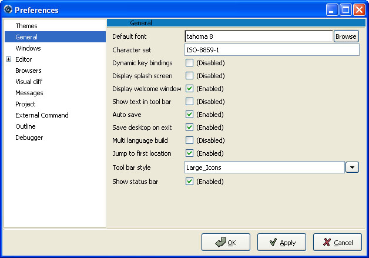
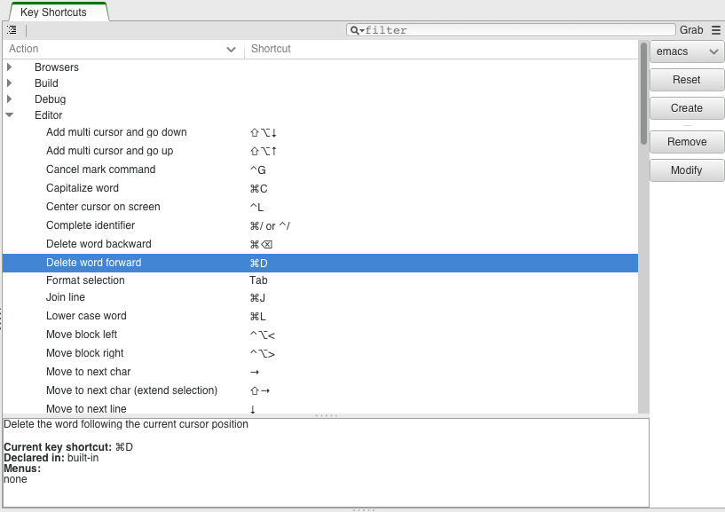

.. _Customizing_and_Extending_GPS:

*****************************
Customizing and Extending GPS
*****************************

.. index:: customization

GPS provides several levels of customization, from simple preferences dialog to
powerful scripting capability through the `python` language.  This chapters
describes each of these capabilities.

.. _The_Preferences_Dialog:

The Preferences Dialog
======================

.. _preferences_dialog:

.. index:: preferences

This dialog, available through the menu `Edit->Preferences`, allows you to
modify the global preferences of GPS.  To enable the new preferences, you
simply need to confirm by pressing the `OK` button. To test your changes, you
can use the `Apply` button. Pressing the `Cancel` button will undo all your
changes.

.. index:: screen shot

Each preference is composed of a label displaying the name of the preference,
and an editing area to modify its value. If you leave to mouse over the label,
a tool tip will be displayed giving an on-line help on the preference.

The preferences dialog is composed of several areas, accessible through the
tabs at the left of the dialog.  Each page corresponds to a set of preferences.

* **Themes**

  This page allows you to quickly change the current settings for GPS,
  including preferences, key bindings, menus...; See :ref:`GPS_Themes` for more
  information on themes. It is only displayed when there are themes registered.

* **General**

  *Default font*
    .. index:: font
    .. index:: background color

    The default font used in GPS. The background color you select for this
    preference will set the background color for all consoles and most views
    (the ones that display their data as trees, mostly). To change the
    background color of editors, see the preference Edit/Fonts&Colors/Default.

  *Fixed view font*
    .. index:: font

    The fixed (monospace) font used in views like the outline view, the
    bookmark view, ...; As much as possible, this font should use a fixed width
    for characters, for a better rendering

  *Character set*
    .. index:: character set
    .. index:: ISO-8859-1

    Name of character set to use when reading or writting text files.  GPS uses
    UTF-8 and Unicode internally, which can handle any character in any
    language. However, your system will generally not support Unicode natively,
    and thus the contents of the files should be translated from the file
    system encoding to unicode.

    This preference indicates the file system encoding in use. It defaults to
    ISO-8859-1, which corresponds to western european characters.

  *Display splash screen*
    .. index:: splash screen

    Whether a splash screen should be displayed when starting GPS.

  *Display welcome window*
    .. index:: welcome dialog

    Whether GPS should display the welcome window for the selection of the
    project to use.

  *Show text in tool bar*
    .. index:: tool bar

    Whether the tool bar should show both text and icons, or only icons.

  *Auto save*
    .. index:: auto save

    Whether unsaved files and projects should be saved automatically before
    calling external tools (e.g. before a build).

  *Save desktop on exit*
    .. index:: desktop

    Whether the desktop (size and positions of all windows) should be saved
    when exiting.  If you are working with a project created automatically by
    GPS, the desktop will not be saved.

  *Save editor in desktop*
    .. index:: desktop

    Determines when source editors should be saved in the desktop: `Never`,
    `Always`, or when a source file is associated with the current project
    (`From_Project`).

  *Default builder*
    The default builder to be used by GPS.

    * `Auto` to use *gnatmake* for Ada-only projects and *gprbuild* otherwise
      (for multi-language and non Ada projects).

    * `Gnatmake` to always use *gnatmake* for builds, even for projects that
      contain other sources. This will disable support for building non Ada
      projects.

    * `Gprbuild` to always use *gprbuild* for builds, even for Ada only
      projects.

  *Jump to first location*
    .. index:: location

    Whether the first entry of the location window should be selected
    automatically, and thus whether the corresponding editor should be
    immediately open.

  *Wrap around on next/previous*
    .. index:: location

    Whether using the `Next Tag` and `Previous Tag` actions/menus should wrap
    around to the beginning when reaching the end of the category.  The default
    is to wrap around, as was done in previous GPS versions.

  *Auto close Locations view*
    .. index:: location

    Whether the Locations view should be closed automatically when it becomes
    empty.

  *Hyper links*
    .. index:: hyper mode

    Whether to display hyper links in the editors when the Control key is
    pressed.  :ref:`Navigating_with_hyperlinks`.

  *Clipboard size*
    .. index:: clipboard

    This controls the size of the list where all the entries copied into the
    clipboard through `Edit->Copy` and `Edit->Cut` are saved. This list is
    navigated through the menu `Edit->Paste` and `Edit->Paste Previous`, as
    described earlier in this guide.

  *Tool bar style*
    .. index:: tool bar

    How the tool bar should be displayed: not at all, with small icons or with
    large icons

  *Show status bar*
    .. index:: status bar

    Whether the status bar at the bottom of the GPS window should be displayed.
    This status bar contains one or more progress bars while GPS is executing
    long actions like a build or a search. These progress bars can be used to
    monitor the progress of those actions.

    If you wish to save vertical screen space, you can hide this status bar.
    The progress bars will no longer be visible. Instead, you can display the
    Task Manager through the `Tools->Views->Tasks` menu, to get similar
    information.  This manager can then be put on the right or left side of the
    GPS window, for instance just below the Project View.

  *Remove policy when fixing code*
    .. index:: code fix

    Prefered way to fix code when parts have to be removed.  `Always_Remove`
    means that the code will be removed by GPS.  `Always_Comment` means that
    the code will always be commented out.  `Propose_Both_Choices` will propose
    a menu with both choices.

  *Tip of the Day*
    .. index:: tip of the day

    Whether GPS will display a *Tip of the Day* dialog at start up.

* **Windows**

  .. index:: MDI
  .. index:: Multiple Document Interface

  This section specifies preferences that apply to the *Multiple Document
  Interface* described in :ref:`Multiple_Document_Interface`.

  *Opaque*
    .. index:: opaque

    If True, items will be resized or moved opaquely when not maximized.

  *Destroy floats*
    .. index:: float

    If False, closing the window associated with a floating item will put the
    item back in the main GPS window, but will not destroy it. If True, the
    item is destroyed.

  *All floating*
    .. index:: float

    If True, then all the windows will be floating by default, i.e. be under
    the control of your system (Windows) or your window manager (Unix
    machines). This replaces the MDI.

  *Short titles for floats*
    .. index:: float

    If True, all floating windows will have a short title. In particular, base
    file names will be used for editors instead of full names.

  *Background color*
    .. index:: color

    Color to use for the background of the MDI.

  *Title bar color*
    .. index:: color

    Color to use for the title bar of unselected items.

  *Selected title bar color*
    .. index:: color

    Color to use for the title bar of selected items.

  *Show title bars*

    If Always, each window in GPS will have its own title bars, showing some
    particular information (like the name of the file edited for editors), and
    some buttons to iconify, maximize or close the window. This title bar is
    highlighted when the window is the one currently selected.

    If Never, the title bar is not displayed, to save space on the screen. The
    tabs of the notebooks will then be highlighted.

    If Central Only, then only the windows in the central area (ie the part that
    gets preserved when switching perspective, mostly editors) will have a title
    bar. All other windows will not show the title bar. This is often a good way
    to save space on the screen: the title bar is useful for editors since it
    gives the full name of the file as well as provide an easy handle for drag
    and drop operations, whereas the other views do not change position as much
    and it is better to save space on the screen by not displaying their title.

*Notebook tabs policy*

    Indicates when the notebook tabs should be displayed. If set to "Never", you
    will have to select the window in the Window menu, or through the keyboard.
    If set to "Automatic", then the tabs will be shown when two or more windows
    are stacked.

  *Notebook tabs position*

    Indicates where the notebook tabs should be displayed by default. It is
    possible to select the position of tabs individually for each notebook
    by right-clicking in any of their tabs and chosing a new position in the
    contextual menu. This position will be saved as part of the desktop and
    restored the next time you restart GPS. However, if you change the value
    of this preference, all notebooks will reset the position of their tabs
    to match the new value of the preference.

* **Editor**
  .. index:: editor

  *General*

    *Strip blanks*
      .. index:: strip blanks

      Whether the editor should remove trailing blanks when saving a file.

    *Line terminator*
      .. index:: line terminator

      Choose between *Unix*, *Windows* and *Unchanged* line terminators when
      saving files. Choosing *Unchanged* will use the original line terminator
      when saving the file; *Unix* will use LF line terminators; *Windows* will
      use CRLF line terminators.

    *Display line numbers*
      .. index:: display line numbers

      Whether the line numbers should be displayed in file editors.

    *Display subprogram names*
      .. index:: Display subprogram names

      Whether the subprogram name should be displayed in the editor's status
      bar.

    *Tooltips*
      .. index:: tooltip

      Whether tool tips should be displayed automatically.

    *Tooltips timeout*
      .. index:: tooltip timeout

      Time (in milliseconds) before displaying tooltips.

    *Highlight delimiters*
      .. index:: highlight delimiter

      Determine whether the delimiter matching the character following the
      cursor should be highlighted. The list of delimiters includes: `{}`

    *Autosave delay*
      .. index:: autosave delay

      .. _autosave_delay:

      The period (in seconds) after which an editor is automatically saved,
      0 if none.

      Each modified file is saved under a file called `.#filename#`, which is
      removed on the next explicit save operation.

    *Right margin*
      .. index:: right margin

      The right margin to highlight. 0 if none.
      This value is also used to implement the `Edit->Refill` command.

    *Block highlighting*
      .. index:: block highlighting

      Whether the editor should highlight the current block.
      The current block depends on the programming language, and will include
      e.g. procedures, loops, if statements, ...

    *Block folding*
      .. index:: block folding

      Whether the editor should provide the ability to fold/unfold blocks.

    *Speed Column Policy*
      .. index:: speed column policy

      When the Speed Column should be shown on the side of the editors:

      *Never*
        The Speed Column is never displayed.

      *Automatic*
        The Speed Column is shown whenever lines are highlighted in the editor,
        for example to show the current execution point, or lines containing
        compilation errors, ...; It disappears when no lines are highlighted.

      *Always*
        The Speed Column is always displayed.

    *Use Windows ACL*
      This is a Windows specific preference which is disabled by default. When
      enabled GPS will use the ACL to change the file's write permission. Note
      that ACL can't be used on network drives.

    *External editor*
      .. index:: external editor

      The default external editor to use.

    *Custom editor command*
      .. _custom_editor_command:

      Specify the command line for launching a custom editor.  It is assumed
      that the command will create a new window/terminal as needed.  If the
      editor itself does not provide this capability (such as vi or pico under
      Unix systems), you can use an external terminal command, e.g::

        xterm -geo 80x50 -exe vi +%l %f

      The following substitutions are provided:

      *%l*
        line to display

      *%c*
        column to display

      *%f*
        full pathname of file to edit

      *%e*
        extended lisp inline command

      *%p*
        top level project file name

      *%%*
        percent sign ('%')

    *Always use external editor*
      True if all editions should be done with the external editor. This will
      deactivate completely the internal editor. False if the external editor
      needs to be explicitly called by the user.

    *Smart completion*
      .. index:: smart completion

      When enabled, GPS loads on startup all the information needed for the
      Smart completion to work.

    *Smart completion timeout*
      The timeout, expressed in milliseconds, after which the Smart completion
      window appears automatically after entering a triggering character, such
      as '.'

  *Fonts & Colors*
    .. index:: font
    .. index:: color

    *Default*
      The default font, default foreground and default background colors used
      in the source editor.

    *Block*
      Font variant and colors used to highlight blocks (subprograms, task,
      entries, ...) in declarations.

    *Type*
      Font variant and colors used to highlight types in declarations.

    *Keywords*
      Font variant and colors used to highlight keywords.

    *Comments*
      Font variant and colors used to highlight comments.
      Setting the color to white will set a transparent color.

    *SPARK Annotations*
      Font variant and colors used to highlight SPARK annotations within
      Ada comments (Starting with `--#`). Setting the color to white
      will set a transparent color.

    *Strings*
      Font variant and colors used to highlight strings.
      Setting the color to white will set a transparent color.

    *Current line color*
      Color for highlighting the current line. Leave it to blank for no
      highlighting.  Setting the color to white will set a transparent color.

    *Draw current line as a thin line*
      Whether to use a thin line rather than full background highlighting on the
      current line.

    *Current block color*
      Color for highlighting the current source block.

    *Delimiter highlighting color*
      Color for highlighting delimiters.

    *Search results highlighting*
      Color for highlighting the search results in the text of source editors.

    *Cursor color*
      Color used for the cursor in editors and interactive consoles

    *Cursor aspect ratio*
      Defines the size of the cursor, relatively to characters. 100 means the
      cursor will occupy the same size as a character, 10 means it will only
      occupy 10% of the size occupies by a character.

  *Ada*
    .. index:: Ada

    *Auto indentation*
      .. index:: indentation

      How the editor should indent Ada sources.
      None means no indentation; Simple means that indentation from the previous
      line is used for the next line; Extended means that a language specific
      parser is used for indenting sources.

    *Use tabulations*
      .. index:: tabulation

      Whether the editor should use tabulations when indenting.  Note that this
      preference does not modify the :kbd:`Tab` key which will still insert Tab
      characters. Consider also the `/Edit/Insert Tab With Spaces` key shortcut
      which can be mapped (to e.g. :kbd:`Tab`) via
      :ref:`The_Key_Manager_Dialog`. Finally, another alternative is to
      reconfigure the default key binding for the automatic indentation action:
      by default, it is mapped to :kbd:`Ctrl-Tab` and can be changed to
      :kbd:`Tab` by modifying the `/Edit/Format Selection` action from
      :ref:`The_Key_Manager_Dialog`.

    *Default indentation*
      .. index:: indentation level

      The number of spaces for the default Ada indentation.

    *Continuation lines*
      .. index:: continuation line

      The number of extra spaces for continuation lines.

    *Declaration lines*
      .. index:: declaration line

      .. highlight:: ada

      The number of extra spaces for multiple line declarations.  For example,
      using a value of 4, here is how the following code would be indented::

        variable1,
            variable2,
            variable3 : Integer;

    *Conditional continuation lines*
      .. index:: conditional line

      The number of extra spaces used to indent multiple lines conditionals
      within parentheses.

      For example, when this preference is set to 1 (the default), continuation
      lines are indented based on the previous parenthesis plus one space::

        if (Condition1
            and then Condition2)
        then

      When this preference is set to 3, this gives::

        if (Condition1
              and then Condition2)
        then

    *Record indentation*
      .. index:: record indentation

      The number of extra spaces for record definitions, when the `record`
      keyword is on its own line.

      For example, when this preference is set to 3 (the default), the
      following sample will be indented as::

        type T is
           record
              F : Integer;
           end record;

      When this preference is set to 1, this gives::

        type T is
         record
            F : Integer;
         end record;

    *Case indentation*
      .. index:: case indentation

      Whether GPS should indent case statements with an extra level, as used in
      the Ada Reference Manual, e.g::

        case Value is
           when others =>
              null;
        end case;

      If this preference is set to `Non_Rm_Style`, this would be indented as::

        case Value is
        when others =>
           null;
        end case;

      By default (`Automatic`), GPS will choose to indent with an extra
      level or not based on the first `when` construct: if the first
      `when` is indented by an extra level, the whole case statement will
      be indented following the RM style.

    *Casing policy*
      The way the editor will handle the case settings below.  `Disabled` no
      auto-casing will be done; `End_Of_Line` auto-casing will be done when
      hitting :kbd:`Enter` key; `End_Of_Word` auto-casing will be done
      word-by-word while typing; `On_The_Fly` auto-casing will be done
      character-by-character while typing.  For the `End_Of_Line`,
      `End_Of_Word` and `On_The_Fly` policies it is always possible to force
      the casing of the current line by pressing the indentation key
      (:kbd:`Ctrl-Tab` by default).

      It is also possible to disable the casing for a single character (action
      `No Casing/indentation on Next Key`, default :kbd:`Ctrl-Q`) or
      temporarily (action `Toggle Auto Casing/indentation`, default
      :kbd:`Alt-Q`).

    *Reserved word casing*
      How the editor should handle reserved words casing.  `Unchanged` will
      keep the casing as-is; `Upper` will change the casing of all reserved
      words to upper case; `Lower` will change the casing to lower case;
      `Mixed` will change the casing to mixed case (all characters to lower
      case except first character and characters after an underscore which are
      set to upper case); `Smart_Mixed` As above but do not force upper case
      characters to lower case.

    *Identifier casing*
      How the editor should handle identifiers casing.
      The values are the same as for the *Reserved word casing* preference.

    *Format operators/delimiters*
      Whether the editor should add extra spaces around operators and
      delimiters if needed.  If enabled, an extra space will be added when
      needed in the following cases: before an opening parenthesis; after a
      closing parenthesis, comma, semicolon; around all Ada operators (e.g.
      `<=`, `:=`, `=>`, ...)

    *Align colons in declarations*
      Whether the editor should automatically align colons in declarations and
      parameter lists. Note that the alignment is computed by taking into
      account the current buffer up to the current line (or end of the current
      selection), so if declarations continue after the current line, you can
      select the declarations lines and hit the reformat key.

    *Align associations on arrows*
      Whether the editor should automatically align arrows in associations
      (e.g. aggregates or function calls). See also previous preference.

   *Align declarations after colon*
      Whether the editor should align continuation lines in variable
      declarations based on the colon character.

      Consider the following code::

        Variable : constant String :=
          "a string";

      If this preference is enabled, it will be indented as follows::

        Variable : constant String :=
                     "a string";

    *Indent comments*
      Whether to indent lines containing only comments and blanks, or to keep
      these lines unchanged.

    *Align comments on keywords*
      Whether to align comment lines following `record` and
      `is` keywords immediately with no extra space.

      When enabled, the following code will be indented as::

        package P is
        --  Comment

           [...]
        end P;

      When disabled, the indentation will be::

        package P is
           --  Comment

           [...]
        end P;

  *C & C++*
    .. index:: C
    .. index:: C++

    *Auto indentation*
      .. index:: indentation

      How the editor should indent C/C++ sources.  None means no indentation;
      Simple means that indentation from the previous line is used for the next
      line; Extended means that a language specific parser is used for
      indenting sources.

    *Use tabulations*
      .. index:: tabulation

      Whether the editor should use tabulations when indenting. If True, the
      editor will replace each occurrence of eight characters by a tabulation
      character.

    *Default indentation*
      .. index:: indentation

      The number of spaces for the default indentation.

    *Extra indentation*
      .. index:: indentation

      Whether to indent loops, if and switch statements an extra level.
      if this preference is enabled, the following layout will be chosen::

        if (condition)
          {
            int x;
          }

      If disabled, the same code will be indented as::

        if (condition)
        {
          int x;
        }

    *Indent comments*
      Whether to indent lines containing only comments and blanks, or to keep
      these lines unchanged.

* **Debugger**
  .. index:: debugger

  *Preserve State on Exit*
    .. index:: breakpoint

    If this preference is enabled, the debugger will automatically save
    breakpoints when it exists, and restore them the next time the same
    executable is debugged.  This is a convenient way to work on an executable,
    where the typical usage looks like compile, debug, compile, debug, ...

    When the preference is enabled, the debugger will also preserve the
    contents of the data window whenever it is closed. Reopening the window
    either during the same debugger session, or automatically when a new
    debugger is started on the same executable, will recreate the same boxes
    within the data window.

  *Debugger Windows*
    .. index:: debugger windows

    This preference controls what happens to debugger-related windows, like the
    call stack, the data window, the tasks view,..., when the debugger is
    terminated. There are three possible behavior:

    *Close Windows*
      In this case, all these windows are closed. This saves memory and space
      on the screen, but you will need to explicitly reopen them and put them
      in the right location on the desktop the next time you start a debugger
      session.

   *Keep Windows*
      In this case, the windows are cleared, but kept on the desktop. When you
      start a new debugger session, the windows will be automatically reused.
      This ensures that you won't have to reopen and reposition them, but takes
      space on your screen

   *Hide Windows*
      The windows are cleared, and hidden. When you start a new debugger
      session, they are automatically made visible again and reused. This also
      ensures you will not have to reopen and reposition them, but requires a
      bit of memory.  If you move some windows around while these windows are
      hidden, they might reappear in unexpected location the next time,
      although you then just have to move them.

  *Break on exceptions*
    .. index:: breakpoint
    .. index:: exception

    Specifies whether a breakpoint on all exceptions should be set by default
    when loading a program. This setup is only taken into account when a new
    debugger is initialized, and will not modify a running debugger (use the
    breakpoint editor for running debuggers).

  *Execution window*
    .. index:: execution
    .. index:: tty

    Specifies whether the debugger should create a separate execution
    window for the program being debugged.

    Note that this preference cannot be taken into account for the current
    debug session: you need to terminate the current debug session and restart
    a new one.

    If true, a separate console will be created. Under Unix systems, this
    console is another window in the bottom part of the main window; under
    Windows, this is a separate window created by the underlying gdb, since
    Windows does not have the notion of separate terminals (aka ttys).

    Note that in this mode under Windows, the `Debug->Interrupt` menu will only
    interrupt the debugged program with recent versions of gdb.  If you are
    using older versions of gdb, you need to hit :kbd:`Ctrl-C` in the separate
    execution window to interrupt it while it is running. Note also that this
    separate execution window uses the default system-wide console properties
    (the size of the window, the colors...). It is possible to change those
    properties using e.g. the default console menu (top-left of the console) on
    Windows XP.

    If false, no execution window will be created. The debugger assumes that
    the program being debugged does not require input, or that if it does,
    input is handled outside GPS. For example, when you attach to a running
    process, this process already has a separate associated terminal.

  *Show lines with code*
    Specifies whether the source editor should display blue dots for lines that
    contain code. If set to *False*, gray dots will be displayed instead on
    each line, allowing breakpoint on any line. Disabling this option provides
    a faster feedback, since GPS does not need to query the debugger about
    which lines contain code.

  *Detect aliases*
    .. index:: aliases

    If enabled, do not create new items when an item with the same address is
    already present on the canvas.

  *Assembly range size*
    .. index:: range size

    Number of assembly lines to display in the initial display of the assembly
    window. If the size is 0, then the whole subprogram is displayed, but this
    can take a very long time on slow machines.

  *Current assembly line*
    Color used to highlight the assembly code for the current line.

  *Color highlighting*
    .. index:: color

    Color used for highlighting in the debugger console.

  *Clickable item*
    Indicates color to be used for the items that are click-able (e.g pointers).

  *Changed data*
    Indicates color to be used to highlight fields in the data window that have
    changed since the last update.

  *Memory color*
    Color used by default in the memory view window.

  *Memory highlighting*
    Color used for highlighted items in the memory view.

  *Memory selection*
    Color used for selected items in the memory view.

  *Item name*
    Indicates the font to be used for the name of the item in the data window.

  *Item type*
    Indicates font to be used to display the type of the item in the data
    window.

  *Max item width*
    The maximum width an item can have.

  *Max item height*
    The maximum height an item can have.

* **External Commands**
  .. index:: helper
  .. index:: external commands

  *List processes*
    Command used to list processes running on the machine.

  *Remote shell*
    .. index:: remote shell

    Program used to run a process on a remote machine. You can specify
    arguments, e.g. `rsh -l user`

  *Remote copy*
    .. index:: remote copy

    Program used to copy a file from a remote machine. You can specify
    arguments, e.g. `rcp -l user`

  *Execute command*
    .. index:: execution

    Program used to execute commands externally.

  *HTML Browser*
    .. index:: html

    Only used under Unix, not relevant under Windows where the default HTML
    browser is used.  Program used to execute view HTML files, for instance the
    documentation.  Empty by default, which means that GPS will try to find a
    suitable HTML browser automatically. Only change the value if GPS cannot
    find a HTML browser, or if the browser found is not your preferred one.

  *Print command*
    .. index:: print
    .. index:: a2ps
    .. index:: PrintFile
    .. _Print_Command:

    External program used to print files.

    This program is required under Unix systems in order to print, and is set
    to `a2ps` by default.  If `a2ps` is not installed on your system, you can
    download it from `ftp://ftp.enst.fr/pub/unix/a2ps/
    <ftp://ftp.enst.fr/pub/unix/a2ps/>`_, although other printing programs such
    as `lp` can be specified instead.

    Under Windows systems, this program is optional and is empty by default,
    since a built-in printing is provided. An external tool will be used if
    specified, such as the PrintFile freeware utility available from
    `http://www.lerup.com/printfile/descr.html
    <http://www.lerup.com/printfile/descr.html>`_

* **Search**
  .. index:: search

  *Confirmation for "Replace all"*
    .. index:: replace

    Enable or disable the confirmation popup for the replace all action.

  *Close on Match*
    .. index:: search

    If this option is enabled, the search window will be closed when a match is
    found.

  *Select on Match*
    .. index:: search

    If this option is enabled, the focus will be given to the editor when a
    match is found.

  *Preserve Search Context*
    .. index:: search

    If this option is enabled, the contents of the "Look in:" field will be
    preserved between consecutive searches in files.

* **Browsers**
  .. index:: browsers

  *General*

    *Selected item color*
      .. index:: color

      Color to use to draw the selected item.

    *Background color*
      .. index:: color

      Color used to draw the background of the browsers.

    *Hyper link color*
      .. index:: color

      Color used to draw the hyper links in the items.

    *Selected link color*
      .. index:: color

      Color to use for links between selected items.

    *Default link color*
      .. index:: color

      Color used to draw the links between unselected items.

    *Ancestor items color*
      .. index:: color

      Color to use for the background of the items linked to the selected item.

    *Offspring items color*
      .. index:: color

      Color to use for the background of the items linked from the selected
      item.

    *Vertical layout*
      .. index:: vertical layout

      Whether the layout of the graph should be vertical (*True*) or
      horizontal (*False*). This setting applies to most browsers (call graph
      for instance), but does not apply to the entities browsers.

* **VCS**
  .. index:: vcs

  *Implicit status*
    .. index:: Implicit status

    Whether a status action can be launched as part of another action. For
    example to get the revision numbers of new files after an update
    command. If the network connection with the repository is slow
    disabling this command can speed-up the VCS actions.

  *ClearCase module*
    .. index:: ClearCase module

    Whether the built-in ClearCase (see :ref:`Version_Control_System`)
    module is activated or disabled.

  *Default VCS*
    .. index:: Default VCS

    The default VCS to use when the project does not define a VCS.

* **Visual diff**
  .. index:: visual diff
  .. index:: file comparison

  Note that in order to perform visual comparison between files, GPS needs to
  call external tool (not distributed with GPS) such as *diff* or *patch*.
  These tools are usually found on most unix systems, and may not be available
  by default on other OSes. Under Windows, you can download them from one of
  the unix toolsets available, such as msys (`http://www.mingw.org
  <http://www.mingw.org>`_) or cygwin (`http://www.cygwin.com
  <http://www.cygwin.com>`_).

  *mode*
    .. index:: diff

    How GPS displays visual diffs between two files:

    *Side_By_Side*
      Editors are displayed side-by-side; new editors are created as needed

    *Unified*
      No new editor is created, and changes are displayed directly in the
      reference editor.

  *Diff command*
    .. index:: -u
    .. index:: -c

    Command used to compute differences between two files.  Arguments can also
    be specified. The visual diff expects a standard diff output with no
    context (that is, no `-c` nor `-u` switch).  Arguments of interest may
    include (this will depend on the version of diff used):

    *-b*
      Ignore changes in amount of white space.

    *-B*
      Ignore changes that just insert or delete blank lines.

    *-i*
      Ignore changes in case; consider upper and lower case letters equivalent.

    *-w*
      Ignore white space when comparing lines.

  *Patch command*
    .. index:: patch

    Command used to apply a patch. Arguments can also be specified.
    This command is used internally by GPS to perform the visual comparison on
    versioned files (e.g. when performing a comparison with a version control
    system).

    This command should be compatible with the *GNU patch* utility.

  *Use old diff*
    .. index:: old diff

    Use the old version of the visual comparison.

  *Diff3 command*
    .. index:: diff3

    This item is only displayed if the preference *Use old diff* is disabled.
    Command used to query a 3-way diff. See *Diff command* for a description
    of the parameters.

  *Default color*
    This item is only displayed if the preference *Use old diff* is disabled.
    The color used to indicate lines on which there is a difference, in the
    "reference" editor.

  *Old color*
    This item is only displayed if the preference *Use old diff* is disabled.
    The color used to indicate spaces used by lines not present in one of the
    editors in a 3-way diff and present in the other editors.

  *Append color*
    This item is only displayed if the preference *Use old diff* is disabled.
    The color used to display the lines that are present in an editor but not
    in the reference editor.

  *Remove color*
    This item is only displayed if the preference *Use old diff* is disabled.
    The color used to display the lines that are present in the reference editor
    but not in other editors.

  *Change color*
    This item is only displayed if the preference *Use old diff* is disabled.
    The color used to display the lines that have changed between the reference
    editor and the other editors.

  *Fine change color*
    This item is only displayed if the preference *Use old diff* is disabled.
    The color used to highlight fine differences within a modified line.

  *Context length*
    .. index:: context length

    This item is only displayed if the preference *Use old diff* is enabled.
    The number of lines displayed before and after each chunk of differences.
    Specifying -1 will display the whole file.

* **Messages**
  .. index:: messages

  *Color highlighting*
    .. index:: color

    Color used to highlight text in the messages window.

  *Errors highlighting*
    .. index:: errors

    Color used to highlight lines causing compilation errors, in the
    source editors. When this color is set to white, the errors are
    not highlighted. (:ref:`Compilation/Build`)

  *Warnings highlighting*
    .. index:: errors

    Color used to highlight lines causing compilation warnings, in the
    source editors. When this color is set to white, the warnings are
    not highlighted.

  *Style errors highlighting*
    .. index:: style

    Color used to highlight lines containing style errors, in the
    source editors. When this color is set to white, the errors are
    not highlighted.

  *Compiler info highlighting*
    .. index:: style

    Color used to highlight lines containing compiler information, in the
    source editors. When this color is set to white, the information is
    not highlighted.

  *File pattern*
    .. index:: file pattern
    .. index:: location

    Pattern used to detect file locations and the type of the output from the
    messages window.  This is particularly useful when using an external tool
    such as a compiler or a search tool, so that GPS will highlight and allow
    navigation through source locations. This is a standard system V regular
    expression containing from two to five parenthesized subexpressions
    corresponding to the file, line, column, warnings or style error patterns.

  *File index*
    .. index:: file index

    Index of filename in the file pattern.

  *Line index*
    .. index:: line index

    Index of the line number in the file pattern.

  *Column index*
    .. index:: column index

    Index of the column number in the file pattern.

  *Warning index*
    .. index:: warning index

    Index of the warning identifier in the file pattern.

  *Style index*
    .. index:: column index

    Index of the style error identifier in the file pattern.

  *Info index*
    .. index:: column index

    Index of the compiler info identifier in the file pattern.

* **Project**

  *Relative project paths*
    .. index:: relative project path

    Whether paths should be absolute or relative when the projects are modified.

  *Fast Project Loading*
    .. index:: fast project loading

    If the project respects a number of restrictions, activating the preference
    will provide major speed up when GPS parses the project. This is especially
    noticeable if the source files are on a network drive.

    GPS assumes that the following restricitions are true when the preference
    is activated. If this isn't the case, no error is reported, and only minor
    drawacks will be visible in GPS (no detection that two files are the same
    if one of them is a symbolic link for instance, although GPS will still
    warn you if you are trying to overwrite a file modified on the disk).

    The restrictions are the following:

    *Symbolic links shouldn't be used in the project.*
      More precisely, you can only have symbolic links that point to files
      outside of the project, but not to another file in the project

    *Directories can't have source names.*
      No directory name should match the naming scheme defined in the
      project. For instance, if you are using the default GNAT naming scheme,
      you cannot have directories with names ending with ".ads" or ".adb"

  *Load Xref info on project load*
    .. index:: load xref info on project load

    Whether the Xref information should be automatically loaded into memory when
    a new project is loaded. :ref:`Support_for_Cross-References`.

  *Hidden directories pattern*
    .. index:: hidden directories pattern

    A regular expression used to match hidden directories. Such directories
    are not displayed by default in the project view, and are not taken into
    account for VCS operations working on directories.

* **Outline**

  .. _Outline_Preferences:

  *Font*
    You can choose a specific font for the outline view. Typically, this will
    be used to use a slightly smaller font than in the editor, so that you can
    see more entities at once on the screen.

  *Show Profiles*
    For some of the languages, in particular Ada, GPS can display the profile
    (list of parameters) for the subprograms. This can be used to differentiate
    between overloaded entities (ie entities with the same name). Disabling
    this preference will only show the entity name.

  *Sort alphabetically*
    If this preference is activated, the entities will be sorted alphabetically
    in the outline view. If disabled, they will be displayed in the order they
    are found in the source file.

  *Link with Editor*
    If this option is set, the current subprogram will be selected in the
    outline view every time the cursor position changes in the current editor.
    This option requires some computation for GPS, and you might want to avoid
    the slow down by disabling it.

  *Show file name*
    If this option is set, the outline view will show the name of the file on
    its first line, and indent slightly all following lines. If this option is
    unset, this will save some screen real estate, but you will have to look at
    the current editor to see what file is descrived in the Outline View.

* **Documentation**
  .. _Documention_Preferences:

  This section specifies preferences that apply to the
  *Documentation Generator*. :ref:`Documentation_Generation` for more
  information.

  *Process body files*
    If this preference is enabled, implementation files will be processed.
    Otherwise, only the specification files will.

  *Show private entities*
    By default, no documentation is generated for private entities.
    Enabling this preference will change this behavior.

  *Call graph*
    If enabled, the documentation tool will compute and take advantage of source
    references to e.g generate call graph information.
    Activating this option will slow down the documentation generation process.

  *Up-to-date files only*
    If enabled, only files having up-to-date cross references information will
    be documented.

  *Comments filter regexp*
    A regular expression used to filter to comments found in the source code
    before using them for generating documentation. For example "^!.*" will
    remove all comments starting with '!'.

  *Spawn a browser*
    If enabled, a browser is spawned after each documentation generation to view
    the generated files. This browser is not spawned if disabled.

  *Find xrefs in comments*
    If enabled, GPS will try to find references to entities in comments, and
    generate links to them when generating the documentation.

* **Coverage Analysis**
  .. _Coverage_Analysis_Preferences:

  *Coverage toolchain*
    Select which coverage toolchain (`gcov` or `xcov`) to use from
    the `Tools->Coverage` menu.

.. _GPS_Themes:

GPS Themes
==========

.. index:: themes

GPS provides an extensive support for themes. Themes are predefined set of
value for the preferences, for the key bindings, or any other configurable
aspect of GPS.

For instance, color themes are a convenient way to change all colors in GPS at
once, according to predefined choices (strongly contrasted colors,
monochrome,...). It is also possible to have key themes, defining a set of key
bindings to emulate e.g. other editors.

Any number of themes can be activated at the same time through the preferences
dialog (`Edit->Preferences`). This dialog contains a list of all themes that
GPS knows about, organized into categories for convenient handling. Just click
on the buttons on the left of each theme name to activate that theme.

Note that this will immediately change the current preferences settings. For
instance, if the theme you just selected changes the colors in the editor,
these are changed immediately in the `Editor->Fonts & Colors`. You can of
course still press `Cancel` to keep your previous settings

If multiple themes are active at the same time and try to override the same
preferences, the last theme which is loaded by GPS will override all previously
loaded themes. However, there is no predefined order in which the themes are
loaded.

.. _The_Key_Manager_Dialog:

The Key Manager Dialog
======================

The key manager is accessible through the menu `Edit->Key Shortcuts`.  This
dialog provides an easy way to associate key shortcuts with actions.  These
actions are either predefined in GPS, or defined in your own customization
files, as documented in :ref:`Customizing_through_XML_and_Python_files`.  It
also provides an easy way to redefine the menu shortcuts.

.. index:: screen shot

Actions are referenced by their name, and are grouped into categories. These
categories indicate when the action applies. For instance, the indentation
command only applies in source editors, whereas the command to change the
current window applies anywhere in GPS.  The categories can be explicitly
specified when you created your own actions through XML files
(:ref:`Defining_Actions`).

Through the key manager, you can define key bindings similar to what Emacs uses
(:kbd:`control-x` followed by :kbd:`control-k` for instance). To register such
key bindings, you need to press the `Grab` button as usual, and then type the
shortcut. The recording of the key binding will stop a short while after the
last key stroke.

If you define complex shortcuts for menus, they will not appear next to the
menu name when you select it with the mouse. This is expected, and is due to
technical limitations in the graphical toolkit that GPS uses.

When you assign a new shortcut to an action, the following happens:

* All actions and menus currently associated with the same key will no
  longer be executed when the key is pressed.
* All key shortcuts defined for this action are replaced by the new one.
  As a result, the action is only executable through this new shortcut.

.. _The_Plug-ins_Editor:

The Plug-ins Editor
===================

.. index:: plug-ins

GPS can be extensively customized through external plug-ins. You can write your
own plug-ins (:ref:`Customization_files_and_plugins`), but GPS also comes with
its own collection of plug-ins.

Some of them are loaded by default when GPS starts (for instance the support
for the CVS version management system or support for highlighting in various
programming languages); others are available for any user but not loaded
automatically by GPS, for instance an Emacs emulation mode.

Among the plug-ins that are provided with GPS, you will find:

* Emacs emulation
  .. index:: Emacs

  Several plug-ins emulate some of the functions provided by Emacs, such as the
  interactive search, manipulation of rectangles, navigation in the editor, and
  of course the usual Emacs key shortcuts

  This emacs mode used to be activated in the preferences dialog, on the Themes
  page, but you should now activate it by loading the :file:`emacs.xml`
  plug-in.

* Makefile support
  .. index:: Makefile

  A plug-in is provided that parses a Makefile and creates menus for each of
  its possible targets, so that you can easily start a make command.

* Cross-references enhancements

  Various plug-ins take advantage of GPS's cross-references information to
  create additional menus to navigate (for instance to jump to the primitive
  operations of Ada tagged types, to the body of Ada separate entities, ...)

* Text manipulation

  Several plug-ins provide support for advanced text manipulation in the
  editors, for instance to be able to align a set of lines based on various
  criteria, or to manipulate a rectangular selection of text.

You can choose graphically which plug-ins should or should not be loaded on
startup. To do so, select the menu `/Tools/Plug-ins`.  This brings up a new
window, containing two parts:

* On the left is the list of all known plug-ins.

  As described in :ref:`Customization_files_and_plugins`, GPS will search for
  candidates in various directories, and based on these directories decide
  whether to automatically load the plug-in or not.

  This list indicates the name of the plug-in, and whether it has been loaded
  in this GPS session (when the toggle button is checked).

* On the right are the details for the selected plug-in.

  This window is displayed as a notebook with two pages: on the first one you
  will see the exact location of the plug-in, the reason why it was loaded or
  not, and, more importantly, the source of the plug-in.  By convention, each
  plug-in starts with a general comment that indicates the purpose of this
  plug-in, and some more detailed documentation on its usage.

  For those interested, this also contains the plug-in itself, so that this can
  act as an example to create your own customization script.

  Technically, the list of plug-ins to load or not to load are stored in the
  file :file:`HOME/.gps/startup.xml`.

  If you have modified anything through this dialog (the list of plug-ins to
  load or unload), you will need to restart GPS. GPS cannot unload a module,
  since it can have too many possible effects on GPS (adding menus, overriding
  key shortcuts, ...).

  A dialog is displayed asking you whether you would like to exit GPS now. This
  will properly save all your files.

.. _Customizing_through_XML_and_Python_files:

Customizing through XML and Python files
========================================

.. index:: customization

.. _Customization_files_and_plugins:

Customization files and plugins
-------------------------------

You can customize lots of capabilities in GPS using files that are loaded by
GPS at start up.

For example, you can add items in the menu and tool bars, as well as defining
new key bindings, new languages, new tools, ...; Using Python as a programming
language, you can also add brand new facilities and integrate your own tools in
the GPS platform.

These customization files are searched for at startup in several different
places. Depending on the location where they are found, these files will either
be automatically loaded by GPS (and thus can immediately modify things in GPS),
or will simply be made visible in the Plug-ins Editor
(:ref:`The_Plug-ins_Editor`).

These directories are searched for in the order given below. Any script loaded
latter can override setups done by previously loaded scripts. For instance,
they could override a key shortcut, remove a menu, redefine a GPS action, ...

In the directory names below, :file:`INSTALL` is the name of the directory in
which you have installed GPS. :file:`HOME` is the user's home directory, either
by default or as overriden by the `GPS_HOME` environment variable. If none of
these exists, GPS will use the `USERPROFILE` environment variable.

In all these directories, only the files with :file:`.xml` or :file:`.py`
extensions are taken into account. Other files are ignored, although for
compatibility with future versions of GPS it is recommended not to keep other
files in the same directory.

* Automatically loaded system wide modules

  The :file:`INSTALL/share/gps/plug-ins` directory should contain the files
  that GPS will automatically load by default (unless overriden by the user
  through the Plug-ins Editor). These plug-ins are visible to any user on the
  system that uses the same GPS installation. This directory should be reserved
  for critical plug-ins that almost everyone should use.

* Not automatically loaded system wide modules

  The :file:`INSTALL/share/gps/library` directory should contain the files that
  GPS should show in the Plug-ins Editor, but not load automatically.
  Typically, these would be files that add optional capabilities to GPS, for
  instance an emacs emulation mode, or additional editor capabilities that a
  lot of users would not generally use.

* `GPS_CUSTOM_PATH`

  This environment variable can be set before launching GPS. It should contain
  a list of directories, separated by semicolons (';') on Windows systems and
  colons (':') on Unix systems. All the files in these directories with the
  appropriate extensions will be automatically loaded by default by GPS, unless
  overriden by the user through the Plug-ins Editor.

  This is a convenient way to have project-specific customization files. You
  can for instance create scripts, or icons, that set the appropriate value for
  the variable and then start GPS. Depending on your project, this allows you
  to load specific aliases which do not make sense for other projects.

* Automatically loaded user directory

  The directory :file:`HOME/.gps/plug-ins` is searched last. Any script found
  in there will be automatically loaded unless overriden in the Plug-ins
  Editor.

  This is a convenient way for users to create their own plug-ins, or test them
  before they are made available to the whole system by copying them to one of
  the other directories.

Any script loaded by GPS can contain customization for various aspects of GPS,
mixing aliases, new languages or menus, ... in a single file. This is a
convenient way to distribute your plug-ins to other users.

Python files
^^^^^^^^^^^^

Although the format of the python plug-ins is free (as long as it can be
executed by Python), the following organization is suggested. These plug-ins
will be visible in the Plug-ins Editor, and therefore having a common format
makes it easier for users to understand the goal of the plug-ins:

* Comment

  The first part of the script should be a general comment on the goal and
  usage of the script. This comment should use python's triple-quote
  convention, rather than start-of-line hash ('#') signs.

  The first line of the comment should be a one liner explaining the goal of
  the script. It is separated by a blank line from the rest of the comment.

  The rest of the comment is free-form.

* Customization variables

  If your script can be configured by the user by changing some global
  variables, they should be listed in their own section, and fully documented.
  The user can then, through the /Tools/Plug-ins editor change the value of
  these variables

* Implementation

  The implementation should be separated from the initial comment by a
  form-feed (control-L) character. The startup scripts editor will know not to
  display the rest of the script on the first page of the editor.

  Generally speaking, scripts should avoid executing code as soon as they are
  loaded. This gives a chance to the user to change the value of global
  variables or even override functions before the script is actually launched.

  The solution is to connect to the `"gps_started"` hook, as in::

      ^L
      ###########################################################
      ## No user customization below this line
      ###########################################################

      import GPS

      def on_gps_started (hook_name):
         ... launch the script

      GPS.Hook ("gps_started").add (on_gps_started)

XML files
^^^^^^^^^

.. highlight:: xml

XML files must be utf8-encoded by default. In addition, you can specify any
specific encoding through the standard `<?xml encoding="..." ?>` declaration,
as in the following example::

  <?xml version="1.0" encoding="iso-8859-1"?>
  <!--  general description -->
  <submenu>
    <title>encoded text</title>
  </submenu>

These files must be valid XML files, i.e. must start with the `<?xml?>` tag,
and contain a single root XML node, the name of which is left to your
consideration. The general format is therefore::

  <?xml version="1.0" ?>
  <root_node>
     ...
  </root_node>

It is also recommended that the first line after the `<?xml?>` tag contains a
general comment describing the purpose and usage of the script.  This comment
will be made visible in the Plug-ins editor.

The list of valid XML nodes that can be specified under <root> is described in
later sections. It includes:

*<action>*
  (:ref:`Defining_Actions`)

*<key>*
  (:ref:`Binding_actions_to_keys`)

*<submenu>*
  (:ref:`Adding_new_menus`)

*<pref>*
  (:ref:`Preferences_support_in_custom_files`)

*<preference>*
  (:ref:`Preferences_support_in_custom_files`)

*<alias>*
  (:ref:`Defining_text_aliases`)

*<language>*
  (:ref:`Adding_support_for_new_languages`)

*<button>*
  (:ref:`Adding_tool_bar_buttons`)

*<entry>*
  (:ref:`Adding_tool_bar_buttons`)

*<vsearch-pattern>*
  (:ref:`Defining_new_search_patterns`)

*<tool>*
  (:ref:`Adding_support_for_new_tools`)

*<filter>*
  (:ref:`Filtering_actions`)

*<contextual>*
  (:ref:`Adding_contextual_menus`)

*<case_exceptions>*
  (:ref:`Adding_casing_exceptions`)

*<documentation_file>*
  (:ref:`Adding_documentation`)

*<doc_path>*
  (:ref:`Adding_documentation`)

*<stock>*
  (:ref:`Adding_stock_icons`)

*<project_attribute>*
  (:ref:`Defining_project_attributes`)

*<remote_machine_descriptor>*
  (:ref:`Defining_a_remote_server`)

*<remote_path_config>*
  (:ref:`Defining_a_remote_path_translation`)

*<remote_connection_config>*
  (:ref:`Defining_a_remote_connection_tool`)

*<rsync_configuration>*
  (:ref:`Configuring_rsync_usage`)

.. _Defining_Actions:

Defining Actions
----------------

.. index:: action
.. index:: <action>
.. index:: <shell>
.. index:: <external>
.. index:: <filter>

This facility distinguishes the actions from their associated menus or key
bindings. Actions can take several forms: external commands, shell commands and
predefined commands, as will be explained in more details below.

The general form to define new actions is to use the `<action>` tag.  This tag
accepts the following attributes:

*name   (mandatory)*
  This tag must be specified. It provides the name by which the action is
  referenced in other parts of the customization files, for instance when it is
  associated with a menu or a toolbar button. The name can contain any
  character, although it is recommended to avoid XML special characters. It
  mustn't start with a '/'.

*output  (optional)*
  If specified, this attribute indicates where the output of the commands will
  be sent by default. This can be overridden by each command, using the same
  attribute for `<shell>` and `<external>` tags,
  :ref:`Redirecting_the_command_output`.

*show-command (optional, default true)*
  If specified, this attribute indicates whether the text of the command itself
  should be displayed at the same location as its output. Neither will be
  displayed if the output is hidden. The default is to show the command along
  with its output.  This attribute can be overridden for each command.

*show-task-manager (optional, default false)*
  This attribute indicates whether an entry should be created in the task
  manager to show this command. Associated with this entry is the progress
  bar indicator, so if you hide the entry, no progress will be shown. On the
  other hand, several progress bars might be displayed for your action if you
  show the progress bar here, which might be an issue depending on the
  context.
  This attribute can be overriden for each external command.

*category (optional, default "General")*
  The category in the keybindings editor (menu `Edit/Key bindings`) in which
  the action should be shown to the user. If you specify an empty string, the
  action is considered as an implementation detail, and not displayed in the
  editor. The user will thus not be able to assign it a keybinding through the
  graphical user interface (although this is still doable through XML commands).

If you are defining the same action multiple times, the last definition will be
kept. However, existing menus, buttons, ... that already reference that action
will keep their existing semantic. The new definition will only be used for all
new menus created from that point on.

The `<action>` can have one or several children, all of which define a
particular command to execute. All of these commands are executed one after the
other, unless one of them fails in which case the following commands are not
executed.

The following XML tags are valid children for `<action>`.

.. index:: external

*<external>*
  This defines a command to execute through the system (i.e. a standard Unix or
  Windows command)

  Note for Windows users: like under UNIX, scripts can be called from custom
  menu. In order to do that, you need to write your script in a :file:`.bat` or
  :file:`.cmd` file, and call this file as usual.  The `external` tag would
  e.g. look like::

    <?xml version="1.0" ?>
    <external_example>
      <action name="my_command">
        <external>c:\\.gps\\my_scripts\\my_cmd.cmd</external>
      </action>
    </external_example>

  This tag accepts the following attributes:

  *server (optional)*
    This attribute can be used to execute the external command on a remote
    server. The accepted values are `"gps_server"` (default), `"build_server"`,
    `"execution_server"`, `"debug_server"` and `"tools_server"`.
    :ref:`Remote_operations`, for explanation of what these servers are.

  *check-password (optional)*
    .. index:: password

    This attribute can be used to tell GPS to check and handle password prompts
    from the external command. The accepted values are `"false"` (default) and
    `"true"`.

  *show-command (optional)*
    This attribute can be used to override the homonym attribute specified for
    the `<action>` tag.

  *output (optional)*
    This attribute can be used to override the homonym attribute specified for
    the `<action>` tag.

  *progress-regexp (optional)*
    This attribute specifies a regular expression that the output of the
    command will be checked against. Every time the regular expression matches,
    it should provide two numeric values that are used to display the usual
    progress indicators at the bottom-right corner of the GPS window, as
    happens during regular compilations.

    The name of the action is printed in the progress bar while the action is
    executing::

      <?xml version="1.0" ?>
      <progress_action>
        <action name="progress" >
          <external
            progress-regexp="(\\d+) out of (\\d+).*$"
            progress-current="1"
            progress-final="2"
            progress-hide="true">gnatmake foo.adb
          </external>
        </action>
      </progress_action>

  *progress-current (optional, default is 1)*
    This is the opening parenthesis count index in `progress-regexp`
    that contains the current step.

  *progress-final   (optional, default is 2)*
    This is the opening parenthesis count index in `progress-regexp`
    that contains the current last step. This last index can grow as
    needed. For example, gnatmake will output the number of
    the file it is currently examining, and the total number of files to be
    examined. However, that last number may grow up, since parsing a new file
    might generate a list of additional files to parse later on.

  *progress-hide    (optional, default is true)*
    If this attribute is set to the value "true", then all the lines that
    match `progress-regexp` and are used to compute the progress will
    not be displayed in the output console. For any other value of this
    attribute, these lines are displayed along will the rest of the output.

  *show-task-manager (optional, default inherited from `<action>`)*
    This attribute indicates whether an entry should be created in the task
    manager to show this command. Associated with this entry is the progress
    bar indicator, so if you hide the entry, no progress will be shown. On the
    other hand, several progress bars might be displayed for your action if you
    show the progress bar here, which might be an issue depending on the
    context.

    If you have set a value for `progress-regexp`, this will automatically
    be set to true by default so that the progress bar is indeed displayed in
    the task manager. You can still override it explicitly for that
    `<external>` element to force hiding the progress bar.

  .. index:: on-failure

*<on-failure>*
  This tag specifies a group of command to be executed if the previous
  external command fails. Typically, this is used to parse the output of the
  command and fill the location window appropriately
  (:ref:`Processing_the_tool_output`).

  For instance, the following action spawns an external tool, and parses its
  output to the location window and the automatic fixing tool if the external
  tool happens to fail.

  In this group of commands the %... and $... macros can be used
  (:ref:`Macro_arguments`)::

    <?xml version="1.0" ?>
    <action_launch_to_location>
      <action name="launch tool to location" >
        <external>tool-path</external>
        <on-failure>
          <shell>Locations.parse "%1" category<shell>
          <external>echo the error message is "%2"</external>
        </on-failure>
        <external>echo the tool succeeded with message %1</external>
      </action>
    </action_launch_to_location>

  .. index:: shell
  .. index:: shell
  .. index:: interactive command

*<shell>*
  As well as external commands, you can use custom menu items to invoke GPS
  commands using the `shell` tag. These are command written in one of the
  shell scripts supported by GPS.

  This tag supports the same `show-command` and `output` attributes
  as the `<action>` tag.

  The following example shows how to
  create two actions to invoke the `help` interactive command and to open
  the file :file:`main.c`::

    <?xml version="1.0" ?>
    <help>
      <action name="help">
        <shell>help</shell>
      </action>
      <action name="edit">
        <shell>edit main.c</shell>
      </action>
    </help>

  By default, commands are expected to be written in the GPS shell language.
  However, you can specify the language through the `lang` attribute. Its
  default value is `"shell"`.

  The value of this attribute could also be "python".

  When programming with the GPS shell, you can execute multiple commands by
  separating them with semicolons. Therefore, the following example adds a menu
  which lists all the files used by the current file, in a project browser::

    <?xml version="1.0" ?>
    <current_file_uses>
      <action name="current file uses">
        <shell lang="shell">File %f</shell>
        <shell lang="shell">File.uses %1</shell>
      </action>
    </current_file_uses>

*<description>*
  .. index:: description

  This tag contains a description for the command, which is used in the
  graphical editor for the key manager. :ref:`The_Key_Manager_Dialog`.

*<filter>, <filter_and>, <filter_or>*
  .. index:: filter

  This is the context in which the action can be executed,
  :ref:`Filtering_actions`.

.. highlight:: xml

It is possible to mix both shell commands and external commands. For
instance, the following command opens an xterm (on Unix systems only)
in the current directory, which depends on the context::

  <?xml version="1.0" ?>
  <xterm_directory>
    <action "xterm in current directory">
      <shell lang="shell">cd %d</shell>
      <external>xterm</external>
    </action>
  </xterm_directory>

As seen in some of the examples above, some special strings are expanded by GPS
just prior to executing the command. These are the "%f", "%d",.. See below for
a full list.

More information on chaining commands is provided in :ref:`Chaining_commands`.

Some actions are also predefined in GPS itself. This include for instance
aliases expansion, manipulating MDI windows, ...; All known actions (predefined
and the ones you have defined in your own customization files) can be
discovered by opening the key shortcut editor (`Edit->Key shortcuts` menu).

.. _Macro_arguments:

Macro arguments
---------------

.. index:: menu
.. index:: argument
.. index:: substitution

When an action is defined, you can use macro arguments to pass to your shell or
external commands. Macro arguments are special parameters that are transformed
every time the command is executed.  The following macro arguments are
provided.

The equivalent python command is given for all tests. These commands are useful
when you are writing a full python script, and want to test for yourself
whether the context is properly defined.

.. highlight:: python

*%a*
  If the user clicked within the Locations Window, this is the name of the
  category to which the current line belongs

*%builder*
  Replaced by the default builder configured in GPS.
  This can be e.g. `gnatmake` if your project contains only Ada code,
  or `gprbuild` for non Ada or multi-language projects.
  Note: this macro is only available in the commands defined in the Build
  Manager and the Build Launcher dialogs.

*%c*
  This is the column number on which the user clicked.
  Python equivalent::

    GPS.current_context().column()

*%d*
  The current directory.
  Python equivalent::

    GPS.current_context().directory()

*%dk*
  The krunched name of the current directory.

*%e*
  Name of the entity the user clicked on.
  Python equivalent::

    GPS.current_context().entity().name()

*%E*
  The full path to the executable name corresponding to the target.

*%ek*
  Krunched name of the entity the user clicked on.
  This is the same as `%e`, except long names are shorted as in `%fk`.

*%eL*
  Replaced by either an empty string, or `-eL`, depending on whether the `Fast
  Project Loading` preference if set or not.  `-eL` is used by GNAT tools to
  specify whether symbolink links should be followed or not when parsing
  projects.  Note: this macro is only available in the commands defined in the
  Build Manager and the Build Launcher dialogs.

*%external*
  Replaced by the command line specified in the preference
  *External Commands->Execute command*.

*%f*
  Base name of the currently selected file.
  Python equivalent::

    import os.path
    os.path.basename (GPS.current_context().file().name())

*%F*
  Absolute name of the currently opened file.
  Python equivalent::

    GPS.current_context().file().name()

*%fk*
  Krunched base name of the currently selected file.  This is the same as %f,
  except that long names are shortened, and their middle letters are replaced
  by "[...]". This should be used in particular in menu labels, to keep the
  menus narrow.

*%fp*
  Base name of the currently selected file. If the file is not part of the
  project tree, or no file is selected, generate an error on the Messages
  window.  Note: this macro is only available in the commands defined in the
  Build Manager and the Build Launcher dialogs.

*%gnatmake*
  Replaced by the gnatmake executable configured in your project file.

*%gprbuild*
  Replaced by the gprbuild command line configured in your project file.

*%gprclean*
  Replaced by the default cleaner configured in GPS.  This can be e.g. `gnat
  clean`, or `gprclean`.  Note: this macro is only available in the commands
  defined in the Build Manager and the Build Launcher dialogs.

*%i*
  If the user clicked within the Project View, this is the name of the parent
  project, ie the one that is importing the one the user clicked on. Note that
  with this definition of parent project, a given project might have multiple
  parents. The one that is returned is read from the Project View itself.

*%l*
  This is the line number on which the user clicked.
  Python equivalent::

    GPS.current_context().line()

*%o*
  The object directory of the current project.

*%O*
  The object directory of the root project.

*%p*
  The current project. This is the name of the project, not the project file,
  ie the :file:`.gpr` extension is not included in this name, and the casing is
  the one found inside the project file, not the one of the file name itself.
  If the current context is an editor, this is the name of the project to which
  the source file belongs.  Python equivalent::

    GPS.current_context().project().name()

*%P*
  The root project. This is the name of the project, not the project file.
  Python equivalent::

    GPS.Project.root().name()

*%Pb*
  The basename of the root project file.

*%Pl*
  The name of the root project, all lower case.

*%pp*
  The current project file pathname. If a file is selected, this is the project
  file to which the source file belongs.
  Python equivalent::

    GPS.current_context().project().file().name()

*%PP*
  The root project pathname.
  Python equivalent::

    GPS.Project.root().file().name()

*%pps*
  This is similar to `%pp`, except it returns the project name prepended
  with `-P`, or an empty string if there is no project file selected and the
  current source file doesn't belong to any project. This is mostly for use with
  the GNAT command line tools. The project name is quoted if it contains spaces.
  Python equivalent::

    if GPS.current_context().project():
       return "-P" & GPS.current_context().project().file().name()

*%PPs*
  This is similar to `%PP`, except it returns the project name prepended
  with `-P`, or an empty string if the root project is the default project.
  This is mostly for use with the GNAT command line tools.

*%(p|P)[r](d|s)[f]*
  Substituted by the list of sources or directories of a given project. This
  list is a list of space-separated, quoted names (all names are surrounded by
  double quotes, for proper handling of spaces in directories or file names).

  *P*
    the root project.

  *p*
    the selected project, or the root project if there is no project selected.

  *r*
    recurse through the projects: sub projects will be listed as well as their
    sub projects, etc...

  *d*
    list the source directories.

    Python equivalent::

      GPS.current_context().project().source_dirs()

  *s*
    list the source files.

    Python equivalent::

      GPS.current_context().project().sources()

  *f*
    output the list into a file and substitute the parameter with the name of
    that file. This file is never deleted by GPS, it is your responsibility to
    do so.

*%s*
  This is the text selected by the user, if a single line was selected. When
  multiple lines were selected, this returns the empty string

*%S*
  This is either the text selected by the user, of the current entity if there
  is no selection. If the entity is part of an expression ("A.B.C"), then the
  whole expression is used instead of the entity name.

*%switches(tool)*
  Replaced by `IDE'Default_Switches (tool)`, in other words, if you
  have a tool whose switches are defined via an xml file in GPS, they
  are stored as `Default_Switches (xxx)` in the `IDE` package
  and can be retrieved using this macro. The value returned is a list of
  switches, or an empty list if not set.

  Note: This macro is only available in the commands defined in the Build
  Manager and Build Launcher dialogs.

*%T*
  Replaced by the subtarget being considered for building.  Depending on the
  context, this can correspond to e.g. the base filename of a Main source, or
  makefile targets.  Note: this macro is only available in the commands defined
  in the Build Manager and the Build Launcher dialogs.

*%TT*
  Same as `%TT`, but returns the full path to main sources rather than
  the base filename.

*%attr(Package'Name[,default])*
  Replaced by the project attribute `Package'Name`, in other words, the
  attribute `Name` from the package `Package`. `Package'` is
  optional if `Name` is a top level attribute (e.g. `Object_Dir`).

  If the attribute is not defined in the project, an optional `default`
  value is returned, or an empty string if not.

  Note: This macro is only available in the commands defined in the Build
  Manager and Build Launcher dialogs, and only supports single string
  attributes, not lists.

*%dirattr(Package'Name[,default])*
  Replaced by the directory part of an attribute. The attribute is specified
  as in `%attr` above.

*%baseattr(Package'Name[,default])*
  Replaced by the base name of an attribute. The attribute is specified
  as in `%attr` above.

*%vars*
  Replaced by a list of switches of the form `<variable>=<value>`, where
  <variable> is the name of a scenario variable and <value> its current value,
  as configured in the Scenario View. All the scenario variables defined in the
  current project tree will be listed.  Alternatively, you can also use
  `%vars(-D)` to generate a list of switches of the form
  `-D<variable>=<value>`.  Note: this macro is only available in the commands
  defined in the Build Manager and the Build Launcher dialogs.

*%X*
  Replaced by a list of switches of the form `-X<variable>=<value>`, where
  <variable> is the name of a scenario variable and <value> its current value,
  as configured in the Scenario View. All the scenario variables defined in the
  current project tree will be listed.  Note: this macro is only available in
  the commands defined in the Build Manager and the Build Launcher dialogs.

*%%*
  Replaced by the % sign.

.. index:: example

Examples:

*%Ps*
  Replaced by a list of source files in the root project.

*%prs*
  Replaced by a list of files in the current project, and all imported
  sub projects, recursively.

*%prdf*
  Replaced by the name of a file that contains a list of source
  directories in the current project, and all imported sub projects,
  recursively.

Another type of macros are expanded before commands are executed: These all
start with the `$` character, and represent parameters passed to the action by
its caller. Depending on the context, GPS will give zero, one or more arguments
to the action. This is in particular used when you define your own VCS system.
See also the shell function `execute_action`, which you can use yourself to
execute an action and pass it some arguments.

These arguments are the following

*$1, $2, ... $n*
  Where n is a number. These are each argument passed to the action

*$1-, $2-, ... $n-*
  This represents a string concatenating the specified argument and all
  arguments after it

*$**
  This represents a string concatenating all arguments passed to the action

*$repeat*
  This is the number of times the action has been repeated in a row. It will in
  general be 1 (ie this is the first execution of the action), unless the user
  has first executed the action `"Repeat Next"`, which allows automatic
  repetition of an action.

  .. highlight:: python

  By default, when the action "Repeat Next" is invoked by the user, it will
  repeat the following action as many times as the user specified. However, in
  some cases, either for efficiency reasons or simply for technical reasons,
  you might want to handle yourself the repeat. This can be done with the
  following action declaration::

    <action name="my_action">
       <shell lang="python">if $repeat==1: my_function($remaining + 1)</shell>
    </action>

    def my_function (count):
       """Perform an action count times"""
       ...

  Basically, the technique here is to only perform something the first time the
  action is called (hence the if statement), but pass your shell function the
  number of times that it should repeat (hence the `$remaining` parameter).

*$remaining*
  This is similar to $repeat, and indicates the number of times that the action
  remains to be executed. This will generally be 0, unless the user has chosen
  to automatically repeat the action a number of times.

.. _Filtering_actions:

Filtering actions
-----------------

.. index:: <filter>
.. index:: <filter_and>
.. index:: <filter_or>

By default, an action will execute in any context in GPS. The user just selects
the menu or key, and GPS tries to execute the action.

It is possible to restrict when an action should be considered as valid. If the
current context is incorrect for the action, GPS will not attempt to run
anything, and will display an error message for the user.

Actions can be restricted in several ways:

* Using macro arguments (:ref:`Macro_arguments`).
  If you are using one of the macro arguments defined in the previous section,
  anywhere in the chain of commands for that action, GPS will first check that
  the information is available, and if not will not start running any of the
  shell commands or external commands for that action.

  For instance, if you have specified `%F` as a parameter to one of the
  commands, GPS will check prior to running the action that there is a current
  file. This can be either a currently selected file editor, or for instance
  that the project view is selected, and a file node inside it is also
  selected.

  You do not have to specify anything else, this filtering is automatic

  Note however that the current context might contain more information than you
  expect. For instance, if you click on a file name in the Project View, then
  the current context contains a file (thus satisfies `%F`), but also contains
  a project (and thus satisfies `%p` and similar macros).

* Defining explicit filters
  Explicit restrictions can be specified in the customization files. These are
  specified through the `<filter>`, `<filter_and>` and `<filter_or>` tags, see
  below.

  These tags can be used to further restrict when the command is valid. For
  instance, you can use them to specify that the command only applies to Ada
  files, or only if a source editor is currently selected.

The filters tags
^^^^^^^^^^^^^^^^

Such filters can be defined in one of two places in the customization files:

* At the toplevel.
  At the same level as other tags such as `<action>`, `<menu>` or
  `<button>` tags, you can define named filters. These are general filters,
  that can be referenced elsewhere without requiring code duplication.

* As a child of the `<action>` tag.
  Such filters are anonymous, although they provide exactly the same capabilities
  as the ones above. These are mostly meant for simple filters, or filters that
  you use only once.

There are three different kinds of tags:

*<filter>*
  This defines a simple filter. This tag takes no child tag.

*<filter_and>*
  All the children of this tag are composed together to form a compound filter.
  They are evaluated in turn, and as soon as one of them fails, the whole filter
  fails. Children of this tag can be of type `<filter>`, `<filter_and>`
  and `<filter_or>`.

*<filter_or>*
  All the children of this tag are composed together to form a compound filter.
  They are evaluated in turn, and as soon as one of them succeeds, the whole
  filter succeeds. Children of this tag can be of type `<filter>`,
  `<filter_and>` and `<filter_or>`.

If several such tags are found following one another under an `<action>`
tag, they are combined through "or", i.e. any of the filters may match for the
action to be executed.

The `<filter>`, `<filter_and>` and `<filter_or>` tags accept the
following set of common attributes:

*name       (optional)*
  This attribute is used to create named filters, that can be reused elsewhere
  in actions or compound filters through the `id` attribute. The name can
  take any form.

*error      (optional)*
  This is the error message printed in the GPS console if the filter doesn't
  match, and thus the action cannot be executed. If you are composing filters
  through `<filter_and>` and `<filter_or>`, only the error message of
  the top-level filter will be printed.

In addition, the `<filter>` has the following specific attributes:

*id         (optional)*

  .. highlight:: xml

  If this attribute is specified, all other attributes are ignored. This is used
  to reference a named filter previously defined. Here is for instance how you
  can make an action depend on a named filter::

    <?xml version="1.0" ?>
    <test_filter>
      <filter name="Test filter" language="ada" />
      <action name="Test action" >
         <filter id="Test filter" />
         <shell>pwd</shell>
      </action>
    </test_filter>

  A number of filters are predefined by GPS itself.

  *Source editor*
    This filter will only match if the currently selected window in GPS is an
    editor.

  *Explorer_Project_Node*
    Matches when clicking on a project node in the Project View

  *Explorer_Directory_Node*
    Matches when clicking on a directory node in the Project View

  *Explorer_File_Node*
    Matches when clicking on a file node in the Project View

  *Explorer_Entity_Node*
    Matches when clicking on an entity node in the Project View

  *File*
    Matches when the current context contains a file (for instance the focus is
    on a source editor, or the focus is on the Project view and the currently
    selected line contains file information).

*language   (optional)*
  This attribute specifies the name of the language that must be associated
  with the current file to match. For instance, if you specify `ada`,
  you must have an Ada file selected, or the action won't execute. The language
  for a file is found by GPS following several algorithms (file extensions, and
  via the naming scheme defined in the project files).

*shell_cmd  (optional)*
  This attribute specifies a shell command to execute. The output value of this
  command is used to find whether the filter matches: if it returns "1" or
  "true", the filter matches. In any other case, the filter fails.

  Macro arguments (%f, %p, ...) are fully supported in the text of the
  command to execute.

*shell_lang (optional)*
  This attribute specifies in which language the shell command above is written.
  Its default value indicates that the command is written using the GPS shell.

*module     (optional)*
  This attribute specifies that the filter only matches if the current window
  was setup by this specific GPS module. For instance, if you specify
  "Source_Editor", this filter will only match when the active window is a
  source editor.

  The list of module names can be obtained by typing `lsmod` in the shell
  console at the bottom of the GPS window.

  This attribute is mostly useful when creating new contextual menus.

.. highlight:: xml

When several attributes are specified for a `<filter>` node (which is not
possible with `id`), they must all match for the action to be executed::

  <?xml version="1.0" ?>
  <!-- The following filter will only match if the currently selected
       window is a text editor editing an Ada source file -->
  <ada_editor>
    <filter_and name="Source editor in Ada" >
      <filter language="ada" />
      <filter id="Source editor" />
    </filter_and>

    <!-- The following action will only be executed for such an editor -->

    <action name="Test Ada action" >
       <filter id="Source editor in Ada" />
       <shell>pwd</shell>
    </action>

    <!--  An action with an anonymous filter. It will be executed if the
          selected file is in Ada, even if the file was selected through
          the project view  -->

    <action name="Test for Ada files" >
        <filter language="ada" />
        <shell>pwd</shell>
    </action>
  </ada_editor>

.. _Adding_new_menus:

Adding new menus
----------------

.. index:: menus
.. index:: <menu>
.. index:: <submenu>
.. index:: <title>

These commands can be associated with menus, tool bar buttons and keys. All
of these use similar syntax.

Binding a menu to an action is done through the `<menu>` and
`<submenu>` tags.

The `<menu>` tag takes the following attributes:

*action  (mandatory)*
  This attribute specifies which action to execute
  when the menu is selected by the user. If no action by this name was defined,
  no new menu is added. The action name can start with a '/', in which case
  it represents the absolute path to a menu to execute instead.

  This attribute can be omitted only when no title is specified for the menu
  to make it a separator (see below).

  If a filter is associated with the action through the `<filter>` tag,
  then the menu will be greyed out when the filter doesn't match. As a
  result, users will not be able to click on it.

*before  (optional)*
  It specifies the name of another menu item before
  which the new menu should be inserted. The reference menu must have been
  created before, otherwise the new menu is inserted at the end. This attribute
  can be used to control where precisely the new menu should be made visible.

*after   (optional)*
  This attribute is similar to `before`, but has a lower priority. If it
  is specified, and there is no `before` attribute, it specifies a reference
  menu after which the new menu should be inserted.

It should also have one XML child called `<title>` which specifies the
label of the menu. This is really a path to a menu, and thus you can define
submenus by specifying something like "/Parent1/Parent2/Menu" in the title
to automatically create the parent menus if they don't exist yet.

You can define the accelerator keys for your menus, using underscores
in the titles. Thus, if you want an accelerator on the first letter in
a menu named `File`, set its title as `_File`.

The tag `<submenu>` accepts the following attributes:

*before  (optional)*
  See description above, same as for `<menu>`

*after   (optional)*
  See description above, same as for `<menu>`

It accepts several children, among `<title>` (which must be specified
at most once), `<submenu>` (for nested menus), and `<menu>`.

Since `<submenu>` doesn't accept the `action` attribute, you should
use `<menu>` for clickable items that should result in an action, and
`<submenu>` if you want to define several menus with the same path.

You can specify which menu the new item is added to in one of two ways:

* Specify a path in the `title` attribute of `<menu>`
* Put the `<menu>` as a child of a `<submenu>` node
  This requires slightly more typing, but it allows you to specify the exact
  location, at each level, of the parent menu (before or after an existing
  menu).

For example, this adds an item named `mymenu` to the standard
`Edit` menu::

  <?xml version="1.0" ?>
  <test>
    <submenu>
      <title>Edit</title>
      <menu action="current file uses">
         <title>mymenu</title>
      </menu>
    </submenu>
  </test>

The following has exactly the same effect::

  <?xml version="1.0" ?>
  <test>
    <menu action="current file uses">
      <title>Edit/mymenu</title>
    </menu>
  </test>

The following adds a new item "stats" to the "unit testing" submenu
in "my_tools"::

  <?xml version="1.0" ?>
  <test>
    <menu action="execute my stats">
       <title>/My_Tools/unit testing/stats</title>
    </menu>
  </test>

The previous syntax is shorter, but less flexible than the following,
where we also force the My_Tools menu, if it doesn't exist yet, to
appear after the File menu. This is not doable by using only `<menu>`
tags. We also insert several items in that new menu::

  <?xml version="1.0" ?>
  <test>
    <submenu after="File">
      <title>My_Tools</title>
      <menu action="execute my stats">
         <title>unit testing/stats</title>
      </menu>
      <menu action="execute my stats2">
         <title>unit testing/stats2</title>
      </menu>
    </submenu>
  </test>

.. index:: menu separator

Adding an item with an empty title or no title at all inserts a
menu separator. For instance, the following example will insert a separator
followed by a File/Custom menu::

  <?xml version="1.0" ?>
  <menus>
    <action name="execute my stats" />
    <submenu>
       <title>File</title>
       <menu><title/></menu>
       <menu action="execute my stats">
           <title>Custom</title>
       </menu>
    </submenu>
  </menus>

.. _Adding_contextual_menus:

Adding contextual menus
-----------------------

.. index:: <contextual>

The actions can also be used to contribute new entries in the contextual menus
everywhere in GPS. These menus are displayed when the user presses the right
mouse button, and should only show actions relevant to the current context.

Such contributions are done through the `<contextual>` tag, which takes the
following attributes:

*"action"  (mandatory)*
  Name of the action to execute, and must be defined elsewhere in one of the
  customization files.

  If this attribute is set to an empty string, a separator will be inserted
  in the contextual menu instead. If you specify a reference item with one of
  the "before" or "after" attribute, the separator will be visible only when
  the reference item is visible.

*"before" (optional, default="")*
  If it is specified, this attribute should be the name of another contextual,
  before which the new menu should appear. The name of predefined contextual
  menus can be found by looking at the output of "Contextual.list" in the shell
  console. The name of the contextual menus you define yourself is the value of
  the `<title>` child.

  There is no guarantee that the new menu will appear just before the referenced
  menu. In particular, it won't be the case if the new menu is created before
  the reference menu was created, or if another later contextual menu indicates
  that it must be displayed before the same reference item.

*"after" (optional, default="")*
  Same as "before", except it indicates the new menu should appear after the
  reference item.

  If both "after" and "before" are specified, only the latter is taken into
  account.

It accepts one child tag, `<Title>` which specifies the name of the
menu entry. If this child is not specified, the menu entry will use the name
of the action itself. The title is in fact the full path to the new menu entry.
Therefore, you can create submenus by using a title of the form
"Parent1/Parent2/Menu".

Special characters can be used in the title, and will be automatically
expended based on the current context. These are exactly the ones described
in the section for macros arguments, :ref:`Macro_arguments`.

The new contextual menu will only be shown if the filters associated with the
action match the current context.

For instance, the following example inserts a new contextual menu which prints
the name of the current file in the GPS console. This contextual menu is only
displayed in source editors. This contextual menu entry is followed by a
separator line, visible when the menu is visible::

  <?xml version="1.0" ?>
  <print>
    <action name="print current file name" >
      <filter module="Source_Editor" />
      <shell>echo %f</shell>
    </action>

    <contextual action="print current file name" >
      <Title>Print Current File Name</Title>
    </contextual>
    <contextual action="" after="Print Current File Name" />
  </print>

.. _Adding_tool_bar_buttons:

Adding tool bar buttons
-----------------------

.. index:: tool bar
.. index:: <button>
.. index:: <entry>

As an alternative to creating new menu items, you can create new buttons on the
tool bar, with a similar syntax, by using the `<button>` tag. As for the
`<menu>` tag, it requires an `action` attribute which specifies what should be
done when the button is pressed. The button is not created if no such action
was created.

.. index:: jpeg
.. index:: png
.. index:: gif
.. index:: xpm

Within this tag, the tag `<pixmap>` can be used to indicate the location of an
image file (of the type `jpeg, png, gif` or `xpm`) to be used as icon for the
button. An empty `<button>` tag indicates a separator in the tool bar.

A title can also be specified with `<title>`. This will be visible only if the
user choses to see both text and icons (or text only) in the tool bar.  This
title also acts as a tooltip (popup help message) when the button is displayed
as an icon only.

The following example defines a new button::

  <?xml version="1.0" ?>
  <stats>
    <button action="execute my stats">
      <title>stats</title>
      <pixmap>/my_pixmaps/button.jpg</pixmap>
    </button>
  </stats>

The `<button>` tag allows you to create a simple button that the user can press
to start an action. GPS also supports another type of button, a combo box, from
which the user can choose among a list of choices. Such a combo box can be
created with the `<entry>` tag.

This tag accepts the following arguments:

*id (mandatory)*
  This should be a unique id for this combo box, and will be used later on
  to refer it, in particular from the scripting languages. It can be any
  string

*label (default is "")*
  The text of a label to display on the left of the combo box. If this isn't
  specified, no text will be displayed

*on-changed (default is "")*
  The name of a GPS action to execute whenever the user selects a new value
  in the combo box. This action is called with two parameters, the unique id
  of the combo box and the newly selected text respectively.

It also accepts any number of `<choice>` tags, each of which defines
one of the values the user can choose from. These tags accepts one optional
attribute, "on-selected", which is the name of a GPS action to call when
that particular value is selected::

     <action name="animal_changed">
        <shell>echo A new animal was selected in combo $1: animal is $2</shell>
     </action>
     <action name="gnu-selected">
        <shell>echo Congratulations on choosing a Gnu</shell>
     </action>
     <entry id="foo" label="Animal" on-changed="animal_changed">
        <choice>Elephant</choice>
        <choice on-selected="gnu-selected">Gnu</choice>
     </entry>

A more convenient interface exists for Python, the GPS.Toolbar class, which
gives you the same flexibility as above, but also gives you dynamic control
over the entry, and allows placement of buttons at arbitrary positions in
the toolbar. See the python documentation.

.. _Binding_actions_to_keys:

Binding actions to keys
-----------------------

.. index:: key
.. index:: <key>

All the actions defined above can be bound to specific key shortcuts through
the `<key>` attribute. As usual, it requires one `<action>` attribute to
specify what to do when the key is pressed. The name of the action can start
with a '/' to indicate that a menu should be executed instead of a user-defined
action.

If the action is the empty string, then instead the key will no longer be bound
to any action.

This tag doesn't contain any child tag. Instead, its text contents specified
the keyboard shortcut. The name of the key can be prefixed by `control-`,
`alt-`, `shift-` or any combination of these to specify the key modifiers to
apply.

You can also define multiple key bindings similar to Emacs's by separating them
by a space. For instance, `control-x control-k` means that the user should
press :kbd:`control-x`, followed by a :kbd:`control-k` to activate the
corresponding action. This is only possible if the prefix key is not already
bound to an action. If it is, you should first unbound it by passing an empty
action to `<key>`.

Use an empty string to describe the key binding if you wish to deactivate a
preexisting binding. The second example below deactivates the standard
binding::

  <?xml version="1.0" ?>
  <keys>
    <key action="expand alias">control-o</key>
    <key action="Jump to matching delimiter" />

    <!--  Bind a key to a menu -->
    <key action="/Window/Close">control-x control-w</key>
  </key>

Multiple actions can be bound to the same key binding. They will all be
executed in turn, followed by any menu for which this key is an accelerator.

When GPS processes a `<key>` tag, it does the following:

* Removes all actions bound to that key.
  This ensures that if you press the key, any action associated with it by
  default in GPS or in some other XML file will no longer be executed, and
  only the last one will be executed.
* Adds the new key to the list of shortcuts that can execute the
  action. Any existing shortcut on the action is preserved, and
  therefore there are multiple possible shortcuts for this action.

.. _Preferences_support_in_custom_files:

Preferences support in custom files
-----------------------------------

Creating new preferences
^^^^^^^^^^^^^^^^^^^^^^^^

.. index:: <preference>

GPS has a number of predefined preferences to configure its behavior and its
appearance. They are all customizable through the Edit->Preferences menu.

However, you might wish to add your own kind of preferences for your extension
modules. This can easily be done through the usual GPS customization files.
Preferences are different from project attributes
(:ref:`Defining_project_attributes`), in that the latter will vary depending on
which project is loaded by the user, whereas preferences are always set to the
same value no matter what project is loaded.

Such preferences are created with the `<preference>` tag, which takes a number
of attributes.

*name (mandatory)*
  This is the name of the preference, used when the preference is saved by
  GPS in the :file:`$HOME/.gps/preferences` file, and to query the value of
  a preference interactively through the `GPS.Preference` class in the
  GPS shell or python. There are a few limitation to the form of these names:
  they cannot contain space or underscore characters. You should replace the
  latter with minus signs for instance.

*page (optional, default is "General")*
  The name of the page in the preferences editor where the preference can
  be edited. If this is the name of a non-existing page, GPS will automatically
  create it. If this is the empty string (""), the preference will not be
  editable interactively. This could be used to save a value from one session
  of GPS to the next, without allowing the user to alter it.

  Subpages are references by separating pages name with colons (':').

*default (optional, default depends on the type of the preference)*
  The default value of the preference, when not set by the user. This is 0 for
  integer preferences, the empty string for string preferences, True for boolean
  values, and the first possible choice for choice preferences.

*tip (optional, default is "")*
  This is the text of the tooltip that appears in the preferences editor
  dialog.

*label (mandatory)*
  This is the name of the preference as it appears in the preferences editor
  dialog

*type (mandatory)*
  This is the type of the preference, and should be one of:

  *"boolean"*
    The preference can be True or False.

  *"integer"*
    The preference is an integer. Two optional attributes can be specified for
    `<preference>`, "minimum" and "maximum", which define the range of
    valid values for that integer. Default values are 0 and 10 respectively.

  *"string"*
    The preference is a string, which might contain any value

  *"color"*
    The preference is a color name, in the format of a named color such as
    "yellow", or a string similar to "#RRGGBB", where RR is the red component,
    GG is the green component, and BB is the blue component

  *"font"*
    The preference is a font

  *"choices"*
    The preference is a string, whose value is chosen among a static list of
    possible values. Each possible value is defined in a `<choice>` child
    of the `<preference>` node.

Here is an example that defines a few new preferences::

  <?xml version="1.0"?>
  <custom>
     <preference name="my-int"
                 page="Editor"
                 label="My Integer"
                 default="30"
                 minimum="20"
                 maximum="35"
                 page="Manu"
                 type="integer" />

     <preference name="my-enum"
                 page="Editor:Fonts &amp; Colors"
                 label="My Enum"
                 default="1"
                 type="choices" >
       <choice>Choice1</choice>
       <choice>Choice2</choice>  <!--  The default choice -->
       <choice>Choice3</choice>
     </preference>
  </custom>

.. highlight:: python

The values of the above preferences can be queries in the scripting languages:

* GPS shell::

    Preference "my-enum"
    Preference.get %1

* Python::

    val = GPS.Preference ("my-enum").get ()
    val2 = GPS.Preference ("my-int").get ()

Setting preferences values
^^^^^^^^^^^^^^^^^^^^^^^^^^

.. index:: <pref>

You can force specific default values for the preferences in the customization
files through the `<pref>` tag. This is the same tag that is used by
GPS itself when it saves the preferences edited through the preferences
dialog.

This tag requires on attribute:

*name*
  This is the name of the preference of which you are setting a default value.
  Such names are predefined when the preference is registered in GPS, and can
  be found by looking at the :file:`$HOME/.gps/preferences` file for each user,
  or by looking at one of the predefined GPS themes.

It accepts no child tag, but the value of the `<pref>` tag defines the default
value of the preference, which will be used unless the user has overridden it
in his own preferences file.

Any setting that you have defined in the customization files will be overridden
by the user's preferences file itself, unless the user was still using the
default value of that preference.

This `<pref>` tag is mostly intended for use through the themes
(:ref:`Creating_themes`).

.. _Creating_themes:

Creating themes
---------------

.. index:: themes creation
.. index:: <theme>

You can create your own themes and share them between users. You can then
selectively chose which themes they want to activate through the preferences
dialog (:ref:`GPS_Themes`).

Creating new themes is done in the customization files through
the `<theme>` tag.

This tag accepts a number of attributes:

*name (mandatory)*
  This is the name of the theme, as it will appear in the preferences dialog

*description (optional)*
  This text should explain what the text does. It appears in the preferences
  dialog when the user selects that theme.

*category (optional, default is General)*
  This is the name of the category in which the theme should be presented in
  the preferences dialog. Categories are currently only used to organize themes
  graphically. New categories are created automatically if you chose one that
  doesn't exist yet.

This tag accepts any other customization tag that can be put in the
customization files. This includes setting preferences (`<pref>`,
defining key bindings (`<key`), defining menus (`<menu>`), ...

If the same theme is defined in multiple locations (multiple times in the
same customization file or in different files), their effects will be
cumulated. The first definition of the theme seen by GPS will set the
description and category for this theme.

.. highlight:: xml

All the children tags of the theme will be executed when the theme is activated
through the preferences dialog. Although there is no strict ordering in which
order the children will be executed, the global order is the same as for the
customization files themselves: first the predefined themes of GPS, then the
ones defined in customization files found through the `GPS_CUSTOM_PATH`
directories, and finally the ones defined in files found in the user's
own GPS directory::

  <?xml version="1.0" ?>
  <my-plug-in>
     <theme name="my theme" description="Create a new menu">
         <menu action="my action"><title>/Edit/My Theme Menu</title></menu>
     </theme>
  </my-plug-in>

.. _Defining_new_search_patterns:

Defining new search patterns
----------------------------

.. index:: <vsearch-pattern>
.. index:: predefined patterns

The search dialog contains a number of predefined search patterns for Ada, C
and C++. These are generally complex regular expressions, presented in the
dialog with a more descriptive name. This includes for instance
"Ada assignment", which will match all such assignments.

You can define your own search patterns in the customization files. This is
done through the `<vsearch-pattern>` tag. This tag can have a number of
children tags:

*<name>*
  This tag is the string that is displayed in the search dialog to
  represent the new pattern. This is the text that the user will
  effectively see, instead of the often hard to understand regular
  expression.

*<regexp>*
  This tag provides the regular expression to use when the pattern has
  been selected by the user. Be careful that you must protect reserved
  XML characters such as '<' and replace them by their equivalent
  expansion ("&lt;" for this character).

  This accepts one optional attribute, named `case-sensitive`. This
  attribute accepts one of two possible values ("true" or "false") which
  indicates whether the search should distinguish lower case and upper
  case letters. Its default value is "false".

*<string>*
  This tag provides a constant string that should be searched.
  Only one of `<regexp>` and `<string>` should be provided. If
  both exists, the first `<regexp>` child found is used. If there is
  none, the first `<string>` child is used.

  The tag accepts the same optional attribute `case-sensitive` as
  above

.. highlight:: xml

Here is a small example on how the "Ada assignment" pattern was
defined::

  <?xml version="1.0" ?>
  <search>
    <vsearch-pattern>
      <name>Ada: assignment</name>
      <regexp case-sensitive="false">\\b(\\w+)\\s*:=</regexp>
    </vsearch-pattern>
  </search>

.. _Adding_support_for_new_languages:

Adding support for new languages
--------------------------------

.. index:: <Language>

You can define new languages in a custom file by using the `Language`
tag. Defining languages gives GPS the ability to highlight the syntax of a
file, explore a file (using e.g. the project view), find files
associated with a given language, ...

As described previously for menu items, any file in the :file:`plug-ins`
directory will be loaded by GPS at start up. Therefore, you can either
define new languages in a separate file, or reuse a file where you already
define actions and menus.

The following tags are available in a `Language` section:

*Name*
  A short string describing the name of the language.

*Parent*
  If set to the name of an existing language (e.g. `Ada`, `C++`) or
  another custom language, this language will inherit by default all its
  properties from this language. Any field explicitly defined for this language
  will override the inherited settings.

*Spec_Suffix*
  A string describing the suffix of spec/definition files for this language.
  If the language does not have the notion of spec or definition file, you
  can ignore this value, and consider using the `Extension` tag instead.
  This tag must be unique.

*Body_Suffix*
  A string describing the suffix of body/implementation files for this language.
  This tag works in coordination with the `Spec_Suffix`, so that the user
  can choose to easily go from one file to the other.
  This tag must be unique.

*Extension*
  A string describing one of the valid extensions for this language. There can
  be several such children. The extension must start with a '.' character

*Keywords*
  A V7 style regular expression for recognizing and highlighting keywords.
  Multiple `Keywords` tags can be specified, and will be concatenated
  into a single regular expression. If the regular expression needs to match
  characters other than letters and underscore, you must also edit the
  `Wordchars` node. If a parent language has been specified for the
  current language definition it is possible to append to the parent Keywords
  by setting the `mode` attribute to `append`, the default value is
  `override` meaning that the keywords definition will replace the
  parent's one.

  The full grammar of the regular expression can be found in the spec of the
  file :file:`g-regpat.ads` in the GNAT run time.

*Wordchars*
  Most languages have keywords that only contain letters, digits and underscore
  characters. However, if you want to also include other special characters
  (for instance '<' and '>' in XML), you need to use this tag to let GPS
  know. The value of this node is a string made of all the special word
  characters. You do not need to include letters, digits or underscores.

*Engine*
  The name of a dynamic library providing one or several of the functions
  described below.

  The name can be a full pathname, or a short name. E.g. under most Unix systems
  if you specify `custom`, GPS will look for `libcustom.so` in
  the `LD_LIBRARY_PATH` run time search path. You can also specify
  explicitly e.g. `libcustom.so` or `/usr/lib/libcustom.so`.

  For each of the following five items, GPS will look for the corresponding
  symbol in `Engine` and if found, will call this symbol when needed.
  Otherwise, it will default to the static behavior, as defined by the other
  language-related items describing a language.

  You will find the required specification for the C and Ada languages to
  implement the following functions in the directory
  :file:`<prefix>/share/examples/gps/language` of your GPS installation.
  :file:`language_custom.ads` is the Ada spec file; :file:`language_custom.h`
  is the C spec file; :file:`gpr_custom.ad?` are example files showing a
  possible Ada implementation of the function `Comment_Line` for the GPS
  project files (:file:`.gpr` files), or any other Ada-like language;
  :file:`gprcustom.c` is the C version of gpr_custom.adb.

*Comment_Line*
  Name of a symbol in the specified shared library corresponding to a
  function that will comment or uncomment a line (used to implement the menu
  `Edit->Un/Comment Lines`).

*Parse_Constructs*
  Name of a symbol in the specified shared library corresponding to a
  function that will parse constructs of a given buffer.

  This procedure is used by GPS to implement several capabilities such as
  listing constructs in the project view, highlighting the current block of
  code, going to the next or previous procedure, ...

*Format_Buffer*
  Name of a symbol in the specified shared library corresponding to a
  function that will indent and format a given buffer.

  This procedure is used to implement the auto indentation when hitting the
  :kbd:`enter` key, or when using the format key on the current selection or
  the current line.

*Parse_Entities*
  Name of a symbol in the specified shared library corresponding to a
  function that will parse entities (e.g. comments, keywords, ...) of a given
  buffer. This procedure is used to highlight the syntax of a file, and
  overrides the `Context` node described below.

*Context*
  Describes the context used to highlight the syntax of a file.

  *Comment_Start*
    A string defining the beginning of a multiple-line comment.

  *Comment_End*
    A string defining the end of a multiple-line comment.

  *New_Line_Comment_Start*
    A regular expression defining the beginning of a single line comment
    (ended at the next end of line). This regular expression may contain
    multiple possible line starts, such as `;|#` for comments starting
    after a semicolon or after the hash sign. If a parent language has been
    specified for the current language definition it is possible to append
    to the parent New_Line_Comment_Start by setting the `mode` attribute to
    `append`, the default value is `override` meaning that the
    New_Line_Comment_Start definition will replace the parent's one.

  *String_Delimiter*
    A character defining the string delimiter.

  *Quote_Character*
    A character defining the quote character, used for e.g. canceling the
    meaning of a string delimiter (`\\` in C).

  *Constant_Character*
    A character defining the beginning of a character literal.

  *Can_Indent*
    A boolean indicating whether indentation should be enabled for this
    language. The indentation mechanism used will be the same for all languages:
    the number of spaces at the beginning of the current line is used when
    indenting the next line.

  *Syntax_Highlighting*
    A boolean indicating whether the syntax should be highlighted/colorized.

  *Case_Sensitive*
    A boolean indicating whether the language (and in particular the identifiers
    and keywords) is case sensitive.

*Categories*
  Optional node to describe the categories supported by the project view
  for the current language. This node contains a list of `Category` nodes,
  each describing the characteristics of a given category, with the following
  nodes:

  *Name*
    Name of the category, which can be either one of the following predefined
    categories: package, namespace, procedure, function, task, method,
    constructor, destructor, protected, entry, class, structure, union, type,
    subtype, variable, local_variable, representation_clause, with, use,
    include, loop_statement, case_statement, if_statement, select_statement,
    accept_statement, declare_block, simple_block, exception_handler, or any
    arbitrary name, which will create a new category.

  *Pattern*
    Regular expression used to detect a language category.
    As for the `Keywords` node, multiple `Pattern` tags can be
    specified and will be concatenated into a single regular expression.

  *Index*
    Index in the pattern used to extract the name of the entity contained in
    this category.

  *End_Index*
    Optional attribute that indicates the index in the pattern used to start
    the next search. Default value is the end of the pattern.

  *Icon*
    Name of a stock icon that should be used for that category
    (:ref:`Adding_stock_icons`). This attribute is currently ignored, and is
    reserved for future uses.

*Project_Field*
  This tag describes the tools that are used to support this
  language. The name of these tools is stored in the project files, and
  therefore only a limited number of tools can be specified. Note that this
  tag is currently only used by the project properties and wizard, and is
  not taken into account by other components.

  .. highlight:: ada

  This node has two attributes:

  *Name*
    Name of the attribute in the project file. Currently, only
    `"compiler_command"` can be specified.

  *Index*
    If present, this attributes indicates the index to use for the
    attribute in the project file. The line defining this attribute
    would therefore look like::

       for Name ("Index") use "value";

    e.g::

       for Compiler_Command ("my_language") use "my_compiler";

    The value of the index should be either the empty string or the
    name of the language.

  The value of this tag is the string to use in the project properties
  editor when editing this project field.
  @end ifset

.. highlight:: xml

Here is an example of a possible language definition for the GPS project
files::

  <?xml version="1.0"?>
  <Custom>
    <Language>
      <Name>Project File</Name>
      <Spec_Suffix>.gpr</Spec_Suffix>
      <Keywords>^(case|e(nd|xte(nds|rnal))|for|is|</Keywords>
      <Keywords>limited|null|others|</Keywords>
      <Keywords>p(ackage|roject)|renames|type|use|w(hen|ith))\\b</Keywords>

      <Context>
        <New_Line_Comment_Start>--</New_Line_Comment_Start>
        <String_Delimiter>&quot;</String_Delimiter>
        <Constant_Character>&apos;</Constant_Character>
        <Can_Indent>True</Can_Indent>
        <Syntax_Highlighting>True</Syntax_Highlighting>
        <Case_Sensitive>False</Case_Sensitive>
      </Context>

      <Categories>
        <Category>
          <Name>package</Name>
          <Pattern>^[ \\t]*package[ \\t]+((\\w|\\.)+)</Pattern>
          <Index>1</Index>
        </Category>
        <Category>
          <Name>type</Name>
          <Pattern>^[ \\t]*type[ \\t]+(\\w+)</Pattern>
          <Index>1</Index>
        </Category>
      </Categories>

      <Engine>gpr</Engine>
      <Comment_Line>gpr_comment_line</Comment_Line>
    </Language>
  </Custom>

.. _Defining_text_aliases:

Defining text aliases
---------------------

.. index:: aliases
.. index:: <alias>

GPS provides a mechanism known as **aliases**. These are defined
through the menu `Edit->Aliases`.

Each alias has a name, which is generally a short string of characters.
When you type them in any textual entry in GPS (generally a source editor, but
also entry fields for instance in the file selector), and then press the special
activation key (by default :kbd:`control-o`, controlled by a
preference), this name is removed from the source editor, and replaced
by the text you have associated with it.

Alias names may be composed of any character except newlines, but must start
with a letter. GPS will jump to the start of each word before the current
cursor position, and if the characters between this word start and the
cursor position is an alias name (the comparison is case insensitive), this
alias is expanded.

.. index:: screen shot
.. image:: aliases.jpg

The alias editor is divided into three main parts: on the left side, the list
of currently defined aliases is shown. Clicking on any of them will display the
replacement text for this alias. If you click again the selected alias, GPS
displays a text entry which you can use to rename an existing alias. Alias
names must start with a letter. A check button at the bottom selects whether
the read-only aliases (i.e. system-wide aliases) should be displayed.

The second part is the expansion text for the alias, at the bottom right
corner. This replacement text can used multiple lines, and contain some special
text that act as a special replacement. These special texts are highlighted in
a different color. You can insert these special entities either by typing them,
or by right-clicking in the editor, and select the entity in the contextual
menu.

The following special entities are currently defined:

*%_*
  This is the position where the cursor should be put once the
  replacement text has been inserted in the editor.

*%(name)*
  This is the name of a parameter. *name* can be any string you want,
  excluding closing parenthesis. See below for more information on
  parameters.

*%D*
  This is the current date, in ISO format. The year is displayed first,
  then the month and the day

*%H*
  This is the current time (hour, minutes and seconds)

*%l*
  If the expansion of the alias is done in a source editor, this is the
  line on which the cursor is when pressing :kbd:`control-o`.

*%c*
  This is similar to *%l*, except it returns the current column.

*%f*
  If the expansion is done in a source editor, this is the name of the
  current file (its base name only, this doesn't include the directory)

*%d*
  If the expansion is done in a source editor, this is the directory in
  which the current file is

*%p*
  If the expansion is done in a source editor, this is the base name of
  the project file to which the file belongs.

*%P*
  If the expansion is done in a source editor, this is the full path
  name to the project file (directory and base name).

*%O*
  Used for recursive aliases expansion. This special character will expand the
  text seen before it in the current alias, after replacement of the parameters
  and possibly other recursive expansions. This is similar to pressing
  :kbd:`control-o` (or any key you have defined for alias expansion) in the
  expanded form of the alias.

*%%*
  Inserts a percent sign as part of the expanded text

  You cannot expand an alias recursively when already expanding that alias. For
  instance, if the alias expansion for *procedure* contains *procedure%O*,
  the inner procedure will not be expanded.

The indentation as set in the expansion of the alias is preserved when the
alias is expanded. All the lines will be indented the same amount to the right
as the alias name. You can override this default behavior by selecting the
check button `Indent source editor after expansion`.  In this case, GPS will
replace the name of the alias by its expansion, and then automatically
recompute the position of each line with its internal indentation engine, as if
the text had been inserted manually.

The third part of the aliases editor, at the top right corner, lists the
parameters for the currently selected alias. Any time you insert a *%(name)*
string in the expansion text, GPS automatically detects there is a new
parameter reference (or an old reference has changed name or was removed); the
list of parameters is automatically updated to show the current list.

Each parameters has three attributes:

*name*
  This is the name you use in the expansion text of the alias in the
  *%(name)* special entity.

*Environment*
  This specifies whether the default value of the parameter comes from
  the list of environment variables set before GPS was started.

*default value*
  Instead of getting the default value from the environment variable,
  you can also specify a fixed text.
  Clicking on the initial value of the currently selected variable opens
  a text entry which you can use to edit this default value.

When an alias that contains parameters is expanded, GPS will first
display a dialog to ask for the value of the parameters. You can
interactively enter this value, which replaces all the *%(name)*
entities in the expansion text.

Aliases files
-------------

The customization files described earlier can also contain aliases definition.
This can be used for instance to create project or system wide aliases. All the
customization files will be parsed to look for aliases definition.

All these customization files are considered as read-only by GPS, and therefore
cannot be edited through the graphical interface. It is possible to override
some of the aliases in your own custom files.

There is one specific files, which must contain only aliases definition. This
is the file :file:`$HOME/.gps/aliases`. Whenever you edit aliases graphically,
or create new ones, they are stored in this file, which is the only one that
GPS will ever modify automatically.

The system files are loaded first, and aliases defined there can be overridden
by the user-defined file.

These files are standard XML customization files.  The specific XML tag to use
is *<alias>*, one per new alias.  The following example contains a standalone
customization file, but you might wish to merge the *<alias>* tag in any other
customization file.

The following tags are available:

*alias*
  This indicates the start of a new alias. It has one mandatory
  attribute, `name`, which the text to type in the source editor
  before pressing :kbd:`control-o`.
  It has one optional attribute, `indent`, which, if set to *true*,
  indicate that GPS should recompute the indentation of the newly inserted
  paragraph after the expansion.

*param*
  These are children of the `alias` node. There is one per parameter of the
  alias. They have one mandatory attribute, `name`, which is the name to type
  between *%(name)* in the alias expansion text.

  They have one optional attribute, `environment`, which indicates the default
  value must be read from the environment variables if it is set to true.

  These tags contain text, which is the default value for the parameter.

*text*
  This is a child of the `alias` node, whose value is the
  replacement text for the alias.

.. highlight:: xml

Here is an example of an alias file::

  <?xml version="1.0"?>
  <Aliases>
    <alias name="proc" >
      <param name="p" >Proc1</param>
      <param environment="true" name="env" />
      <text>procedure %(p) is
  %(env)%_
  end %(p);</text>
    </alias>
  </Aliases>

.. _Defining_project_attributes:

Defining project attributes
---------------------------

.. index:: project attributes
.. index:: <project_attribute>

The project files are required by GPS, and are used to store various pieces of
information related to the current set of source files. This includes how to
find the source files, how the files should be compiled, or manipulated through
various tools, ....

However, the default set of attributes that are usable in a project file is
limited to the attributes needed by the tool packaged with GPS or GNAT.

If you are delivering your own tools, you might want to store similar
information in the project files themselves, since these are a very convenient
place to associate some specific settings with a given set of source files.

GPS lets manipulate the contents of projects through XML customization files
and script commands. You can therefore add you own typed attributes into the
projects, so that they are saved automatically when the user saves the project,
and reloaded automatically the next time GPS is started.

Declaring the new attributes
^^^^^^^^^^^^^^^^^^^^^^^^^^^^

New project attributes can be declared in two ways: either using the advanced
XML tags below, or using the `<tool>` tag (:ref:`Defining_tool_switches`).

The customization files support the `<project_attribute>` tag, which is used to
declare all the new attributes that GPS should expect in a project.  Attributes
that have not been declared explictly will not be accessible through the GPS
scripting languagues, and will generate warnings in the Messages window.

Project attributes are typed: they can either have a single value, or have a
set of such values (a list). The values can in turn be a free-form string, a
file name, a directory name, or a value extracted from a list of preset values.

Attributes that have been declared in these customization files will also be
graphically editable through the project properties dialog, or the project
wizard. Therefore, you should specify when an attribute is defined how it
should be presented to the GPS user.

The `<project_attribute>` tag accepts the following attributes:

* `package` (a string, default value: "")

  This is the package in the project file in which the attribute is stored.
  Common practice suggests that one such package should be used for each tool.
  These packages provide namespaces, so that attributes with the same name, but
  for different tools, do not conflict with each other.

* `name` (a string, mandatory)

  This is the name of the attribute. This should be a string with no space, and
  that represents a valid Ada identifier (typically, it should start with a
  letter and be followed by a set of letters, digits or underscore characters).
  This is an internal name that is used when saving the attribute in a project
  file.

* `editor_page` (a string, default value: "General")

  This is the name of the page in the Project Properties editor dialog in which
  the attribute is presented. If no such page already exists, a new one will be
  created as needed. If the page already exists, the attribute will be appended
  at its bottom.

* `editor_section` (a string, default value: "")

  This is the name of the section, inside editor page, in which the attribute
  is displayed. These sections are surrounded by frames, the title of which is
  given by the `editor_section` attribute.  If this attribute is not specified,
  the attribute is put in an untitled section.

* `label` (a string, default value: the name of the attribute)

  If this attribute is set to a value other than the empty string `""`, a
  textual label is displayed to the left of the attribute in the graphical
  editor. This should be used to identify the attribute. However, it can be
  left to the empty string if the attribute is in a named section of its own,
  since the title of the section might be a good enough indication.

* `description` (a string, default value: "")

  This is the help message that describes the role of the attribute. It is
  displayed in a tooltip if the user leaves the mouse on top of the attribute
  for a while.

* `list` (a boolean, default value: "false")

  If this is set to `"true"`, the project attribute will in fact contains a
  list of values, as opposed to a single value. This is used for instance for
  the list of source directories in standard projects.

* `ordered` (a boolean, default value: "false")

  This is only relevant if the project attribute contains a list of values.
  This indicates whether the order of the values is relevant.  In most cases,
  it will not matter. However, for instance, the order of source directories
  matters, since this also indicates where the source files will be searched,
  stopping at the first match.

* `omit_if_default` (a boolean, default value: "true")

  This indicates whether the project attribute should be set explicitly in the
  project if the user has left it to its default value. This can be used to
  keep the project files a simple as possible, if all the tools that will use
  this project attribute know about the default value. If this isn't the case,
  set `omit_if_default` to "false" to force the generation of the project
  attribute.

* `base_name_only` (a boolean, default value: "false")

  If the attribute contains a file name or a directory name, this indicates
  whether the full path should be stored, or only the base name. In most cases,
  the full path should be used. However, since GPS automatically looks for
  source files in the list of directories, for instance, the list of source
  files should only contain base names. This also increases the portability of
  project files.

* `case_sensitive_index` (a string ("true", "false" or "file"), default: "false")

  This XML attribute is only relevant for project attributes that are indexed
  on another one (see below for more information on indexed attributes). It
  indicates whether two indexes that differ only by their casing should be
  considered the same. For instance, if the index is the name of one of the
  languages supported by GPS, the index is case insensitive since "Ada" is the
  same as "C".

  As a special case, the value "file" can be passed to indicate that the case
  sensitivity is the same as on the filesystem of the local host. This should
  be used when the index is the name of a file.

* `hide_in` (a string, default value: "")

  This XML attribute defines the various context in which this attribute should
  not be editable graphically. Currently, GPS provides three such contexts
  ("wizard", "library_wizard" and "properties", corresponding to the project
  creation wizards and the project properties editor). If any of those context
  is specified in hide_in, then the widget to edit this attribute will not be
  shown. The goal is to keep the graphical interface simple.

* `disable_if_not_set` (a boolean, default value: "false")

  If this attribute is set to "true", the editor for this attribute will be
  greyed out if the attribute is not explicitly set in the project. In most
  cases, this is not needed, since the default value of the attribute can be
  used to leave the editor active at all time. However, when the value of the
  attribute is automatically computed depending on other attributes, the
  default value cannot be easily specified in the XML file, and in this case it
  might be easier to grey out the editor. An extra check box is displayed next
  to the attribute so that the user can choose to activate the editor and add
  the attribute to the project.

* `disable` (a space-separated list of attribute names, default: "")

  This is a list of attribute whose editor should be greyed out if the current
  attribute is specified. This only works if both the current attribute and the
  referenced attributes have their `disable_if_not_set` attribute set to
  "true".  This can be used to have mutually exclusive attributes present in
  the editor

Declaring the type of the new attributes
^^^^^^^^^^^^^^^^^^^^^^^^^^^^^^^^^^^^^^^^

The type of the project attribute is specified through one or several
child tags of `<project_attribute>`. The following tags are
recognized.

  .. index:: <string>

* `<string>`

  This tag indicates that the attribute is made of one (or more if it is
  a list) strings. This
  tag accepts the following XML attributes:

  * `default` (a string, default value: "")

    This gives the default value to be used for the string (and therefore
    the project attribute), in case the user hasn't overridden it.

    If the attribute's type is a file or a directory, the default value will be
    normalized (ie an absolute path will be generated from it, based on the
    project's location, where `"."` will represent the project's directory).
    As a special case, if default is surrounded by parenthesis, no normalization
    takes place, so that you can later on test whether the user is still using
    the default value or not).

    A special case if when `default` is set to "project source files". In this
    case, this is automatically replaced by the known list of source files for
    the project. This doesn't work from the project wizard, since the list of
    source files hasn't been computed at that stage.

  * `type` (one of "" (default), "file", "directory" or "unit")

    This indicates what the string represents. In the first case, any
    value can be used. In the second case, it should represent a file
    name, although no check is done to make sure the file actually exists
    on the disk. But GPS will be able to do some special marshalling with
    the file name. The third case indicates that GPS should expect a
    directory. The fourth case indicates the GPS should expect the name of
    one of the project's units.

  * `filter` (one of "none", "project", "extending_project")

    This attribute is ignored for all types except `"file"`. In this case, it
    further specifies what kind of files can be used in this attribute. If the
    filter is `"none"`, then any file anywhere on the system is valid.  If the
    filter is `"project"`, then only files from the selected project can be
    specified. If the filter is `"extended_project"`, then only the files from
    the project extended by the current project can be specified. The attribute
    will not be shown if the current project is not an extending project.

  * `allow_empty` (one of "True" or "False, default "True")

    This attribute indicates whether the value for this attribute can be an
    empty string. If not, the user must specify a value or an error message
    will be displayed in the project properties editor and project wizard.

  .. index:: <choice>

* `<choice>`

  This tag can be repeated several times. It indicates one of the valid values
  for the attribute, and can be used to provide a static list of such values.
  If it is combined with a `<string>` tag, this indicates that the attribute
  can be any string, although a set of possible values is provided to the user
  for ease of use.  This tag accepts one optional attribute, `"default"`, which
  is a boolean. It indicates whether this value is the default to use for the
  project attribute.

  If several `<choice>` tags are used, it is possible that several of them are
  part of the default value if the project attribute is a list, as opposed to a
  single value.

  .. index:: <shell>

* `<shell>`

  This tag is a GPS scripting command to execute to get a list of valid values
  for the attribute. The command should return a list. As for the `<choice>`
  tag, the `<shell>` tag can be combined with a `<string>` tag to indicate that
  the list of values returned by the scripting command is only a set of
  possible values, but that the project attribute can in fact take any value.

  The `<shell>` tag accepts two attributes:

  * `lang` (a string, default value: "shell")

    The scripting language in which the command is written. Currently, the only
    other possible value is "python".

  * `default` (a string, default value: "")

    The default value that the project attribute takes if the user hasn't
    overridden it.

.. index:: indexed project attributes
.. index:: project attributes, indexed
.. index:: <index>
.. index:: <specialized_index>

In some cases, the type of the project attribute, or at least its default
value, depends on what the attribute applies to. The project file support this
in the form of indexed project attribute. This is for instance used to specify
what should be the name of the executable generated when compiling each of the
main files in the project (ie the executable name for `gps.adb` should be
`gps.exe`, the one for `main.c` should be `myapp.exe`, and so on).

Such attributes can also be declared through XML files. In such cases, the
`<project_attribute>` tag should have one `<index>` child, and zero or more
`<specialized_index>` children.  Each of these two tags in turn take one of the
already mentioned `<string>`, `<choice>` or `<shell>` tag.

The `<index>` tag indicates what other project attribute is used to index the
current one. In the example given above for the executable names, the index is
the attribute that contains the list of main files for the project.

It accepts the following XML attributes:

* `attribute` (a string, mandatory)

  The name of the other attribute. This other attribute must be declared
  elsewhere in the customization files, and must be a list of values, not a
  single value.

* `package` (a string, default value: "")

  The package in which the index project attribute is defined. This is
  used to uniquely identify homonym attributes.

The `<specialized_index>` is used to override the default type of the attribute
for specific values of the index. For instance, the project files contains an
attribute that specify what the name of the compiler is for each language. It
is indexed on the project attribute that list the languages used for the source
files of the project. Its default value depends on the language ("gnatmake" for
Ada, "gcc" for C, and so on). This attribute accepts requires one XML
attribute:

* `value` (a string, mandatory)

  This is the value of the attribute for which the type is overriden.

Note that almost all the standard project attributes are defined through an XML
file, :file:`projects.xml`, which is part of the GPS installation. Check this
file to get advanced examples on how to declare project attributes.

Examples
^^^^^^^^

.. highlight:: xml

The following example declares three attributes, with a single string as their
value. This string represents a file or a directory in the last two cases. You
can simply copy this into a :file:`.xml` file in your
:file:`$HOME/.gps/plug-ins` directory, as usual::

  <?xml version="1.0"?>
  <custom>
    <project_attribute
        name="Single1"
        package="Test"
        editor_page="Tests single"
        editor_section="Single"
        description="Any string">

       <string default="Default value" />
    </project_attribute>

    <project_attribute
        name="File1"
        package="Test"
        editor_page="Tests single"
        editor_section="Single"
        description="Any file" >

        <string type="file" default="/my/file" />
    </project_attribute>

    <project_attribute
        name="Directory1"
        package="Test"
        editor_page="Tests single"
        editor_section="Single"
        description="Any directory" >

        <string type="directory" default="/my/directory/" />
    </project_attribute>
  </custom>

The following example declares an attribute whose value is a
string. However, a list of predefined possible values is also
provided, as an help for interactive edition for the user. If the
`<string>` tag wasn't given, the attribute's value would have two
be one of the three possible choices::

  <?xml version="1.0" ?>
  <custom>
    <project_attribute
        name="Static2"
        package="Test"
        editor_page="Tests single"
        editor_section="Single"
        description="Choice from static list (or any string)" >

        <choice>Choice1</choice>
        <choice default="true" >Choice2</choice>
        <choice>Choice3</choice>
        <string />
    </project_attribute>
  </custom>

The following example declares an attribute whose value is one of the
languages currently supported by GPS. Since this list of languages is
only know when GPS is executed, a script command is used to query this
list::

  <?xml version="1.0" ?>
  <custom>
   <project_attribute
        name="Dynamic1"
        package="Test"
        editor_page="Tests single"
        editor_section="Single"
        description="Choice from dynamic list" >

        <shell default="C" >supported_languages</shell>
    </project_attribute>
  </custom>

The following example declares an attribute whose value is a set of
file names. The order of files in this list matters to the tools that
are using this project attribute::

  <?xml version="1.0" ?>
  <custom>
   <project_attribute
        name="File_List1"
        package="Test"
        editor_page="Tests list"
        editor_section="Lists"
        list="true"
        ordered="true"
        description="List of any file" >

        <string type="file" default="Default file" />
    </project_attribute>
  </custom>

The following example declares an attribute whose value is a set of
predefined possible values. By default, two such values are selected,
unless the user overrides this default setting::

  <?xml version="1.0" ?>
  <custom>
    <project_attribute
        name="Static_List1"
        package="Test"
        editor_page="Tests list"
        editor_section="Lists"
        list="true"
        description="Any set of values from a static list" >

        <choice>Choice1</choice>
        <choice default="true">Choice2</choice>
        <choice default="true">Choice3</choice>
    </project_attribute>
  </custom>

The following example declares an attribute whose value is a
string. However, the value is specific to each language (this could
for instance be used for the name of the compiler to use for a given
language). This is an indexed project attribute. It has two default
values, one for Ada, one for C. All other languages have no default
value::

  <?xml version="1.0" ?>
  <custom>
    <project_attribute
        name="Compiler_Name"
        package="Test"
        editor_page="Tests indexed"
        editor_section="Single"
        <index attribute="languages" package="">
           <string default="" />
        </index>
        <specialized_index value="Ada" >
           <string default="gnatmake" />
        </specialized_index>
        <specialized_index value="C" >
           <string default="gcc" />
        </specialized_index>
    </project_attribute>
  </custom>

Accessing the project attributes
^^^^^^^^^^^^^^^^^^^^^^^^^^^^^^^^

The new attributes that were defined are accessible from the GPS scripting
languages, like all the standard attributes, :ref:`Querying_project_switches`.

.. highlight:: python

You can for instance access the Compiler_Name attribute we created above with a
python command similar to::

  GPS.Project.root().get_attribute_as_string ("Compiler_Name", "Test", "Ada")

You can also access the list of main files for the project, for
instance, by calling::

  GPS.Project.root().get_attribute_as_list ("main")

.. _Adding_casing_exceptions:

Adding casing exceptions
------------------------

.. index:: case_exceptions
.. index:: <case_exceptions>

.. highlight:: xml

A set of case exceptions can be declared in this file. Each case
exception is put inside the tag `<word>` or `<substring>`. These
exceptions are used by GPS to set identifiers or keywords case when
editing case insensitive languages (except if corresponding case is
set to Unchanged). :ref:`The_Preferences_Dialog`::

  <?xml version="1.0" ?>
  <exceptions>
    <case_exceptions>
       <word>GNAT</word>
       <word>OS_Lib</word>
       <substring>IO</substring>
    </case_exceptions>
  </exceptions>

.. _Adding_documentation:

Adding documentation
--------------------

.. index:: <documentation_file>

New documentation can be added in GPS in various ways. This is useful if you
want to point to your own project documentation for instance.

The first possibility is to create a new menu, through a `<menu>` tag in an XML
file, associated with an action that either spawn an external web browser or
calls the internal `GPS.Help.browse()` shell command.

However, this will not show the documentation in the `Help->Contents` menu,
which you also might want to do.

To have both results, you should use the `<documentation_file>` tag in an XML
file. These tags are generally found in the :file:`gps_index.xml` files, as
documented in :ref:`Adding_New_Help_Files`, but you can in fact add them in any
of your customization files.

The documentation files you display can contain the usual type of html links.
In addition, GPS will treat specially links starting with '%', and consider
them as script commands to execute instead of file to display. The following
example show how to insert a link that will in effect open a file in GPS when
clicked by the user::

  <a href="%shell:Editor.editor g-os_lib.ads">Open runtime file</a>

The first word after '%' is the name of the language, and the command to
execute is found after the ':' character.

The `<documentation_file>` accepts a number of child nodes:

*name*
  This is the name of the file. It can be either an absolute file name,
  or a file name relative to one of the directories in `GPS_DOC_PATH`.
  If this child is omitted, you must specify a `<shell>` child.

  This name can contain a reference to a specific anchor in the html
  file, using the standard HTML syntax::

      <name>file#anchor</name>

*shell*
  This child specifies the name of a shell command to execute to get the
  name of the HTML file. This command can for instance create the HTML file
  dynamically, or download it locally using some special mechanism.
  This child accepts one attribute, `"lang"`, which is the name of the
  language in which the command is written

*descr*
  This is the description for this help file. It appears in a tool tip
  for the menu item.

*category*
  This is used in the `Help->Contents` menu to organize all the
  documentation files.

*menu*
  This is the full path to the menu. It behaves like a UNIX path, except
  it reference the various menus, starting from the menu bar itself. The
  first character of this path must be `"/"`. The last part of the
  path is the name of the new menu item. If not set, no menu is
  displayed for this file, although it will still appear in the
  `Help->Contents` menu

  The `<menu>` child tag accepts two attributes.

  *before (optional, default="")*
    The name of the menu before which the new entry should be inserted. If the
    new menu is inserted in some submenus, this tag controls the deeper
    nesting.  Parent menus are created as needed, but if you wish to control
    their specific order, you should create them first with a `<menu>` tag.

  *after (optional, default="")*
    The name of the menu after which the new entry should be inserted.

The following example shows how to create a new entry "item" in the Help
menu, that will display :file:`file.html`. The latter is searched in the
`GPS_DOC_PATH` list of directories::

  <?xml version="1.0"?>
  <index>
     <documentation_file>
        <name>file.html</name>
        <descr>Tooltip text</descr>
        <category>name</category>
        <menu>/Help/item</menu>
     </documentation_file>
  </index>

.. index:: <doc_path>

As mentioned above, HTML files are looked for through the `GPS_DOC_PATH`
environment variable. However, you can also use the `<doc_path>` XML
node to defined additional directories to be searched.

Such a directory is relative to the installation directory of GPS::

  <?xml version="1.0"?>
  <GPS>
     <doc_path>doc/application/</doc_path>
  </GPS>

will add the directory :file:`<prefix>/doc/application` to the search path
for the documentation.

.. highlight:: python

Such a directory can also be added through Python, as in::

  GPS.HTML.add_doc_directory ('doc/application')

.. _Adding_stock_icons:

Adding stock icons
------------------

.. index:: stock_icons
.. index:: <stock_icons>

XML files can be used to define 'stock icons'. Stock icons are pictures that
are identified by their label, and which are used through GPS in various
places, such as buttons, menus, toolbars, and so on.

The stock icons must be declared using the tag `<icon>`, within the global tag
`<stock>`. The attribute `id` indicates the label used to identify the stock
icon, and the attribute `file` points to the file which contains the actual
picture, either in absolute format, or relative to the directory which contains
the XML file.

If the stock icon is to be used in a toolbar, use the attribute `label` to
specify the text to display in the toolbar, under the button, when the toolbar
is configured to show text.

For icons that are intended to be displayed at multiple sizes, you can specify
multiple files corresponding to these multiple sizes. This is done by adding
children to the main icon node, with the tag `alternate`, containing a `file`
attribute and a `size` attribute which correspond to the size for which this
alternate source should be used.

Possible sizes are:

*1*
  Menu item (ideal size: 16x16 pixels)

*2*
  Button in a small toolbar (ideal size: 18x18 pixels)

*3*
  Button in a large toolbar (ideal size: 24x24 pixels)

*4*
  Image for a standard button (ideal size: 20x20 pixels)

*5*
  Image used during drag-and-drop operation (ideal size: 32x32 pixels)

*6*
  Main image in a dialog (ideal size: 48x48 pixels)

.. highlight:: xml

Here is an example::

  <?xml version="1.0"?>
  <my_visual_preferences>
    <stock>
      <icon id="myproject-my-picture" file="icons/my-picture.png" />

      <icon id="myproject-multipurpose-image"
             label="do something"
             file="icons/icon_default.png">
         <alternate file"icons/icon_16.png" size="menu" />
         <alternate file"icons/icon_24.png" size="large_toolbar" />
         <alternate file"icons/icon_20.png" size="button" />
      </icon>

    </stock>
  </my_visual_preferences>

Note: as shown in the example above, it is a good practice to prefix the label
by a unique name (e.g. `myproject-`), in order to make sure that
predefined stock icons will not get overridden by your icons.

.. _Remote_programming_customization:

Remote programming customization
--------------------------------

.. index:: remote

The configuration of the remote programming functionality has two
separate parts: the tools configuration (remote connection tools,
shells, and rsync parameters) and the servers configuration.

The first part (see :ref:`Defining_a_remote_connection_tool`,
:ref:`Defining_a_shell` and :ref:`Configuring_rsync_usage`) is handled by a
pre-installed file in the plug-ins directory called :file:`protocols.xml`.

The second part (see :ref:`Defining_a_remote_server` and
:ref:`Defining_a_remote_path_translation`), when configured via the user
interface (see :ref:`Setup_the_remote_servers`), will create a remote.xml file
in the user's gps directory. System-wide servers can be also installed.

.. _Defining_a_remote_connection_tool:

Defining a remote connection tool
^^^^^^^^^^^^^^^^^^^^^^^^^^^^^^^^^

.. index:: remote

Several remote access tools are already defined in GPS: ssh, rsh,
telnet and plink. It is possible to add other tools, using the node
`remote_connection_config`.

The attributes for this node are:

*name (string) (mandatory)*
  The name of the tool. This name does not necessarilly correspond to
  the command used to launch the tool.

The following children are defined:

*start_command (mandatory)*
  The command used to launch the tool.
  This tag supports the `use_pipes` attribute. This attribute selects on
  Windows the way GPS will launch the remote tools, and can take the following
  values:

  *true*
    use pipes to launch the tool.

  *false (default)*
    use a tty emulation, which is a bit slower but allow
    password prompts retrieval with some tools.

  Note that this argument has effects only on Windows platforms.

*start_command_common_args (optional)*
  The arguments that are provided to the tool. This string can contain the
  following replacement macros:

  *%C*
    is replaced by the command executed on the remote host (e.g. the shell
    command)

  *%h*
    is replaced by the remote host name

  *%U*
    is replaced by the start_command_user_args, if a user is specified

  *%u*
    is replaced by the user name

  Note that if neither %u nor %U is found, and a user is specified in the remote
  connection configuration, then the start_command_user_args is placed at the
  beginning of the arguments.

*start_command_user_args (optional)*
  The arguments used to define a specific user during connection. %u is replaced
  by the user name

*send_interrupt (optional)*
  The characters sequence to send to the remote tool to interrupt the remote
  application. If unset, then an Interrupt signal is sent directly to the remote
  tool.

*user_prompt_ptrn (optional)*
  A regular expression, used to catch user name prompts from the
  connection tool. If undefined, a default regular expression is used.

*password_prompt_ptrn (optional)*
  .. index:: password

  A regular expression, used to catch password prompts from the
  connection tool. If undefined, a default regular expression is used.

*passphrase_prompt_ptrn (optional)*
  A regular expression, used to catch passphrase prompts from the
  connection tool. If undefined, a default regular expression is used.

*extra_ptrn (optional)*
  Complex child. Used to catch extra prompts from the connection tool,
  other than password, passphrase or usename prompts. This tag has an
  attribute `auto_answer` telling if GPS automatically answers to
  this prompt, or ask the user. If auto_answer is `true`, then this
  tag needs an `answer` child, whose value is used for the answer. If
  auto_answer is `false`, then this tag needs a `question` child,
  whose value is used as question to the end user.

.. _Defining_a_shell:

Defining a shell
^^^^^^^^^^^^^^^^

.. index:: remote

Several shells are already defined in GPS: sh, bash, csh, tcsh and
cmd.exe (Windows). It is possible to add other shells, using the node
`remote_shell_config`.

The attributes for this node are:

*name (string) (mandatory)*
  The name of the shell. This name does not necessarilly correspond to
  the command used to launch the shell.

The following children are defined:

*start_command (mandatory)*
  The command used to launch the shell. If arguments are required, they
  should be put here, separated with spaces.

*generic_prompt (optional)*
  The regular expression used to identify a prompt after the initial
  connection. If not set, a default value is used.

*gps_prompt (mandatory)*
  The regular expression used to identify a prompt after the initial
  setup is performed. If not set, a default value is used.

*filesystem (mandatory)*
  Takes the following values: `unix` or `windows`. This is the
  filesystem used by the shell.

*init_commands (optional)*
  Complex child. Each `cmd` child contains a command used to
  initialise a new session.

*exit_commands (optional)*
  Complex child. Each `cmd` child contains a command used to
  exit a session.

*no_echo_command (optional)*
  Command used to suppress the echo of the remote shell.

*cd_command (mandatory)*
  Command used to go to a directory. `%d` is replaced by the
  directory's full name.

*get_status_command (mandatory)*
  Command used to retrieve the status of the last command launched.

*get_status_ptrn (mandatory)*
  Regular expression used to retrieve the status returned by
  `get_status_command`. A pair of parenthesis is required, and
  identifies the status.

.. _Configuring_rsync_usage:

Configuring rsync usage
^^^^^^^^^^^^^^^^^^^^^^^

.. index:: rsync

GPS has native support for the rsync tool, for paths synchronization
during remote programming operations.

By default, GPS will use --rsh=ssh option if ssh is the main
connection tool for the concerned server. It will also define the -L
switch when transfering files to a Windows local host.

It is possible to define additional arguments to rsync using the
`rsync_configuration` tag.

This tag accepts the child tagged `arguments`, and containing
additional arguments to pass to rsync.

.. _Defining_a_remote_server:

Defining a remote server
^^^^^^^^^^^^^^^^^^^^^^^^

.. index:: server
.. index:: remote

Remote servers can be defined via the user interface, as described in
:ref:`Setup_the_remote_servers`. This user interface will create a
remote.xml file in the user's gps directory, which in turn can be
installed in any plug-ins directory to set the values
system-wide. This file will define for each server the node
`remote_machine_descriptor`.

The attributes for this node are:

*nickname (mandatory)*
  Identifies uniquely the server in GPS.

*network_name (mandatory)*
  The server's network name or IP address.

*remote_access (mandatory)*
  The tool's name used to access the server. Shall point to one of the
  tools defined in :ref:`Defining_a_remote_connection_tool`.

*remote_shell (mandatory)*
  The shell's name used to access the server. Shall point to one of the
  shells defined in :ref:`Defining_a_shell`.

*remote_sync (mandatory)*
  The remote file synchronisation tool used to synchronize files between
  the local host and the server. Only `rsync` is recognized currently.

*debug_console (optional)*
  Can take the value `True` or `False`. Tells if a debug console
  should be displayed during connection with a remote host. False by default.

The children for this node are:

*extra_init_commands (optional)*
  Complex child. Can contain `cmd` children whose values are used
  to set server specific initialization commands.

*max_nb_connections (optional)*
  Positive number representing the maximum number of simultaneous
  connections GPS can launch.

*timeout (optional)*
  Positive number representing a timeout value (in ms) used for every
  action performed on the remote host.

.. _Defining_a_remote_path_translation:

Defining a remote path translation
^^^^^^^^^^^^^^^^^^^^^^^^^^^^^^^^^^

.. index:: server
.. index:: path
.. index:: remote

Remote path translation can also be defined via the user interface, as
described in :ref:`Setup_the_remote_servers`. The remote paths
translation are defined with the node `remote_path_config`.

The attributes for this node are:

*server_name (mandatory)*
  The server name concerned by the paths translation.

The `remote_path_config` node contains `mirror_path`
children.

The attributes for the node `mirror_path` are:

*local_path (mandatory)*
  The absolute local path, expressed using the local filesystem
  standards.

*remote_path (mandatory)*
  The absolute remote path, expressed using the remote filesystem
  standards.

*sync (mandatory)*
  Specify the synchronization mechanism used for the paths (see
  :ref:`Paths_settings`). Possible values are `NEVER`, `ONCE_TO_LOCAL`,
  `ONCE_TO_REMOTE` and `ALWAYS`.

.. _Customizing_build_Targets_and_Models:

Customizing build Targets and Models
------------------------------------

The information displayed in :ref:`The_Target_Configuration_Dialog` and in
the Mode selection can be customized through XML.

.. _Defining_new_Target_Models:

Defining new Target Models
^^^^^^^^^^^^^^^^^^^^^^^^^^

.. index:: Model

Models are defined in a `target-model` node which has one attributes,
`name`, which contains the name of the model, and which supports the
following sub-nodes:

*<icon>*
  The stock name of the icon to associate by default with targets of this
  model.

*<description>*
  A one-line description of what the Model supports

*<server>*
  Optional, defaulting to `Build_Server`. Indicates the server used for
  launching Targets of this model. :ref:`Remote_operations`.

*<is-run>*
  Optional, defaulting to `False`. A boolean indicating whether this
  target corresponds to the launching of an executable rather than a build.
  Targets with such a model are launched through an interactive console in
  GPS, and their output is not parsed for errors.

*<uses-shell>*
  Optional, defaulting to `False`. A boolean indicating whether Targets
  of this model should be launched via the shell pointed to by the SHELL
  environment variable.

*<command-line>*
  Contains a number of `<arg>` nodes, each containing an argument of the
  default command line for this model, starting with the executable.

.. highlight:: xml

*<switches command="executable_name">*
  The graphical description of the switches.
  (:ref:`Defining_tool_switches`)::

    <?xml version="1.0" ?>
       <my_model>
       <target-model name="gprclean" category="">
          <description>Clean compilation artefacts with gprclean</description>
          <command-line>
             <arg>gprclean</arg>
             <arg>-P%PP</arg>
             <arg>%X</arg>
          </command-line>
          <icon>gps-clean</icon>
          <switches command="%(tool_name)s" columns="1">
             <check label="Clean recursively" switch="-r"
                    tip="Clean all projects recursively" />
          </switches>
       </target-model>
    </my_model>

.. _Defining_new_Targets:

Defining new Targets
^^^^^^^^^^^^^^^^^^^^

.. index:: Target

Targets are defined in a `target` node which has three attributes:

*name*
  Contains the name of the Target. It must be a unique name.
  Underscores are interpreted as menu mnemonics. To represent an actual
  underscore, use a double underscore.

*category*
  The category which contains the Target, for purposes of ordering the
  tree in the Target Configuration Dialog, and for ordering in the Build
  menu.Underscores are interpreted as menu mnemonics. To represent an actual
  underscore, use a double underscore.
  If `category` begins and ends with an underscore, the menu for the
  Target is placed in the toplevel Build menu.

*messages_category*
  The name of the category to be used to organize messages in Locations
  window.

*model*
  The name of the Model of which this Target inherits initially.

*<icon>*
  The stock name of the icon to associate by default with the Target.

*<in-toolbar>*
  Optional, defaulting to `False`. A boolean indicating whether the
  Target should have an associated icon in the Toolbar.

*<in-menu>*
  Optional, defaulting to `True`. A boolean indicating whether the
  Target should have an associated entry in the Build menu.

*<in-contextual-menus-for-projects>*
  Optional, defaulting to `False`. A boolean indicating whether the
  Target should have an associated entry in the contextual menu for projects.

*<in-contextual-menus-for-files>*
  Optional, defaulting to `False`. A boolean indicating whether the
  Target should have an associated entry in the contextual menu for files.

*<read-only>*
  Optional, defaulting to `False`. A boolean indicating whether the
  Target can be removed by the user.

*<target-type>*
  Optional, defaulting to an empty string. A string indicating whether the
  Target represents a simple target (if empty), or a
  family of Targets. The name represents a parameter passed to the
  `compute_build_targets` hook. If set to `main`, a new subtarget
  will be create for each Main source defined in the project.

*<launch-mode>*
  Optional, defaulting to `MANUALLY`. Indicates how the Target should be
  launched. Possible values are `MANUALLY`, `MANUALLY_WITH_DIALOG`,
  `MANUALLY_WITH_NO_DIALOG`, and `ON_FILE_SAVE`.

*<server>*
  Optional, defaulting to `Build_Server`. Indicates the server used for
  launching Target. :ref:`Remote_operations`.

*<command-line>*
  Contains a number of `<arg>` nodes, each containing an argument of the
  default command line for this Target, starting with the executable::

    <?xml version="1.0" ?>
    <my_target>
       <target model="gprclean" category="C_lean" name="Clean _All">
           <in-toolbar>TRUE</in-toolbar>
           <icon>gps-clean</icon>
           <launch-mode>MANUALLY_WITH_DIALOG</launch-mode>
           <read-only>TRUE</read-only>
           <command-line>
              <arg>%gprclean</arg>
              <arg>-r</arg>
              <arg>%eL</arg>
              <arg>-P%PP</arg>
              <arg>%X</arg>
           </command-line>
      </target>
    </my_target>

.. _Defining_new_Modes:

Defining new Modes
^^^^^^^^^^^^^^^^^^

.. index:: Mode

Modes are defined in a `builder-mode` node which has one attributes,
`name`, which contains the name of the model, and which supports the
following sub-nodes:

*<description>*
  A one-line description of what the Mode does

*<subdir>*
  Optional. The base name of the subdirectory to create for this Mode.
  The macro argument `%subdir` in the `extra-args` nodes will be
  substituted with this.

*<supported-model>*
  The name of a model supported by this Mode. There can be multiple
  `supported-model` nodes, each corresponding to a supported Model.
  Optionally, you can specify a `filter` attribute for this node,
  corresponding to the switches that are relevant for this mode. By default,
  all switches will be taken into account.
  The `extra-args` of the Mode that match `filter` will be passed
  to commands of the supported Models.

*<extra-args>*
  Contains a list of `<arg>` nodes, each containing one extra argument
  to append to the command line when launching Targets while this Mode is
  active.
  Macros are supported in the `<arg>` nodes::

     <?xml version="1.0" ?>
     <my_mode>
      <builder-mode name="optimization">
       <description>Build with code optimization activated</description>
       <subdir>optimized_objects</subdir>
       <supported-model>builder</supported-model>
       <supported-model>gnatmake</supported-model>
       <supported-model filter="--subdirs=">gprclean</supported-model>
       <extra-args>
          <arg>--subdirs=%subdir</arg>
          <arg>-cargs</arg>
          <arg>-O2</arg>
       </extra-args>
      </builder-mode>
     </my_mode>

.. _Toolchains_customization:

Toolchains customization
------------------------

The list of toolchains and their values presented in the project editor
(:ref:`The_Project_Wizard`) can be customized through XML. The GPS default
list is contained in `toolchains.xml`. You can add your own toolchain
by providing an xml description following the below described structure:

*<toolchain_default>*
  Contains the default names for the different tools used by all toolchains.
  The final name used will be `toolchain_name-default_name`.

*<toolchain name="name">*
  Defines a toolchain using name "name". This toolchain can override the
  default values defined in the toolchain_default above.

Each of the above tags can have the following chilren

*<gnat_driver>*
  Defines the gnat driver to use.

*<gnat_list>*
  Defines the gnat list tool to use.

*<debugger>*
  Defines the debugger to use.

*<cpp_filt>*
  Not used by GPS.

*<compiler lang="lang">*
  Defines the compiler to use to compile language "lang"

The toolchain_default values can either be overriden or nullified by just
providing the same tab with an empty value in a toolchain definition.

.. _Adding_support_for_new_tools:

Adding support for new tools
============================

.. index:: external tool
.. index:: <tool>

GPS has built-in support for external tools. This feature can be used to
support a wide variety of tools (in particular, to specify different
compilers). Regular enhancements are done in this area, so if you are
planning to use the external tool support in GPS, check for the latest GPS
version available.

Typically, the following things need to be achieved to successfully use a
tool:

* Specify its command line switches
* Pass it the appropriate arguments depending on the current context, or
  on user input
* Spawn the tool
* Optionally parse its result and act accordingly

Each of these points is discussed in further sections. In all these cases, most
of the work can be done statically through XML customization files.  These
files have the same format as other XML customization files
(:ref:`Customizing_through_XML_and_Python_files`), and the tool descriptions
are found in `<tool>` tags.

This tag accepts the following attributes:

*name (mandatory)*
  This is the name of the tool. This is purely descriptive, and will appear
  throughout the GPS interface whenever this tool is referenced. This includes
  for instances the tabs of the switches editor.

*package (Default value is ide)*
  This optional attribute specifies which package should be used in the project
  to store information about this tool, in particular its switches. Most of
  the time the default value should be used, unless you are working with one of
  the predefined packages.

  See also :ref:`Defining_project_attributes`, for more information on defining
  your own project attributes. Using the "package", "attribute" or "index"
  XML attributes of <tool> will implicitly create new project attributes as
  needed.

  If this attribute is set to "ide", then the switches cannot be set for a
  specific file, only at the project level. Support for file-specific switches
  currently requires modification of the GPS sources themselves.

*attribute (Default value is default_switches)*
  This optional attribute specifies the name of the attribute in the project
  which is used to store the switches for that tool.

*index (Default value is the tool name)*
  This optional attribute specifies what index is used in the project. This is
  mostly for internal use by GPS, and describes what index of the project
  attribute is used to store the switches for that tool.

*override (Default value is 'false')*
  This optional attribute specifies whether the tool definition can be
  redefined.  The accepted values are 'true' or 'false'. If override is not
  set, and the tool is defined several times, then a Warning will be displayed.

This tag accepts the following children, described in separate sections:

*<switches>*
  (:ref:`Defining_tool_switches`)

*<language>*
  (:ref:`Defining_supported_languages`)

*<initial-cmd-line>*
  (:ref:`Defining_default_command_line`)

.. _Defining_supported_languages:

Defining supported languages
----------------------------

.. index:: <language>

This is the language to which the tool applies.  There can be from no to any
number of such nodes for one `<tool>` tag.

If no language is specified, the tool applies to all languages. In particular,
the switches editor page will be displayed for all languages, no matter what
languages they support.

.. highlight:: xml

If at least one language is specified, the switches editor page will only be
displayed if that language is supported by the project::

  <?xml version="1.0" ?>
  <my_tool>
    <tool name="My Tool" >
      <language>Ada</language>
      <language>C</language>
    </tool>
  </my_tool>

.. _Defining_default_command_line:

Defining default command line
-----------------------------

.. index:: <initial-cmd-line>

It is possible to define the command line that should be used for a tool when
the user is using the default project, or hasn't overridden this command line
in the project.

This is done through the `<initial-cmd-line>` tag, as a child of the
`<tool>` tag. Its value is the command line that would be passed to the
tool. This command line is parsed as usual, e.g. quotes are taken into account
to avoid splitting switches each time a space is encountered::

  <?xml version="1.0" ?>
  <my_tool>
    <tool name="My tool" >
       <initial-cmd-line>-a -b -c</initial-cmd-line>
    </tool>
  </my_tool>

.. _Defining_tool_switches:

Defining tool switches
----------------------

.. index:: <switches>

The user has to be able to specify which switches to use with the tool.  If the
tool is simply called through custom menus, you might want to hard code some or
all of the switches. However, in the general case it is better to use the
project properties editor, so that project-specific switches can be specified.

This is what GPS does by default for Ada, C and C++. You can find in the GPS
installation directory how the switches for these languages are defined in an
XML file. These provide extended examples of the use of customization files.

The switches editor in the project properties editor provides a powerful
interface to the command line, where the user can edit the command line both as
text and through GUI widgets.

The switches are declared through the `<switches>` tag in the customization
file, which must be a child of a `<tool>` tag as described above.

This `<switches>` tag accepts the following attributes:

*lines (default value is 1)*
  The switches in the project properties editor are organized into boxes,
  each surrounded by a frame, optionally with a title. This attribute specifies
  the number of rows of such frames.

*columns (default value is 1)*
  This attribute specifies the number of columns of frames in the project
  properties page.

*separator (default value is "")*
  This attribute specifies the default character that should go between a switch
  and its value, to distinguishes cases like "-a 1", "-a1" and "-a=1". This can
  be overridden separately for each switch. Note that if you want the separator
  to be a space, you must use the value `"&#32;"` rather than `" "`,
  since XML parser must normalize the latter to the empty string when reading
  the XML file.

*use_scrolled_window (Default value is false)*
  This optional attribute specifies if the boxes of the project editor are
  placed into scrolled window. This is particularily useful if the number of
  displayed switches if important.

*show_command_line (Default value is true)*
  If this attribute is set to "false", the command line will not be displayed
  in the project properties editor. This can be used for instance if you only
  want users to edit it through the buttons and other widgets, and not directly.

*switch_char (Default value is "-")*
  This is the leading character of command line arguments that indicate they
  are considered as switches. Arguments not starting with this character will
  be kept as is, and cannot have graphical widgets associated with them

*sections (Default value is empty)*
  This is a space separated list of switches delimiting a section (such as
  "-bargs -cargs -largs"). A section of switches is a set of switches that
  need to be grouped together and preceded by a specific switch. Sections are
  always placed at the end of the command line, after regular switches.

This `<switches>` tag can have any number of child tag, among the
following. They can be repeated multiple times if you need several check boxes.
For consistency, most of these child tags accept attributes among the
following:

*line (default value is 1)*
  This indicates the row of the frame that should contain the switch. See the
  description of `lines` above.

*column (default value is 1)*
  This indicates the column of the frame that should contain the switch. See the
  description of `columns` above.

*label (mandatory)*
  This is the label which is displayed in the graphical interface

*switch (mandatory)*
  This is the text that should be put on the command line if that switch is
  selected. Depending on its type, a variant of the text might be put instead,
  see the description of `combo` and `spin` below.
  This switch shouldn't contain any space.

*switch-off (default value is empty)*
  This attribute is used for `<check>` tags, and indicates the switch
  used for deactivating the concerned feature. This is useful for features that
  are on by default on certain occasions, but can be individually deactivated.

*section (default value is empty)*
  This is the switch section delimiter (such as "-cargs"). See the 'sections'
  attribute of the tag 'switches' for more information.

*tip (default value is empty)*
  This is the tooltip which describes that switch more extensively. It is
  displayed in a small popup window if the user leaves the mouse on top of
  the widget. Note that tags accepting the tip attribute also accept a single
  child `<tip>` whose value will contain the text to be displayed. The
  advantage of the latter is that the text formatting is then kept.

*before (default value is "false")*
  This attribute is used to indicate that a switch needs to be always inserted
  at the begining of the command line.

*min (default value is 1)*
  This attribute is used for `<spin>` tags, and indicates the minimum
  value authorized for that switch.

*max (default value is 1)*
  This attribute is used for `<spin>` tags, and indicates the maximum
  value authorized for that switch.

*default (default value is 1)*
  This attribute is used for `<check>` and `<spin>` tags. See the
  description below.

*noswitch (default is empty)*
  This attribute is only valid for `<combo>` tags, and described below.

*nodigit (default is empty)*
  This attribute is only valid for `<combo>` tags, and described below.

*value (mandatory)*
  This attribute is only valid for `<combo-entry>` tags.

*separator (default is the value given to `<switches>`*
  This attribute specifies the separator to use between the switch and its
  value.  See the description of this attribute for `<switches>`.

Here are the valid children for `<switches>`:

*<title>*
  .. index:: <title>

  This tag, which accepts the `line` and `column` attributes, is used
  to give a name to a specific frame.
  The value of the tag is the title itself. You do not have to specify
  a name, and this can be left to an empty value.

  Extra attributes for `<title>` are:

  *line-span (default value is 1)*
    This indicates how many rows the frame should span. If this is set to 0,
    then the frame is hidden from the user. See for instance the Ada or C
    switches editor.

  *column-span (default value is 1)*
    This indicates how many columns the frame should span. If this is set to 0,
    then the frame is hidden from the user. See for instance the Ada or C
    switches editor.

*<check>*
  .. index:: <check>

  This tag accepts the `line`, `column`, `label`, `switch`, `switch-off`,
  `section`, `default`, `before` and `tip` attributes.

  This tag doesn't have any value. An optional `<tip>` child can be present.

  It creates a toggle button. When the latter is active, the text defined in
  the switch attribute is added as is to the command line. The switch can be
  also activated by default (`default` attribute is "on" or "true"). In this
  case, deactivating the switch will add `switch-off` to the command line.

*<spin>*
  .. index:: <spin>

  This tag accepts the `line`, `column`, `label`, `switch`, `section`, `tip`,
  `min`, `max`, `separator` and `default` attributes.

  This tag doesn't have any value. An optional `<tip>` child can be present.

  This switch will add the contents of the `switch` attribute followed by the
  current numeric value of the widget to the command line. This is typically
  used to indicate indentation length for instance.  If the current value of
  the widget is equal to the `default` attribute, then nothing is added to the
  command line.

*<radio>*
  .. index:: <radio>

  This tag accepts the `line` and `column` attributes. It groups any number of
  children, each of which is associated with its own switch. However, only one
  of the children can be selected at any given time.

  The children must have the tag `radio-entry`. This tag accepts the attributes
  `label`, `switch`, `section`, `before` and `tip`. As a special case, the
  switch attribute can have an empty value ("") to indicate this is the default
  switch to use in this group of radio buttons.

  This tag doesn't have any value. An optional `<tip>` child can also be
  present.

*<field>*
  .. index:: <field>

  This tag accepts the `line`, `column`, `label`, `switch`, `section`,
  `separator`, `before` and `tip` attributes.

  This tag doesn't have any value. An optional `<tip>` child can be present.

  This tag describes a text edition field, which can contain any text the user
  types. This text will be prefixed by the value of the `switch` attribute, and
  the separator (by default nothing). If no text is entered in the field by the
  user, nothing is put on the command line.

  This tag accepts two extra attributes:

  *as-directory  (optional)*
    .. index:: as-directory

    If this attribute is specified and set to "true", then an extra "Browse"
    button is displayed, so that the user can easily select a directory.

  *as-file (optional)*
    .. index:: as-file

    This attribute is similar to `as-directory`, but opens a dialog to
    select a file instead of a directory. If both attributes are set to "true",
    the user will select a file.

*<combo>*
  .. index:: <combo>
  .. index:: <combo-entry>

  This tag accepts the `line`, `column`, `label`, `switch`, `section`,
  `before`, `tip`, `noswitch`, `separator` and `nodigit` attributes.

  The tag `<combo>` accepts any number of `combo-entry` children tags,
  each of which accepts the `label` and `value` attribute. An optional
  `<tip>` child can also be present.

  The text inserted in the command line is the text from the `switch`
  attribute, concatenated with the text of the `value` attribute for the
  currently selected entry. If the value of the current entry is the same
  as that of the `nodigit` attribute, then only the text of the
  `switch` attribute is put on the command line. This is in fact necessary
  to interpret the gcc switch "-O" as "-O1".

  If the value of the current entry is that of the `noswitch` attribute,
  then nothing is put in the command line.

*<popup>*
  .. index:: <popup>

  This tag accepts the `line`, `column`, `label`, `lines` and `columns`
  attributes. This displays a simply button that, when clicked, displays a
  dialog with some extra switches. This dialog, just as the switches editor
  itself, is organizes into lines and columns of frames, the number of which is
  provided by the `lines` and `columns` attributes.

  This tag accepts any number of children, which are the same as the
  `<switches>` attribute itself.

*<dependency>*
  .. index:: <dependency>

  This tag is used to describe a relationship between two switches. It is used
  for instance when the "Debug Information" switch is selected for "Make", which
  forces it for the Ada compiler as well.

  It has its own set of attributes:

  *master-page master-switch master-section*
    These two attributes define the switch that possibly forces a specific
    setting on the slave switch. In our example, they would have the values
    "Make" and "-g".
    The switch referenced by these attributes must be of type `<check>`
    or `<field>`. If it is part of a section, then 'master-section' needs
    to be defined. If the check button is selected, it forces the
    selection of the slave check button. Likewise, if the field is set to
    any value, it forces the selection of the slave.

  *slave-page slave-switch slave-section*
    These two attributes define the switch which is acted upon by the master
    switch. In our example, they would have the values "Ada" and "-g".
    The switch referenced by these attributes must be of type `<check>`.

  *master-status slave-status*
    These two switches indicate which state of the master switch forces which
    state of the slave-status. In our example, they would have the values
    "on" and "on", so that when the make debug information is activated, the
    compiler debug information is also activated. However, if the make debug
    information is not activated, no specific setup is forced for the compiler
    debug information.
    if master-status is "off" and the master switch is a field, then the
    status of the slave will be changed when no value is set in the field.

*<default-value-dependency>*
  .. index:: <default-value-dependency>

  This tag is used to describe a relationship between two switches. It is
  slightly different from the <dependency> tag in that the relationship concerns
  only the default activation states. It is used for instance when the "-gnatwa"
  switch is selected for the "Ada" Compiler, which imply that the default values
  for "-gnatwc", "-gnatwd", etc. become activated by default. They can however
  still be deactivated with respectively "-gnatwC" and "-gnatwD".

  It has its own set of attributes:

  *master-switch*
    This is the switch that triggers the dependency. If `master-switch` is
    present in the command line, then the switch's default status of
    `slave-switch` is modified accordingly.

  *slave-switch*
    This is the switch whose default value depends on `master-switch`. This
    needs to be a switch already defined in a `<switch>` tag. It can match
    its 'switch' or 'switch-off' attributes. In the latter case, the
    slave-switch default value is deactivated if master-switch is present.

*<expansion>*
  .. index:: <expansion>

  .. index:: <entry>

  This tag is used to describe how switches can be grouped together on the
  command line to keep it shorter. It is also used to define aliases between
  switches.

  It is easier to explain it through an example. Specifying the GNAT switch
  "-gnatyy" is equivalent to specifying "-gnaty3abcefhiklmnprst". This is in
  fact a style check switch, with a number of default values. But it is also
  equivalent to decomposing it into several switches, as in "-gnatya",
  "-gnatyb", ...; With this information, GPS will try to keep the
  command line length as short as possible, to keep it readable.

  Both these aspects are defined in a unique `<expansion>` tag, which
  accepts two attributes: `switch` is mandatory, and `alias` is
  optional. Alias contains the text "-gnatyabcefhiklmnprst" in our example.

  There are two possible uses for this tag:

  * If the "alias" attribute is not specified, then the "switch" attribute
    indicates that all switches starting with that prefix should be grouped.
    For instance, if you pass "-gnatw" as the value for the "switch" attribute,
    then a command line with "-gnatwa -gnatw.b" will in fact result in
    "-gnatwa.b".

  * If the "alias" attribute is specified, then the "switch" attribute is
    considered as a shorter way of writting "alias". For instance, if "switch"
    is "-gnatyy" and "alias" is "-gnaty3abcefhiklmnprst", then the user can
    simply type "-gnatyy" to mean the whole set of options.

  The same "switch" attribute can be used in two expansion nodes if you want
  to combine the behavior.

  For historical reasons, this tag accepts `<entry>` children, but these
  are no longer used.

.. _Executing_external_tools:

Executing external tools
------------------------

The user has now specified the default switches he wants to use for the
external tool. Spawning the external tool can be done either from a menu
item, or as a result of a key press.

Both cases are described in an XML customization file, as described previously,
and both are setup to execute what GPS calls an action, i.e. a set of commands
defined by the `<action>` tag.

.. _Chaining_commands:

Chaining commands
^^^^^^^^^^^^^^^^^

This action tag, as described previously, executes one or more commands, which
can either be internal GPS commands (written in any of the scripting language
supported by GPS), or external commands provided by executables found on the
PATH.

The command line for each of these commands can either be hard-coded in the
customization file, or be the result of previous commands executed as part of
the same action. As GPS executes each command from the action in turn, it saves
its output on a stack as needed. If a command line contains a special construct
`%1`, `%2`... then these constructs will be replaced by the result of
respectively the last command executed, the previous from last command, and so
on. They are replaced by the returned value of the command, not by any output
it might have done to some of the consoles in GPS.

Every time you execute a new command, it pushes the previous %1, %2...
parameters one step further on the stack, so that they become respectively %2,
%3... and the output of that command becomes %1.

.. highlight:: xml

The result value of the previous commands is substituted exactly as is.
However, if the output is surrounded by quotes, they are ignored when a
substitution takes place, so you need to put them back if they are needed. The
reason for this behavior is so that for scripting languages that systematically
protect their output with quotes (simple or double), these quotes are sometimes
in the way when calling external commands::

  <?xml version="1.0" ?>
  <quotes>
    <action name="test quotes">
      <shell lang="python">'-a -b -c'</shell>
      <external> echo with quotes: "%1"</external>
      <external> echo without quotes: %2</external/>
    </action>
  </quotes>

If one of the commands in the action raises an error, the execution of the
action is stopped immediately, and no further command is performed.

.. _Saving_open_windows:

Saving open windows
^^^^^^^^^^^^^^^^^^^

.. index:: MDI.save_all

Before launching the external tool, you might want to force GPS to save all
open files, the project...; This is done using the same command GPS itself
uses before starting a compilation. This command is called `MDI.save_all`,
and takes one optional boolean argument which specifies whether an interactive
dialog should be displayed for the user.

Since this command aborts when the user presses cancel, you can
simply put it in its own `<shell>` command, as in::

  <?xml version="1.0" ?>
  <save_children>
    <action name="test save children">
      <shell>MDI.save_all 0</shell>
      <external>echo Run unless Cancel was pressed</external>
    </action>
  </save_children>

.. _Querying_project_switches:

Querying project switches
^^^^^^^^^^^^^^^^^^^^^^^^^

.. index:: get_tool_switches_as_string
.. index:: get_tool_switches_as_list
.. index:: get_attribute_as_string
.. index:: get_attribute_as_list

Some GPS shell commands can be used to query the default switches set by the
user in the project file. These are `get_tool_switches_as_string`,
`get_tool_switches_as_list`, or, more generally, `get_attribute_as_string` and
`get_attribute_as_list`. The first two require a unique parameter which is the
name of the tool as specified in the `<tool>` tag. This name is case-sensitive.
The last two commands are more general and can be used to query the status of
any attribute from the project. See their description by typing the following
in the GPS shell console window::

  help Project.get_attribute_as_string
  help Project.get_attribute_as_list

The following is a short example on how to query the switches for the tool
"Find" from the project, :ref:`Tool_example`. It first creates an object
representing the current project, then passes this object as the first
argument of the `get_tool_switches_as_string` command. The last external
command is a simple output of these switches::

  <?xml version="1.0" ?>
  <find_switches>
    <action name="Get switches for Find">
      <shell>Project %p</shell>
      <shell>Project.get_tool_switches_as_string %1 Find </shell>
      <external>echo %1</external>
    </action>
  </find_switches>

The following example shows how something similar can be done from Python, in
a simpler manner. For a change, this function queries the Ada compiler
switches for the current project, and prints them out in the messages
window. The::

  <?xml version="1.0" ?>
  <query_switches>
    <action name="Query compiler switches">
      <shell lang="python">GPS.Project("%p").get_attribute_as_list
        (package="compiler",
         attribute="default_switches",
         index="ada")</shell>
      <external>echo compiler switches= %1</external>
    </action>
  </query_switches>

.. _Querying_switches_interactively:

Querying switches interactively
^^^^^^^^^^^^^^^^^^^^^^^^^^^^^^^

.. index:: input_dialog
.. index:: yes_no_dialog

Another solution to query the arguments for the tool is to ask the user
interactively.  The scripting languages provides a number of solutions for
these.

They generally have their own native way to read input, possibly by creating a
dialog.

In addition, the simplest solution is to use the predefined GPS commands for
this. These are the two functions:

*yes_no_dialog*
  This function takes a single argument, which is a question to display. Two
  buttons are then available to the user, "Yes" and "No". The result of this
  function is the button the user has selected, as a boolean value.

*input_dialog*
  This function is more general. It takes a minimum of two arguments, with no
  upper limit. The first argument is a message describing what input is expected
  from the user. The second, third and following arguments each correspond to
  an entry line in the dialog, to query one specific value (as a string). The
  result of this function is a list of strings, each corresponding to these
  arguments.

  From the GPS shell, it is only convenient to query one value at a time, since
  it doesn't have support for lists, and would return a concatenation of the
  values. However, this function is especially useful with other scripting
  languages.

The following is a short example that queries the name of a directory and a
file name, and displays each in the Messages window::

  <?xml version="1.0" ?>
  <query_file>
    <action name="query file and dir">
      <shell lang="python">list=GPS.MDI.input_dialog \\
        ("Please enter directory and file name", "Directory", "File")</shell>
      <shell lang="python">print ("Dir=" + list[0], "File=" + list[1])</shell>
      </shell>
    </action>
  </query_file>

.. _Redirecting_the_command_output:

Redirecting the command output
^^^^^^^^^^^^^^^^^^^^^^^^^^^^^^

.. index:: output

The output of external commands is send by default to the GPS console window.
In addition, finer control can be exercised using the `output` attribute
of the `<external>` and `<shell>` tags.

This attribute is a string that may take any value. Two values have specific
meanings:

*"none"*
  The output of the command, as well as the text of the command itself, will not
  be shown to the user at all.

*""*
  The output of the command is sent to the GPS console window, entitled
  "Messages".

*other values*
  A new window is created, with the title given by the attribute. If such
  a window already exists, it is cleared up before any of the command in the
  chain is executed. The output of the command, as well
  as the text of the command itself, are sent to this new window.

This attribute can also be specified at the `<action>` tag level, in which
case it defines the default value for all `<shell>` and `<external>`
tags underneath. If it isn't specified for the action itself, its default value
will always be the empty string, i.e. output is sent to the GPS console::

  <?xml version="1.0" ?>
  <ls>
    <action name="ls current directory" output="default output" >
       <shell output="Current directory" >pwd</shell>
       <external output="Current directory contents" >/bin/ls</external>
    </action>
  </ls>

.. _Processing_the_tool_output:

Processing the tool output
^^^^^^^^^^^^^^^^^^^^^^^^^^

The output of the tool has now either been hidden or made visible to the user
in one or more windows.

There are several additional things that can be done with this output, for
further integration of the tool in GPS.

* Parsing error messages
  .. index:: Locations.parse

  External tools can usually display error messages for the user that
  are associated with specific files and locations in these files. This is for
  instance the way the GPS builder itself analyzes the output of `make`.

  This can be done for your own tools using the shell command
  `Locations.parse`. This command takes several arguments, so that you
  can specify your own regular expression to find the file name, line number and
  so on in the error message. By default, it is configured to work
  seamlessly with error message of the forms::

    file:line: message
    file:line:column: message

  Please refer to the online help for this command to get more information (by
  e.g. typing `help Locations.parse` in the GPS Shell).

  Here is a small example on how to run a make command and send the errors to
  the location window afterward.

  For languages that support it, it is also recommended that you quote the
  argument with triple quotes, so that any special character (newlines, quotes,
  ...) in the output of the tool are not specially interpreted by GPS. Note
  also that you should leave a space at the end, in case the output itself ends
  with a quote::

    <?xml version="1.0" ?>
    <make>
      <action name="make example" >
         <external>make</external>
         <on-failure>
            <shell>Locations.parse """%1 """ make_example</shell>
         </on-failure>
      </action>
    </make>

* Auto-correcting errors
  .. index:: Codefix.parse

  GPS has support for automatically correcting errors for some of the languages.
  You can get access to this auto-fixing feature through the `Codefix.parse`
  shell command, which takes the same arguments as for `Locations.parse`.

  This will automatically add pixmaps to the relevant entries in the location
  window, and therefore `Locations.parse` should be called first prior to
  calling this command.

  Errors can also be fixed automatically by calling the methods of the
  `Codefix` class. Several codefix sessions can be active at the same time,
  each of which is associated with a specific category. The list of currently
  active sessions can be retrieved through the `Codefix.sessions()` command.

  .. index:: Codefix.errors
  .. index:: CodefixError.fix
  .. index:: CodefixError.possible_fixes

  If support for python is enabled, you can also manipulate the fixable errors
  for a given session.  To do so, you must first get a handle on that section,
  as shown in the example below. You can then get the list of fixable errors
  through the `errors` command.

  .. highlight:: python

  Each error is of the class `CodefixError`, which has one important method
  `fix` which allows you to perform an automatic fixing for that error. The
  list of possible fixes is retrieved through `possible_fixes`::

    print GPS.Codefix.sessions ()
    session = GPS.Codefix ("category")
    errors  = session.errors ()
    print errors [0].possible_fixes ()
    errors [0].fix ()

.. _Customization_examples:

Customization examples
======================

.. _Menu_example:

Menu example
------------

.. highlight:: xml

This section provides a full example of a customization file.  It creates a
top-level menu named `custom menu`.  This menu contains a menu item named `item
1`, which is associated to the external command `external-command 1`, a sub
menu named `other menu`, etc...::

  <?xml version="1.0"?>
  <menu-example>
    <action name="action1">
      <external>external-command 1</external>
    </action>

    <action name="action2">
      <shell>edit %f</shell>
    </action>

    <submenu>
      <title>custom menu</title>
      <menu action="action1">
        <title>item 1</title>
      </menu>

      <submenu>
        <title>other menu</title>
        <menu action="action2">
          <title>item 2</title>
        </menu>
      </submenu>
    </submenu>
  </menu-example>

.. _Tool_example:

Tool example
------------

This section provides an example that defines a new tool. This is only a short
example, since Ada, C and C++ support themselves are provided through such a
file, available in the GPS installation.

This example adds support for the "find" Unix utility, with a few switches. All
these switches are editable through the project properties editor.

It also adds a new action and menu. The action associated with this menu gets
the default switches from the currently selected project, and then ask the user
interactively for the name of the file to search::

  <?xml version="1.0" ?>
  <toolexample>
    <tool name="Find" >
      <switches columns="2" >
        <title column="1" >Filters</title>
        <title column="2" >Actions</title>

        <spin label="Modified less than n days ago" switch="-mtime-"
              min="0" max="365" default="0" />
        <check label="Follow symbolic links" switch="-follow" />

        <check label="Print matching files" switch="-print" column="2" />
      </switches>
    </tool>

    <action name="action find">
      <shell>Project %p</shell>
      <shell>Project.get_tool_switches_as_string %1 Find </shell>
      <shell>MDI.input_dialog "Name of file to search" Filename</shell>
      <external>find . -name %1 %2</external>
    </action>

    <Submenu>
      <Title>External</Title>
       <menu action="action find">
         <Title>Launch find</Title>
      </menu>
    </Submenu>
  </toolexample>

.. _Scripting_GPS:

Scripting GPS
=============

.. index:: scripts

.. _Scripts:

Scripts
-------

Scripts are small programs that interact with GPS and allow you to perform
complex tasks repetitively and easily. GPS includes support for two scripting
languages currently, although additional languages might be added in the
future. These two languages are described in the following section.

Support for scripting is currently work in progress in GPS. As a result, not
many commands are currently exported by GPS, although their number is
increasing daily. These commands are similar to what is available to people who
extend GPS directly in Ada, but with a strong advantage: they do not require
any recompilation of the GPS core, and can be tested and executed
interactively.

The goal of such scripts is to be able to help automate processes such as
builds, automatic generation of graphs, ...

These languages all have a separate console associated with them, which you can
open from the `Tools` menu. In each of these console, GPS will display a
prompt, at which you can type interactive commands. These console provide
completion of the command names through the :kbd:`tab` key.

For instance, in the GPS shell console you can start typing::

  GPS> File

then press the :kbd:`tab` key, which will list all the functions whose name
starts with "File".

A similar feature is available in the python console, which also provides
completion for all the standard python commands and modules.

All the scripting languages share the same set of commands exported by GPS,
thanks to an abstract interface defined in the GPS core. As a result, GPS
modules do not have to be modified when new scripting languages are added.

.. index:: --load

Scripts can be executed immediately upon startup of GPS by using the command
line switch `--load`. Specifying the following command line::

  gps --load=shell:mytest.gps

will force the gps script :file:`mytest.gps` to be executed immediately, before
GPS starts reacting to user's requests. This is useful if you want to do some
special initializations of the environment. It can also be used as a command
line interface to GPS, if you script's last command is to exit GPS.

.. index:: --eval

In-line commands can also be given directly on the command line through
`--eval` command line switch.

For instance, if you want to analyze an entity in the entity browser from the
command line, you would pass the following command switches::

  gps --eval=shell:'Entity entity_name file_name; Entity.show %1'

See the section :ref:`Customizing_through_XML_and_Python_files` on how to bind
key shortcuts to shell commands.

.. _Scripts_and_GPS_actions:

Scripts and GPS actions
-----------------------

.. index:: execute_action

There is a strong relationship between GPS actions, as defined in the
customization files (:ref:`Defining_Actions`), and scripting languages

Actions can be bound to menus and keys through the customization files or
the `Edit->Key shortcuts` dialog.

These actions can execute any script command, :ref:`Defining_Actions`. This is
done through the `<shell>` XML tag.

But the opposite is also true. From a script, you can execute any action
registered in GPS. This can for instance be used to split windows, highlight
lines in the editor, ... when no equivalent shell function exists. This can
also be used to execute external commands, if the scripting language doesn't
support this in an easy manner.

Such calls are made through a call to `execute_action`, as in the
following example::

  execute_action "Split horizontally"

  GPS.execute_action (action="Split horizontally")

The list of actions known to GPS can be found through the `Edit->Key shortcuts`
dialog. Action names are case sensitive.

Some of the shell commands take subprograms as parameters. If you are using the
GPS shell, this means you have to pass the name of a GPS action. If you are
using Python, this means that you pass a subprogram,
:ref:`Subprogram_parameters`.

.. _The_GPS_Shell:

The GPS Shell
-------------

.. index:: gps shell

The GPS shell is a very simple-minded, line-oriented language. It is accessible
through the `Shell` window at the bottom of the GPS window. It is similar to a
Unix shell, or a command window on Windows systems.

Type `help` at the prompt to get the list of available commands, or `help`
followed by the name of a command to get more information on that specific
command.

.. highlight:: python

The following example shows how to get some information on a source entity, and
find all references to this entity in the application. It searches for the
entity "entity_name", which has at least one reference anywhere in the file
"file_name.adb". After the first command, GPS returns an identifier for this
entity, which can be used for all commands that need an entity as a parameter,
as is the case for the second command. When run, the second command will
automatically display all matching references in the location window::

  GPS> Entity my_entity file_name.adb
  <Entity_0x09055790>
  GPS> Entity.find_all_refs <Entity_0x09055790>

Since the GPS shell is very simple, it doesn't provide any reference counting
for the result types. As a result, all the values returned by a command, such
as `<Entity_0x09055790>` in the example above, are kept in memory.

.. index:: clear_cache command

The GPS shell provides the command `clear_cache` which removes all such values
from the memory. After this command is run, you can no longer use references
obtained from previous commands, although of course you can run these commands
again to get a new reference.

The return value of the 9 previous commands can easily be recalled by passing
`%1`, `%2`, ... on the command line. For instance, the previous example could
be rewritten as::

  GPS> Entity my_entity file_name.adb
  <Entity_0x09055790>
  GPS> Entity.find_all_refs %1

These return values will be modified also for internal commands sent by GPS, so
you should really only use this when you emit multiple commands at the same
time, and don't do any other action in GPS. This is mostly useful when used for
command-line scripts (see `--eval` and `--load`), or for custom files,
:ref:`Customizing_through_XML_and_Python_files`.

Arguments to commands can, but need not, be quoted. If they don't contain any
space, double-quote ('"') or newline characters, you do not need to quote them.
Otherwise, you should surround them with double-quotes, and protect any
double-quote part of the argument by preceding it with a backslash.

There is another way to quote a command: use three double-quotes characters in
a row. Any character loses its special meaning until the next three
double-quotes characters set. This is useful if you do not know in advance the
contents of the string you are quoting::

  Locations.parse """%1 """ category_name

.. _The_Python_Interpreter:

The Python Interpreter
----------------------

.. index:: python

Python is an interpreted object-oriented language, created by Guido Van Rossum.
It is similar in its capabilities to languages such as Perl, Tcl or Lisp. This
section is not a tutorial on python programming. See `http://docs.python.org/
<http://docs.python.org/>`_ to access the documentation for the current version
of python.

If python support has been enabled, the python shell is accessible through the
`Python` window at the bottom of the GPS window. You can also display it by
using the menu :file:`Tools->Consoles->Python`.

The full documentation on what GPS makes visible through python is available
through the `/Help/Python extensions`.

The same example that was used to show the GPS shell follows, now using python.
As you can notice, the name of the commands is similar, although they are not
run exactly in the same way. Specifically, GPS benefits from the
object-oriented aspects of python to create classes and instances of these
classes.

In the first line, a new instance of the class Entity is created through the
`create_entity` function. Various methods can then be applied to that instance,
including `find_all_refs`, which lists all references to that entity in the
location window::

  >>> e=GPS.Entity ("entity_name", GPS.File ("file_name.adb"))
  >>> e.find_all_refs()

The screen representation of the classes exported by GPS to python has
been modified, so that most GPS functions will return an instance of a
class, but still display their output in a user-readable manner.

Python has extensive introspection capabilities. Continuing the
previous example, you can find what class `e` is an instance of
with the following command::

  >>> help(e)
  Help on instance of Entity:

  <GPS.Entity instance>

It is also possible to find all attributes and methods that can be
applied to `e`, as in the following example::

  >>> dir (e)
  ['__doc__', '__gps_data__', '__module__', 'called_by', 'calls',
  'find_all_refs']

Note that the list of methods may vary depending on what modules were
loaded in GPS, since each module can add its own methods to any class.

In addition, the list of all existing modules and objects currently known
in the interpreter can be found with the following command::

  >>> dir ()
  ['GPS', 'GPSStdout', '__builtins__', '__doc__', '__name__', 'e', 'sys']

You can also load and execute python scripts with the `execfile` command,
as in the following example::

  >>> execfile ("test.py")

Python supports named parameters. Most functions exported by GPS define names
for their parameters, so that you can use this Python feature, and make your
scripts more readable. A notable exception to this rule are the functions that
take a variable number of parameters.  Using named parameters allows you to
specify the parameters in any order you wish, e.g::

  >>> e=GPS.Entity (name="foo", file=GPS.File("file.adb"))

Python modules
--------------

On startup, GPS will automatically import (with python's `import` command) all
the files with the extension :file:`.py` found in the directory
:file:`$HOME/.gps/plug-ins`, the directory :file:`$prefix/share/gps/plug-ins`
or in the directories pointed to by :file:`GPS_CUSTOM_PATH`. These files are
loaded only after all standard GPS modules have been loaded, as well as the
custom files, and before the script file or batch commands specified on the
command lines with the `--eval` or `--load` switches.

As a result, one can use the usual GPS functions exported to python in these
startup scripts. Likewise, the script run from the command line can use
functions defined in the startup files.

Since the `import` command is used, the functions defined in this modules will
only be accessible by prefixing their name by the name of the file in which
they are defined. For instance if a file :file:`mystartup.py` is copied to the
startup directory, and defines the function `func`, then the latter will be
accessible in GPS through `mystartup.func`.

Python's own mechanism for loading files at startup (the environment variable
`PYTHONSTARTUP`) is not suitable for use within the context of GPS. When python
is loaded by GPS, the GPS module itself is not yet available, and thus any
script that depends on that module will fail to load correctly. Instead, copy
your script to one of the plug-ins directories, as documented above.

If you are writing a set of python scripts that other people will use,
you need to provide several things:

* The python files themselves. This is a set of :file:`.py` files, which
  the user should install in the :file:`plug-ins` directory.

* Optionally: an XML file with the format described in the customization
  section of this documentation. This XML file should create a set of actions,
  through the `<action>` tag, exported to the user. This allows him to either
  create menus to execute these commands or to bind them to special key
  shortcuts. The menus can be created directly in python, with the `GPS.Menu`
  class. The same XML can in fact be directly embedded in the python file
  itself and executed through `GPS.parse_xml`.

The following example defines a python command that inserts a line full of
dashes ('-') at the current cursor location. This command is associated with
the key binding :kbd:`control-c n`, and can be distributed as a single XML
file::

  # This code can be stored in a file test.py in $HOME/.gps/plug-ins
  from GPS import *

  def add_dashes_line():
     Editor.replace_text (current_context().file().name(),
                          current_context().location().line(),
                          current_context().location().column(),
                          "--------------------------------", 0, 0)
  GPS.parse_xml ("""
     <action name="dashes line">
        <shell lang="python">test.add_dashes_line()</shell>
        <context>Source editor</context>
     </action>
     <key action="dashes line">control-c n</key>
  """)

Several complex examples are provided in the GPS distribution, in the directory
:file:`examples/python`. These are modules that you might want to use for your
own GPS, but more important that will show how GPS can be extended from Python.

If your script doesn't do what you expect it to do, there are several ways to
debug it, among which the easiest is probably to add some "print" statements.
Since some output of the scripts is sometimes hidden by GPS (for instance for
interactive commands), you might not see this output.

In this case, you can reuse the tracing facility embedded in GPS itself.
Modify the file :file:`$HOME/.gps/traces.cfg`, and add the following line::

  PYTHON.OUT=yes

This will include the python traces as part of the general traces available in
the file :file:`$HOME/.gps/log`. Note that it may slow down GPS if there is a
lot of output to process.

.. _Subprogram_parameters:

Subprogram parameters
---------------------

.. index:: subprogram parameters

A few of the functions exported by GPS in the GPS shell or in python expect a
subprogram as a parameter.

This is handled in different ways depending on what language your are using:

* GPS shell

  It isn't possible to define new functions in the GPS shell. However, this
  concept is similar to the GPS actions (:ref:`Defining_Actions`), which
  allow you to execute a set of commands and launch external processes.

  Therefore, a subprogram parameter in the GPS shell is a string, which is the
  name of the action to execute.

  For instance, the following code defines the action "on_edition",
  which is called every time a new file is edited. The action is defined
  in the shell itself, although this could be more conveniently done in
  a separate customization file::

    parse_xml """<action name="on_edition">
                 <shell>echo "File edited"</shell></action>"""
    Hook "file_edited"
    Hook.add %1 "on_edition"

* Python

  Python of course has its own notion of subprogram, and GPS is fully compatible
  with it. As a result, the syntax is much more natural than in the GPS shell.
  The following example has the same result as above::

    import GPS
    def on_edition(self, *arg):
      print "File edited"
    GPS.Hook ("file_edited").add (on_edition)

  Things are in fact slightly more complex if you want to pass methods as
  arguments. Python has basically three notions of callable subprograms,
  detailed below. The following examples all create a combo box in the toolbar,
  which calls a subprogram whenever its value is changed. The documentation for
  the combo box indicates that the callback in this case takes two parameters:

  * The instance of the combo
  * The current selection in the combo box

  The first parameter is the instance of the combo box associated with the
  toolbar widget, and, as always in python, you can store your own data in the
  instance, as shown in the examples below.

  Here is the description of the various subprograms:

  * Global subprograms

    These are standard subprograms, found outside class definitions. There is
    no implicit parameter in this case. However, if you need to pass data to
    such a subprogram, you need to use global variables::

      import GPS

      my_var = "global data"

      def on_changed (combo, choice):
         global my_var
         print "on_changed called: " + \\
            my_var + " " + combo.data + " " + choice

      combo = GPS.Combo \\
        ("name", label="name", on_changed=on_changed)
      GPS.Toolbar().append (combo)
      combo.data = "My own data"

  * Unbound methods

    These are methods of a class. You do not specify, when you pass the
    method in parameter to the combo box, what instance should be passed
    as its first parameter. Therefore, there is no extra parameter either.

    Note however than whatever class the method is defined in, the first
    parameter is always an instance of the class documented in the GPS
    documentation (in this case a GPS.Combo instance), not an
    instance of the current class.

    In this first example, since we do not have access to the instance of
    MyClass, we also need to store the global data as a class
    component. This is a problem if multiple instances of the class can
    be created::

      import GPS
      class MyClass:
         my_var = "global data"
         def __init__ (self):
            self.combo = GPS.Combo \\
               ("name", label="name", on_changed=MyClass.on_changed)
            GPS.Toolbar().append (self.combo)
            self.combo.data = "My own data"

         def on_changed (combo, choice):
            ## No direct access to the instance of MyClass.
            print "on_changed called: " + \\
               MyClass.my_var + " " + combo.data + " " + choice

      MyClass()

    As the example above explains, there is no direct access to MyClass when
    executing on_changed. An easy workaround is the following, in which the
    global data can be stored in the instance of MyClass, and thus be different
    for each instance of MyClass::

      import GPS
      class MyClass:
         def __init__ (self):
            self.combo = GPS.Combo \\
               ("name", label="name", on_changed=MyClass.on_changed)
            GPS.Toolbar().append (self.combo)
            self.combo.data = "My own data"
            self.combo.myclass = self   ## Save the instance
            self.my_var = "global data"

         def on_changed (combo, choice):
            print "on_changed called: " + \\
               combo.myclass.my_var + " " + combo.data + " " + choice

      MyClass()

  * Bound methods

    The last example works as expected, but is not convenient to use. The
    solution here is to use a bound method, which is a method for a specific
    instance of a class. Such a method always has an extra first parameter, set
    implicitly by Python or GPS, which is the instance of the class the method
    is defined in.

    Notice the way we pass the method in parameter to append(), and the extra
    third argument to on_changed in the example below::

      import GPS
      class MyClass:
         def __init__ (self):
            self.combo = GPS.Combo \\
               ("name", label="name", on_changed=self.on_changed)
            GPS.Toolbar().append (self.combo)
            self.combo.data = "My own data"
            self.my_var = "global data"

         def on_changed (self, combo, choice):
            # self is the instance of MyClass specified in call to append()
            print "on_changed called: " + \\
               self.my_var + " " + combo.data + " " + choice

      MyClass()

    It is often convenient to use the object-oriented approach when writing
    python scripts. If for instance you want to spawn an external process, GPS
    provides the `GPS.Process` class. When you create an instance, you specify
    a callback to be called when some input is made available by the process.
    Matching the above example, the code would look something like::

      class MyClass:
        def __init__ (self):
           self.process = GPS.Process
               ("command_line", on_match = self.on_match)

        def on_match (self, process, matched, unmatched);
           print "Process output: " + unmatched + matched + "\\n"

    A more natural approach, rather than having a class that has a process
    field, is to directly extend the `GPS.Process` class, as in::

      class MyClass (GPS.Process):
        def __init__ (self):
           GPS.Process.__init__ \\
              (self, "command_line", on_match = self.on_match)

        def on_match (self, matched, unmatched);
           print "Process output: " + unmatched + matched + "\\n"

    Any command that can be used on a process (such as `send`) can then
    directly be used on instances of MyClass.

    There is one non-obvious improvement in the code above: the `on_match`
    callback has one less parameter. What happens is the following: as per the
    documentation of `GPS.Process.__init__`, GPS gives three arguments to its
    `on_match` callback: the instance of the process (`process` in the first
    example above), the string that matched the regular expression, and the
    string before that match.

    In the first example above, we are passing `self.on_match`, ie a bound
    method, as a callback. That tells python that it should automatically, and
    transparently, add an extra first parameter when calling
    `MyClass.on_match`, which is `self`. This is why the first example has four
    parameters to `on_match`.

    However, the second example only has three parameters, because GPS has
    detected that `self` (the instance of `MyClass`) and the instance of
    `GPS.Process` are the same in this case. Thus it doesn't add an extra
    parameter (`self` and `process` would have been the same).

.. _Python_FAQ:

Python FAQ
----------

.. index:: python

This section lists some of the problems that have been encountered while using
Python inside GPS. This is not a general Python discussion.

.. _Hello_World!_in_python:

Hello World! in python
^^^^^^^^^^^^^^^^^^^^^^

Writing a python script to interact with GPS is very simple. Here we show how
to create a new menu in GPS that when clicked, diplays a dialog saying the
famous 'Hello World!'.

Here is the code that you need to put in hello_world.py::

  import GPS

  def hello_world (self):
     GPS.MDI.dialog ("Hello World!")

  GPS.Menu.create ("/Help/Hello World!", on_activate=hello_world)

In order to use this plug-in, you can launch GPS with the following command
line::

  $ gps --load=python:hello_world.py

If would want the plug-in to be loaded every time you launch GPS without having
to specify it on the command line, you should copy hello_world.py to your
`$HOME/.gps/plug-ins/` directory or `%USERPROFILE%\\.gps\\` under Windows.

Alternatively, you can add the directory in which you plug-in is located to you
`GPS_CUSTOM_PATH` environment variable.  For a description of the various
environment variables used by GPS, :ref:`Environment_Variables`.

.. _Spawning_external_processes:

Spawning external processes
^^^^^^^^^^^^^^^^^^^^^^^^^^^

There exist various solutions to spawn external processes from a script:

* Use the functionalities provided by the `GPS.Process` class
* Execute a GPS action through `GPS.execute_action`.

  This action should have an `<external>` XML node indicating how to
  launch the process

* Create a pipe and execute the process with `os.popen()` calls

  This solution doesn't provide a full interaction with the process, though.

* Use a standard expect library of Python

  The use of an expect library may be a good solution. There are various python
  expect libraries that already exist.

  These libraries generally try to copy the parameters of the standard `file`
  class. They may fail doing so, as GPS's consoles do not fully emulate all the
  primitive functions of that class (there is no file descriptor for instance).

  When possible, it is recommended to use one of the methods above instead.

.. _Redirecting_the_output_of_spawned_processes:

Redirecting the output of spawned processes
^^^^^^^^^^^^^^^^^^^^^^^^^^^^^^^^^^^^^^^^^^^

In general, it is possible to redirect the output of any Python script to any
GPS window (either an already existing one, or creating one automatically),
through the `"output"` attribute of XML configuration files.

However, there is a limitation in python that the output of processes spawned
through os.exec() or os.spawn() is redirected to the standard output, and not
to the usual python output that GPS has overriden.

There are two solutions for this:

* Execute the external process through a pipe

  The output of the pipe is then redirected to Python's output, as in::

    import os, sys
    def my_external():
       f = os.popen ('ls')
       console = GPS.Console ("ls")
       for l in f.readlines():
          console.write ('   ' + l)

  This solution allows you, at the same time, to modify the output, for
  instance to indent it as in the example above.

* Execute the process through GPS

  You can go through the process of defining an XML customization string for
  GPS, and execute your process this way, as in::

    GPS.parse_xml ("""
       <action name="ls">
         <external output="output of ls">ls</external>
       </action>""")

    def my_external():
       GPS.execute_action ("ls")

  This solution also allows you to send the output to a different window than
  the rest of your script. But you cannot filter or modify the output as in the
  first solution.

.. _Contextual_menus_on_object_directories_only:

Contextual menus on object directories only
^^^^^^^^^^^^^^^^^^^^^^^^^^^^^^^^^^^^^^^^^^^

.. highlight:: xml

The following filter can be used for actions that can only execute in the
Project View, and only when the user clicks on an object directory. The
contextual menu entry will not be visible in other contexts::

  <?xml version="1.0" ?>
  <root>
     <filter name="object directory"
             shell_cmd="import os.path; os.path.samefile (GPS.current_context().project().object_dirs()[0],GPS.current_context().directory())"
             shell_lang="python"
             module="Explorer" />

     <action name="Test on object directory">
        <filter id="object directory" />
        <shell>echo "Success"</shell>
     </action>

     <contextual action="Test on object directory" >
        <Title>Test on object directory</Title>
     </contextual>
  </root>

Another example would be to have a filter so that the contextual menu only
appears when on a project node in the Project View. Using `%P` in your command
is not enough, since the current context when you click on a file or directory
also contain information about the project this file or directory belongs to.
Thus this implicit filter will not be enough to hide your contextual menu.

As a result, you need to do a slightly more complex test, where you check that
the current context doesn't contains information on directories (which will
disable the contextual menu for directories, files and entities). Since the
command uses `%P`, GPS garantees that a project is available.

.. highlight:: python

We'll implement this contextual menu in a Python file, called
:file:`filters.py`::

  import GPS
  def on_project():
     try:
        GPS.current_context().directory()
        return False
     except:
        return True

  GPS.parse_xml ("""
  <action name="test_filter">
  <filter module="Explorer"
       shell_lang="python"
       shell_cmd="filters.on_project()" />
  <shell>echo current project is %P</shell>
  </action>
  <contextual action="test_filter">
  <title>Print current project</title>
  </contextual>""")

.. highlight:: xml

The example above shows the flexibility of filters, since you can pretty much
do anything you wish through the shell commands. However, it is complex to
write for such a simple filter. Luckily, GPS provides a predefined filter
just for that purpose, so that you can write instead, in an XML file::

  <action name="test_filter" >
  <filter id="Explorer_Project_Node" />
  <shell>echo current project is %P</shell>
  </action>

.. _Redirecting_the_output_to_specific_windows:

Redirecting the output to specific windows
^^^^^^^^^^^^^^^^^^^^^^^^^^^^^^^^^^^^^^^^^^

By default, the output of all python commands is displayed in the Python
console. However, you might want in some cases to create other windows in
GPS for this output. This can be done in one of two ways:

* Define a new action

  If the whole output of your script should be redirected to the same window,
  or if the script will only be used interactively through a menu or a key
  binding, the easiest way is to create a new XML action, and redirect the
  output, as in::

    <?xml version="1.0" ?>
    <root>
      <action name="redirect output" output="New Window">
         <shell lang="python">print "a"</shell>
      </action>
    </root>

  All the various shell commands in your action can be output in a different
  window, and this also applies for the output of external commands.

* Explicit redirection

  .. highlight:: python

  If, however, you want to control in your script where the output should be
  sent, for instance if you can't know that statically when you write your
  commands, you can use the following code::

    sys.stdin = sys.stdout = GPS.Console ("New window")
    print "foo"
    print (sys.stdin.read ())
    sys.stdin = sys.stdout = GPS.Console ("Python")

  The first line redirect all input and output to a new window, which is
  created if it doesn't exist yet. Note however that the output of stderr
  is not redirected, and you need to explicitely do it for `sys.stderr`.

  The last line restore the default Python console. You must do this
  at the end of your script, or all scripts will continue to use the new
  consoles.

  You can alternatively create separate objects for the output, and use them
  in turn::

    my_out  = GPS.Console ("New Window")
    my_out2 = GPS.Console ("New Window2")

    sys.stdout=my_out
    print "a"
    sys.stdout=my_out2
    print "b"
    sys.stdout=GPS.Console ("Python")

  The parameter to the constructor `GPS.Console` indicates whether any output
  sent to that console should be saved by GPS, and reused for the `%1`, `%2`,
  ... parameters if the command is executed in a GPS action. That should
  generally be 1, except for stderr where it should be 0.

.. _Reloading_a_python_file_in_GPS:

Reloading a python file in GPS
^^^^^^^^^^^^^^^^^^^^^^^^^^^^^^

After you have made modification to a python file, you might want to
reload it in GPS. This requires careful use of python commands.

Here is an example. Lets assume you have a python file (:file:`"mymod.py"`)
which contains the following::

  GPS.parse_xml ("""
     <action name="my_action">
        <shell lang="python">mymod.myfunc()</shell>
     </action>""")

  def myfunc():
     print "In myfunc\\n"

As you can guess from this file, it defines an action "my_action", that you can
for instance associate with a keybinding through the Edit->Key shortcuts menu.

If this file has been copied in one of the :file:`plug-ins` directories, it
will be automatically loaded at startup.

Notice that the function `myfunc` is thus found in a separate namespace, with
the name `mymod`, same as the file.

If you decide, during your GPS session, to edit this file and have the function
print "In myfunc2" instead, you then have to reload the file by typing the
following command in the Python console::

  > execfile ("HOME/.gps/plug-ins/mymod.py", mymod.__dict__)

The first parameter is the full path to the file that you want to reload.
The second argument is less obvious, but indicates that the file should be
reloaded in the namespace `mymod`.

If you omit the optional second parameter, Python will load the file, but
the function `myfunc` will be defined in the global namespace, and thus
the new definition is accessible through::

  > myfunc()

Thus, the key shortcut you had set, which still executes `mymod.myfunc()` will
keep executing the old definition.

By default, GPS provides a contextual menu when you are editing a Python file.
This contextual menu (Python->Reload module) will take care of all the above
details.

.. _Printing_the_GPS_Python_documentation:

Printing the GPS Python documentation
^^^^^^^^^^^^^^^^^^^^^^^^^^^^^^^^^^^^^

The python extension provided by GPS is fully documentation in this manual and
a separate manual accessible through the Help menu in GPS.

However, this documentation is provided in HTML, and might not be the best
suitable for printing, if you wish to do so.

The following paragraph explains how you can generate your own documentation
for any python module, including GPS, and print the result::

  import pydoc
  pydoc.writedoc (GPS)

In the last comamnd, `GPS` is the name of the module that you want to print the
documentation for.

These commands generate a :file:`.html` file in the current directory.

Alternatively, you can generate a simple text file with::

  e=file("./python_doc", "w")
  e.write (pydoc.text.document (GPS))
  e.flush()

This text file includes bold characters by default. Such bold characters are
correctly interpreted by tools such as :file:`a2ps` which can be used to
convert the text file into a postscript document.

.. _Automatically_loading_python_files_at_startup:

Automatically loading python files at startup
^^^^^^^^^^^^^^^^^^^^^^^^^^^^^^^^^^^^^^^^^^^^^

At startup, GPS will automatically load all python files found in the
directories :file:`share/gps/plug-ins` and :file:`$HOME/.gps/plug-ins`.

In addition, python files located under :file:`<prefix>/share/gps/python` can
be imported (using the `import` command) by any python script.

You can also set the `PYTHONPATH` environment variable to add other directories
to the python search path.

.. _Hiding_contextual_menus:

Hiding contextual menus
^^^^^^^^^^^^^^^^^^^^^^^

.. index:: contextual menus

GPS provides most of its tools through contextual menus, accessed by right
clicking in various parts of GPS. Due to the number of tools provided by GPS,
these contextual menus tend to be big, and you might want to control what
should be displayed in them. There are several ways to control this:

* Define appropriate filters for your actions

  If you are creating your own contextual menus through customization files and
  XML, these menus are associated with actions (`<action>`) that you have
  created yourself most of the time. In this case, you need to define filters
  appropriately, through the `<filter>` tag, to decide when the action is
  relevant, and therefore when the contextual menu should be displayed.

* Use shell commands to hide the menus

  If you want to control the visibility of predefined contextual menus, or for
  menus where you cannot easily modify the associated filter, you can use shell
  and python commands to hide the menu entry. For this, you will need to find
  out the name of the menu, which can be done by checking the list returned by
  `GPS.Contextual.list()` and using the most likely entry. This name is also
  the value of the `<title>` tag for contextual menus that you have created
  yourself. Using this name, you can then disable the contextual menu by
  executing::

     GPS.Contextual ("name").hide()

  in the python console

.. _Creating_custom_graphical_interfaces:

Creating custom graphical interfaces
^^^^^^^^^^^^^^^^^^^^^^^^^^^^^^^^^^^^

.. index:: pygtk

GPS is based on the Gtk+ graphical toolkit, which is available under many
platforms and for many programming languages.

In particular, GPS comes with pygtk, a python binding to Gtk+.  Using pygtk,
you will be able to create your own dialogs and graphical windows using the
python capabilities provided by GPS.

See the menu `Help->Python Extensions`, in particular the `GPS.MDI`
documentation, for a sample of code on how to create your own graphical
interfaces and integrate them in GPS.

.. _Hooks:

Hooks
-----

.. index:: hooks

A **hook** is a named set of commands to be executed on particular occasions as
a result of user actions in GPS.

GPS and its various modules define a number of standard hooks, which are called
for instance when a new project is loaded, when a file is edited, and so on.
You can define your own commands to be executed in such cases.

.. index:: hooks, Hook.list
.. index:: hooks, Hook.describe

You can find out the list of hooks that GPS currently knows about by calling
the **Hook.list** function, which takes no argument, and returns a list of hook
names that you can use. More advanced description for each hook is available
through the `Help->Python Extensions`::

  GPS> Hook.list
  project_changed
  open_file_action_hook
  preferences_changed
  [...]

  Python> GPS.Hook.list()

.. index:: hooks, type

The description of each hooks includes a pointer to the type of the hook, that
is what parameters the subprograms in this hook will receive. For instance:

.. index:: hooks, Hook.list_types

The list of all known hook types can be found through the **Hook.list_types**
command. This takes no argument and returns a list of all known types of hooks.
As before, you can more information for each of these type through a call to
**Hook.describe_type**.

Adding commands to hooks
^^^^^^^^^^^^^^^^^^^^^^^^

You can add your own command to existing hooks through a call to the
**Hook.add** command. Whenever the hook is executed by GPS or another script,
your command will also be executed, and will be given the parameters that were
specified when the hook is run. The first parameter is always the name of the
hook being executed.

This **Hook.add** applies to an instance of the hook class, and takes one
parameter, the command to be executed. This is a subprogram parameter
(:ref:`Subprogram_parameters`).

* GPS shell

  The command can be any GPS action (:ref:`Defining_Actions`). The arguments
  for the hook will be passed to the action, and are available as $1, $2, ...;
  In the following example, the message "Just executed the hook:
  project_changed" will be printed in the Shell console. Note that we are
  defining the action to be executed inline, but this could in fact be defined
  in a separate XML customization file for convenience::

    GPS> parse_xml """<action name="my_action"><shell>echo "Just executed the hook"</shell></action_name>"""
    GPS> Hook project_changed
    GPS> Hook.add %1 "my_action"

* Python

  The command must be a subprogram to execute. The arguments for the hook will
  be passed to this subprogram. In the following example, the message "The hook
  project_changed was executed by GPS" will be displayed in the Python console
  whenever the project changes::

    def my_callback (name):
        print "The hook " + name + " was executed by GPS"
    GPS.Hook ("project_changed").add (my_callback)

The example above shows the simplest type of hook, which doesn't take any
argument. However, most hooks receive several parameters. For instance, the
hook "file_edited" receives the file name as a parameter.

* GPS shell

  The following code will print the name of the hook ("file_edited") and the
  name of the file in the shell console every time a file is open by GPS::

    GPS> parse_xml """<action name="my_action"><shell>echo name=$1 file=$2</shell></action>"""
    GPS> Hook "file_edited"
    GPS> Hook.add %1 "my_action"

* Python

  The following code prints the name of the file being edited by GPS in the
  python console whenever a new editor is opened. The second argument is of
  type GPS.File::

    def my_file_callback (name, file):
        print "Editing " + file.name()
    GPS.Hook ("file_edited").add (my_file_callback)

Action hooks
^^^^^^^^^^^^

.. index:: hooks, action_hooks
.. index:: hooks, open_file_action_hook

Some hooks have a special use in GPS. Their name always ends with
"_action_hook".

As opposed to the standard hooks described in the previous section, the
execution of the action hooks stops as soon as one of the subprograms returns a
True value ("1" or "true"). The subprograms associated with that hook are
executed one after the other. If any such subprogram knows how to act for that
hook, it should do the appropriate action and return "1".

Other action hooks expect a string as a return value instead of a boolean. The
execution will stop when a subprogram returns a non-empty string.

This mechanism is used extensively by GPS internally. For instance, whenever a
file needs to be opened in an editor, GPS executes the "open_file_action_hook"
hook to request its editing. Several modules are connected to that hook.

One of the first modules to be executed is the external editor module. If the
user has chosen to use an external editor, this module will simply spawn Emacs
or the external editor that the user has selected, and return 1. This
immediately stops the execution of the "open_file_action_hook".

However, if the user doesn't want to use external editors, this module will
return 0. This will keep executing the hook, and in particular will execute the
source editor module, which will always act and open an editor internally in
GPS.

This is a very flexible mechanism. In your own script, you could choose to have
some special handling for files with a ".foo" extension for instance. If the
user wants to open such a file, you would spawn for instance an external
command (say "my_editor") on this file, instead of opening it in GPS.

.. highlight:: python

This is done with a code similar to the following::

  from os.path import *
  import os
  def my_foo_handler(name, file, line, column,
                     column_end, enable_nav, new_file, reload):
      if splitext(file.name())[1] == ".foo":
          os.spawnv(
             os.P_NOWAIT, "/usr/bin/emacs", ("emacs", file.name()))
          return 1   ## Prevent further execution of the hook
      return 0  ## Let other subprograms in the hook do their job

  GPS.Hook("open_file_action_hook").add(my_foo_handler)

Running hooks
^^^^^^^^^^^^^

.. index:: hooks, Hook.run

Any module in GPS is responsible for running the hooks when appropriate.  Most
of the time, the subprograms exported by GPS to the scripting languages will
properly run the hook. But you might also need to run them in your own scripts.

As usual, this will result in the execution of all the functions bound to that
hook, whether they are defined in Ada or in any of the scripting languages.

This is done through the **Hook.run** command. This applies to an instance of
the Hook class, and a variable number of arguments These must be in the right
order and of the right type for that specific type of hook.

If you are running an action hook, the execution will stop as usual as soon as
one of the subprograms return a True value.

The following example shows how to run a simple hook with no parameter, and a
more complex hook with several parameters. The latter will in fact request the
opening of an editor for the file in GPS, and thus has an immediately visible
effect on the interface. The file is opened at line 100. See the description of
the hook for more information on the other parameters::

  GPS.Hook ("project_changed").run()
  GPS.Hook ("open_file_action_hook").run \\
                (GPS.File ("test.adb"), 100, 1, 0, 1, 1, 1)

Creating new hooks
^^^^^^^^^^^^^^^^^^

.. index:: hooks, creating
.. index:: hooks, Hook.register

The list of hooks known to GPS is fully dynamic. GPS itself declares a number
of hooks, mostly for its internal use although of course you can also connect
to them.

But you can also create your own hooks to report events happening in your own
modules and programs. This way, any other script or GPS module can react to
these events.

Such hooks can either be of a type exported by GPS, which constraints the list
of parameters for the callbacks, but make such hooks more portable and secure;
or they can be of a general type, which allows basically any kind of
parameters. In the latter case, checks are done at runtime to ensure that the
subprogram that is called as a result of running the hook has the right number
of parameters. If this isn't the case, GPS will complain and display error
messages. Such general hooks will also not pass their parameters to other
scripting languages.

Creating new hooks is done through a call to **Hook.register**. This function
takes two arguments: the name of the hook you are creating, and the type of the
hook.

The name of the hook is left to you. Any character is allowed in that name,
although using only alphanumerical characters is recommended.

The type of the hook must be one of the following:

* "" (the empty string)

  This indicates that the hook doesn't take any argument. None should be given
  to **Hook.run**, and none should be expected by the various commands
  connected to that hook, apart from the hook name itself.

* one of the values returned by **Hook.list_types**

  This indicates that the hook is of one of the types exported by GPS itself.
  The advantage of using such explicit types as opposed to "general" is that
  GPS is able to make more tests for the validity of the parameters. Such hooks
  can also be connected to from other scripting languages.

* "general"

  This indicates that the hook is of the general type that allows any number of
  parameter, of any type. Other scripts will be able to connect to it, but will
  not be executed when the hook is run if they do not expect the same number of
  parameters that was given to **Hook.run**. Other scripts in other language
  will only receive the hook name in parameter, not the full list of
  parameters.

A small trick worth noting: if the command bound to a hook doesn't have the
right number of parameters that this hook provides, the command will not be
executed and GPS will report an error. You can make sure that your command will
always be executed by either giving default values for its parameter, or by
using python's syntax to indicate a variable number of arguments.

This is especially useful if you are connecting to a "general" hook, since you
do not really know in advance how many parameters the call of **Hook.run** will
provide::

  ## This callback can be connected to any type of hook
  def trace (name, *args):
     print "hook=" + name

  ## This callback can be connected to hooks with one or two parameters
  def trace2 (name, arg1, arg2=100):
     print "hook=" + str (arg1) + str (arg2)

  Hook.register ("my_custom_hook", "general")
  Hook ("my_custom_hook").add (trace2)
  Hook ("my_custom_hook").run (1, 2) ## Prints 1 2
  Hook ("my_custom_hook").run (1)    ## Prints 1 100

.. _Adding_support_for_new_Version_Control_Systems:

Adding support for new Version Control Systems
==============================================

.. index:: generic_vcs

.. _Custom_VCS_interfaces:

Custom VCS interfaces
---------------------

The Version Control interface in GPS can be customized, either to refine the
behavior of the existing system and adapt it to specific needs, or to add
support for other Version Control systems.

Custom VCS interfaces are defined through XML files and Python plugins.  Those
files are read in the same location as all the other XML and Python
customizations that GPS offers. See
:ref:`Customizing_through_XML_and_Python_files` for a complete description.

There are three steps to follow when creating a custom VCS interface. The first
step is to describe the VCS itself, the second step is to implement actions
corresponding to all the operations that this VCS can perform, and the third
step is to define the layout of the menus. The following three sections
(:ref:`Describing_a_VCS`, :ref:`Implementing_VCS_actions`, and
:ref:`Implementing_VCS_menus`) describe those steps.

GPS is distributed with XML/Python files describing the interfaces to
ClearCase, CVS, Subversion and Git. These XML/Python files are located in the
directory `share/gps/plug-ins` in the GPS installation, and can be used as a
reference for implementing new custom VCS interfaces.

.. _Describing_a_VCS:

Describing a VCS
----------------

.. _The_VCS_node:

The VCS node
^^^^^^^^^^^^

The `vcs` node is the toplevel node which contains the description of the
general behavior expected from the VCS. It has the following attributes:

*name*
  The attribute `name` indicates the identifier of the VCS. The
  casing of this name is important, and the same casing must be used in
  the project files.

*absolute_names*
  The attribute `absolute_names` indicates the behavior of the VCS relative to
  file names, and can take the values `TRUE` or `FALSE`. If it is set to
  `TRUE`, it means that all commands in the VCS will work on absolute file
  names. If it set to `FALSE`, it means that all actions work on base file
  names, and that GPS will move to the appropriate directory before executing
  an action.

*group_queries_by_directory*
  The attribute `group_queries_by_directory` indicates that, when querying
  status for all the source files in a directory, a query for the directory
  should be launched, instead of launching a query for multiple files.  This
  operation is faster on some Version Control systems. By default, this is set
  to `FALSE`.

*ignore_file*
  The attribute `ignore_file` specifies the name of the file used by the VCS
  Explorer to get the list of files to ignore. By default for the CVS mode this
  is set to :file:`.cvsignore`.

*atomic_commands*
  The attribute `atomic_commands` specifies if the VCS supports atomicity and
  can take the values `TRUE` or `FALSE`. If it is set to `TRUE` it means that
  the VCS supports atomic commands. It is `FALSE` by default. This attribute is
  important to trigger the activities group commit feature. See
  :ref:`The_VCS_Activities`.

*path_style*
  The attribute `path_style` specifies which kind of directory separator is
  supported by the VCS and can take the values `UNIX`, `DOS`, `Cygwin` or
  `System_Default`. The later value is the default value. With this attribute
  it is possible to control the directory separator to use when specifying
  files to the VCS. For the `Cygwin` case the drive is specified as
  `/cygdrive/<drive>`.

*dir_sep*
  Alias for `path_style`, obsolescent.

*commit_directory*
  The attribute `commit_directory` specifies if the VCS supports
  commit on directories and can take the values `TRUE` or `FALSE`.
  If it is set to `TRUE` it means that the VCS supports commit on
  directories this is the case for `Subversion` for example.

*administrative_directory*
  The attribute `administrative_directory` specifies the name of
  the directory where the external VCS stores the local repository
  information. For example for Subversion this is :file:`.svn`. This
  information is used when the project is setup to select automatically
  the external VCS. :ref:`Version_Control_System`.

*prev_revision*
  A string which can be used when querying revisions to indicate the
  previous revision of a file, for instance "PREV" for subversion.

*head_revision*
  A string which can be used when querying revisions to indicate the
  latest revision of a file, for instance "HEAD" for subversion.

*require_log*
  The attribute `require_log` specifies if the VCS require a log for the
  commit/add/delete actions. It can take the values `TRUE` or `FALSE`. If it is
  set to `TRUE` GPS will ensure that a log is created for each file. If it is
  set to `FALSE` GPS will not ask for log, it is expected to be handled by the
  external VCS.

Note that to support group commit with shared log on GPS both `absolute_name`
and `atomic_commands` must be true. This is the case for the Subversion VCS for
example.

Here is an example, adapted to the use of CVS::

     <vcs name="Custom CVS" absolute_names="FALSE">

        (... description of action associations ...)
        (... description of supported status ...)
        (... description of output parsers ...)

     </vcs>

.. _Associating_actions_to_operations:

Associating actions to operations
^^^^^^^^^^^^^^^^^^^^^^^^^^^^^^^^^

GPS knows about a certain set of predefined 'operations' that a VCS can
perform. The user can decide to implement some of them - not necessarily all of
them - in this section.

The following node is used to associate a predefined operation to an action::

     <OPERATION  action="ACTION_LABEL" label="NAME OF OPERATION" />

Where:

*OPERATION*
  is the name of the predefined action. The list of predefined actions
  is described in :ref:`Implementing_VCS_actions`,

*ACTION_LABEL*
  is the name of the corresponding gps Action that will be launched when
  GPS wants to ask the VCS to perform OPERATION,

*NAME OF OPERATION*
  is the name that will appear in the GPS menus when working on a file
  under the control of the defined VCS.

.. _Defining_revision_information:

Defining revision information
^^^^^^^^^^^^^^^^^^^^^^^^^^^^^

Some VCS reports revisions number from which it is possible to deduce the
related branches. This is the case in CVS for example where a revision number
for a branch uses as prefix the branch point revision number. For such VCS it
is possible to specify two regular expressions:

*`parent_revision`*
  Parse the revision number and report as first match the parent revision::

      <parent_revision regexp="..." />

  For CVS on **1.2.4.5** it must match **1.2**.

*`branch_root_revision`*
  Parse the revision number and report as first match the branch root
  revision::

      <branch_root_revision regexp="..." />

  For CVS on **1.2.4.5** it must match **1.2.4**.

.. _Defining_status:

Defining status
^^^^^^^^^^^^^^^

All VCS have the notion of 'status' or 'state' to describe the
relationship between the local file and the repository. The XML node
`status` is used to describe the status that are known to a
custom VCS, and the icons associated to it::

    <status label="STATUS_LABEL" stock="STOCK_LABEL" />

Where:

*STATUS_LABEL*
  is the name of the status, for example 'Up to date' or 'Needs update'
  in the context of CVS.

*STOCK_LABEL*
  is the stock identifier of the icon associated to this status, that
  will be used, for example, in the VCS Explorer. See section
  :ref:`Adding_stock_icons` for more details on how to define stock
  icons.

Note that the order in which status are defined in the XML file is
important: the first status to be displayed must correspond to the
status 'Up-to-date' or equivalent.

.. _Output_parsers:

Output parsers
^^^^^^^^^^^^^^

There are cases in which GPS needs to parse the output of the VCS
commands: when querying the status, or when 'annotating' a
file.

The following parsers can be implemented in the `vcs` node.

*`<status_parser>`, `<local_status_parser>` and `<update_parser>`*
  These parsers are used by the command VCS.status_parse, to parse a string for
  the status of files controlled by a VCS.

  They accept the following child nodes:

  *`<regexp>` (mandatory)*
    Indicates the regular expression to match.

  *`<file_index>`*
    An index of a parenthesized expression in `regexp` that contains the name
    of a file.

  *`<status_index>`*
    An index of a parenthesized expression in `regexp` that contains the file
    status. This status is passed through the regular expressions defined in the
    `status_matcher` nodes, see below.

  *`<local_revision_index>`*
    An index of a parenthesized expression in `regexp` that contains the name
    of the local revision (the version of the file that was checked out).

  *`<repository_revision_index>`*
    An index of a parenthesized expression in `regexp` that contains the name
    of the repository revision (the latest version of the file in the VCS).

  *`<status_matcher>`*
    A regular expression which, when matching an expressions, identifies the
    status passed in the node attribute `label`.

*`<annotations_parser>`*
  This parser is used by the command VCS.annotations_parse, to parse a string
  for annotations in a file controlled by a VCS.

  It accepts the following child nodes:

  *`<regexp>` (mandatory)*
    Indicates the regular expression to match.

  *`<repository_revision_index>` (mandatory)*
    An index of a parenthesized expression in `regexp` that contains the
    repository revision of the line.

  *`<author_index>`*
    An index of a parenthesized expression in `regexp` that contains the
    author of the line.

  *`<date_index>`*
    An index of a parenthesized expression in `regexp` that contains the
    date of the line.

  *`<file_index>`*
    An index of a parenthesized expression in `regexp` that indicates the
    part of the line that belongs to the file.

  *`<tooltip_pattern>`*
    A template pattern that will be used to format the tooltip information.
    It can contain text and reference parenthesized expressions in
    `regexp` using \\`n` (where `n` represents the nth
    expression in `regexp`).

*`<log_parser>`*
  This parser is used by the command VCS.log_parse, to parse a string for
  revision histories in a file controlled by a VCS.

  It accepts the following child nodes:

  *`<regexp>` (mandatory)*
    Indicates the regular expression to match.

  *`<repository_revision_index>` (mandatory)*
    An index of a parenthesized expression in `regexp` that contains the
    repository revision of the log.

  *`<author_index>`*
    An index of a parenthesized expression in `regexp` that contains the
    author of the log.

  *`<date_index>`*
    An index of a parenthesized expression in `regexp` that contains the
    date of the log.

  *`<log_index>`*
    An index of a parenthesized expression in `regexp` that contains the
    actual text of the log.

*`<revision_parser>`*
  This parser is used by the command VCS.revision_parse, to parse a string for
  revision tags and branches in a file controlled by a VCS.

  It accepts the following child nodes:

  *`<regexp>` (mandatory)*
    Indicates the regular expression to match.

  *`<sym_index>` (mandatory)*
    An index of a parenthesized expression in `regexp` that contains the
    tags or branches symbolic name of the revision.

  *`<repository_revision_index>` (mandatory)*
    An index of a parenthesized expression in `regexp` that contains the
    repository revision number of the revision.

.. _Implementing_VCS_actions:

Implementing VCS actions
------------------------

A number of 'standard' VCS operations are known to GPS. Each of
these operations can be implemented, using Actions. See :ref:`Defining_Actions`) for a complete description of how to implement actions.

Here is a list of all the defined VCS operations, and their
parameters:

*status_files*

  * $1  = whether the log files should be cleared when obtaining up-to-date
    status
  * $2- = the list of files to query status for.

  Query the status for a list of files. This should perform a complete
  VCS query and return results as complete as possible.

*status_dir*

  * $1 = the directory.

  Same as above, but works on all the files in one directory.

*status_dir_recursive*

  * $1 = the directory.

  Same as above, but works on all the files in one directory and all
  subdirectories, recursively.

*local_status_files*

  * $* = list of files

  Query the local status for specified files. This query should be as
  fast as possible, not connecting to any remote VCS. The results need
  not be complete, but it is not useful to implement this command if
  the output does not contain at least the working revision.

*open*

  * $* = list of files

  Open files or directories for editing. This command should be
  implemented on any VCS that require an explicit check-out/open/edit
  action before being able to edit a file.

*update*

  * $* = list of files

  Bring the specified files in sync with the latest repository revision.

*resolved*

  * $* = list of files

  Mark files' merge conflics as resolved. Some version control systems
  (like Subversion) will block any commit until this action is called.

*commit*

  * $1  = log file
  * $2- = list of files

  Commit/submit/check-in files or directories with provided log. The log is
  passed in a file.

*commit_dir*

  * $1  = log
  * $2  = directory

  Commit/submit one directory with provided log. The log is passed in
  a file.

*history_text*

  * $1 = file

  Query the entire changelog history for the specified file. The result
  is expected to be placed into an editor as plain text.

*history*

  * $1 = file

  Query the entire changelog history for the specified file. The result
  is expected to be placed into a Revision View.

*history_revision*

  * $1 = revision
  * $2 = file

  Query the history for corresponding revision of the specified file.

*annotate*

  * $1 = file

  Query the annotations for a file.

*add*

  * $1  = log
  * $2- = list of files or dirs

  Add files/dirs to the repository, with the provided revision log. The
  added files/dirs are commited.

*add_no_commit*

  * $1  = log
  * $2- = list of files or dirs

  Add files/dirs to the repository, with the provided revision log. The
  added files/dirs are not commited.

*remove*

  * $1 = log
  * $2 = file or dir

  Remove file/dir from the repository, with the provided revision log.

*remove_no_commit*

  * $1 = log
  * $2 = file or dir

  Remove file/dir from the repository, with the provided revision log.
  The removed files/dirs are not commited.

*revert*

  * $* = files

  Revert the local file to repository revision, cancelling all local
  changes, and close the file for editing if it was open.

*diff_patch*

  * $1 = file

  Create a textual diff for the given file. This command is used to
  build the activity patch file.

*diff_head*

  * $1 = file

  Display a visual comparison between the local file and the latest
  repository revision. The diff command must report a *normal* diff
  as opposed to *context* or *unified* ones.

*diff_base_head*

  * $1 = file

  Display a visual comparison between the revision from which the file
  has been checked-out and the latest revision. The diff command must
  report a *normal* diff as opposed to *context* or *unified* ones.

*diff_working*

  * $1 = file

  Display a visual comparison between the local file and the revision
  from which it was obtained. The diff command must report a *normal* diff
  as opposed to *context* or *unified* ones.

*diff*

  * $1 = rev
  * $2 = file

  Display a visual comparison between the local file and the specified
  revision. The diff command must report a *normal* diff
  as opposed to *context* or *unified* ones.

*diff2*

  * $1 = revision 1
  * $2 = revision 2
  * $3 = file

  Display a visual comparison between the two specified revisions of
  the file. The diff command must report a *normal* diff
  as opposed to *context* or *unified* ones.

.. _Implementing_VCS_menus:

Implementing VCS menus
----------------------

GPS defines a standard set of Actions to interact with Version Control Systems.
All these actions can be viewed, for instance, in the "VCS" of the Key
Shortcuts dialog (see :ref:`The_Key_Manager_Dialog`).

A Python facility exists in plugin `vcs.py` to associate menu items to VCS
actions. This facility defines in one place the VCS menus that are to be
displayed in the global VCS menu, in the contextual menus on contexts that
contain files, and on the menus in the VCS explorer.

To use this facility, you must first define a list of associations in Python,
and then register this list through a call to `vcs.register_vcs_actions`.

This function takes as parameter:

*the name of the version control system*
  as defined in the `name` attribute of the `vcs` node in the XML
  definition.

*a list of dictionaries*
  of the form `ACTION : <name of the vcs action>, LABEL: <menu label>`.
  The predefined `SEPARATOR` dictionary can be used to indicate a
  separator which will be displayed in the contextual menus on file and on the
  VCS Explorer.

If you have defined a custom VCS in a previous version of GPS, you will need
to define your menus through this facility. The easiest is to simply copy one
of the existing plugins (for instance `subversion.py` or
`clearcase.py`) and simply change the first parameter in the call to
`register_vcs_actions`.

.. _The_Server_Mode:

The Server Mode
===============

.. index:: server

In order to give access to the GPS capabilities from external processes
(e.g. `Emacs`), GPS can be launched in *server mode*.

The two relevant command line switches are `--server` and `--hide`.

`--server` will open a socket on the given port, allowing multiple clients to
connect to a running GPS, and sending GPS shell or python commands.

`--hide` tells GPS not to display its main window when starting.  note that
under unix systems, you still need to have access to the current screen (as
determined by the `DISPLAY` environment variable) in this mode.

Using the two switches together provides a way to launch GPS as a background
process with no initial user interface.

Clients connecting through a standard socket have access to a simple shell
using `GPS>>` as the separating prompt between each command. This is needed in
order to determine when the output (result) of a command is terminated.

All the GPS shell commands (as defined in :ref:`The_GPS_Shell`) are available
from this shell. In addition, the python interpreter, if enabled, is also
available through the use of the `python` prefix before a python command.

For example, sending `pwd` through the socket will send the `pwd` command
through the GPS shell and display the result on the socket; similarly, sending
`python GPS.pwd()` will send the `GPS.help()` command through the python
interpreter (see :ref:`The_Python_Interpreter` for more details).

The socket shell provides also additional commands:

* logout
  This command will inform the GPS server that the connection should now
  be closed.

* id <string>
  This command will register the current session with a given string.
  This string can then be used within GPS itself (for example via a
  .xml or python plug-in) to display extra information to the client via
  the socket, using the command GPS.Socket().send.

For example, let suppose that we start gps with the `--server=1234`
command: this will bring up GPS as usual.

Now, on a separate terminal, create a simple client by typing the following::

  telnet localhost 1234
  Trying 127.0.0.1...
  Connected to localhost.
  Escape character is '^]'.
  GPS>> id test-1
  id set to 'test-1'
  GPS>> pwd
  c:\\working-dir\\
  GPS>>

Then in the GPS Python Console::

  >>> GPS.Socket ("test-1").send ("hello, it's time to logout\\n");

At this point, the following is received on the client (telnet) side::

  GPS>> hello, it's time to logout

We can then close the client::

  logout
  Connection closed by foreign host.

.. _Adding_project_templates:

Adding project templates
========================

.. index:: project templates

The Project template wizard lists a selection of templates. The default set is
found automatically by GPS in the `share/gps/templates` directory of your GPS
installation.

It is possible to register new directories in which GPS will look for
templates, by using the Shell/Python command
`GPS.ProjectTemplate.add_templates_dir`.

To create a new project template, first create a subdirectory in the
`share/gps/templates/` directory, or in one of the directories which has been
registered through `GPS.ProjectTemplate.add_templates_dir`. Then, in this
directory, create one template description file.

A template description file is a text file with the `.gpt` extension,
with the following syntax::

  Name: <name>
  Category: <category>
  Project: <project file>
  <optional_hook_line>

  <variable_1>: <variable_1_default_value>: <variable_1_description>
  <variable_2>: <variable_2_default_value>: <variable_3_description>
  <etc>

  [Description]
  <the description>

Where the following should be defined:

* <name>
  The name of the template as it will appear in the template tree in the project
  template wizard.

* <category>
  The category in which the template will be inserted in the template tree. There
  can be multiple levels of categories, separated with `/`.

* <variable_1>
  A name which will be substituted in the template files when deploying the
  template, see below.

* <variable_1_default_value>
  The default value for variable 1, which will appear in the project template
  wizard.

* <variable_1_description>
  The description of variable 1.

* <optional_hook_line>
  An optional line of the form `post_hook: <python_file>` where
  `<python_file>` is the name of a Python file present in the same directory
  as the template description file. This Python file will be run by GPS once,
  right after the project template is deployed

* <description>
  A short paragraph describing the project template. This paragraph will be
  displayed in the project template wizard when the template is selected in the
  tree.

When deploying templates, GPS will copy in the destination directory chosen by
the use all files and directories present in the directory that contains the
template description file, except the Python file indicated as post_hook, and
the template description file itself.

As it deploys templates, GPS will replace strings of the form
@code{@_<variable_name>_} with the value of the variable.  If `<variable_name>`
is all lower case, the substitution will be transformed to lower-case. If
`<variable_name>` is in Mixed_Case, the substitution will be transformed into
Mixed_Case as well. If it is in upper case, then the substitution will contain
the original value specified by the user.

