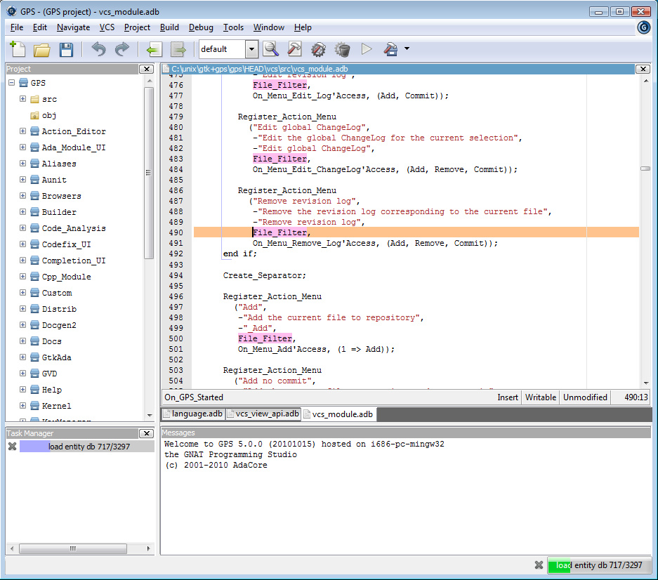

************
Introduction
************

.. index:: introduction

GPS is a complete integrated development environment that gives access
to a wide range of tools and integrates them smoothly.

.. index:: HTML
.. index:: help

GPS gives access to built-in file editing; HTML based help system;
complete compile/build/run cycle; intelligent source navigation;
project management; general graph technology giving access to many different
browsers such as source dependency, project dependency, call graphs,
entity view, etc...; fully integrated visual debugger; generic
version control system, providing access to CVS, Subversion, ClearCase, GIT,
and any other via xml plug-ins; many other tools such as a visual comparison,
automatic generation of files, source reformatting.

.. index:: customization

GPS is fully customizable, providing several levels of customizations:
a first level, available through the preferences and key manager dialogs;
a second level, which allows you to customize your menu items, tool bar and key
bindings; a third level, which allows you to automate processing through
scripts (via xml and python scripting). See :ref:`Customizing_and_Extending_GPS`
for more details.

GPS also interacts with most versions of command-line tools such as
gcc, gdb, gnatmake, gprbuild, gcov, etc...

