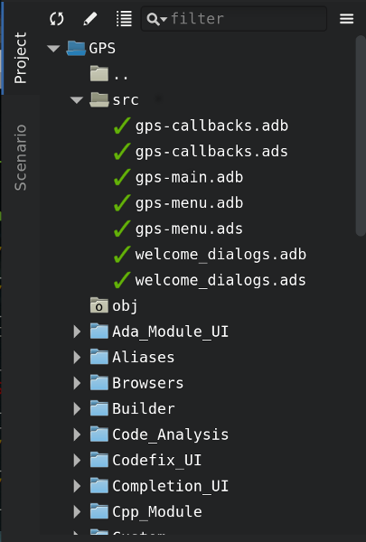
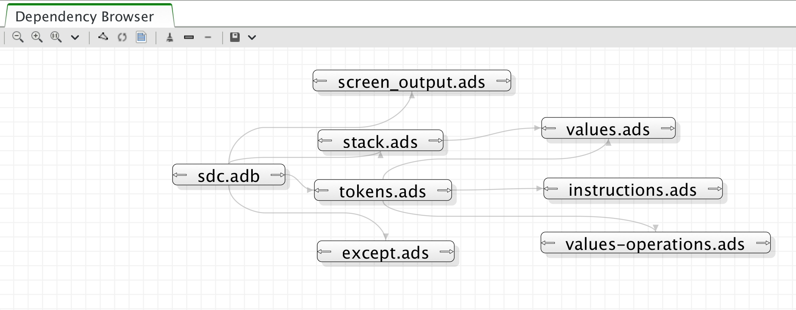

.. index:: windows; main

******************************
Description of the Main Window
******************************

The GNAT Programming Studio has one main window, which is where you perform
most of your work.  However, GPS is very flexible in the ways it lets you
organize your desktop, which is discussed in a later section
(:ref:`Multiple_Document_Interface`).

There are also other windows that might pop up at various times, documented
in this section.

.. _The_Work_Space:

The Workspace
=============

.. index:: windows; workspace
.. index:: see: desktop; Multiple Document Interface
.. index:: see: MDI; Multiple Document Interface
.. index:: Multiple Document Interface

The overall work space is based on a multiple document interface,
:ref:`Multiple_Document_Interface` and can contain any number of windows,
the most important of which are usually the editors. However, GPS also
provides a large number of views for you to add to the workspace. The
sections below list them.

Common features of the views
----------------------------

.. index:: menu; tools
.. index:: menu; tools --> views

Some views are part of the default desktop and thus are visible by
default.  Open the other views through one of the submenus of the
:menuselection:`Tools` menu, most often :menuselection:`Tools -->
Views`.

.. index:: windows; local toolbar

Some of the view have their own local toolbar that contains shortcuts to
the most often used features of that view.

.. index:: windows; local settings menu

There is often a button to the right of these local toolbars that opens a
local settings menu. This menu either contains more actions you can perform
in that view or various configuration settings that allow you to change the
behavior or the display of the view.

.. index:: windows; filter

Some views also have a filter in their local toolbar. These filters can be
used to reduce the amount of information displayed on the screen by only
showing those lines matching the filter.

If you click on the left icon of the filter, GPS brings up a popup menu to
allow you to configure the filter:

* Use the first three entries to chose the search algorith (full text
  match, regular expression, or fuzzy matching). These modes are
  similar to the ones used in the omni-search (:ref:`omni_search`).

* The next entry is :guilabel:`Revert filter`. When you select this option,
  the lines that do not match the filter are displayed, instead of the
  default behavior that displays ones that match the filter.  You can also
  enable this mode temporarily by beginning the filter with the string
  `not:`. For example, a filter in the :guilabel:`Locations` view saying
  `not:warning` will hide all warning messages.

* Select the last entry, :guilabel:`Whole word`, when you only want to
  match on full words, not on substrings.

.. _browsers_features:

Common features of browsers
---------------------------

GPS presents a view of various types of information using an interactive
display called a "browser", which shows a canvas containing boxes you can
manipulate.  Browsers provide the following additional capabilities:

* Links

  Boxes can be linked together and remain linked when they're moved.
  Different types of links exist; see the description of the various
  browsers for more details.

  Hide links using a button on the local toolbar. This keeps the
  canvas more readable at the cost of losing information.  You can also
  hide only a subset of links. Even when links are hidden, if you select a
  box, boxes linked to it are still highlighted.

  Enable the :guilabel:`straight links` local settings menu in
  browsers if you prefer to avoid diagonal links.

* Scrolling

  When many boxes are being displayed, the currently visible area may be
  too small for all of them.  When that happens, GPS adds scrollbars on the
  sides that you can use to make other items visible. You can also scroll
  using the arrow keys.

* Layout

  GPS organizes the boxes in a browser using a simple layout algorithm,
  which is layer oriented: items with no parents are put in the first
  layer, their direct children are put in the second layer, and so
  on. Depending on the type of browser, these layers are organized either
  vertically or horizontally.  If you moved boxes, this algorithm tries to
  preserve their positions as much as possible.

  Use the :guilabel:`Refresh layout` button in the local toolbar to
  recompute the layout at any time, even of boxes that you moved.

* Moving boxes

  Move boxes with your mouse. Drag the box by clicking on its title
  bar. The box's links are still be displayed during the move, so you
  can see whether it overlaps any other box. If you try to move the
  box outside the visible part of the browser, it will be scrolled.

* Selecting boxes

  Select a box by clicking it.  Select multiple boxes by holding the
  :kbd:`control` key while clicking in each box. Alternatively, you
  can create a rectangle using your mouse; all boxes found in the
  rectangle when the mouse is released are selected.

  Selected boxes have a different title bar color.  All boxes linked to
  them also use a different title bar color, and so do the links. This is
  the most convenient way to visualize the relationships between boxes when
  many are present in the browser.

  Use buttons in the local toolbar to either remove the selected boxes
  or remove the boxes that are not selected.

* Zooming

  GPS provides several different zoom levels.  Use the
  :guilabel:`zoom in`, :guilabel:`zoom out` and :guilabel:`zoom` buttons in
  the local toolbar to change the level: use the latter to explicitly
  select the level you want.

  This capability is generally useful when many boxes are displayed in the
  browser to allow you to get an overview of the layout and the
  relationships between the boxes.

* :index:`export <single: callgraph; export>`

  Export the entire contents of a browser as a :guilabel:`PNG` or
  :guilabel:`SVG` image using the :guilabel:`Export to...` button in the
  local toolbar.

* Hyper-links

  Some of boxes contain hyper links, displayed in blue by default, and
  underlined.  Clicking on these will generally display new boxes.

* Contextual menus

  Right-clicking on boxes displays a contextual menu with actions you can
  perform on that box.  These actions are specific to the kind of box you
  clicked.

* Grid

  By default, GPS displays a grid (small dots) on the canvas.  Use the
  local settings menu to hide the grid (:guilabel:`Draw grid`) or to force
  items to align on the grid (:guilabel:`Align on grid`).

Icons for source language entities
__________________________________

Entities in the source code are represented by icons within the various GPS
views (for example, the :guilabel:`Outline` and :guilabel:`Project` views).
These icons indicate both the semantic category of the entity within the
language, such as packages and methods, as well as compile-time visibility.
The icons also distinguish entity declarations from other entities.  The
same icons are used for all programming languages supported by GPS, with
language-specific interpretations for both compile-time visibility and
distinguishing declarations and uses of entities.

These five language categories are used for all supported languages:

* The *package* category's icon is a square.

  .. image:: square_x.png

* The *subprogram* category's icon is a circle.

  .. image:: circle_x.png

* The *type* category's icon is a triangle.

  .. image:: triangle_x.png

* The *variable* category's icon is a dot.

  .. image:: dot_x.png

* The *generic* category's icon is a diamond.

  .. image:: diamond_x.png

These icons are enhanced with decorations, when appropriate, to indicate
compile-time visibility constraints and to distinguish declarations from
completions. For example, the icons for entity declarations have a small
'S' decorator added, denoting a 'spec'.

Icons for 'protected' and 'private' entities appear within an enclosing box
indicating a compile-time visibility constraint. For entities with
'protected' visibility, the enclosing box is gray.  'Private' entities are
enclosed by a red box.  The icons for 'public' entities have no enclosing
box. For example, a variable with 'private' visibility is represented by an
icon consisting of a dot enclosed by a red box.

These additional decorations are combined when appropriate. For example,
the icon corresponding to the 'private' declaration of a 'package' entity
would be a square, as for any package entity, with a small 'S' added, all
enclosed by a red box.

Language constructs are mapped to categories in a language-specific manner.
For example, C++ namespaces and Ada packages correspond to the *package*
category and C functions and Ada subprograms correspond to the *method*
category.  The *generic* category is a general category representing other
language entities, but not all possible language constructs are mapped to
categories and icons.  (Specifically, the *generic* category does not
correspond to Ada generic units or C++ templates.)

The names of the categories should not be interpreted literally as language
constructs because the categories are meant to be general in order to limit
the number of categories.  For example, the *variable* category includes
both constants and variables in Ada. Limiting the number of categories
maintains a balance between presentation complexity and the need to support
many different programming languages.

Icons for a given entity may appear more than once within a view. For
example, an Ada private type has both a partial view in the visible part of
the enclosing package and a full view in the private part of the package.
A triangle icon will appear for each of the two occurrences of the type
name, one with the additional decoration indicating 'private' visibility.

.. index:: welcome dialog
.. index:: windows; welcome dialog
.. _The_Welcome_Dialog:

The Welcome Dialog
==================

.. image:: welcome.png
.. index:: command line; -P
.. index:: project; startup

When GPS starts, it looks for a project file to load so that it knows where
to find the sources of your project. This project is often specified on the
command line (via a :command:`-P` switch).  If not, and the current
directory contains only one project file, GPS selects it automatically.
Finally, if you specify the name of a source file to edit, GPS loads a
default project.  If GPS can't find a project file, it displays a welcome
dialog, giving you the following choices:

:guilabel:`Create new project from template`

  Selecting this option and clicking the :guilabel:`OK` button launchs an
  assistant to create a project using one of the predefined project
  templates. This makes it easy to create GtkAda-based applications, or
  applications using the Ada Web Server, for example.

.. index:: project; default

:guilabel:`Start with default project in directory`

  Selecting this option and clicking the :guilabel:`OK` button causes GPS
  to look for a project called :file:`default.gpr` in the current directory
  and load it if found. Otherwise, it copies into the current directory the
  default project found it :file:`<prefix>/share/gps/default.gpr` and loads
  it.  GPS removs this temporary copy when exiting or loading another
  project if the copy has not been modified during the session.

  The default project will contain all the Ada source files from the
  specified directory (assuming they use the default GNAT naming scheme
  :file:`.ads` and :file:`.adb`).

  If the current directory is not writable, GPS instead loads
  :file:`<prefix>/share/gps/readonly.gpr`. In this case, GPS works in a
  degraded mode, where some capabilities (such as building and source
  navigation) will not work. This project will not contain any sources.

.. index:: project; wizard

:guilabel:`Create new project with wizard`

  Selecting this option and clicking on the :guilabel:`OK` button starts a
  wizard allowing you to specify most of the properties for a new
  project. Once the project is created, GPS saves it and loads it
  automatically.  See :ref:`The_Project_Wizard` for more details.

  There are several kinds of wizards, ranging from creating a single project,
  to creating a set of project that attempt to adapt to an existing directory
  layout. The list of pages in the wizard will depend on the kind of project
  you want to create.

  One of the wizards, :guilabel:`Project Tree`, tries to import a set of
  sources and object files and attempt to create one or more project files
  so building your application through these project files puts the objects
  in the same directory they're currently in. If you haven't compiled your
  application when launching this wizard, GPS creates a single project file
  that puts all object files in the same object directory.  This is the
  prefered method when importing sources with duplicate file names, since
  the latter is only authorized in a single project file, not across
  various project files.

.. index:: project; load existing project

:guilabel:`Open existing project`

  Select an existing project by clicking on the :guilabel:`Browse` button
  or by using a previously loaded project listed in the combo box. When a
  project is selected, click on the :guilabel:`OK` button to load this
  project and open the main window.

:guilabel:`Always show this dialog when GPS starts`

  If unset, the welcome dialog won't be shown in future sessions.  In this
  case, GPS behaves as follows: it first looks for a :command:`-P` switch
  on the command line and loads the corresponding project if so; otherwise,
  it looks for a project file in the current directory and loads it if
  there is only one; if no project file was loaded, GPS starts with the
  default project, as if you had selected :guilabel:`Start with default
  project in directory` in the welcome dialog.

  .. index:: preferences; display welcome window

  To reset this property, go to the menu :menuselection:`Edit --> Preferences`.

:guilabel:`Quit`
  If you click on this button, GPS terminates immediately.

.. index:: tip of the day
.. index:: windows; tip of the day
.. _The_Tip_of_the_Day:

The Tip of the Day
==================

.. image:: tip-of-the-day.png

This dialog displays short tips on how to make the most efficient use of
the GNAT Programming Studio.  Click on the :guilabel:`Previous` and
:guilabel:`Next` buttons to access all tips or close the dialog by either
clicking on the :guilabel:`Close` button or pressing the :kbd:`ESC` key.

.. index:: preferences; tip of the day

Disable this dialog by unchecking the :guilabel:`Display Tip of the Day on
startup` check box. If you want to reenable this dialog, go to the
:menuselection:`Edit --> Preferences` dialog.

.. index:: menu bar
.. index:: windows; menu bar
.. _The_Menu_Bar:

The Menu Bar
============

.. image:: menubar.png

GPS provides a standard menu bar giving access to all its
functionality. However, it's usually easier to access a feature using the
various contextual menus provided throughout GPS: these give direct access
to the most relevant actions in the current context (for example, a
project, a directory, a file, or an entity). Contextual menus pop up when
you click the right mouse button or use the special :kbd:`open contextual
menu` key on most keyboards.

You can access the following items from the menu bar:

* :menuselection:`File` (:ref:`The_File_Menu`)

* :menuselection:`Edit` (:ref:`The_Edit_Menu`)

* :menuselection:`Navigate` (:ref:`The_Navigate_Menu`)

* :menuselection:`VCS` (:ref:`The_VCS_Menu`)

* :menuselection:`Project` (:ref:`The_Project_Menu`)

* :menuselection:`Build` (:ref:`The_Build_Menu`)

* :menuselection:`Debug` (:ref:`The_Debug_Menu`)

* :menuselection:`Tools` (:ref:`The_Tools_Menu`)

* :menuselection:`SPARK`

  This menu is available if the SPARK toolset is installed on your system
  and available on your PATH. See :menuselection:`Help --> SPARK -->
  Reference --> Using SPARK with GPS` for more details.

* :menuselection:`CodePeer`

  This menu is available if the CodePeer toolset is installed on your
  system and available on your PATH. See your CodePeer documentation for
  more details.

* :menuselection:`Window` (:ref:`Multiple_Document_Interface`)

* :menuselection:`Help`

.. index:: tool bar
.. _The_Tool_Bar:

The Tool Bar
============

.. image:: toolbar.png

The tool bar provides shortcuts to some typical actions:

* Create a new file
* Open an existing file (see laso the omni-search on the right of the bar)
* Save the current file
* Undo or redo last editing
* Go to previous or next saved location

* Multiple customizable
  :index:`buttons <single: build; toolbar buttons>`
  to build, clean or run your project

* multiple
  :index:`buttons <single: debugger; toolbar buttons>` to stop and continue
  the debugger, step to the next instruction, and other similar actions
  when a debugger is running.

.. index:: progress bar
.. index:: tool bar; progress bar

When GPS is performing background actions, such as loading cross-reference
information or all actions involving external processes (including
compiling), it displays a progress bar in the toolbar showing when the
current task(s) will be completed.  Click on the small
:guilabel:`interrupt` button to interrupt all background tasks. Clicking on
the progress bar opens the :guilabel:`Tasks` view
(:ref:`The_Task_Manager`).

.. index:: omni-search
.. index:: seealso: search; omni-search
.. _omni_search:

The omni-search
===============

.. image:: omnisearch.png

The final item in the toolbar is "omni-search".  Use this to search for
text in various contexts in GPS, such as filenames (for convenient access
to the source files), the entities referenced in your application, and your
code.

There are various ways to use the omni-search:

* The simplest way is to click in it and type the pattern you want to
  find. GPS immediately starts searching in the background for possible
  matching open windows, file names, entities, GPS actions, bookmarks, and
  source files. For each context, GPS only displays the five matches with
  the highest score.

  For each context, GPS display how many matches there are in that context.
  click on the name of the context to search only in that context.  For
  example, if GPS shows 20 file names matching your search (while only
  displaying the five first), click on :guilabel:`file names` to view all
  20 names and exclude the results from all the other contexts.

  If you click on the context again, GPS again displays the results from
  all contexts.

* If you're searching in a single context, GPS defines a number of actions
  to which you can bind key shortcuts via the :menuselection:`Edit --> Key
  Shortcuts` dialog instead of using the above procedure. These actions are
  found in :guilabel:`Search` category and are called :guilabel:`Global
  Search in context:`. GPS includes a :index:`menu <single: menu; file -->
  open from project>` for two of them by default: :menuselection:`File -->
  Open From Project...` searches filenames, :index:`while <single: menu;
  navigate --> goto entity>` :menuselection:`Navigate --> Goto Entity...`
  searches all entities defined in your project.

Each context displays its results slightly differently and clicking on a
result has different effects in each context. For example, clicking on a
file name opens the corresponding file, while clicking on an entity jumps
to its declaration and clicking on a bookmark displays the source file
containing the bookmark.

Press :kbd:`enter` at any point to select the top item in the list of
search results.

.. image:: omnisearch-settings.png

.. index:: menu; file --> open from project

You may have no interest in some of the search contexts.  Disable some of
them by clicking on the :guilabel:`Settings` icon at the bottom-right
corner of the completion popup. The resulting dialog display a list of all
contexts to be searched and clicking on any of the checkboxes next to the
names disables that context.  That this list is only displayed when you
started the omni-search by clicking directly into it. If you started it via
:kbd:`shift-F3` or the equivalent menu :menuselection:`File --> Open From
Project...`, only a subset of the settings are displayed.

You can also reorder the contexts from this settings dialog. This affects
both the order in which they're searched and displayed. We recommend
keeping the :guilabel:`Sources` context last, because it'ss the slowest and
while GPS is searching it, it's not able to search the other, faster,
contexts.

In the settings dialog, you can chose whether to display a
:guilabel:`Preview` for the matches. This preview is displayed when you use
the :kbd:`down arrow` key to select some of the search results. In general,
it displays the corresponding source file or the details for the matching
GPS action or bookmark.

You can also select the number of results to be displayed for each context
when multiple contexts are displayed or the size of the search field (which
depends on how big your screen and the GPS window are) using the settings
dialog.

One search context looks for file name, and is convenient for quickly
opening files. By default, it looks at all files found in any of the source
directories of your project, even if those files are not explicit sources
of the project (for example because they don't match the naming scheme for
any of the languages used by the project). This is often convenient because
you can easily open support files like :file:`Makefiles` or documentation,
but it can also sometimes be annoying if the source directories include too
many irrelevant files. Use the :guilabel:`Include all files from source
dirs` setting to control this behavior.

GPS allows you to chose amog various search algorithms:

* :guilabel:`Full Text` checks whether the text you typed appears exactly
  as you specified it within the context (for example, a file name, the
  contents of a file, or the name of an entity).

* :guilabel:`Regular Expression` assumes the text you typed is a valid
  regular expression and searches for it. If it isn't a valid regexp, it
  tries to search for the exact text (like :guilabel:`Full Text`).

* :guilabel:`Fuzzy Match` tries to find each of the characters you typed,
  in that order, but possibly with extra characters in between.  This is
  often the fastest way to search, but might requires a bit of getting used
  to. For example, the text 'mypks' matches the file name 'MY_PacKage.adS'
  because the letters shown in upper cases are contained in the filename.

  When searching within source files, the algorithm is changed slightly,
  since otherwise there would be too many matches. In that context, GPS
  only allows a clos approximations between the text you typed and the text
  it tries to match (for example, one or two extra or missing characters).

Select the algorithm to use at the bottom of the popup window containing
the search results.

Once it finds a match, GPS assigns it a score, used to order the results in
the most meaningful way for you. Scoring is based on a number of criteria:

* length of the match

  For example, when searching file names, it's more likely that typing
  'foo' was intended to match 'foo.ads' than 'the_long_foo.ads'.

* the grouping of characters in the match

  As we've seen, when doing a fuzzy match, GPS allows extra characters
  between the ones you typed. But the closer the ones you typed are in the
  match result, the more likely it is this is what you were looking for.

* when was the item last selected

  If you recently selected an item (like a file name), GPS assumes you're
  more likely to want it again and will raise its score appropriately.

.. index:: views; messages
.. index:: messages
.. index:: console
.. _The_Messages_View:

The :guilabel:`Messages` view
=============================

.. image:: messages.png

The Messages view, which is readonly, display information feedback about
operations, including build output, information about processes launched,
and error messages.

Its local toolbar contains buttons to :guilabel:`Clear` the contents of the
window, as well as :guilabel:`Save` and :guilabel:`Load` from files.  The
latter operation also parses those messages into the :guilabel:`Locations`
window.

The actual output of the compilation is displayed in the
:guilabel:`Messages` view, but is also parsed and many of its messages are
displayed more conveniently in the :guilabel:`Locations` view
(:ref:`The_Locations_View`).  When a compilation finishes, GPS displays the
total elapsed time.

.. index:: menu; tools --> views --> messages

You cannot close the :guilabel:`Messages` view because it might contain
important messages.  If GPS closed it, you can reopen it with the
:menuselection:`Tools --> Views --> Messages` menu.

.. index:: views; locations
.. _The_Locations_View:

The :guilabel:`Locations` View
==============================

.. image:: locations-view.png

GPS uses the :guilabel:`Location` view, which is also readonly, to display
a list of locations in source files (for example, when performing a global
search or displaying compilation results).

It displays a hierarchy of categories, each of which contain files, each,
in turn, containing messages at specific locations. The category describes
the type of messages (for example, search or build results).  If the full
text of a message is too large to be completely shown in the window,
placing the mouse over it pops up a tooltip window with the full text.

Each message in this window corresponds to a line in a source editor.  This
line has been highlighted and has a mark on its left side.  Clicking on a
message brings up a file editor pointing to that line.

The :guilabel:`Locations` view provides a local toolbar with the following
buttons:

* :guilabel:`Clear` removes all entries from the view and, depending on
  your settings, may also close the view.

* :guilabel:`Remove` removes the currently selected category, file or
  message as well as the corresponding highlighting in the source editor.

* :guilabel:`Save` saves the contents of the view to a text file for later
  reference.  This file cannot be loaded back into the
  :guilabel:`Locations` view, but can be loaded into the
  :guilabel:`Messages` view.  However, if you plan to reload it later, it's
  better to save and reload the contents of the :guilabel:`Messages` view
  instead.

* :guilabel:`Expand All` and :guilabel:`Collapse All` shows or hides all
  messages in the view.

* a filter to selectively show or hide some messages.  Filtering is done on
  the text of the message itself (the filter is either text or a regular
  expression).  You can also reverse the filter.  For example, typing
  `warning` in the filter field and reversing the filter :index:`hides
  warning messages <single: build; hiding warning messages>`

The local settings menu contains the following entries:

* :guilabel:`Sort by subcategory`
  Toggle the sorting of messages by sub-categories. This is useful for
  separating warnings from errors in build results. The error messages
  appear first. The default is to sort the message by their location.

* :guilabel:`Sort files alphabetically`
  Sort messages by filenames (sorted alphabetically). The default does not
  sort by filenames to make it easier to manipulate :guilabel:`Locations`
  view while the compilation is proceeding.  (If sorted, the messages might
  be reordered while you're trying to click on them).

* :guilabel:`Jump to first location`
  Every time a new category is created, for example, as a result of a
  compilation or search operation, the first message in that category is
  automatically selected and the corresponding editor opened.

* :guilabel:`Warp around on next/previous` controls the behavior of the
  guilabel:`Previous tag` and :guilabel:`Next tag` menus (see below).

* :guilabel:`Auto close locations` automatically closes this window when
  it becomes empty.

* :guilabel:`Save locations on exit` controls whether GPS should save and
  restore the contents of this window between sessions.  Be careful,
  because the loaded contents might not apply the next time.  For example,
  the source files have changed, or build errors have been fixed.  So you 
  should not select this option if those conditions might apply.

.. index:: menu; navigate --> previous tag
.. index:: menu; navigate --> next tag

GPS provides two menus to navigate through the locations using the
keyboard: :menuselection:`Navigate --> Previous Tag` and
:menuselection:`Navigate --> Next Tag`. Depending on your settings, they
might wrap around after reaching the first or last message.

You can also bind key shortcuts to these menus via the :menuselection:`Edit
--> Key Shortcuts` menu.

.. index:: codefix
.. index:: build; auto fix errors

In some cases, a wrench icon will be visible on the left of a compilation
message. See :ref:`Code_Fixing` for more information on how to take
advantage of this icon.

.. index:: project view
.. index:: windows; project view
.. _The_Project_View:

The :guilabel:`Project` view
============================

.. image:: project-view-flat.png
.. index:: menu; project --> project view
.. index:: menu; tools --> views --> project

The project view displays a representation of the various components of
your project.  By default, it's displayed on the left side of the
workspace.  Select it using the :menuselection:`Project --> Project View`
or :menuselection:`Tools --> Views --> Project` menu items.

.. index:: drag-and-drop

On Windows, you can drop files (for example, from Windows Explorer) into
the project view. If you drop a project file, GPS loads it and it replaces
the current project; if you drop a source file, GPS opens it in a new
editor.

.. index:: search; interactive search in trees
.. _Interactive_Search:

The project view, combined with the file and outline view, provide an
interactive search capability allowing you to quickly search information
currently displayed. Just start typing the text to search when the view has
the focus.  Note that the contents of the :guilabel:`Project` view are
computed lazily, so not all files are known to this search capability before
they've been opened.

This search opens a small window at the bottom of the view where you can
interactively type names.  The first matching name in the tree is selected
when you type it.  Use the :kbd:`up` and :kbd:`down` keys to navigate
through all the items matching the current text.

The various components displayed in the project view are:

*projects*

  Each source file you're working with is part of a project.  Projects are
  a way to record the switches to use for the various tools as well as a
  number of other properties such as the naming schemes for the sources.
  They can be organized into a project hierarchy where a root project can
  import other projects, each with their own set of sources (see
  :ref:`The_Welcome_Dialog` on how projects are loaded in GPS).

  The :guilabel:`Project` view displays this project hierarchy: the top
  node is the root project of your application (this is usually where the
  source file that contains the main subprogram will be located). A node is
  displayed for each imported project and recursively for other imported
  projects.  If a project is imported by several projects, it may appear
  multiple times in the view,

  If you edited the :index:`project <single: projects; limited with>`
  manually and used the :samp:`limited with` construct to create cycles in
  the project dependencies, the cycle will expand infinitely. For example,
  if project :file:`a` imports project :file:`b`, which in turn imports
  project :file:`a` through a :samp:`limited with` clause, then expanding
  the node for :file:`a` will show :file:`b`. In turn, expanding the node
  for :file:`b` will show a node for :file:`a`, and so on.

  An icon with a pen mark is displayed if the project was modified but not
  saved yet. You can save it at any time by right-clicking on the icon.
  GPS either reminds you to save it before any compilation or saves it
  automatically, depending on your preference settings.

  GPS provides a second displayfor this project view, which lists all
  projects with no hierarchy: all projects appear only once in the view, at
  the top level. You may find this display useful for deep project
  hierarchies, where it can make it easier to find projects. Activate this
  display using the local settings menu to the right of the
  :guilabel:`Project` view toolbar.

  .. index:: project view; flat view

*directories*

  The files in a project are organized into several directories on
  disk. These directories are displayed under each project node in the
  :guilabel:`Project` view

  .. index:: project view; absolute paths

  You chose whether you want to see the absolute path names for the
  directories or paths relative to the location of the project by using the
  local settings menu :guilabel:`Show absolute paths` of the
  :guilabel:`Project` view. In all cases, the tooltip displayed when the
  mouse hovers a file or directory shows the full path.

  Special nodes are created for object and executables directories. No
  files are shown for these.

  .. index:: Show hidden directories

  The local setting :guilabel:`Show hidden directories` can be used to
  filter the directories considered hidden. This can be used to hide the
  version control directories such as :file:`CVS` or :file:`.svn`.

*files*

  Source files are displayed under the node corresponding to the directory
  containing the file.  Only the source files actually belonging to the
  project (i.e. are written in a language supported by that project and
  follow its naming scheme) are visible.  For more information on supported
  languages, see :ref:`Supported_Languages`.  A file might appear multiple
  times in the :guilabel:`Project` view if the project it belongs to is
  imported by several other projects.

  You can drag a file into GPS. This opens a new editor if the file is not
  already being edited, or moves to the existing editor otherwise.  If you
  press :kbd:`shift` while dragging the file and it's already being edited,
  GPS creates a new view of the existing editor.

*entities*

  If you open the node for a source file, the file is parsed by a fast
  parsers integrated in GPS so all entities declared in the file can be
  shown. These entities are grouped into various categories that depend on
  the language. Typical categories include subprograms, packages, types,
  variables, and tasks.

  Double-clicking on a file or clicking on any entity opens a source editor
  or display showing, respectively, the first line in the file or the line
  on which the entity is defined.

.. index:: search; project view
.. index:: menu; navigate --> find or replace

If you open the search dialog via the :menuselection:`Navigate --> Find or
Replace...` menu, you can search for anything in the :guilabel:`Project`
view, either a file or an entity. Note that searching for an entity can be
slow if you have lots of files and/or large files.

.. index:: locate in project view

GPS also provides a contextual menu, called :guilabel:`Locate in Project
View`, in source editors. This automatically searches for the first entry
in this file in the :guilabel:`Project` view. This contextual menu is also
available in other modules, for example when selecting a file in the
:guilabel:`Dependency Browser`.

.. index:: project; reload

The local toolbar of the :guilabel:`Project` view contains a button to
reload the project.  You can use this when you've created or removed source
files from other applications and want to let GPS know there might have
been changes on the file system that impact the contents of the current
project.

.. index:: menu;project --> edit project properties

It also includes a button to graphically edit the attributes of the
selected project, such as the tool switches or the naming schemes. It
behaves similarly to the :menuselection:`Project --> Edit Project
Properties` menu. See :ref:`The_Project_Properties_Editor` for more
information.

If you right click on a project node, a contextual menu appears which
contains, among others, the following entries that you can use to
understand or modify your project:

* :menuselection:`Show projects imported by...`
* :menuselection:`Show projects depending on...`
  Open a new window, the :guilabel:`Project browser`, which displays
  graphically the relationships between each project in the hierarchy (see
  :ref:`The_Project_Browser`).

* :menuselection:`Project --> Properties`
  This :index:`menu <single: menu; project --> edit project properties>`
  opens a new dialog to interactively edit the attributes of the project
  (such as tool switches and naming schemes) and is similar to the local
  toolbar button.

* :menuselection:`Project --> Save project...`
  Select to :index:`save <single: project; saving>` a single project in the
  hierarchy after you modified it. Modified but unsaved projects in the
  hierarchy have a special icon (a pen mark on top of the standard
  icon). If you'd rather :index:`save all <single: menu; project -->
  save_all>` modified projects in a single step, use the menu bar item
  :menuselection:`Project --> Save All`.

  Any time you modify one or more projects, the contents of the project
  view is automatically refreshed, but no project is automatically
  saved. This provides a simple way to test temporarily new values for the
  project attributes.  Unsaved modified projects are shown with a special
  icon in the project view, a pen mark on top of the standard icon:

  .. image:: project-modified.jpg

* :menuselection:`Project --> Edit source file`
  Loads the project file into an editor so you can edit it.  Use this
  if you need to access some features of the project files that aren't
  accessible graphically (such as rename statements and variables).

* :menuselection:`Project --> Dependencies`
  Opens the dependencies editor for the selected project
  (:ref:`The_Project_Dependencies_Editor`).

* :menuselection:`Project --> Add scenario variable`
  Add new scenario variables to the project (see
  :ref:`Scenarios_And_Configuration_Variables`). Howver, you may find it
  more convenient to use the :guilabel:`Scenario` view for this purpose.

.. index:: project; scenario variables
.. index:: windows; scenario view
.. index:: project; scenario variable
.. _Scenario_View:

The :guilabel:`Scenario` view
=============================

.. image:: scenario-view.png
.. image:: scenario-view-nobuild.png

As described in the GNAT User's Guide, project files can be configured
through external variables (typically environment variables). This means
the exact list of source files or the exact switches used to compile the
application can be changed when the value of these external variables is
changed.

GPS provides a simple access to these variables, through a view called the
:guilabel:`Scenario` View. These variables are called `Scenario Variables`,
since they provide various scenarios for the same set of project files.

Each such variable is listed on its own line along with its current value.
Change the current value by clicking on it and selecting the new value
among the ones that pop up. GPS doesn't remember the value from one session
to the next: the variables' initial values come from the project files
themselves (where a default value can be specified) or from the environment
in which GPS is started, just as would be the case when spawning command
line tools like :command:`gprbuild`.

Whenever you change the value of one of the variables, the project is
automatically recomputed, and the list of source files or directories is
changed dynamically to reflect the new status of the project. Starting a
new compilation at that point uses the new switches, and all aspects of GPS
are immediately changed to reflect the new setup.

Create new scenario variables by selecting the :guilabel:`+` icon in the
local toolbar of the :guilabel:`Scenario` view.  Edit the list of possible
values for a variable by clicking on the :guilabel:`edit` button in that
toolbar.  Delete an existing variable by clicking on the :guilabel:`-`
button.

Each of these changes impacts the actual project file (:file:`.gpr`), so
you might not want to make them if the project file was written manually
since the impacts can be significant.

.. index:: build; build modes

The first line in the :guilabel:`Scenario` view is the current mode. This
impacts various aspects of the build, including compiler switches and
object directories (see :ref:`The_Build_Mode`).  Like scenario variables,
change the mode by clicking on the value and selecting a new value in the
popup window.

If you're not using build modes and want to save some space on the screen,
use the local settings menu :guilabel:`Show build modes` to disable the
display.

.. index:: windows; files view
.. _The_File_View:

The :guilabel:`Files` View
==========================

.. image:: file-view.png
.. index:: menu; tools --> views --> files

In addition to the :guilabel:`Project` view, GPS also provides a
:guilabel:`Files` view through the :menuselection:`Tools --> Views -->
Files` menu.

In this view, directories are displayed exactly as they are organized on
the disk (including Windows drives).  Each source file can also be explored
as described in :ref:`The_Project_View`.  You can also a files into the
files view to conveniently open a file.

By default, the :guilabel:`Files` view displays all files on disk. You can
set filters through the local settings menu to restrict the display to the
files and directories belonging to the project (use the :guilabel:`Show
files from project only` menu).

.. index:: windows, windows view
.. _The_Window_View:

The :guilabel:`Windows` view
============================

.. image:: windows-view1.png
.. image:: windows-view2.png
.. index:: menu; tools --> views --> windows

The :guilabel:`Windows` view displays the currently opened windows.  Open
it via the :menuselection:`Tools --> Views --> Windows` menu.

In the contextual menu, you can configure the display in one of two ways:

* Sorted alphabetically
* Organized by notebooks, as in the GPS window itself. This view
  is particularly useful if you have many windows open.

You can also choose, through the contextual menu, whether only source
editors should be visible or whether all windows should be displayed.

This view allows you to quickly select and focus on a particular window by
clicking on the corresponding line with the left button. If you leave the
button pressed, you can move the window to another place on the desktop
(see the description of the :ref:`Multiple_Document_Interface`)

Select multiple windows by clicking while pressing the control or shift
keys. The Window view provides a contextual menu to easily close all
selected windows at once, which is a fast way to clean up your desktop
after you've finished working on a task.

.. index:: windows, outline
.. index:: outline view
.. _The_Outline_View:

The :guilabel:`Outline` view
============================

.. image:: outline-view1.png
.. image:: outline-view2.png
.. image:: outline-view3.png
.. index:: menu; tools --> views --> outline

The :guilabel:`Outline` view, which you activate through the
:menuselection:`Tools --> Views --> Outline` menu, shows the contents of
the current file.

Exactly what's displayed depends on the language of the file seeing. For
Ada, C and C++ files, this view displays the list of entities declared at
the global level in your current file (such as Ada packages, C++ classes,
subprograms, and Ada types).  This view is refreshed whenever the current
editor is modified.

Clicking on any entity in this view automatically jumps to the
corresponding line in the file (the spec or the body).

The local settings menu contains multiple check boxes you can use to alter
how the outline view is displayed:

* :guilabel:`Show profiles` indicates whether the list of parameters of the
  subprograms should be displayed. This is particularly useful for
  languages allowing overriding of entities.

* :guilabel:`Show types`, :guilabel:`Show objects`, :guilabel:`Show tasks,
  entries and protected types` controls the display of the specified
  categories of entities.

* :guilabel:`Show specifications` indicates whether GPS displays a line for
  the specification (declaration) of entities in addition to the location
  of their bodies.

* :guilabel:`Sort alphabetically` controls the order in which the entities
  are displayed (either alphabetically or in the same order as in the
  source file).

* :guilabel:`Flat View` controls whether the entities are always displayed
  at the top level of the outline view. When disabled, nested subprograms
  are displayed below the subprogram in which they're declared.

* :guilabel:`Group spec and body` displays up to two icons on each line
  (one for the spec and one for the body if both occur in the file).  Click
  on one of the icons to go directly to that location. If you click on the
  name of the entity, you're taken to its declaration unless this is
  already the current location in the editor, in which case you're taken to
  its body.

* :guilabel:`Dynamic link with editor` causes the current subprogram to be
  selected in the outline view every time the cursor position changes in
  the current editor.  This option requires GPS to perform some computation
  for GPS, so will slow it down.

.. index: windows; clipboard
.. _The_Clipboard_View:

The :guilabel:`Clipboard` view
==============================

.. image:: clipboard.png

GPS has an advanced mechanism for handling copy/paste operations.

.. index:: preferences; clipboard size
.. index:: menu; edit --> copy
.. index:: menu; edit --> cut

When you select the menus :menuselection:`Edit --> Copy` or
:menuselection:`Edit --> Cut`, GPS adds the current selection to the clipboard.
As opposed to what lots of applications do, it doesn't discard the previous
contents of the clipboard, but save it for future usage. It saves a number of
entries this way, up to 10 by default.  This value is configurable through the
:guilabel:`Clipboard Size` preference.

.. index:: menu; edit --> paste
.. index:: menu; edit --> paste previous

When you select the menu :menuselection:`Edit --> Paste`, GPS will paste the last
entry made in the clipboard at the current location in the editor.  If you
immediately select :menuselection:`Edit --> Paste Previous`, this newly inserted
text will be removed, and GPS will instead insert the second to last entry
added to the clipboard. You can keep selecting the same menu to get access to
older entries.

This is a very powerful mechanism, since it means you can copy several distinct
lines from a place in an editor, move to an other editor and paste all these
separate lines, without having to go back and forth between the two editors.

.. index:: menu; tools --> views --> clipboard

The :guilabel:`Clipboard` view provides a graphical mean of seeing what is
currently stored in the clipboard. It can be opened via
:menuselection:`Tools --> Views --> Clipboard`.

It appears as a list of lines, each of which
is associated with one level of the clipboard. The text that shows in these
lines is the first line of the selection at that level that contains non blank
characters. Leading characters are discarded. `[...]` is prepended or appended
in case the selection has been truncated.

If you bring the mouse over a line in the :guilabel:`Clipboard` view, a tooltip
will pop up showing the entire selection corresponding to the line by
opposition to the possibly truncated one.

In addition, one of the lines has an arrow on its left. This indicates the line
that will be pasted when you select the menu :menuselection:`Edit --> Paste`. If
you select instead the menu :menuselection:`Edit --> Paste Previous`, then the
line below that one will be inserted instead.

If you double-click on any of these lines, GPS will insert the corresponding
text in the current editor, and make the line you clicked on the current line,
so that selecting :menuselection:`Edit --> Paste` or the equivalent shortcut will
now insert that line.

The local toolbar in the clipboard view provides two buttons:

* :guilabel:`Append To Previous`. If you select this button, the select line will
   be append to the one below, and removed from the clipboard. This means that
   selection :menuselection:`Edit --> Paste` will in fact paste the two entries at
   the same time.  This is in particular useful when you want to copy lines from
   separate places in the initial file, merge them, and then paste them together
   one or more times later on, through a single operation.

* :guilabel:`Remove`. If you select this button, the selected line is removed
  from the clipboard.

The Clipboard View content is preserved between GPS sessions. As an exception,
huge entries are removed and replaced with an entry saying "[Big entry has been
removed]".

.. index:: windows; call trees
.. index:: windows; callgraph browser
.. index:: callgraph
.. _The_Callgraph_View:

The :guilabel:`Call trees` view and :guilabel:`Callgraph` browser
=================================================================

These two views play a similar role.  They display the same information about
entities, but in two different ways: the callgraph view displays the
information in a tree, easily navigable and perhaps easier to manipulate when
lots of entities are involved; the callgraph browser displays the information
as graphical boxes that can be manipulated on the screen, and is best suited to
generate a diagram that can be later exported to your own documents.

These views are used to display the information about what subprograms
are called by a given entity, and, opposite, what entities are calling a given
entity.

Some references might be reported with an additional " (dispatching)" text.  In
such a case, this indicates that the call to the entity is not explicit in the
sources, but could occur through dynamic dispatching. This of course depends on
what arguments are passed to the caller at run time, and it is possible that
the subprogram is in fact never dispatched to.

.. index:: contextual menu; calls
.. index:: contextual menu; called by

Call Trees
----------

.. image:: calltree.png

The :guilabel:`Call trees` are displayed when you select one of the contextual
menus :menuselection:`<entity> calls` and :menuselection:`<entity> is called
by`. Every time you select one of these menus, a new view is opened to display
that entity.

Whenever you expand a node from the tree by clicking on the small expander
arrow on the left of the line, further callgraph information is computed for
the selected entity, which makes it very easy to get information for a full
callgraph tree.

Closing and expanding a node again will recompute the callgraph for the entity.

On the right side of the main tree, a list displays the locations of calls for
the selected entity. Clicking on entries in this list opens editors showing the
corresponding location.

The :guilabel:`Calltree` supports keyboard navigation: :kbd:`Up` and
:kbd:`Down` keys navigate between listed locations, :kbd:`Left` collapses the
current level, :kbd:`Right` expands the current level, and :kbd:`Return` jumps
to the currently selected location.

The contents of the calltree is not restored the next time GPS is restarted,
because its contents might be misleading if the sources have changed in-between,
and GPS would be wasting time loading the information again.

The local toolbar provides the following buttons:

* :guilabel:`Clear`
  Remove all entries from the Callgraph View.

* :guilabel:`Remove entity`
  Remove the selected entity from the Callgraph View.

* :guilabel:`Collapse all`
  Collapse all the entities in the Callgraph View.

.. _Call_Graph:

Callgraph browser
-----------------

.. image:: callgraph.png
.. image:: callgraph_orth.png

The callgraph shows graphically the relationship between subprogram callers and
callees. A link between two items indicate that one of them is calling the
other.

.. index:: renaming entities; in callgraph

A special handling is provided for renaming entities (in Ada): if a subprogram
is a renaming of another one, both items will be displayed in the browser, with
a special hashed link between the two. Since the renaming subprogram doesn't
have a proper body, you will then need to ask for the subprograms called by the
renamed to get the list.

In this browser, clicking on the right arrow in the title bar will display all
the entities that are called by the selected item.

Clicking on the left arrow will display all the entities that call the selected
item (i.e. its callers).

.. index:: contextual menu; browsers --> calls
.. index:: contextual menu; browsers --> calls (recursively)
.. index:: contextual menu; browsers --> called by

This browser is generally opened by right-clicking on the name of an entity in
source editors or :guilabel:`Project` view, and selecting one of
:menuselection:`Browsers --> <entity> calls`, :menuselection:`Browsers --> <entity>
calls (recursive)` or :menuselection:`Browsers --> <entity> is called by`.

All boxes in this browser list several information: the location of their
declaration, and the list of all their references in the other entities
currently displayed in the browser. If you close the box for an entity that
calls them, the matching references are also hidden, to keep the contents of
the browser simpler.

If you right-click on the title of one of the entity boxes, you will get the
same contextual menu as when you click on the name of an entity in an editor,
with the additional items:

* :guilabel:`Go To Spec`
  Selecting this item will open a source editor that displays the
  declaration of the entity.

* :guilabel:`Go To Body`
  Selecting this item will open a source editor that displays the
  body of the entity.

* :guilabel:`Locate in Project View`
  Selecting this menu entry will move the focus to the project view,
  and select the first node representing the file in which the entity is
  declared. This makes it easier to see which other entities are
  declared in the same file.

See also :ref:`browsers_features` for more capabilities of the GPS browsers.

.. index:: windows; bookmarks
.. index:: bookmark
.. _Bookmarks:

The :guilabel:`Bookmarks` view
==============================

.. image:: bookmarks.png

Bookmarks are a convenient way to remember places in your code or in your
environment so that you can go back to them at any point in the future.  These
bookmarks are saved automatically whenever they are modified, and restored when
GPS is reloaded, so that they exist across GPS sessions.

Bookmarks will automatically remember the exact location in an editor, not in
terms of line/column, but in terms of which word they point to. If you modify
the file through GPS, the bookmark will be automatically updated to keep
refering to the same place. Likewise if you close and reopen the file.
However, when the file is modified outside of GPS, the bookmark will not be
aware of that change, and will thus reference another place in the file.

.. index:: menu; edit --> create bookmark

The menu :menuselection:`Edit --> Create Bookmark` allows you to create a
bookmark at the current location (either in the editor, or the browser for
instance).

.. index:: menu; tools --> views --> bookmarks

All the bookmarks you have created will be visible in the
:menuselection:`Tools --> Views --> Bookmarks` window. Clicking on the line will
immediately open an editor with the cursor at that position.

In the :guilabel:`Bookmarks` window, the local toolbar provides three buttons
to act on the bookmarks:

* :guilabel:`Create` is similar to the :menuselection:`Edit --> Create Bookmark`
  and will create a bookmark at the current location. After pressing this
  button, you can immediately start typing a custom name for the new bookmark
  (or just press :kbd:`enter` to keep the default name, which is based on the
  name of the enclosing subprogram).

* :guilabel:`Rename` can be used to rename the currently selected bookmark.
  Editing is inline, so you can immediately start typing the new name and
  press :kbd:`enter` when done.

* :guilabel:`Remove` is used to delete the selected bookmark.

.. index:: windows; python console
.. index:: windows; shell console
.. index:: python; console
.. _The_Shell_and_Python_Windows:

The :guilabel:`Shell` and :guilabel:`Python` Windows
====================================================

.. image:: shell-window.png
.. image:: python-window.png

These windows give access to the various scripting languages supported by GPS,
and allow you to type interactive commands such as editing a file or compiling
without using the menu items or the mouse.

.. index:: menu; tools --> consoles --> GPS Shell

The menu :menuselection:`Tools --> Consoles --> GPS Shell` can be used to open the
shell console. The GPS shell is a custom language that was mostly used when
GPS did not have python support, and is obsolete at this point.

.. index:: menu; tools --> consoles --> Python

The menu :menuselection:`Tools --> Consoles --> Python` opens the python
console. Python is the preferred language to customize your GPS (and many
more details will be provided in later sections of this documentation).
The console is mostly useful for testing interactive commands before you
use them in your own scripts.

See :ref:`Scripting_GPS` for more information on using scripting languages
within GPS.

In both these consoles, GPS provides a history of previously typed commands.
You can use the :kbd:`up` and :kbd:`down` keys to navigate through the history
of commands.

.. index:: windows; os shell
.. index:: bash
.. index:: vi
.. index:: plug-ins; shell.py

The OS shell window
===================

.. image:: os_shell-window.png
.. index:: menu; tools --> consoles --> OS Shell

An OS shell window is also available in GPS, providing a simple access to the
underlying OS shell as defined by the :samp:`{SHELL}` or :samp:`{COMSPEC}`
environment variables.

This console is opened via the :menuselection:`Tools --> Consoles --> OS Shell`
menu. This menu is available only if the plug-in :file:`shell.py` was
loaded in GPS (which is the default).

This console behaves like the standard shell on your system, including
support for ANSI sequences (and thus color output). For instance, it has been
used to run :command:`vi` within GPS.

Check the documentation of that plug-in, which lists a few settings that
might be useful.

.. index:: run
.. index:: build; executing application
.. index:: windows; execution window
.. _The_Execution_Window:

The Execution window
====================

.. index:: menu; build --> run

Each time a program is launched using the menu :menuselection:`Build --> Run`, a
new execution window is created to provide input and output for this program.

In order to allow post mortem analysis and copy/pasting, the execution windows
are not destroyed when the application terminates. It must be closed explictly.

If you close the execution window while the application is still running, a
dialog window is displayed, asking whether you want to kill the application, or
to cancel the close operation.

.. index:: tasks
.. index:: windows; task manager
.. _The_Task_Manager:

The :guilabel:`Task Manager`
============================

The Task Manager window lists all the currently running GPS operations that run
in the background, such as builds, searches or VCS commands.

For each of these tasks, the Task Manager shows the status of the task, and the
current progress. The execution of theses tasks can be suspended by clicking on
the smalle :guilabel:`pause` button next to the task. The tasks can also be
killed by clicking on the :guilabel:`interrupt` button.

.. index:: menu; tools --> views --> tasks

The Task Manager is opened by double clicking on the progress bar in the main
toolbar, or using the :menuselection:`Tools --> Views --> Tasks` menu, and can be put
anywhere in your desktop.

.. image:: task-manager-exit.png

When exiting GPS, if there are tasks running in the Task Manager, a window will
display those tasks. You can force the exit at any time by pressing the
confirmation button, which will kill all remaining tasks, or continue working
in GPS by pressing the :guilabel:`Cancel` button.

.. index:: windows; project browser
.. index:: project; viewing dependencies
.. _The_Project_Browser:

The :guilabel:`Project Browser`
===============================

.. image:: project-browser.png

The project browser shows the dependencies between all the projects in the
project hierarchy. Two items in this browser will be linked if one of them
imports the other.

It is accessed through the contextual menu in the :guilabel:`Project` view, by
selecting the :menuselection:`Show projects imported by...` item, when
right-clicking on a project node.

Clicking on the left arrow in the title bar of the items will display all the
projects that import that project. Similarly, clicking on the right arrow will
display all the projects that are imported by that project.

The contextual menu obtained by right-clicking on a project item contains
several items. Most of them are added by the project editor, and gives direct
access to editing the properties of the project, adding dependencies...

Some new items are added to the menu:

* :menuselection:`Locate in Project View`

  Selecting this menu will switch the focus to the :guilabel:`Project` view,
  and highlight the first project node found that matches the project in the
  browser item.  This is a convenient way to get information like the list of
  directories or source files for that project.

* :menuselection:`Show projects imported by...`

  This menu plays the same role as the right arrow in the title bar, and
  display all the projects in the hierarchy that are imported directly by the
  selected projecto

* :menuselection:`Show projects imported by ... (recursively)`

  This menu will display all the dependencies recursively for the project (i.e.
  the projects it imports directly, the projects that are imported by them, and
  so on).

* :menuselection:`Show projects importing...`

  This item plays the same role as the left arrow in the title bar, and
  displays all the projects that directly import the selected project.

See also :ref:`browsers_features` for more capabilities of the GPS browsers.

.. index:: windows; dependency browser
.. index:: project; dependencies
.. _The_Dependency_Browser:

The :guilabel:`Dependency Browser`
==================================

The dependency browser shows the dependencies between source files. Each item
in the browser represents one source file.

In this browser, clicking on the right arrow in the title bar will display the
list of files that the selected file depends on. A file depend on another one
if it explicitly imports it (:samp:`with` statement in Ada, or :samp:`#include`
in C/C++).  Implicit dependencies are currently not displayed in this browser,
since the information is accessible by opening the other direct dependencies.

Clicking on the left arrow in the title bar will display the list of files that
depend on the selected file.

This browser is accessible through the contextual menu in the
:guilabel:`Project` view, by selecting one of the following items:

* :menuselection:`Show dependencies for ...`

  This has the same effect as clicking on the right arrow for a file already in
  the browser, and will display the direct dependencies for that file.

* :menuselection:`Show files depending on ...`

  This has the same effect as clicking on the left arrow for a file already in
  the browser, and will display the list of files that directly depend on that
  file.

The background contextual menu in the browser adds a few entries to the
standard menu:

* :menuselection:`Open file...`

  This menu entry will display an external dialog in which you can select the
  name of a file to analyze.

* :menuselection:`Recompute dependencies`

  This menu entry will check that all links displays in the dependency browser
  are still valid. If not, they are removed. The arrows in the title bar are
  also reset if necessary, in case new dependencies were added for the files.

  The browser is not refreshed automatically, since there are lots of cases
  where the dependencies might change (editing source files, changing the
  project hierarchy or the value of the scenario variables, ...)

  It also recomputes the layout of the graph, and will change the current
  position of the boxes.

* :menuselection:`Show system files`

  This menu entry indicates whether standard system files (runtime files for
  instance in the case of Ada) are displayed in the browser. By default, these
  files will only be displayed if you explicitly select them through the
  :menuselection:`Open file` menu, or the contextual menu in the project view.

* :menuselection:`Show implicit dependencies`

  This menu entry indicates whether implicit dependencies should also be
  displayed for the files. Implicit dependencies are files that are required to
  compile the selected file, but that are not explicitly imported through a
  :samp:`with` or :samp:`#include` statement. For instance, the body of
  generics in Ada is an implicit dependency.  Any time one of the implicit
  dependencies is modified, the selected file should be recompiled as well.

The contextual menu available by right clicking on an item also adds a
number of entries:

* :menuselection:`Analyze other file`

  This will open a new item in the browser, displaying the complement file for
  the selected one. In Ada, this would be the body if you clicked on a spec
  file, or the opposite. In C, it depends on the naming conventions you
  specified in the project properties, but you would generally go from a
  :file:`.h` file to a :file:`.c` file and back.

* :menuselection:`Show dependencies for ...`

  These play the same role as in the project view contextual menu

See also :ref:`browsers_features` for more capabilities of the GPS browsers.

.. index:: windows; elaboration circularities
.. index:: build; elaboration circularities
.. _Elaboration_Cycles_Browser:

The :guilabel:`Elaboration Circularities` browser
=================================================

.. image:: elaboration-graph.jpg

GPS can detect elaboration cycles reported by build processes, and
construct a visual representation of elaboration dependencies, in an
:guilabel:`Elaboration Cycles` browser.

This visual representation represents program units as items in the browsers,
and direct dependencies between program units as links.
All units involved in a dependency cycle caused by the presence of a
pragma Elaborate_All (whether explicit or implicit) are also presented
in the browser and connected by links with labels "body" and "with".

.. index:: preferences; browsers --> show elaboration cycles

The preference :menuselection:`Browsers --> Show elaboration cycles` controls
whether to automatically create a graph from cycles listed in build output.

See also :ref:`browsers_features` for more capabilities of the GPS browsers.

.. index:: windows; entity browser
.. _Entity_Browser:

The :guilabel:`Entity Browser`
==============================

.. image:: entity-browser.png

The entity browser displays static information about any source entity.  The
exact content of the items depend on the type of the item. For instance:

* :samp:`Ada record / C struct`

  The list of fields, each as an hyper link, is displayed. Clicking on
  one of the fields will open a new item for the type.

* :samp:`Ada tagged type / C++ class`

  The list of attributes and methods is displayed. They are also
  click-able hyper-links.

* :samp:`Subprograms`

  The list of parameters is displayed

* :samp:`Packages`

  The list of all the entities declared in that package is displayed

* and more...

This browser is accessible through the contextual menu
:menuselection:`Browsers --> Examine entity` in the project view and source
editor, when clicking on an entity.

Most information in the items are clickable (by default, they appear as
underlined blue text). Clicking on one of these hyper links will open a new
item in the entity browser for the selected entity.

This browser can display the parent entities for an item. For instance, for a
C++ class or Ada tagged type, this would be the types it derives from. This is
accessible by clicking on the up arrow in the title bar of the item.

Likewise, children entities (for instance types that derive from the item) can
be displayed by clicking on the down arrow in the title bar.

An extra button appear in the title bar for the C++ class or Ada tagged types,
which toggles whether the inherited methods (or primitive operations in Ada)
should be displayed. By default, only the new methods, or the ones that
override an inherited one, are displayed. The parent's methods are not shown,
unless you click on this title bar button.

See also :ref:`browsers_features` for more capabilities of the GPS browsers.

.. index:: file selector
.. index:: Windows
.. _The_File_Selector:

The File Selector
=================

.. image:: open-file.png

The file selector is a dialog used to select a file. On Windows, the default is
to use the standard file selection widget. On other platforms, the file
selector is a built-in dialog:

This dialog provides the following areas and capabilities:

* A tool bar on the top composed of five buttons giving access to common
  navigation features:

  - :guilabel:`left arrow` go back in the list of directories visited
  - :guilabel:`right arrow` go forward
  - :guilabel:`up arrow` go to parent directory
  - :guilabel:`refresh` refresh the contents of the directory
  - :guilabel:`home` go to home directory (value of the HOME environment variable,
    or `/` if not defined)

* A list with the current directory and the last directories explored.  You can
  modify the current directory by modifying the text entry and hitting
  :kbd:`Enter`, or by clicking on the right arrow and choose a previous
  directory in the pop down list displayed.

* A directory tree. You can open or close directories by clicking on the `+`
  and `-` icons on the left of the directories, or navigate using the keyboard
  keys: :kbd:`up` and :kbd:`down` to select the previous or the next directory,
  :kbd:`+` and :kbd:`-` to expand and collapse the current directory, and
  :kbd:`backspace` to select the parent directory.

* A file list. This area lists the files contained in the selected directory.
  If a filter is selected in the filter area, only the relevant files for the
  given filter are displayed. Depending on the context, the list of files may
  include additional information about the files, e.g. the kind of a file, its
  size, etc...

* A filter area. Depending on the context, one or several filters are available
  to select only a subset of files to display. The filter *All files* which is
  always available will display all files in the directory selected.

* A file name area. This area will display the name of the current file
  selected, if any.  You can also type a file or directory name directly, and
  complete the name automatically by using the :kbd:`Tab` key.

* A button bar with the :guilabel:`OK` and :guilabel:`Cancel` buttons.  When
  you have selected the right file, click on :guilabel:`OK` to confirm, or
  click on :guilabel:`Cancel` at any time to cancel and close the file
  selection.
