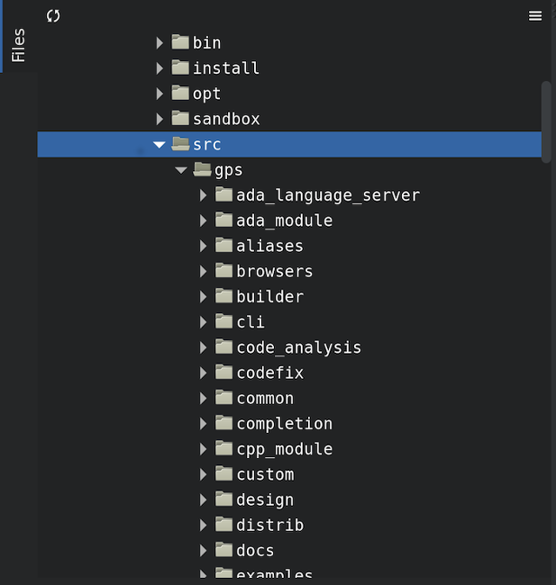

.. index:: windows; main

******************************
Description of the Main Window
******************************

The GNAT Programming Studio has one main window, where most
of your work will be performed. However, it is also very flexible
in how it lets you organize your desktop, which will be discussed
in a later section (:ref:`Multiple_Document_Interface`).

But there are also various other windows that might pop up at
various times, and this section documents them.

.. index:: welcome dialog
.. index:: windows; welcome dialog
.. _The_Welcome_Dialog:

The Welcome Dialog
==================

.. image:: welcome.png
.. index:: command line; -P

When it starts, GPS is looking for a project file to load, so that it knows
where to find the sources of your project. This project is in general specified
on the command line (via a :command:`-P` switch). Alternatively, if the current
directory only contains one project file, GPS will select it automatically.
Finally, if you specify the name of a source file to edit, GPS will load
a default project and start the editing immediately.
if no project file can be found, GPS displays a welcome dialog, which gives you
the following choices:

:guilabel:`Create new project from template`
  If you select this option and then click the :guilabel:`OK` button, GPS will
  launch an assistant to create a project using one of the predefined project
  templates. This makes it easy to create GtkAda-based applications, or
  applications using the Ada Web Server, for instance.

.. index:: project; default

:guilabel:`Start with default project in directory`

  If you select this option and click on the :guilabel:`OK` button, GPS will
  first look for a project called :file:`default.gpr` in the current directory
  and load it if found. Otherwise, it will copy in the current directory the
  default project found under :file:`<prefix>/share/gps/default.gpr` and load
  it.  GPS will remove this temporary copy when exiting or loading another
  project, if the copy has not been modified during the session.

  The default project will contain all the Ada source files from the given
  directory (assuming they use the default GNAT naming scheme :file:`.ads`
  and :file:`.adb`).

  If the current directory is not writable, GPS will instead load directly
  :file:`<prefix>/share/gps/readonly.gpr`. In this case, GPS will work in a
  degraded mode, where some capabilities will not work (such as building and
  source navigation). This project does not contain any sources.

.. index:: project; wizard

:guilabel:`Create new project with wizard`

  Selecting this option and clicking on the :guilabel:`OK` button will start a
  wizard allowing you to specify most of the properties for a new project. Once
  the project is created, GPS will save it and load it automatically.
  See :ref:`The_Project_Wizard` for more details.

  There are several kinds of wizards, ranging from creating a single project,
  to creating a set of project that attempt to adapt to an existing directory
  layout. The list of pages in the wizard will depend on the kind of project
  you want to create.

  One of the wizard, :guilabel:`Project Tree`, will try and import a set of
  sources and object files, and attempt to create one or more project files so
  that building your application through these project files will put the
  objects in the same directory they are currently in. If you have not compiled
  your application when launching this wizard, GPS will create a single project
  file and all object files will be put in the same object directory. This is
  the prefered method when importing sources with duplicate file names, since
  the latter is only authorized in a single project file, not across various
  project files.

.. index:: project; load existing project

:guilabel:`Open existing project`

  You can select an existing project by clicking on the :guilabel:`Browse`
  button, or by using a previously loaded project listed in the combo box. When
  a project is selected, click on the :guilabel:`OK` button to load this
  project and open the main window.

:guilabel:`Always show this dialog when GPS starts`

  If unset, the welcome dialog won't be shown in future sessions.  In this
  case, GPS will behave as follows: it will first look for a :command:`-P`
  switch on the command line, and load the corresponding project if present;
  otherwise, it will look for a project file in the current directory and will
  load it if there is only of them; if no project file was loaded, GPS will
  start with the default project, as if you had selected :guilabel:`Start with
  default project in directory` in the welcome dialog.

  .. index:: preferences; display welcome window

  To reset this property, go to the menu :menuselection:`Edit --> Preferences`.

:guilabel:`Quit`
  If you click on this button, GPS will terminate immediately.

.. index:: tip of the day
.. index:: windows; tip of the day
.. _The_Tip_of_the_Day:

The Tip of the Day
==================

.. image:: tip-of-the-day.png

This dialog displays short tips on how to make the most efficient use of the
GNAT Programming Studio. You can click on the :guilabel:`Previous` and
:guilabel:`Next` buttons to access all tips, and close the dialog by either
clicking on the :guilabel:`Close` button or pressing the :kbd:`ESC` key.

.. index:: preferences; tip of the day

You can also disable this dialog by unchecking the :guilabel:`Display Tip of
the Day on startup` check box. If you would like to reenable this dialog, you
can go to the :menuselection:`Edit --> Preferences` dialog.

.. index:: menu bar
.. index:: windows; menu bar
.. _The_Menu_Bar:

The Menu Bar
============

.. image:: menubar.png

This is a standard menu bar that gives access to all the global functionalities
of GPS. It is usually easier to access a given functionality using the various
contextual menus provided throughout GPS: these menus give direct access to the
most relevant actions given the current context (e.g. a project, a directory, a
file, an entity, ...). Contextual menus pop up when the right mouse button is
clicked or when using the special :kbd:`open contextual menu` key on most PC
keyboards.

The menu bar gives access to the following items:

* :menuselection:`File` (:ref:`The_File_Menu`)

* :menuselection:`Edit` (:ref:`The_Edit_Menu`)

* :menuselection:`Navigate` (:ref:`The_Navigate_Menu`)

* :menuselection:`VCS` (:ref:`The_VCS_Menu`)

* :menuselection:`Project` (:ref:`The_Project_Menu`)

* :menuselection:`Build` (:ref:`The_Build_Menu`)

* :menuselection:`Debug` (:ref:`The_Debug_Menu`)

* :menuselection:`Tools` (:ref:`The_Tools_Menu`)

* :menuselection:`SPARK`

  If the SPARK toolset is installed on your system and available on your
  PATH, then this menu is available. See
  :menuselection:`Help-->SPARK-->Reference-->Using SPARK with GPS`
  for more details.

* :menuselection:`CodePeer`

  If the CodePeer toolset is installed on your system and available on your
  PATH, then this menu is available. See your CodePeer documentation for more
  details.

* :menuselection:`Window` (:ref:`Multiple_Document_Interface`)

* :menuselection:`Help` (:ref:`The_Help_Menu`)

.. index:: tool bar
.. _The_Tool_Bar:

The Tool Bar
============

The tool bar provides shortcuts via buttons to some typical actions:

* creating a new file
* opening an existing file (see laso the omni-search on the right of the bar)
* saving the current file
* undo / redo last editing
* go to previous or next saved location
* multiple customizable buttons to build, clean or run your project
  :index:`build; toolbar buttons`
* when a debugger is started, multiple buttons to stop and continue the
  debugger, step to the next instruction,...
  :index:`debugger; toolbar buttons`

.. index:: progress bar
.. index:: tool bar; progress bar

When GPS is performing background actions, like loading the cross-reference
information, compiling or indeed all actions involving external processes,
a progress bar is displayed in the toolbar. This shows when the current
task(s) will be completed. A small :guilabel:`interrupt` button can be clicked
on to interrupt all background tasks. Clicking on the progress bar will
open the :guilabel:`Tasks` view (:ref:`The_Task_Manager`).

.. index:: omni-search
.. index:: seealso: search; omni-search

The final item in the toolbar is the omni-search (:ref:`omni_search`). This is
a search field that will search the text you type in various contexts in GPS,
like filenames (for convenient access to the source files), the entities
referenced in your application, your code,...

.. _The_Work_Space:

The Workspace
=============

.. index:: windows; workspace
.. index:: see: desktop; Multiple Document Interface
.. index:: see: MDI; Multiple Document Interface
.. index:: Multiple Document Interface

The whole work space is based on a multiple document interface,
:ref:`Multiple_Document_Interface`. It can contain any number of
windows, the most important of which are probably the editors. However,
GPS also provides a large number of views that can be added to the
workspace. The following sections will list them all.

Common features of the views
----------------------------

.. index:: windows; local toolbar

Some of the view have their own local toolbar that contains shortcuts
to the most often used features of the view.

.. index:: windows; local settings menu

To the right of these local toolbars, there is often a button to open
a local settings menu. This menu can contain more actions that can be
performed in this view, or various configuration settings that affect
the behavior or the display of the view.

.. index:: menu; Tools

Some views are part of the default desktop, and thus are visible by default.
The other views can always be opened through one of the submenus of the
:menuselection:`Tools` menu, most often :menuselection:`Tools-->Views`.

Icons for source language entities
__________________________________

Entities in the source code are presented with representative icons within the
various GPS views (the :guilabel:`Outline` and :guilabel:`Project` views, for
example).  These icons indicate both the language categories of the entities,
such as packages and methods, as well as compile-time visibility.  In addition,
the icons distinguish entity declarations from other entities.  The same icons
are used for all programming languages supported by the viewers, with
language-specific interpretations for both compile-time visibility and
recognizing declarations.

There are five language categories used for all supported languages:

* The *package* category's icon is a square.

  .. image:: square_x.png

* The *subprogram* category's icon is a circle.

  .. image:: circle_x.png

* The *type* category's icon is a triangle.

  .. image:: triangle_x.png

* The *variable* category's icon is a dot.

  .. image:: dot_x.png

* The *generic* category's  icon is a diamond.

  .. image:: diamond_x.png

These basic icons are enhanced with decorators, when appropriate, to indicate
compile-time visibility constraints and to distinguish declarations from
completions. For example, the icons for entity declarations have a small 'S'
decorator added, denoting a 'spec'.

With respect to compile-time visibility, icons for 'protected' and 'private'
entities appear within an enclosing box indicating a visibility constraint. For
entities with 'protected' visibility, this enclosing box is colored in gray.
'Private' entities are enclosed within a red box.  The icons for 'public'
entities have no such enclosing box. For example, a variable with 'private'
visibility would be represented by an icon consisting of a dot enclosed within
a red box.

These additional decorators are combined when appropriate. For example, the
icon corresponding to the 'private' declaration of a 'package' entity would be
a square, as for any package entity, with a small 'S' added, all enclosed
within a red box.

Language constructs are mapped to the categories in a language-specific manner.
For example, C++ namespaces and Ada packages correspond to the *package*
category.  C functions and Ada subprograms correspond to the *method* category,
and so on.  The *generic* category is a general category representing other
language entities, but note that not all possible language constructs are
mapped to categories and icons.  (Note also that the *generic* category does
not correspond to Ada generic units or C++ templates.)

The names of the categories should not be interpreted literally in terms of
language constructs because the categories are rather general, in order to
limit the number used. The *variable* category includes both constants and
variables in Ada, for example. Limiting the number of categories maintains a
balance between presentation complexity and the need to support distinct
programming languages.

Icons for a given entity may appear more than once within a view. For example,
an Ada private type will have both a partial view in the visible part of the
enclosing package as well as a full view in the private part of the package.
Two triangle icons will therefore appear for the two occurrences of the type
name, one with the additional decorator indicating the 'private' compile-time
visibility.

.. index:: project view
.. index:: windows; project view

The :guilabel:`Project` view
----------------------------

.. image:: project-view.png
.. image:: project-view-flat.png

The project view provides a representation of the various components of your
project, as listed below.  It is displayed by default on the left side of the
workspace, and can be selected by using the :menuselection:`Project-->Project
View` or :menuselection:`Tools-->Views-->Project` menu items.

.. index:: drag-and-drop

On Windows, it is possible to drop files (coming for instance from the Windows
Explorer) directly in the project view. If you drop a project file, it will be
loaded by GPS and replace the current project; if you drop a source file, it is
opened in a new editor.

.. index:: search; interactive search in trees
.. _Interactive_Search:

The project view, as well as the file and outline view provide an interactive
search capability allowing you to quickly search in the information currently
displayed. Just start typing the text to search when the view has the focus.
Note however, that the contents of the :guilabel:`Project` view is computed
lazily, so not all files are known to this search capability.

This will open a small window at the bottom of the view where you can
interactively type names.  The first matching name in the tree will be selected
while you type it.  You can then also use the :kbd:`up` and :kbd:`down` keys to
navigate through all the items matching the current text.

The various components that are displayed are:

*projects*

  All the sources you are working with are put under control of projects. These
  projects are a way to store the switches to use for the various tools, as
  well as a number of other properties like the naming schemes for the sources.
  They can be organized into a project hierarchy, where a root project can
  import other projects, each with their own set of sources (see :ref:`The_Welcome_Dialog`
  on how projects are loaded in GPS).

  The :guilabel:`Project` view displays this project hierarchy: the top node is
  the root project of your application (generally, this is where the source
  file that contains the main subprogram will be located). Then a node is
  displayed for each imported project, and recursively for their own imported
  projects.

  A given project might appear multiple times in the view, if it is imported by
  several other projects.

  A special icon with a pen mark is displayed if the project was modified, but
  not saved yet. You can choose to save it at any time by right-clicking on it.
  GPS will remind you to save it before any compilation, or save it
  automatically, if the corresponding preference is saved.

  There exists a second display for this project view, which lists all projects
  with no hierarchy: all projects appear only once in the view, at the top
  level. This display might be useful for deep project hierarchies, to make it
  easier to find projects in the project view. This display is activated
  through the local settings menu to the right of the :guilabel:`Project` view
  toolbar.

  .. index:: project view; flat view

*directories*

  The files in a project are organized into several physical
  directories on the disk. These directories are displayed under each
  project node in the :guilabel:`Project` view

  .. index:: project view; absolute paths

  You can chose whether you want to see the absolute path names for the
  directories or paths relative to the location of the project. This is done
  using the local settings menu :guilabel:`Show absolute paths` of the
  :guilabel:`Project` view. In all cases, the tooltip that is displayed when
  the mouse hovers a file or directory will show the full path.

  Special nodes are created for object and executables directories. No
  files are shown for these.

  .. index:: Show hidden directories

  The local setting :guilabel:`Show hidden directories` can be used to filter
  the directories considered as hidden. This can be used to hide the version
  control directories like :file:`CVS` or :file:`.svn` for example.

*files*

  The source files themselves are contained in the directories, and displayed
  under the corresponding nodes. Note that only the source files that actually
  belong to the project (i.e. are written in a language supported by that
  project and that follow its naming scheme) are actually visible.  For more
  information on supported languages, see :ref:`Supported_Languages`.

  A given file might appear multiple times in the :guilabel:`Project` view,
  if the project it belongs to is imported by several other projects.

  You can also drag a file anywhere into GPS. This will open a new editor if
  the file is not already edited, or move the existing editor otherwise.  If
  you press :kbd:`shift` at the same time, and the file is already edited, a
  new view of the existing editor is created instead.

*entities*

  If you open the node for a source file, the file is parsed by one of the
  fast parsers integrated in GPS so that all entities declared in
  the file can be shown. These entities are grouped into various
  categories, which depend on the language. Typical categories include
  subprograms, packages, types, variables, tasks, ...

  Double-clicking on a file, or simple clicking on any entity will open a
  source editor and display respectively the first line in this file or the
  line on which the entity is defined.

.. index:: search; project view

If you open the search dialog through the :menuselection:`Navigate-->Find or
Replace...` menu, you have the possibility to search for anything in the
:guilabel:`Project` view, either a file or an entity. Note that searching for
an entity can be slow if you have lots of files, and/or big files.

.. index:: locate in project view

A contextual menu, named :guilabel:`Locate in Project View`, is also provided
in source editors. This will automatically search for the first entry for this
file in the :guilabel:`Project` view. This contextual menu is also available in
other modules, e.g. when selecting a file in the :guilabel:`Dependency Browser`.

.. index:: project; reload

The local toolbar of the :guilabel:`Project` view contains a convenient button
to reload the project. This is useful when you have created or removed source
files from other applications, and want to let GPS know that there might have
been changed on the file system that impact the contents of the current
project.

.. index:: project; scenario variables
.. index:: windows; scenario view
.. index:: see: scenario; project; scenario variables

The :guilabel:`Scenario` view
-----------------------------

.. image:: scenario-view.png

As described in the GNAT User's Guide, the project files can be configured
through external variables (typically environment variables). This means that
e.g. the exact list of source files, or the exact switches used to compile the
application can be changed when the value of these external variables is
changed.

GPS provides a simple access to these variables, through a window called the
:guilabel:`Scenario` View. These variables are called `Scenario Variables`, since
they provide various scenarios for the same set of project files.

Each such variable is listed on its own line, along with its current value. You
can change the current value by clicking on it, and then selecting the new value
among the valid ones that pop up. GPS does not remember the current value from
one session to the next. Instead, the variables' initial values come from the
project files themselves (where a default value can be specified) or from the
environment in which GPS is started, just as is the case when spawning command
line tools like :command:`gprbuild`.

Whenever you change the value of one of the variables, the project is
automatically recomputed, and the list of source files or directories is
changed dynamically to reflect the new status of the project. Starting a new
compilation at that point will use the new switches, and all the aspects of GPS
are immediately affected according to the new setup.

New scenario variables can be created by selecting the :guilabel:`+` icon
in the local toolbar of the :guilabel:`Scenario` view. You can also edit the
list of possible values for a variable by clicking on the :guilabel:`edit`
button in that toolbar, and of course delete an existing variable by
clicking on the :guilabel:`-` button.

Note that any of these changes impacts the actual project file (:file:`.gpr`),
so you might not want to do that if the project file was written manually (the
impacts can be significant).

.. index:: build; build modes

The first line in the :guilabel:`Scenario` view is the current mode. This
impacts various aspects of the build, including compiler switches and object
directories (see :ref:`The_Build_Mode`).
As for scenario variables, the mode can be changed by clicking on the value
and selecting a new value in the popup window.

.. index:: windows; files view
.. _The_File_View:

The :guilabel:`Files` View
--------------------------

In addition to the :guilabel:`Project` view, GPS also provides a
:guilabel:`Files` view through the :menuselection:`Tools-->Views-->Files` menu.

In this view, directories are displayed exactly as they are organized
physically on the disk (including Windows drives).  Each source file can also
be explored as described in :ref:`The_Project_View`.  Drag and drop of files is
also possible from the files view, to conveniently open a file.

By default, the :guilabel:`Files` view will display all the files that exist on
the disk. Filters can be set through the local settings menu to restrict the
display to the files and directories that belong to the project (use the
:guilabel:`Show files from project only` menu).

.. _The_Entity_View:

The Entity View
===============

.. index:: Entity View

GPS provides an `Entity View` which allows you to browse and quickly find all
Ada entities referenced in the currently loaded project hierarchy. This view
can be accessed through the `Tools->Views->Entities` menu.

.. index:: screen shot
.. image:: entity-view.jpg

This view is divided in three parts: a `Pattern` entry, a tree view, and a
documentation view.

To query an entity, enter a search pattern in the `Pattern` entry. The tree
view then shows a list of all known entities which start with this pattern.
When an entry is selected in the tree, the documentation view displays the
documentation corresponding to the selected entity.

When the `File View` has the focus, using the up/down arrow keys changes the
selection in the tree, and pressing the Enter key opens an editor to the
declaration of the selected entity. It is also possible to jump to this
location by double-clicking on the line in the tree, or by clicking on the
hyperlink in the documentation view.

Note that the view shows the entities that are currently loaded in memory, see
:ref:`Support_for_Cross-References`.

.. _The_Window_View:

The Window View
===============

.. index:: Window View

The `Window View` displays the currently opened windows.  It is opened through
the `Tools->Views->Windows` menu.

It can display the opened windows in one of two ways:

* Sorted alphabetically
* Organized by notebooks, as in the GPS window itself. This latter view
  is mostly useful if you have lots of windows open

The mode is selected through the contextual menu.

You can also choose, through this contextual menu, whether only the source
editors should be visible, or whether all windows should be displayed.

This window allows you to quickly select and focus on a particular window, by
clicking on the corresponding line with the left mouse button. If you click and
leave the mouse button pressed, this starts a drag and drop operation so that
you can also move the window to some other place in the desktop (see the
description of the MDI earlier in this document).

Multiple windows can be selected by clicking with the mouse while pressing the
control or shift keys. The Window view provides a contextual menu to easily
close all selected windows at once, which is a very fast way to cleanup your
desktop after you have finished working on a task.

.. _The_Outline_View:

The Outline View
================

.. index:: Outline View

The Outline View, which you can choose to activate through the
`Tools->Views->Outline` menu, shows the contents of the current file.

.. index:: screen shot

.. image:: outline-view.jpg

The exact meaning of this depends on the language you are seeing. For Ada, C
and C++ files, this is the list of entities that are declared at the global
level in your current file (Ada packages, C++ classes, subprograms, Ada types,
...).

Clicking on any entity in this view will automatically jump to the right line
in the file, including if your file has been slightly modified since the
outline view was last refreshed.

To refresh the contents of the view, select the `Refresh` entry in the
contextual menu (right-click anywhere in the outline view).  The Outline View
is updated automatically after editing, saving the file, or switching to a
different editor.

There are several preferences associated with the
:ref:`outline view <Outline_Preferences>`.

.. _The_Clipboard_View:

The Clipboard View
==================

.. index:: clipboard view

GPS has an advanced mechanism for handling copy/paste operations.

When you select the menus `Edit->Copy` or `Edit->Cut`, GPS adds the current
selection to the clipboard. As opposed to what lots of applications do, it
doesn't discard the previous contents of the clipboard, but save it for future
usage. It saves a number of entries this way, up to 10 by default.  This value
is configurable through the `Clipboard Size` preference.

When you select the menu `Edit->Paste`, GPS will paste the last entry made in
the clipboard at the current location in the editor.

If you immediately select `Edit->Paste Previous`, this newly inserted text will
be removed, and GPS will instead insert the second to last entry added to the
clipboard. You can keep selecting the same menu to get access to older entries.

This is a very powerful mechanism, since it means you can copy several distinct
lines from a place in an editor, move to an other editor and paste all these
separate lines, without having to go back and forth between the two editors.

The `Clipboard View` provides a graphical mean of seeing what is currently
stored in the clipboard. It appears as a list of lines, each of which is
associated with one level of the clipboard. The text that shows in these lines
is the first line of the selection at that level that contains non blank
characters. Leading characters are discarded. `[...]` is prepended or appended
in case the selection has been truncated.

If you bring the mouse over a line in the `Clipboard View`, a tooltip will pop
up showing the entire selection corresponding to the line by opposition to the
possibly truncated one.

In addition, one of the lines has an arrow on its left. This indicates the line
that will be pasted when you select the menu `Edit->Paste`. If you select
instead the menu `Edit->Paste Previous`, then the line below that one will be
inserted instead.

If you double-click on any of these lines, GPS will insert the corresponding
text in the current editor, and make the line you clicked on the current line,
so that selecting `Edit->Paste` or the equivalent shortcut will now insert that
line.

The contextual menu in the clipboard view provides one entry, which is `Append
To Previous`. If you select this entry, the select line will be append to the
one below, and removed from the clipboard. This means that selection
`Edit->Paste` will in fact paste the two entries at the same time. This is in
particular useful when you want to copy lines from separate places in the
initial file, merge them, and then paste them together one or more times later
on, through a single operation.

The Clipboard View content is preserved between GPS sessions. As an exception,
huge entries are removed and replaced with an entry saying "[Big entry has been
removed]".

.. _The_Callgraph_View:

The Callgraph View
==================

.. index:: callgraph

The callgraph view plays a role similar the callgraph browser. They display the
same information about entities, but in two different ways: the callgraph view
displays the information in a tree, easily navigable and perhaps easier to
manipulate when lots of entities are involved; the callgraph browser displays
the information as graphical boxes that can be manipulated on the screen, and
is best suited to generate a diagram that can be later exported to your own
documents.

This callgraph view is used to display the information about what subprograms
are called by a given entity, and, opposite, what entities are calling a given
entity.

Some references might be reported with an additional " (dispatching)" text.  In
such a case, this indicates that the call to the entity is not explicit in the
sources, but could occur through dynamic dispatching. This of course depends on
what arguments are passed to the caller at run time, and it is possible that
the subprogram is in fact never dispatched to.

This view is automatically displayed when you select one of the contextual
menus `... calls` and `... is called by`. Every time you select one of these
menus, a new view is opened to display that entity.

Whenever you expand a node from the tree by clicking on the small expander
arrow on the left of the line, further callgraph information is computed for
the selected entity, which makes it very easy to get information for a full
callgraph tree.

Closing and expanding a node again will recompute the callgraph for the entity.

On the right side of the main tree, a list displays the locations of calls for
the selected entity. Clicking on entries in this list opens editors showing the
corresponding location.

The Callgraph View supports keyboard navigation: `Up` and `Down` keys navigate
between listed locations, `Left` collapses the current level, `Right` expands
the current level, and `Return` jumps to the currently selected location.

The callgraph view is automatically saved in the desktop, and restored the next
time you restart GPS. However, the information displayed in these might no
longer be accurate at this stage, since it shows the status of the callgraph
during the last GPS session.

Left-clicking on a line in the Call Tree brings up a contextual menu with the
following entries:

*Collapse all*
  Collapse all the entities in the Callgraph View.

*Remove entity*
  Remove the selected entity from the Callgraph View.

*Clear Call Trees*
  Remove all entries from the Callgraph View.

.. _Bookmarks:

Bookmarks
=========

.. index:: bookmark

Bookmarks are a convenient way to remember places in your code or in your
environment so that you can go back to them at any point in the future.  These
bookmarks are saved automatically whenever they are modified, and restored when
GPS is reloaded, so that they exist across GPS sessions.

Bookmarks will automatically remember the exact location in an editor, not in
terms of line/column, but in terms of which word they point to. If you modify
the file through GPS, the bookmark will be automatically updated to keep
refering to the same place. Likewise if you close and reopen the file.
However, when the file is modified outside of GPS, the bookmark will not be
aware of that change, and will thus reference another place in the file.

The menu `Edit->Create Bookmark` allows you to create a bookmark at the current
location (either in the editor, or the browser for instance).

All the bookmarks you have created will be visible in the
`Tools->Views->Bookmarks` window. Clicking on the small icon to the left side
of each line will immediately jump to that bookmark.

You can rename a bookmark so that it is easier to remember what it refers to.
To do so, open the Bookmarks window, and click twice on the line of the
bookmark. This will change the way the name is displayed, so that you can edit
it in place. Press :kbd:`enter` when you are done modifying the name.

You can delete an existing bookmark by right clicking on the line, and select
`Delete bookmark` in the contextual menu.

.. _The_Messages_Window:

The Messages Window
===================

.. index:: messages
.. index:: messages window
.. index:: build
.. index:: errors

The Messages window is used by GPS to display information and feedback about
operations, such as build output, information about processes launched, error
messages.

.. index:: screen shot
.. image:: messages.jpg

This is a read-only window, which means that only output is available, no input
is possible.

.. index:: execution window
.. index:: execution
.. index:: shell window
.. index:: shell

For an input/output window, see :ref:`The_Execution_Window` and also
:ref:`The_Shell_and_Python_Windows`.

.. _The_Shell_and_Python_Windows:

The Shell and Python Windows
============================

.. index:: python window
.. index:: shell
.. index:: shell window
.. index:: interactive command
.. index:: command

These windows give access to the various scripting languages supported by GPS,
and allow you to type commands such as editing a file or compiling without
using the menu items or the mouse.

An OS shell window is now also available in GPS, providing a simple access to
the underlying OS shell as defined by the `SHELL` or `COMSPEC` environment
variables.

To show the shell consoles, select the menu `Tools->Consoles`.

See :ref:`Scripting_GPS` for more information on using scripting languages
within GPS.

.. index:: screen shot
.. index:: key
.. image:: shell-window.jpg

You can use the :kbd:`up` and :kbd:`down` keys to navigate through the history
of commands.

.. _The_Locations_View:

The Locations View
==================

.. index:: location
.. index:: locations view
.. index:: search
.. index:: compilation
.. index:: build

The Location Tree is filled whenever GPS needs to display a list of locations
in the source files (typically, when performing a global search, compilation
results, and so on).

.. index:: screen shot
.. index:: category
.. index:: file
.. image:: locations-view.jpg

The Locations View shows a hierarchy of categories, which contain files, which
contain locations. Clicking on a location item will bring up a file editor at
the requested place. Right-clicking on file or category items brings up a
contextual menu allowing you to remove the corresponding node from the view.
Placing the mouse over an item automatically pop up a tooltip window with full
text of the item if this text can't be completely shown in the window.

Every time a new category is created, as a result of a compilation or a search
operation for example, the first entry of that category is automatically
selected, and the corresponding editor opened. This behavior can be controlled
through a preference `Jump To First Location`.

Closing the Locations view will remove from the editors locations that are also
visible in the Locations view.  If the Locations View is present when exiting
GPS and the desktop is saved, the locations will be saved as part of the
desktop for the current project, and will be loaded the next time GPS is
started on the same project.

.. index:: key
.. index:: menu

To navigate through the next and previous location (also called `Tag`), you can
use the menu items `Navigate->Previous Tag` and `Navigate->Next Tag`, or the
corresponding key bindings.

Left-clicking on a line in the Location Tree brings up a contextual menu with
the following entries:

*Filter panel*
  Controls availability of the filter panel at the bottom of the window.

*Sort by subcategory*
  Toggle the sorting of the entries by sub-categories. This is useful,
  for example, for separating the warnings from the errors in the build
  results.

*Expand category*
  Expand all the files in the current categories.

*Collapse all*
  Collapse all the categories in the Locations View

*Remove category/file/message*
  Remove the selected category, file or message from the Locations View.
  Selected message can be removed using `Locations view->Remove message`
  key binding also.

*Export messages into text file*
  Export all messages of the selected category/file into text file.

*Jump to location*
  Open the location contained in the message, if any.

*Clear Locations View*
  Remove all entries from the Locations View.

In some cases, a wrench icon will be associated on the left of a compilation
message. See :ref:`Code_Fixing` for more information on how to make advantage
of this icon.

The filter panel can be used to filter messages which match (or do not match) a
text pattern or regular expression. As soon as you type in the text entry, the
filter is enabled. If you clear the text, the filter is disabled.  The `Close`
button on the filter panel hides it and cancels the filter.  The `Regexp` check
button specifies how to use the filter text entry: as plain text or regular
expression.  The `Hide matched` check button reverts the filter, e.g. switch
between matching and non-matching items.

.. _The_Execution_Window:

The Execution Window
====================

.. index:: execution
.. index:: execution window
.. index:: run

Each time a program is launched using the menu `Build->Run`, a new execution
window is created to provide input and output for this program.

In order to allow post mortem analysis and copy/pasting, the execution windows
are not destroyed when the application terminates.

.. index:: key
.. index:: menu

To close an execution window, click on the cross icon on the top right corner
of the window, or use the menu `File->Close`, or the menu `Window->Close` or
the key binding :kbd:`Ctrl-W`.

If you close the execution window while the application is still running, a
dialog window is displayed, asking whether you want to kill the application, or
to cancel the close operation.

.. _The_Status_Line:

The Status Line
===============

.. index:: status
.. index:: status line
.. index:: status bar
.. index:: progress bar

The status line is composed of two areas: on the left a status bar and on the
right a progress bar (displayed only when background tasks are running).

.. index:: build

The progress bar is used to display information about on going operations such
as builds, searches, or VCS commands. These tasks operate in the background,
and can be paused/resumed by double clicking on the progress bar: this will
open :ref:`The_Task_Manager`.  In addition, you can click on the *close* icon
on the left of the progress bar to interrupt the running task.

.. _The_Task_Manager:

The Task Manager
================

.. index:: tasks
.. index:: background tasks
.. index:: task manager

The Task Manager window lists all the currently running GPS operations that run
in the background, such as builds, searches or VCS commands.

The Task Manager is opened by double clicking on the progress bar or using the
`Tools->Views->Tasks` menu, and can be put anywhere in your desktop.

For each of these tasks, the Task Manager shows the status of the task, and the
current progress. The execution of theses tasks can be suspended using a
contextual menu, brought up by right-clicking on a line.

When exiting GPS, if there are tasks running in the Task Manager, a window will
display those tasks. You can also bring up a contextual menu on the items in
this window.  You can force the exit at any time by pressing the confirmation
button, which will kill all remaining tasks, or continue working in GPS by
pressing the Cancel button.

.. index:: screen shot
.. image:: task-manager.jpg

