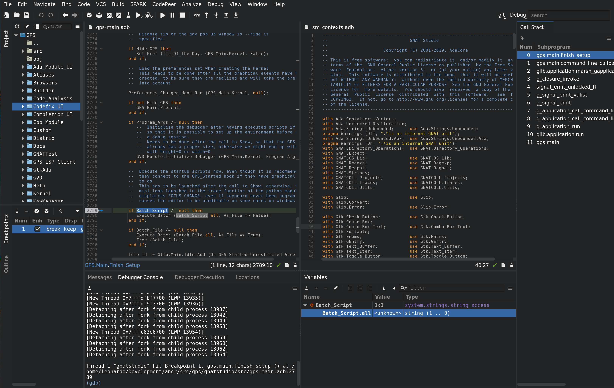
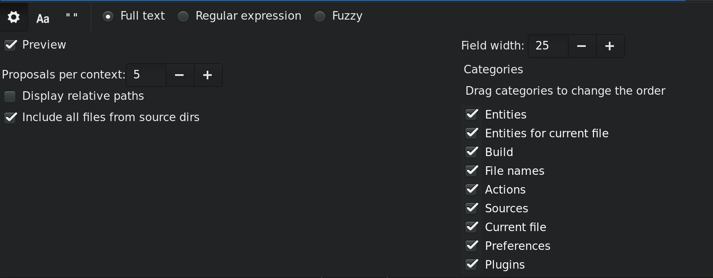
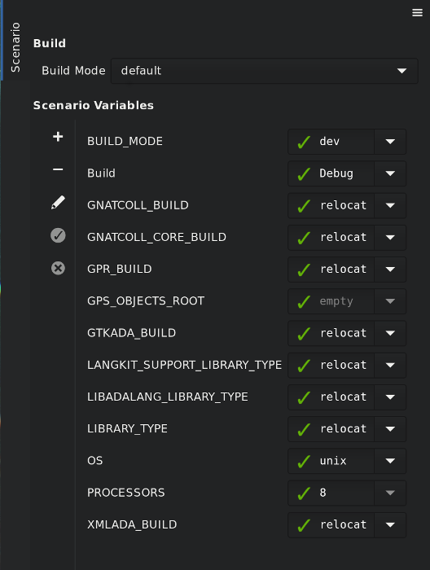
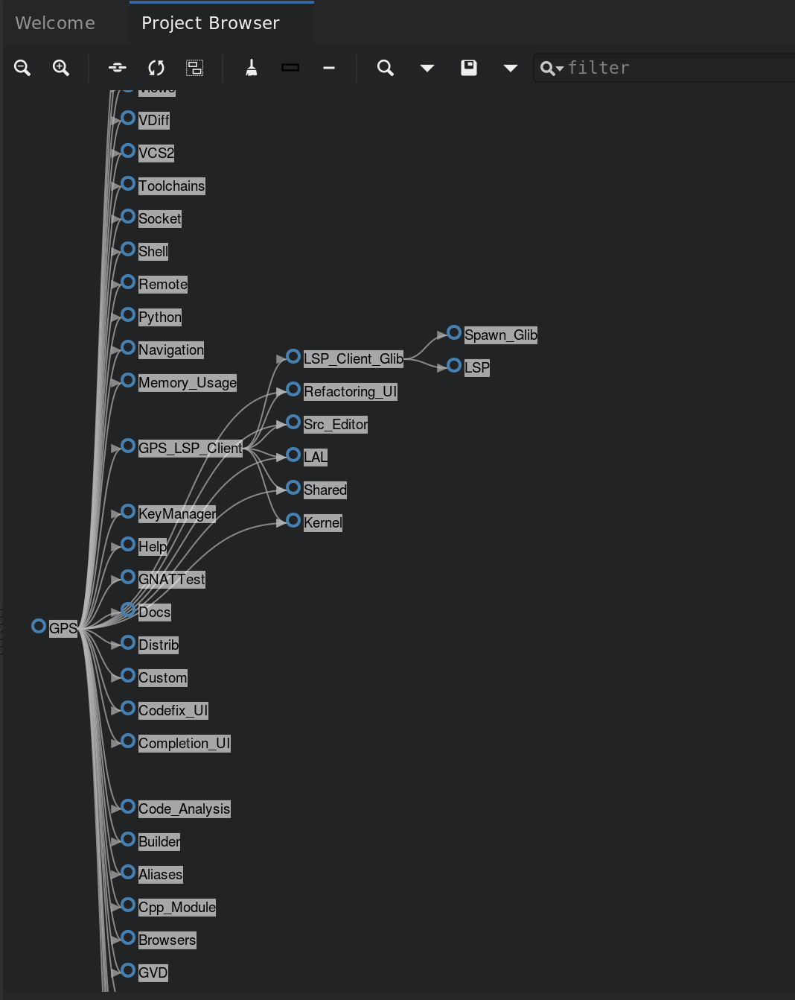

.. index:: windows; main

******************************
Description of the Main Window
******************************

The GNAT Programming Studio has one main window, which is where you perform
most of your work.  However, GPS is very flexible and lets you
organize your desktop many different ways, as discussed in a later section
(:ref:`Multiple_Document_Interface`).

There are also other windows that might pop up at various times, documented
in this section.

.. _The_Work_Space:

The Workspace
=============

.. index:: windows; workspace
.. index:: see: desktop; Multiple Document Interface
.. index:: see: MDI; Multiple Document Interface
.. index:: Multiple Document Interface

The overall workspace is based on a multiple document interface (see
:ref:`Multiple_Document_Interface`) and can contain any number of windows,
the most important of which are usually the editors. However, GPS also
provides a large number of views that you can add to the workspace. The
sections below list them.

Common features of the views
----------------------------

.. index:: menu; tools
.. index:: menu; tools --> views

Some views are part of the default desktop and are visible by default.
Open the other views through one of the submenus of the
:menuselection:`View` menu.

.. index:: windows; local toolbar

Some of the views have their own local toolbar that contains shortcuts to
the most often used features of that view.

.. index:: windows; local settings menu

There is often a button to the right of these local toolbars that opens a
local settings menu. This menu either contains more actions you can perform
in that view or various configuration settings allowing you to change the
behavior or display of the view.

.. index:: windows; filter

Some views also have a filter in their local toolbar.  You can use these
filters to reduce the amount of information displayed on the screen by only
displaying those lines matching the filter.

If you click on the left icon of the filter, GPS brings up a popup menu to
allow you to configure the filter:

* Use the first three entries to choose the search algorithm (full text
  match, regular expression, or fuzzy matching). These modes are similar to
  the ones used in the omni-search (see :ref:`omni_search`).

* The next entry is :guilabel:`Invert filter`. When you select this
  option, lines that do not match the filter are displayed, instead of
  the default behavior of displaying ones that match the filter.  You
  can also enable this mode temporarily by beginning the filter with
  the string :samp:`not:`. For example, a filter in the
  :guilabel:`Locations` view saying :samp:`not:warning` hides all warning
  messages.

* Select the last entry, :guilabel:`Whole word`, when you only want to
  match full words, not substrings.

.. _browsers_features:

Common features of browsers
---------------------------

GPS presents a view of information using an interactive display called a
"browser", which shows a canvas containing boxes you can manipulate.
Browsers provide the following additional capabilities:

* Links

  Boxes can be linked together and remain linked when they are moved.  There
  are different types of links; see the description of the various browsers
  for more details.

  Hide links using a button on the local toolbar. This keeps the
  canvas more readable at the cost of losing information.  You can also
  hide only a subset of links. Even when links are hidden, if you select a
  box, boxes linked to it are still highlighted.

* Scrolling

  When many boxes are displayed, the currently visible area may be too
  small for all of them.  When that happens, GPS adds scrollbars. You can
  also scroll using the arrow keys, or by dragging the background while
  pressing the left mouse button.

* Layout

  GPS organizes the boxes in a browser using a simple layout algorithm,
  which is layer oriented: items with no parents are put in the first
  layer, their direct children are put in the second layer, and so
  on. Depending on the type of browser, these layers are organized either
  vertically or horizontally.  If you move boxes, this algorithm tries to
  preserve their relative positions as much as possible.

  Use the :guilabel:`Refresh layout` button in the local toolbar to
  recompute the layout at any time, including that of boxes you moved.

* Moving boxes

  Move boxes with the mouse. Drag the box by clicking on its title
  bar. The box's links are still displayed during the move, so you can see
  whether it overlaps any other box. If you try to move the box outside the
  visible part of the browser, it is scrolled.

* Selecting boxes

  Select a box by clicking it.

  The title bar of selected boxes is a different color.  All boxes linked
  to them also use a different title bar color and so do the links. This is
  the most convenient way to visualize the relationships between boxes when
  many are present in the browser.

  Use buttons in the local toolbar to either remove the selected boxes or
  remove the boxes that are not selected.

* Zooming

  GPS provides several different zoom levels.  Use the
  :guilabel:`zoom in`, :guilabel:`zoom out`, and :guilabel:`zoom` buttons in
  the local toolbar to change the level and use the latter to explicitly
  select the level you want.

  You can also press the :kbd:`alt` key and use the mouse wheel to zoom in
  or out.

  This capability is generally useful when many boxes are displayed in the
  browser to allow you to get an overview of the layout and the
  relationships between the boxes.

* :index:`export <single: callgraph; export>`

  Export the entire contents of a browser as a :file:`PNG` or
  :file:`SVG` image using the :guilabel:`Export to...` button in the
  local toolbar.

* Hyper-links

  Some boxes contain hyper links, displayed in blue by default, and
  underlined.  Clicking on these generally displays new boxes.

* Contextual menus

  Right-clicking on boxes displays a contextual menu with actions you can
  perform on that box.  These actions are specific to the kind of box you
  clicked.

* Grid

  By default, GPS doesn't display a grid on the canvas. Use the local settings
  menu to show the grid (uncheck :guilabel:`Draw grid`) or to force items to
  align on the grid (:guilabel:`Align on grid`).

Icons for source language entities
__________________________________

Entities in the source code are represented by icons within the various GPS
views (for example, the :guilabel:`Outline` and :guilabel:`Project` views).
These icons indicate both the semantic category of the entity within the
language, such as packages and methods, as well as compile-time visibility.
The icons also distinguish entity declarations from other entities.  The
same icons are used for all programming languages supported by GPS, with
language-specific interpretations for both compile-time visibility and
distinguishing declarations and uses of entities.

These five language categories are used for all supported languages:

* The *package* category's icon is a square.

  .. image:: square_x.png

* The *subprogram* category's icon is a circle.

  .. image:: circle_x.png

* The *type* category's icon is a triangle.

  .. image:: triangle_x.png

* The *variable* category's icon is a dot.

  .. image:: dot_x.png

* The *generic* category's icon is a diamond.

  .. image:: diamond_x.png

These icons are enhanced with decorations, when appropriate, to indicate
compile-time visibility constraints and to distinguish declarations from
completions. For example, icons for entity declarations have a small 'S'
decorator added, denoting a 'spec'.

Icons for 'protected' and 'private' entities appear within an enclosing box
indicating a compile-time visibility constraint. For entities with
'protected' visibility, the enclosing box is gray.  'Private' entities are
enclosed by a red box.  Icons for 'public' entities have no enclosing
box. For example, a variable with 'private' visibility is represented by an
icon consisting of a dot enclosed by a red box.  These additional
decorations are combined when appropriate. For example, the icon
corresponding to the 'private' declaration of a 'package' entity would be a
square, as for any package entity, with a small 'S' added, all enclosed by
a red box.

Language constructs are mapped to categories in a language-specific manner.
For example, C++ namespaces and Ada packages correspond to the *package*
category and C functions and Ada subprograms correspond to the *method*
category.  The *generic* category is a general category representing other
language entities, but not all possible language constructs are mapped to
categories and icons.  (Specifically, the *generic* category does not
correspond to Ada generic units or C++ templates.)

The names of the categories should not be interpreted literally as language
constructs because the categories are meant to be general in order to limit
the number of categories.  For example, the *variable* category includes
both constants and variables in Ada. Limiting the number of categories
maintains a balance between presentation complexity and the need to support
many different programming languages.

Icons for a given entity may appear more than once within a view. For
example, an Ada private type has both a partial view in the visible part of
the enclosing package and a full view in the private part of the package.
A triangle icon will appear for each of the two occurrences of the type
name, one with the additional decoration indicating 'private' visibility.

.. index:: preferences assistant
.. index:: windows; preferences assistant
.. _The_Preferences_Assistant:

The Preferences Assistant
=========================

When starting GPS for the first time, a preferences assistant window opens,
allowing you to configure some general preferences (color theme, key bindings
etc.).

You can skip the remaining pages of the preferences assistant by clicking on
the :guilabel:`Start using GPS` button or by clicking on red cross.

.. index:: welcome dialog
.. index:: windows; welcome dialog
.. _The_Welcome_Dialog:

The Welcome Dialog
==================

.. image:: welcome.png
.. index:: command line; -P
.. index:: project; startup

When GPS starts, it looks for a project file to load so it knows where to
find the sources of your project. This project is often specified on the
command line (via a :command:`-P` switch).  If not, and the current
directory contains only one project file, GPS selects it automatically.
Finally, if you specify the name of a source file to edit, GPS loads a
default project.  If GPS cannot find a project file, it displays a welcome
dialog, giving you the following choices:

* :guilabel:`Create new project`

  Clicking on this button launches an assistant to create a project using one
  of the predefined project templates. This makes it easy to create GtkAda-based
  applications, or applications using the Ada Web Server, for example.

.. index:: project; load existing project

* :guilabel:`Open project`

  Clicking on this button opens up a file browser, allowing you to select
  a project file to load.

.. index:: project; default

* :guilabel:`Start with default`

  Clicking on this button causes GPS to look for a project called
  :file:`default.gpr` in the current directory and load it if found. Otherwise,
  it copies the default project :file:`<prefix>/share/gps/default.gpr` into the
  current directory and loads it. GPS removes this temporary copy when exiting
  or loading another project if you have not modified the copy.

  The default project contains all the Ada source files from the specified
  directory (assuming they use the default GNAT naming scheme :file:`.ads` and
  :file:`.adb`).

  If the current directory is not writable, GPS instead loads
  :file:`<prefix>/share/gps/readonly.gpr`. In this case, GPS runs in a limited
  mode, where some capabilities (such as building and source navigation) are not
  available. This project will not contain any sources.

In addition to these choices, you can also load a recently opened project by
clicking the project of interest in the left-hand pane listing the known recent
projects.

.. index:: tool bar
.. _The_Tool_Bar:

The Tool Bar
============

.. image:: toolbar.png

The tool bar provides shortcuts to some common actions:

* Create a new file
* Open an existing file (see also the omni-search on the right of the bar)
* Save the current file
* Undo or redo last editing
* Go to previous or next saved location

* Multiple customizable
  :index:`buttons <single: build; toolbar buttons>`
  to build, clean, run or debug your project

* multiple
  :index:`buttons <single: debugger; toolbar buttons>` to stop and continue
  the debugger, step to the next instruction, and other similar actions
  when a debugger is running.

.. index:: progress bar
.. index:: tool bar; progress bar

When GPS is performing background actions, such as loading cross-reference
information or all actions involving external processes (including compiling),
it displays a progress bar in the toolbar showing when the current task(s) will
be completed. Click on the button to pop up a window showing the details of
the tasks. This window is a Tasks view, and can be used to pause or interrupt
running tasks (see :ref:`The_Task_Manager`). This window can be discarded by
pressing :guilabel:`ESC` or by clicking anywhere else in the GPS. This window
also disappears when there are no more running tasks.

.. index:: omni-search
.. index:: seealso: search; omni-search
.. _omni_search:

The omni-search
===============

.. image:: omnisearch.png

The final item in the toolbar is "omni-search".  Use this to search for
text in various contexts in GPS, such as filenames (for convenient access
to source files), the entities referenced in your application, and your
code.

There are various ways to use the omni-search:

* The simplest way is to click on it and type the pattern you want to
  find. GPS immediately starts searching in the background for possible
  matching open windows, file names, entities, GPS actions, bookmarks, and
  source files. For each context, GPS display how many matches there are in
  that context but only displays the five matches with the highest score.

  Click on the name of context to search only in that context.  For
  example, if GPS shows 20 file names matching your search (while only
  displaying the five first), click on :guilabel:`file names` to view all
  20 names and exclude the results from all the other contexts.  If you
  click on the context again, GPS again displays the results from all
  contexts.

* If you are searching in a single context, GPS defines a number of actions
  to which you can bind key shortcuts via the
  :menuselection:`Edit --> Preferences...` dialog instead of using the
  above procedure. These actions are
  found in the :guilabel:`Search` category and are called :guilabel:`Global
  Search in context:`. GPS includes a :index:`menu <single: menu; Find -->
  find file in project>` for two of them by default: :menuselection:`Find -->
  Find File in Project` searches filenames, :index:`while <single: menu;
  find --> find entity>` :menuselection:`Find --> Find Entity`
  searches all entities defined in your project.

Each context displays its results slightly differently and clicking on a
result has different effects in each context. For example, clicking on a
file name opens the corresponding file, while clicking on an entity jumps
to its declaration and clicking on a bookmark displays the source file
containing the bookmark.

Press :kbd:`enter` at any point to select the top item in the list of
search results.

.. index:: menu; file --> open from project

You may have no interest in some search contexts.  Disable them by clicking
the :guilabel:`Settings` icon at the bottom-right corner of the completion
popup. The resulting dialog displays a list of all contexts to be searched;
clicking on any of the checkboxes next to the names disables searching that
context.  This list is only displayed when you started the omni-search by
clicking on it in the toolbar. If you started it via :kbd:`shift-F3` or the
equivalent :menuselection:`Find --> Find File in Project...` menu, only a
subset of the settings are displayed.

You can also reorder the contexts from this settings dialog, which affects
the order in which they are searched and displayed. We recommend keeping the
:guilabel:`Sources` context last, because it is the slowest and while GPS
is searching it, cannot search the other, faster, contexts.

In the settings dialog, you can choose whether to display a
:guilabel:`Preview` for the matches. This preview is displayed when you use
the :kbd:`down arrow` key to select some of the search results.  It
displays the corresponding source file or the details for the matching GPS
action or bookmark.  You can also select the number of results to be
displayed for each context when multiple contexts are displayed or the size
of the search field (which depends on how big your screen and the GPS
window are).

One search context looks for file names and is convenient for quickly
opening files. By default, it looks at all files found in any of the source
directories of your project, even if those files are not explicit sources of
the project (for example because they do not match the naming scheme for any
of the languages used by the project). This is often convenient because you
can easily open support files like :file:`Makefiles` or documentation, but
it can also sometimes be annoying if the source directories include too
many irrelevant files. Use the :guilabel:`Include all files from source
dirs` setting to control this behavior.

GPS allows you to choose among various search algorithms:

* :guilabel:`Full Text` checks whether the text you typed appears exactly
  as you specified it within the context (for example, a file name, the
  contents of a file, or the name of an entity).

* :guilabel:`Regular Expression` assumes the text you typed is a valid
  regular expression and searches for it. If it is not a valid regexp, it
  tries to search for the exact text (like :guilabel:`Full Text`).

* :guilabel:`Fuzzy Match` tries to find each of the characters you typed,
  in that order, but possibly with extra characters in between.  This is
  often the fastest way to search, but might requires a bit of getting used
  to. For example, the text :samp:`mypks` matches the file name
  :file:`MY_PacKage.adS` because the letters shown in upper cases are
  contained in the filename.

  When searching within source files, the algorithm is changed slightly, to
  avoid having too many matches. In that context, GPS only allows a close
  approximations between the text you typed and the text it tries to match
  (for example, one or two extra or missing characters).

Select the algorithm to use at the bottom of the popup window containing
the search results.

Once it finds a match, GPS assigns it a score, used to order the results in
the most meaningful way for you. Scoring is based on a number of criteria:

* length of the match

  For example, when searching file names, it is more likely that typing
  'foo' was intended to match 'foo.ads' than 'the_long_foo.ads'.

* the grouping of characters in the match

  As we have seen, when doing a fuzzy match GPS allows extra characters
  between the ones you typed. But the closer the ones you typed are in the
  match result, the more likely it is that this is what you were looking for.

* when was the item last selected

  If you recently selected an item (like a file name), GPS assumes you are
  more likely to want it again and raises its score.

.. index:: views; messages
.. index:: messages
.. index:: console
.. _The_Messages_View:

The :guilabel:`Messages` view
=============================

.. image:: views-messages.png

The :guilabel:`Messages` view, which is read-only, displays information and
feedback about operations, including build output, information about
processes launched, and error messages.

Its local toolbar contains buttons to :guilabel:`Clear` the contents of the
window, as well as :guilabel:`Save` and :guilabel:`Load` from files.  The
latter operation also parses those messages into the :guilabel:`Locations`
window.

The actual output of the compilation is displayed in the
:guilabel:`Messages` view but is also parsed and many of its messages are
displayed more conveniently in the :guilabel:`Locations` view (see
:ref:`The_Locations_View`).  When a compilation finishes, GPS displays the
total elapsed time.

.. index:: menu; tools --> views --> messages

You cannot close the :guilabel:`Messages` view because it might contain
important messages.  If GPS closed it, you can reopen it with the
:menuselection:`View --> Messages` menu.

.. index:: views; locations
.. _The_Locations_View:

The :guilabel:`Locations` View
==============================

GPS uses the :guilabel:`Location` view, which is also read-only, to display
a list of locations in source files (for example, when performing a global
search or displaying compilation results).

It displays a hierarchy of categories, each of which contain files, each,
in turn, containing messages at specific locations. The category describes
the type of messages (for example, search or build results).  If the full
text of a message is too large to be completely shown in the window,
placing the mouse over it pops up a tooltip window with the full text.

Each message in this window corresponds to a line in a source editor.  This
line has been highlighted and has a mark on its left side.  Clicking on a
message brings up an editor pointing to that line.

The :guilabel:`Locations` view provides a local toolbar with the following
buttons:

* :guilabel:`Clear` removes all entries from the view and, depending on
  your settings, may also close the view.

* :guilabel:`Remove` removes the currently selected category, file or
  message as well as the corresponding highlighting in the source editor.

* :guilabel:`Save` saves the contents of the view to a text file for later
  reference.  You cannot load this file back into the :guilabel:`Locations`
  view, but you can load it into the :guilabel:`Messages` view.  However,
  if you plan to reload it later, it is better to save and reload the
  contents of the :guilabel:`Messages` view instead.

* :guilabel:`Expand All` and :guilabel:`Collapse All` shows or hides all
  messages in the view.

* a filter to selectively show or hide some messages.  Filtering is done on
  the text of the message itself (the filter is either text or a regular
  expression).  You can also reverse the filter.  For example, typing
  `warning` in the filter field and reversing the filter :index:`hides
  warning messages <single: build; hiding warning messages>`

The local settings menu contains the following entries:

* :menuselection:`Sort by subcategory`

  Toggle the sorting of messages by sub-categories. This is useful for
  separating warnings from errors in build results. The error messages
  appear first. The default is to sort the message by their location.

* :menuselection:`Sort files alphabetically`

  Sort messages by filenames (sorted alphabetically). The default does not
  sort by filenames to make it easier to manipulate :guilabel:`Locations`
  view while the compilation is proceeding.  (If sorted, the messages might
  be reordered while you are trying to click on them).

* :menuselection:`Jump to first location`

  Every time a new category is created, for example, as a result of a
  compilation or search operation, the first message in that category is
  automatically selected and the corresponding editor opened, and the focus
  is given to the Locations view.

* :menuselection:`Warp around on next/previous`

  Controls the behavior of the :menuselection:`Previous tag` and
  :menuselection:`Next tag` menus (see below).

* :menuselection:`Auto close locations`

  Automatically close this window when it becomes empty.

* :menuselection:`Save locations on exit`

  Controls whether GPS should save and restore the contents of this window
  between sessions.  Be careful, because the loaded contents might not
  apply the next time.  For example, the source files have changed, or
  build errors have been fixed.  So you should not select this option if
  those conditions might apply.

* :menuselection:`Preserve messages`

  Preserve more build errors after recompiling. When the Locations view
  contains build errors, and one of the files is being recompiled, the
  Locations view will now only update the entries for that file,
  rather than removing all build errors.

.. index:: menu; navigate --> previous tag
.. index:: menu; navigate --> next tag

GPS provides two menus to navigate through the locations using the
keyboard: :menuselection:`Navigate --> Previous Tag` and
:menuselection:`Navigate --> Next Tag`. Depending on your settings, they
might wrap around after reaching the first or last message.

You can also bind key shortcuts to these menus via the :menuselection:`Edit
--> Preferences...` menu.

.. index:: codefix
.. index:: build; auto fix errors

In some cases, a wrench icon will be visible on the left of a compilation
message. See :ref:`Code_Fixing` for more information on how to take
advantage of this icon.

.. index:: project view
.. index:: windows; project view
.. _The_Project_View:

The :guilabel:`Project` view
============================

.. image:: project-view.png
.. image:: project-view-flat.png
.. index:: menu; project --> project view
.. index:: menu; tools --> views --> project

The project view displays a representation of the various components of
your project.  By default, it is displayed on the left side of the
workspace.  Select it using the :menuselection:`View --> Project` menu.

.. index:: drag-and-drop

On Windows, you can drop files (for example, from Windows Explorer) into
the project view. If you drop a project file, GPS loads it and it replaces
the current project; if you drop a source file, GPS opens it in a new
editor.

.. index:: search; interactive search in trees
.. _Interactive_Search:

The project view, combined with the file and outline view, provide an
interactive search capability allowing you to quickly search information
currently displayed.  Start typing the text to search when the view has the
focus.  Note that the contents of the :guilabel:`Project` view are computed
lazily, so not all files are known to this search capability before they have
been opened.

This search opens a small window at the bottom of the view where you can
interactively type names.  The first matching name in the tree is selected
when you type it.  Use the :kbd:`up` and :kbd:`down` keys to navigate
through all the items matching the current text.

The various components displayed in the project view are:

*projects*

  Each source file you are working with is part of a project.  Projects are
  a way to record the switches to use for the various tools as well as a
  number of other properties such as the naming schemes for the sources.
  They can be organized into a project hierarchy where a root project can
  import other projects, each with their own set of sources (see
  :ref:`The_Welcome_Dialog` for details on how projects are loaded in GPS).

  The :guilabel:`Project` view displays this project hierarchy: the top
  node is the root project of your application (usually where the source
  file that contains the main subprogram will be located). A node is
  displayed for each imported project and recursively for other imported
  projects.  If a project is imported by several projects, it may appear
  multiple times in the view,

  If you edited the :index:`project <single: projects; limited with>`
  manually and used the :command:`limited with` construct to create cycles
  in the project dependencies, the cycle will expand infinitely. For
  example, if project :file:`a` imports project :file:`b`, which in turn
  imports project :file:`a` through a :command:`limited with` clause, then
  expanding the node for :file:`a` shows :file:`b`. In turn, expanding the
  node for :file:`b` shows a node for :file:`a`, and so on.

  An icon with a pen mark is displayed if the project was modified but not
  saved yet. You can save it at any time by right-clicking the icon.  GPS
  either reminds you to save it before any compilation or saves it
  automatically, depending on your preference settings.

  GPS provides a second display for this project view, which lists all
  projects with no hierarchy: all projects appear only once in the view, at
  the top level. You may find this display useful for deep project
  hierarchies, where it can make it easier to find projects. Activate this
  display using the local settings menu to the right of the
  :guilabel:`Project` view toolbar.

  .. index:: project view; flat view

*directories*

  The files in a project are organized into several directories on
  disk. These directories are displayed under each project node in the
  :guilabel:`Project` view

  .. index:: project view; absolute paths

  You choose whether to see the absolute path names for the directories or
  paths relative to the location of the project by using the local settings
  menu :menuselection:`Show absolute paths` of the :guilabel:`Project`
  view. In all cases, the tooltip displayed when the mouse hovers over a
  file or directory shows the full path.

  Special nodes are created for object and executables directories. No
  files are shown for these.

  .. index:: Show hidden directories

  Use the local setting :guilabel:`Show hidden directories` to select the
  directories to be considered hidden. Use this to hide version control
  directories such as :file:`CVS` or :file:`.svn`.

*files*

  Source files are displayed under the node corresponding to the directory
  containing the file.  Only the source files actually belonging to the
  project (i.e. are written in a language supported by that project and
  follow its naming scheme) are visible.  For more information on supported
  languages, see :ref:`Supported_Languages`.  A file might appear multiple
  times in the :guilabel:`Project` view if the project it belongs to is
  imported by several other projects.

  You can drag a file into GPS. This opens a new editor if the file is not
  already being edited or moves to the existing editor otherwise.  If you
  press :kbd:`shift` while dragging the file and it is already being edited,
  GPS creates a new view of the existing editor.

*entities*

  If you open the node for a source file, the file is parsed by a fast
  parsers integrated in GPS so it can show all entities declared in the
  file. These entities are grouped into various categories that depend on
  the language. Typical categories include subprograms, packages, types,
  variables, and tasks.

  Double-clicking on a file or clicking on any entity opens an editor or
  display showing, respectively, the first line in the file or the line on
  which the entity is defined.

.. index:: search; project view
.. index:: menu; navigate --> find or replace

If you open the search dialog via the :menuselection:`Find --> Find...` menu,
you can search for anything in the :guilabel:`Project`
view, either a file or an entity.  Searching for an entity can be slow if
you have many files and/or large files.

.. index:: locate in project view

GPS also provides a contextual menu, called :menuselection:`Locate in
Project View`, in source editors. This automatically searches for the first
entry in this file in the :guilabel:`Project` view. This contextual menu is
also available in other modules, for example when selecting a file in the
:guilabel:`Dependency` browser.

.. index:: project; reload

The local toolbar of the :guilabel:`Project` view contains a button to
reload the project.  Use this when you have created or removed source files
from other applications and want to let GPS know there might have been
changes on the file system that impact the contents of the current project.

.. index:: menu;project --> edit project properties

It also includes a button to graphically edit the attributes of the
selected project, such as the tool switches or the naming schemes. It
behaves similarly to the :menuselection:`Edit --> Project
Properties...` menu. See :ref:`The_Project_Properties_Editor` for more
information.

If you right click a project node, a contextual menu appears which
contains, among others, the following entries that you can use to
understand or modify your project:

* :menuselection:`Show projects imported by...`
* :menuselection:`Show projects depending on...`

  Open a new window, the :guilabel:`Project` browser, which displays
  graphically the relationships between each project in the hierarchy (see
  :ref:`The_Project_Browser`).

* :menuselection:`Project --> Properties`

  :index:`Opens <single: menu; project --> edit project properties>`
  a new dialog to interactively edit the attributes of the project
  (such as tool switches and naming schemes) and is similar to the local
  toolbar button.

* :menuselection:`Project --> Save project...`

  :index:`Saves <single: project; saving>` a single project in the
  hierarchy after you modified it. Modified but unsaved projects in the
  hierarchy have a special icon (a pen mark on top of the standard
  icon). If you would rather :index:`save all <single: menu; project -->
  save_all>` modified projects in a single step, use the menu bar item
  :menuselection:`Project --> Save All`.

  Any time you modify one or more projects, the contents of the project
  view is automatically refreshed, but no project is automatically
  saved. This provides a simple way to temporarily test new values for the
  project attributes.  Unsaved modified projects are shown with a special
  icon in the project view, a pen mark on top of the standard icon:

  .. image:: project-modified.jpg

* :menuselection:`Project --> Edit source file`

  Loads the project file into an editor so you can edit it.  Use this
  if you need to access some features of the project files that are not
  accessible graphically (such as rename statements and variables).

* :menuselection:`Project --> Dependencies`

  Opens the dependencies editor for the selected project
  (see :ref:`The_Project_Dependencies_Editor`).

* :menuselection:`Project --> Add scenario variable`

  Adds new scenario variables to the project (see
  :ref:`Scenarios_And_Configuration_Variables`). However, you may find it
  more convenient to use the :guilabel:`Scenario` view for this purpose.

.. highlight:: python

All the entries in the local settings menu can be manipulated via python
extensions, which might be useful when writing your own plugins. Here are
examples on how to do that::

    # The 'Show flat view" local setting
    GPS.Preference('explorer-show-flat-view').set(True)

    # The 'Show absolute paths" local setting
    GPS.Preference('explorer-show-absolute-paths').set(True)

    # The 'Show hidden directories' local setting
    GPS.Preference('explorer-show-hidden-directories').set(True)

    # The 'Show empty directories' local setting
    GPS.Preference('explorer-show-empty-directories').set(True)

    # The 'Projects before directories' local setting
    GPS.Preference('explorer-show-projects-first').set(True)

    # The 'Show object directories' local setting
    GPS.Preference('explorer-show-object-dirs').set(True)

    # The 'Show runtime files' local setting
    GPS.Preference('explorer-show-runtime').set(True)

    # The 'Group by directories' local setting
    GPS.Preference('explorer-show-directories').set(True)

.. index:: windows; learn view
.. _The_Learn_View:

The :guilabel:`Learn` view
============================

The :guilabel:`Learn` view's purpose is to help users to familiarize with GPS.

In particular the :guilabel:`Learn` view displays a list of the most commonly
used and useful GPS actions, with their optional key shortcut.

The actual contents of the :guilabel:`Learn` view is filtered depending on the
current context: for instance, the actions related to text editing will only
be listed when an editor is focused. Same thing when it comes to debugging:
the actions related to debugging will only be displayed when a debugger is
running, etc.
This way, you will be able to discover which actions can be executed in a
given context.

Single-clicking on a particular action will display the associated
documentation, providing more details on what the action actually does. You
can also double-click on it if you want to actually run it.

.. index:: project; scenario variables
.. index:: windows; scenario view
.. index:: project; scenario variable
.. _Scenario_View:

The :guilabel:`Scenario` view
=============================

As described in the GNAT User's Guide, project files can be configured
through external variables (typically environment variables). This means
the exact list of source files or the exact switches used to compile the
application can be changed when the value of these external variables is
changed.

GPS provides a simple access to these variables, through a view called the
:guilabel:`Scenario` view. These variables are called `Scenario Variables`,
since they provide various scenarios for the same set of project files.

Each such variable is listed on its own line along with its current value.
Change the current value by clicking on it and selecting the new value
among the ones that pop up.

Across sessions, GPS will remember the values you set for scenario variables.
On startup, the initial values of the scenario variables come, in decreasing
order of priority:

* from the :file:`-X` command line arguments;
* from existing environment variables;
* from the value you set in a previous GPS session;
* from the default set in the project file;
* or else defaults to the first valid value for this variable

Whenever you change the value of any variable, GPS automatically recomputes
the project and dynamically changes the list of source files and
directories to reflect the new status of the project. Starting a new
compilation at that point uses the new switches, and all aspects of GPS are
immediately changed to reflect the new setup.

Create new scenario variables by selecting the :guilabel:`+` icon in the
local toolbar of the :guilabel:`Scenario` view.  Edit the list of possible
values for a variable by clicking on the :guilabel:`edit` button in that
toolbar.  Delete a variable by clicking on the :guilabel:`-` button.

Each of these changes impacts the actual project file (:file:`.gpr`), so
you might not want to make them if you wrote the project file manually
since the impact can be significant.

.. index:: build; build modes

The first line in the :guilabel:`Scenario` view is the current mode. This
impacts various aspects of the build, including compiler switches and
object directories (see :ref:`The_Build_Mode`).  Like scenario variables,
change the mode by clicking on the value and selecting a new value in the
popup window.

If you are not using build modes and want to save some space on the screen,
use the local settings menu :menuselection:`Show build modes` to disable
the display.

.. index:: windows; files view
.. _The_File_View:

The :guilabel:`Files` View
==========================

.. image:: file-view.png
.. index:: menu; tools --> views --> files

In addition to the :guilabel:`Project` view, GPS also provides a
:guilabel:`Files` view through the :menuselection:`View --> Files` menu.

In this view, directories are displayed exactly as they are organized on the
disk (including Windows drives).  You can also explore each source file
explored as described in :ref:`The_Project_View`.  You can also drop files
into the :guilabel:`Files` view to conveniently open a file.

By default, the :guilabel:`Files` view displays all files on disk. You can
set filters through the local settings menu to restrict the display to the
files and directories belonging to the project (use the
:menuselection:`Show files from project only` menu).

.. index:: windows, windows view
.. _The_Windows_View:

The :guilabel:`Windows` view
============================

.. image:: views-windows-flat.png
.. image:: views-windows-notebooks.png
.. index:: menu; tools --> views --> windows

The :guilabel:`Windows` view displays the currently opened windows.  Open
it via the :menuselection:`View --> Windows` menu.

In the contextual menu, you can configure the display in one of two ways:

* Sorted alphabetically
* Organized by notebooks, as in the GPS window itself. This view
  is particularly useful if you have many windows open.

You can also choose, through the local configuration menu, whether only source
editors should be visible or whether all windows should be displayed.

This view allows you to quickly select and focus on a particular window by
clicking the corresponding line. If you leave the button pressed, you can
drag the window to another place on the desktop (see the description of the
:ref:`Multiple_Document_Interface`)

Select multiple windows by clicking while pressing the control or shift keys.
You can then click in on the first button in the local toolbar to close all
selected windows at once, which is a fast way to clean up your desktop after
you have finished working on a task.

.. index:: windows, outline
.. index:: outline view
.. _The_Outline_View:

The :guilabel:`Outline` view
============================

.. image:: views-outline-default.png
.. image:: views-outline-flat-group.png
.. image:: outline-view3.png
.. index:: menu; tools --> views --> outline

The :guilabel:`Outline` view, which you activate through the
:menuselection:`View --> Outline` menu, shows the contents of
the current file.

Exactly what is displayed depends on the language of the file. For Ada, C
and C++ files, this view displays the list of entities declared at the
global level in your current file (such as Ada packages, C++ classes,
subprograms, and Ada types).  This view is refreshed whenever the current
editor is modified.

Clicking on any entity in this view automatically jumps to the
corresponding line in the file (the spec or the body).

The local settings menu contains multiple check boxes you can use to alter
how the outline view is displayed:

* :guilabel:`Show profiles`

  Indicates whether the list of parameters of the subprograms should be
  displayed. This is particularly useful for languages allowing overriding
  of entities.

* :guilabel:`Show types`, :guilabel:`Show objects`, :guilabel:`Show tasks,
  entries, and protected types`, :guilabel:`Show with clauses`

  Controls the display of the specified categories of entities.

* :guilabel:`Show specifications`

  Indicates whether GPS displays a line for the specification (declaration)
  of entities in addition to the location of their bodies.

* :guilabel:`Sort alphabetically`

  Controls the order in which the entities are displayed (either
  alphabetically or in the same order as in the source file).

* :guilabel:`Flat View`

  Controls whether the entities are always displayed at the top level of
  the outline view. When disabled, nested subprograms are displayed below
  the subprogram in which they are declared.

* :guilabel:`Group spec and body`

  Displays up to two icons on each line (one for the spec and one for the
  body if both occur in the file).  Click on one of the icons to go
  directly to that location. If you click on the name of the entity, you are
  taken to its declaration unless it is already the current location in the
  editor, in which case you are taken to its body.

* :guilabel:`Group names by category`

  With this option enabled it is possible to collapse each entity type
  (package, type, pragma, sub-program, etc.) to a single line in the
  Outline View. This works only in Flat View mode, so turning this option
  on makes the Flat View automatically enabled.

* :guilabel:`Dynamic link with editor`

  Causes the current subprogram to be selected in the outline view each
  time the cursor position changes in the current editor.  This option
  will slow down GPS.

.. index:: windows; clipboard
.. _The_Clipboard_View:

The :guilabel:`Clipboard` view
==============================

.. image:: views-clipboard.png

GPS has an advanced mechanism for handling copy/paste operations.

.. index:: preferences; clipboard size
.. index:: menu; edit --> copy
.. index:: menu; edit --> cut

When you click the :menuselection:`Edit --> Copy` or :menuselection:`Edit
--> Cut` menu, GPS adds the current selection to the clipboard.  However,
unlike many applications, GPS does not discard the previous contents of the
clipboard, but instead saves it for future use.  By default, up to 10
entries are saved, but you can change that number using the
:guilabel:`Clipboard Size` preference.

.. index:: menu; edit --> paste
.. index:: menu; edit --> paste previous

When you select the :menuselection:`Edit --> Paste` menu, GPS pastes the
last entry added to the clipboard at the current location in the editor.
If you then immediately select :menuselection:`Edit --> Paste Previous`,
this newly inserted text is removed and GPS instead inserts the second to
last entry.  You can keep selecting the same menu to insert progressively
older entries.

This mechanism allows you to copy several noncontiguous lines from one
place in an editor, switch to another editor, and paste all those lines
without having to go back and forth between the two editors.

.. index:: menu; tools --> views --> clipboard

The :guilabel:`Clipboard` view graphically displays what is currently stored
in the clipboard. Open it via the :menuselection:`View --> Clipboard` menu.

That view displays a list of entries, each of which is associated with one
level of the clipboard. The text displayed for each entry is its first line
containing non blank characters with leading characters omitted. GPS
prepends or appends :samp:`[...]` if the entry is truncated.  If you hover
over an entry, a tooltip pops up displaying all lines in the entry.

In addition, one entry has an arrow on its left. This indicates the entry
to be pasted if you select the :menuselection:`Edit --> Paste` menu. If you
instead select the :menuselection:`Edit --> Paste Previous` menu, the entry
below that is inserted instead.

If you double-click any of these entries, GPS inserts the corresponding
text in the current editor and makes the entry you click current, so
selecting :menuselection:`Edit --> Paste` or the equivalent shortcut will
insert that same entry again.

The local toolbar in the clipboard view provides two buttons:

* :guilabel:`Append To Previous`.

  The selected entry is appended to the one below and removed from the
  clipboard so that selecting :menuselection:`Edit --> Paste` pastes the
  two entries simultaneously.  Use this when you want to copy lines from
  separate places in a file, merge them, and paste them together one or
  more times later, using a single operation.

* :guilabel:`Remove`.

  The selected entry is removed from the clipboard.

The :guilabel:`Clipboard` view content is preserved between GPS sessions.
However very large entries are removed and replaced with an entry saying
"[Big entry has been removed]".

.. index:: windows; call trees
.. index:: windows; callgraph browser
.. index:: callgraph
.. _The_Callgraph_View:

The :guilabel:`Call trees` view and :guilabel:`Callgraph` browser
=================================================================

These two views play similar roles in that they display the same
information about entities, but in two different ways: the :guilabel:`Call
tree` view displays the information in a tree, easily navigable and perhaps
easier to manipulate when lots of entities are involved, and the
:guilabel:`Callgraph` browser displays the information as graphical boxes
that you can manipulate on the screen.  The latter is best suited to
generate a diagram that you can later export to your own documents.

These views are used to display the information about what subprograms are
called by a given entity, and what entities are calling a given subprogram.

Some references are displayed with an additional "(dispatching)" text,
which indicates the call to the entity is not explicit in the sources but
could potentially occur through dynamic dispatching.  (This depends on what
arguments are passed to the caller at run time; it is possible the
subprogram is in fact never called.)

.. index:: contextual menu; calls
.. index:: contextual menu; called by

Call Trees
----------

The :guilabel:`Call trees` are displayed when you select one of the
contextual menus :menuselection:`<entity> calls` and
:menuselection:`<entity> is called by`. Every time you select one of
these menus, a new view is opened to display that entity.

Expand a node from the tree by clicking on the small expander arrow on the
left of the line.  Further callgraph information is computed for the
selected entity, making it very easy to get the information contained in a
full callgraph tree.  Closing and expanding a node again recomputes the
callgraph for the entity.

The right side of the main tree contains a list displays the locations of
calls for the selected entity.  Click on an entry in this list to open an
editor showing the corresponding location.

The :guilabel:`Call tree` supports keyboard navigation: :kbd:`Up` and
:kbd:`Down` keys navigate between listed locations, :kbd:`Left` collapses
the current level, :kbd:`Right` expands the current level, and
:kbd:`Return` jumps to the currently selected location.

The contents of the calltree is not restored when GPS is restarted because
its contents might be misleading if the sources have changed.

The local toolbar provides the following buttons:

* :guilabel:`Clear`

  Remove all entries from the Callgraph View.

* :guilabel:`Remove entity`

  Remove the selected entity from the Callgraph View.

* :guilabel:`Collapse all`

  Collapse all the entities in the Callgraph View.

.. _Call_Graph:

Callgraph browser
-----------------

.. image:: browsers-call_tree.png

The :guilabel:`Callgraph` browser graphically displays the relationship
between subprogram callers and callees. A link between two items indicates
one of them is calling the other.

.. index:: renaming entities; in callgraph

GPS provides special handling for renamed entities (in Ada): if a
subprogram is a renaming of another, both items are displayed in the
browser with a special hashed link between the two. Since the renamed
subprogram does not have a proper body, you need to ask for the subprograms
called by the renamed entity to get the list.

In this browser, clicking on the right arrow in the title bar displays all
the entities called by the selected item.  Clicking on the left arrow
displays all the entities that call the selected item (i.e. its callers).

.. index:: contextual menu; browsers --> calls
.. index:: contextual menu; browsers --> calls (recursively)
.. index:: contextual menu; browsers --> called by

Open this browser by right-clicking on the name of an entity in a source
editor or :guilabel:`Project` view and selecting one of the
:menuselection:`Browsers --> <entity> calls`, :menuselection:`Browsers -->
<entity> calls (recursive)`, or :menuselection:`Browsers --> <entity> is
called by` menus.

All boxes in this browser display the location of their declaration and the
list of all references in the other entities currently displayed in the
browser. If you close the box for an entity that calls them, the matching
references are also hidden.

If you right-click on the title of one of the entity boxes, you get the
same contextual menu as when you click on the name of an entity in an
editor, with the additional entries:

* :menuselection:`Go To Spec`

  Open a source editor displaying the declaration of the entity.

* :menuselection:`Go To Body`

  Open a source editor displaying the body of the entity.

* :menuselection:`Locate in Project View`

  Move the focus to the project view, and select the first node
  representing the file in which the entity is declared. This makes it
  easier to see which other entities are declared in the same file.

See also :ref:`browsers_features` for more capabilities of the GPS browsers.

.. index:: windows; bookmarks
.. index:: bookmark
.. _Bookmarks:

The :guilabel:`Bookmarks` view
==============================

Basic usage: Creating a new bookmark
------------------------------------

The basic usage of bookmarks is as follows: you open a source editor and
navigate to the line of interest. You can then create a new bookmark by either
using the menu :menuselection:`Navigate --> Add Bookmark` or by opening the
:guilabel:`Bookmarks` view (:menuselection:`View --> Bookmarks`) and
then clicking on the [+] button in the local toolbar. In both cases, the
:guilabel:`Bookmarks` view is opened, a new bookmark is created and selected so
that you can immediately change its name.

The default name of bookmark is the name of the enclosing subprogram and the
initial location of the bookmark (`file:line`). But you can start typing a new
name, and press Enter to finally create the bookmark.

In practice, this is really just a few clicks (one of the menu and press
:kbd:`Enter` to use the new name), or even just two key strokes if you have set
a keyboard shortcut for the menu, via the Preferences dialog.

At any point in time, you can rename an existing bookmark by either clicking on
the button in the local toolbar, or simply with a long press on the bookmark
itself.

Note the goto icon on the left of the editor line 1646, which indicates there
is a bookmark there, as well as the colored mark in the editor scrollbar that
helps navigate in the file.

Even though the default name of the bookmark includes a file location, the
major benefit of the bookmarks is that they will remain at the same location as
the text is edited. In our example, if we add a new subprogram before
`Display_Splash_Screen`, the bookmark will still point at the line containing
the call to `Gtk_New`, even though that line might now be 1700 for instance.

Of course, GPS is not able to monitor changes that you might do through other
editors, so in this case the marks might be altered and stop pointing to the
expected location.

Adding more bookmarks
---------------------

We can create any number of bookmarks, and these have limited impact on
performance. So let's do that and create a few more bookmarks, in various
files. As you can see in the scrollbar of the editor, we have two bookmarks set
in the file bookmark_views.adb, and we can easily jump to them by clicking on
the color mark.

But of course, it is much simpler to double-click inside the
:guilabel:`Bookmarks` view itself, on the bookmark of interest to us.

At this point, we have a rather long unorganized list of bookmarks, let's
improve.

Organizing bookmarks into groups
--------------------------------

When we create new bookmarks, GPS adds them at the top of the list. We might
want to organize them differently, which we can do simply with a drag and drop
operation: select the bookmark, keep the mouse pressed, and move it to a better
place in the list.

Things become more interesting when you drop a bookmark on top of another one.
In this case, GPS creates a group that contains the two bookmarks (and that
basically behaves like a folder for files). The group is immediately selected
so that you can rename it as you see fit.

In our example, we created two groups, corresponding to two features we are
working on.

Groups can be nested to any depth, providing great flexibility. So let's create
two nested groups, which we'll name TODO, beneath the two we have created. This
is a great way to create a short todo list: one top-level group for the name of
the feature, then below one group for the todo list, and a few additional
bookmarks to relevant places in the code.

To create these additional groups, we will select the Source editor group, then
click on the :guilabel:`Create New Group` button in the local toolbar, and type
"TODO<enter>". This will automatically add the new group beneath Source editor.
Let's do the same for the bookmarks groups. These two groups are empty for now.

Let's add new entries to them. if we already know where code should be added to
implement the new todo item, we can do as before: open the editor, select the
line, then click on the :guilabel:`[+]` button. Most often, though, we don't
yet know where the implementation will go.

So we want to create an unattached bookmark. Using the name bookmark here is
really an abuse of language, since these have no associated source location.
But since they are visible in the :guilabel:`Bookmarks` view, it is convenient
to name them bookmarks.

To create them, let's select one of the TODO groups, then select the
:guilabel:`Create Unattached Bookmark` in the local toolbar, and immediately
start typing a brief description of the todo. As you can see in the screenshot,
these bookmarks do not have a goto icon, since you cannot double click on them
to jump to a source location.

When you :guilabel:`delete` a group, all bookmarks within are also deleted. So
once you are done implementing a feature, simply delete the corresponding group
to clean up the bookmarks view.

Adding notes
------------

The short name we gave the bookmark is not enough to list all the great ideas
we might have for it. Fortunately, we can now add notes to bookmarks, as a way
to store more information.

Let's select the "write a blog post" item, then click on the :guilabel:`Edit
Note` button in the local toolbar. This opens a small dialog with a large text
area where we can type anything we want. Press :guilabel:`Apply` to save the
text.

Note how a new tag icon was added next to the bookmark, to indicate it has more
information. You can view this information in one of three ways:

  * select the bookmark, and click again on the :guilabel:`Edit Note` button as before

  * :guilabel:`double-click` on the tag icon.

  * leave the mouse hover the bookmark line. This will display a tooltip with
    extra information on the bookmark: its name, its current location and any
    note it might have. This is useful if you only want to quickly glance at
    the notes for one or more bookmarks

Add note with drag and drop
---------------------------

Sometimes, though, you want to associate code with the note (i.e. the bookmark
should not only point to a location, but you also want to remember the code
that was in that location). The simplest to do this is to select the text in
the editor, and then drag and drop the selected text directly onto the
bookmark. This will create a note (if needed) or add to the existing note the
full selected text.

In the tooltips, we use a non-proportional font, so that the code is properly
rendered and alignment preserved.

Filtering bookmarks
--------------------

If you start creating a lot of bookmarks, and even if you have properly
organized them into groups, it might become difficult to find them later on. So
we added a standard filter in the local toolbar, like was done already for a
lot of other views. As soon as you start typing text in that filter, only the
bookmarks that match (name, location or note) are left visible, and all the
others are hidden.

Favorite files
--------------

GPS provides a large number of ways to navigate your code, and in particular to
open source files. The most efficient one is likely the omni-search (the search
field at the top-right corner).

But some users like to have a short list of favorite files that they go to
frequently. The :guilabel:`Bookmarks` view can be used to implement this.

Simply create a new group (here named `Favorite` files), and create one new
bookmark in this group for each file you are interested in. I like to create
the bookmark on line 1, but I always remove the line number indication in the
name of the bookmark since the exact line is irrelevant here.

.. index:: consoles; python console
.. index:: consoles; shell console
.. index:: python; console
.. _The_Python_Console:

The :guilabel:`Python` Console
==============================

.. image:: shell-window.png

These consoles provide access to the various scripting languages supported
by GPS, allowing you to type interactive commands such as editing a file or
compiling without using the menu items or the mouse.

.. index:: menu; tools --> consoles --> Python

The menu :menuselection:`View --> Python` opens the python
console. Python is the preferred language to customize GPS (many more
details will be provided in later sections of this documentation).  The
console is mostly useful for testing interactive commands before you use
them in your own scripts.

See :ref:`Scripting_GPS` for more information on using scripting languages
within GPS.

Both consoles provide a history of previously typed commands.  Use the
:kbd:`up` and :kbd:`down` keys to navigate through the command history.

.. index:: consoles; os shell
.. index:: bash
.. index:: vi
.. index:: plugins; shell.py

The OS Shell Console
====================

.. index:: menu; tools --> consoles --> OS Shell

GPS also provides an OS shell console, providing an access to the underlying
OS shell (as defined by the :samp:`{SHELL}` or :samp:`{COMSPEC}`
environment variables).

Open this console via the :menuselection:`View --> OS Shell`
menu, which is available only if the plugin :file:`shell.py` was loaded in
GPS (the default).  Check the documentation of that plugin, which lists a
few settings that might be useful.

This console behaves like the standard shell on your system, including
support for ANSI sequences (and thus color output). For example, it has
been used to run :program:`vi` within GPS.

.. index:: run
.. index:: build; executing application
.. index:: windows; execution window
.. _The_Execution_Window:

The Execution window
====================

.. index:: menu; build --> run

When a program is launched using the :menuselection:`Build --> Run` menu,
GPS creates a new execution window allowing input and output for the
program.  To allow post-mortem analysis and copy/pasting, GPS does not close
execution windows when the program terminates; you must close them
manually.  If you try to close the execution window while the program is
still running, GPS displays a dialog window asking if you want to kill it.

.. index:: tasks
.. index:: windows; tasks view
.. _The_Task_Manager:

The :guilabel:`Tasks` view
============================

.. image:: task-manager.png

The :guilabel:`Tasks` view displays all running GPS
operations currently running in the background, such as builds,
searches, or VCS commands.

For each task, the :guilabel:`Tasks` view displays its status and current
progress.  Suspend the execution of a task by clicking the small
:guilabel:`pause` button next to the task. Or kill a task by clicking the
:guilabel:`interrupt` button.

.. index:: menu; view --> tasks

Open the :guilabel:`Tasks` view by double clicking on the progress bar in
 the main toolbar or using the :menuselection:`View --> Tasks`
menu.  You can move it placed anywhere on your desktop.

If there are tasks running when exiting GPS, it displays a window showing
those tasks. You can kills all remaining tasks and exit by pressing the
confirmation button or continue working in GPS by pressing the
:guilabel:`Cancel` button.

.. index:: windows; project browser
.. index:: project; viewing dependencies
.. _The_Project_Browser:

The :guilabel:`Project Browser`
===============================

The :guilabel:`Project` browser shows the dependencies between all projects
in the project hierarchy. Two items in this browser are linked if one of
them imports the other.

Access it through the contextual menu in the :guilabel:`Project` view by
selecting the :menuselection:`Show projects imported by...` menu when
right-clicking on a project node.

Click on the left arrow in the title bar of a project to display all
projects that import that project.  Click on the right arrow to display all
projects imported by that project.

Right-clicking on a project brings up a menu containing several items. Most
are added by the project editor and provide direct access to such features
as editing the properties of the project, adding dependencies.

Some items in the menu are specific to the :guilabel:`Project Browser`:

* :menuselection:`Locate in Project View`

  Switch the focus to the :guilabel:`Project` view and highlight the first
  project node matching the project.  This is a convenient way to get
  information such as the list of directories or source files for a
  project.

* :menuselection:`Show projects imported by...`

  Like the right arrow in the title bar, displays all the projects in the
  hierarchy that are directly imported by the selected project.

* :menuselection:`Show projects imported by ... (recursively)`

  Display all dependencies recursively for the project (i.e., the projects
  it imports directly and the projects they import).

* :menuselection:`Show projects importing...`

  Like the left arrow in the title bar, display all the projects that
  directly import the selected project.

See also :ref:`browsers_features` for more capabilities of the GPS browsers.

.. index:: views; dependency browser
.. index:: project; dependencies
.. _The_Dependency_Browser:

The :guilabel:`Dependency Browser`
==================================

.. image:: dependency-browser.png

The dependency browser displays dependencies between source files. Each
item in the browser represents one source file.  Click on the right arrow
in the title bar to display the list of files the selected file depends
on. A file depends on another if it explicitly imports it (:command:`with`
statement in Ada, or :command:`#include` in C/C++).  Implicit dependencies
are currently not displayed in this browser since you can access that
information by opening the direct dependencies.  Click on the left arrow in
the title bar to display the list of files that depend on the selected
file.

This browser is accessible through the contextual menu in the
:guilabel:`Project` view by selecting one of the following entries:

* :menuselection:`Show dependencies for ...`

  Like clicking on the right arrow for a file already in the browser,
  displays the direct dependencies for that file.

* :menuselection:`Show files depending on ...`

  Like clicking on the left arrow for a file already in the browser,
  displays the list of files that directly depend on that file.

The background contextual menu in the browser adds a few entries to the
standard menu:

* :menuselection:`Open file...`

  Display an external dialog where you can select the name of a file to
  analyze.

* :menuselection:`Recompute dependencies`

  Check that all links displays in the dependency browser are still
  valid. Any that not are removed. The arrows in the title bar are also
  reset if new dependencies were added for the files.  Also recompute the
  layout of the graph and changes the current position of the boxes.
  However, the browser is not refreshed automatically, since there are many
  cases where the dependencies might change.

* :menuselection:`Show system files`

  Indicates whether standard system files (runtime files for instance in
  the case of Ada) are displayed in the browser. By default, these files
  are only displayed if you explicitly select them through the
  :menuselection:`Open file` menu or the contextual menu in the project
  view.

* :menuselection:`Show implicit dependencies`

  Indicates whether implicit dependencies should also be displayed for
  files. Implicit dependencies are ones required to compile the selected
  file but not explicitly imported through a :command:`with` or
  :command:`#include` statement. For example, the body of a generic in Ada is
  an implicit dependency.  Whenever an implicit dependency is modified, the
  selected file should be recompiled as well.

The contextual menu available by right clicking on an item also contain
these entries:

* :menuselection:`Analyze other file`

  Open a new item in the browser, displaying the files associated with the
  selected one. In Ada, this is the body if you clicked on a spec file, or
  vice versa. In C, it depends on the naming conventions you specified in
  the project properties, but it generally goes from a :file:`.h` file to a
  :file:`.c` file and back.

* :menuselection:`Show dependencies for ...`

  These have the same function as in the project view contextual menu

See also :ref:`browsers_features` for more capabilities of GPS browsers.

.. index:: windows; elaboration circularities
.. index:: build; elaboration circularities
.. _Elaboration_Cycles_Browser:

The :guilabel:`Elaboration Circularities` browser
=================================================

GPS detects elaboration cycles reported by build processes and constructs a
visual representation of elaboration dependencies in an
:guilabel:`Elaboration Cycles` browser.

This visual representation depicts program units as items in the browser
and direct dependencies between program units as links.  All units involved
in a dependency cycle caused by the presence of a :command:`pragma
Elaborate_All` (whether explicit or implicit) are also presented and
connected by links labeled "body" and "with".

.. index:: preferences; browsers --> show elaboration cycles

The preference :menuselection:`Browsers --> Show elaboration cycles` controls
whether to automatically create a graph from cycles listed in build output.

See also :ref:`browsers_features` for more capabilities of GPS browsers.

.. index:: windows; entity browser
.. _Entity_Browser:

The :guilabel:`Entity` browser
==============================

.. image:: entity-browser.png

The :guilabel:`Entity` browser displays static information about any source
entity.  What is displayed for each entity depends on the type of the
entity, but are normally other entities.  For example:

* :samp:`Ada record / C struct`

  The list of fields is displayed.

* :samp:`Ada tagged type / C++ class`

  The list of attributes and methods is displayed.

* :samp:`Subprograms`

  The list of parameters is displayed

* :samp:`Packages`

  The list of all the entities declared in that package is displayed

Access this browser via the :menuselection:`Browsers --> Examine entity`
contextual menu in the project view and source editor when clicking on an
entity.

Most entities displayed are clickable (by default, they appear as
underlined blue text). Clicking on one opens a new item in the entity
browser for the selected entity.

You can display the parent entities for an entity. For example, in a C++
class or Ada tagged type, this is the type it derives from.  Display the
parent by clicking on the up arrow in the title bar of the entity.

Similarly, you can display child entities (for example, types that derive
from the item) by clicking on the down arrow in the title bar.

An extra button appears in the title bar for the C++ class or Ada tagged
types that toggles whether the inherited methods (or primitive operations
in Ada) should be displayed. By default, only new methods, or ones that
override an inherited one, are displayed. The parent's methods are not
shown unless you click on this button.

See also :ref:`browsers_features` for more capabilities of GPS browsers.

.. index:: file selector
.. index:: Windows
.. _The_File_Selector:

The File Selector
=================

The file selector is a dialog used to select a file. On Windows, the
default is to use the standard file selection widget. On other platforms,
the file selector provides the following contents:

* A tool bar on the top consists of five buttons:

  - :guilabel:`left arrow` go back in the list of directories visited
  - :guilabel:`right arrow` go forward
  - :guilabel:`up arrow` go to parent directory
  - :guilabel:`refresh` refresh the contents of the directory
  - :guilabel:`home` go to home directory (value of the HOME environment
    variable, or :file:`/` if not defined)

* A list with the current directory and the last directories explored.
  Modify the current directory by modifying the text entry and pressing
  :kbd:`Enter` or by clicking on the right arrow and choosing a previous
  directory in the pop down list displayed.

* A directory tree.  Open or close directories by clicking on the
  :guilabel:`+` and :guilabel:`-` icons on the left of the directories or
  navigate using the keyboard keys: :kbd:`up` and :kbd:`down` to select the
  previous or next directory, :kbd:`+` and :kbd:`-` to expand and collapse
  the current directory, and :kbd:`backspace` to select the parent
  directory.

* A filter area. Depending on the context, one of several filters are
  available to select only a subset of files to display. The filter
  :guilabel:`All files` is always available and displays all files in the
  selected directory.

* A file list. This area lists the files contained in the selected
  directory.  If you specified a filter, only the matching files are
  displayed. Depending on the context, the list of files may include
  additional information about the files such as the type of file or its
  size.

* A file name area. This area displays the name of the current file, if
  any.  You can also type a file or directory name, with file completion
  provided by the :kbd:`Tab` key.

* A button bar with the :guilabel:`OK` and :guilabel:`Cancel` buttons.
  When you have selected the desired file, click :guilabel:`OK` to confirm or
  click :guilabel:`Cancel` at any time to cancel the file selection.
