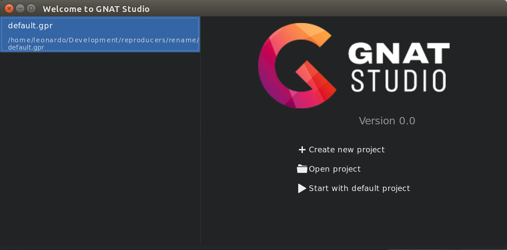
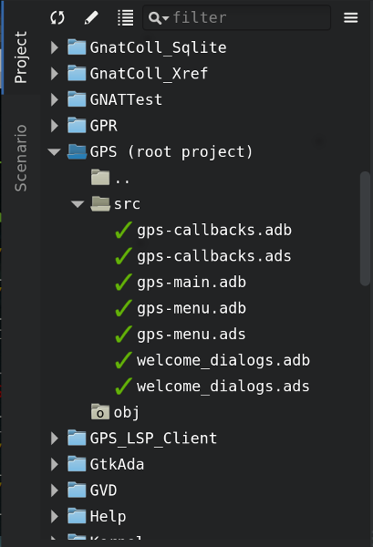

.. index:: windows; main

******************************
Description of the Main Window
******************************

The GNAT Programming Studio has one main window, where most
of your work will be performed. However, it is also very flexible
in how it lets you organize your desktop, which will be discussed
in a later section (:ref:`Multiple_Document_Interface`).

But there are also various other windows that might pop up at
various times, and this section documents them.

.. _The_Work_Space:

The Workspace
=============

.. index:: windows; workspace
.. index:: see: desktop; Multiple Document Interface
.. index:: see: MDI; Multiple Document Interface
.. index:: Multiple Document Interface

The whole work space is based on a multiple document interface,
:ref:`Multiple_Document_Interface`. It can contain any number of
windows, the most important of which are probably the editors. However,
GPS also provides a large number of views that can be added to the
workspace. The following sections will list them all.

Common features of the views
----------------------------

.. index:: menu; Tools
.. index:: menu; Tools --> Views

Some views are part of the default desktop, and thus are visible by default.
The other views can always be opened through one of the submenus of the
:menuselection:`Tools` menu, most often :menuselection:`Tools-->Views`.

.. index:: windows; local toolbar

Some of the view have their own local toolbar that contains shortcuts
to the most often used features of the view.

.. index:: windows; local settings menu

To the right of these local toolbars, there is often a button to open
a local settings menu. This menu can contain more actions that can be
performed in this view, or various configuration settings that affect
the behavior or the display of the view.

.. index:: windows; filter

Some of the views also have a filter in their local toolbar. These
filters can be used to reduce the amount of information that is
displayed on the screen, by only leaving those lines that match
the filter.

If you click on the left icon of the filter, this will bring up a
popup menu to configure the filter:

* The first three entries are used to chose the search algorith (from
  full text match, to regular expression, to fuzzy matching). These
  modes are similar to the ones used in the omni-search (:ref:`omni_search`).

* The next entry is :guilabel:`Revert filter`. When this is selected, the
  lines that do not match the filter are displayed, as opposed to the ones
  that match the filter otherwise. This mode can also be enabled temporarily
  if you start the filter with the string `not:`. For instance, a filter
  in the :guilabel:`Locations` view that says `not:warning` will hide all
  warning messages.

* The last entry :guilabel:`Whole word` should be used when you only want
  to match on full words, not on substrings.

.. _browsers_features:

Common features of the browsers
-------------------------------

A number of the views described below are interactive displays called
browsers. They represent their information as boxes that can be manipulated
with the mouse, and provide the following additional capabilities:

* Scrolling

  When a lot of items are displayed in the canvas, the currently visible area
  might be too small to display all of them. In this case, scrollbars will be
  added on the sides, so that you can make other items visible. Scrolling can
  also be done with the arrow keys.

* Layout

  A basic layout algorithm is used to organize the items. This algorithm is
  layer oriented: items with no parents are put in the first layer, then their
  direct children are put in the second layer, and so on. Depending on the type
  of browser, these layers are organized either vertically or horizontally.
  This algorithm tries to preserve as much as possible the positions of the
  items that were moved interactively.

  The :guilabel:`Refresh layout` button in the local toolbar can be used
  to recompute the layout of items at any time, even for items that were
  previously moved interactively.

* Interactive moving of items

  Items can be moved interactively with the mouse. Click and drag the item by
  clicking on its title bar. The links will still be displayed during the move,
  so that you can check whether it overlaps any other item. If you are trying
  to move the item outside of the visible part of the browser, the latter will
  be scrolled.

* Selecting items

  Items can be selected by clicking on them. Multiple items can be selected
  by holding the :kbd:`control` key while clicking in the item. Alternatively,
  you can click and drag the mouse inside the background of the browser. All
  the items found in the selection rectangle when the mouse is released will be
  selected.

  Selected items are drawn with a different title bar color. All items linked
  to them also use a different title bar color, as well as the links. This is
  the most convenient way to understand the relationships between items when
  lots of them are present in the browser.

  Buttons in the local toolbar are provided to remove either the selected
  items, or on the contrary the ones that are not selected.

* Links

  Items can be linked together, and will remain connected when items are moved.
  Different types of links exist, see the description of the various browsers.

  The local toolbar provides a button to hide the display of the links. This
  will keep the canvas more readable, at the cost of losing some information.
  You can also hide only a subset of the links. Even when the links are hidden,
  if you select an item then the items linked to it will still be highlighted.

  The local settings menu in browsers has an option :guilabel:`straight links`
  which can be toggled if you prefer to have orthogonal links.

* Exporting :index:`image` :index:`callgraph; export`

  The entire contents of a browser can be exported as a :guilabel:`PNG` or
  :guilabel:`SVG` images using the entry :guilabel:`Export to...` in the local
  toolbar.

* Zooming

  Several different zoom levels are available. The local toolbar provides
  multiple buttons to change the zoom level: :guilabel:`zoom in`,
  :guilabel:`zoom out` and :guilabel:`zoom`.  The latter is used to select
  directly the zoom level you want.

  This zooming capability is generally useful when lots of items are displayed
  in the browser, to get a more general view of the layout and the
  relationships between the items.

* Hyper-links

  Some of the items will contain hyper links, displayed in blue by default, and
  underlined. Clicking on these will generally display new items.

* contextual menus

  Right-clicking on items will bring a contextual menu with actions that can be
  performed on that item. These actions are specific to the kind of item you
  clicked on.

* Grid

  By default, a grid (small dots) is displayed in the background of the
  browsers.  Using the local settings menu, it is possible to hide the grid
  (:guilabel:`Draw grid`) and to force items to align on the grid
  (:guilabel:`Align on grid`).

Icons for source language entities
__________________________________

Entities in the source code are presented with representative icons within the
various GPS views (the :guilabel:`Outline` and :guilabel:`Project` views, for
example).  These icons indicate both the language categories of the entities,
such as packages and methods, as well as compile-time visibility.  In addition,
the icons distinguish entity declarations from other entities.  The same icons
are used for all programming languages supported by the viewers, with
language-specific interpretations for both compile-time visibility and
recognizing declarations.

There are five language categories used for all supported languages:

* The *package* category's icon is a square.

  .. image:: square_x.png

* The *subprogram* category's icon is a circle.

  .. image:: circle_x.png

* The *type* category's icon is a triangle.

  .. image:: triangle_x.png

* The *variable* category's icon is a dot.

  .. image:: dot_x.png

* The *generic* category's  icon is a diamond.

  .. image:: diamond_x.png

These basic icons are enhanced with decorators, when appropriate, to indicate
compile-time visibility constraints and to distinguish declarations from
completions. For example, the icons for entity declarations have a small 'S'
decorator added, denoting a 'spec'.

With respect to compile-time visibility, icons for 'protected' and 'private'
entities appear within an enclosing box indicating a visibility constraint. For
entities with 'protected' visibility, this enclosing box is colored in gray.
'Private' entities are enclosed within a red box.  The icons for 'public'
entities have no such enclosing box. For example, a variable with 'private'
visibility would be represented by an icon consisting of a dot enclosed within
a red box.

These additional decorators are combined when appropriate. For example, the
icon corresponding to the 'private' declaration of a 'package' entity would be
a square, as for any package entity, with a small 'S' added, all enclosed
within a red box.

Language constructs are mapped to the categories in a language-specific manner.
For example, C++ namespaces and Ada packages correspond to the *package*
category.  C functions and Ada subprograms correspond to the *method* category,
and so on.  The *generic* category is a general category representing other
language entities, but note that not all possible language constructs are
mapped to categories and icons.  (Note also that the *generic* category does
not correspond to Ada generic units or C++ templates.)

The names of the categories should not be interpreted literally in terms of
language constructs because the categories are rather general, in order to
limit the number used. The *variable* category includes both constants and
variables in Ada, for example. Limiting the number of categories maintains a
balance between presentation complexity and the need to support distinct
programming languages.

Icons for a given entity may appear more than once within a view. For example,
an Ada private type will have both a partial view in the visible part of the
enclosing package as well as a full view in the private part of the package.
Two triangle icons will therefore appear for the two occurrences of the type
name, one with the additional decorator indicating the 'private' compile-time
visibility.

.. index:: welcome dialog
.. index:: windows; welcome dialog
.. _The_Welcome_Dialog:

The Welcome Dialog
==================

.. index:: command line; -P
.. index:: project; startup

When it starts, GPS is looking for a project file to load, so that it knows
where to find the sources of your project. This project is in general specified
on the command line (via a :command:`-P` switch). Alternatively, if the current
directory only contains one project file, GPS will select it automatically.
Finally, if you specify the name of a source file to edit, GPS will load
a default project and start the editing immediately.
if no project file can be found, GPS displays a welcome dialog, which gives you
the following choices:

:guilabel:`Create new project from template`
  If you select this option and then click the :guilabel:`OK` button, GPS will
  launch an assistant to create a project using one of the predefined project
  templates. This makes it easy to create GtkAda-based applications, or
  applications using the Ada Web Server, for instance.

.. index:: project; default

:guilabel:`Start with default project in directory`

  If you select this option and click on the :guilabel:`OK` button, GPS will
  first look for a project called :file:`default.gpr` in the current directory
  and load it if found. Otherwise, it will copy in the current directory the
  default project found under :file:`<prefix>/share/gps/default.gpr` and load
  it.  GPS will remove this temporary copy when exiting or loading another
  project, if the copy has not been modified during the session.

  The default project will contain all the Ada source files from the given
  directory (assuming they use the default GNAT naming scheme :file:`.ads`
  and :file:`.adb`).

  If the current directory is not writable, GPS will instead load directly
  :file:`<prefix>/share/gps/readonly.gpr`. In this case, GPS will work in a
  degraded mode, where some capabilities will not work (such as building and
  source navigation). This project does not contain any sources.

.. index:: project; wizard

:guilabel:`Create new project with wizard`

  Selecting this option and clicking on the :guilabel:`OK` button will start a
  wizard allowing you to specify most of the properties for a new project. Once
  the project is created, GPS will save it and load it automatically.
  See :ref:`The_Project_Wizard` for more details.

  There are several kinds of wizards, ranging from creating a single project,
  to creating a set of project that attempt to adapt to an existing directory
  layout. The list of pages in the wizard will depend on the kind of project
  you want to create.

  One of the wizard, :guilabel:`Project Tree`, will try and import a set of
  sources and object files, and attempt to create one or more project files so
  that building your application through these project files will put the
  objects in the same directory they are currently in. If you have not compiled
  your application when launching this wizard, GPS will create a single project
  file and all object files will be put in the same object directory. This is
  the prefered method when importing sources with duplicate file names, since
  the latter is only authorized in a single project file, not across various
  project files.

.. index:: project; load existing project

:guilabel:`Open existing project`

  You can select an existing project by clicking on the :guilabel:`Browse`
  button, or by using a previously loaded project listed in the combo box. When
  a project is selected, click on the :guilabel:`OK` button to load this
  project and open the main window.

:guilabel:`Always show this dialog when GPS starts`

  If unset, the welcome dialog won't be shown in future sessions.  In this
  case, GPS will behave as follows: it will first look for a :command:`-P`
  switch on the command line, and load the corresponding project if present;
  otherwise, it will look for a project file in the current directory and will
  load it if there is only of them; if no project file was loaded, GPS will
  start with the default project, as if you had selected :guilabel:`Start with
  default project in directory` in the welcome dialog.

  .. index:: preferences; display welcome window

  To reset this property, go to the menu :menuselection:`Edit --> Preferences`.

:guilabel:`Quit`
  If you click on this button, GPS will terminate immediately.

.. index:: tip of the day
.. index:: windows; tip of the day
.. _The_Tip_of_the_Day:

The Tip of the Day
==================

.. image:: tip-of-the-day.png

This dialog displays short tips on how to make the most efficient use of the
GNAT Programming Studio. You can click on the :guilabel:`Previous` and
:guilabel:`Next` buttons to access all tips, and close the dialog by either
clicking on the :guilabel:`Close` button or pressing the :kbd:`ESC` key.

.. index:: preferences; tip of the day

You can also disable this dialog by unchecking the :guilabel:`Display Tip of
the Day on startup` check box. If you would like to reenable this dialog, you
can go to the :menuselection:`Edit --> Preferences` dialog.

.. index:: menu bar
.. index:: windows; menu bar
.. _The_Menu_Bar:

The Menu Bar
============

.. image:: menubar.png

This is a standard menu bar that gives access to all the global functionalities
of GPS. It is usually easier to access a given functionality using the various
contextual menus provided throughout GPS: these menus give direct access to the
most relevant actions given the current context (e.g. a project, a directory, a
file, an entity, ...). Contextual menus pop up when the right mouse button is
clicked or when using the special :kbd:`open contextual menu` key on most PC
keyboards.

The menu bar gives access to the following items:

* :menuselection:`File` (:ref:`The_File_Menu`)

* :menuselection:`Edit` (:ref:`The_Edit_Menu`)

* :menuselection:`Navigate` (:ref:`The_Navigate_Menu`)

* :menuselection:`VCS` (:ref:`The_VCS_Menu`)

* :menuselection:`Project` (:ref:`The_Project_Menu`)

* :menuselection:`Build` (:ref:`The_Build_Menu`)

* :menuselection:`Debug` (:ref:`The_Debug_Menu`)

* :menuselection:`Tools` (:ref:`The_Tools_Menu`)

* :menuselection:`SPARK`

  If the SPARK toolset is installed on your system and available on your
  PATH, then this menu is available. See
  :menuselection:`Help-->SPARK-->Reference-->Using SPARK with GPS`
  for more details.

* :menuselection:`CodePeer`

  If the CodePeer toolset is installed on your system and available on your
  PATH, then this menu is available. See your CodePeer documentation for more
  details.

* :menuselection:`Window` (:ref:`Multiple_Document_Interface`)

* :menuselection:`Help`

.. index:: tool bar
.. _The_Tool_Bar:

The Tool Bar
============

.. image:: toolbar.png

The tool bar provides shortcuts via buttons to some typical actions:

* creating a new file
* opening an existing file (see laso the omni-search on the right of the bar)
* saving the current file
* undo / redo last editing
* go to previous or next saved location
* multiple customizable buttons to build, clean or run your project
  :index:`build; toolbar buttons`
* when a debugger is started, multiple buttons to stop and continue the
  debugger, step to the next instruction,...
  :index:`debugger; toolbar buttons`

.. index:: progress bar
.. index:: tool bar; progress bar

When GPS is performing background actions, like loading the cross-reference
information, compiling or indeed all actions involving external processes,
a progress bar is displayed in the toolbar. This shows when the current
task(s) will be completed. A small :guilabel:`interrupt` button can be clicked
on to interrupt all background tasks. Clicking on the progress bar will
open the :guilabel:`Tasks` view (:ref:`The_Task_Manager`).

.. index:: omni-search
.. index:: seealso: search; omni-search
.. _omni_search:

The omni-search
===============

The final item in the toolbar is the omni-search. This is a search field that
will search the text you type in various contexts in GPS, like filenames (for
convenient access to the source files), the entities referenced in your
application, your code,...

There are various ways to use the omni-search:

* The simplest is of course to click in it, and type the pattern you are
  interested in. GPS will immediately start searching in the background for
  possible matching open windows, file names, entities, GPS actions, bookmarks,
  and source files. For each context, GPS only displays the five matches with
  the highest score. 

  For each context, GPS tells you how many matches there. You can click on the
  name of the context to only search in that context. So for instance, if GPS
  tells you there are 20 file names matching your search (but only displaying
  the five first ones), you can click on :guilabel:`file names` to view all
  20 names, and exclude the results from all the other contexts.

  If you click again on the context, GPS is back to displaying the results in
  all contexts.

* If you are searching in a specific context, the above requires too many
  clicks.  GPS defines a number of actions to which you can bind key shortcuts
  via the :menuselection:`Edit-->Key Shortcuts` dialog. These actions are found
  in :guilabel:`Search` category, and are called :guilabel:`Global Search in
  context:`. GPS includes a menu for two of them by default:
  :index:`menu; file-->open from project`
  :menuselection:`File-->Open From Project...` will search amongst filenames,
  :index:`menu; navigate-->goto entity`
  whereas :menuselection:`Navigate-->Goto Entity...` will search amonst all
  entities defined in your project.

Each context displays its results sligthly differently, and clicking on a
result will have different effects depending on a context. For instance,
clicking on a file name will open the corresponding file, whereas clicking on
an entity will jump to its declaration, and clicking on a bookmark while show
the source file it is in.

Pressing :kbd:`enter` at any point will select the top item in the list of
search results, which is in general faster than clicking on it.
 

.. image:: omnisearch-settings.png

It is possible that you have no interest in some of the search contexts.  You
can chose to disable some of them by clicking on the :guilabel:`Settings` icon
at the bottom-right corner of the completion popup. The resulting dialog shows
you the list of all contexts that are searched, and clicking on any of the
checkboxes next to the names will enable to disable the context.

Still in this settings dialog, you can also reorder the context. This
influences both the order in which they are searched and the order in which
they are displayed. We recommend keeping the :guilabel:`Sources` context last,
because it is the slowest, and while GPS is searching it, it would not be able
to search the other faster contexts.

In the settings dialog, you can chose whether to display a :guilabel:`Preview`
for the matches. This preview is displayed when you use the :kbd:`down arrow`
key to select some of the search results. In general, it will display the
corresponding source file, or the details for the matching GPS action or
bookmark.

The settings dialog also allows you to select the number of results that
should be displayed for each context when multiple contexts are displayed,
or the size of the search field (which depends on how big your screen and
the GPS window are).

One of the search context looks at file names, and is convenient for quickly
opening files. By default, it will look at all files found in any of the
source directories of your project, even if those files are not explicit
sources of the project (for instance because they do not match the naming
scheme for any of the languages used by the project). This is often 
convenient because you can easily open support files like Makefiles or
documentation, but it can also sometimes get in the way if the source
directories include too many irrelevant files. The :guilabel:`Include all
files from source dirs` setting can be used to control this behavior.

GPS proposes various algorithms to do the search:

* :guilabel:`Full Text` simply checks whether the text you typed appears
  exactly as is in the context (be it a file name, the contents of a file,
  the name of an entity,...)

* :guilabel:`Regular Expression` assumes the text you typed is a valid
  regular expression, and searches for it. If this isn't a valid regexp,
  it tries to search for the exact text.

* :guilabel:`Fuzzy Match` will try to find each of the characters you
  typed, in that order, but possibly with extra characters in between.
  This is likely to be the fastest way to search, but it might requires
  a bit of getting used to. For instance, the text 'mypks' will match
  the file name 'MY_PacKage.adS' because the letters shown in
  upper cases match the text.

  When searching in the source files, the algorithm is changed slightly,
  since otherwise there would obviously be too many matches. In that
  context, GPS only allows a few approximations between the text you
  typed and the text it tries to match (one or two extra characters
  or missing characters, for instance).

You can select the algorithm you wish to use by changing it at the
bottom of the popup window that contains the search results.

Once it has found a match, GPS assigns it a score, so that it can
order the results in the most meaningful way for you. Scoring is
based on a number of criteria:

* length of the match

  For instance, when searching file names, it is more likely that by typing
  'foo' you intended to match 'foo.ads' rather than 'the_long_foo.ads'.

* the grouping of characters in match

  As we have seen, when doing a fuzzy match, GPS allows extra characters in
  between the ones you typed. But the closer the ones you typed are in the
  match result, the more likely it is this is what you were looking for.

* when was the item last selected

  If you recently selected an item (like a file name), GPS assumes you are more
  likely to want it again, and will raise its score appropriately.

.. index:: windows; messages
.. index:: messages
.. index:: console
.. _The_Messages_Window:

The :guilabel:`Messages` window
===============================

.. image:: messages.png

The Messages window is used by GPS to display information and feedback about
operations, such as build output, information about processes launched, error
messages.

This is a read-only window, which means that only output is available, no input
is possible.

Its local toolbar contains buttons to :guilabel:`Clear` the contents of the
window, as well as to :guilabel:`Save` and :guilabel:`Load` from files.

In general the output of the compilation is displayed in the
:guilabel:`Messages` window, but will also be parsed and displayed more
conveniently in the :guilabel:`Locations` window (:ref:`The_Locations_View`).

When a compilation finishes, GPS also displays the total elapsed time. If the
process ended with errors, GPS will display the total progress (as is also
displayed in the progress bar in the GPS toolbar), which is convenient to see
how many files were compiled successfully.

.. index:: menu; tools --> views --> messages

The :guilabel:`Messages` window can not be closed, because it might contain
important messages at any time. However, it might happen that it has been
closed anyway, and in this case it can be reopened with the
:menuselection:`Tools-->Views-->Messages` menu.

.. index:: windows; locations
.. _The_Locations_View:

The :guilabel:`Locations` view
==============================

.. image:: locations-view.png

The :guilabel:`Location` window is used whenever GPS needs to display a list of
locations in the source files (typically, when performing a global search,
or displaying compilation results).

The :guilabel:`Locations` shows a hierarchy of categories, which contain files,
which contain messages at specific locations. The category describes the type
of messages (search results, build results,...).  Clicking on a location item
will bring up a file editor at the requested place.

Placing the mouse over an item automatically pop up a tooltip window with full
text of the message if this text can't be completely shown in the window.

In general, each message in this window is associated with a special
full line highlighting in the corresponding source editor, as well as a mark
on the left side of editors to visually navigate between these locations.

The :guilabel:`Locations` view provides a local toolbar with the following
buttons:

* :guilabel:`Clear` will remove all entries from the window. Depending on
  your settings, this might also close the window.

* :guilabel:`Remove` will remove the currently selected category, file or
  message. This of course removes the corresponding highlighting in the
  source editor.

* :guilabel:`Save` can be used to save the contents of the window to a
  text file, for later reference. This text file can not be imported by
  GPS into the locations view later. If you want to reload the contents
  of the locations (in the case of build errors, for instance), it is
  better to save and load the contents of the :guilabel:`Messages`
  window.

* :guilabel:`Expand All` and :guilabel:`Collapse All` can be used
  to quickly show or hide all messages in this window.

* a filter that can be used to show or hide some of the messages.  Filtering is
  done on the text of the message itself (either as a text or as a regular
  expression). It can also be reversed, so that for instance typing `warning`
  in the filter field and reversing the filter will only show error messages.
  :index:`build; hiding warning messages`

The local settings menu contains the following entries:

* :guilabel:`Sort by subcategory`
  Toggle the sorting of the entries by sub-categories. This is useful,
  for example, for separating the warnings from the errors in the build
  results. The error messages will appear first. The default is to sort
  the message by their location.

* :guilabel:`Sort files alphabetically`
  Force files to be sorted alphabetically. The default is that files are not
  sorted, which makes manipulation of the :guilabel:`Locations` window easier
  before all messages are added to it (otherwise the nodes might be switched
  while you are trying to click on them).

* :guilabel:`Jump to first location`: Every time a new category is created, as
  a result of a compilation or a search operation for example, the first entry
  of that category is automatically selected, and the corresponding editor
  opened.

* :guilabel:`Warp around on next/previous` controls the behavior of the
  guilabel:`Previous tag` and :guilabel:`Next tag` menus (see below).

* :guilabel:`Auto close locations` will automatically close this window when
  it becomes empty.

* :guilabel:`Save locations on exit` controls whether GPS should save and
  restore the contents of this window between sessions. The loaded contents
  might not apply the next time, because for instance the source files have
  changed, or build errors have been fixed, so it might be an inconvenience
  to automatically reload the messages.

.. index:: menu; navigate --> previous tag
.. index:: menu; navigate --> next tag

To navigate through the locations with the keyboard, GPS provides two menus:
:menuselection:`Navigate-->Previous Tag` and :menuselection:`Navigate-->Next
Tag`. Depending on your settings, they might wrap around after reaching the
first or last message.

It is also possible to bind key shortcuts to these menus via the
:menuselection:`Edit-->Key Shortcuts` menu.

.. index:: codefix
.. index:: build; auto fix errors

In some cases, a wrench icon will be visible on the left of a compilation
message. See :ref:`Code_Fixing` for more information on how to take advantage
of this icon.

.. index:: project view
.. index:: windows; project view
.. _The_Project_View:

The :guilabel:`Project` view
============================

.. image:: project-view.png

.. index:: menu; project --> project view
.. index:: menu; tools --> views --> project

The project view provides a representation of the various components of your
project, as listed below.  It is displayed by default on the left side of the
workspace, and can be selected by using the :menuselection:`Project-->Project
View` or :menuselection:`Tools-->Views-->Project` menu items.

.. index:: drag-and-drop

On Windows, it is possible to drop files (coming for instance from the Windows
Explorer) directly in the project view. If you drop a project file, it will be
loaded by GPS and replace the current project; if you drop a source file, it is
opened in a new editor.

.. index:: search; interactive search in trees
.. _Interactive_Search:

The project view, as well as the file and outline view provide an interactive
search capability allowing you to quickly search in the information currently
displayed. Just start typing the text to search when the view has the focus.
Note however, that the contents of the :guilabel:`Project` view is computed
lazily, so not all files are known to this search capability.

This will open a small window at the bottom of the view where you can
interactively type names.  The first matching name in the tree will be selected
while you type it.  You can then also use the :kbd:`up` and :kbd:`down` keys to
navigate through all the items matching the current text.

The various components that are displayed are:

*projects*

  All the sources you are working with are put under control of projects. These
  projects are a way to store the switches to use for the various tools, as
  well as a number of other properties like the naming schemes for the sources.
  They can be organized into a project hierarchy, where a root project can
  import other projects, each with their own set of sources (see :ref:`The_Welcome_Dialog`
  on how projects are loaded in GPS).

  The :guilabel:`Project` view displays this project hierarchy: the top node is
  the root project of your application (generally, this is where the source
  file that contains the main subprogram will be located). Then a node is
  displayed for each imported project, and recursively for their own imported
  projects.

  A given project might appear multiple times in the view, if it is imported by
  several other projects.

  :index:`projects; limited with`
  Likewise, if you have edited the project manually and have used the
  :samp:`limited with` construct to have cycles in the project dependencies,
  the cycle will expand infinitely. For instance, if project :file:`a` imports
  project :file:`b`, which in turns imports project :file:`a` through a
  :samp:`limited with` clause, then expanding the node for :file:`a` will show
  :file:`b`. In turn, expanding the node for :file:`b` will show a node for
  :file:`a`, and so on.

  A special icon with a pen mark is displayed if the project was modified, but
  not saved yet. You can choose to save it at any time by right-clicking on it.
  GPS will remind you to save it before any compilation, or save it
  automatically, if the corresponding preference is saved.

  There exists a second display for this project view, which lists all projects
  with no hierarchy: all projects appear only once in the view, at the top
  level. This display might be useful for deep project hierarchies, to make it
  easier to find projects in the project view. This display is activated
  through the local settings menu to the right of the :guilabel:`Project` view
  toolbar.

  .. index:: project view; flat view

*directories*

  The files in a project are organized into several physical
  directories on the disk. These directories are displayed under each
  project node in the :guilabel:`Project` view

  .. index:: project view; absolute paths

  You can chose whether you want to see the absolute path names for the
  directories or paths relative to the location of the project. This is done
  using the local settings menu :guilabel:`Show absolute paths` of the
  :guilabel:`Project` view. In all cases, the tooltip that is displayed when
  the mouse hovers a file or directory will show the full path.

  Special nodes are created for object and executables directories. No
  files are shown for these.

  .. index:: Show hidden directories

  The local setting :guilabel:`Show hidden directories` can be used to filter
  the directories considered as hidden. This can be used to hide the version
  control directories like :file:`CVS` or :file:`.svn` for example.

*files*

  The source files themselves are contained in the directories, and displayed
  under the corresponding nodes. Note that only the source files that actually
  belong to the project (i.e. are written in a language supported by that
  project and that follow its naming scheme) are actually visible.  For more
  information on supported languages, see :ref:`Supported_Languages`.

  A given file might appear multiple times in the :guilabel:`Project` view,
  if the project it belongs to is imported by several other projects.

  You can also drag a file anywhere into GPS. This will open a new editor if
  the file is not already edited, or move the existing editor otherwise.  If
  you press :kbd:`shift` at the same time, and the file is already edited, a
  new view of the existing editor is created instead.

*entities*

  If you open the node for a source file, the file is parsed by one of the
  fast parsers integrated in GPS so that all entities declared in
  the file can be shown. These entities are grouped into various
  categories, which depend on the language. Typical categories include
  subprograms, packages, types, variables, tasks, ...

  Double-clicking on a file, or simple clicking on any entity will open a
  source editor and display respectively the first line in this file or the
  line on which the entity is defined.

.. index:: search; project view
.. index:: menu; navigate --> find or replace

If you open the search dialog through the :menuselection:`Navigate-->Find or
Replace...` menu, you have the possibility to search for anything in the
:guilabel:`Project` view, either a file or an entity. Note that searching for
an entity can be slow if you have lots of files, and/or big files.

.. index:: locate in project view

A contextual menu, named :guilabel:`Locate in Project View`, is also provided
in source editors. This will automatically search for the first entry for this
file in the :guilabel:`Project` view. This contextual menu is also available in
other modules, e.g. when selecting a file in the :guilabel:`Dependency Browser`.

.. index:: project; reload

The local toolbar of the :guilabel:`Project` view contains a convenient button
to reload the project. This is useful when you have created or removed source
files from other applications, and want to let GPS know that there might have
been changed on the file system that impact the contents of the current
project.

.. index:: menu;project --> edit project properties

It also includes a button to graphically edit the attributes of the selected
project, like the tool switches, the naming schemes,... It behaves similarly
to the :menuselection:`Project-->Edit Project Properties` menu. See
:ref:`The_Project_Properties_Editor` for more information.

If you right click on a project node, a contextual menu appears which contains,
among others, the following entries that are useful to understand or modify
your project:

* :menuselection:`Show projects imported by...`
* :menuselection:`Show projects depending on...`
  These two menus will open a new window, the :guilabel:`Project browser`,
  which displays graphically the relationships between each project in
  the hierarchy (see :ref:`The_Project_Browser`).

* :menuselection:`Project-->Properties`
  :index:`menu;project --> edit project properties`
  This menu opens a new dialog to interactively edit the attributes of the
  project (tool switches, naming schemes,...) and is similar to the local
  toolbar button.

* :menuselection:`Project-->Save project...`
  :index:`project; saving`
  :index:`menu:project --> save all`
  This item can be selected to save a single project in the hierarchy after it
  was modified. Modified but unsaved projects in the hierarchy have a special
  icon (a pen mark is drawn on top of the standard icon). If you would rather
  save all the modified projects in a single step, use the menu bar item
  :menuselection:`Project-->Save All`.

  Any time one or several projects are modified, the contents of the project view
  is automatically refreshed. No project is automatically saved. This provides a
  simple way to temporarily test new values for the project attributes.  Unsaved
  modified projects are shown with a special icon in the project view, displaying
  a pen mark on top of the standard icon:

  .. image:: project-modified.jpg

* :menuselection:`Project-->Edit source file`
  This menu will load the project file into an editor, so that you can manually
  edit it. This should be used if you need to access some features of the
  project files that are not accessible graphically (renames statements,
  variables, ...).

* :menuselection:`Project-->Dependencies`
  This menu opens the dependencies editor for the selected project
  (:ref:`The_Project_Dependencies_Editor`).

* :menuselection:`Project-->Add scenario variable`
  This menu item should be used to add new scenario variables to the
  project (see :ref:`Scenarios_And_Configuration_Variables`). It mighe be more
  convenient in general to use the :guilabel:`Scenario` view for that purpose.

.. index:: project; scenario variables
.. index:: windows; scenario view
.. index:: scenario

The :guilabel:`Scenario` view
=============================

.. image:: scenario-view.png

As described in the GNAT User's Guide, the project files can be configured
through external variables (typically environment variables). This means that
e.g. the exact list of source files, or the exact switches used to compile the
application can be changed when the value of these external variables is
changed.

GPS provides a simple access to these variables, through a window called the
:guilabel:`Scenario` View. These variables are called `Scenario Variables`, since
they provide various scenarios for the same set of project files.

Each such variable is listed on its own line, along with its current value. You
can change the current value by clicking on it, and then selecting the new value
among the valid ones that pop up. GPS does not remember the current value from
one session to the next. Instead, the variables' initial values come from the
project files themselves (where a default value can be specified) or from the
environment in which GPS is started, just as is the case when spawning command
line tools like :command:`gprbuild`.

Whenever you change the value of one of the variables, the project is
automatically recomputed, and the list of source files or directories is
changed dynamically to reflect the new status of the project. Starting a new
compilation at that point will use the new switches, and all the aspects of GPS
are immediately affected according to the new setup.

New scenario variables can be created by selecting the :guilabel:`+` icon
in the local toolbar of the :guilabel:`Scenario` view. You can also edit the
list of possible values for a variable by clicking on the :guilabel:`edit`
button in that toolbar, and of course delete an existing variable by
clicking on the :guilabel:`-` button.

Note that any of these changes impacts the actual project file (:file:`.gpr`),
so you might not want to do that if the project file was written manually (the
impacts can be significant).

.. index:: build; build modes

The first line in the :guilabel:`Scenario` view is the current mode. This
impacts various aspects of the build, including compiler switches and object
directories (see :ref:`The_Build_Mode`).
As for scenario variables, the mode can be changed by clicking on the value
and selecting a new value in the popup window.

If you are not using build modes and want to save some space on the screen,
you can use the local settings menu :guilabel:`Show build modes` to disable
the display.

.. index:: windows; files view
.. _The_File_View:

The :guilabel:`Files` View
==========================

.. image:: file-view.png
.. index:: menu; tools --> views --> files

In addition to the :guilabel:`Project` view, GPS also provides a
:guilabel:`Files` view through the :menuselection:`Tools-->Views-->Files` menu.

In this view, directories are displayed exactly as they are organized
physically on the disk (including Windows drives).  Each source file can also
be explored as described in :ref:`The_Project_View`.  Drag and drop of files is
also possible from the files view, to conveniently open a file.

By default, the :guilabel:`Files` view will display all the files that exist on
the disk. Filters can be set through the local settings menu to restrict the
display to the files and directories that belong to the project (use the
:guilabel:`Show files from project only` menu).

.. index:: windows, windows view
.. _The_Window_View:

The :guilabel:`Windows` view
============================

.. image:: windows-view1.png
.. image:: windows-view2.png
.. index:: menu; tools --> views --> windows

The :guilabel:`Windows` view displays the currently opened windows.  It is
opened through the :menuselection:`Tools-->Views-->Windows` menu.

In the contextual menu, you can configure the display in one of two ways:

* Sorted alphabetically
* Organized by notebooks, as in the GPS window itself. This view
  is mostly useful if you have lots of opened windows.

You can also choose, through the contextual menu, whether only the source
editors should be visible, or whether all windows should be displayed.

This view allows you to quickly select and focus on a particular window, by
clicking on the corresponding line with the left mouse button. If you click and
leave the mouse button pressed, this starts a drag and drop operation so that
you can also move the window to some other place in the desktop (see the
description of the :ref:`Multiple_Document_Interface`)

Multiple windows can be selected by clicking with the mouse while pressing the
control or shift keys. The Window view provides a contextual menu to easily
close all selected windows at once, which is a very fast way to cleanup your
desktop after you have finished working on a task.

.. index:: windows, outline
.. index:: outline view
.. _The_Outline_View:

The :guilabel:`Outline` view
============================

.. image:: outline-view1.png
.. image:: outline-view2.png
.. image:: outline-view3.png
.. index:: menu; tools --> views --> outline

The :guilabel:`Outline` view, which you can choose to activate through the
:menuselection:`Tools-->Views-->Outline` menu, shows the contents of the
current file.

The exact semantics depends on the language you are seeing. For Ada, C and C++
files, this is the list of entities that are declared at the global level in
your current file (Ada packages, C++ classes, subprograms, Ada types, ...).

The contents of this view is refreshed every time the current editor is
modified.

Clicking on any entity in this view will automatically jump to the right line
in the file (either to the spec or the body).

The local settings menu contains multiple check boxes that alter the display
of the outline view:

* :guilabel:`Show profiles` indicates whether the list of parameters of the
  subprograms should be displayed. This is in particular useful for languages
  that allow overriding of entities.

* :guilabel:`Show types`, :guilabel:`Show objects`, :guilabel:`Show tasks, entries
  and protected types` controls the display of specific categories of entities.

* :guilabel:`Show specifications` indicates whether GPS should display a line
  for the specification (declaration) of entities, in addition to the location
  of their bodies.

* :guilabel:`Sort alphabetically` controls the order in which the entities are
  displayed (either alphabetically or in the same order as in the source file)

* :guilabel:`Flat View` controls whether the entities are always displayed at
  the top level of the outline view. When this is disabled, nested subprograms
  are displayed below the subprogram in the scope of which they are declared.

* :guilabel:`Group spec and body` can be enabled to display up to two icons on
  each line (one for the spec, one for the body in case both occur in the
  file). You can then click directly on one or the other icon to go directly to
  that location. If you click on the name of the entity you are first taken to
  its declaration, unless this is already the current location in the editor in
  which case you are moved to the body.

* :guilabel:`Dynamic link with editor`: If this option is set, the current
  subprogram will be selected in the outline view every time the cursor
  position changes in the current editor.  This option requires some
  computation for GPS, and you might want to avoid the slow down by disabling
  it.

.. index: windows; clipboard
.. _The_Clipboard_View:

The :guilabel:`Clipboard` view
==============================

.. image:: clipboard.png

GPS has an advanced mechanism for handling copy/paste operations.

.. index:: preferences; clipboard size
.. index:: menu; edit --> copy
.. index:: menu; edit --> cut

When you select the menus :menuselection:`Edit-->Copy` or
:menuselection:`Edit-->Cut`, GPS adds the current selection to the clipboard.
As opposed to what lots of applications do, it doesn't discard the previous
contents of the clipboard, but save it for future usage. It saves a number of
entries this way, up to 10 by default.  This value is configurable through the
:guilabel:`Clipboard Size` preference.

.. index:: menu; edit --> paste
.. index:: menu; edit --> paste previous

When you select the menu :menuselection:`Edit-->Paste`, GPS will paste the last
entry made in the clipboard at the current location in the editor.  If you
immediately select :menuselection:`Edit-->Paste Previous`, this newly inserted
text will be removed, and GPS will instead insert the second to last entry
added to the clipboard. You can keep selecting the same menu to get access to
older entries.

This is a very powerful mechanism, since it means you can copy several distinct
lines from a place in an editor, move to an other editor and paste all these
separate lines, without having to go back and forth between the two editors.

.. index:: menu; tools --> views --> clipboard

The :guilabel:`Clipboard` view provides a graphical mean of seeing what is
currently stored in the clipboard. It can be opened via
:menuselection:`Tools-->Views-->Clipboard`.

It appears as a list of lines, each of which
is associated with one level of the clipboard. The text that shows in these
lines is the first line of the selection at that level that contains non blank
characters. Leading characters are discarded. `[...]` is prepended or appended
in case the selection has been truncated.

If you bring the mouse over a line in the :guilabel:`Clipboard` view, a tooltip
will pop up showing the entire selection corresponding to the line by
opposition to the possibly truncated one.

In addition, one of the lines has an arrow on its left. This indicates the line
that will be pasted when you select the menu :menuselection:`Edit-->Paste`. If
you select instead the menu :menuselection:`Edit-->Paste Previous`, then the
line below that one will be inserted instead.

If you double-click on any of these lines, GPS will insert the corresponding
text in the current editor, and make the line you clicked on the current line,
so that selecting :menuselection:`Edit-->Paste` or the equivalent shortcut will
now insert that line.

The local toolbar in the clipboard view provides two buttons:

* :guilabel:`Append To Previous`. If you select this button, the select line will
   be append to the one below, and removed from the clipboard. This means that
   selection :menuselection:`Edit-->Paste` will in fact paste the two entries at
   the same time.  This is in particular useful when you want to copy lines from
   separate places in the initial file, merge them, and then paste them together
   one or more times later on, through a single operation.

* :guilabel:`Remove`. If you select this button, the selected line is removed
  from the clipboard.

The Clipboard View content is preserved between GPS sessions. As an exception,
huge entries are removed and replaced with an entry saying "[Big entry has been
removed]".

.. index:: windows; call trees
.. index:: windows; callgraph browser
.. index:: callgraph
.. _The_Callgraph_View:

The :guilabel:`Call trees` view and :guilabel:`Callgraph` browser
=================================================================

These two views play a similar role.  They display the same information about
entities, but in two different ways: the callgraph view displays the
information in a tree, easily navigable and perhaps easier to manipulate when
lots of entities are involved; the callgraph browser displays the information
as graphical boxes that can be manipulated on the screen, and is best suited to
generate a diagram that can be later exported to your own documents.

These views are used to display the information about what subprograms
are called by a given entity, and, opposite, what entities are calling a given
entity.

Some references might be reported with an additional " (dispatching)" text.  In
such a case, this indicates that the call to the entity is not explicit in the
sources, but could occur through dynamic dispatching. This of course depends on
what arguments are passed to the caller at run time, and it is possible that
the subprogram is in fact never dispatched to.

.. index:: contextual menu; calls
.. index:: contextual menu; called by

Call Trees
----------

.. image:: calltree.png

The :guilabel:`Call trees` are displayed when you select one of the contextual
menus :menuselection:`<entity> calls` and :menuselection:`<entity> is called
by`. Every time you select one of these menus, a new view is opened to display
that entity.

Whenever you expand a node from the tree by clicking on the small expander
arrow on the left of the line, further callgraph information is computed for
the selected entity, which makes it very easy to get information for a full
callgraph tree.

Closing and expanding a node again will recompute the callgraph for the entity.

On the right side of the main tree, a list displays the locations of calls for
the selected entity. Clicking on entries in this list opens editors showing the
corresponding location.

The :guilabel:`Calltree` supports keyboard navigation: :kbd:`Up` and
:kbd:`Down` keys navigate between listed locations, :kbd:`Left` collapses the
current level, :kbd:`Right` expands the current level, and :kbd:`Return` jumps
to the currently selected location.

The contents of the calltree is not restored the next time GPS is restarted,
because its contents might be misleading if the sources have changed in-between,
and GPS would be wasting time loading the information again.

The local toolbar provides the following buttons:

* :guilabel:`Clear`
  Remove all entries from the Callgraph View.

* :guilabel:`Remove entity`
  Remove the selected entity from the Callgraph View.

* :guilabel:`Collapse all`
  Collapse all the entities in the Callgraph View.

.. _Call_Graph:

Callgraph browser
-----------------

.. image:: callgraph.png
.. image:: callgraph_orth.png

The callgraph shows graphically the relationship between subprogram callers and
callees. A link between two items indicate that one of them is calling the
other.

.. index:: renaming entities; in callgraph

A special handling is provided for renaming entities (in Ada): if a subprogram
is a renaming of another one, both items will be displayed in the browser, with
a special hashed link between the two. Since the renaming subprogram doesn't
have a proper body, you will then need to ask for the subprograms called by the
renamed to get the list.

In this browser, clicking on the right arrow in the title bar will display all
the entities that are called by the selected item.

Clicking on the left arrow will display all the entities that call the selected
item (i.e. its callers).

.. index:: contextual menu; browsers --> calls
.. index:: contextual menu; browsers --> calls (recursively)
.. index:: contextual menu; browsers --> called by

This browser is generally opened by right-clicking on the name of an entity in
source editors or :guilabel:`Project` view, and selecting one of
:menuselection:`Browsers--><entity> calls`, :menuselection:`Browsers--><entity>
calls (recursive)` or :menuselection:`Browsers--><entity> is called by`.

All boxes in this browser list several information: the location of their
declaration, and the list of all their references in the other entities
currently displayed in the browser. If you close the box for an entity that
calls them, the matching references are also hidden, to keep the contents of
the browser simpler.

If you right-click on the title of one of the entity boxes, you will get the
same contextual menu as when you click on the name of an entity in an editor,
with the additional items:

* :guilabel:`Go To Spec`
  Selecting this item will open a source editor that displays the
  declaration of the entity.

* :guilabel:`Go To Body`
  Selecting this item will open a source editor that displays the
  body of the entity.

* :guilabel:`Locate in Project View`
  Selecting this menu entry will move the focus to the project view,
  and select the first node representing the file in which the entity is
  declared. This makes it easier to see which other entities are
  declared in the same file.

See also :ref:`browsers_features` for more capabilities of the GPS browsers.

.. index:: windows; bookmarks
.. index:: bookmark
.. _Bookmarks:

The :guilabel:`Bookmarks` view
==============================

.. image:: bookmarks.png

Bookmarks are a convenient way to remember places in your code or in your
environment so that you can go back to them at any point in the future.  These
bookmarks are saved automatically whenever they are modified, and restored when
GPS is reloaded, so that they exist across GPS sessions.

Bookmarks will automatically remember the exact location in an editor, not in
terms of line/column, but in terms of which word they point to. If you modify
the file through GPS, the bookmark will be automatically updated to keep
refering to the same place. Likewise if you close and reopen the file.
However, when the file is modified outside of GPS, the bookmark will not be
aware of that change, and will thus reference another place in the file.

.. index:: menu; edit --> create bookmark

The menu :menuselection:`Edit-->Create Bookmark` allows you to create a
bookmark at the current location (either in the editor, or the browser for
instance).

.. index:: menu; tools --> views --> bookmarks

All the bookmarks you have created will be visible in the
:menuselection:`Tools-->Views-->Bookmarks` window. Clicking on the line will
immediately open an editor with the cursor at that position.

In the :guilabel:`Bookmarks` window, the local toolbar provides three buttons
to act on the bookmarks:

* :guilabel:`Create` is similar to the :menuselection:`Edit-->Create Bookmark`
  and will create a bookmark at the current location. After pressing this
  button, you can immediately start typing a custom name for the new bookmark
  (or just press :kbd:`enter` to keep the default name, which is based on the
  name of the enclosing subprogram).

* :guilabel:`Rename` can be used to rename the currently selected bookmark.
  Editing is inline, so you can immediately start typing the new name and
  press :kbd:`enter` when done.

* :guilabel:`Remove` is used to delete the selected bookmark.

.. index:: windows; python console
.. index:: windows; shell console
.. index:: python; console
.. _The_Shell_and_Python_Windows:

The :guilabel:`Shell` and :guilabel:`Python` Windows
====================================================

.. image:: shell-window.png
.. image:: python-window.png

These windows give access to the various scripting languages supported by GPS,
and allow you to type interactive commands such as editing a file or compiling
without using the menu items or the mouse.

.. index:: menu; tools --> consoles --> GPS Shell

The menu :menuselection:`Tools-->Consoles-->GPS Shell` can be used to open the
shell console. The GPS shell is a custom language that was mostly used when
GPS did not have python support, and is obsolete at this point.

.. index:: menu; tools --> consoles --> Python

The menu :menuselection:`Tools-->Consoles-->Python` opens the python
console. Python is the preferred language to customize your GPS (and many
more details will be provided in later sections of this documentation).
The console is mostly useful for testing interactive commands before you
use them in your own scripts.

See :ref:`Scripting_GPS` for more information on using scripting languages
within GPS.

In both these consoles, GPS provides a history of previously typed commands.
You can use the :kbd:`up` and :kbd:`down` keys to navigate through the history
of commands.

.. index:: windows; os shell
.. index:: bash
.. index:: vi
.. index:: plug-ins; shell.py

The OS shell window
===================

.. image:: os_shell-window.png
.. index:: menu; tools --> consoles --> OS Shell

An OS shell window is also available in GPS, providing a simple access to the
underlying OS shell as defined by the :samp:`{SHELL}` or :samp:`{COMSPEC}`
environment variables.

This console is opened via the :menuselection:`Tools->Consoles->OS Shell`
menu. This menu is available only if the plug-in :file:`shell.py` was
loaded in GPS (which is the default).

This console behaves like the standard shell on your system, including
support for ANSI sequences (and thus color output). For instance, it has been
used to run :command:`vi` within GPS.

Check the documentation of that plug-in, which lists a few settings that
might be useful.

.. index:: run
.. index:: build; executing application
.. index:: windows; execution window
.. _The_Execution_Window:

The Execution window
====================

.. index:: menus; build --> run

Each time a program is launched using the menu :menuselection:`Build-->Run`, a
new execution window is created to provide input and output for this program.

In order to allow post mortem analysis and copy/pasting, the execution windows
are not destroyed when the application terminates. It must be closed explictly.

If you close the execution window while the application is still running, a
dialog window is displayed, asking whether you want to kill the application, or
to cancel the close operation.

.. index:: tasks
.. index:: windows; task manager
.. _The_Task_Manager:

The :guilabel:`Task Manager`
============================

.. image:: task-manager.png

The Task Manager window lists all the currently running GPS operations that run
in the background, such as builds, searches or VCS commands.

For each of these tasks, the Task Manager shows the status of the task, and the
current progress. The execution of theses tasks can be suspended by clicking on
the smalle :guilabel:`pause` button next to the task. The tasks can also be
killed by clicking on the :guilabel:`interrupt` button.

.. index:: menu; tools --> views --> tasks

The Task Manager is opened by double clicking on the progress bar in the main
toolbar, or using the :menuselection:`Tools->Views->Tasks` menu, and can be put
anywhere in your desktop.

.. image:: task-manager-exit.png

When exiting GPS, if there are tasks running in the Task Manager, a window will
display those tasks. You can force the exit at any time by pressing the
confirmation button, which will kill all remaining tasks, or continue working
in GPS by pressing the :guilabel:`Cancel` button.

.. index:: windows; project browser
.. index:: project; viewing dependencies
.. _The_Project_Browser:

The :guilabel:`Project Browser`
=============================== 

.. image:: project-browser.png

The project browser shows the dependencies between all the projects in the
project hierarchy. Two items in this browser will be linked if one of them
imports the other.

It is accessed through the contextual menu in the :guilabel:`Project` view, by
selecting the :menuselection:`Show projects imported by...` item, when
right-clicking on a project node.

Clicking on the left arrow in the title bar of the items will display all the
projects that import that project. Similarly, clicking on the right arrow will
display all the projects that are imported by that project.

The contextual menu obtained by right-clicking on a project item contains
several items. Most of them are added by the project editor, and gives direct
access to editing the properties of the project, adding dependencies...

Some new items are added to the menu:

* :menuselection:`Locate in Project View`

  Selecting this menu will switch the focus to the :guilabel:`Project` view,
  and highlight the first project node found that matches the project in the
  browser item.  This is a convenient way to get information like the list of
  directories or source files for that project.

* :menuselection:`Show projects imported by...`

  This menu plays the same role as the right arrow in the title bar, and
  display all the projects in the hierarchy that are imported directly by the
  selected projecto

* :menuselection:`Show projects imported by ... (recursively)`

  This menu will display all the dependencies recursively for the project (i.e.
  the projects it imports directly, the projects that are imported by them, and
  so on).

* :menuselection:`Show projects importing...`

  This item plays the same role as the left arrow in the title bar, and
  displays all the projects that directly import the selected project.

See also :ref:`browsers_features` for more capabilities of the GPS browsers.

.. index:: windows; dependency browser
.. index:: project; dependencies
.. _The_Dependency_Browser:

The :guilabel:`Dependency Browser`
==================================

.. image:: dependency-browser.png

The dependency browser shows the dependencies between source files. Each item
in the browser represents one source file.

In this browser, clicking on the right arrow in the title bar will display the
list of files that the selected file depends on. A file depend on another one
if it explicitly imports it (:samp:`with` statement in Ada, or :samp:`#include`
in C/C++).  Implicit dependencies are currently not displayed in this browser,
since the information is accessible by opening the other direct dependencies.

Clicking on the left arrow in the title bar will display the list of files that
depend on the selected file.

This browser is accessible through the contextual menu in the
:guilabel:`Project` view, by selecting one of the following items:

* :menuselection:`Show dependencies for ...`

  This has the same effect as clicking on the right arrow for a file already in
  the browser, and will display the direct dependencies for that file.

* :menuselection:`Show files depending on ...`

  This has the same effect as clicking on the left arrow for a file already in
  the browser, and will display the list of files that directly depend on that
  file.

The background contextual menu in the browser adds a few entries to the
standard menu:

* :menuselection:`Open file...`

  This menu entry will display an external dialog in which you can select the
  name of a file to analyze.

* :menuselection:`Recompute dependencies`

  This menu entry will check that all links displays in the dependency browser
  are still valid. If not, they are removed. The arrows in the title bar are
  also reset if necessary, in case new dependencies were added for the files.

  The browser is not refreshed automatically, since there are lots of cases
  where the dependencies might change (editing source files, changing the
  project hierarchy or the value of the scenario variables, ...)

  It also recomputes the layout of the graph, and will change the current
  position of the boxes.

* :menuselection:`Show system files`

  This menu entry indicates whether standard system files (runtime files for
  instance in the case of Ada) are displayed in the browser. By default, these
  files will only be displayed if you explicitly select them through the
  :menuselection:`Open file` menu, or the contextual menu in the project view.

* :menuselection:`Show implicit dependencies`

  This menu entry indicates whether implicit dependencies should also be
  displayed for the files. Implicit dependencies are files that are required to
  compile the selected file, but that are not explicitly imported through a
  :samp:`with` or :samp:`#include` statement. For instance, the body of
  generics in Ada is an implicit dependency.  Any time one of the implicit
  dependencies is modified, the selected file should be recompiled as well.

The contextual menu available by right clicking on an item also adds a
number of entries:

* :menuselection:`Analyze other file`

  This will open a new item in the browser, displaying the complement file for
  the selected one. In Ada, this would be the body if you clicked on a spec
  file, or the opposite. In C, it depends on the naming conventions you
  specified in the project properties, but you would generally go from a
  :file:`.h` file to a :file:`.c` file and back.

* :menuselection:`Show dependencies for ...`

  These play the same role as in the project view contextual menu

See also :ref:`browsers_features` for more capabilities of the GPS browsers.

.. index:: windows; elaboration circularities
.. index:: build; elaboration circularities
.. _Elaboration_Cycles_Browser:

The :guilabel:`Elaboration Circularities` browser
=================================================

.. image:: elaboration-graph.jpg

GPS can detect elaboration cycles reported by build processes, and
construct a visual representation of elaboration dependencies, in an
:guilabel:`Elaboration Cycles` browser.

This visual representation represents program units as items in the browsers,
and direct dependencies between program units as links.
All units involved in a dependency cycle caused by the presence of a
pragma Elaborate_All (whether explicit or implicit) are also presented
in the browser and connected by links with labels "body" and "with".

.. index:: preferences; browsers --> show elaboration cycles

The preference :menuselection:`Browsers-->Show elaboration cycles` controls
whether to automatically create a graph from cycles listed in build output.

See also :ref:`browsers_features` for more capabilities of the GPS browsers.

.. index:: windows; entity browser
.. _Entity_Browser:

The :guilabel:`Entity Browser`
==============================

.. image:: entity-browser.png

The entity browser displays static information about any source entity.  The
exact content of the items depend on the type of the item. For instance:

* :samp:`Ada record / C struct`

  The list of fields, each as an hyper link, is displayed. Clicking on
  one of the fields will open a new item for the type.

* :samp:`Ada tagged type / C++ class`

  The list of attributes and methods is displayed. They are also
  click-able hyper-links.

* :samp:`Subprograms`

  The list of parameters is displayed

* :samp:`Packages`

  The list of all the entities declared in that package is displayed

* and more...

This browser is accessible through the contextual menu
:menuselection:`Browsers-->Examine entity` in the project view and source
editor, when clicking on an entity.

Most information in the items are clickable (by default, they appear as
underlined blue text). Clicking on one of these hyper links will open a new
item in the entity browser for the selected entity.

This browser can display the parent entities for an item. For instance, for a
C++ class or Ada tagged type, this would be the types it derives from. This is
accessible by clicking on the up arrow in the title bar of the item.

Likewise, children entities (for instance types that derive from the item) can
be displayed by clicking on the down arrow in the title bar.

An extra button appear in the title bar for the C++ class or Ada tagged types,
which toggles whether the inherited methods (or primitive operations in Ada)
should be displayed. By default, only the new methods, or the ones that
override an inherited one, are displayed. The parent's methods are not shown,
unless you click on this title bar button.

See also :ref:`browsers_features` for more capabilities of the GPS browsers.
