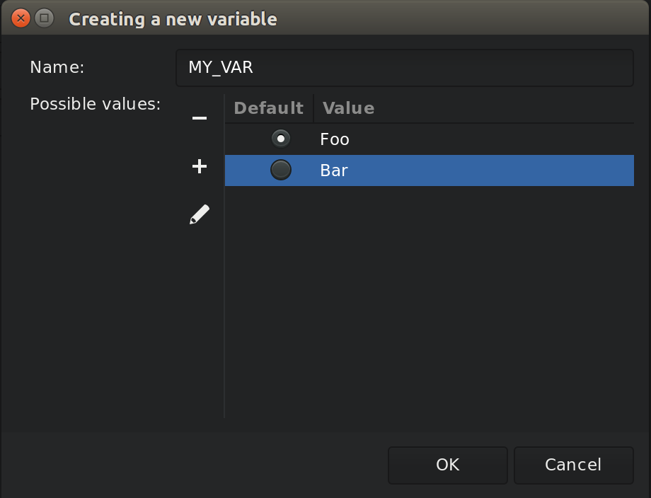
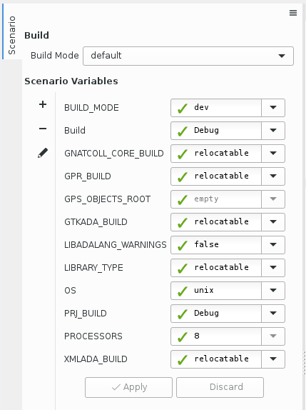
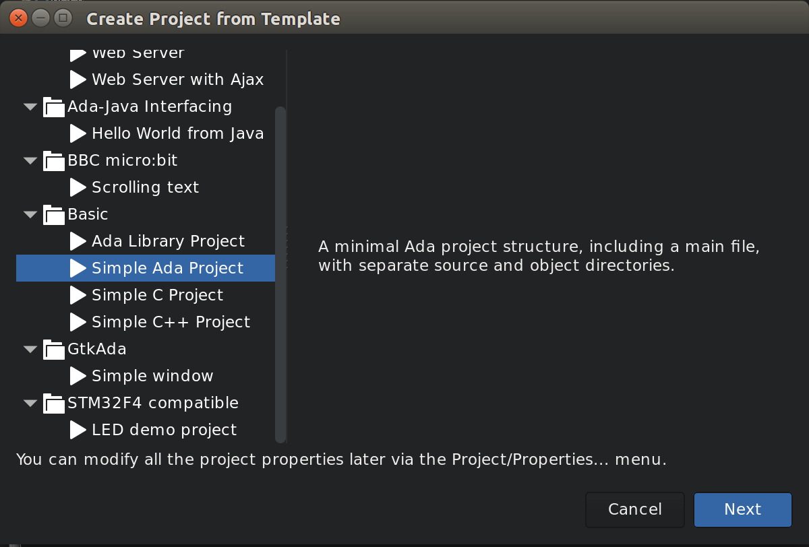
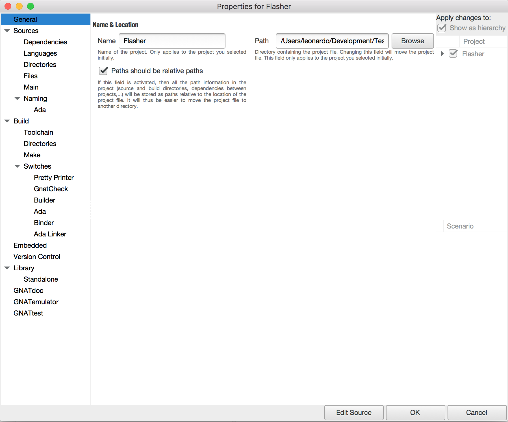
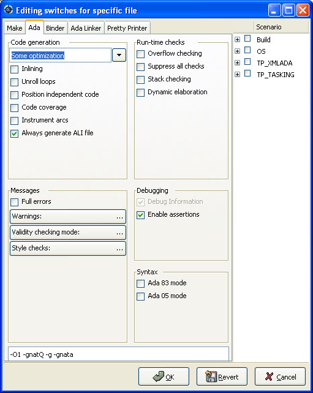

.. highlight:: ada
.. _Project_Handling:

****************
Project Handling
****************

The discussion of the :guilabel:`Project` view (see
:ref:`The_Project_View`) gave a brief overview of what the projects are and
the information they contain.  This chapter provides more in-depth
information and describes how you create and maintain projects.

.. index:: project; description
.. _Description_of_the_Projects:

Description of the Projects
===========================

Project files and GNAT tools
----------------------------

The projects used by GPS are the same as the ones used by GNAT: all
command-line GNAT tools are project aware.  Projects files are text (with
the extension :file:`.gpr`), which you can edit with any text editor or
through GPS's interface.  GPS can load any project file, even those you
created or edited manually, and you can manually edit project files created
by GPS.  Most features of project files can be accessed without using GPS.

The detailed syntax and semantics of project files is fully described in
the GNAT User's Guide and GNAT Reference Manual.  Read these sections if
you want to use the more advanced capabilities of project files that are not
supported by GPS's graphical interface.

You usually will not need to edit project files manually, since GPS provides
several graphical tools such as the project wizard (see
:ref:`The_Project_Wizard`) and the properties editor (see
:ref:`The_Project_Properties_Editor`).

.. index:: project; normalization

GPS does not preserve the layout or comments of projects you created
manually after you have edited them in GPS. For example, multiple case
statements in the project are merged into a single case statement.  GPS
needs to do this normalization to be able to preserve the previous
semantics of the project in addition to supporting the new settings.

.. index:: ADA_PROJECT_PATH
.. index:: GPR_PROJECT_PATH

GPS uses the same mechanisms to locate project files as GNAT:

* absolute paths

* relative paths

  These paths, when used in a :command:`with` line as described below, are
  relative to the location of the project containing the :command:`with`.

* `ADA_PROJECT_PATH`

  If set, an environment variable containing a colon-separated (semicolon
  under Windows) list of directories to be searched for project files.

* `GPR_PROJECT_PATH`

  If set, an environment variable containing a colon-separated (semicolon
  under Windows) list of directories to be searched for project files.

* predefined project path

  The compiler internally defines a predefined project path in which standard
  libraries can be installed, for example XML/Ada.

Contents of project files
-------------------------

Project files contain all the information describing the organization of
your source files, object files, and executables.

.. index:: project; comments

A project file can contain comments, which have the same format as in Ada:
they start with "--" and extend to the end of the line.  You can add
comments when you edit the project file manually. GPS attempts to preserve
them when you save the project through the menu, but this is not always
possible.  GPS is more likely to preserve them if the comments are put at
the end of the line::

  project Default is
      for Source_Dirs use ();  --  No source in this project
  end Default;

.. index:: project; subprojects

Often, one project file is not enough to describe a complex system. If so,
you will create and use a project hierarchy, with a root project importing
subprojects. Each project and subproject is responsible for its own set of
sources (including compiling them with the appropriate switches and putting
the resulting files in the correct directories).

Each project file contains the following information (see the GNAT
User's Guide for the full list):

* :file:`List of imported projects`

  .. index:: project; imported project

  When compiling sources from this project, the builder first makes sure it
  correctly recompiled all the imported projects and that they are up to
  date. This properly handles dependencies between source files.

  If one source file of project A depends on some source files from project
  B, B must be marked as imported by A.  If this is not done, the compiler
  will complain that those source files cannot be found.

  Each source file name must be unique in the project hierarchy (i.e., a
  file cannot be under control of two different projects), ensuring that
  the file will be found no matter what project is managing it.

* :file:`List of source directories`

  .. index:: project; source directory

  All sources managed by a project are located in one or more source
  directories. Each project can have multiple source directories and a
  given source directory may be shared by multiple projects.

* :file:`Object directory`

  .. index:: project; object directory

  When sources of the project are compiled, the resulting object files are
  put in this directory. There must be exactly one object directory for
  each project. If you need to split the object files across multiple
  directories, you must create multiple projects importing each other.

  When sources from imported subprojects are recompiled, the resulting
  object files are put in the subproject's own object directory and not the
  parent's object directory.

* :file:`Exec directory`

  .. index:: project; exec directory

  When the object files are linked into an executable, this executable is
  put in the exec directory specified by this attribute. If it is omitted,
  the builder puts the executable into the object directory.

* :file:`List of source files`

  .. index:: project; source files

  Each project is responsible for managing its set of source files. These
  files can be written in any programming language, but the graphical
  interface supports only Ada, C, and C++.

  By default, these source files are found by taking all the files in the
  source directories that follow the naming scheme (see below) for each
  language. You can also edit the project file manually to provide an
  explicit list of source files.

  This attribute cannot be modified graphically.

* :file:`List of main units`

  .. index:: project; main units

  The main units of a project (or main files in some languages) are the
  units containing the main subprogram of the application.  The name of the
  file is generally related to the name of the executable.

  A project file hierarchy can be used to compile and link several
  executables. GPS automatically updates the :guilabel:`Compile`,
  :guilabel:`Run` and :guilabel:`Debug` menu with the list of executables
  based on this list.

* :file:`Naming schemes`

  .. index:: project; naming schemes

  The naming scheme refers to the way files are named for each language
  used by your project.  GPS uses this to choose the language to use when
  you open a source file and what tools to use to compile or otherwise
  manipulate a source file.

* :file:`Embedded targets and cross environments`

  .. index:: project; cross environment

  GPS supports cross environment software development: GPS itself can run
  on one host, such as GNU/Linux, while compilation, execution, and
  debugging occur on a different remote host, such as Sun/Solaris.

  .. index:: VxWorks

  GPS also supports embedded targets such as VxWorks by specifying
  alternate names for the build and debug tools.

  The project file contains the information required to log on to the
  remote host.

* :file:`Tools`

  Project files provide a simple way of specifying the compiler and
  debugger commands to use.

* :file:`Switches`

  .. index:: project; switches

  Each tool used by GPS (such as the compiler, pretty-printer, and
  debugger) has its own set of switches. Moreover, these switches may
  depend on the file being processed and the programming language it is
  written in.

.. index:: project; languages
.. _Supported_Languages:

Supported Languages
===================

Other information stored in the project file is the list of languages used
by the project. GPS supports any language, each with a name you choose, but
advanced support is only provided by default for some languages (Ada, C, and
C++).  You can specify other properties of the languages through
customization files (see :ref:`Adding_support_for_new_languages`).

The graphical interface only allows you to choose languages currently known
to GPS, either through built-in support or your customization files.
Supporting a languages means syntax highlighting in the editor, and
possibly the :guilabel:`Outline` view.  Other languages have advanced
cross-references facilities available.  You can edit the project files by
hand to add support for any language.

Languages are a very important part of the project definition. For each
language, you should specify a naming scheme to allow GPS to associate files
with that language.  For example, you could specify that all :file:`.adb`
files are Ada, all :file:`.txt` files are standard text files, etc.

.. index:: menu; file --> open from project

Only files that have an associated known language are displayed in the
:guilabel:`Project` view and available for selection through the
:menuselection:`Find --> Find File in Project` menu. Similarly, only these
files are shown in the Version Control System interface.  It is important to
properly set up your project to make these files conveniently available in
GPS although you can still open any file through the :menuselection:`File
--> Open File` menu.

If your project includes :file:`README` files, or other text files, you
should add "txt" as a language (the name is arbitrary) and ensure these
files are associated with that language in the :menuselection:`Edit -->
Project Properties...`.

.. index:: project; scenario variable
.. _Scenarios_and_Configuration_Variables:

Scenarios and Configuration Variables
=====================================

You can further tailor the behavior of project by using scenarios.

.. index:: project; attribute

You can specify the value of all attributes of a project except its list of
imported projects based on the value of external variables, each of which
comes from either the host computer environment or is specifically set in
GPS. The interface to manipulate these scenarios is the
:guilabel:`Scenario` view, which you display by selecting the menu
:menuselection:`View --> Scenario` (:ref:`The Scenario View
<Scenario_View>`).  You may want to drop this window above the
:guilabel:`Project` view so you can see both at the same time.

The :guilabel:`Scenario` view allows you to select new values for the
scenario variables defined in your project and thus dynamically change the
view GPS has of your project and its source files.

For example, you can use this facility to compile all the sources either in
debug mode (so the executables can be run in the debugger) or in optimized
mode (to reduce the space and increase the speed when delivering the
software).  In that scenario, most of the attributes (such as source
directories and tools) remain the same, but compilation switches differ.
You could also maintain a completely separate hierarchy of projects, but
it is much more efficient to create a new configuration variable and edit
the switches for the appropriate scenario (see
:ref:`The_Project_Properties_Editor`).

There is one limitation on what GPS can do with scenario variables:
although :program:`gnatmake` and :program:`gprbuild` can use scenario
variables whose default value is something other than static string (for
example, a concatenation or the value of another scenario variable), GPS
cannot edit such a project graphically, though such projects load
correctly.

.. index:: project; creating scenario variables

Creating new scenario variables
-------------------------------

Create a new scenario variable through the contextual menu (right-click) in
the :guilabel:`Project` or :guilabel:`Scenario` views themselves. Select
the :menuselection:`Project --> Add Scenario Variable` menu, which
opens the following dialog:

There are two main areas in this dialog.  You specify the name of the
variable in the top line. This name is used for two purposes:

* It is displayed in the :guilabel:`Scenario` view

* It is the name of the environment variable from which the initial value is
  read. When GPS starts, all configuration variables are initialized from
  the host computer environment, although you can later change their values
  inside GPS.  Selecting a new value for the scenario variable does not
  change the value of the environment variable, which is only used to get
  the default initial value of the scenario variable.

  When you spawn external tools like :program:`gnatmake` you can also
  specify the value they should use for the scenario variable by using a
  command line switch, typically :command:`-X`.

Click on the arrow on the right of the name area to display the list of all
currently-defined environment variables. However, you can choose any
variable; the environment variable need not exist when you start GPS.

The second area in this dialog is the list of possible values for this
variable.  GPS generates an error and will not load the project if you specify
any other value.  One of these values is the default (the one whose button
in the :guilabel:`Default` column is selected). If the environment variable
is not defined when GPS starts, it behaves as if it had this default
value.

You can edit the list of possible values by right-clicking on the name of
the variable and selecting either :guilabel:`Edit properties` or
:guilabel:`Delete variable`.

.. index:: project; editing scenario variable

Editing existing scenario variables
-----------------------------------

If at least one configuration variable is defined in your project, the
:guilabel:`Scenario` view contains something similar to:

You can change the current value of any of these variables by clicking on
one, which displays a pop-up window with the list of possible values, from
which you select the one you want to use.

As soon as a new value is selected, GPS recomputes the :guilabel:`Project`
view (in case source directories, object directories or list of source
files have changed).  GPS also updates other items such as the list of
executables in the :guilabel:`Compile`, :guilabel:`Run`, and
:guilabel:`Debug` menus.

.. index:: browsers
.. index:: call graph

Because it can be time consuming and costly of system resources, GPS does
not recompute the contents of the various browsers, such as the call graph
and dependencies, for this updated project. You must explicitly request that
they be updated if you want them recomputed.

Change the list of possible values for a configuration variable at any time
by clicking on the :guilabel:`edit` button in the local toolbar. This pops
up the same dialog used to create new variables, and also allows you to
change the name of the scenario variable (the same name as the
environment variable used to set the initial value of the scenario
variable).

.. index:: removing variable

To remove a variable, select it and click the :guilabel:`remove` button in
the local toolbar. GPS displays a confirmation dialog.  When the variable
is removed, GPS acts as if the variable always had the value it had when it
was removed.

.. index:: project; extending
.. _Extending_Projects:

Extending Projects
==================

Description of project extensions
---------------------------------

Project files are designed to support large projects, with several hundred
or even several thousand source files. In such contexts, one developer will
generally work on a subset of the sources.  Such a project may often take
several hours to be fully compiled.  Most developers do not need to have the
full copy of the project compiled on their own machine.

However, it can still be useful to access other source files from the
application. For example, a developer may need to find out whether
a subprogram can be changed, and where it is currently called.

Such a setup can be achieved through project extensions. These are special
types of projects that inherit most of their attributes and source files
from another project and can have, in their source directories, some source
files that hide those inherited from the original project.

When compiling such projects, the compiler puts the newly created project
files in the extension project's directory and leaves the original
directory untouched. As a result, the original project can be shared
read-only among several developers (for example, the original project is
often the result of a nightly build of the application).

Creating project extensions
---------------------------

The project wizard allows you to create extension projects.  Select an
empty directory (which is created if it does not exist), as well as a list of
initial source files (new files can be added later).  GPS copies the
selected source files to the directory and creates a number of project
files there. It then loads a new project, with the same properties as the
previous one, except that some files are found in the new directory and
object files resulting from the compilation are put into that directory
instead of the object directory of the original project.

Adding files to project extensions
----------------------------------

.. index:: Add To Extending Project

Once you load a project extension in GPS, most things are transparent to
the extension. If you open a file through the :menuselection:`Find --> Find
File in Project` dialog, the files found in the local directory of the
extension project are picked up first.  Build actions create object files
in the project extensions' directory, leaving the original project
untouched.

You may want to work on a source file you did not put in the project
extension when you created it. You could edit the file in the original
project (provided, of course, you have write access to it).  However, it is
generally better to edit it in the context of the project extension, so the
original project can be shared among developers.  Do this by clicking the
file in the :guilabel:`Project` view and selecting the :menuselection:`Add
To Extending Project` menu.  You will see a dialog asking whether you want
GPS to copy the file to the project extension's directory.  GPS may also
create some new project files in that directory, if necessary, and
automatically reload the project as needed. From that point on, if you use
the menu :menuselection:`Find --> Find File in Project`, GPS uses the file
from the project extension.  Open editors will still edit the same files
they previously contained, so you should open the new file in them if
needed.

.. index:: project; editing
.. _Disabling_Project_Edition_Features:

Aggregate projects
==================

Aggregate projects are a convenient way to group several independent
projects into a single project that you can load in GPS. Using an
aggregate project has several advantages:

* There is no restriction on duplicate names within aggregate sources and
  projects.  There can be duplicate file names between the aggregate
  projects or duplicate projects. For example, if you have a project
  :file:`liba.gpr` containing a library used by both :file:`projectA.gpr`
  and :file:`projectB.gpr`, you can still aggregate the latter two
  projects. A source file is also permitted to belong to both
  :file:`projectA.gpr` and :file:`projectB.gpr`.

* You can use :program:`gprbuild` to build the main units of all aggregate
  projects with a single command.

* The aggregated project can contain attributes to setup your environment,
  in particular you can use :file:`External` to set the value of the
  scenario variables and :file:`Project_Path` to set the project path to be
  used to load the aggregated projects.

Here is a short example of an aggregate project::

   aggregate project BuildAll is
       --  "liba.gpr" as described above, is automatically imported, but
       --  not aggregated so its main units are not build
       for Project_Files use ("projecta/projecta.gpr",
                              "projectb/projectb.gpr");

       --  Set environment variables
       for External ("BUILD") use "Debug";
   end BuildAll;

GPS helps you use aggregate projects in the following ways:

* Since a source file can now belong to several projects, each editor is
  associated with a specific project.  If the :file:`common.ads` file is
  part of multiple projects, you may end up with two editors, one for
  :file:`common.ads` in the context of :file:`projectA.gpr`, and the other
  in the context of :file:`projectB.gpr`. The project matters when doing
  cross-reference queries, since a `with C;` in :file:`common.ads`
  could point to different files depending on which project owns that
  editor.

  To help with this, GPS shows the name of the project in the notebook
  tabs.

* The omni-search (at the top-right corner of the GPS window) may list the
  a file several times, once per each project that owns it. So you need to
  select the one you are interested in.

* After you perform a cross-reference (:menuselection:`Navigate --> Goto
  declaration`), the newly opened editor automatically selects the proper
  project.

Disabling Editing of the Project File
=====================================

You should generally consider project files part of the sources and put
them under the control of a version control system.  This will prevent
accidental editing of the project files, either by you or someone else
using the same GPS installation.

One way to prevent such accidents is to change the write permissions of the
project files themselves. On Unix systems, you could also change the owner
of the file. When GPS cannot write a project file, it reports an error to
the user.  However, the above does not prevent a user from trying to make
changes at the GUI level, since the error message only occurs when trying
to save the project (this is by design, so that temporary modification can
be done in memory).

You can disable all the project editing related menus in GPS by adding a
special startup switch, typically by creating a short script that spawns
GPS with these switches.  Use the following command line::

   gps --traceoff=MODULE.PROJECT_VIEWER --traceoff=MODULE.PROJECT_PROPERTIES

.. highlight:: python

This prevents the loading of the two GPS modules responsible for editing
project files. However, this also has an impact on the Python functions
that are exported by GPS and thus could break some plugins. Another
possible solution is to hide the corresponding project editing menus and
contextual menus.  You could do this by enabling the
:file:`prevent_project_edition.py` plugin via the
:menuselection:`Edit --> Preferences...` menu.

.. index:: ! project; wizard
.. _The_Project_Wizard:

The Project Wizard
==================

The project wizard lets you create a new project file in a few steps.
It contains a number of project templates, making it easy to create
projects that rely on a particular technology (e.g: GtkAda).

You normally access this wizard through the :menuselection:`File -->
New Project...` menu.

The first page of the wizard lists the various project templates. Selecting one
of them and clicking on the :guilabel:`Next` button will show a page allowing
you to modify the project template settings. Once modified, click on
:guilabel:`Apply` to actually create your project.

.. index:: project; editing
.. index:: menu; edit --> project properties
.. _The_Project_Properties_Editor:

The Project Properties Editor
=============================

Use the :guilabel:`Project Properties` editor at any time to access the
properties of your project through the :menuselection:`Edit -->
Project Properties...` menu or the contextual menu :menuselection:`Properties`
on any project item, e.g. from the :guilabel:`Project`
views or the :guilabel:`Project` browser.

In some cases, GPS cannot edit your project graphically. It will still
display a read-only version of the :guilabel:`Project Properties` dialog.
This is the case, among others, when:

  - the project loaded with errors, such as invalid syntax or missing
    directories;
  - you are editing an aggregate project;
  - the project was written manually before and uses advanced features
    like variables (:samp:`Var := ...`).

The :guilabel:`Project Properties` editor is divided into three parts:

*The attributes editor*

  The contents of this editor are very similar to that of the project
  wizard (see :ref:`The_Project_Wizard`). In fact, all pages but the
  :guilabel:`General` page are exactly the same; read their description in
  the project wizard section.

  See also :ref:`Working_in_a_Cross_Environment` for more info on the
  :guilabel:`Cross environment` attributes.

*The project selector*

  This area, the top-right corner of the properties editor, displays a list
  of all projects in the hierarchy. The value in the attributes editor is
  applied to all the selected projects in this selector. You cannot unselect
  the project for which you activated the contextual menu.

  Clicking on the right title bar (:guilabel:`Project`) of this selector
  sorts the projects in ascending or descending order.  Clicking on the
  left title bar (untitled) selects or unselects all the projects.

  This selector has two different possible presentations, chosen by the
  toggle button on top: either a sorted list of all the projects, each
  appearing only once, or the same project hierarchy displayed in the
  :guilabel:`Project` view.

*The scenario selector*

  This area, the bottom-right corner of the properties editor, displays all
  scenario variables declared in the project hierarchy. By selecting some
  or all of their values, you can choose to which scenario the modifications
  in the attributes editor apply.

  Clicking on the left title bar (untitled, on the left of the
  :guilabel:`Scenario` label) selects or unselects all values of all
  variables.

  To select all values of a given variable, click on the corresponding
  check button.

.. _The_Switches_Editor:

The Switches Editor
===================

The switches editor, available through the :menuselection:`Edit -->
Project Properties...` menu, displays all source files associated with the
selected project.

For each file, it lists the compiler switches for that file. These switches
are displayed in gray if they are the default switches defined at the
project level (see :ref:`The_Project_Properties_Editor`) and in black if
they are specific to that file.

Edit the switches for the file by double-clicking in the switches column.
You can edit the switches for multiple files at the same time by selecting
them before displaying the contextual menu :menuselection:`Edit switches
for all selected files`.

When you double-click in one of the columns containing switches, GPS opens
a new dialog allowing you to edit the switches specific to the selected
files.  This dialog has a button titled :guilabel:`Revert`, which cancels
any file-specific switch and reverts to the default switches defined at the
project level.

