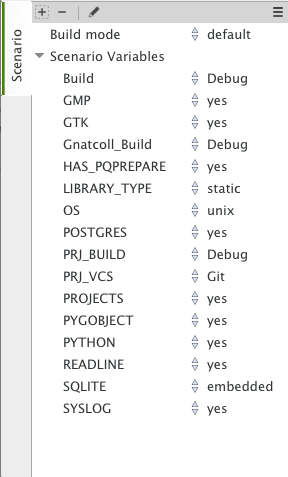

.. highlight:: ada
.. _Project_Handling:

****************
Project Handling
****************

The discussion of the project view (:ref:`The_Project_View`) gave a brief
overview of what the projects are and the information they contain.  This
chapter provides more in-depth information and describes how you create and
maintain projects.

.. index:: project; description
.. _Description_of_the_Projects:

Description of the Projects
===========================

Project files and GNAT tools
----------------------------

The projects used by GPS are the same as the ones used by GNAT: all
command-line GNAT tools are project aware.  Projects files are text
(with the extension :file:`.gpr`), which you can edit either with any text
editor or through GPS's interface.  GPS can load any project file, even
those you created or edited manually, and you can manually edit project
files created by GPS.  Most capabilities of project files can be accessed
without using GPS itself.

The detailed syntax and semantics of project files fully described in the
GNAT Pro User's Guide (`gnat_ug.html <gnat_ug.html>`_) and GNAT Pro
Reference Manual (`gnat_rm.html <gnat_rm.html>`_).  You should read these
sections if you want to use the more advanced capabilities of project files
which are not supported by GPS's graphical interface.

You usually won't need to edit project files manually, since GPS provides
several graphical tools such as the project wizard
(:ref:`The_Project_Wizard`) and the properties
editor(:ref:`The_Project_Properties_Editor`).

.. index:: project; normalization

GPS doesn't preserve the layout or comments of projects you created
manually after you've edited them in GPS. For example, multiple case
statements in the project are merged into a single case statement.  GPS
needs to do this normalization to be able to preserve the previous
semantics of the project in addition to the new settings.

.. index:: ADA_PROJECT_PATH
.. index:: GPR_PROJECT_PATH

GPS uses the same mechanisms to locate project files as GNAT:

* absolute paths

* relative paths.
  These paths, when used in a `with` line as described below, are relative
  to the location of the project containing the `with`.

* ADA_PROJECT_PATH.
  If set, an environment variable containing a colon-separated (semicolon
  under Windows) list of directories to be searched for project files.
  searched for.

* GPR_PROJECT_PATH.
  If set, an environment variable containing a colon-separated (semicolon
  under Windows) list of directories to be searched for project files.

* predefined project path.
  The compiler internally defines a predefined project path in which standard
  libraries can be installed, for example XML/Ada.

Contents of project files
-------------------------

Project files contain all the information describing the organization of
your source files, object files, and executables.

.. index:: project; comments

A project file can contain comments, which have the same format as in Ada:
they start by "--" and extend to the end of the line.  You can add comments
when you edit the project file manually. GPS attempts to preserve them when
you save the project through the menu, but this is not always possible.
GPS is more likely to preserve them if the comments are put at the end of
the line::

  project Default is
      for Source_Dirs use ();  --  No source in this project
  end Default;

.. index:: project; subprojects

Often, one project file is not enough to describe a complex system. If so,
you'll create and use a project hierarchy, with a root project importing
the subprojects. Each project and subproject is responsible for its own set
of sources (including compiling them with the appropriate switches and
putting the resulting files in the correct directories).

Each project file contains the following information (see the GNAT Pro
User's Guide for the full list):

* **List of imported projects**:
  .. index:: project; imported project

  When compiling sources from this project, the builder first makes sure it
  has correctly recompiled all the imported projects and they're up to
  date. This properly handles dependencies between source files.

  If one source file of project A depends on some source files from project
  B, B must be marked as imported by A.  If this isn't done, the compiler
  will complain that those source files can't be found.

  Each source file name must be unique in the project hierarchy (i.e., a
  file cannot be under control of two different projects), ensuring that
  the file will be found no matter what project is managing it.

* **List of source directories**:
  .. index:: project; source directory

  All sources managed by a project are located in one or more source
  directories. Each project can have multiple source directories and a
  given source directory might be shared by multiple projects.

* **Object directory**:
  .. index:: project; object directory

  When sources of the project are compiled, the resulting object files are
  put in this directory. There must be exactly one object directory for
  each project. If you need to split the object files across multiple
  directories, you must create multiple projects importing each another.

  When sources from imported subprojects are recompiled, the resulting
  object files are put in the subproject's own object directory and not the
  parent's object directory.

* **Exec directory**:
  .. index:: project; exec directory

  When the object files are linked into an executable, this executable is
  put in the exec directory specified by this attribute. If it's omitted,
  the builder put the executable into the object directory.

* **List of source files**:
  .. index:: project; source files

  Each project is responsible for managing its set of source files. These
  files can be written in any programming language. The graphical interface
  supports Ada, C and C++.

  By default, these source files are found by taking all the files in the
  source directories that follow the naming scheme (see below) for each
  language. You can edit the project file manually to provide an explicit
  list of source files.

  This attribute cannot be modified graphically.

* **List of main units**:
  .. index:: project; main units

  The main units of a project (or main files in some languages) are the
  units containing the main subprogram of the application.  The name of the
  file is generally related to the name of the executable.

  A project file hierarchy can be used to compile and link several
  executables. GPS automatically updates the Compile, Run and Debug menu
  with the list of executables, based on this list.

* **Naming schemes**:
  .. index:: project; naming schemes

  The naming scheme refers to the way files are named for each language
  used by the project.  GPS uses this to choose the language to use when
  you open a source file and what tools should be used to compile or
  otherwise manipulate a source file.

* **Embedded targets and cross environments**:
  .. index:: project; cross environment

  GPS supports cross environment software development: GPS itself can run
  on one host, such as GNU/Linux, while compilation, execution, and
  debugging occur on a different remote host, such as Sun/Solaris.

  .. index:: VxWorks

  GPS also supports embedded targets such as VxWorks by specifying
  alternate names for the build and debug tools.

  The project file contains the information required to log on to the
  remote host.

* **Tools**:
  Project files provide a simple way of specifying the compiler and debugger
  commands to use.

* **Switches**:
  .. index:: project; switches

  Each tool used by GPS (such as the compiler, pretty-printer, and
  debugger) has its own set of switches. Moreover, these switches may
  depend on the file being processed and the programming language it's
  written in.

.. index:: project; languages
.. _Supported_Languages:

Supported Languages
===================

Other information stored in the project file is the list of languages used
by the project. GPS supports any language, each with a name you choose, but
advanced support is only provided by default for some languages (Ada, C and
C++).  You can specify other properties of the languages through
customization files (:ref:`Adding_support_for_new_languages`).

The graphical interface only gives you a choice of the languages currently
known to GPS, either through built-in support or your customization files.
Supporting a languages means syntax highlighting in the editor, and
possibly the :guilabel:`Outline` View.  Other languages have advanced
cross-references available.  You can edit the project files by hand to add
support for any language.

Languages are a very important part of the project definition. For each
language, you should specify a naming scheme allow GPS to associate files
with that language.  For example, you could specify that all :file:`.adb`
files are Ada, all :file:`.txt` files are standard text files, etc.

.. index:: menu; file --> open from project

Only files that have an associated known language are displayed in the
`Project View` and available for easy selection through the
:menuselection:`File --> Open From Project` menu. Similarly, only these
files are shown in the Version Control System interface.  It's important to
properly set up your project to make these files conveniently available in
GPS although you can still open any file through the :menuselection:`File
--> Open` menu.

If your project includes :file`README` files, or other text files, you
should add "txt" as a language (the name is arbitrary) and ensure these
files are associated with that language in the :menuselection:`Project -->
Edit project properties`.

.. index:: project; scenario variable
.. _Scenarios_and_Configuration_Variables:

Scenarios and Configuration Variables
=====================================

You can further tailor the behavior of project by using scenarios.

.. index:: project; attribute

The value of all attributes of a project, except its list of imported
projects, can be specified based on the value of external variables, each
of whose value comes from either the host computer environment or
specifically set in GPS. The interface to manipulate these scenarios is the
:guilabel:`Scenario` view, which can be displayed by selecting the menu
:menuselection:`Tools --> Views --> Scenario` (:ref:`The Scenario View
<Scenario_View>`).  You may want to drop this window above the project view
so you can see both at the same time.

The :guilabel:`Scenario` view allows you to select new values for the
scenario variables defined in your project and thus dynamically change the
view GPS has of your project and your source files.

For example, you can use this facility to compile all the sources either in
debug mode (so that the executables can be run in the debugger) or in
optimized mode (to reduce the space and increase the speed when delivering
the software).  In that scenario, most of the attributes (such as source
directories and tools) remain the same, but compilation switches differ.
You could also maintain a completely separate hierarchy of projects, but
it's much more efficient to create a new configuration variable and edit
the switches for the appropriate scenario
(:ref:`The_Project_Properties_Editor`).

There's one limitation on what GPS can do with scenario variables: although
`gnatmake` and `gprbuild` are able to use scenario variables whose default
value is not a static string (for example, a concatenation or the value of
another scenario variable), GPS can't edit such a project graphically,
though such projects load correctly.

.. index:: project; creating scenario variables

Creating new scenario variables
-------------------------------

You create a new scenario variable through the contextual menu (right-click)
in the :guilabel:`Project` view or the :guilabel:`Scenario` view
itself. Select the menu :menuselection:`Project --> Add Configuration
Variable`. This opens the following dialog:

.. image:: scenarios.png

There are two main areas in this dialog.  You specify the name of the
variable in the top line. This name is used for two purposes:

* It's displayed in the :guilabel:`Scenario` view

* It's the name of the environment variable from which the initial value is
  read. When GPS starts, all configuration variables are initialized from
  the host computer environment, although you can later change its value
  inside GPS.  Selecting a new value for the scenario variable doesn't
  change the value of the environment variable, which is only used to get
  the default initial value of the scenario variable.

  When you spawn external tools like `gnatmake`, you can also specify the
  value they should use for the scenario variable by using a command line
  switch, typically `-X`.

Click on the arrow on the right of this name area to display the list of
all environment variables that are currently defined. However, you can
choose any variable; the environment variable need not exist when you start
GPS.

The second area in this dialog is the list of possible value for this
variable.  GPS will generate an error and won't load the project if you
specify any other value.  One of these values is the default (the one whose
button in the Default column is selected): if the environment variable
isn't defined exist when GPS starts, it behaves as if had this default
value.

You can edit the list of possible values by right-clicking on the name of
the variable and selecting either :guilabel:`Edit properties` or
:guilabel:`Delete variable`.

.. index:: project; editing scenario variable

Editing existing scenario variables
-----------------------------------

If at least one configuration variable is defined in your project, the
:guilabel:`Scenario` view contains something similar to:

You can change the current value of any of these variables by clicking on
it. This displays a pop-up window with the list of possible values, from
which you select the one you to use.

As soon as a new value is selected, GPS recomputes the project view (in
case source directories, object directories or list of source files have
changed).  GPS will also update other items such as the list of executables
in the `Compile`, `Run`, and `Debug` menus.

.. index:: browsers
.. index:: call graph

Because of the expense, GPS does not recompute the contents of the various
browsers such as the call graph and dependencies for this updated project,
so you need to explicitly request an update.

You can change the list of possible values for a configuration variable at
any time by clicking on the :guilabel:`edit` button in the local
toolbar. This pops up the same dialog used to create new variables and also
allows you to change the name of the scenario variable. This name is the
same as the environment variable used to set the initial value of the
scenario variable.

.. index:: removing variable

To remove a variable, select it and click the :guilabel:`remove` button in
the local toolbar. GPS displays a confirmation dialog.  When the variable
is removed, GPS will act as if the variable always had the value it had
when it was removed.

.. index:: project; extending
.. _Extending_Projects:

Extending Projects
==================

Description of project extensions
---------------------------------

Project files were designed to large big projects, with several hundreds or
even thousands of source files. In such contexts, one developer will
generally work on a subset of the sources.  Such a project may often take
several hours to be fully compiled.  Most developers don't need to have the
full copy of the project compiled on their own machine.

However, it can still be useful to access other source files of the
application, for example to find out whether a subprogram can be changed
and where it is currently called.

Such a setup can be achieved through project extensions. These are special
types of projects that inherit most of their attributes and source files
from another project and can have, in their source directories, some source
files that hide those inherited from the original project.

When compiling such projects, the compiler puts the newly created project
files in the extension project's directory and leaves the original
directory untouched. As a result, the original project can be shared
read-only among several developers (for example, the original project will
often be the result of a nightly build of the application).

Creating project extensions
---------------------------

The project wizard allows you to create extension projects.  Select an
empty directory (which is created if it doesn't exist) as well as a list of
initial source files.  (New files can also be added later.)  GPS will copy
the selected source files to the directory and create a number of project
files there. It then loads a new project, with the same properties as the
previous one, except that some files are found in the new directory and
object files resulting from the compilation are put into that directory
instead of the object directory of the original project.

Adding files to project extensions
----------------------------------

.. index:: Add To Extending Project

Once you loaded a project extension in GPS, most things are transparent to
the extension. If you open a file through the :menuselection:`File --> Open
From Project` dialog, the files found in the local directory of the
extension project will be picked up first.  Build actions create object
files in the project extensions's directory, leaving the original project
untouched.

You may want to work on a source file you didn't put in the project
extension when you created it. You could edit the file in the original
project provided you have write access to it.  However, it's generally
better to edit it in the context of the project extension, so the original
project can be shared among developers.  Do this by clicking on the file in
the :guilabel:`Project` view and selecting the menu :menuselection:`Add To
Extending Project`.  Pop up a dialog asking whether you want GPS to copy
the file to the extending project's directory.  GPS may also create some
new project files in that directory if necessary and automatically reload
the project as needed. From that point on, if you use the menu
:menuselection:`File --> Open From Project`, GPS see the file from the
project extension.  Open editors will still be editing the same file they
were, so you should open the new file in them if needed.

.. index:: project; editing
.. _Disabling_Project_Edition_Features:

Disabling Editing of the Project File
=====================================

Project files should generally be considered part of the sources and put
under control of a version control system, so you might want to prevent
accidental editing of the project files, either by you or someone else
using the same GPS installation.

One way to prevent such accidental edition is to change the write
permissions on the project files themselves. On Unix systems, you could
also change the owner of the file. When GPS cannot write a project file, it
reports an error to the user.

However, the above doesn't prevent a user from trying to make changes at
the GUI level, since the error message only occurs when trying to save the
project (this is by design, so that temporary modification can be done in
memory).

You can disable all the project editing related menus in GPS by adding
special startup switch, typically by creating a small script that spawns
GPS with these switches. You should use the following command line::

   gps --traceoff=MODULE.PROJECT_VIEWER --traceoff=MODULE.PROJECT_PROPERTIES

.. highlight:: python

This prevents the loading of the two GPS modules that are responsible for
editing project files. However, this also has an impact on the Python
functions that are exported by GPS and thus could break some
plug-ins. Another possible solution is to hide the corresponding
project-editing menus and contextual menus.  You could do this by creating
a small python plugin for GPS
(:ref:`Customizing_through_XML_and_Python_files`, which contains the
following code::

  import GPS
  GPS.Menu.get('/Project/Edit Project Properties').hide()
  GPS.Contextual('Edit project properties').hide()
  GPS.Contextual('Save project').hide()
  GPS.Contextual('Add configuration variable').hide()

.. _The_Project_Menu:

The Project Menu
================

The menu bar item :menuselection:`Project` contains several commands that
act on the whole project hierarchy.  To act on only a single project, use
the contextual menu in the project view.

GPS loads a single project hierarchy at any one time.  Some of these
commands apply to the currently selected project.  Which project is
considered currently selected depends on what window is currently active in
GPS: if it's the project view, the selected project is either the selected
node (if a project) or its parent project (for a file or directory, for
example).  If the currently active window is an editor, the selected
project is the one containing that file.  If none of those are the case,
it's the root project of the hierarchy.

These commands are:

.. index:: menu; project --> new

:menuselection:`Project --> New`
  Open the project wizard (:ref:`The_Project_Wizard`) so you can create a
  new project.  You'll be asked for other information used to create the
  project. For example you can create a set of project files from existing
  Ada sources.  On exit, the wizard asks whether the new project should be
  loaded. If you select :guilabel:`Yes`, the new project replaces the
  currently loaded project hierarchy.

.. index:: menu; project --> new from template

:menuselection:`Project --> New from template`
  Open the project template wizard, allowing you to create a new project
  using one of the project templates defined in GPS.
  :ref:`Adding_project_templates`.

.. index:: menu; project --> open

:menuselection:`Project --> Open`
  Open a file selection dialog, allowing any existing project to be loaded
  into GPS. The newly loaded project replaces the currently loaded project
  hierarchy.

.. index:: menu; project --> recent

:menuselection:`Project --> Recent`
  Switch back to the last project loaded into GPS.

.. index:: menu; project --> edit project properties

:menuselection:`Project --> Edit Project Properties`
  Open the  project properties dialog for the currently selected project.

.. index:: menu; project --> save all

:menuselection:`Project --> Save All`
  Save all the modified projects in the hierarchy.

.. index:: menu; project --> edit file switches
.. _File_Switches:

:menuselection:`Project --> Edit File Switches`
  Open a new window in GPS listing all the source files for the currently
  selected project along with the switches used to compile them.
  :ref:`The_Switches_Editor`.

.. index:: menu; project --> reload project

:menuselection:`Project --> Reload project`
  Reload the project from disk to take into account modifications done
  outside of GPS. In particular, it takes into account new files added
  externally to the source directories.  If all modifications were makde
  though GPS, this command isn't neeed.

.. index:: menu; project --> project view

:menuselection:`Project --> Project View`
  Open (or raise if it is already open) the project view on the left side
  of the GPS window.

.. index:: ! project; wizard
.. _The_Project_Wizard:

The Project Wizard
==================

The project wizard allows you to create a new project file in a few steps.
It has a number of pages, each dedicated to editing a specific set of
attributes of the project.

You normally access this wizard through the :menuselection:`Project -->
New...` menu.

The project wizard is also launched when a new dependency is created between
two projects, through the contextual menu in the project view.

.. image:: project-wizard.jpg

The wizard has the following pages:

* Project type
* Project Naming
* Languages Selection
* Version Control System Selection
* Source Directories Selection
* Build Directory
* Main Units
* Library
* Naming Scheme
* Switches

Project Type
------------

Several types of project wizards are provided in GPS:

* Single Project

  This is probably the wizard you'll use most often. It creates a project
  file from scratch and asks you for the location of source directories and
  the object directory.  The rest of this chapter describes this wizard in
  more detail.

* Project Tree

  This wizard attempts to create a set of one or more project files to
  represent your current build environment. It analyzes the location of
  your sources and corresponding object files and tries to find a possible
  configuration for the project files (a given :file:`.gpr` project file
  can only be associated with a single object directory).

  This wizard might not work in all cases, but is worth trying if you
  already have an existing set of sources

* Convert GLIDE Project (.adp)

  This wizard helps you convert a :file:`.adp` project file used by the
  GLIDE environment. The same restrictions apply as above, except that the
  list of source directories, object directories and tool switches are read
  directly from that file.

* Library Project
  .. index:: project; library

  This specialized wizard is similar to the Single Project wizard, except it
  adds one extra page, the Library page. The output of the compilation of this
  project is a library (shared or static), as opposed to an executable in the
  case of `Single Project`.

* Project Extention
  .. index:: project; extending

  This specialized wizard allows you to easily create project extentions.
  (:ref:`Extending_Projects`).

Project Name
------------

This is the first page displayed by any of the wizards.

Here you enter the name and location of the project to create. The name
must be a valid Ada identifier (start with a letter, optionally followed by
a series of digits, letters or underscores). Spaces and reserved Ada
keywords are not allowed. If the name is invalid, GPS displays an error
message when you press the :guilabel:`Forward` button.

Child projects can be created from this dialog. These are projects whose
name is of the form `Parent.Child`. GPS will automatically generate the
dependency to the parent project.

The last part of this page indicates how the path should be stored in the
generated project file. Most of the time, this setting will have no impact
on your work. However, if you plan to edit the project files by hand or be
able to duplicate a project hierarchy to another location on your disk it
might be useful to indicate that paths should be stored as relative paths
(they are relative to the location of the project file).

Languages Selection
-------------------

Use this page to select the programming languages used for the sources of
this project. By default, only `Ada` is selected.  New languages can be
added to this list by using XML files, see the section on customizing GPS
(:ref:`Adding_support_for_new_languages`).

This page allows you to select the toolchain used when working on your
project.  You can select one of the pre-defined toolchains or scan your
system for installed toolchains. You can also manually define some of the
tools in the toolchain such as which debugger, GNAT driver, or `gnatls`
tool to use.

If you need to select a toolchain for a cross environment, see
:ref:`Working_in_a_Cross_Environment` for more information on this subject.

.. index:: Version Control System
.. index:: VCS

VCS Selection
-------------

The second page in the project wizard allows you to select which Version
Control system you want to use for the source files of this project.  GPS
doesn't attempt to automatically guess what it should use, so you must
specify it if you want VCS operations to be available to you.

The two actions :guilabel:`Log checker` and :guilabel:`File checker` are
the name and location of programs to be run just prior an actual commit of
the files in the Version Control System. These should be used if you wish
to enforce style checks before a file is actually made available to other
developers in your team.  If left blank, no program will be run.

.. _Source_Directories_Selection:

Source Directories Selection
----------------------------

This page displays and allows you to edit the list of source directories
for the project. You can use an arbitrary number of source directories (the
default is to use the directory which contains the project file, specified
in the first page of the wizard).  If you don't specify any source
directories, no source files will be associated with the project.

The top frame is used to select a directory to add and the bottom frame
displays the current list of directories. The sizes of the frames can be
changed by dragging the separation line between them.

To add source directories to the project, select a directory in the top
frame and click on the down arrow. This adds the directory to the bottom
frame, which contains the current list of source directories.  You can also
add a directory and all its subdirectories recursively by using the
contextual menu in the top frame. This contextual menu also provides an
entry to create new directories, if needed.

To remove source directories from the project, select the directory in the
bottom frame and click on the up arrow or use the contextual menu.

All files in these directories that match one of the language supported by
the project are automatically associated with that project.

.. index:: project; object directory
.. index:: project; exec directory

Build Directory
---------------

The object directory is the location where the files resulting from the
compilation of sources (usually, :file:`.o` files) are placed.  One object
directory is associated with each project.

The exec directory is the location where the executables are put. By default,
this is the same directory as the object directory.

.. index:: project; main units

Main Units
----------

The main units of a project are the files that should be compiled and
linked to obtain executables.

Typically, for C applications, these are the files that contain the `main`
function. For Ada applications, these are the files that contain the main
subprogram each partition in the project.

These files are treated specially by GPS. Some submenus of
:menuselection:`Build` and :menuselection:`Debug` have predefined entries
for the main units, which makes it more convenient to compile and link your
executables.

To add main units, click the :guilabel:`Add` button, which opens a file
selection dialog. No check is done at that point to ensure that the
selected file belongs to the project, but GPS complains later if it
doesn't.

When compiled, each main unit generates an executable, whose name is
visible in the second column in this page. If you're using a recent enough
version of GNAT (3.16 or more recent), you can change the name of this
executable by clicking in the second column.

.. index:: project; library

Library
-------

This page allows you to configure your project so the output of its
compilation is a library (shared or static), as opposed to an executable or
a set of objet files. This library can then be linked with other
executables (and will automatically be if the project is imported by
another project).

You need to define the attributes in the top box to transform your project
into a library project. See the tooltips that appear to the left of each
field.

If you define any of the attributes in the Standalone Library box, your
project will create a standalone library. This is a library that does its
own elaboration instead of relying on its caller to elaborate it as is
standard in Ada. You also have more control over which files make up the
public interface to the library and which files are private to the library
and invisible from the outside.

.. index:: gnatname

GNATname
--------

This page allows you to add Ada units stored in files with irregular or
arbitrary naming conventions into your project.  To do this, specify file
name patterns.  GPS uses these patterns to search for Ada units in each of
source directories specified in the :ref:`Source_Directories_Selection`
page using the `gnatname` tool to generate the required pragmas for the set
of files. Files with arbitrary naming convention are not compatible with
naming scheme customization, so next page will be skipped.

.. index:: project; naming scheme

Naming Scheme
-------------

A naming scheme indicates the file naming conventions used by each of the
different languages used in a project.  For example, all :file:`.adb` files
are Ada files, all :file:`.c` files are C files.

GPS is very flexible with naming schemes and allows you to specify the
default extension for the files in each language. GPS makes a distinction
between spec (or header) files, which generally contain only declarations
and no executable code, and body files, which contain the actual code. For
languages other than Ada, this header file is used as the "body" file when
you select :menuselection:`Go To Declaration` in the contextual menu of
editors.  In a language like Ada, the distinction between spec and body is
part of the language itself.

The default naming scheme for Ada is GNAT's naming scheme (:file:`.ads` for
specs and :file:`.adb` for bodies). In addition, a number of predefined
naming schemes for other compilers are available in the first combo box on
the page.  You can also create your own customized scheme by entering text
in the text entries.

.. image:: naming-scheme.jpg

For all languages, GPS accepts exceptions to this standard naming
scheme. For instance, you can specify that, in addition to using
:file:`.adb` for Ada body files, the file :file:`foo.ada` should also be
considered as an Ada file.

The list of exceptions is displayed in the bottom list of the naming scheme
editor. To remove entries from this list, select the line you want to
remove and then press the :kbd:`Del` key.  The contents of the lines can be
edited interactively by double-clicking on the line and column you want to
edit.

To add new entries to this list, use the fields at the bottom of the window
and press the update button.

.. index:: multi-unit source files

GNAT and GPS both support Ada source files containing multiple Ada units
(typically a single file would contain both the spec and the body of a unit
for instance). This is not recommended if you can avoid it, since that
might trigger unnecessary recompilation of your source files, but you can
handle such source files as naming scheme exceptions.  You specify those in
the editor by adding `at 1`, `at 2` (and so on) after the file name for
either the spec, the body, or both. The digit after `at` is the index
(starting at 1) of the unit in the source file.

For example, specifying `file.ada at 1` for the spec and `file.ada at 2`
for the body of the unit "unit" indicates that the two components of the
unit are in the same file, with the spec first, followed by the body.

.. index:: project; switches
.. _Switches:

Switches
--------

Use the last page of the project wizard to specify the default switches to
be used by the various tools that GPS calls such as the compiler, linker,
binder, and pretty printer.

.. image:: switch-editor.jpg

This page appears as a notebook, where each page is associated with a
specific tool. All pages have the same structure:

*Graphical selection of switches*
  The top of each page contains a set of buttons, combo boxes, and entry
  fields which give quick and intuitive access to the most commonly used
  switches for that tool.

*Textual selection of switches*
  The bottom is an editable entry field, where you can directly type the
  switches you need. This makes it easier to move from an older setup
  (e.g. Makefile, script) to GPS by copy and pasting switches.

  Any switch can be added to the entry field, even if there is no
  corresponding button. In this case, GPS forwards it to the tool when
  called, without trying to represent it graphically here.

The two parts of the pages are kept synchronized at all times: clicking on
a button modifies the entry field to show the new switch; adding a new
switch by hand in the entry field will activate the corresponding button,
if such button exists.

.. index:: project; dependencies
.. _The_Project_Dependencies_Editor:

The Project Dependencies Editor
===============================

Edit the dependencies between projects through the contextual menu
:menuselection:`Project --> Dependencies...` in the Project View.

This view makes it easy to indicate that your project depends on external
libraries or other modules in your source code. For example, you can get
access to the GtkAda graphical library in your project by adding a project
dependency to `gtkada.gpr`, assuming GtkAda has been installed in your
system.

The dependencies also determine in what order your application is built.
When you compile a project, the builder first makes sure the projects it
depends on are up-to-date.  If not, it recompiles them.

.. image:: project-deps.jpg

When you select that contextual menu, GPS opens a dialog allowing you to
add to or remove dependencies from your project. You add a new dependency
by selecting a project file name from one of the following sources:

* One of the loaded project from the current project tree

* One of the predefined projects

  These are the projects are found in one of the directories referenced by
  the `ADA_PROJECT_PATH` environment variable. Typically, these include
  third party libraries, such as GtkAda or win32ada.

* A new project created through the project wizard

* Any project file located on the disk

In all cases, you can choose whether this should be a simple dependency or
a limited dependency. The latter allows you to have mutually dependent
projects (A depends on B, which in turns depends on A even indirectly),
although you cannot reference the attributes of such a project in the
current project (for example, to indicate that the compiler switches to use
for A are the same as for B: you need to duplicate that information).  In
some cases, GPS forces a limited dependency to avoid loops in the
dependencies that would make the project tree illegal.

.. index:: project; editing
.. index:: menu; project --> edit project properties
.. _The_Project_Properties_Editor:

The Project Properties Editor
=============================

Use project properties editor at any time to access the properties of your
project through the menu :menuselection:`Project --> Edit Project
Properties` or the contextual menu :menuselection:`Edit project properties`
on any project item, e.g. from the:guilabel:`Project` views or the
:guilabel:`Project browser`.

If there was an error loading the project (such as invalid syntax or
non-existing directories), GPS displays a warning dialog when you select
the menu. This reminds you that the project might be only partially loaded,
and editing it might result in the loss of data. In such cases, it's
recommended you edit the project file manually, which you can do directly
from the pop-up dialog.

Correct the errors in the project file by editing it as you would any text
file and reload it manually (through the :menuselection:`Project -->
Open...` or :menuselection:`Project --> Recent` menus.

.. image:: project-properties.jpg

The project properties editor is divided in three parts:

*The attributes editor*

  The contents of this editor are very similar to that of the project
  wizard (:ref:`The_Project_Wizard`). In fact, all pages but the
  :guilabel:`General` page are exactly the same and you should read their
  description in the project wizard section.

  See also :ref:`Working_in_a_Cross_Environment` for more info on the
  :guilabel:`Cross environment` attributes.

*The project selector*

  This area, the top-right corner of the properties editor, display a list
  of all the projects in the hierarchy. The value in the attributes editor
  is applied to all the selected projects in this selector. You cannot
  unselect the project for which you activated the contextual menu.

  Clicking on the right title bar (`Project`) of this selector sorts the
  projects in ascending or descending order.  Clicking on the left title
  bar (untitled) selects or deselect all the projects.

  This selector has two different possible presentations, chosen by the
  toggle button on top: you can either get a sorted list of all the
  projects, each appearing only once, or the same project hierarchy
  displayed in the project view.

*The scenario selector*

  This area, the bottom-right corner of the properties editor, displays all
  scenario variables declared in the project hierarchy. By selecting some
  or all of their values, you can chose to which scenario the modifications
  in the attributes editor apply.

  Clicking on the left title bar (untitled, on the left of the
  :guilabel:`Scenario` label) selects or deselects all values of all
  variables.

  To select all values of a given variable, click on the corresponding
  check button.

.. _The_Switches_Editor:

The Switches Editor
===================

The switches editor, available through the menu :menuselection:`Project -->
Edit Switches`, displays all the source files associated with the selected
project.

For each file, it lists the compiler switches for that file. These switches
are displayed in gray if they're the default switches defined at the
project level (:ref:`The_Project_Properties_Editor`) and in black if
they're specific to that file.

Edit the switches for the file by double-clicking in the switches column.
You can edit the switches for multiple files at the same time by selecting
them before displaying the contextual menu (:menuselection:`Edit switches
for all selected files`).

When you double-click in one of the columns that contain the switches, GPS
opens a new dialog allowing you to edit the switches specific to the
selected files.  This dialog has a button titled :guilabel:`Revert`, which
cancels any file-specific switch and revert to the default switches defined
at the project level.

.. image:: switch-editor-revert.jpg
