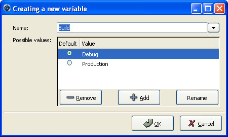
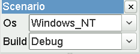
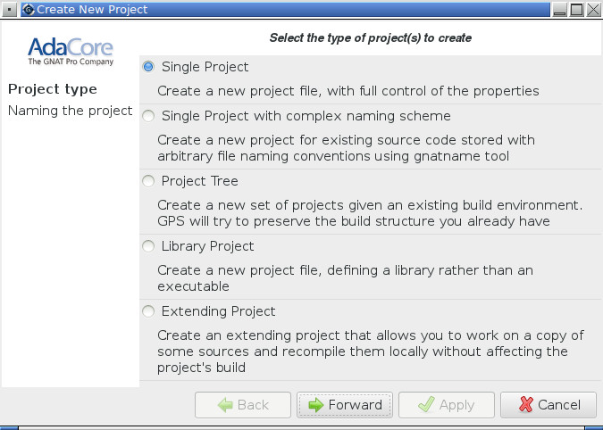
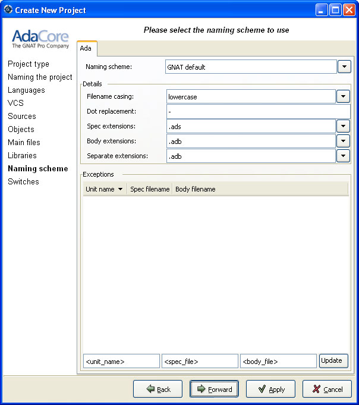
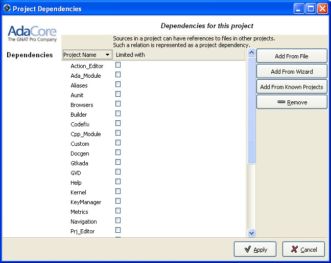
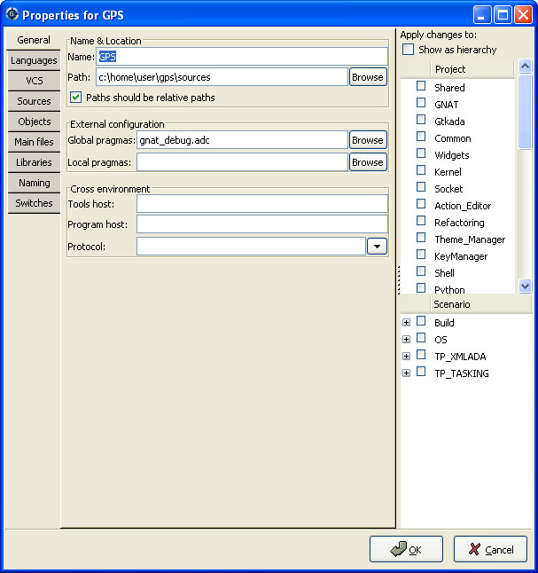
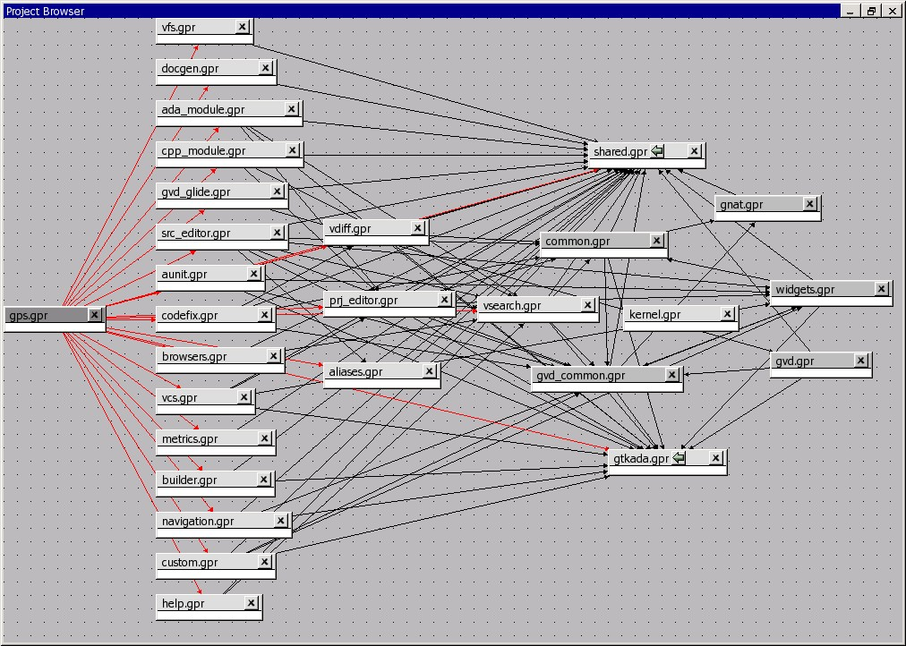

.. _Project_Handling:

****************
Project Handling
****************

.. highlight:: ada

.. index:: project
.. index:: project view

The section on the project view (:ref:`The_Project_View`) has already given a
brief overview of what the projects are, and the information they contain.

This chapter provides more in-depth information, and describes how such
projects can be created and maintained.

.. _Description_of_the_Projects:

Description of the Projects
===========================

.. index:: project description

Project files and GNAT tools
----------------------------

.. index:: project file
.. index:: GNAT

This section describes what the projects are, and what information they
contain.

The most important thing to note is that the projects used by GPS are the same
as the ones used by GNAT. These are text files (using the extension
:file:`.gpr`) which can be edited either manually, with any text editor, or
through the more advanced GPS interface.

The exact syntax of the project files is fully described in the GNAT User's
Guide (`gnat_ug.html <gnat_ug.html>`_) and GNAT Reference Manual (`gnat_rm.html
<gnat_rm.html>`_). This is recommended reading if you want to use some of the
more advanced capabilities of project files which are not yet supported by the
graphical interface.

GPS can load any project file, even those that you have been edited manually.
Furthermore, you can manually edit project files created by GPS.

Typically you will not need to edit project files manually, since several
graphical tools such as the project wizard (:ref:`The_Project_Wizard`) and the
properties editor(:ref:`The_Project_Properties_Editor`) are provided.

.. index:: normalization of projects

GPS doesn't preserve the layout nor comments of manually created projects after
you have edited them in GPS. For instance, multiple case statements in the
project will be coalesced into a single case statement.  This normalization is
required for GPS to be able to preserve the previous semantic of the project in
addition to the new settings.

.. index:: GNAT

All command-line GNAT tools are project aware, meaning that the notion of
project goes well beyond GPS' user interface. Most capabilities of project
files can be accessed without using GPS itself, making project files very
attractive.

.. index:: ADA_PROJECT_PATH

GPS uses the same mechanisms to locate project files as GNAT itself:

* absolute paths

* relative paths.
  These paths, when used in a with line as described below, are relative
  to the location of the project that does the with.

* ADA_PROJECT_PATH.
  If this environment variable is set, it contains a colon-separated (or
  semicolon under Windows) list of directories in which the project files are
  searched.

* predefined project path.
  The compiler itself defines a predefined project path, in which standard
  libraries can be installed, like XML/Ada for instance.

Contents of project files
-------------------------

.. index:: project file

Project files contain all the information that describe the organization of
your source files, object files and executables.

.. index:: project comments

A project file can contain comments, which have the same format as in Ada, that
is they start by "--" and extend to the end of the line.  You can add comments
when you edit the project file manually. GPS will attempt to preserve them when
you save the project through the menu, but this will not always be possible. It
helps if the comments are put at the end of the line, as in::

  project Default is
      for Source_Dirs use ();  --  No source in this project
  end Default;
  
.. index:: sub project

Generally, one project file will not be enough to describe a complex
organization. In this case, you will create and use a project hierarchy, with a
root project importing other sub projects. Each of the projects and sub
projects is responsible for its own set of sources (compiling them with the
appropriate switches, put the resulting files in the right directories, ...).

.. index:: GNAT

Each project contains the following information (see the GNAT user's guide for
the full list)

* **List of imported projects**:
  .. index:: imported project

  When you are compiling sources from this project, the builder will first make
  sure that all the imported projects have been correctly recompiled and are
  up-to-date. This way, dependencies between source files are properly handled.

  If one of the source files of project A depends on some source files from
  project B, then B must be imported by A. If this isn't the case, the compiler
  will complain that some of the source files cannot be found.

  One important rule is that each source file name must be unique in the
  project hierarchy (i.e. a file cannot be under control of two different
  projects). This ensures that the same file will be found no matter what
  project is managing the source file that uses

* **List of source directories**:
  .. index:: source directory

  All the sources managed by a project are found in one or more source
  directories. Each project can have multiple source directories, and a given
  source directory might be shared by multiple projects.

* **Object directory**:
  .. index:: object directory

  When the sources of the project are compiled, the resulting object files are
  put into this object directory. There exist exactly one object directory for
  each project. If you need to split the object files among multiple object
  directories, you need to create multiple projects importing one another as
  appropriate.

  When sources from imported sub-projects are recompiled, the resulting object
  files are put in the sub project's own object directory, and will never
  pollute the parent's object directory.

* **Exec directory**:
  .. index:: exec directory

  When a set of object files is linked into an executable, this executable is
  put in the exec directory of the project file. If this attribute is
  unspecified, the object directory is used.

* **List of source files**:
  .. index:: source file

  The project is responsible for managing a set of source files. These files
  can be written in any programming languages. Currently, the graphical
  interface supports Ada, C and C++.

  The default to find this set of source files is to take all the files in the
  source directories that follow the naming scheme (see below) for each
  language. In addition if you edit the project file manually, it is possible
  to provide an explicit list of source files.

  This attribute cannot be modified graphically yet.

* **List of main units**:
  .. index:: main unit

  The main units of a project (or main files in some languages) are the units
  that contain the main subprogram of the application, and that can be used to
  link the rest of the application.

  The name of the file is generally related to the name of the executable.

  A given project file hierarchy can be used to compile and link several
  executables. GPS will automatically update the Compile, Run and Debug menu
  with the list of executables, based on this list.

* **Naming schemes**:
  .. index:: naming scheme

  The naming scheme refers to the way files are named for each languages of the
  project. This is used by GPS to choose the language support to use when a
  source file is opened. This is also used to know what tools should be used to
  compile or otherwise work with a source file.

* **Embedded targets and cross environments**:
  .. index:: cross environment

  GPS supports cross environment software development: GPS itself can run on a
  given host, such as GNU/Linux, while compilations, runs and debugging occur
  on a different remote host, such as Sun/Solaris.

  .. index:: VxWorks

  GPS also supports embedded targets (VxWorks, ...) by specifying alternate
  names for the build and debug tools.

  The project file contains the information required to log on the remote host.

* **Tools**:
  .. index:: tools

  Project files provide a simple way to specify the compiler and debugger
  commands to use.

* **Switches**:
  .. index:: switches

  Each tool that is used by GPS (compiler, pretty-printer, debugger, ...) has
  its own set of switches. Moreover, these switches may depend on the specific
  file being processed, and the programming language it is written in.

.. _Supported_Languages:

Supported Languages
===================

.. index:: languages
.. index:: text files

Another information stored in the project is the list of languages that this
project knows about. GPS support any number of language, with any name you
choose. However, advanced support is only provided by default for some
languages (Ada, C and C++), and you can specify other properties of the
languages through customization files
(:ref:`Adding_support_for_new_languages`).

By default, the graphical interface will only give you a choice of languages
among the ones that are known to GPS at that point, either through the default
GPS support or your customization files. But you can also edit the project
files by hand to add support for any language.

Languages are a very important part of the project definition. For each
language, you should specify a naming scheme that allows GPS to associate files
with that language. You would for instance specify that all :file:`.adb` files
are Ada, all :file:`.txt` files are standard text files, and so on.

Only the files that have a known language associated with them are displayed in
the `Project View`, or available for easy selection through the `File->Open
From Project` menu. Similarly, only these files are shown in the Version
Control System interface.

It is therefore important to properly setup your project to make these files
available conveniently in GPS, although of course you can still open any file
through the `File->Open` menu.

If your project includes some README files, or other text files, you should add
"txt" as a language (or any other name you want), and make sure that these
files are associated with that language in the `Project properties editor`.

By default, GPS provides support for a number of languages. In most cases, this
support takes the form of syntax highlighting in the editor, and possibly the
Outline View. Other languages have advanced cross-references available.

All the supported languages can be added to the project, but you can also add
your own languages as you need (either by editing the project files by hand, or
by creating XML files to add GPS support for these languages, which will then
show in the project properties editor graphically).

.. _Scenarios_and_Configuration_Variables:

Scenarios and Configuration Variables
=====================================

.. index:: configuration variable
.. index:: project variable
.. index:: variable

The behavior of projects can be further tailored by the use of scenarios.

.. index:: project attribute

All the attributes of a project, except its list of imported projects, can be
chosen based on the value of external variables, whose value is generally
coming from the host computer environment, or directly set in GPS. The
interface to manipulate these scenarios is the scenario view, which can be
displayed by selecting the menu `Tools->Views->Scenario`.  It can be convenient
to drag this window with your mouse, and drop it above the project view, so
that you can see both at the same time.

This area allows you to select new values for the scenario variables defined in
your project, and thus change dynamically the view GPS has of your project and
your source files.

.. index:: compile
.. index:: debug

This facility can for instance be used to compile all the sources either in
debug mode (so that the executables can be run in the debugger), or in
optimized mode (to reduce the space and increase the speed when delivering the
software).  In this configuration scenario, all the attributes (source
directories, tools, ...) remain the same, except for the compilation switches.
It would be more difficult to maintain a completely separate hierarchy of
project, and it is much more efficient to create a new configuration variable
and edit the switches for the appropriate scenario
(:ref:`The_Project_Properties_Editor`).

There is one limitation in what GPS can do with scenario variables: although
gnatmake and gprbuild have no problem dealing with scenario variables whose
default value is not a static string (for instance a concatenation, or the
value of another scenario variable), GPS will not be able to edit such a
project graphically. Such projects will load fine in GPS though.

Creating new configuration variables
------------------------------------

.. index:: creating configuration variable

Creating a new scenario variable is done through the contextual menu
(right-click) in the Project View or the Scenario View itself. Select the menu
`Project->Add Configuration Variable`. This opens the following dialog:

.. index:: screen shot

There are two main areas in this dialog: in the top line, you specify the name
of the variable. This name is used for two purposes:

* It is displayed in the scenario view
  .. index:: scenario view

* This is the name of the environment variable from which the initial value is
  read. When GPS is started, all configuration variables are initialized from
  the host computer environment, although you can of course change its value
  later on inside GPS. Note that selecting a new value for the scenario
  variable does not change the actual value of the environment variable, which
  is only used to get the default initial value of the scenario variable.

  When you spawn external tools like gnatmake for instance, you can also
  specify the value they will use for the scenario variable by using a command
  line switch, typically `-X`.

If you click on the arrow on the right of this name area, GPS will display the
list of all the environment variables that are currently defined. However, you
don't need to pick the name of an existing variable, neither must the variable
exist when GPS is started.

The second part of this dialog is the list of authorized value for this
variable. Any other value will generate an error reported by GPS, and the
project won't be loaded as a result.

One of these values is the default value (the one whose button in the Default
column is selected). This means that if the environment variable doesn't exist
when GPS is started, GPS will behave as if it did exist with this default
value.

The list of possible values can be edited by right-clicking on the name of the
variable, and selecting one of `Edit properties` or `Delete variable`.

Editing existing configuration variables
----------------------------------------

.. index:: editing configuration variable

If at least one configuration variable is defined in your project, the scenario
view will contain something similar to:

.. index:: screen shot

.. index:: Unix

This screen shot shows two configuration variables, named `Build` and `OS`,
with their current value (resp. `Debug` and `Unix`).

You can easily change the current value of any of these variables by clicking
on the arrow on the right of the value. This will display a pop-up window with
the list of possible values, from which you select the one you wish to use.

As soon as a new value is selected, GPS will recompute the project view (in
case source directories, object directories or list of source files have
changed). A number of things will also be updated (like the list of executables
in the `Compile`, `Run` and `Debug` menus).

.. index:: browsers
.. index:: call graph

Currently, GPS will not recompute the contents of the various browsers (call
graph, dependencies, ...) for this updated project. This would be too expensive
to do every time the value changes, and therefore you need to explicitly
request an update.

You can change the list of possible values for a configuration variable at any
time by clicking on the button to the far left of the variable's name. This
will pop up the same dialog that is used to create new variables. This dialog
also allows you to change the name of the scenario variable. This name is the
same as the environment variable that is used to set the initial value of the
scenario variable.

.. index:: removing variable

Removing a variable is done by clicking on the button immediately to the left
of the variable's name. GPS will then display a confirmation dialog.

If you confirm that you want to delete the variable, GPS will simply remove the
variable, and from now on act as if the variable always had the value it had
when it was deleted.

.. _Extending_Projects:

Extending Projects
==================

.. index:: projects, extending

Description of extending projects
---------------------------------

The project files were designed to support big projects, with several hundreds
or thousands of source files. In such contexts, one developer will generally
work on a subset of the sources. It is also not rare for such a project to take
several hours to fully compile. Most developers therefore do not need to have
the full copy of the project compiled on their own machine or personal disk
space.

However, it is still useful to be able to access other source files of the
application, for instance to find out whether a subprogram can be changed and
where it is currently called.

Such a setup can be achieved through extending projects. These are special
types of projects that inherit most of their attributes and source files from
another project, and can have, in their source directories, some source files
that hide/replace those inherited from the original project.

When compiling such projects, the compiler will put the newly created project
files in the extending project's directory, and will leave the original
untouched. As a result, the original project can be shared read-only among
several developers (for instance, it is usual for this original project to be
the result of a nightly build of the application).

Creating extending projects
---------------------------

This project wizard allows you to easily create extending projects. You should
select an empty directory (which will be created automatically if needed), as
well as a list of source files you want to work on initially.  New files can
also be added later.

As a result, GPS will copy the selected source files to the new directory (if
you so decided), and create a number of project files there. It will then load
a new project, which has the same properties as the previous one, except that
some files are found transparently in the new directory, and object files
resulting from the compilation are create into that directory as opposed to the
object directory of the original project.

Adding files to extending projects
----------------------------------

.. index:: Add To Extending Project

Once you have loaded an extending project in GPS, things work mostly
transparently. If you open a file through the `File->Open From Project` dialog,
the files found in the local directory of your extending project will be picked
up first.

The build actions will create object files in the extending project's
directory, leaving the original project untouched.

It might happen that you want to start working on a source file that you had
not added in the extending project when it was created. You can of course edit
the file found in the original project, provided you have write access to it.
However, it is generally better to edit it in the context of the extending
project, so that the original project can be shared among developers.

This can be done by clicking on the file in the `Project View`, then selecting
the menu `Add To Extending Project`. This will popup a dialog asking whether
you want GPS to copy the file to the extending project's directory for you. GPS
might also create some new project files in that directory if necessary, and
automatically reload the project as needed. From then on, if you use the menu
`File->Open From Project`, GPS will first see the file from the extending
project.

Note that open editors will still be editing the same file they were before, so
you should open the new file if needed.

.. _The_Project_View:

The Project View
================

.. index:: project view

The project view, as mentioned in the general description of the GPS window, is
one of the views found by default on the left of the window. It shows in a tree
structure the project hierarchy, along with all the source files belonging to
the project, and the entities declared in the source files.

It is worth noting that the project view provides a tree representation of the
project hierarchy. If a project is imported by multiple other projects in the
hierarchy, then this project will appear multiple times in the project view.

.. index:: limited with

Likewise, if you have edited the project manually and have used the `limited
with` construct to have cycles in the project dependencies, the cycle will
expand infinitely. For instance, if project :file:`a` imports project
:file:`b`, which in turns imports project :file:`a` through a `limited with`
clause, then expanding the node for :file:`a` will show :file:`b`. In turn,
expanding the node for :file:`b` will show a node for :file:`a`, and so on.

The contextual menu in this project view provides a number of items to modify
the project hierarchy (what each project imports), as well as to visualize and
modify the attributes for each projects (compilation switches, naming scheme,
...)

The following entries are available in the contextual menu:

*Show Projects Imported by...*
  This item will open a new window in GPS, the project browser, which
  displays graphically the relationships between each project in the
  hierarchy.

*Save The Project...*
  .. index:: saving projects

  This item can be selected to save a single project in the hierarchy after it
  was modified. Modified but unsaved projects in the hierarchy have a special
  icon (a pen mark is drawn on top of the standard icon). If you would rather
  save all the modified projects in a single step, use the menu bar item
  `Project->Save All`.

*Project/Properties*
  This item will open a new dialog, and give access to all the
  attributes of the project: tool switches, naming schemes, source
  directories, ... :ref:`The_Project_Properties_Editor`.

*Project/Edit source file*
  .. index:: edit project source file

  This menu will load the project file into an editor, so that you can manually
  edit it. This should be used if you need to access some features of the
  project files that are not accessible graphically (renames statements,
  variables, ...)

*Project/Dependencies...*
  .. index:: project dependency

  This opens the dependencies editor (:ref:`The_Project_Dependencies_Editor`).

*Add Configuration Variable*
  .. index:: add configuration variable

  This menu item should be used to add new configuration variables, as
  described in :ref:`Scenarios_and_Configuration_Variables`.

*Build*
  This menu offers the submenu "Clean" which remove all object files and other
  compilation artifacts associated to the current project.

.. index:: saving projects

Any time one or several projects are modified, the contents of the project view
is automatically refreshed. No project is automatically saved. This provides a
simple way to temporarily test new values for the project attributes.  Unsaved
modified projects are shown with a special icon in the project view, displaying
a pen mark on top of the standard icon:

.. index:: screen shot
.. image:: project-modified.jpg

Note that in all tree views in GPS, you can use the :kbd:`+` and :kbd:`-` keys
to expand and collapse nodes (e.g. projects and directories).

.. _Disabling_Project_Edition_Features:

Disabling Project Edition Features
==================================

.. index:: project editing

The project files should generally be considered as part of the sources, and
thus be put under control of a version control system. As such, you might want
to prevent accidental editing of the project files, either by you or some other
person using the same GPS installation.

The main thing to do to prevent such accidental edition is to change the write
permissions on the project files themselves. On Unix systems, you could also
change the owner of the file. When GPS cannot write a project file, it will
report an error to the user.

However, the above doesn't prevent a user from trying to do some modifications
at the GUI level, since the error message only occurs when trying to save the
project (this is by design, so that temporary modification can be done in
memory).

You can disable all the project editing related menus in GPS by adding special
startup switches. The recommended way is to create a small batch script that
spawns GPS with these switches. You should use the following command line::

   gps --traceoff=MODULE.PROJECT_VIEWER --traceoff=MODULE.PROJECT_PROPERTIES
  

.. highlight:: python

What these do it prevent the loading of the two GPS modules that are
responsible for project edition. However, this also has an impact on the python
functions that are exported by GPS, and thus could break some plug-ins. Another
solution which might apply in your case is simply to hide the corresponding
project-editing menus and contextual menus. This could be done by creating a
small python plugin for GPS (:ref:`Customizing_through_XML_and_Python_files`,
which contains the following code::

  import GPS
  GPS.Menu.get  ("/Project/Edit Project Properties").hide()
  GPS.Contextual ('Edit project properties').hide()
  GPS.Contextual ('Save project').hide()
  GPS.Contextual ('Add configuration variable').hide()
  

.. _The_Project_Menu:

The Project Menu
================

.. index:: project menu

The menu bar item `Project` contains several commands that generally act on the
whole project hierarchy. If you only want to act on a single project, use the
contextual menu in the project view.

Some of these menus apply to the currently selected project. This notion
depends on what window is currently active in GPS: if it is the project view,
the selected project is either the selected node (if it is a project), or its
parent project (for a file, directory, ...).  If the currently active window is
an editor, the selected project is the one that contains the file.

In all cases, if there is no currently selected project, the menu will apply to
the root project of the hierarchy.

These commands are:

*New*
  This menu will open the project wizard (:ref:`The_Project_Wizard`), so
  that you can create new project. On exit, the wizard asks whether the
  newly created project should be loaded. If you select `Yes`, the new
  project will replace the currently loaded project hierarchy.

  You will get asked what information you would like to create the project
  from.  In particular, you can create a set of project files from existing Ada
  sources.

*New from template*
  This menu will open the project template wizard, allowing you to create a new
  project using one of the project templates defined in GPS.
  :ref:`Adding_project_templates`.

*Open*
  This menu opens a file selection dialog, so that any existing project
  can be loaded into GPS. The newly loaded project replaces the currently
  loaded project hierarchy. GPS works on a single project hierarchy at
  a time.

*Recent*
  This menu can be used to easily switch between the last projects that
  were loaded in GPS.

*Edit Project Properties*
  This menu applies to the currently selected project, and will open the
  project properties dialog for this project.

*Save All*
  This will save all the modified projects in the hierarchy.

*Edit File Switches*
  .. _File_Switches:

  This menu applies to the currently selected project. This will open a new
  window in GPS, listing all the source files for this project, along with the
  switches that will be used to compile them, :ref:`The_Switches_Editor`.

*Reload Project*
  .. index:: reload project
  .. index:: C
  .. index:: C++

  Reload the project from the disk, to take into account modifications done
  outside of GPS. In particular, it will take into account new files added
  externally to the source directories.  This isn't needed for modifications
  made through GPS.

*Project View*
  Open (or raise if it is already open) the project view on the left side
  of the GPS window.

.. _The_Project_Wizard:

The Project Wizard
==================

.. index:: project wizard

The project wizard allows you to create in a few steps a new project file.  It
has a number of pages, each dedicated to editing a specific set of attributes
for the project.

The typical way to access this wizard is through the `Project->New...` menu.

The project wizard is also launched when a new dependency is created between
two projects, through the contextual menu in the project view.

.. index:: screen shot

The wizard gives access to the following list of pages:

* Project type
* Project Naming
* Languages Selection
* Version Control System Selection
* Source Directories Selection
* Build Directory
* Main Units
* Library
* Naming Scheme
* Switches

Project Type
------------

Several types of project wizards are provided in GPS. Depending on the
information you have or your current setup, you will choose one or the other.

* Single Project

  This is likely the wizard you will use most often. It creates a project file
  from scratch, and asks you for the location of source directories, the object
  directory, ...; The rest of this chapter describes this wizard in more
  details

* Project Tree

  This wizard will attempt to create a set of one or more project files to
  represent your current build environment. It will analyze what your sources
  are, where the corresponding object files are, and will try and find some
  possible setup for the project files (remember that a given :file:`.gpr`
  project file can be associated with a single object directory.

  This wizard might not work in all cases, but is worth a try to get you
  started if you already have an existing set of sources

* Convert GLIDE Project (.adp)

  This wizard will help you convert a :file:`.adp` project file that is used by
  the GLIDE environment. The same restrictions apply as above, except that the
  list of source directories, object directories and tool switches are read
  directly from that file.

* Library Project
  .. index:: project, library

  This specialized wizard is similar to the Single Project wizard, except it
  adds one extra page, the Library page. The output of the compilation of this
  project is a library (shared or static), as opposed to an executable in the
  case of `Single Project`.

* Extending Project
  .. index:: project, extending

  This specialized wizard allows you to easily create extending projects
  (:ref:`Extending_Projects`).

Project Naming
--------------

This is the first page displayed by any of the wizard.

You must enter the name and location of the project to create. This name must
be a valid Ada identifier (i.e. start with a letter, optionally followed by a
series of digits, letters or underscores). Spaces are not allowed. Likewise,
reserved Ada keywords must be avoided. If the name is invalid, GPS will display
an error message when you press the `Forward` button.

Child projects can be created from this dialog. These are project whose name is
of the form `Parent.Child`. GPS will automatically generate the dependency to
the parent project so as to make the child project valid.

In this page, you should also select what languages the source files in this
project are written in. Currently supported languages are `Ada`, `C` and `C++`.
Multiple languages can be used for a single project.

The last part of this page is used to indicate how the path should be stored in
the generated project file. Most of the time, this setting will have no impact
on your work. However, if you wish to edit the project files by hand, or be
able to duplicate a project hierarchy to another location on your disk, it
might be useful to indicate that paths should be stored as relative paths (they
will be relative to the location of the project file).

Languages Selection
-------------------

.. index:: Languages

This page is used to select the programming languages used for the sources of
this project. By default, only `Ada` is selected.  New languages can be added
to this list by using XML files, see the section on customizing GPS
(:ref:`Adding_support_for_new_languages`).

Additionally, this page allows you to select the toolchain used when working on
your project. There you can select one of the pre-defined toolchains or scan
your system for installed toolchains. You can also manually define some of the
tools in the toolchain such as the debugger to use, the gnat driver to use or
the gnatls tool to use.

If you need to select a toolchain for a cross environment, you should have a
look at :ref:`Working_in_a_Cross_Environment` for more info on this subject.

VCS Selection
-------------

.. index:: Version Control System
.. index:: VCS

The second page in the project wizard allows you to select which Version
Control system is to be used for the source files of this project.

GPS doesn't attempt to automatically guess what it should use, so you must
specify it if you want the VCS operations to be available to you.

The two actions `Log checker` and `File checker` are the name and location of
programs to be run just prior an actual commit of the files in the Version
Control System. These should be used for instance if you wish to enforce style
checks before a file is actually made available to other developers in your
team.

If left blank, no program will be run.

Source Directories Selection
----------------------------

This page lists and edits the list of source directories for the project. Any
number of source directory can be used (the default is to use the directory
which contains the project file, as specified in the first page of the wizard).

If you do not specify any source directory, no source file will be associated
with the project, since GPS wouldn't know where to look for them.

To add source directories to the project, select a directory in the top frame,
and click on the down arrow. This will add the directory to the bottom frame,
which contains the current list of source directories.

You can also add a directory and all its subdirectories recursively by using
the contextual menu in the top frame. This contextual menu also provides an
entry to create new directories, if needed.

To remove source directories from the project, select the directory in the
bottom frame, and click on the up arrow, or use the contextual menu.

All the files in these directories that match one of the language supported by
the project are automatically associated with that project.

The relative sizes of the top and bottom frame can be changed by clicking on
the separation line between the two frames and dragging the line up or down.

Build Directory
---------------

.. index:: object directory
.. index:: exec directory

The object directory is the location where the files resulting from the
compilation of sources (e.g. :file:`.o` files) are placed.  One object
directory is associated for each project.

The exec directory is the location where the executables are put. By default,
this is the same directory as the object directory.

Main Units
----------

.. index:: main units

The main units of a project are the files that should be compiled and linked to
obtain executables.

Typically, for C applications, these are the files that contain the `main()`
function. For Ada applications, these are the files that contain the main
subprogram each partition in the project.

These files are treated specially by GPS. Some sub-menus of `Build` and `Debug`
will have predefined entries for the main units, which makes it more convenient
to compile and link your executables.

To add main units click on the `Add` button. This opens a file selection
dialog. No check is currently done that the selected file belongs to the
project, but GPS will complain later if it doesn't.

When compiled, each main unit will generate an executable, whose name is
visible in the second column in this page. If you are using a recent enough
version of GNAT (3.16 or more recent), you can change the name of this
executable by clicking in the second column and changing the name
interactively.

Library
-------

.. index:: library projects

This page allows you to configure your project so that the output of its
compilation is a library (shared or static), as opposed to an executable or a
simple set of objet files. This library can then be linked with other
executables (and will be automatically if the project is imported by another
one.

You need to define the attributes in the top box to transform your project into
a library project. See the tooltips that appear when you leave your mouse on
top of the label to the left of each field.

If you define any of the attributes in the Standalone Library box, you will
compile a standalone library. This is a library that takes care of its
elaboration by itself, instead of relying on its caller to elaborate it as is
standard in Ada. You also have more control over what files make up the public
interface to the library, and what files are private to the library and
invisible from the outside.

Naming Scheme
-------------

.. index:: naming scheme

A naming scheme indicates the file naming conventions used in the different
languages supported by a given project.  For example, all :file:`.adb` files
are Ada files, all :file:`.c` files are C files.

GPS is very flexible in this respect, and allows you to specify the default
extension for the files in a given programming language. GPS makes a
distinction between spec (or header) files, which generally contain no
executable code, only declarations, and body files which contain the actual
code. For languages other than Ada, this header file is used rather than the
body file when you select `Go To Declaration` in the contextual menu of
editors.

In a language like Ada, the distinction between spec and body is part of the
definition of the language itself, and you should be sure to specify the
appropriate extensions.

The default naming scheme for Ada is GNAT's naming scheme (:file:`.ads` for
specs and :file:`.adb` for bodies). In addition, a number of predefined naming
schemes for other compilers are available in the first combo box on the page.
You can also create your own customized scheme by entering a free text in the
text entries.

.. index:: screen shot

For all languages, GPS accepts exceptions to this standard naming scheme. For
instance, this let you specify that in addition to using :file:`.adb` for Ada
body files, the file :file:`foo.ada` should also be considered as an Ada file.

The list of exceptions is displayed in the bottom list of the naming scheme
editor. To remove entries from this list, select the line you want to remove,
and then press the :kbd:`Del` key.  The contents of the lines can be edited
interactively, by double-clicking on the line and column you want to edit.

To add new entries to this list, use the fields at the bottom of the window,
and press the update button.

.. index:: multi-unit source files

GNAT and GPS both support Ada source files that contain multiple Ada units
(typically a single file would contain both the spec and the body of the unit
for instance). This is not a recommend approach if you can avoid it, since that
might trigger unnecessary recompilation of your source files. Such source files
are always handled as naming scheme exceptions, and you can specify those in
the editor by adding "at 1", "at 2",... after the file name for either the
spec, the body or both. The digit after "at" is the index (starting at 1) of
the unit in the source file.

For instance, specifying "file.ada at 1" for the spec and "file.ada at 2" for
the body of the unit "unit" indicates that the two components of the unit are
in the same file, first the spec, followed by the body.

Switches
--------

.. _Switches:

.. index:: switches

The last page of the project wizard is used to select the default switches to
be used by the various tools that GPS calls (compiler, linker, binder, pretty
printer, ...).

.. index:: screen shot
.. image:: switch-editor.jpg

This page appears as a notebook, where each page is associated with a specific
tool. All these pages have the same structure:

*Graphical selection of switches*
  The top part of each page contains a set of buttons, combo boxes,
  entry fields, ... which give fast and intuitive access to the most
  commonly used switches for that tool.

*Textual selection of switches*
  The bottom part is an editable entry field, where you can directly
  type the switches. This makes it easier to move from
  an older setup (e.g. Makefile, script) to GPS, by copy-pasting switches.

The two parts of the pages are kept synchronized at any time: clicking on a
button will edit the entry field to show the new switch; adding a new switch by
hand in the entry field will activate the corresponding button if there is one.

Any switch can be added to the entry field, even if there is no corresponding
button. In this case, GPS will simply forward it to the tool when it is called,
without trying to represent it graphically.

.. _The_Project_Dependencies_Editor:

The Project Dependencies Editor
===============================

.. index:: project dependencies

You can edit the dependencies between projects through the contextual menu
`Project->Dependencies...` in the Project View.

This view makes it easy to indicate that your project depends on external
libraries, or other modules in your source code. For instance, you can give
access to the GtkAda graphical library in your project by adding a project
dependency to gtkada.gpr, assuming GtkAda has been installed in your system.

The dependencies also determine in what order your application is built.  When
you compile a project, the builder will first make sure that the projects it
depends on are up-to-date, and otherwise recompile them.

.. index:: screen shot

When you select that contextual menu, GPS will open a dialog that allows you to
add or remove dependencies to your project. New dependencies are added by
selecting a project file name from one of several sources:

* One of the loaded project from the current project tree

* One of the predefined projects

  These are the projects that are found in one of the directories referenced in
  the `ADA_PROJECT_PATH` environment variable. Typically, these include third
  party libraries, such as GtkAda, win32ada, ...

* A new project created through the project wizard

* Any project file located on the disk

In all these cases, you will generally be able to choose whether this should be
a simple dependency, or a limited dependency. The latter allows you to have
mutually dependent projects (A depends on B, which in turns depends on A even
indirectly), although you cannot reference the attribute of such a project in
the current project (for instance to indicate that the compiler switches to use
for A are the same as for B -- you need to duplicate that information).

In some cases, GPS will force a limited dependency on you to avoid loops in the
dependencies that would make the project tree illegal.

.. _The_Project_Properties_Editor:

The Project Properties Editor
=============================

.. index:: project properties editor

The project properties editor gives you access at any time to the properties of
your project. It is accessible through the menu `Project->Edit Project
Properties`, and through the contextual menu `Edit project properties` on any
project item, e.g. from the Project View or the Project Browser.

If there was an error loading the project (invalid syntax, non-existing
directories, ...), a warning dialog is displayed when you select the menu. This
reminds you that the project might be only partially loaded, and editing it
might result in the loss of data. In such cases, it is recommended that you
edit the project file manually, which you can do directly from the pop-up
dialog.

Fix the project file as you would for any text file, and then reload it
manually (through the `Project->Open...` or `Project->Recent` menus.

.. index:: screen shot

The project properties editor is divided in three parts:

*The attributes editor*

  The contents of this editor are very similar to that of the project wizard
  (:ref:`The_Project_Wizard`). In fact, all pages but the `General` page are
  exactly the same, and you should therefore read the description for these in
  the project wizard chapter.

  See also :ref:`Working_in_a_Cross_Environment` for more info on the `Cross
  environment` attributes.

*The project selector*

  This area, in the top-right corner of the properties editor, contains a list
  of all the projects in the hierarchy. The value in the attributes editor is
  applied to all the selected projects in this selector. You cannot unselect
  the project for which you activated the contextual menu.

  Clicking on the right title bar (`Project`) of this selector will sort the
  projects in ascending or descending order.

  Clicking on the left title bar (untitled) will select or unselect all the
  projects.

  This selector has two different possible presentations, chosen by the toggle
  button on top: you can either get a sorted list of all the projects, each one
  appearing only once. Or you can have the same project hierarchy as displayed
  in the project view.

*The scenario selector*

  This area, in the bottom-right corner of the properties editor, lists all the
  scenario variables declared for the project hierarchy. By selecting some or
  all of their values, you can chose to which scenario the modifications in the
  attributes editor apply.

  Clicking on the left title bar (untitled, on the left of the `Scenario`
  label) will select or unselect all values of all variables.

  To select all values of a given variable, click on the corresponding check
  button.

.. _The_Switches_Editor:

The Switches Editor
===================

.. index:: switches editor

The switches editor, available through the menu `Project->Edit Switches`, lists
all the source files associated with the selected project.

For each file, the compiler switches are listed. These switches are displayed
in gray if they are the default switches defined at the project level
(:ref:`The_Project_Properties_Editor`). They are defined in black if they are
specific to a given file.

Double-clicking in the switches column allows you to edit the switches for a
specific file. It is possible to edit the switches for multiple files at the
same time by selecting them before displaying the contextual menu (`Edit
switches for all selected files`).

When you double-click in one of the columns that contain the switches, a new
dialog is opened that allows you to edit the switches specific to the selected
files.

This dialog has a button titled `Revert`. Clicking on this button will cancel
any file-specific switch, and revert to the default switches defined at the
project level.

.. index:: screen shot
.. image:: switch-editor-revert.jpg

.. _The_Project_Browser:

The Project Browser
===================

.. index:: project browser

The project graph is a special kind of browser (:ref:`Source_Browsing`). It
shows the dependencies between all the project in the project hierarchy. Two
items in this browser will be linked if one of them imports the other.

.. index:: examine projects imported by

It is accessed through the contextual menu in the project view, by selecting
the `Show projects imported by...` item, when right-clicking on a project node.

Clicking on the left arrow in the title bar of the items will display all the
projects that import that project. Similarly, clicking on the right arrow will
display all the projects that are imported by that project.

The contextual menu obtained by right-clicking on a project item contains
several items. Most of them are added by the project editor, and gives direct
access to editing the properties of the project, adding dependencies...
:ref:`The_Project_View`.

.. index:: screen shot

Some new items are added to the menu:

*Locate in Project View*
  .. index:: locate in Project View

  Selecting this item will switch the focus to the project view, and highlight
  the first project node found that matches the project in the browser item.
  This is a convenient way to get information like the list of directories or
  source files for that project.

*Show dependencies*
  .. index:: show dependencies

  This item plays the same role as the right arrow in the title bar, and
  display all the projects in the hierarchy that are imported directly by the
  selected project

*Show recursive dependencies*
  .. index:: show recursive dependencies

  This item will display all the dependencies recursively for the project (i.e.
  the projects it imports directly, the projects that are imported by them, and
  so on).

*Show projects depending on*
  .. index:: show projects depending on

  This item plays the same role as the left arrow in the title bar, and
  displays all the projects that directly import the selected project.
