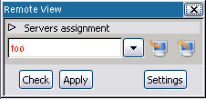
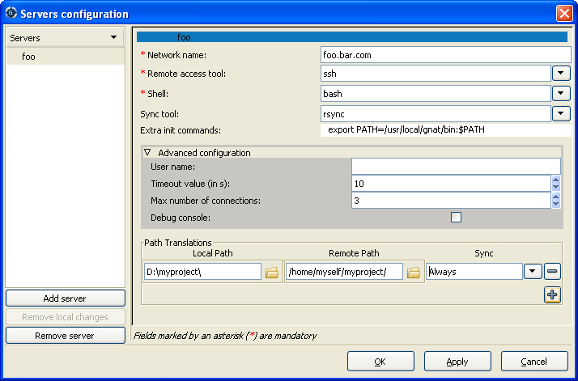

.. _Using_GPS_for_Remote_Development:

********************************
Using GPS for Remote Development
********************************

.. index:: remote
.. index:: network
.. index:: client/server

It is common for programmers in a networked environment to use a desktop
computer that is not itself suitable for their development tasks. For
example, each developer may have a desktop PC running Windows or GNU/Linux
as their access to a company network and do all their development work on
shared networked servers. These remote servers may be running an operating
system different from the one on their desktop machine.

One common way of operating in such an environment is to access the server
through a remote windowing system such as X Window System. GPS can be used in
such way, but it is not necessarily the most efficient configuration because
running GPS remotely on a shared server increases the workload of the
server as well as traffic on the network. When the network is slow, user
interactions can become uncomfortably sluggish. This is unfortunate because
the desktop used to access the network is often a powerful PC that remains
idle most of the time. To address this situation, GPS offers the option of
running natively on the desktop, with compilation, execution, and/or
debugging activities performed transparently on one or more remote servers.

.. _Requirements:

Requirements
============

In order to compile, run, or debug on a host remote from GPS, your
configuration must meet the following conditions:

  .. index:: password

* Have a remote connection to the host using :program:`rsh`, :program:`ssh`,
  or :program:`telnet`.  GPS can handle passwords for such connections.

* Have either a Network Filesystem (i.e. NFS, SMB, or equivalent) sharing
  the project files between the host and the target or have
  :program:`rsync` installed on both client and server.  (:program:`rsync`
  can be found at `http://www.samba.org/rsync/
  <http://www.samba.org/rsync/>`_ for Unix, and is part of Cygwin under
  Windows: `http://www.cygwin.com <http://www.cygwin.com>`_.

* Either subprojects must be 'withed' by the main project using relative
  paths or the absolute paths must be the same on both the desktop and the
  server.

You perform the full remote development setup in two steps:

* Setup the remote servers configuration.
* Setup a remote project.

.. _Setup_the_remote_servers:

Setup the remote servers
========================

.. _The_remote_configuration_dialog:

The remote configuration dialog
-------------------------------

Open the remote configuration dialog using the `View->Remote` menu
to configure remote servers. You can also set a predefined configuration
when installing GPS by using XML files. (See :ref:`Defining_a_remote_server`,
and :ref:`Defining_a_remote_path_translation`, for more information.)

.. index:: screen shot

Once you have opened the :guilabel:`Remote` view, click on
:guilabel:`Settings` to open the servers configuration dialog.

.. index:: screen shot

This dialog consists of two parts:

* The left part dialog contains the list of configured servers, each
  identified by a nickname. Three buttons allow you to create, reinitialize,
  or delete a server.

* The right part contains the selected server's configuration.

To set up a remote server, first create a new server by clicking on the
:guilabel:`Add Server` button on the bottom left of the dialog. Enter a
unique nickname identifying the server (not necessarily the network name of
the server).  This server is automatically selected and the right part of
the dialog shows its configuration, which is initially mostly empty.

.. _Connection_settings:

Connection settings
-------------------

For each server, you first need to complete the section describing how GPS
should connect to that server.  All mandatory fields are identified by an
asterisk:

* Network Name

  The name used to connect to the server via your network.  It can be
  either an IP address, a host name on your local network, or a fully
  qualified name with domain.

* Remote Access Tool

  A drop-down list specifying the tool used to connect to the server.  GPS
  contains built in support for the following tools

  * :program:`ssh`
  * :program:`rsh`
  * :program:`telnet`
  * :program:`plink` (Windows tool) in :program:`ssh`, :program:`rsh`,
    or :program:`telnet` mode

  See :ref:`Defining_a_remote_connection_tool` if you need to add a
  different tool.  If a tool is not in your path (for example, because it
  is not installed), it won't appear in the tools list. Some tools
  incompatible with GPS are not displayed either, such as the Microsoft
  telnet client.

* Shell

  Which shell runs on the remote server.  GPS supports the following Unix
  shells:

  * sh
  * bash
  * csh
  * tcsh

  GPS also support the Windows shell (:file:`cmd.exe`). See
  :ref:`Limitations`, for Cygwin's shell usage on Windows: it is preferable
  to use :file:`cmd.exe` as a remote shell on Windows servers.

You may need to specify other fields, but they are not mandatory. Most are
accessible through the advanced configuration pane.

* The :guilabel:`Remote Sync Tool` is used to synchronize remote and local
  filesystems, if these are not shared filesystems. Only :program:`rsync` is
  supported by GPS.

* The :guilabel:`Extra Init Commands` lists initialization commands that
  GPS sends to the server when it connects to the remote machine, the
  chosen shell is launched, and your default initialization files are read
  (i.e.  .bashrc file for the bash shell).  GPS sends these extra commands,
  allowing you to, for example, specify a compilation toolchain.

* The :guilabel:`User Name` specifies the name used to connect to the
  server.  The default is your current login name on your local machine.

* The :guilabel:`Timeout` value determines when a connection to a remote
  host is considered dead. All elementary operations performed on the
  remote host (i.e., those operations that normally complete almost
  immediately) use this timeout value.  The default is 10 seconds. If you
  have a very slow network connection or a very overloaded server, set this
  to a higher value.

* The :guilabel:`Maximum Number of Connections` is the maximum number of
  simultaneous connections GPS is allowed to make to this server. If you
  want to compile, debug, and execute at the same time on the machine, GPS
  needs more than one connection to do this. The default is 3.

* Depending on the kind of server and the remote access tool used, commands
  sent to the server may require a specific line terminator, typically
  either the LF character or CR/LF characters. Usually GPS can
  automatically detect which is needed (the 'auto' mode), but you can force the
  choice to CR/LF (cr/lf handling set to 'on') or LF (cr/lf handling set to
  'off').

* The :guilabel:`Debug Console` allows you to easily debug a remote
  connection. If checked, it opens a console displaying all exchanges
  between GPS and the selected server.

.. _Path_settings:

Path settings
-------------

The final section of the configuration defines the path translations
between your local host and the remote server.

The remote path definitions allow GPS to translate your locally loaded
project (that resides in your local filesystem) to paths used on the remote
server. This section also tells GPS how to keep those paths synchronized
between the local machine and the remote server.

All your project's dependencies must reside in a path defined here.  You
retrieve those paths by using :command:`gnat list -v -Pyour_project`.
To add a new path, click on the :guilabel:`+` button and enter the
corresponding local and remote paths.

You can easily select the desired paths by clicking on the icon next to the
path's entry. Remote browsing is allowed only when the connection
configuration is set (see :ref:`Connection_settings`.) Clicking on
:guilabel:`Apply` applies your connection configuration and allows you to
browse the remote host to select the remote paths.

You can set one of five types of path synchronization for each path:

* :guilabel:`Never`: no synchronization is required from GPS because the paths
  are shared using an OS mechanism like NFS.
* :guilabel:`Manually`: synchronization is needed, but is only performed
  manually using the remote view buttons.
* :guilabel:`Always`: Relevant to source and object paths of your project.
  They are kept synchronized by GPS before and after every remote action (such
  as performing a build or run).
* :guilabel:`Once to local`/`Once to remote`: Relevant to project's
  dependencies. They are synchronized once when a remote project is
  loaded or when a local project is set remote. They can still be
  manually synchronized using the Remote View (:ref:`The_remote_view`.)

The way those paths need to be configured depends on your network architecture:

* If your project is on a filesystem shared between your host and the
  remote host (using NFS or SMB filesystems, for example), only the roots of
  those filesystems need to be specified, using each server's native paths
  (on Windows, the paths are specified using the
  "X:\\my\\mounted\\directory\\" syntax and on Unix, using the "/mnt/path/" 
  syntax).

* If the project's files are synchronized using :program:`rsync`, defining
  a too generic path translation leads to very slow synchronization. In
  that is the case, define the paths as specifically as possible in order to speed
  up the synchronization process.

Note that navigation to entities of the run-time is not supported in
remote mode.

.. _Setup_a_remote_project:

Setup a remote project
======================

.. index:: remote project

.. _Remote_operations:

Remote operations
-----------------

GPS defines four different categories of remote operation and corresponding
servers: Build operations, Debug operations, Execution operations and Tools
operations. All compiler-related operations are performed on the
Build_Server. The Tools_Server is explained below. The debugger runs on the
Debug_Server and the project's resulting programs run on the
Execution_Server. The GPS_Server (the local machine) is used for all other
operations.  These "servers" may not (and are often not) different
machines.

The Tools_Server handles all compiler related operations that do not depend
on a specific compiler version. It is used in dual compilation mode, for
example, to determine whether the action can be safely run using a very
recent compiler toolchain (which the Tools_Server runs), or whether a
specific, older baseline compiler version must be used.

If the remote mode is activated and the dual compilation mode is not, all
Tools_Server operations are executed on the Build_Server. Otherwise, if the
dual compilation mode is activated, all Tools_Server operations are always
executed on the local machine.

.. _The_remote_view:

The remote view
---------------

Use the :guilabel:`Remote` view (`View->Remote`) to assign servers
to categories of operations for the currently loaded project.  You can
assign a different server to each operation category if you fully expand
the :guilabel:`Servers Assignment` tab. Alternatively, assign all
categories to a single server in one step if the you have left the
:guilabel:`Servers Assignment` tab collapsed.

.. index:: screen shot
.. image:: remote-view-full.jpg

When you select a server for a particular category, the change is not
immediately effective, as indicated by the server's name appearing in
red. This allows you to check the configuration before applying it, by
pressing the :guilabel:`Check` button. This button tests for a correct 
remote connection and verifies that the project path exists on the build 
server and has an equivalent on the local machine.

Clicking the :guilabel:`Apply` button performs the following actions:

* Reads the default project paths on the Build_Server and translates them
  into local paths.
* Synchronizes those paths marked as Sync :guilabel:`Always` or
  :guilabel:`Once to local` from the build server.
* Loads the translated local project.
* Assigns the Build, Execution and Debug servers.

If one of those operations fails, GPS reports the errors in the
:guilabel:`Messages` view and retains the previous project settings.  Once
a remote server is assigned, the remote configuration is automatically
loaded each time the project is loaded.

Use the two buttons on the right of each server to manually perform a
synchronization from the server to your local machine (left button) or from
your local machine to the server (right button).

.. _Loading_a_remote_project:

Loading a remote project
------------------------

If the project you want to use is already on a remote server, you can
directly load it on your local GPS by using the :menuselection:`File -->
Open Project From Host` menu and selecting the server's nickname. This shows
you its file tree. Navigate to your project and select it. The project is
loaded as described above with all remote operations categories assigned to
the selected server by default.

You can reload your project from local files on your machine. The remote
configuration is automatically reapplied.

.. _Limitations:

Limitations
===========

The GPS remote mode imposes some limitations:

* Execution: you cannot use an external terminal to remotely execute your
  application. The :guilabel:`Use external terminal` checkbox of the run
  dialog has no effect if the program is run remotely.

* Debugging: you cannot use a separate execution window. The :guilabel:`Use
  separate execution window` option is ignored for remote debugging
  sessions.

* Cygwin on remote host: the GNAT compilation toolchain does not understand
  Cygwin's mounted directories.  To use GPS with a remote Windows server
  using Cygwin's :program:`bash`, you must use directories that are the
  same on Windows and Cygwin (absolute paths). For example, a project using
  "C:\\my_project" is accepted if Cygwin's path is :file:`/my_project`, but
  not if :file:`/cygdrive/c/my_project` is specified.

  Even if you use Cygwin's :program:`sshd` on such a server, you can still
  access it using :file:`cmd.exe` (:ref:`Connection_settings`.)
