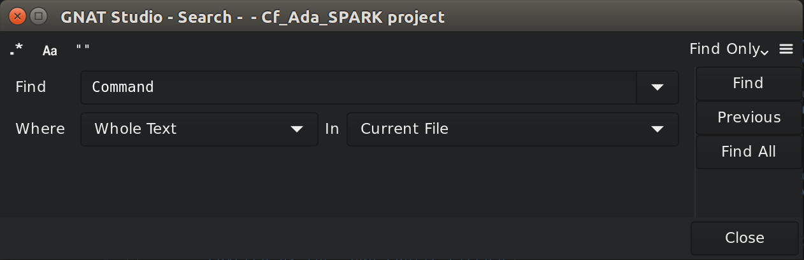
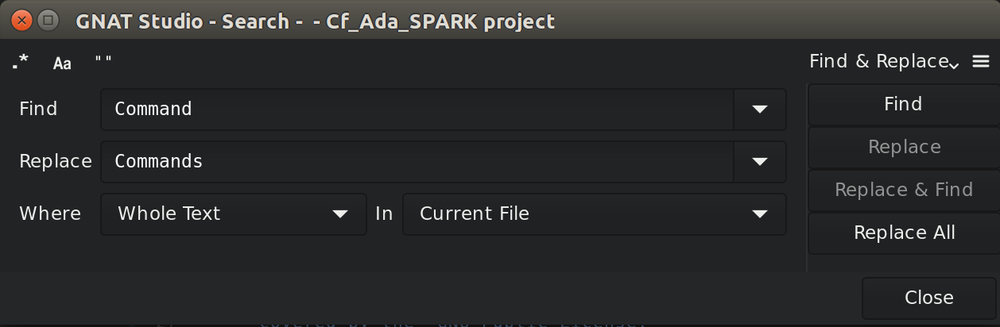

.. _Searching_and_Replacing:

***********************
Searching and Replacing
***********************

GPS provides extensive search capabilities in different contexts. For
example, you can search in the currently edited source file or in all
source files belonging to the project, even those that are not currently
open. You can also search in the project view (on the left side of the main
GPS window).

.. index:: project view
.. index:: search context
.. index:: menu; navigate --> find or replace

All of these search contexts are merged into a single graphical window that
you can open either through the :menuselection:`Find --> Find` menu or
the shortcut :kbd:`Ctrl-F`.

Searching
---------

By default, the search window is floating and appears as a dialog on top of
GPS. Put it inside the multiple document interface for easier access by
selecting the :menuselection:`Window --> Floating` menu and dropping the
search window into a new location (for example, above the
:guilabel:`Project` view).  Selecting either option pops up a dialog on the
screen similar to the following:

This dialog's toolbar contains several buttons that enable some specific
options:

* :guilabel:`Regexp`

  .. index:: regular expression

  Toggles between strings and regular expressions.  Or you can select the
  arrow to the right of the :guilabel:`Search for:` field.  The grammar
  used by regular expressions is similar to the Perl and Python regular
  expressions grammar and is documented in the GNAT run time file
  :file:`g-regpat.ads`. To open it from GPS, use the :ref:`open from
  project <Open_From_Project>` menu (:menuselection:`Find --> Find File in
  Project`) and type :file:`g-regpat.ads`.

* :guilabel:`Whole Word`

  .. index:: whole word

  Force the search engine to ignore substrings. For example, "sensitive"
  no longer matches "insensitive".

* :guilabel:`Case Sensitive Search`

  .. index:: case sensitive

  By default, patterns are case insensitive (upper-case letters and
  lower-case letters are considered equivalent).  Change this behavior by
  clicking this check box.

In addition, the dialog's local menu contains more general options used
to control the behavior of the Search view:

* :guilabel:`Incremental search`

  .. index:: incremental search

  Enable the incremental mode. In this mode, a search will be automatically
  performed whenever the search pattern is modified, starting from the
  current location to the next occurrence in the current file.

* :guilabel:`Close on Match`

  .. index:: close dialog on match

  This button only appears if the search window is floating. If pressed,
  the search window is automatically closed when an occurrence of the
  search string is found.

* :guilabel:`Select on Match`

  .. index:: select window on match

  Gives the focus to the editor containing the match. If not selected, the
  focus remains on the search window.  If so, press :kbd:`Enter` to search
  for the next occurrence.

By default, the search view contains three searching related widgets:

*Search*
  .. index:: search

  Type the string or pattern to search for.

  The combo box provides a number of predefined patterns. The top two are
  empty patterns that automatically set the appropriate strings or regular
  expression mode. The other regular expressions are language-specific and
  match patterns such as Ada type definitions or C++ method declarations.

  .. index:: C++
  .. index:: Ada

*Where*
  .. index:: where

  Used restrict the search to a set of language constructs.  For example, use
  this to to avoid matching comments when you are only interested in actual code
  or to only search strings and comments, but not code.

*In*
  .. index:: in

  The context in which the search should occur.

  .. index:: search context

  GPS automatically selects the most appropriate context when you open the
  search dialog by looking at the component that currently has the
  focus. If several contexts are possible for one component (for example,
  the editor has :guilabel:`Current_File`, :guilabel:`Files from Project`,
  :guilabel:`Files...`, and :guilabel:`Open Files`), the last one you used
  is selected.

Change the context to a different one by clicking on the arrow on the
right, which displays the list of all possible contexts, including:

  * :command:`Open Files`

    Search all files currently open in the source editor.

  * :command:`Files...`

    Search a specified set of files. An extra :guilabel:`Files` box is
    displayed where you specify the files using standard shell (Unix or
    Windows) regular expressions (such as :file:`*.ad?` for all files
    ending with :samp:`.ad` and any trailing character). The directory
    specifies where the search starts and the :guilabel:`Recursive search`
    button whether subdirectories are also searched.

  * :command:`Files From Projects`

    Search all files from the current project, including files from project
    dependencies.

  * :command:`Files From Current Project`

    Search all files from the current project, defaulting to the root
    project if none. The currently selected project might be the one to
    which the source file belongs (if you are in an editor) or the selected
    project (if you are in the :guilabel:`Project` view).

  * :command:`Files From Runtime`

    Search all specification files from GNAT runtime library

  * :command:`Current File`

    Search the current source editor.

  .. index:: preferences; search --> preserve search context

  Normally, GPS sets the default value for :guilabel:`In` that matches the
  currently selected window. For example, if you are in an editor and open the
  search dialog, the context is set to :guilabel:`Current File`. Optionally, GPS
  can remember the last context that was set (see the preference
  :menuselection:`Search --> Preserve Search Context`). In that case, if an
  editor is selected, GPS remembers whether the last time you started a search
  from an editor you decided to search in (for example) :guilabel:`Current File`
  or :guilabel:`Files From Project`.

  Finally, you can create key shortcuts (through the :menuselection:`Edit -->
  Preferences...` menu, in the :guilabel:`Search` category) to open the search
  dialog and set the context to a specific value.

The right part of the dialog is a row of three buttons, used to navigate
among the search results.

Press the :guilabel:`Find` or :guilabel:`Previous` button to perform an
interactive search, which stops as soon as one occurrence of the pattern is
found.  At that point, the :guilabel:`Find` button is renamed to
:guilabel:`Next`, which you press (or type the equivalent shortcut
:kbd:`Ctrl-N`) to go to the next occurrence.

The :guilabel:`Find all` button starts a search for all occurrences and
puts the results in a view called :guilabel:`Locations` view,
see :ref:`The_Locations_View`.

Replacing
---------

The combo box present in the toolbar is used to switch the search view's
mode: switch to :guilabel:`Find & Replace` to enable replacing
capabilities. You can also use the :menuselection:`Navigate --> Replace` menu
or the :kbd:`Ctrl-Shift-F` shortcut to switch to this mode.

In this mode, an additional field is displayed:

*Replace*
  .. index:: replace

  Contains the string to replace the occurrences of the pattern. The combo box
  provides a history of previously used replacement strings. If a regular
  expression is used for search, special escapes in this field are used as:

  * :samp:`\\1`, :samp:`\\2` .. :samp:`\\9` refer to the corresponding matching
    subexpressions.

  * :samp:`\\0` refers to the complete matched string.

  * :samp:`\\i`, :samp:`\\i(start,step)` refers to the sequentially increasing
    number (starting from start and increased by step on each replace).

The :guilabel:`Replace` and :guilabel:`Replace & Find` buttons are grayed
out if no occurrence of the pattern is found. To enable them, start a
search, for example by pressing the :guilabel:`Find` button. Pressing
:guilabel:`Replace` replaces the current occurrence (grays out the two
buttons) and :guilabel:`Replace & Find` replaces the occurrence and jumps
to the next one, if any. If you do not want to replace the current
occurrence, jump to the next one by pressing :guilabel:`Next`.

The :guilabel:`Repl all` button replaces all occurrences found. By default,
a popup is displayed asking for confirmation. You can disable this popup by
either checking the box :guilabel:`Do not ask this question again` or going
to the :guilabel:`Search` panel of the preferences pages and unchecking
:guilabel:`Confirmation` for :guilabel:`Replace all`.

.. index:: Multiple Document Interface

Like most GPS components, the search window is under control of the
multiple document interface and can be integrated into the main GPS window
instead of being an external window.  To do this, open the
:menuselection:`Window --> Search` menu in the list at the bottom of the
menu, and either select :menuselection:`Window --> Floating` or
:menuselection:`Window --> Docked`.

If you save the desktop (:menuselection:`File --> Save More --> Desktop`),
GPS automatically reopens the search dialog in its new place when it is next
started.

Searching in current file
-------------------------

The dialog we described above is convenient when you want to search in
multiple files, or even in files that are not opened in GPS. However,
the most frequent context is to search in the current file. GPS provides
a number of facilities just for this:

* Use the :guilabel:`Incremental search` option

  When this option is enabled, GPS automatically jumps to the next match for the
  word you are currently typing.

* Use the omni-search

  At the top-right corner of the GPS window, the search field is able to
  search in all the sources of your project. But it can also search just
  in the current source. The recommended approach is once again to define
  a new key shortcut via :menuselection:`Edit --> Preferences...`, for
  the action `Global Search in context: current file`.
  Whenever you press that shortcut from now on, GPS will move the keyboard
  focus to the global search box, and when you type some text, a popup
  window will show all occurrences of that text within the current file.
