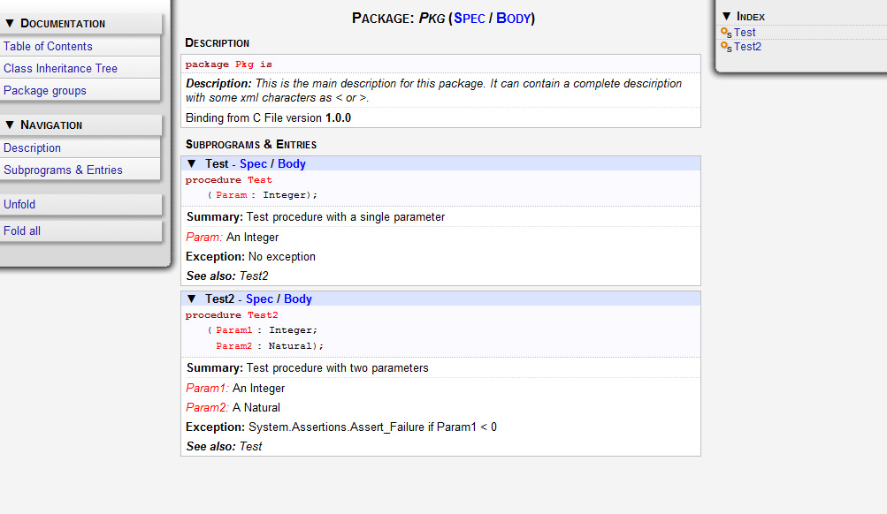

.. _Tools:

*****
Tools
*****

.. index:: tools

.. _The_Tools_Menu:

The Tools Menu
==============

The `Tools` menu gives access to additional tools. Some items are currently
disabled, meaning that these are planned tools not yet available.

The list of active items includes:

*Views*

  *Bookmarks*
    .. index:: bookmark

    :ref:`Bookmarks`.

  *Call Trees*
    Open a tree view of function callers and callees. See also

    :ref:`Call_Graph`.

  *Clipboard*
    :ref:`The_Clipboard_View`.

  *Coverage Report*
    :ref:`Coverage Report <Coverage_Report>`.

  *Entities*
    Open the Entity View in the bottom area

    :ref:`The_Entity_View`.

  *Files*
    Open a file system explorer on the left area.

    :ref:`The_File_View`.

  *File Switches*
    :ref:`File Switches <File_Switches>`.

  *Outline*
    Open a view of the current source editor.

    :ref:`The_Outline_View`.

  *Messages*
    Open the Messages winbdow

    :ref:`The_Messages_Window`.

  *Project*
    :ref:`The_Project_View`.

  *Remote*
    :ref:`Setup_a_remote_project`.

  *Scenario*
    :ref:`Scenarios_and_Configuration_Variables`.

  *Tasks*
    :ref:`The_Task_Manager`.

  *VCS Activities*
    :ref:`The_VCS_Activities`.

  *VCS Explorer*
    :ref:`The_VCS_Explorer`.

  *Windows*
    Open a view containing all currently opened files.

    :ref:`The_Window_View`.

*Browsers*

  *Call Graph*
    :ref:`Call_Graph`.

  *Dependency*
    :ref:`Dependency_Browser`.

  *Entity*
    :ref:`Entity_Browser`.

*Coding Standard*
  .. index:: Coding Standard

  :ref:`Coding_Standard`.

*Compare*
  .. index:: visual diff

  :ref:`Visual_Comparison`.

*Consoles*

  *GPS Shell*
    .. index:: shell

    Open a shell console at the bottom area of GPS. Note that this not an OS
    shell console, but a GPS shell console, where you can type GPS specific
    commands such as `help`.

    :ref:`The_Shell_and_Python_Windows`.

  *Python*
    .. index:: python

    Open a python console to access the python interpreter.
    :ref:`The_Shell_and_Python_Windows`.

  *OS Shell*
    .. index:: shell

    Open an OS (Windows or Unix) console, using the environment variables
    `SHELL` and `COMSPEC` to determine which shell to use.
    :ref:`The_Shell_and_Python_Windows`.

    On Unix, this terminal behaves a lot like a standard Unix terminal. In
    particular, you need to make sure that your shell will output all the
    information. In some cases, the configuration of your shell
    (:file:`.bashrc` if you are running bash for instance) will deactivate the
    echo of what you type to the terminal. Since GPS is not outputing anything
    on its own, just showing what the shell is outputing, you need to somehow
    ensure that your shell always echos what you type. This is done by running
    the command::

      stty echo
      
    in such cases. In general, this can be safely done in your :file:`.bashrc`

  *Auxiliary Builds*
    Open the console containing auxiliary builds output. For now, only
    cross-reference automated generation output is redirected to this console.
    :ref:`Working_with_two_compilers`.

*Coverage*
  .. index:: code coverage

  :ref:`Code_Coverage`.

*Documentation*
  .. index:: documentation

  :ref:`Documentation_Generation`.

*Stack Analysis*
  .. index:: stack analysis

  :ref:`Stack_Analysis`.

*Macro*
  .. index:: macros

  :ref:`Recording_and_replaying_macros`.

*Metrics*
  .. index:: metrics

  :ref:`Metrics`.

*Plug-ins*
  .. index:: plug-ins

  :ref:`The_Plug-ins_Editor`.

*Interrupt*
  .. index:: interrupt

  Interrupt the last task launched (e.g. compilation, vcs query, ...).

.. _Coding_Standard:

Coding Standard
===============

.. index:: coding standard

The Coding Standard menu allows you to edit your coding standard file, as can
be understood by gnatcheck, as well as run it against your code, to verifiy its
compliance with this coding standard.

Note that you can also use the contextual menu to check the conformance of a
particular project or source file against a Coding Standard.

The Coding standard editor is triggered by the menu Tools->Coding
Standard->Edit Rules File. The editor allows you to select an existing coding
standard file, or create a new one. The editor adapts itself to the version of
gnatcheck you are using on your local machine.

The currently used rules are summarized in the bottom of the editor. Once all
rules are defined, you can check the box 'Open rules file after exit' to
manually verify the created file.

Once the Coding Standard file is created, you can define it as the default
coding standard file for a project by going to the project editor, selecting
the 'Switches' tab, and using this file in the 'Gnatcheck' section.

.. _Visual_Comparison:

Visual Comparison
=================

.. index:: visual diff

The visual comparison, available either from the VCS menus or from the Tools
menu, provide a way to display graphically differences between two or three
files, or two different versions of the same file.

The 2-file comparison tool is based on the standard text command *diff*,
available on all Unix systems. Under Windows, a default implementation is
provided with GPS, called *gnudiff.exe*.  You may want to provide an alternate
implementation by e.g. installing a set of Unix tools such as cygwin
(`http://www.cygwin.com <http://www.cygwin.com>`_).

The 3-file comparison tool is based on the text command *diff3*, available on
all Unix systems. Under Windows, this tool is not shipped with GPS. It is
available as part of cygwin, for example.

When querying a visual comparison in GPS, in Side_By_Side mode, the user area
will show, side by side, editors for the files involved in the comparison.  The
reference file is placed by default on the left side. When in Unified mode, GPS
will not open a new editor, but will show all the changes directly in the
original editor. Note that Unified mode is relevant only when comparing two
files: when comparing three files, the Side_By_Side mode is used.

Color highlighting will be added to the file editors:

*gray*
  This color is used for all the chunks on the reference (left) file. Only
  the modified (right) file is displayed with different colors.

*yellow*
  This color is used to display lines that have been modified compared to the
  reference file. When there are fine differences within one line, they are
  shown in a brighter yellow.

*green*
  Used to display lines added compared to the reference file; in other words,
  lines that are not present in the reference file.

*red*
  Used to display lines removed from the reference file; in other words,
  lines that are present only in the reference file.

These colors can be configured, :ref:`The_Preferences_Dialog`.

As with all highlighted lines in GPS, the visual differences highlights are
visible in the Speed Column at the left of the editors.

Blank lines are also added in the editors, in places that correspond to
existing lines in the other editors. The vertical and horizontal scrolling are
synchronized between all editors involved in a visual comparison.

When a visual comparison is created, the Locations View is populated with the
entries for each chunk of differences, and can be used to navigate between
those.

Closing one of the editors involved in a visual comparison removes the
highlighting, blank lines, and scrolling in the other editors.

Editors involved in a visual comparison have a contextual menu `Visual diff`
that contains the following entries:

*Recompute*
  Regenerates the visual comparison. This is useful, for example, when one of
  the editors has been modified by hand while it was involved in a visual
  comparison

*Hide*
  Removes the highlighting corresponding to the visual comparison from all
  editors involved

*Close editors*
  Closes all editors involved in this visual comparison

*Use this editor as reference*
  Change the reference to this editor. (This is only visible when displaying a
  visual comparison involving 3 files).

.. index:: screen shot
.. image:: visual-diff.jpg

.. _Code_Fixing:

Code Fixing
===========

.. index:: code fixing
.. index:: wrench icon

GPS provides an interactive way to fix or improve your source code, based on
messages (errors and warnings) generated by the GNAT compiler.

This capability is integrated with the *Locations View* (see
:ref:`The_Locations_View`): when GPS can take advantage of a compiler message,
an icon is added on the left side of the line.

For a simple fix, a wrench icon is displayed. If you click with the left button
on this icon, the code will be fixed automatically, and you will see the change
in the corresponding source editor. An example of a simple fix, is the addition
of a missing semicolon.

You can also check what action will be performed by clicking on the right
button which will display a contextual menu with a text explaining the action
that will be performed. Similarly, if you display the contextual menu anywhere
else on the message line, a sub menu called *Code Fixing* gives you access to
the same information. In the previous example of a missing semicolon, the menu
will contain an entry labeled *Add expected string ";"*.

Once the code change has been performed, the tool icon is no longer displayed.

For more complex fixes, where more than one change is possible, a wrench icon
with a blue *plus* sign is displayed.  In this case, clicking on the icon will
display the contextual menu directly, giving you access to the possible
choices. For example, this will be the case when an ambiguity is reported by
the compiler for resolving an entity.

Right clicking on a message with a fix will open a contextual menu with an
entry "Auto Fix". Fixes that can be applied by clicking on the wrench are
available through that menu as well. In addiditon, if exactly one of the fixes
is considered to be safe by GPS, additional entries will be provided to apply
fixes on multiple messages:

*Fix all similar errors*
  Will apply the same simple fix for all errors which are detected by the system
  as being the same kind. This is based on message parsing.

*Fix all simple style errors and warnings*
  This entry is offered only when the selected message is a warning and a style
  error. Will fix all other warnings and style errors for which a unique simple
  fix is available.

*Fix all simple errors*
  Will fix all errors messages for which a unique simple fix is available

.. _Documentation_Generation:

Documentation Generation
========================

.. index:: documentation generation

GPS provides a documentation generator which processes source files and
generates annotated HTML files.

It is based on the source cross-reference information (e.g. generated by GNAT
for Ada files). This means that you should ensure that cross-reference
information has been generated before generating the documentation.  It also
relies on standard comments that it extracts from the source code.  Note that
unlike other similar tools, no macro needs to be put in your comments. The
engine in charge of extracting them coupled with the cross-reference engine
gives GPS all the flexibility needed to generate accurate documentation.

.. highlight:: ada

The documentation is put by default into a directory called :file:`doc`,
created under the object directory of the root project loaded in GPS. If no
such object directory exists, then it is directly created in the same directory
as the root project. This behavior can be modified by specifying the attribute
Documentation_Dir in the package IDE of your root project::

  project P is
     package IDE is
        for Documentation_Dir use "html";
     end IDE;
  end P;

Once the documentation is generated, the main documentation file is loaded in
your default browser.

The documentation generator uses a set of templates files to control the final
rendering. This means that you can control precisely the rendering of the
generated documentation. The templates used for generating the documentation
can be found under :file:`<install_dir>/share/gps/docgen2`. If you need a
different layout as the proposed one, you can change directly those files.

In addition, user-defined structured comments can be used to improve the
generated documentation. The structured comments use xml-like tags. To define
your own set of tags, please refer to the GPS python extension documentation
(from GPS Help menu, choose 'Python extensions').

The string values inside those tags are handled very roughly the same way as in
regular xml: duplicated spaces and line returns are ignored. One exception is
that the layout is preserved in the following cases:

*The line starts with "- " or "* "*
  In this case, GPS makes sure that a proper line return precedes the line. This
  is to allow lists in comments

*The line starts with a capital letter*
  GPS then supposes that the preceding line return was intended, so it is kept

Some default tags have been already defined by GPS in
:file:`<install_dir>/share/gps/plug-ins/docgen_base_tags.py`. The tags handled
are:

*summary*
  Short summary of what a package or method is doing.

*description*
  Full description of what a package or method is doing.

*parameter (attribute "name" is expected)*
  Description of the parameter named "name".

*exception*
  Description of possible exceptions raised by the method.

*seealso*
  Reference to another package, method, type, etc.

*c_version*
  For bindings, the version of the C file.

*group*
  For packages, this builds an index of all packages in the project grouped by
  categories.

*code*
  When the layout of the value of the node needs to be preserved. The text is
  displayed using a fixed font (monospace).

The following sample shows how those tags are translated::

  --  <description>
  --    This is the main description for this package. It can contain a complete
  --    description with some xml characters as < or >.
  --  </description>
  --  <group>Group1</group>
  --  <c_version>1.0.0</c_version>
  package Pkg is

     procedure Test (Param : Integer);
     --  
Test procedure with a single parameter

     --  <parameter name="Param">An Integer</parameter>
     --  <exception>No exception</exception>
     --  <seealso>Test2</seealso>

     procedure Test2 (Param1 : Integer; Param2 : Natural);
     --  
Test procedure with two parameters

     --  <parameter name="Param1">An Integer</parameter>
     --  <parameter name="Param2">A Natural</parameter>
     --  <exception>System.Assertions.Assert_Failure if Param1 < 0</exception>
     --  <seealso>Test</seealso>

  end Pkg;
  
Its documentation will be:

.. index:: screen shot

The documentation generator can be invoked from the `Tools->Documentation`
menu:

*Generate project*
  Generate documentation for all files from the loaded project.

*Generate projects & subprojects*
  Generate documentation for all files from the loaded project as well all
  its subprojects.

*Generate current file*
  Generate documentation for the file you are currently editing.

*Generate for...*
  This will open a File Selector Dialog (:ref:`The_File_Selector`) and
  documentation will be generated for the file you select.

In addition, when relevant (depending on the context), right-clicking with
your mouse will show a `Documentation` contextual menu.

From a source file contextual menu, you have one option called *Generate for
<filename>*, that will generate documentation for this file and if needed its
corresponding body (:ref:`The_Preferences_Dialog`).

From a project contextual menu (:ref:`The_Project_View`), you will have the
choice between generating documentation for all files from the selected project
only or from the selected project recursively.

You will find the list of all documentation options in
:ref:`The_Preferences_Dialog`.

Note that the documentation generator relies on the ALI files created by GNAT.
Depending on the version of GNAT used, the following restrictions may or may
not apply:

* A type named *type* may be generated in the type index.

* Parameters and objects of private generic types may be considered as
  types.

.. _Metrics:

Metrics
=======

.. index:: Metrics

GPS provides an interface with the GNAT software metrics generation tool
`gnatmetric`.

The metrics can be computed for the one source file, for the current project,
or for the current project and its imported subprojects

The metrics generator can be invoked either from the `Tools->Metrics`
menu or from the contextual menu.

The Metrics Menu
----------------

The `Metrics` submenu is available from the `Tools` global menu and
contains:

*Compute metrics for current file*
  Generate metrics for the current source file.

*Compute metrics for current project*
  Generate metrics for all files from the current project.

*Compute metrics for current project and subprojects*
  Generate metrics for all files from the current project and subprojects.

The Contextual Menu
-------------------

When relevant (depending on the context), right-clicking with your mouse will
show metrics-related contextual menu entries.

From a source file contextual menu, you have an option called *Metrics for
file* that will generate the metrics for the current file.

From a project contextual menu (:ref:`The_Project_View`), you have an option
*Metrics for project* that will generate the metrics for all files in the
project.

After having computed metrics, a new window in the left-side area is displayed
showing the computed metrics as a hierarchical tree view. The metrics are
arranged by files, and then by scopes inside the files in a nested fashion.
Double-clicking on any of the files or scopes displayed will open the
appropriate source location in the editor. Any errors encountered during
metrics computation will be displayed in the Locations Window.

.. _Code_Coverage:

Code Coverage
=============

.. index:: Code Coverage

GPS provides a tight integration with Gcov, the GNU code coverage utility.

Code coverage information can be computed from, loaded and visualized in GPS.
This can be done file by file, for each files of the current project, project
by project (in case of dependencies) or for the entire project hierarchy
currently used in GPS.

Once computed then loaded, the coverage information is summarized in a
graphical report (shaped as a tree-view with percentage bars for each item) and
used to decorate source code through mechanisms such as line highlighting or
coverage annotations.

All the coverage related operations are reachable via the
`Tools->Coverage` menu.

In order to be loaded in GPS, the coverage information need to be computed
before, using the `Tools->Coverage->Gcov->Compute coverage files` menu for
instance.

At each attempt, GPS automatically tries to load the needed information and
reports errors for missing or corrupted :file:`.gcov` files.

To be able to produce coverage information from Gcov, your project must have
been compiled with the *-fprofile-arcs* and *-ftest-coverage*" switches,
respectively "Instrument arcs" and "Code coverage" entries in
:ref:`The_Project_Properties_Editor`, and run once.

Coverage Menu
-------------

The `Tools->Coverage` menu has a number of entries, depending on the
context:

*Gcov->Compute coverage files*
  Generates the *.gcov* files of current and properly compiled and run
  projects.

*Gcov->Remove coverage files*
  Deletes all the *.gcov* of current projects.

*Show report*
  Open a new window summarizing the coverage information currently loaded in
  GPS.

*Load data for all projects*
  Load or re-load the coverage information of every projects and subprojects.

*Load data for project `XXX`*
  Load or re-load the coverage information of the project `XXX`.

*Load data for :file:`xxxxxxxx.xxx`*
  Load or re-load the coverage information of the specified source file.

*Clear coverage from memory*
  Drop every coverage information loaded in GPS.

The Contextual Menu
-------------------

When clicking on a project, file or subprogram entity (including the entities
listed in the coverage report), you have access to a *Coverage* submenu.

This submenu contains the following entries, adapted to the entity selected.
For instance, if you click on a file, you will have:

*Show coverage information*
  Append an annotation column to the left side of the current source editor.
  This column indicates which lines are covered and which aren't. Unexecuted
  lines are also listed in the :ref:`The_Locations_View`.

*Hide coverage information*
  Withdraw from the current source editor a previously set coverage annotation
  column and clear :ref:`The_Locations_View` from the eventually listed
  uncovered lines.

*Load data for :file:`xxxxxxxx.xxx`*
  Load or re-load the coverage information of the specified source file.

*Remove data of :file:`xxxxxxxx.xxx`*
  Remove the coverage information of the specified source file from GPS memory.

*Show Coverage report*
  Open a new window summarizing the coverage information. (This entry appears
  only if the contextual menu has been created from outside of the Coverage
  Report.)

The Coverage Report
-------------------

.. _Coverage_Report:

When coverage information is loaded, a graphical coverage report is displayed.
This report contains a tree of Projects, Files and Subprograms with
corresponding coverage information for each node in sided columns.

.. index:: screen shot
.. image:: report-of-analysis_tree.jpg

The contextual menus generated on this widget contain, in addition to the
regular entries, some specific Coverage Report entries.

These entries allow you to expand or fold the tree, and also to display flat
lists of files or subprograms instead of the tree. A flat list of file will
look like:

.. index:: screen shot
.. image:: report-of-analysis_flat.jpg

GPS and Gcov both support many different programming languages, and so code
coverage features are available in GPS for many languages. But, note that
subprogram coverage details are not available for every supported languages.

Note also that if you change the current main project in GPS, using the
*Project->Open* menu for instance, you will also drop every loaded coverage
information as they are related to the working project.

.. _Stack_Analysis:

Stack Analysis
==============

.. index:: Stack Analysis

GPS provides an interface to `GNATstack`, the static stack analysis tool.  This
interface is enabled only if you have the *gnatstack* executable installed on
your system and available on the path.

Stack usage information can be computed from, loaded and visualized in GPS for
the entire project hierarchy used in GPS. Stack usage information for unknown
and unbounded calls can be edited in GPS.

Once computed and loaded, the stack usage information is summarized in a
report, and used to decorate source code through stack usage annotations. The
largest stack usage path is filled into the :ref:`The_Locations_View`.

Stack usage information for undefined subprograms can be specified by adding a
:file:`.ci` file to the set of GNATStack switches in the `Switches` attribute
of the `Stack` package of your root project, e.g::

  project P is
     package Stack is
        for Switches use ("my.ci");
     end Stack;
  end P;
  

You can also specify this information by using the `GNATStack` page of the
`Switches` section in the :ref:`The_Project_Properties_Editor`. Several files
can be specified.

:ref:`The Stack Usage Editor <The_Stack_Usage_Editor>` can be used to edit
stack usage information for undefined subprograms.

The Stack Analysis Menu
-----------------------

All stack analysis related operations are reachable via the `Tools->Stack Analysis` menu:

*Analyze stack usage*
  Generates stack usage information for the root project.

*Open undefined subprograms editor*
  Opens undefined subprograms editor.

*Load last stack usage*
  Loads or re-loads last stack usage information for the root project.

*Clear stack usage data*
  Removes stack analysis data loaded in GPS and any associated information such
  as annotations in source editors.

The Contextual Menu
-------------------

When clicking on a project, file or subprogram entity (including the entities
listed in the coverage report), you have access to a *Stack Analysis* submenu.

This submenu contains the following entries, related to the entity selected:

*Show stack usage*
  Shows stack usage information for every subprogram of currently selected file.

*Hide stack usage*
  Hides stack usage information for every subprogram of currently selected file.

*Call tree for xxx*
  Opens Call Tree view for currently selected subprogram.

The Stack Usage Report
----------------------

.. _The_Stack_Usage_Report:

When the stack usage information is loaded, a report is displayed containing
a summary of the stack analysis.

The Stack Usage Editor
----------------------

.. _The_Stack_Usage_Editor:

The Stack Usage Editor allows to specify stack usage for undefined subprograms
and use these values to refine results of future analysis.

.. index:: screen shot
.. image:: stack-usage-editor.jpg

The Stack Usage Editor consists of two main areas. The notebook in the top area
allows to select the file to edit. It displays the contents of the file and
allows changing the stack usage of subprograms. The table in the bottom area
displays all subprograms whose stack usage information is not specified so that
they can be set.

Stack usage information for subprograms can be specified or changed by clicking
in the stack usage column on the right of the subprogram's name.  When a value
is specified in the bottom area table, the subprogram is moved to the top table
of the currently selected file. When a negative value is specified, the
subprogram is moved to the bottom table.

All changes are saved when the stack usage editor window is closed.

