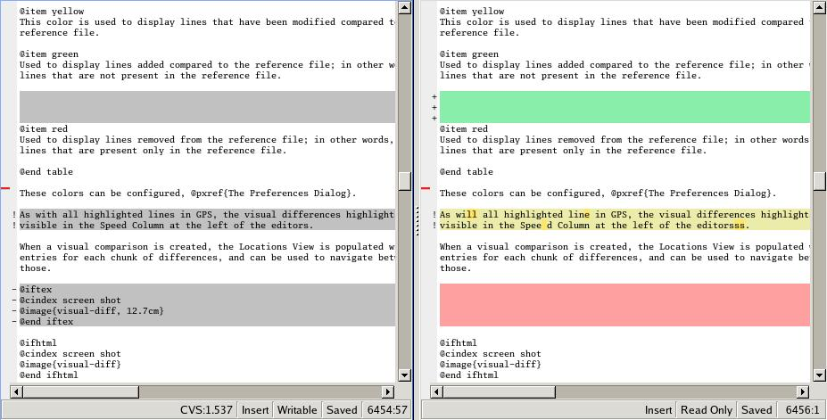
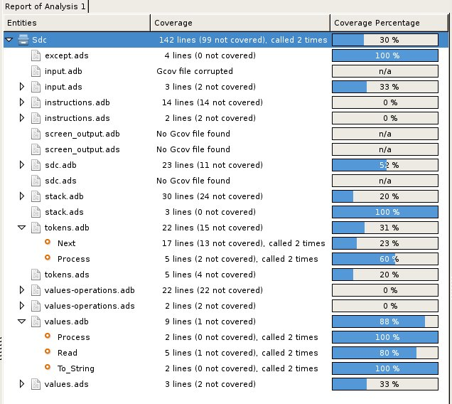
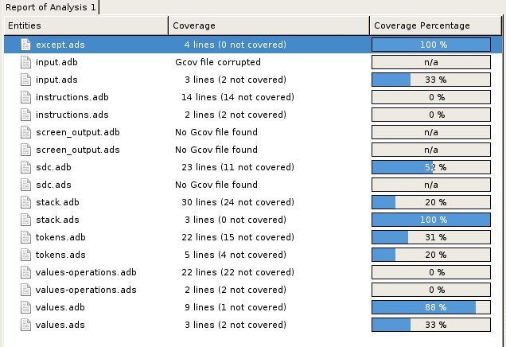
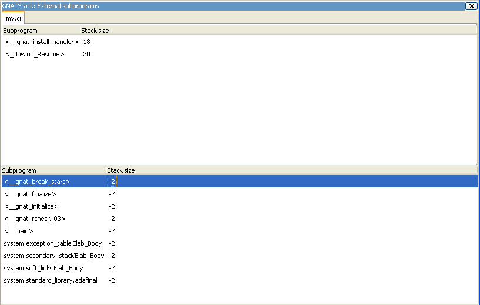

.. _Tools:

*****
Tools
*****

.. _Coding_Standard:

Coding Standard
===============

.. index:: coding standard

Use the :guilabel:`Coding Standard` menu to edit your coding standard file
and run it against your code to verify its compliance with the coding
standard.  This file is the input to the :program:`gnatcheck` tool.  You
can also use the contextual menu to check the conformance of a particular
project or source file against a coding standard.

Access the Coding standard editor using the :menuselection:`Analyze -->
Coding Standard --> Edit Rules File` menu.  Select either an existing
coding standard file or create a new one. The editor adapts itself to the
version of :program:`gnatcheck` on your local machine.

GPS summarizes the rules currently in use at the bottom of the editor. Once
all rules are defined, check the box :guilabel:`Open rules file after exit`
to manually verify the created file.  Once you have created the coding
standard file, set it as the default coding standard file for a project by
going to the project editor, selecting the :guilabel:`Switches` tab, and
specifying this file in the :guilabel:`Gnatcheck` section.

.. _Visual_Comparison:

Visual Comparison
=================

.. index:: visual diff

The visual comparison, available either from the VCS menus or the
:guilabel:`Tools` menu, provides a way to graphically display differences
between two or three files or two different versions of the same file.

The 2-file comparison tool uses the standard tool :program:`diff`,
available on all Unix systems. Under Windows, a default implementation is
provided with GPS, called :file:`gnudiff.exe`, but you may want to provide
an alternate implementation, for example by installing a set of Unix tools
such as Cygwin (`http://www.cygwin.com <http://www.cygwin.com>`_).  The
3-file comparison tool is based on the text tool :program:`diff3`,
available on all Unix systems. Under Windows, this tool is not provided
with GPS, but is available as part of Cygwin.

GPS displays visual comparisons in either Side-by-Side or Unified mode.  In
Side-by-Side mode, GPS displays editors for the files involved in the
comparison side by side.  By default, GPS places the reference file on the
left. In Unified mode, GPS does not open a new editor, but shows all the
changes in the original editor.  Unified mode is used only when comparing
two files; when comparing three files, only Side-by-Side mode is available.

Lines in the file editors are highlighted with various colors.  In
side-by-side mode, only the right editor (for the modified file) has
different colors.  Each highlight color indicates a different type of line:

*gray*

 All the lines in the reference (left) file.

*yellow*

  Lines modified from the reference file. Small differences within one line
  are shown in a brighter yellow.

*green*

  Lines not originally in the reference file but added to the modified
  file.

*red*

  Lines present in the reference file but deleted from the modified file.

You can configure these colors in the preferences dialog.

Like all highlighted lines in GPS, the visual differences highlights are
visible in the :guilabel:`Speed Column` at the left of the editors.

GPS adds blank lines in one editor in places corresponding to existing
lines in the other editors and synchronizes vertical and horizontal
scrolling between the editors involved in a visual comparison.  If you
close one of those editors, GPS removes the highlighting, blank lines, and
scrolling in the other editors.

When you create a visual comparison, GPS populates the
:guilabel:`Locations` view with the entries for each chunk of differences;
use them to navigate between differences.

Editors involved in a visual comparison have a contextual menu
:guilabel:`Visual diff` containing the following entries:

* :guilabel:`Recompute`

  Regenerate the visual comparison.  Use this when you have modified one of
  the files in an editor by hand while it is involved in a visual
  comparison.

* :guilabel:`Hide`

  Remove the highlighting corresponding to the visual comparison from all
  involved editors.

* :guilabel:`Close editors`

  Closes all editors involved in this visual comparison

* :guilabel:`Use this editor as reference`

  Make this editor the reference (this is only present when displaying a
  visual comparison involving 3 files).

.. index:: screen shot

.. _Code_Fixing:

Code Fixing
===========

.. index:: code fixing
.. index:: wrench icon

GPS provides an interactive mechanism to correct or improve your source
code based on error and warning messages generated by the GNAT compiler.
This capability is integrated with the :guilabel:`Locations` view (see
:ref:`The_Locations_View`): when GPS can make use of a compiler message, it
adds an icon on the left of the line.

If a wrench icon is displayed and you left-click on it, the code is fixed
automatically, and you will see the change in the corresponding source editor.
This occurs when a simple fix, such as the addition of a missing semicolon,
is sufficient to resolve the error.

Right-click on the icon to display a contextual menu with text explaining
the action that would be performed on a left-click.  Displaying a
contextual menu anywhere else on the message line provides an option called
:guilabel:`Auto Fix`, giving you access to the same information. For the
previous example of a missing semicolon, the menu contains an entry
labeled :guilabel:`Add expected string ";"`.  You can choose to
:guilabel:`Apply to this occurrence` or :guilabel:`Apply to all similar
errors`.  The latter option applies the same simple fix to all errors that
are the same, based on parsing the error message.  The wrench icon is
removed once the code change has been made.

For more complex errors where more than one change is possible, GPS
displays a wrench icon with a blue plus sign.  Clicking the icon displays a
contextual menu listing the possible fixes. For example, this is displayed
when an ambiguity in resolving an entity is reported by the compiler.

Right-clicking on a message with a fix opens a contextual menu with an
entry :guilabel:`Auto Fix`. Fixes that can be applied by clicking on the
wrench are also available through that menu. In addition, if GPS considers
one of the fixes to be safe, it provides additional menu entries to apply
fixes at multiple locations:

*Fix all simple style errors and warnings*

  Offered only when the selected message is a style warning or error.
  Fixes all other style warnings and errors for which a unique simple fix
  is available.

*Fix all simple errors*

  Fixes all errors messages for which a unique simple fix is available

.. _Documentation_Generation:

Documentation Generation
========================

.. index:: documentation generation

GPS uses the GNATdoc tool to generate documentation from source files.
See GNATdoc User's Guide for more information about this tool,
including comment formatting and possibilities for customization.

Invoke the documentation generator from the :menuselection:`Analyze ->
Documentation` menu:

*Generate Project*

  Generate documentation for all files in the loaded project.

*Generate Projects & Subprojects*

  Generate documentation for all files in the loaded project and its
  subprojects.

*Generate current file*

  Generate documentation for the current file.

.. _Working_With_Unit_Tests:

Working With Unit Tests
=======================

GPS uses :program:`gnattest`, a tool that creates unit-test stubs as well
as a test driver infrastructure (harness).  It can generate harnesses for a
project hierarchy, a single project or a package.  Launch harness
generation process from the :menuselection:`Analyze --> GNATtest` menu or a
contextual menu.

After a harness project has been generated, GPS switches to it, allowing
you to implement tests, compile and run the harness.  You can exit the
harness project and return to original project at any point.

The GNATtest Menu
-----------------

The :guilabel:`GNATtest` submenu is found in the :guilabel:`Tools` global
menu and contains the following entries:

*Generate unit test setup*

  Generate harness for the root project.

*Generate unit test setup recursive*

  Generate harness for the root project and subprojects.

*Show not implemented tests*

  Find tests that have have never been modified and list them in the
  :guilabel:`Locations` view. This menu is only active in the harness
  project.

*Exit from harness project*

  Return from harness to original project.

The Contextual Menu
-------------------

When relevant to the context, right-clicking displays GNATtest-related
contextual menu entries.  The contextual menu for a source file containing
a library package declaration has a :menuselection:`GNATtest --> Generate
unit test setup for <file>` menu that generates the harness for that
package.  The contextual menu for a project, (see :ref:`The_Project_View`),
has a :menuselection:`GNATtest --> Generate unit test setup for <project>`
menu that generates the harness for the entire project.  The
:menuselection:`GNATtest --> Generate unit test setup for <project>
recursive` menu generates a harness for whole hierarchy of projects. If a
harness project already exists, the :menuselection:`GNATtest --> Open
harness project` menu opens the harness project.

While a harness project is open, you can simply navigate between the tested
routine and its test code.  Clicking on the name of a tested routine
produces the :menuselection:`GNATtest --> Go to test case`,
:menuselection:`GNATtest --> Go to test setup`, and
:menuselection:`GNATtest --> Go to test teardown` menus .  The contextual
menu for source files of test cases or setup and teardown code has a
:menuselection:`GNATtest --> Go to <routine>` menu to go to the code being
tested.

Project Properties
------------------

You configure GNATtest's behavior through the GNATtest page in
:ref:`The_Project_Properties_Editor`.

.. _Metrics:

Metrics
=======

.. index:: Metrics

GPS provides an interface to the GNAT software metrics generation tool
:program:`gnatmetric`.  Metrics can be computed for one source file, the
current project, or the current project and all its imported subprojects

Invoke the metrics generator from the :menuselection:`Analyze --> Metrics`
menu or the contextual menu.

The Metrics Menu
----------------

The :guilabel:`Metrics` submenu is available from the :guilabel:`Tools`
global menu and contains:

*Compute metrics for current file*

  Generate metrics for the current source file.

*Compute metrics for current project*

  Generate metrics for all files in the current project.

*Compute metrics for current project and subprojects*

  Generate metrics for all files in the current project and subprojects.

The Contextual Menu
-------------------

When relevant to the context, right-clicking displays metrics-related
contextual menu entries.  The contextual menu for a source file has an
entry :guilabel:`Metrics for file` that generates the metrics for the
current file.  The contextual menu for a project (see
:ref:`The_Project_View`) has an entry :guilabel:`Metrics for project` that
generates the metrics for all files in the project.

After computing the requested metrics, GPS displays a new window in the
left area showing the computed metrics in a hierarchical tree form,
arranged first by files and then by scopes inside the files.
Double-clicking any of the files or scopes opens the corresponding source
location in the editor. GPS displays any errors encountered during metrics
computation in the :guilabel:`Locations` view.

.. _Code_Coverage:

Code Coverage
=============

.. index:: Code Coverage

GPS is integrated with :program:`gcov`, the GNU code coverage utility.
Within GPS, you can compute, load, and visualize code coverage information.
You can do this for individual files, for each file of the current project,
for individual projects in a hierarchy, or for the entire project hierarchy
currently loaded by GPS.

Once computed and loaded, GPS summarizes the coverage information in a
graphical report, formatted as a tree-view with percentage bars for each
item, and uses it to decorate source code through line highlighting and
coverage annotations.

You will find all coverage related operations in the :menuselection:`Analyze
--> Coverage` menu.  Before GPS can load coverage information, it must be
computed, for example by using the :menuselection:`Analyze --> Coverage -->
Gcov --> Compute coverage files` menu.  After each coverage computation,
GPS tries to load the needed information and reports errors for missing or
corrupted :file:`.gcov` files.

To produce coverage information from :program:`gcov`, your project must be
compiled in `gcov` build mode.

Coverage Menu
-------------

The :menuselection:`Analyze --> Coverage` menu has a number of entries,
depending on the context:

* :menuselection:`Gcov --> Compute coverage files`

  Generate the :file:`.gcov` files for loaded projects that have been
  compiled and executed.

* :menuselection:`Gcov --> Remove coverage files`

  Delete all the :file:`.gcov` file for loaded projects.

* :menuselection:`Show report`

  Open a new window summarizing the coverage information currently loaded
  in GPS.

* :menuselection:`Load data for all projects`

  Load (or reload) coverage information for every project and subproject.

* :menuselection:`Load data for project `XXX``

  Load or re-load coverage information for the project `XXX`.

* :menuselection:`Load data for xxxxxxxx.xxx`

  Load (or reload) coverage information for the specified source file.

* :menuselection:`Clear coverage from memory`

  Remove all coverage information loaded in GPS.

The Contextual Menu
-------------------

When clicking on a project, file or subprogram entity (including the
entities listed in the coverage report), you will see a :guilabel:`Coverage`
submenu containing the following options, depending on the type of entity
selected.  For example, if you click on a file, the options are:

* :guilabel:`Show coverage information`

  Display an annotation column on the left side of the current source
  editor to indicate which lines are covered and which are not.  Lines that
  are not covered are also listed in the :guilabel:`Locations` view.  See
  :ref:`The_Locations_View`.

* :guilabel:`Hide coverage information`

  Remove the annotation column from the current source editor and clear
  coverage information from the :guilabel:`Locations` view.

* :guilabel:`Load data for xxxxxxxx.xxx`

  Load (or reload) coverage information for the specified source file.

* :guilabel:`Remove data of `xxxxxxxx.xxx`

  Delete coverage information from the specified source file.

* :guilabel:`Show Coverage report`

  Open a new window summarizing the coverage information. (This entry
  appears only if the contextual menu has been created from outside the
  Coverage Report.)

The Coverage Report
-------------------

.. _Coverage_Report:

Once GPS loads coverage information, it displays a graphical coverage
report containing a tree of Projects, Files and Subprograms with
corresponding coverage information for each shown in a column on the side.

.. index:: screen shot

The contextual menus generated for this report contain, in addition to
the regular entries, some specific Coverage Report options allowing you to
expand or fold the tree, or to display flat lists of files or subprograms
instead of a tree. A flat list of files looks like:

.. index:: screen shot

GPS and :program:`gcov` both support many different programming languages,
so code coverage features are available in GPS for many languages. But
subprogram coverage details are not available for every supported language.
If you change the current main project in GPS, using the
:menuselection:`File --> Open Project` menu, for example, GPS deletes all
loaded coverage information for the loaded project.

.. _Stack_Analysis:

Stack Analysis
==============

.. index:: Stack Analysis

GPS provides an interface to :program:`GNATstack`, the static stack
analysis tool.  This interface is only available if you have the
:file:`gnatstack` executable installed and available on your path.  GPS
computes, loads, and visually displays stack usage information for the
entire project hierarchy.  You can enter stack usage information for
unknown and unbounded calls within GPS.

Once computed and loaded, GPS summarizes the stack usage information in a
report and uses it to annotate source code with stack usage
annotations. The largest stack usage path is loaded into the
:guilabel:`Locations` view.  See :ref:`The_Locations_View`.

Specify stack usage information for undefined subprograms by adding one or
more :file:`.ci` files to the set of GNATStack switches in the `Switches`
attribute of the :samp:`Stack` package of your root project.  For example::

  project P is
     package Stack is
        for Switches use ("my.ci");
     end Stack;
  end P;
  

You can also specify this information by using the :guilabel:`GNATStack`
page of the :guilabel:`Switches` section in the
:ref:`The_Project_Properties_Editor`.  Use :ref:`The Stack Usage Editor
<The_Stack_Usage_Editor>` to edit stack usage information for undefined
subprograms.

The Stack Analysis Menu
-----------------------

Access all the stack analysis operations via the
:menuselection:`Analyze --> Stack Analysis` menu:

*Analyze stack usage*

  Generate stack usage information for the root project.

*Open undefined subprograms editor*

  Open the undefined subprograms editor.

*Load last stack usage*

  Load (or reload) the latest stack usage information for the root project.

*Clear stack usage data*

  Remove stack analysis data loaded in GPS and any associated information such
  as annotations in source editors.

The Contextual Menu
-------------------

The contextual menu for a project, file, or subprogram entity (including the
entities listed in the coverage report) has a :guilabel:`Stack Analysis`
submenu containing the following options, depending on the type of entity
selected:

*Show stack usage*

  Show stack usage information for every subprogram in the currently
  selected file.

*Hide stack usage*

  Hide stack usage information for every subprogram in the currently
  selected file.

*Call tree for xxx*

  Open the :guilabel:`Call Tree` view for the currently selected subprogram.

The Stack Usage Report
----------------------

.. _The_Stack_Usage_Report:

Once GPS has loaded the stack usage information, it displays a report
containing a summary of the stack analysis.

The Stack Usage Editor
----------------------

.. _The_Stack_Usage_Editor:

The :guilabel:`Stack Usage Editor` allows you to specify the stack usage of
undefined subprograms so these values can be used to refine results of
future analysis.

.. index:: screen shot

The :guilabel:`Stack Usage Editor` contains two main areas. The notebook on
the top allows you to select the file to edit. It displays the contents of the
file and allows you to enter or change the stack usage of subprograms in
it. The table in the bottom area displays all subprograms whose stack usage
information is not specified and allows you to set them.

Specify the stack usage information for subprograms by clicking in the
stack usage column to the right of the subprogram's name.  When you specify
a value in the bottom table, the subprogram is moved to the top table of
the currently selected file. When a negative value is specified, the
subprogram is moved to the bottom table.

GPS saves all changes when the stack usage editor window is closed.
