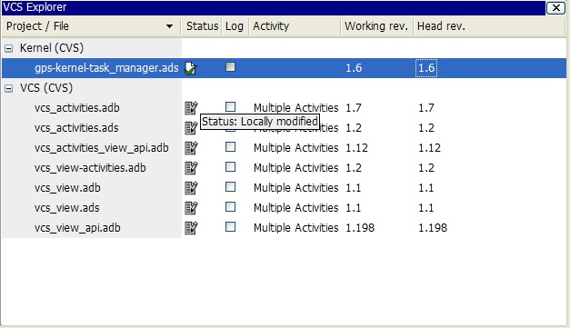

.. _Version_Control_System:

**********************
Version Control System
**********************

.. index:: version control

GPS offers the possibility for multiple developers to work on the same project,
through the integration of version control systems (VCS). Each project can be
associated to a VCS, through the `VCS` tab in the Project properties editor.
:ref:`The_Project_Properties_Editor`.

GPS does not come with any version control system: it uses underlying
command-line systems such as Subversion or ClearCase to perform the low level
operations, and provides a high level user interface on top of them. Be sure to
have a properly installed version control system before enabling it under GPS.

The systems that are supported out of the box in GPS are:

*Auto*
  .. index:: VCS, auto

  GPS can be setup to auto-detect the actual VCS to use for each project. This
  is done by selecting `Auto` in the `VCS` tab of the Project properties
  editor. :ref:`The_Project_Properties_Editor`.  This is also the default
  behavior when no VCS is specified in the project.

*ClearCase*
  .. index:: VCS, ClearCase

  The standard ClearCase interface, which is built-in and uses a generic GPS
  terminology for VCS operations.

  Note that, at the moment, only Snapshot Views are supported in the ClearCase
  integration; Dynamic Views are not supported.

*ClearCase Native*
  .. index:: VCS, ClearCase Native

  Which is fully customizable and uses by default the terminology specific to
  ClearCase.

  Note that, at the moment, only Snapshot Views are supported in the ClearCase
  integration; Dynamic Views are not supported.

*CVS*
  .. index:: VCS, CVS

  The Concurrent Version System.

  GPS needs a corresponding *patch* command that usually comes with it.

*Git*
  .. index:: VCS, Git

  Distributed fast source code management. Support for Git on GPS is partial.
  Basic commands are supported but the full power of Git (like working with the
  index) is only available on the command line.

  GPS needs a corresponding *diff* command that usually comes with it.

*Subversion*
  .. index:: VCS, Subversion

  The Subversion version control system. Note that on Windows this version is
  intended to be used with Cygwin/Subversion and fully supports the Cygwin path
  names.

  GPS needs a corresponding *patch* and *diff* command that usually comes with
  it.

*Subversion Windows*
  .. index:: VCS, Subversion Windows

  The Windows native Subversion version control system. The external Subversion
  commands are expected to be built for the Win32 subsystem. This version does
  not support Cygwin path names.

  GPS needs a corresponding *patch* and *diff* command
  that usually comes with it.

The default VCS that GPS will use is "Auto" by default, and this can be
configured through :ref:`The_Preferences_Dialog`.

It is also possible to add your own support for other version control systems,
or modify one of the existing interfaces, see
:ref:`Adding_support_for_new_Version_Control_Systems` for more information.

It is recommended that you first get familiar with the version control system
that you intend to use in GPS first, since many concepts used in GPS assume
basic knowledge of the underlying system.

Associating a VCS to a project enables the use of basic VCS features on the
source files contained in the project. Those basic features typically include
the checking in and out of files, the querying of file status, file revision
history, comparison between various revisions, and so on.

.. index:: password

Note: the set-up must make sure that the VCS commands can be launched without
entering a password.

.. _The_VCS_Explorer:

The VCS Explorer
================

.. index:: VCS explorer
.. index:: version control

The VCS Explorer provides an overview of source files and their status. A file
edited in GPS will be automatically added on the VCS Explorer with a Modified
status (see below).

.. index:: screen shot

The easiest way to bring up the VCS Explorer is through the menu
`VCS->Explorer`. The Explorer can also be brought up using the contextual menu
`Version Control->Query status` on files, directories and projects in the file
and project views, and on file editors.
:ref:`The_Version_Control_Contextual_Menu`.

The VCS Explorer contains the following columns:

*Project / File*
  This is a two levels tree, the first level contains the name of the project
  and the second the name of files inside the project. Next to the project name
  the VCS name, if any, is displayed. This is the only information available
  for a project. The columns described below are for the files only. This
  column can be sorted by clicking on the header.

*Status*
  Shows the status of the file. This column can be sorted by clicking on
  the header. The different possible status for files are the following:

  *Unknown*
    .. image:: gps-vcs-unknown.jpg

    The status is not yet determined or the VCS repository is not able to
    give this information (for example if it is unavailable, or locked).

  *Not registered*
    .. image:: gps-vcs-not-registered.jpg

    The file is not known to the VCS repository.

  *Up-to-date*
    .. image:: gps-vcs-up-to-date.jpg

    The file corresponds to the latest version in the corresponding branch
    on the repository.

  *Added*
    .. image:: gps-vcs-added.jpg

    The file has been added remotely but is not yet updated in the local
    view.

  *Removed*
    .. image:: gps-vcs-removed.jpg

    The file still exists locally but is known to have been removed from
    the VCS repository.

  *Modified*
    .. image:: gps-vcs-modified.jpg

    The file has been modified by the user or has been explicitly opened
    for editing.

  *Needs merge*
    .. image:: gps-vcs-needs-merge.jpg

    The file has been modified locally and on the repository.

  *Needs update*
    .. image:: gps-vcs-needs-update.jpg

    The file has been modified in the repository but not locally.

  *Contains merge conflicts*
    .. image:: gps-vcs-has-conflicts.jpg

    The file contains conflicts from a previous update operation.

*Log*
  This column indicates whether a revision log exists for this file.

*Activity*
  The name of the activity the file belongs to. See :ref:`The_VCS_Activities`
  for more details.

*Working rev.*
  Indicates the version of the local file.

*Head rev.*
  Indicates the most recent version of the file in the repository.

The VCS Explorer supports multiple selections. To select a single line, simply
left-click on it. To select a range of lines, select the first line in the
range, then hold down the :kbd:`Shift` key and select the last line in the
range. To add or remove single columns from the selection, hold down the
:kbd:`Control` key and left-click on the columns that you want to
select/unselect. It is also possible to select files having the same status
using the `Select files same status` menu entry. See
:ref:`The_Version_Control_Contextual_Menu`.

.. index:: interactive search

The explorer also provides an :ref:`interactive search <Interactive_Search>`
capability allowing you to quickly look for a given file name. The default key
to start an interactive search is :kbd:`Ctrl-i`.

The VCS contextual menu can be brought up from the VCS explorer by
left-clicking on a selection or on a single line.
:ref:`The_Version_Control_Contextual_Menu`.

.. _The_VCS_Activities:

The VCS Activities
==================

.. index:: VCS activities
.. index:: version control

The VCS Activities give the ability to group files to be committed together.
The set of files can be committed atomically if supported by the version
control system used.

.. index:: screen shot
.. image:: vcs-activities.jpg

The way to bring up the VCS Activities view is through the `VCS->Activities`
menu.

The VCS Activities view contains the following columns:

*Activity / File*
  The name of the activity or files belonging to an activity. This
  column can be sorted by clicking on the header.

*Status*
  Shows the status of the file. This column can be sorted by clicking on
  the header. See :ref:`The_VCS_Explorer` for a full description.

*Log*
  This column indicates whether a revision log exists for this file.

*Working rev.*
  Indicates the version of the local file.

*Head rev.*
  Indicates the most recent version of the file in the repository.

The VCS Explorer supports multiple selections. To select a single line, simply
left-click on it. To select a range of lines, select the first line in the
range, then hold down the :kbd:`Shift` key and select the last line in the
range. To add or remove single columns from the selection, hold down the
:kbd:`Control` key and left-click on the columns that you want to
select/unselect.

There are different contextual menu entries depending on the position on the
screen.  On an empty area we have a simple contextual menu:

*Create new activity*
  Create a new activity. The name can be edited by double clicking on it.

On an activity line the contextual menu is:

*Group commit*
  This is a selectable menu entry. It is activated only if the
  VCS supports atomic commit and absolute filenames. See :ref:`The_VCS_node`
  for full details.

*Create new activity*
  Create a new activity. The name can be edited by double clicking on it.

*Re-open activity / Close activity*
  If the activity is closed it is possible to re-open it and if it is
  opened it is possible to close it manually.

*Delete activity*
  Remove the activity.

*Commit activity*
  Commit the activity. If group commit is activated then the commit log content
  is generated using a template file fully configurable.  See :ref:`Files`.  If
  group commit is not activated then the log content for each activity file is
  the file log catenated with the activity log. After this operation the file's
  log are removed but the activity log is kept as documentation.

*Query status*
  Query the status for all the source files contained in the activity.

*Update*
  Update all the source files contained in the activity.

*Compare against head revision*
  Show a visual comparison between the local activity files and the most recent
  version of those files in the repository.

*Build patch file*
  Create a patch file (in text format) for the activity. The patch file
  contains a header (the activity log and file's logs) and the diff of
  each file. The header format is fully configurable using a template
  file. See :ref:`Files`.

*Edit revision log*
  Edit the current revision log for activity. This log is shared with
  all the activity files.

*Remove revision log*
  Remove the current revision log for activity. This menu is present
  only if the activity revision log exists.

On a file line the contextual menu contains:

*Create new activity*
  Create a new activity. The name can be edited by double clicking on it.

*Remove from activity*
  Remove the selected file from the activity and delete the activity log.

*Edit revision log*
  Edit the current revision log for the selected file.

.. _The_VCS_Menu:

The VCS Menu
============

.. index:: version control
.. index:: menu

Basic VCS operations can be accessed through the VCS menu. Most of these
functions act on the current selection, i.e. on the selected items in the VCS
Explorer if it is present, or on the currently selected file editor, or on the
currently selected item in the `Tools->Views->Files`.  In most cases, the VCS
contextual menu offers more control on VCS operations.
:ref:`The_Version_Control_Contextual_Menu`.

*Explorer*
  Open or raise the VCS Explorer. :ref:`The_VCS_Explorer`.

*Update all projects*
  Update the source files in the current project, and all imported
  sub-projects, recursively.

*Query status for all projects*
  Query the status of all files in the project and all imported sub-projects.

*Create tag...*
  Create a tag or branch tag starting from a specific root
  directory. The name of the tag is a simple name.

*Switch tag...*
  Switch the local copy to a specific tag. The name of the tag depends
  on the external VCS used. For CVS this this the simple tag name, for
  Subversion the tag must conform to the default repository layout. For
  a branch tag this is `/branches/<tag_name>/<root_dir>`.

For a description of the other entries in the VCS menu, see
:ref:`The_Version_Control_Contextual_Menu`

.. _The_Version_Control_Contextual_Menu:

The Version Control Contextual Menu
===================================

This section describes the version control contextual menu displayed when you
right-click on an entity (e.g. a file, a directory, a project) from various
parts of GPS, including the project view, the source editor and the VCS
Explorer.

Depending on the context, some of the items described in this section won't be
shown, which means that they are not relevant to the current context.

*Remove project*
  Only displayed on a project line. This will remove the selected
  project from the VCS Explorer.

*Expand all*
  Expand all VCS Explorer project nodes.

*Collapse all*
  Collapse all VCS Explorer project nodes.

*Clear View*
  Clear the VCS Explorer.

*Query status*
  Query the status of the selected item. Brings up the VCS Explorer.

*Update*
  .. _Update:

  Update the currently selected item (file, directory or project).

*Commit*
  .. _Commit:

  Submits the changes made to the file to the repository, and queries
  the status for the file once the change is made.

  It is possible to tell GPS to check the file before the actual commit
  happens. This is done by specifying a `File checker` in the `VCS` tab of the
  project properties dialog. This `File checker` is in fact a script or
  executable that takes an absolute file name as argument, and displays any
  error message on the standard output. The VCS commit operation will actually
  occur only if nothing was written on the standard output.

  It is also possible to check the change-log of a file before commit, by
  specifying a `Log checker` in the project properties dialog. This works on
  change-log files in the same way as the `File checker` works on source files.

*Open*
  .. _Open:

  Open the currently selected file for writing. On some VCS systems,
  this is a necessary operation, and on other systems it is not.

*View entire revision history*
  .. _View_revision_history:

  Show the revision logs for all previous revisions of this file.

*View specific revision history*
  Show the revision logs for one previous revision of this file.

*Compare against head revision*
  .. index:: compare

  .. _Compare_against_head:

  Show a visual comparison between the local file and the most recent
  version of that file in the repository.

*Compare against other revision*
  .. _Compare_against_working:

  Show a visual comparison between the local file and one specific
  version of that file in the repository.

*Compare two revisions*
  .. _Compare_against_revision:

  Show a visual comparison between two specific revisions
  of the file in the repository.

*Compare base against head*
  .. _Compare_base_against_head:

  Show a visual comparison between the corresponding version of the
  file in the repository and the most recent version of that file.

*Compare against tag/branch*
  .. _Compare_base_against_tag/branch:

  Only available on a Revision View and over a tag/branch. Show a visual
  comparison between the corresponding version of the file in the repository
  and the version of that file in the tag/branch.

*Annotate*
  .. _Annotate:

  Display the annotations for the file, i.e. the information for each line of
  the file showing the revision corresponding to that file, and additional
  information depending on the VCS system.

  When using CVS or Subversion, the annotations are clickable. Left-clicking on
  an annotation line will query and display the changelog associated to the
  specific revision for this line.

*Remove Annotate*
  Remove the annotations from the selected file.

*Edit revision log*
  Edit the current revision log for the selected file.

*Edit global ChangeLog*
  Edit the global ChangeLog entry for the selected file.
  :ref:`Working_with_global_ChangeLog_file`.

*Remove revision log*
  Clear the current revision associated to the selected file.

*Add*
  Add a file to the repository, using the current revision log for this
  file. If no revision log exists, activating this menu will create
  one. The file is committed in the repository.

*Add/No commit*
  Add a file to the repository, using the current revision log for this
  file. If no revision log exists, activating this menu will create
  one. The file is not committed in the repository.

*Remove*
  Remove a file from the repository, using the current revision log for
  this file. If no revision log exists, activating this menu will create
  one. The modification is committed in the repository.

*Remove/No commit*
  Remove a file from the repository, using the current revision log for
  this file. If no revision log exists, activating this menu will create
  one. The modification is not committed in the repository.

*Revert*
  Revert a locale file to the repository revision, discarding all local
  changes.

*Resolved*
  Mark files' merge conflics as resolved. Some version control systems
  (like Subversion) will block any commit until this action is called.

*Switch tag/bracnh*
  Only available on a Revision View and over a tag/branch name. Will
  switch the tree starting from a selected root to this specific tag or
  branch.

*Merge*
  Only available on a Revision View and over a tag/branch name. Merge
  file changes made on this specific tag/branch.

*View revision*
  Only available on a Revision View and over a revision.

*Commit as new Activity*
  An action to prepare a group-commit in just one-click. This action will:

*create an anonymous activity,*

  *add all files selected into the VCS Explorer into the newly*
    created anonymous activity,

*open the activity log,*
  Just fill the activity log and commit the anonymous activity.

*Add to Activity*
  A menu containing all the current activities. Selecting one will add
  the current file to this activity. This menu is present only if the
  file is not already part of an activity.

*Remove from Activity*
  Remove file from the given activity. This menu is present only if the
  file is already part of an activity.

*Directory*
  Only available when the current context contains directory information

  *Add/No commit*
    Add the selected directory into the VCS.

  *Remove/No commit*
    Remove the selected directory from the VCS.

  *Commit*
    Commit the selected directory into the VCS. This action is available
    only if the VCS supports commit on directories, :ref:`The_VCS_node`.

  *Add to Activity*
    Add the selected directory into the VCS. This action is available
    only if the VCS supports commit on directories, :ref:`The_VCS_node`.

  *Query status for directory*
    Query status for the files contained in the selected directory.

  *Update directory*
    Update the files in the selected directory.

  *Query status for directory recursively*
    Query status for the files in the selected directory and all
    subdirectories recursively. Links and hidden directories are not
    included.

  *Update directory recursively*
    Update the files in the selected directory and all
    subdirectories recursively. Links and hidden directories not included..

*Project*
  Only available when the current context contains project information

  *List all files in project*
    Bring up the VCS Explorer with all the source files contained in the
    project.

  *Query status for project*
    Query the status for all the source files contained in the project.

  *Update project*
    Update all the source files in the project.

  *List all files in project and sub-projects*
    Bring up the VCS Explorer with all the source files contained in the
    project and all imported sub-projects.

  *Query status for project and sub-projects*
    Query the status for all the source files contained in the project
    and all imported sub-projects.

  *Update project and sub-projects*
    Update all the source files in the project and all imported
    sub-projects.

*Select files same status*
  Select the files having the same status as the current selected file.

*Filters*
  Only available from the VCS Explorer. This menu controls filtering of the
  items displayed in the list.

  *Show all status*
    Do not filter out any file from the list in the VCS Explorer.

  *Hide all status*
    Filter out all the files from the list in the VCS Explorer.

  *Show <status>*
    When disabled, filter out the files with the given status from the VCS
    Explorer.

.. _Working_with_global_ChangeLog_file:

Working with global ChangeLog file
==================================

.. index:: global ChangeLog
.. index:: ChangeLog file

A global ChangeLog file contains revision logs for all files in a directory and
is named :file:`ChangeLog`. The format for such a file is::

     **ISO-DATE  *name  <e-mail>***

     <HT>* **filename**[, **filename**]:
     <HT>revision history

where:

*ISO-DATE*
  A date with the ISO format YYYY-MM-DD

*name*
  A name, generally the developer name

*<e-mail>*
  The e-mail address of the developer surrounded with '<' and '>' characters.

*HT*
  Horizontal tabulation (or 8 spaces)

The *name* and *<e-mail>* items can be entered automatically by setting the
`GPS_CHANGELOG_USER` environment variable. Note that there is two spaces
between the *name* and the *<e-mail>*::

  On sh shell:

     export GPS_CHANGELOG_USER="John Doe  <john.doe@home.com>"

  On Windows shell:
     set GPS_CHANGELOG_USER="John Doe  <john.doe@home.com>"
  

Using the menu entry **Edit global ChangeLog** will open the file
:file:`ChangeLog` in the directory where the current selected file is and
create the corresponding :file:`ChangeLog` entry. This means that the ISO date
and filename headers will be created if not yet present. You will have to enter
your name and e-mail address.

This :file:`ChangeLog` file serve as a repository for revision logs, when ready
to check-in a file use the standard **Edit revision log** menu command. This
will open the standard revision log buffer with the content filled from the
global :file:`ChangeLog` file.

.. _The_Revision_View:

The Revision View
=================

The revision view is used to display a revision tree for a given file. Each
node contains information for a specific revision of the file.

.. index:: screen shot
.. image:: revision-view.jpg

*the revision number*
  This corresponds to the external VCS revision number.

*author*
  The author of this revision.

*date / log*
  For root nodes this column contains the check-in date and eventually
  the list of tags and branches associated with this revision. For
  children nodes this contains the log for the corresponding revision.
