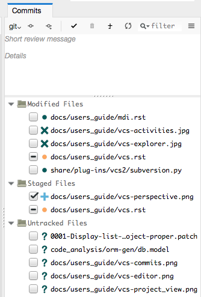
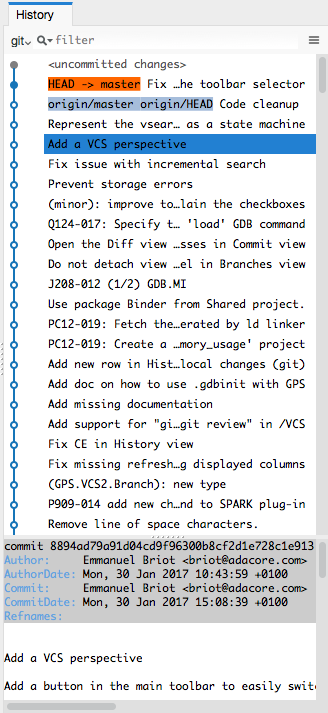
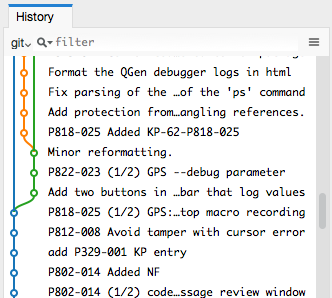
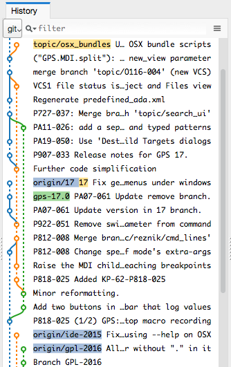
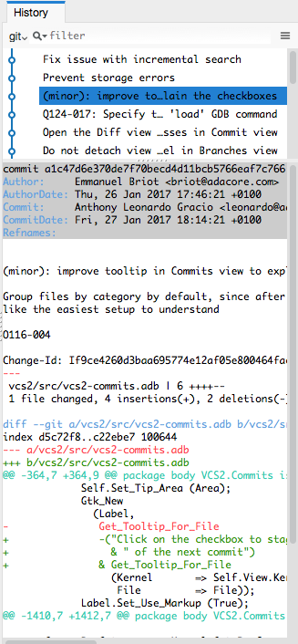
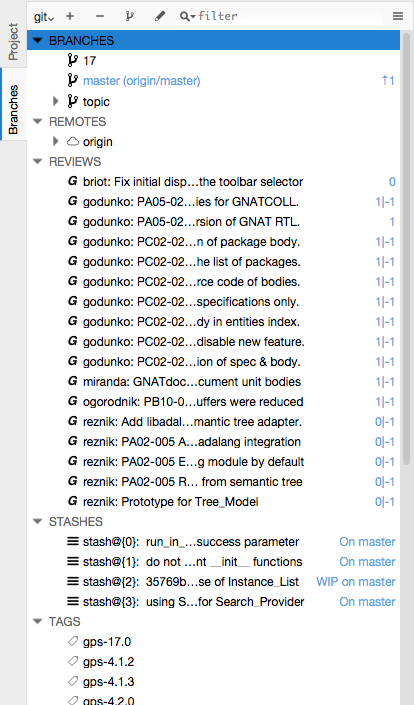
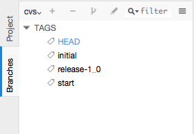
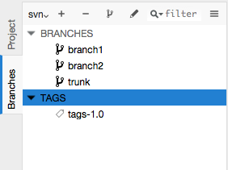
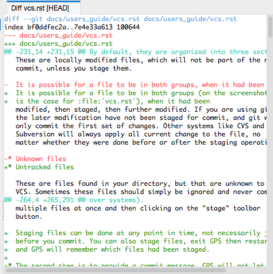

.. _Version_Control_System:

**********************
Version Control System
**********************

.. index:: version control

Version control systems (VCS) are used to keep previous versions of
your files, so that you can refer to them at any point in the future.

GPS provides integration with a number of such systems. It tries to
provide a similar GUI interface for all of them, while preserving
their specific vocabulary and features.

Setting up projects for version control
=======================================

GPS does not come with any version control system. Instead, it expects
that you already have such a system install on your machine. In some
cases, it is able to automatically recognize them. In other cases, you
will need to edit your project file as described below.

GPS has built in support for the following VCS systems:

* :guilabel:`None`

  Disables version control support in GPS::

     project Default is
        package IDE is
           for VCS_Kind use "None";
        end IDE;
     end Default;

* :guilabel:`Auto`  (default)

  Let GPS guess the correct version control system::

     project Default is
        package IDE is
           for VCS_Kind use "Auto";
        end IDE;
     end Default;

* :guilabel:`CVS`

  .. index:: VCS, CVS

  The Concurrent Version System.  To use this, you must have a
  :program:`patch` tool, which usually comes with CVS.
  GPS is automatically able to recognize that your project is using
  this system, but looking for a :file:`CVS` directory in the root
  directory of your project. You can also force it by setting the
  following in your project::

      project Default is
         package IDE is
            for VCS_Kind use "CVS";
         end IDE;
      end Default;

  This can of course be done via the graphical project editor in
  GPS.

* :guilabel:`Subversion`

  .. index:: VCS, Subversion

  The Subversion version control system.
  As for CVS, GPS will automatically recognize that your project is
  using subversion by looking for a :file:`.svn` directory in the root
  directory of your project. You can also force it by setting the
  following in your project::

      project Default is
         package IDE is
            for VCS_Kind use "Subversion";
         end IDE;
      end Default;

* :guilabel:`git`

  .. index:: VCS, Git

  Distributed fast source code management. Again, GPS will automatically
  recognize this by looking for a :file:`.git` directory in your project,
  but you can force this with::

      project Default is
         package IDE is
            for VCS_Kind use "git";
         end IDE;
      end Default;

Previous versions of GPS supported a larger range of systems, but these
have not been ported to the new code yet. Please let us know whether there
is interest in doing so:

* :guilabel:`ClearCase`
* :guilabel:`ClearCase Native`
* :guilabel:`Mercurial`

Most of the version control code in GPS is generic, and customized for
each system via one small python plugin. As a result, it should be possible
to add support for other systems, by creating such plugins. Take a look
at the files in the directory :file:`prefix/share/gps/plug-ins/vcs2` in
your GPS install.

As mentioned before, GPS automatically attempts to guess the correct
version system you are using. This is similar to having the following
declaration in your project::

      project Default is
         package IDE is
            for VCS_Kind use "auto";
         end IDE;
      end Default;

.. index:: password

Note: you must be sure VCS commands can be launched without needing to
enter a password.

In general, you will be have loaded one root project in GPS, but this
is turn imports many other projects. Each of these can use its own
version control system (so you can mix git and subversion for instance
if your sources come from different places), or even the same system
but for a different repository (so you could be cloning multiple git
repositories).

If you have a setup with multiple systems, GPS will show special buttons
in the local toolbars of the views to let you select which is the one to
use for the operations (fetching the history, committing,...) These
operations only apply to one system at a time, you cannot do a single
commit with files that belong to multiple systems (although you can do
a single commit for files that belong to multiple projects, provided
these projects all use the same system and same repository).

Finding file status (:guilabel:`Project` view)
==============================================

Most of the times, you will be using GPS on a project that already exists
and for which version control has already been setup.

For such a project, the first task is to find out what is the status of
the files, i.e. whether they are locally modified, up-to-date, whether
you have created new files but not yet added them to version control,
and so on.

To make this convenient, GPS displays this information in a number of
places, via a small icon and appropriate tooltips.

* The :guilabel:`editor` status bar

  .. image:: vcs-editor.png

  Whenever you are editing a file, GPS displays a small icon in the
  status bar that indicates its current status as seen by GPS. If you
  hover the mouse, it will show a textual status. In this screenshot,
  the file has been modified locally, but not committed yet into the
  version control system (git in this case).

  Clicking on this icon will change to the :ref:`The_VCS_perspective`.

* The :guilabel:`Project` view

  .. image:: vcs-project_view.png

  The :guilabel:`Project` view is convenient to see all your source
  files, grouped by projects and optionally directories. GPS will
  show the same icon as the editor next to the name of each file, so
  that you can easily see their status. Again, the tooltip would show
  the textual status.

* The :guilabel:`Files` view

  This view is similar to the :guilabel:`Project` view, but groups
  files as they are organized on the disk. GPS will try to guess the
  best system here, but there might be ambiguities when the same
  directory is shared among multiple projects which use a different
  VCS system or repository. We do not recommend this setup.

.. _The_VCS_Perspective:

The VCS Perspective
===================

.. image:: vcs-perspective.png

To display all pertinent information on your files, GPS uses multiple
views, as described below. Although you can open any of them whenever
you want, via the :menuselection:`View` or
:menuselection:`VCS` menus, the most
convenient is to select the VCS perspective.

This perspective was created to show all VCS related views, and hide
unrelated views. As for all GPS perspectives, you can modify the way
it looks, which views are displayed,... simply by opening new views
or moving them around while this perspective is selected.

See also :ref:`Perspectives` for more information on how to manipulate
them.

There are multiple ways to switch to this VCS perspective: as always,
you can use the toolbar's perspective selector, or the
:menuselection:`Window --> Perspectives` menu. The most convenient
might be to click on the VCS status icon at the bottom of each
editor.

In all of these cases, GPS will change which windows are displayed
on the screen. It will preserve your editors, but close all other
views, and instead show the following:

* The :guilabel:`Project` view, used to check the status of all
  files
* The :guilabel:`Commits` view (:ref:`The_Commits_View`), used to
  select which files should be committed, and do the actual commit
* The :guilabel:`History` view (:ref:`The_History_View`), to view
  all past commits
* The :guilabel:`Branches` view (:ref:`The_Branches_View`), to view
  various pieces of information about your repository, depending on
  which system you use.

.. _The_Commits_View:

The Commits view
================

The purpose of this view is to let you prepare and then commit your
files.

Viewing modified files
----------------------

The view lists all files in your project, to the exception of up-to-date
files (i.e. those files that have been checked out, and never touched
locally), and ignored files (i.e. those files for which you have
explicitly told the VCS that you will never want to commit them).

By default, they are organized into three sections:

* Staged files

  These files will be part of the next commit (see below)

* Modified but unstaged files

  These are locally modified files, which will not be part of the next
  commit, unless you stage them.

  It is possible for a file to be in both groups (on the screenshot, this
  is the case for :file:`vcs.rst`), when it had been
  modified, then staged, then further modified. If you are using git,
  the later modification have not been staged for commit, and git will
  only commit the first set of changes. Other systems like CVS and
  Subversion will always apply all current change to the file, no
  matter whether they were done before or after the staging operation.

* Untracked files

  These are files found in your directory, but that are unknown to the
  VCS. Sometimes these files should simply be ignored and never committed,
  but sometimes they will be newly created files that you should stage to
  include them in the next commit.

Various local configurations can be selected to change what is displayed
in this view, take a look at the menu and the tooltips.

Committing files
----------------

Committing is always a three step process in GPS (this is exactly
what git does natively, but also provides more flexibility for
over systems).

* First, you need to select which files will be part of the next
  commit. It is possible that you have been modifying unrelated
  source files, which you do not want to commit yet.

  This is called **staging** the files, and can be performed simply
  by clicking in the checkbox next to the file's name, or by selecting
  multiple files at once and then clicking on the "stage" toolbar
  button.

  Staging files can be done at any point in time, not necessarily just
  before you commit. You can also stage files, exit GPS then restart,
  and GPS will remember which files had been staged.

* The second step is to provide a commit message. GPS will not let you
  do a commit without an actual message (most VCS systems don't either).
  You can enter any message in the editor at the top of the
  :guilabel:`Commits` view.

  With git, the standard is to have one single short line first then an
  empty line, then a more extensive message. We recommend similar
  approaches for other systems. That first line is the one that will be
  displayed in the :guilabel:`History` (:ref:`The_History_View`).

  Just like for staging files, you can edit this message at any point in
  time, so it is a useful way to explain your changes as you do them,
  even if you intend to do further changes before the actual commit.

* Finally, you just press the :guilabel:`Commit` button in the local
  toolbar. GPS will ask the VCS to do the actual commit, and then will
  refresh all views. All files that were modified and staged before are
  shown as no longer modified, for instance.

Actions in the Commits view
---------------------------

Double-clicking on a file will open an editor for that file.

Clicking and keeping the mouse pressed on a file will open a :guilabel:`Diff`
view showing the current changes to the file.

The Commits view local toolbar
------------------------------

The commits view contains a number of buttons in its toolbar. The
exact set of buttons will depend on which VCS you are using, but here
is some buttons that will be useful in a lot of cases:

* On the left of the toolbar is a button to select the current VCS
  system, in case your projects uses multiple such systems, or multiple
  repositories with the same system. The commit and staging will always
  be done for the current system only.

  .. image:: vcs-selector.png

  This button is hidden if you are using a single VCS system for all your
  projects.

* A button is provided to undo all local changes.

  .. index:: undo local changes

  After confirmation, GPS will revert to the last commit, and cancel all
  changes you might have done locally. This works for all supported VCS.

* A button to refresh the contents of all VCS views

  This button is not needed if you do all operations from GPS, including
  editing files. But if you do operations outside of GPS's control, you
  will need to manually resynchronize the views with what's really in your
  VCS.

.. _The_History_View:

The History view
================

The purpose of this view is to show all past changes that you have done
with your VCS.

This view is divided into three parts:

List of all past commits
------------------------

For each commit, GPS displays the first line of the commit message.
Optionally, you can configure the view to also show the author, the
date, and the unique identifier for these commits.

Depending on the VCS in use, GPS will also show the name of the
branches associated with these commits, as well as specific tag names
that might have been set.

In particular, git shows the contents of all active branches, so the
history is not so linear, and there is a wealth of information to show
how the branches were split and joined in the past.

When this is too much information, you can use the local configuration
menu to only show the details for the current branch.

A special line (added at the top in the screenshot above) is displayed
in gray when there are local uncommitted changes in your working
directory.

By default, GPS only shows the first 2000 commits. If you want to see
more, scroll to the bottom and click on the :guilabel:`Show more`
buttons to download more entries.

Graph of past history
---------------------

Next to the list of commits is a graph showing their relationships.
Most of the times, this history is fairly linear, with each commit
having one parent commit, and followed by another commit.

But with some VCS like git, people might choose to use a lot more
branches. They create a new branch to work on a specific feature, then
merge it into the master branch when the feature is completed. It can
become harder to follow the history in such a case.

In this case, the graph becomes more useful, as shown in the screenshot
above.

But using the local configuration menu, you can also choose to only
show commits that are related to branches (either because they are the
beginning of a branch, or because they are a merge of two branches, or
because they have a special name (tag or branch name) associated with
them. All commits with a single parent and single child are hidden.

When you are using git, commits that have not yet been pushed to the
remote branch will be displayed with a filled circle to help you find
out whether you need to push.

Details on selected commits
---------------------------

Whenever you select one or more commits, GPS will download their
details and show those at the bottom of the :guilabel:`Commits`
view.

These details are those provided by the VCS, and generally include
the author and date of the commit, as well as the full commit
message and diff of what changes were made.

The diff is syntax highlighted to make it more readable.

.. _The_Branches_View:

The Branches view
=================

The purpose of this view is to display various pieces of information that
are specific to each VCS.

Most notably, it will let you interact with branches.

Various actions are possible in this view, all of which depends on the
VCS and which specific section of the view you interact with. Please
check the tooltips that are shown when you leave the mouse over a line
for a brief while to see what actions are possible. The actions are
done via one of the following means:

* double-clicking on a line. This is the same as using the corresponding
  toolbar button.
* a long click on a line (click and then leave the mouse pressed for a
  short while). This is the same as using the :guilabel:`rename` toolbar
  button.
* clicking on the :guilabel:`[+]` button in the toolbar.
* clicking on the :guilabel:`[-]` button in the toolbar.

Git and the Branches view
-------------------------

.. index:: git

The screenshot above is for git. In this case, GPS displays the following
pieces of information:

* List of local branches

  For each branch, GPS displays the number of commits that have not yet
  been pushed to the remote branch, and conversely the number of changes
  that have been made in the remote branch but not yet applied to the
  local branch.

  Double-clicking on any of them will check it out and make it the current
  branch. If you have locally modified files at that time, git might
  refuse to do the checkout, and the error message will be displayed in
  GPS's :guilabel:`Messages` view.

  A long click on any of the branch names will let you rename the branch.

  A click on :guilabel:`[+]` will create a new branch, starting from the
  selected one.

  A click on :guilabel:`[-]` will remove the selected branch if it is not
  the current one.

* List of remote branches

  These are the branches that exist in the git repository, that you can
  checkout locally by double-clicking on them. The branches are grouped
  by the name of the remote repository that contains this branch, since
  git is a distributed system.

  You can also delete a remote branch by clicking on :guilabel:`[-]`.

* List of Gerrit reviews

  If you are doing code reviews via Gerrit, GPS is able to download the
  list of patches pending review, as well as their current scores.

  Double-clicking on any of the patch will open the Gerrit page in a
  web browser.

  Clicking on :guilabel:`[+]` will cherry pick the patch and apply it to
  the local working directory.

  If you are not using Gerrit, this category will not be displayed.

* List of stashes

  In git, stashes are a way to temporary move away local changes to get
  back to a pristine working directory, without losing your current work.

  GPS displays the list of all stashes, and lets you create new stashes
  by clicking on :guilabel:`[+]` when the :guilabel:`STASHES` line is
  selected.

  Clicking on :guilabel:`[-]` will drop the selected stash, and you will
  lose the corresponding changes.

  Double-clicking on a stash will reapply it to the current working directory.
  It will not drop it though, so that you can also apply it to another
  branch.

* List of tags

  All tags that have been applied in your repository are also listed. You
  can create new tags by selecting the :guilabel:`TAGS` line and clicking
  on :guilabel:`[+]` line.

  You can remove tags by clicking on :guilabel:`[-]`.

CVS and the Branches view
-------------------------

.. index:: cvs

The screenshot above is for CVS. GPS displays far fewer information than
for git, and only shows the tags.

Double-clicking on any of the tag will check it out in the working
directory.

Clicking on :guilabel:`[-]` deletes the selected tag.

Clicking on :guilabel:`[+]` while the :guilabel:`TAGS` line is selected
will create a new tag.

Subversion and the Branches view
--------------------------------

.. index:: svn
.. index:: subversion

GPS assumes a standard organization of the subversion repository, namely
that there are three top-level directories::

    <repository>/trunk/project/
    <repository>/tags/project/
    <repository>/branches/project/

If this is the organization you are also using, GPS is able to show the list
of tags and branches in the :guilabel:`Branches` view.

You can checkout a specific tag or branch by double-clicking on it.

.. _The_Diff_View:

The Diff View
=============

This view shows a simple color highlighted diff. The screenshot shows the
changes currently done to this document...)

This view is opened either by long clicking on a file name in the
:guilabel:`Commits` view (:ref:`The_Commits_View`), or by selecting the
menu :menuselection:`VCS --> Show all local changes`.

