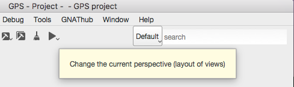

.. _Version_Control_System:

**********************
Version Control System
**********************

.. index:: version control

Version control systems (VCS) are used to keep previous versions of
your files, so that you can refer to them at any point in the future.

GPS provides integration with a number of such systems. It tries to
provide a similar GUI interface for all of them, while preserving
their specific vocabulary and features.

Setting up projects for version control
=======================================

GPS does not come with any version control system. Instead, it expects
that you already have such a system installl on your machine. In some
cases, it is able to automatically recognize them. In other cases, you
will need to edit your project file as described below.

GPS has built in support for the following VCS systems:

* :guilabel:`CVS`

  .. index:: VCS, CVS

  The Concurrent Version System.  To use this, you must have a
  :program:`patch` tool, which usually comes with CVS.
  GPS is automatically able to recognize that your project is using
  this system, but looking for a :file:`CVS` directory in the root
  directory of your project. You can also force it by setting the
  following in your project::

      project Default is
         package IDE is
            for VCS_Kind use "CVS";
         end IDE;
      end Default;

  This can of course be done via the graphical project editor in
  GPS.

* :guilabel:`Subversion`

  .. index:: VCS, Subversion

  The Subversion version control system.
  As for CVS, GPS will automatically recognize that your project is
  using subversion by looking for a :file:`.svn` directory in the root
  directory of your project. You can also force it by setting the
  following in your project::

      project Default is
         package IDE is
            for VCS_Kind use "Subversion";
         end IDE;
      end Default;

* :guilabel:`git`

  .. index:: VCS, Git

  Distributed fast source code management. Again, GPS will automatically
  recognize this by looking for a :file:`.git` directory in your project,
  but you can force this with::

      project Default is
         package IDE is
            for VCS_Kind use "git";
         end IDE;
      end Default;

Previous versions of GPS supported a larger range of systems, but these
have not been ported to the new code yet. Please let us know whether there
is interest in doing so:

* :guilabel:`ClearCase`
* :guilabel:`ClearCase Native`
* :guilabel:`Mercurial`

Most of the version control code in GPS is generic, and customized for
each system via one small python plugin. As a result, it should be possible
to add support for other systems, by creating such plugins. Take a look
at the files in the directory :file:`prefix/share/gps/plug-ins/vcs2` in
your GPS install.

As mentioned before, GPS automatically attempts to guess the correct
version system you are using. This is similar to having the following
declaration in your project::

      project Default is
         package IDE is
            for VCS_Kind use "auto";
         end IDE;
      end Default;

.. index:: password

Note: you must be sure VCS commands can be launched without needing to
enter a password.

In general, you will be have loaded one root project in GPS, but this
is turn imports many other projects. Each of these can use its own
version control system (so you can mix git and subversion for instance
if your sources come from different places), or even the same system
but for a different repository (so you could be cloning multiple git
repositories).

If you have a setup with multiple systems, GPS will show special buttons
in the local toolbars of the views to let you select which is the one to
use for the operations (fetching the history, committing,...) These
operations only apply to one system at a time, you cannot do a single
commit with files that belong to multiple systems (although you can do
a single commit for files that belong to multiple projects, provided
these projects all use the same system and same repository).

Finding file status (:guilabel:`Project` view)
==============================================

Most of the times, you will be using GPS on a project that already exists
and for which version control has already been setup.

For such a project, the first task is to find out what is the status of
the files, i.e. whether they are locally modified, up-to-date, whether
you have created new files but not yet added them to version control,
and so on.

To make this convenient, GPS displays this information in a number of
places, via a small icon and appropriate tooltips.

* The :guilabel:`editor` status bar

  .. image:: vcs-editor.png

  Whenever you are editing a file, GPS displays a small icon in the
  status bar that indicates its current status as seen by GPS. If you
  hover the mouse, it will show a textual status. In this screenshot,
  the file has been modified locally, but not committed yet into the
  version control system (git in this case).

  Clicking on this icon will change to the :ref:`VCS perspective`.

* The :guilabel:`Project` view

  .. image:: vcs-project_view.png

  The :guilabel:`Project` view is convenient to see all your source
  files, grouped by projects and optionally directories. GPS will
  show the same icon as the editor next to the name of each file, so
  that you can easily see their status. Again, the tooltip would show
  the textual status.

* The :guilabel:`Files` view

  This view is similar to the :guilabel:`Project` view, but groups
  files as they are organized on the disk. GPS will try to guess the
  best system here, but there might be ambiguities when the same
  directory is shared among multiple projects which use a different
  VCS system or repository. We do not recommend this setup.

.. _The_VCS_Perspective:

The VCS Perspective
===================

To display all pertinent information on your files, GPS uses multiple
views, as described below. Although you can open any of them whenever
you want, via the :menuselection:`Tools --> Views` menu, the most
convenient is to select the VCS perspective.

This perspective was created to show all VCS related views, and hide
unrelated views. As for all GPS perspectives, you can modify the way
it looks, which views are displayed,... simply by opening new views
or moving them around while this perspective is selected.

See also :ref:`Perspectives` for more information on how to manipulate
them.

There are multiple ways to switch to this VCS perspective: as always,
you can use the toolbar's perspective selector, or the
:menuselection:`Window --> Perspectives` menu. The most convenient
might be to click on the VCS status icon at the bottom of each
editor.

In all of these cases, GPS will change which windows are displayed
on the screen. It will preserve your editors, but close all other
views, and instead show the following:

* The :guilabel:`Project` view, used to check the status of all
  files
* The :guilabel:`Commits` view (:ref:`The_Commits_View`), used to
  select which files should be committed, and do the actual commit
* The :guilabel:`History` view, to view all past commits
* The :guilabel:`Branches` view, to view various pieces of information
  about your repository, depending on which system you use.

.. _The_Commits_View:

The Commits view
================

The purpose of this view is to let you prepare and then commit your
files.

Viewing modified files
----------------------

The view lists all files in your project, to the exception of up-to-date
files (i.e. those files that have been checked out, and never touched
locally), and ignored files (i.e. those files for which you have
explicitly told the VCS that you will never want to commit them).

By default, they are organized into three sections:

* Staged files

  These files will be part of the next commit (see below)

* Modified but unstaged files

  These are locally modified files, which will not be part of the next
  commit, unless you stage them.

  It is possible for a file to be in both groups, when it had been
  modified, then staged, then further modified. If you are using git,
  the later modification have not been staged for commit, and git will
  only commit the first set of changes. Other systems like CVS and
  Subversion will always apply all current change to the file, no
  matter whether they were done before or after the staging operation.

* Unknown files

  These are files found in your directory, but that are unknown to the
  VCS. Sometimes these files should simply be ignored and never committed,
  but sometimes they will be newly created files that you should stage to
  include them in the next commit.

Various local configurations can be selected to change what is displayed
in this view, take a look at the menu and the tooltips.

Committing files
----------------

Committing is always a three step process in GPS (this is exactly
what git does natively, but also provides more flexibility foro
over systems).

* First, you need to select which files will be part of the next
  commit. It is possible that you have been modifying unrelated
  source files, which you do not want to commit yet.

  This is called **staging** the files, and can be performed simply
  by clicking in the checkbox next to the file's name, or by selecting
  multiple files at once and then clicking on the "stage" toolbar
  button.

